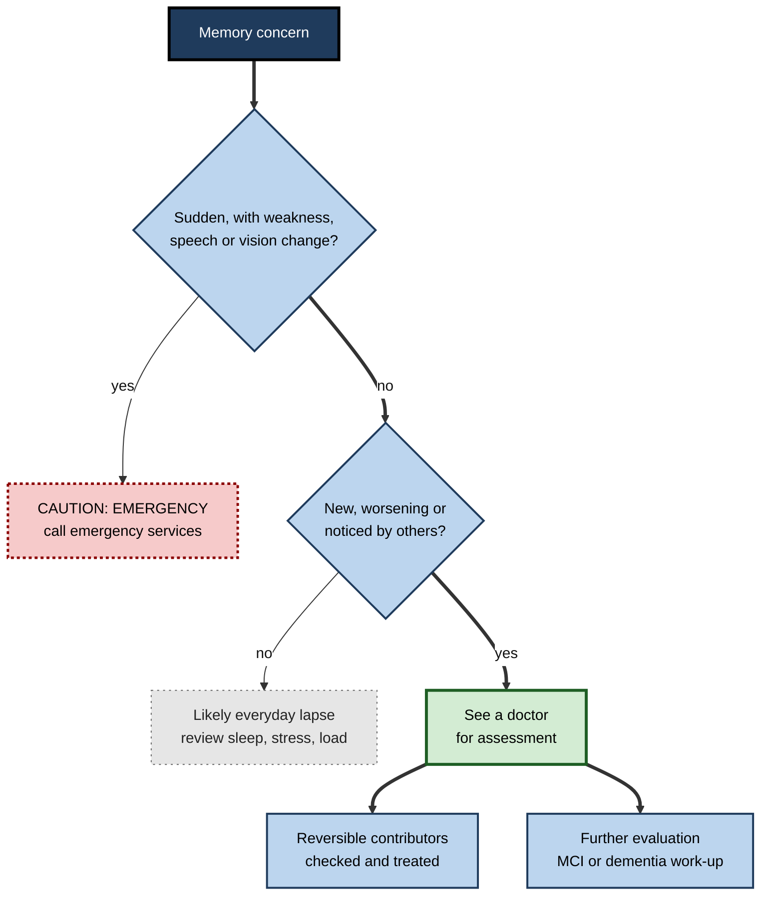
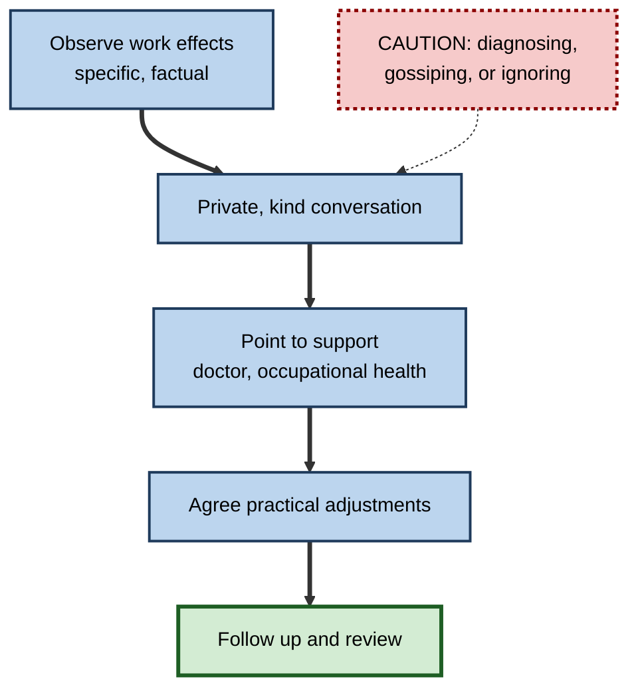

# G.10. Memory Impairment and Disorders

> **In one sentence:** Memory can be impaired by many things — from everyday tiredness and stress to treatable medical issues, brain injury and diseases such as Alzheimer's — and telling ordinary forgetfulness apart from a problem worth checking is a useful, humane skill.
>
> **Why it matters:** Memory problems affect colleagues, clients, family members and, eventually, many of us. Understanding the landscape helps you respond with knowledge rather than fear, support people at work, and know when to encourage a professional assessment.
>
> **Level span:** Novice → Expert · **Reading time:** ~19 min · **Builds on:** stages of memory formation; the hippocampus; sleep; stress
>
> **IMPORTANT — educational content, not medical advice.** This note explains concepts to build understanding. It cannot diagnose anyone, and it is not a substitute for assessment by a qualified clinician. If you are worried about your own or someone else's memory, speak to a doctor. **Sudden memory loss or confusion together with symptoms such as facial drooping, weakness, slurred speech or severe headache is a medical emergency — call emergency services.**

---

## The Learning Ladder

| Level | Badge | After this level you can... |
|---|---|---|
| 1 | NOVICE | Tell everyday forgetting apart from patterns that deserve a professional check. |
| 2 | FOUNDATIONS | Define amnesia, mild cognitive impairment and dementia, and name common causes. |
| 3 | PRACTITIONER | Respond supportively when you or a colleague has memory concerns, including practical adjustments. |
| 4 | ADVANCED | Explain the biology of major disorders, recent diagnostic and treatment developments, and modifiable risk factors. |
| 5 | EXPERT / PRO | Shape inclusive workplace policies, learning design and products for people with memory impairment, ethically. |

---

## Level 1 · Novice — The Big Picture

Everyone forgets. You walk into a room and forget why. You forget a name at a conference. You cannot find your keys. These are normal: a healthy memory is selective and imperfect by design.

Think of memory as a city's road network. On a busy day, traffic jams (stress, tiredness, distraction) make it hard to get anywhere, but the roads are fine. Sometimes a road is blocked for a while (a concussion, a medication side effect) and reopens. And sometimes, slowly, roads begin to close and do not reopen (a progressive disease). The first kind is everyday life. The second and third need attention — the second because it is often fixable, the third because early support makes a big difference.

Signs that usually belong to everyday forgetting:

- Forgetting a name but remembering it later.
- Losing things occasionally and retracing steps to find them.
- Struggling to remember things when tired, stressed or overloaded.

Signs that are worth discussing with a doctor (not a diagnosis):

- Memory problems that are **new, worsening and noticed by others**.
- Repeatedly asking the same questions or retelling the same story within a short time.
- Getting lost in familiar places.
- Difficulty with tasks that used to be routine, such as managing money or following a familiar process at work.
- Changes in personality, judgement or language alongside memory problems.

The beginner's point: **occasional forgetting is normal; a change from your usual self is the signal to get checked.**

---

## Level 2 · Foundations — Core Concepts

### The landscape of memory impairment

| Category | What it is | Examples |
|---|---|---|
| **Everyday lapses** | Normal failures of attention, encoding or retrieval | Tip-of-the-tongue, absent-mindedness |
| **State-related impairment** | Temporary impairment from body or mind states | Sleep deprivation, stress, depression, anxiety, alcohol, some medications |
| **Potentially reversible medical causes** | Conditions that can impair memory and may improve with treatment | Vitamin B12 deficiency, underactive thyroid, sleep apnoea, infections, delirium, some medication effects |
| **Amnesic syndromes** | Specific loss of the ability to form or retrieve memories | Damage to the hippocampus or related structures; Korsakoff syndrome |
| **Brain injury** | Impairment after head trauma or stroke | Concussion, traumatic brain injury, stroke |
| **Neurodegenerative disease** | Progressive loss of neurons | Alzheimer's disease, vascular dementia, Lewy body dementia, frontotemporal dementia |
| **Neurodevelopmental differences** | Lifelong differences in attention and working memory | ADHD, some learning disabilities |
| **Functional cognitive disorder** | Real, distressing memory symptoms without underlying brain disease, often linked to attention and anxiety | Common in memory clinics; treatable with explanation and therapy |

### Key Terms

| Term | Plain meaning |
|---|---|
| **Amnesia** | Significant memory loss. |
| **Anterograde amnesia** | Inability to form new memories after an event. |
| **Retrograde amnesia** | Loss of memories from before an event. |
| **Subjective cognitive decline** | Feeling that your memory has worsened, while tests are normal. |
| **Mild cognitive impairment (MCI)** | Measurable decline greater than expected for age, but daily life largely intact. |
| **Dementia** | An umbrella term for decline in memory and thinking severe enough to interfere with independent daily life; not a single disease. |
| **Alzheimer's disease** | The most common cause of dementia, involving amyloid plaques and tau tangles. |
| **Delirium** | Sudden confusion, often from illness or medication; a medical emergency. |

**Figure G.10-1 — From everyday lapse to disorder: a rough map (educational, not diagnostic).**

*How to read it:* answer from the top; this is an educational orientation only, and any uncertainty is a reason to see a clinician.

---

## Level 3 · Practitioner — Putting It to Work

### If you are worried about your own memory

1. **Notice the pattern, not single lapses.** Keep brief notes for a few weeks: what was forgotten, the context, your sleep and stress.
2. **Check the basics.** Sleep, stress, mood, alcohol, new medications and hearing all affect memory.
3. **See a doctor if the pattern is new or worsening.** Bring your notes and, if possible, someone who knows you well.
4. **Expect a structured assessment.** This may include questions, short memory tests, blood tests, a review of medicines and sometimes brain imaging or specialist referral.
5. **Use compensations meanwhile.** Calendars, checklists, notes and reminders are smart strategies, not admissions of failure.

### If you are concerned about a colleague

1. **Focus on observable work effects with kindness**, not guesses about diagnosis: "I've noticed some deadlines slipping and wanted to check in."
2. **Respect privacy.** Health information is personal; do not speculate with others.
3. **Point to support**: occupational health, an employee assistance programme, their doctor.
4. **Discuss practical adjustments** if needed: written instructions, fewer simultaneous priorities, quieter workspace, flexible scheduling.
5. **Follow your organisation's policies** and local law on disability and reasonable accommodations.

**Figure G.10-2 — A supportive response at work.**

*How to read it:* the thick path is the supportive sequence; the dotted caution lists behaviours to avoid.

### Worked example — supporting a team member after a concussion

| | Before | After |
|---|---|---|
| **Return to work** | Back to full workload on day one. | Phased return agreed with occupational health. |
| **Tasks** | Juggling five projects with verbal briefings. | Two priorities, written instructions, checklists. |
| **Environment** | Open-plan, noisy, many meetings. | Quieter space, fewer meetings, breaks scheduled. |
| **Outcome** | Errors, frustration, symptoms worsen. | Gradual recovery; workload increased in steps. |

### Common mistakes

- **Assuming every memory lapse in an older colleague means dementia.** Most do not.
- **Dismissing memory concerns in younger people.** Younger-onset dementia exists, and many treatable causes affect people of all ages.
- **Avoiding the topic out of awkwardness.** Silence often leads to performance management instead of support.

---

## Level 4 · Advanced — Mechanisms, Models & Evidence

### Amnesic syndromes

- **Hippocampal amnesia**: damage to the hippocampus (from surgery, as in the case of H.M., or from lack of oxygen, encephalitis or stroke) causes dense anterograde amnesia with some retrograde loss, while skills, intelligence and short-term memory can be spared.
- **Korsakoff syndrome**: caused by severe thiamine (vitamin B1) deficiency, usually with heavy alcohol use or malnutrition, affecting structures such as the mammillary bodies and thalamus. Early treatment of the preceding Wernicke encephalopathy with thiamine is crucial.
- **Transient global amnesia**: a sudden, temporary episode (usually hours) of inability to form new memories, with repetitive questioning, typically in middle-aged or older adults; usually benign and non-recurring, but the sudden onset always requires urgent medical evaluation to rule out other causes.

### Mild cognitive impairment and dementia

**MCI** describes measurable decline beyond typical ageing without loss of independence. Some people with MCI progress to dementia, some stay stable and some improve — especially when a reversible cause is found.

**Dementia** types differ in biology and early symptoms:

| Type | Typical early features | Biology (simplified) |
|---|---|---|
| **Alzheimer's disease** | Difficulty learning and retaining new information | Amyloid plaques and tau tangles, starting in medial temporal regions |
| **Vascular dementia** | Slowed thinking, attention and executive problems; can be stepwise | Damage to blood vessels and small strokes |
| **Lewy body dementia** | Fluctuating attention, visual hallucinations, movement symptoms, sleep behaviour changes | Alpha-synuclein deposits |
| **Frontotemporal dementia** | Personality, behaviour or language changes; often younger onset | Several protein pathologies in frontal and temporal lobes |
| **Mixed dementia** | Combination | Common in older adults |

### Recent developments in Alzheimer's diagnosis and treatment

- **Blood tests.** In May 2025, the US Food and Drug Administration cleared the first blood test to aid in diagnosing Alzheimer's disease, based on the ratio of phosphorylated tau (pTau217) to beta-amyloid in plasma, for use in people with symptoms. Blood-based biomarkers are expanding rapidly but are intended for use within clinical evaluation, not as consumer screening tools.
- **Anti-amyloid antibodies.** Lecanemab (approved in the US in 2023) and donanemab (2024) remove amyloid from the brain and modestly slow clinical decline in early symptomatic Alzheimer's disease — in lecanemab's main trial, by about 27 percent on a clinical rating scale over 18 months. They require confirmation of amyloid, regular infusions or injections, and MRI monitoring for side effects called **ARIA** (brain swelling or microbleeds), which are more common in people with the APOE e4 gene variant. Approvals and access differ by country, and debate continues about the size of the benefit relative to risks and costs.
- **Modifiable risk.** The 2024 Lancet Commission identified fourteen modifiable risk factors across the life course — including lower education, hearing loss, high LDL cholesterol, depression, traumatic brain injury, physical inactivity, diabetes, smoking, hypertension, obesity, excessive alcohol, social isolation, air pollution and untreated vision loss — that together may account for an estimated 45 percent of dementia cases at population level. This is a public-health estimate, not an individual guarantee.

### Other common contributors

| Contributor | How it affects memory |
|---|---|
| **Depression and anxiety** | Reduce attention, motivation and encoding; can mimic early dementia, and are also risk factors |
| **Sleep apnoea** | Fragmented sleep and low oxygen impair consolidation and attention |
| **Medications** | Some sleeping tablets, strong anticholinergic drugs and others can impair memory, especially in older adults; never stop medicines without medical advice |
| **Hearing loss** | Increases effort to understand, reducing resources for encoding; untreated hearing loss is a dementia risk factor |
| **Long COVID** | "Brain fog" with attention and memory complaints is common; studies show slow improvement for many people but persisting difficulties in some |
| **ADHD** | Working memory and attention differences affect encoding and prospective memory across the lifespan |
| **Functional cognitive disorder** | Genuine symptoms driven by attention, anxiety and monitoring of memory; recognised increasingly in memory clinics |

### Ageing versus disease

Healthy ageing typically brings slower processing and more difficulty with demanding, divided attention and recalling names, while vocabulary and knowledge are maintained or grow. Disease brings progressive, functionally significant decline. The boundary is blurry, which is why professional assessment matters.

---

## Level 5 · Expert / Pro — Professional Mastery

### Inclusive workplaces

People with memory impairments — after brain injury, with long COVID, with ADHD, with early-stage dementia, or as carers of someone with dementia — are part of every workforce. Professionals design for them:

| Area | Inclusive practice |
|---|---|
| Information design | Written summaries after meetings; clear, consistent document structures |
| Workflows | Checklists, templates and automation for routine steps |
| Tools | Reminders, shared calendars, AI meeting summaries used as aids |
| Time | Flexible scheduling; time to process; fewer interruptions |
| Policy | Clear routes to occupational health and adjustments; carer leave |
| Culture | Psychological safety to disclose without fear |

### Learning design for impaired memory

Learning designers can make training accessible by chunking content, providing job aids, repeating key points across sessions, offering captions and transcripts, allowing self-pacing, and assessing with realistic tasks that permit reference materials where the job allows them.

### Products and AI

AI tools — transcription, summarisation, reminders and agents — can be powerful memory aids for people with impairments. Ethical design requires consent, privacy, data minimisation and avoiding over-reliance that removes autonomy. For memory-health products, claims of diagnosis or prevention are regulated in many countries; a pro ensures claims are evidence-based and lawful.

### Professional scenario

**Role:** HR business partner at a manufacturing company.
**Situation:** A long-serving supervisor in his late fifties is missing safety checks and repeating questions; his manager wants to start a performance process.
**What the pro does:** Pauses the performance route; arranges a private, supportive conversation focusing on observed work effects; encourages a doctor's visit and refers to occupational health; puts interim safety controls in place (a second-person check). After a diagnosis of early-onset dementia, the company agrees adjusted duties, written procedures and a planned transition, in line with disability law and with the employee's involvement.

### Ethical limits

- Never diagnose colleagues or speculate publicly.
- Health information is confidential and legally protected in many jurisdictions.
- Avoid ageist assumptions.
- Encourage professional assessment early; early detection opens access to support, treatment of reversible causes, and planning.

---

## Myths vs. Evidence

| Myth | What the evidence shows |
|---|---|
| "Memory loss is an inevitable part of ageing." | Some slowing is normal; significant, progressive memory loss is not and deserves assessment. |
| "Dementia is a single disease." | It is an umbrella term with many causes, including Alzheimer's, vascular, Lewy body and frontotemporal disease. |
| "Nothing can be done about dementia risk." | An estimated 45 percent of cases may be linked to modifiable risk factors at population level. |
| "New Alzheimer's drugs cure the disease." | They modestly slow decline in early disease, with notable risks and monitoring needs. |
| "Only older people have memory disorders." | Brain injury, long COVID, ADHD, younger-onset dementia and many treatable causes affect all ages. |
| "If memory tests are normal, the complaints are imaginary." | Functional cognitive disorder and subjective decline are real experiences that merit support. |

## Practitioner Toolkit

**Memory-concern conversation checklist (for managers)**

- [ ] I described specific work observations, not diagnoses.
- [ ] I chose a private setting and allowed time.
- [ ] I offered support routes (doctor, occupational health, assistance programme).
- [ ] I discussed practical adjustments.
- [ ] I agreed a follow-up date.
- [ ] I kept the conversation confidential.

**Personal memory-log template (to bring to a doctor)**

| Date | What happened | Context (sleep, stress, illness) | Did someone else notice? |
|---|---|---|---|
| | | | |

*Reminder:* this note is educational, not medical advice. If you are worried, see a doctor; if symptoms are sudden, seek emergency care.

## Self-Check

1. **[NOVICE]** Give two examples of normal forgetting and two signs worth discussing with a doctor.
2. **[FOUNDATIONS]** Define anterograde amnesia, MCI and dementia.
3. **[FOUNDATIONS]** Name three potentially reversible contributors to memory problems.
4. **[PRACTITIONER]** How would you raise a concern with a colleague whose work suggests memory difficulties?
5. **[ADVANCED]** Contrast early features of Alzheimer's disease and frontotemporal dementia.
6. **[ADVANCED]** What are anti-amyloid antibodies, and what are their benefits and risks?
7. **[ADVANCED]** What did the 2024 Lancet Commission conclude about modifiable risk?
8. **[EXPERT / PRO]** List four workplace adjustments that support employees with memory impairment.

### Answer Key

1. Normal: forgetting a name temporarily, misplacing keys. Worth discussing: new, worsening problems noticed by others; getting lost in familiar places; repeated questions.
2. Anterograde amnesia: inability to form new memories. MCI: measurable decline with daily life largely intact. Dementia: decline severe enough to interfere with independent daily living.
3. Any three: vitamin B12 deficiency, underactive thyroid, sleep apnoea, depression, medication effects, infection or delirium, hearing loss.
4. Privately and kindly describe observed work effects, avoid diagnosing, point to support, discuss adjustments, follow up.
5. Alzheimer's typically begins with difficulty retaining new information; frontotemporal dementia often begins with personality, behaviour or language changes, frequently at younger ages.
6. Drugs that remove amyloid; they modestly slow decline in early Alzheimer's but carry risks of brain swelling or microbleeds (ARIA) requiring MRI monitoring.
7. Fourteen modifiable risk factors may account for about 45 percent of dementia cases at population level.
8. Any four: written summaries, checklists and templates, reminders and shared calendars, flexible scheduling, quieter space, fewer simultaneous priorities.

## Key Takeaways

- **Occasional forgetting is normal**; new, worsening problems noticed by others deserve a professional check.
- Memory impairment has **many causes** — many treatable, some progressive.
- **Dementia is an umbrella term**; Alzheimer's is the most common cause.
- Diagnosis is changing with **blood biomarkers**, and **anti-amyloid drugs** offer modest slowing with real risks.
- **Modifiable risk factors** matter across the life course.
- At work, respond with **kindness, privacy and practical adjustments**, not diagnosis.
- This note is **educational, not medical advice**; sudden symptoms are an emergency.

## Glossary

| Term | Meaning |
|---|---|
| Amyloid | A protein forming plaques in Alzheimer's disease. |
| Anterograde amnesia | Inability to form new memories. |
| APOE e4 | A gene variant raising Alzheimer's risk and drug side-effect risk. |
| ARIA | Amyloid-related imaging abnormalities: brain swelling or microbleeds seen on MRI. |
| Delirium | Acute confusion requiring urgent medical care. |
| Dementia | Decline in thinking severe enough to affect independent daily life. |
| Functional cognitive disorder | Real cognitive symptoms without underlying neurodegeneration. |
| Korsakoff syndrome | Amnesia from severe thiamine deficiency. |
| Mild cognitive impairment | Measurable decline without loss of independence. |
| Retrograde amnesia | Loss of memories formed before an event. |
| Subjective cognitive decline | Self-perceived worsening with normal test results. |
| Tau | A protein forming tangles inside neurons in Alzheimer's disease. |
| Transient global amnesia | Sudden, temporary inability to form new memories. |
