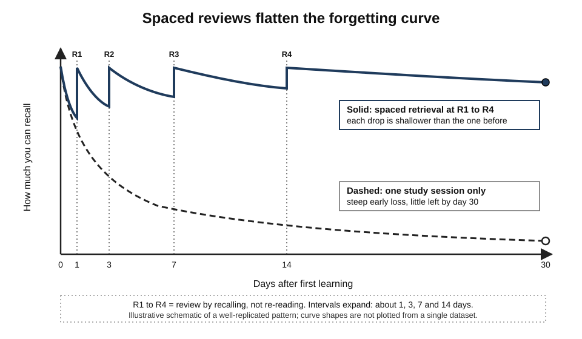
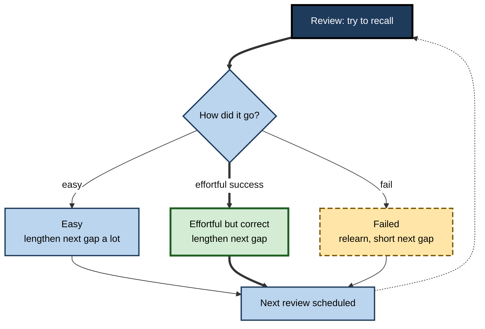

# G.11. Spaced Practice for Consolidation

> **In one sentence:** Spreading practice out over time — with gaps between sessions — gives your brain time to consolidate each round of learning, so the same total study time produces memories that last far longer than cramming.
>
> **Why it matters:** The spacing effect is one of the most robust findings in all of psychology, yet most training, onboarding and studying is still massed into single sessions. Using spacing is one of the highest-return changes an individual or organisation can make to learning.
>
> **Level span:** Novice → Expert · **Reading time:** ~18 min · **Builds on:** stages of memory formation; synaptic plasticity; sleep and consolidation; systems consolidation

---

## The Learning Ladder

| Level | Badge | After this level you can... |
|---|---|---|
| 1 | NOVICE | Explain why studying a little over several days beats one long session. |
| 2 | FOUNDATIONS | Define the spacing effect, lag, retention interval and expanding versus uniform schedules. |
| 3 | PRACTITIONER | Build a spaced retrieval schedule for yourself and choose sensible gaps. |
| 4 | ADVANCED | Explain why spacing works at behavioural, synaptic and systems levels, and the meta-analytic evidence. |
| 5 | EXPERT / PRO | Design spaced programmes and tools at scale, measure them, and handle the organisational barriers. |

---

## Level 1 · Novice — The Big Picture

Imagine watering a plant. If you pour a whole week's water on it on Monday, most runs off, and by Friday the soil is dry. If you water a little every few days, the soil stays moist and the plant grows. Memory works similarly. Learning everything in one big session — **cramming**, or **massed practice** — gives a burst of short-term performance, but much of it "runs off". Spreading learning out — **spaced practice** — lets each session soak in before the next.

The secret is what happens *between* sessions. Each gap gives the brain time — and nights of sleep — to consolidate. When you come back and have to work a bit to remember, that effort strengthens the memory further.

You have already experienced this when:

- You crammed for an exam, passed, and forgot nearly everything within weeks.
- You learned a language phrase by using it on several different days, and it stuck for years.
- You kept coming back to a new tool at work over a few weeks and eventually it became second nature.

The novice rule: **same total time, spread over more days, gives longer-lasting memory.**

---

## Level 2 · Foundations — Core Concepts

### The spacing effect

The **spacing effect** is the finding that, for a fixed amount of study, distributing practice across time produces better long-term retention than massing it together. Hermann Ebbinghaus described it in 1885 in his experiments on his own memory, and it has since been reproduced across hundreds of studies — with words, facts, concepts, mathematics, motor skills, medical knowledge and more — and in animals from fruit flies to humans.

A related idea, the **lag effect**, is that longer gaps between repetitions generally produce better long-term retention than shorter gaps, up to a point.

### Key Terms

| Term | Plain meaning |
|---|---|
| **Massed practice** | Studying all at once, with no gaps (cramming). |
| **Spaced (distributed) practice** | Studying in sessions separated by time. |
| **Gap (lag, inter-study interval)** | The time between study sessions. |
| **Retention interval** | The time between the last study session and when you need the knowledge. |
| **Expanding schedule** | Gaps get longer over time (for example 1, 3, 7, 14 days). |
| **Uniform schedule** | Gaps stay the same (for example every 3 days). |
| **Spaced retrieval practice** | Spacing combined with active recall rather than re-reading. |
| **Spaced repetition system (SRS)** | Software that schedules reviews based on your performance. |

**Figure G.11-1 — Massed versus spaced, with the same total study time.**

```mermaid
%%{init: {'theme':'base','themeVariables':{'fontFamily':'Arial, Helvetica, sans-serif','fontSize':'15px','primaryColor':'#FFFFFF','primaryTextColor':'#111111','primaryBorderColor':'#222222','lineColor':'#333333','secondaryColor':'#F2F2F2','tertiaryColor':'#FFFFFF','clusterBkg':'#FAFAFA','clusterBorder':'#555555','edgeLabelBackground':'#FFFFFF','titleColor':'#111111'}}}%%
flowchart TD
    classDef key     fill:#BCD5EE,stroke:#1F3B5C,stroke-width:2px,color:#000000
    classDef good    fill:#D3ECD3,stroke:#1E5E24,stroke-width:3px,color:#000000
    classDef caution fill:#F6CACA,stroke:#8B0000,stroke-width:2.5px,stroke-dasharray:3 3,color:#000000
    classDef muted   fill:#E6E6E6,stroke:#666666,stroke-width:1px,stroke-dasharray:2 4,color:#222222

    subgraph Massed["MASSED: 4 hours on one day"]
        M1["Hour 1 to hour 4<br/>back to back"]
        M2["Feels fluent<br/>high same-day score"]
        M3["CAUTION: steep forgetting<br/>after the test"]
    end
    subgraph Spaced["SPACED: 1 hour on 4 days"]
        S1["Day 1: learn"]
        S2["Day 2: recall plus fill gaps"]
        S3["Day 5: recall"]
        S4["Day 12: recall"]
        S5["Durable memory<br/>weeks to months"]
    end
    M1 --> M2 --> M3
    S1 ==> S2 ==> S3 ==> S4 ==> S5

    class M1,M2 muted
    class M3 caution
    class S1,S2,S3,S4 key
    class S5 good
```

*How to read it:* both columns use four hours; the thick path on the right places sleep and consolidation between sessions.

---

## Level 3 · Practitioner — Putting It to Work

### Building a spaced retrieval schedule

1. **Decide the retention interval.** When do you need this knowledge, and for how long? A certification in four weeks? A skill for the next five years?
2. **Learn it once properly.** Understand the material in a first session.
3. **Review by recalling, not re-reading.** Each spaced session should start with trying to retrieve the material from memory (flashcards, blank-page summaries, practice problems), then checking and repairing.
4. **Use expanding gaps as a default.** For example: 1 day, 3 days, 1 week, 2 weeks, 1 month. If recall fails, shorten the next gap; if it is easy, lengthen it.
5. **Match gaps to the retention interval.** Research suggests the best single gap is a fraction of the retention interval — roughly 10–20 percent when you need the knowledge weeks later, a smaller fraction for longer horizons. For a test in 30 days, gaps of several days work well; for knowledge needed in a year, gaps of weeks to a month.
6. **Mix topics within a session.** Combining spacing with interleaving (mixing different problem types) helps discrimination and transfer.
7. **Use tools for scale.** Spaced repetition software automates scheduling.

*Figure G.11-2 — Spaced reviews flatten the forgetting curve.* Dashed line: one session, steep loss. Solid line: retrieval reviews at expanding intervals (R1 to R4); each subsequent decline is shallower. Schematic.

### Worked example — a project manager preparing for a professional certification

| | Before | After |
|---|---|---|
| **Plan** | Two full weekends of reading the week before the exam. | 40 minutes, four times a week for six weeks. |
| **Method** | Re-reading and highlighting. | Practice questions from memory; error log reviewed at expanding gaps. |
| **Feeling** | Confident on Sunday night. | Sessions feel harder; some recalls fail. |
| **Outcome** | Passes narrowly; forgets most within a month. | Passes comfortably; uses the knowledge on projects months later. |

**Figure G.11-3 — Adaptive spacing: how each review sets the next gap.**

*How to read it:* the thick path is the ideal "effortful success" zone; the dotted arrow loops back to the next review.

### Common mistakes

- **Spacing re-reading instead of retrieval.** Spacing helps re-reading somewhat, but spaced *retrieval* is far more powerful.
- **Gaps too long at the start.** If you forget everything before the first review, you are relearning from scratch; start with short gaps.
- **Abandoning spacing because it feels slower.** Spaced practice feels harder and less fluent — a sign it is working.
- **Over-reviewing.** Reviewing daily what you already know well wastes time.

---

## Level 4 · Advanced — Mechanisms, Models & Evidence

### How strong is the evidence?

- A major 2006 meta-analysis by Nicholas Cepeda and colleagues, covering hundreds of comparisons, confirmed robust advantages of spaced over massed practice for verbal recall.
- A 2008 study by Cepeda, Harold Pashler and colleagues with over 1,000 participants mapped how the optimal gap depends on the retention interval: as the retention interval grows, the optimal gap grows too, but as a smaller fraction of it.
- Meta-analyses across domains find medium to large benefits; more specific ones, such as second-language vocabulary learning, report larger effects.
- A 2025 meta-analysis of spacing and retrieval practice in mathematics learning found benefits for both, extending evidence beyond memorisation to problem solving, with smaller effects in some classroom settings.
- Medical education has embraced **spaced education**: randomised trials with doctors-in-training found that spaced, question-based online programmes improved long-term retention compared with conventional formats.

### Why spacing works — multiple levels

No single mechanism explains spacing. Current accounts combine several:

| Level | Mechanism | Idea |
|---|---|---|
| **Cognitive** | **Study-phase retrieval** | At each spaced session, you partly retrieve the earlier encounter; effortful retrieval strengthens memory. |
| **Cognitive** | **Deficient processing** | When repetitions are massed, the second one feels familiar and receives less attention. |
| **Cognitive** | **Encoding variability** | Spaced sessions occur in different contexts and mental states, creating more retrieval routes. |
| **Cognitive** | **Working-memory depletion** | A 2025 study found massed learners showed more depletion of working-memory resources; spacing allowed recovery. |
| **Synaptic** | **Spaced induction of LTP** | Spaced trains of stimulation produce more lasting potentiation; repeated spaced activation engages CREB-dependent gene expression and protein synthesis. In fruit flies, spaced (not massed) training produced protein-synthesis-dependent long-term memory, a classic 1990s finding by Tim Tully and colleagues. |
| **Systems** | **Consolidation and sleep between sessions** | Gaps that include sleep allow replay and systems consolidation; a 2025 animal study found that spaced training promoted integration and replay in the cortex. |
| **Systems** | **Reconsolidation-style updating** | Each spaced retrieval may reactivate and re-store the memory in a stronger, better-integrated form (a hypothesis). |

### Expanding versus uniform schedules

Expanding schedules are intuitive and widely used, but head-to-head comparisons show mixed results: in some studies equal spacing does as well or better for long-term retention, particularly when the first gap is long enough to make retrieval effortful. Adaptive schedules — which adjust each gap to the individual item's performance — tend to beat fixed schedules.

### Spaced repetition algorithms

Spaced repetition software began with Sebastian Leitner's card-box system in the 1970s and Piotr Woźniak's SuperMemo algorithms from the late 1980s (the SM-2 algorithm still powers many apps). Newer approaches model each learner's memory with machine learning; for example, the open-source FSRS algorithm, adopted by the popular Anki application in 2023, estimates memory stability and retrievability for each card and schedules reviews to hit a target recall probability. Such models typically aim for about 85–90 percent recall at review time — enough difficulty to be effortful, not so much that reviews become relearning.

### Boundary conditions

- **Very short retention intervals.** If you need something only for the next hour, massed practice can perform as well or better.
- **Complex, high element-interactivity material.** Spacing still helps, but first exposures may need to be massed enough to build understanding.
- **Motor skills.** Spacing generally helps, but results vary with task type.
- **Learner perception.** Learners consistently rate massed practice as more effective than it is — a metacognitive illusion.

---

## Level 5 · Expert / Pro — Professional Mastery

### Designing spaced programmes at scale

| Programme element | Massed default | Spaced redesign |
|---|---|---|
| Onboarding | One-week induction | Short induction plus weekly 20-minute sessions for eight weeks |
| Compliance training | Annual one-hour module | Quarterly five-minute scenario refreshers |
| Sales enablement | Two-day product launch event | Launch plus spaced quiz nudges at 2, 7, 21 and 60 days |
| Leadership programme | Three-day retreat | Monthly half-days over six months with practice between |
| Technical upskilling | Bootcamp | Bootcamp followed by spaced project challenges |

### Measuring spacing's value

- Compare cohorts with delayed tests (four to twelve weeks after training), not end-of-session scores.
- Track on-the-job indicators: error rates, time to independence, escalation rates.
- Expect lower immediate satisfaction scores in spaced programmes; brief stakeholders in advance.

### Organisational barriers and how pros handle them

| Barrier | Pro response |
|---|---|
| "People can't spare time every week." | Spaced sessions are shorter; total time can be the same or less. |
| "Event-based training is easier to schedule." | Use automated nudges, calendar blocks and micro-sessions. |
| "Learners prefer one intensive session." | Explain the fluency illusion; share delayed-test data. |
| "Our LMS only tracks completions." | Add delayed check-ins or use tools that support spaced delivery. |

### AI-era opportunities and risks

AI can generate varied retrieval questions from source material, adapt spacing to individual performance, and deliver short practice through chat or mobile tools. Risks: low-quality or incorrect questions, learner over-reliance on hints, and notification fatigue. Pros keep subject-matter experts in the loop for question quality and protect quiet hours.

### Professional scenario

**Role:** Enablement lead at a cloud-software company launching a new product line to 400 salespeople.
**Situation:** Past launches used a two-day event; three months later, reps could not explain differentiators accurately.
**What the pro does:** Runs a one-day launch focused on core narrative and practice, then delivers spaced scenario questions through the team chat tool at 2, 7, 21 and 60 days, adapting gaps for reps who miss questions. Managers run a five-minute recall exercise in weekly team meetings. At 90 days, a delayed assessment shows far better recall than the previous launch's cohort, and win rates on the new product improve.

---

## Myths vs. Evidence

| Myth | What the evidence shows |
|---|---|
| "Cramming works — I passed." | Cramming can support short-term performance; long-term retention is much worse than with spacing. |
| "Spacing just means doing it more often." | Total time can be identical; what matters is distribution with gaps. |
| "Expanding intervals are always best." | Head-to-head comparisons are mixed; adaptive schedules tend to do best. |
| "Spaced repetition is only for memorising vocabulary." | Benefits extend to concepts, problem solving, mathematics, medicine and skills. |
| "If it feels easy, the schedule is right." | Effortful, successful recall is the target; too easy means gaps are too short. |

## Practitioner Toolkit

**Spaced learning checklist**

- [ ] I know my retention interval.
- [ ] I learned the material properly in a first session.
- [ ] Reviews start with recall, not re-reading.
- [ ] Gaps start short and expand, adjusting to performance.
- [ ] At least one night's sleep falls between sessions.
- [ ] I mix topics within review sessions.
- [ ] I use software or calendar blocks to schedule reviews.

**Starter schedule (adjust to performance)**

| Session | When | Activity |
|---|---|---|
| 1 | Day 0 | Learn and understand |
| 2 | Day 1 | Recall, check, repair |
| 3 | Day 3 | Recall mixed with other topics |
| 4 | Day 7 | Apply to a new problem |
| 5 | Day 14–21 | Recall and explain to someone |
| 6 | Day 45–60 | Recall check; keep in long-term rotation if needed |

## Self-Check

1. **[NOVICE]** Why does spreading study over days beat one long session?
2. **[FOUNDATIONS]** Define gap and retention interval.
3. **[FOUNDATIONS]** What is the difference between expanding and uniform schedules?
4. **[PRACTITIONER]** Design a schedule for learning 100 key terms for a test in four weeks.
5. **[ADVANCED]** Name three cognitive mechanisms proposed to explain the spacing effect.
6. **[ADVANCED]** How does spacing connect to synaptic and systems consolidation?
7. **[ADVANCED]** What did the 2008 Cepeda study show about optimal gaps?
8. **[EXPERT / PRO]** How would you persuade stakeholders to replace a two-day training event with a spaced programme?

### Answer Key

1. Gaps allow consolidation and sleep between sessions, and effortful recall at each session strengthens memory.
2. Gap: time between sessions. Retention interval: time from last session to when the knowledge is needed.
3. Expanding: gaps lengthen over time. Uniform: gaps remain constant.
4. Example: learn in batches, review by recall on days 1, 3, 7 and 14 after each batch, adapt gaps based on misses, and do a mixed review in the final week.
5. Any three: study-phase retrieval, deficient processing, encoding variability, working-memory depletion.
6. Spaced activation produces more durable LTP via gene expression and protein synthesis; gaps with sleep allow replay and integration into cortex.
7. The optimal gap grows with the retention interval but becomes a smaller proportion of it.
8. Show delayed-test evidence, explain the fluency illusion, keep total time similar, automate delivery, and agree on delayed and on-the-job metrics.

## Key Takeaways

- The **spacing effect** is one of psychology's most robust findings.
- Gaps work because they allow **consolidation, sleep and effortful retrieval**.
- **Spaced retrieval** beats spaced re-reading.
- Optimal gaps **scale with the retention interval**; adaptive schedules work best.
- Spacing feels **harder and less fluent** — expect it.
- Organisations can redesign events into **spaced programmes** and measure with **delayed tests**.

## Glossary

| Term | Meaning |
|---|---|
| Adaptive schedule | Review timing that adjusts to each item's performance. |
| Deficient processing | Reduced attention to repetitions that feel familiar. |
| Encoding variability | Different contexts across sessions creating more retrieval routes. |
| Expanding schedule | Gaps that lengthen over time. |
| FSRS | An open-source machine-learning-based spaced repetition scheduler. |
| Gap | Time between study sessions. |
| Lag effect | Longer gaps generally producing better long-term retention. |
| Massed practice | Practice concentrated in one session. |
| Retention interval | Time between last study and the test or use. |
| Spaced repetition system | Software that schedules reviews. |
| Spacing effect | Better retention from distributed practice. |
| Study-phase retrieval | Retrieving earlier encounters during later study, strengthening memory. |
