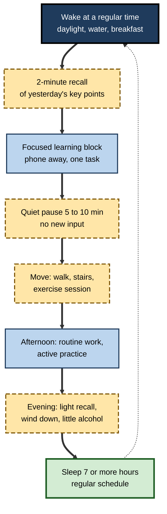
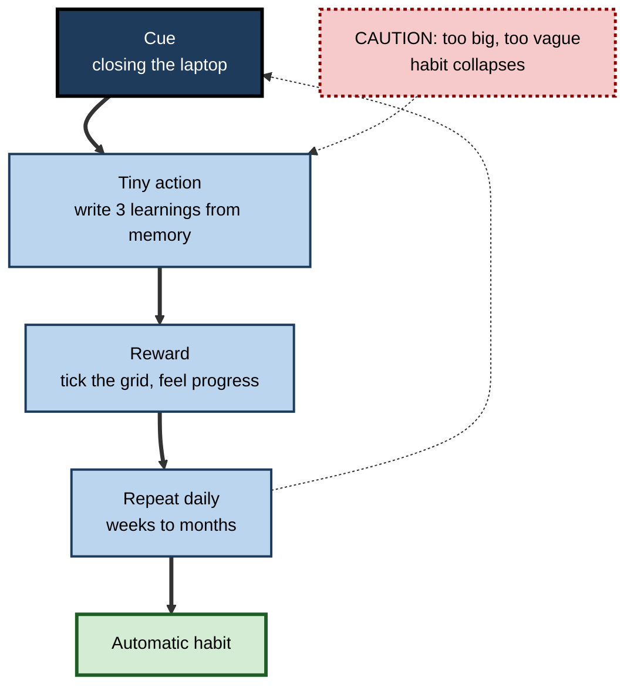

# G.12. Optimizing Daily Habits for Memory

> **In one sentence:** The way you structure an ordinary day — when you sleep, move, eat, focus, rest and review — quietly decides how much of what you learn gets encoded, consolidated and kept.
>
> **Why it matters:** Individual techniques help, but habits compound. A professional who protects sleep, learns in focused blocks, moves regularly, pauses after learning and reviews briefly each day will out-learn a more talented but exhausted, distracted colleague over a career.
>
> **Level span:** Novice → Expert · **Reading time:** ~17 min · **Builds on:** every earlier note in this subtopic — stages, sleep, stress, nutrition, exercise and spacing
>
> **Note:** This is educational content, not medical advice. If you have a health condition or persistent sleep or memory concerns, consult a qualified professional.

---

## The Learning Ladder

| Level | Badge | After this level you can... |
|---|---|---|
| 1 | NOVICE | Name the daily habits that most affect memory. |
| 2 | FOUNDATIONS | Rank habits by strength of evidence and link each to a memory stage. |
| 3 | PRACTITIONER | Build and run a personal memory-friendly daily routine. |
| 4 | ADVANCED | Explain how habits interact, how habits form, and where evidence is weak. |
| 5 | EXPERT / PRO | Shape team norms and organisational systems that make memory-friendly habits the default. |

---

## Level 1 · Novice — The Big Picture

Think of your memory like a garden again. Watering once a month with a fire hose does not work; neither does a single expensive fertiliser. What works is daily, ordinary care: steady water, sunlight, weeding. For memory, the daily care is:

- **Sleep** enough, at regular times.
- **Focus** on one thing at a time when learning.
- **Move** your body during the day.
- **Eat and drink** steadily; go easy on alcohol.
- **Pause** after learning instead of rushing to the next input.
- **Review** briefly: recall today's key points tonight or tomorrow.
- **Manage stress**, and stay connected with people.

You have already experienced this when a good week — decent sleep, some exercise, fewer late nights — made work feel easier and things stuck, while a chaotic week left you foggy and forgetful.

The novice point: **memory is shaped more by everyday routines than by special tricks.**

---

## Level 2 · Foundations — Core Concepts

### Habits mapped to memory stages

| Habit | Main stage it supports | Strength of evidence |
|---|---|---|
| **Regular, sufficient sleep** | Encoding (sleep before) and consolidation (sleep after) | Strong |
| **Spaced retrieval reviews** | Consolidation, durability and retrieval | Strong |
| **Single-tasking during learning** | Encoding | Strong (divided attention reliably impairs encoding) |
| **Regular physical activity** | Encoding, long-term brain health | Moderate (small-to-moderate effects in trials) |
| **Brief quiet rest after learning** | Early consolidation | Moderate in labs; mixed in classrooms |
| **Stress management** | Encoding and retrieval | Moderate |
| **Balanced diet, hydration, limited alcohol** | Encoding today; long-term brain health | Moderate for alcohol and patterns; weak for specific foods |
| **Social connection** | Long-term brain health | Observational (social isolation is a dementia risk factor) |
| **Hearing and vision care** | Encoding; long-term risk | Observational, with some trial support for hearing aids in at-risk groups |
| **"Brain-training" games** | Mostly the trained task itself | Weak for transfer to everyday memory |

**Figure G.12-1 — A memory-friendly day.**

*How to read it:* follow the thick path through one day; the dotted arrow shows sleep feeding into the next morning. Long-dash boxes are small habits that cost minutes.

### Key Terms

| Term | Plain meaning |
|---|---|
| **Sleep regularity** | Going to bed and waking at consistent times. |
| **Chronotype** | Your natural tendency to be a morning or evening person. |
| **Divided attention** | Splitting attention between tasks, which weakens encoding. |
| **Cognitive offloading** | Using external tools to hold information for you. |
| **Habit** | A behaviour triggered automatically by a context cue after repetition. |
| **Implementation intention** | An "if–then" plan linking a situation to an action. |

---

## Level 3 · Practitioner — Putting It to Work

### The Seven-Habit Routine — build it gradually

1. **Anchor sleep.** Choose a fixed wake time, seven days a week where possible. Aim for at least seven hours' sleep opportunity for most adults. Get daylight in the morning.
2. **Protect one focused learning block daily.** 25–90 minutes, phone in another room, notifications off, one task. Put it at your best time of day — earlier for morning types, later for evening types.
3. **Pause after learning.** Spend five to ten minutes without new input — a walk without a podcast, sitting quietly, making tea.
4. **Move every day.** Accumulate activity: walk to meetings, take stairs, schedule three or more exercise sessions a week.
5. **Review with recall.** Before closing your laptop, write the three most important things you learned today from memory. Glance at them the next morning.
6. **Eat and drink steadily.** Regular meals, water at your desk, caffeine early, alcohol light and not on learning nights.
7. **Decompress and connect.** Short stress-reduction practice (breathing, a walk, talking to someone) and regular social contact.

### Making habits stick

- **Start tiny.** "Write three learnings before shutting down" is easier than "review everything".
- **Attach to existing cues.** "After I pour my first coffee, I recall yesterday's points."
- **Use implementation intentions.** "If it is 9 a.m. on a weekday, I start my focus block."
- **Expect it to take time.** A well-known 2010 study by Phillippa Lally and colleagues found it took a median of about 66 days for a new daily behaviour to become automatic, with very wide variation between people and behaviours.
- **Track lightly.** A simple checkmark grid works better than elaborate apps for many people.

**Figure G.12-2 — Building a memory habit loop.**

*How to read it:* the thick path builds automaticity; the dotted loop is daily repetition; the dotted caution shows the common failure.

### Worked example — a consultant on a demanding engagement

| | Before | After |
|---|---|---|
| **Sleep** | 5–6 hours, irregular; late-night email. | Fixed 6:45 a.m. wake time; screens off by 11 p.m. |
| **Learning** | Reads client documents while on calls. | 60-minute morning focus block on client material, phone away. |
| **After learning** | Straight into the next call. | 10-minute walk between the block and the first call. |
| **Review** | None. | Three-line "what I learned today" note each evening; recalled next morning. |
| **Result after a month** | Repeats questions to the client; feels foggy. | Recalls client details accurately; fewer follow-up questions. |

### Common mistakes

- **Changing everything at once.** Pick one or two habits first.
- **Sacrificing sleep for "productivity".** Sleep loss undermines the learning you stayed up for.
- **Multitasking while learning.** Divided attention reliably weakens encoding.
- **Buying products instead of building habits.** Supplements, apps and gadgets rarely beat the basics.

---

## Level 4 · Advanced — Mechanisms, Models & Evidence

### How habits interact

Daily habits are not independent. Exercise improves sleep; sleep improves mood and stress regulation; stress affects appetite and alcohol use; alcohol worsens sleep. This creates **virtuous or vicious cycles**. Interventions targeting a keystone habit — often sleep or exercise — can shift several others.

### Evidence by habit — what recent research adds

- **Sleep regularity** appears to matter in addition to duration: observational studies associate irregular sleep with poorer health and cognitive outcomes. Causality is still being established.
- **Wakeful rest**: a 2025 meta-analysis found a significant benefit of brief post-learning rest for retention, but an ecologically realistic classroom study found no advantage over light distractor tasks. Treat it as low-cost and probably helpful, not guaranteed.
- **Digital interruptions**: frequent task-switching and notifications reduce encoding quality. Evidence that the mere presence of a smartphone reduces available cognitive capacity is mixed; replication attempts have produced smaller or null effects, but keeping devices out of reach during focus blocks remains a sensible low-cost habit.
- **Cognitive offloading and AI**: offloading information to devices frees capacity and often improves immediate performance, but tends to reduce memory for the offloaded information. Studies of generative AI in 2024–2025 report that unrestricted assistance can raise immediate task output while reducing later unaided performance and recall of one's own work. The habit implication: decide deliberately what to remember and what to offload.
- **Social connection**: the 2024 Lancet Commission lists social isolation among modifiable dementia risk factors; the mechanisms may include cognitive stimulation, mood and stress.
- **Hearing**: untreated hearing loss is a major modifiable risk factor; a large 2023 trial found hearing intervention slowed cognitive decline in a subgroup of older adults at higher risk, but not in the whole sample.
- **Brain-training games**: trained-task improvements are reliable, but far transfer to everyday memory and general cognition is weak, according to multiple reviews.

### Chronotype and time of day

Memory performance varies across the day and with chronotype. Morning types tend to perform best earlier, evening types later; adolescents and young adults shift later. Scheduling demanding learning at your personal peak, and avoiding it during your trough, is a reasonable — if modest — optimisation.

### Where evidence is weak

- Exact optimal amounts (minutes of exercise, hours of sleep) vary across people.
- Many lifestyle studies are observational; healthy habits cluster together, making it hard to isolate causes.
- Commercial "memory optimisation" products typically lack rigorous trials.

---

## Level 5 · Expert / Pro — Professional Mastery

### From personal habits to team norms

Individual habits are easier when the environment supports them. Leaders and L&D professionals can shape defaults:

| Team norm | Memory benefit |
|---|---|
| Meeting-free focus blocks | Protects encoding time |
| No-meeting buffers between back-to-back sessions | Allows brief consolidation and transition |
| Asynchronous communication defaults | Fewer interruptions |
| Written meeting summaries with decisions | External memory for details; frees people to attend |
| Respecting off-hours (no expected late-night responses) | Protects sleep |
| Walking one-to-ones | Combines movement and conversation |
| Weekly "what we learned" retros | Spaced team-level retrieval |

### Designing learning products and programmes around habits

- Build **daily micro-review** into programmes (two to five minutes), not just modules.
- Schedule **nudges at sensible hours**, respecting time zones and quiet times.
- Encourage **reflection prompts** at the end of the workday.
- Measure **habit adherence** and **delayed retention**, not only time spent.

### Professional scenario

**Role:** Engineering manager of a distributed team of twelve.
**Situation:** The team must learn a new architecture over a quarter; engineers report constant context-switching and late-night calls with another region.
**What the pro does:** Introduces two meeting-free focus mornings per week, rotates cross-region call times so no one is regularly on calls late at night, adds a 10-minute buffer after each architecture learning session, and runs a weekly 15-minute "explain it back" session where engineers recall and teach a component. Architecture-related review comments and escalations fall over the quarter; engineers report better focus.

### Ethics and inclusion

- Habits are constrained by circumstances: caregiving, shift work, disability, health conditions, financial stress. Offer options, not mandates.
- Avoid moralising about sleep, food or exercise.
- Wellbeing data is personal; collect only with consent and for clear benefit.
- Organisations should fix structural drivers (excessive workload, after-hours expectations) rather than placing the burden only on individuals.

---

## Myths vs. Evidence

| Myth | What the evidence shows |
|---|---|
| "Successful people sleep four hours." | Most adults need seven or more hours; short sleep impairs encoding and consolidation. |
| "Multitasking is efficient for learning." | Divided attention reliably weakens encoding. |
| "Brain games keep your memory sharp." | Benefits mostly stay within the trained games. |
| "A morning routine must be elaborate to work." | Small, consistent habits outperform complex routines. |
| "Habits form in 21 days." | A frequently cited study found a median of about 66 days, with wide variation. |
| "With AI, I don't need to remember anything." | Offloading helps performance but reduces memory; experts choose what to keep in their heads. |

## Practitioner Toolkit

**Daily memory-habit checklist**

- [ ] Woke at my regular time.
- [ ] Recalled yesterday's key points (2 minutes).
- [ ] Completed one focused learning block with the phone away.
- [ ] Took a quiet pause after learning.
- [ ] Moved for at least 30 minutes in total.
- [ ] Ate regular meals and drank water; little or no alcohol.
- [ ] Wrote three learnings before shutting down.
- [ ] Started winding down at a consistent time.

**Weekly habit grid**

| Habit | Mon | Tue | Wed | Thu | Fri | Sat | Sun |
|---|---|---|---|---|---|---|---|
| Regular wake time | | | | | | | |
| Focus block | | | | | | | |
| Post-learning pause | | | | | | | |
| Movement | | | | | | | |
| Evening recall | | | | | | | |

**Implementation-intention starter:** "If I close my laptop at the end of the day, then I write three things I learned from memory."

## Self-Check

1. **[NOVICE]** Name five daily habits that support memory.
2. **[FOUNDATIONS]** Which habits have the strongest evidence, and which stages do they support?
3. **[FOUNDATIONS]** What is an implementation intention?
4. **[PRACTITIONER]** Design a one-week plan to introduce two new memory habits.
5. **[ADVANCED]** Explain how sleep, exercise, stress and alcohol can form a vicious or virtuous cycle.
6. **[ADVANCED]** What does recent research say about cognitive offloading and AI?
7. **[ADVANCED]** Why is the evidence for many lifestyle habits hard to interpret?
8. **[EXPERT / PRO]** List four team norms that support memory-friendly habits.

### Answer Key

1. Any five: regular sleep, focused learning, movement, steady eating and hydration, limited alcohol, post-learning pause, daily recall, stress management, social connection.
2. Sleep (encoding and consolidation), spaced retrieval (consolidation and retrieval), single-tasking (encoding).
3. An if–then plan linking a specific situation to a specific action.
4. Example: fixed wake time plus a three-line evening recall, tracked on a grid, attached to existing cues.
5. Exercise improves sleep, sleep improves stress regulation, stress drives alcohol use, alcohol worsens sleep — improvements or declines in one spread to others.
6. Offloading improves immediate performance but reduces memory; unrestricted AI help can boost output while reducing later unaided performance.
7. Many studies are observational and healthy habits cluster, so causes are hard to isolate.
8. Any four: focus blocks, buffers between meetings, asynchronous defaults, written summaries, off-hours respect, walking one-to-ones, weekly learning retros.

## Key Takeaways

- **Everyday routines shape memory** more than special tricks.
- **Sleep, spaced retrieval and single-tasking** have the strongest evidence.
- **Movement, rest after learning, stress management and diet** add further support.
- Build habits **small, cue-linked and gradual**; expect weeks to months.
- Habits **interact** — improve a keystone habit to lift others.
- **Choose what to offload** to tools and AI; keep what matters in your head.
- Teams can make memory-friendly habits the **default**; this note is educational, not medical advice.

## Glossary

| Term | Meaning |
|---|---|
| Chronotype | Natural tendency toward morning or evening activity. |
| Cognitive offloading | Using external tools to store or process information. |
| Divided attention | Splitting attention across tasks. |
| Far transfer | Improvement on tasks very different from those trained. |
| Habit | Behaviour triggered automatically by a cue. |
| Implementation intention | If–then plan linking situation to action. |
| Keystone habit | A habit whose change triggers changes in others. |
| Sleep regularity | Consistency of sleep and wake times. |
| Social isolation | Lack of social contact; a dementia risk factor. |
| Wakeful rest | Quiet rest without new input after learning. |
