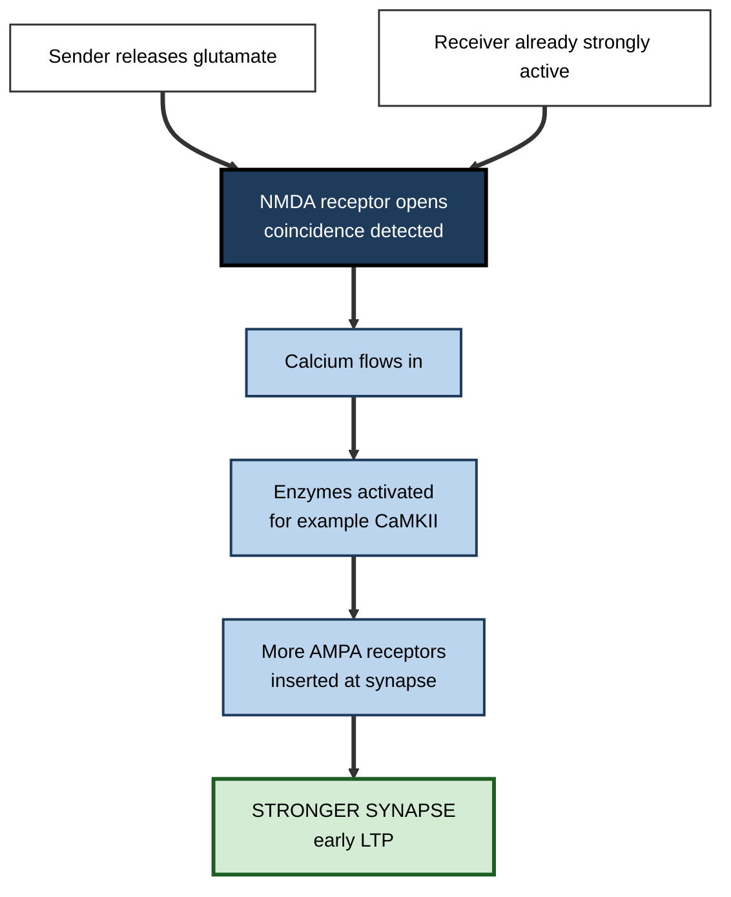
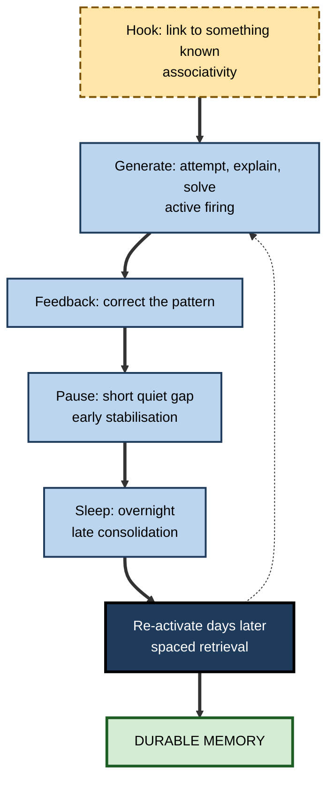
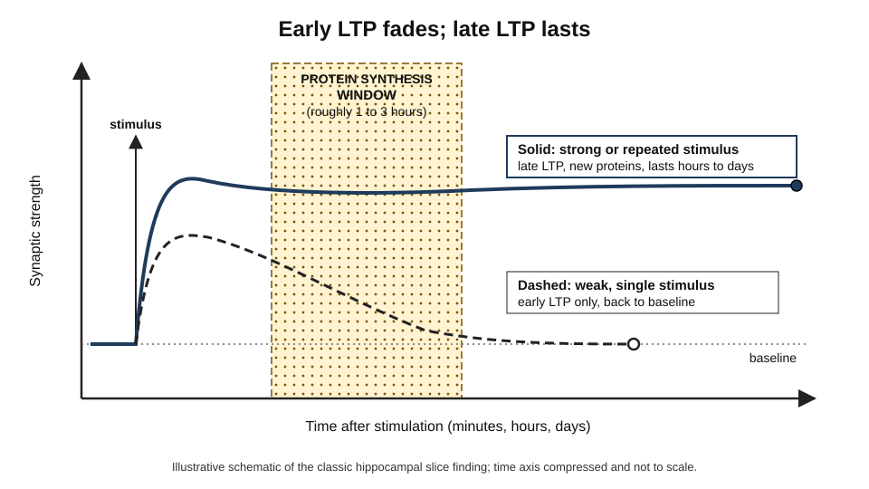

# G.2. Synaptic Plasticity and LTP

> **In one sentence:** Your brain stores memories partly by changing how strongly its nerve cells talk to each other, and long-term potentiation (LTP) is the best-studied way those connections get stronger and stay strong.
>
> **Why it matters:** LTP explains, at the level of cells, why repetition, spacing, attention, novelty and sleep help learning. Knowing the mechanism lets you separate sound advice from "brain-based" marketing.
>
> **Level span:** Novice → Expert · **Reading time:** ~18 min · **Builds on:** the stages of memory formation; the idea that neurons connect at synapses

---

## The Learning Ladder

| Level | Badge | After this level you can... |
|---|---|---|
| 1 | NOVICE | Explain that memories involve stronger connections between brain cells. |
| 2 | FOUNDATIONS | Define synapse, synaptic plasticity, LTP and LTD, and describe how LTP is triggered. |
| 3 | PRACTITIONER | Translate LTP properties into practical learning choices. |
| 4 | ADVANCED | Explain early versus late LTP, synaptic tagging and capture, and the evidence linking LTP to memory. |
| 5 | EXPERT / PRO | Evaluate claims about "rewiring the brain", and use mechanism knowledge responsibly in training design and products. |

---

## Level 1 · Novice — The Big Picture

Your brain contains roughly 86 billion nerve cells, called **neurons**. Each one connects to thousands of others at tiny junctions called **synapses**. When one neuron sends a signal across a synapse, the next neuron may or may not respond, depending on how strong that connection is.

Here is the key idea: **connections that are used together in the right way get stronger, and strong connections make it easier for the same pattern to happen again.** When you learn a colleague's name, a set of neurons representing their face and a set representing the name are active together. The connections between them strengthen, so later, seeing the face is enough to bring up the name.

An everyday analogy is a phone's contacts list. The people you call most appear at the top as "favourites" and are fastest to reach. Strengthened synapses are the brain's favourites list — except the brain's list changes physically, by adding receptors and even growing new structural connections.

You have already experienced this when a skill went from clumsy to automatic. Typing your password, driving a familiar route, writing a common SQL query: the connections supporting those patterns were strengthened again and again until the pattern ran almost by itself.

---

## Level 2 · Foundations — Core Concepts

### Synaptic plasticity

**Synaptic plasticity** means the ability of synapses to change their strength in response to activity. It is the main cellular mechanism believed to store information in the brain. Strength can go up or down:

- **Long-term potentiation (LTP)** — a lasting *increase* in synaptic strength after certain patterns of activity.
- **Long-term depression (LTD)** — a lasting *decrease* in synaptic strength. LTD is not "bad"; it sharpens patterns, prunes noise and keeps the system from saturating.

LTP was first reported in 1973 by Timothy Bliss and Terje Lømo, who stimulated a pathway into the rabbit hippocampus with a rapid burst of pulses and found that the response to later single pulses was larger for hours. In 2023–2024 the field marked fifty years of LTP research with major reviews that still treat it as the leading cellular model of memory.

### How LTP is triggered — the coincidence detector

The most-studied form of LTP, in the hippocampus, depends on a special receptor for the neurotransmitter glutamate called the **NMDA receptor**. It acts as a **coincidence detector**:

1. The sending neuron releases glutamate, which binds to the NMDA receptor.
2. But the receptor's channel is plugged by a magnesium ion unless the receiving neuron is *already strongly active*.
3. Only when both happen at once — input arriving *and* the receiver firing — does the plug pop out, letting calcium flow in.
4. The calcium surge activates enzymes (notably one called CaMKII) that make the synapse stronger, mainly by inserting more **AMPA receptors**, the receptors that carry everyday signalling.

This is a molecular version of Donald Hebb's 1949 idea, often summarised as "cells that fire together wire together". (Hebbian learning in general is the subject of neuroplasticity; here we focus on how LTP implements it for memory.)

**Figure G.2-1 — How a synapse becomes stronger (simplified).**

*How to read it:* both inputs at the top must arrive together; only then does the main path run down to a stronger synapse.

### Key Terms

| Term | Plain meaning |
|---|---|
| **Neuron** | A nerve cell that sends electrical and chemical signals. |
| **Synapse** | The junction where one neuron passes a signal to another. |
| **Synaptic plasticity** | Activity-dependent change in synapse strength. |
| **LTP** | Long-lasting strengthening of a synapse. |
| **LTD** | Long-lasting weakening of a synapse. |
| **NMDA receptor** | A glutamate receptor that opens only when input and receiver activity coincide; triggers most hippocampal LTP. |
| **AMPA receptor** | The receptor that carries routine fast signalling; adding more makes a synapse stronger. |
| **Dendritic spine** | A tiny protrusion on a neuron where most excitatory synapses sit; spines grow, shrink and appear with learning. |

### Three properties of LTP that map onto learning

| LTP property | What it means | Learning parallel |
|---|---|---|
| **Input specificity** | Only the synapses that were active get stronger. | You learn what you actually processed, not what was merely nearby. |
| **Associativity** | A weak input paired with a strong one can be strengthened too. | Linking new information to something already meaningful helps it stick. |
| **Cooperativity** | Several inputs must be active together to cross the threshold. | Rich, multi-cue encoding beats thin, single-cue exposure. |

---

## Level 3 · Practitioner — Putting It to Work

You cannot feel your synapses, so be careful not to over-translate biology into study rules. Still, several well-supported behavioural practices fit comfortably with what LTP research shows.

### Five practical translations

1. **Make the pattern happen, not just appear.** Synapses change when neurons fire. Actively generating an answer, explanation or solution activates the network more fully than passively viewing it.
2. **Pair the new with the known.** Associativity suggests that tying a new fact to a strong existing memory helps. Before learning a new API, recall the similar one you already know and note the differences.
3. **Repeat, but space it.** Strong, lasting LTP typically needs repeated stimulation separated in time; in many experiments, spaced trains of stimulation produce more durable potentiation than the same number crammed together.
4. **Leave room after learning.** Late-phase changes take hours and depend on protein synthesis and, later, sleep. Rest and a normal night's sleep after important learning are part of the process.
5. **Use novelty and relevance wisely.** In animals, a novel experience shortly before or after weak learning can make it last (see "behavioural tagging" in Level 4). In practice, an engaging, surprising, or personally meaningful hook near a key point may help it persist — a hypothesis worth using, not a guarantee.

**Figure G.2-2 — Turning mechanism into a learning session plan.**

*How to read it:* the thick path is one learning cycle; the dotted arrow means each later retrieval re-runs the generate step and strengthens the trace again.

### Worked example — a data engineer learning a new orchestration tool

| | Before | After |
|---|---|---|
| **Approach** | Watches four hours of video in one evening. | Watches 30 minutes, then rebuilds the example pipeline from scratch without the video. |
| **Linking** | Treats the tool as entirely new. | Writes a two-column table: "concept in the old scheduler" versus "equivalent here". |
| **Timing** | Starts real work the next week. | Rebuilds a slightly different pipeline the next day and again four days later. |
| **Outcome** | Has to rewatch the videos. | Builds the first production pipeline with occasional documentation lookups. |

### Common mistakes

- **Equating effort with synaptic change.** Struggle helps only when it involves the right activity — generating the target knowledge — and ends in success.
- **Believing a supplement or app "boosts LTP".** No consumer product has been shown to improve learning in healthy adults by enhancing LTP.
- **Ignoring the forgetting side.** LTD and decay are normal; durable memory needs repeated reactivation.

---

## Level 4 · Advanced — Mechanisms, Models & Evidence

### Early LTP versus late LTP

LTP comes in phases that parallel short- and long-term memory.

- **Early LTP (E-LTP)** lasts roughly one to three hours. It depends on modifying proteins that are already present — for example, phosphorylating and moving AMPA receptors. It does not need new protein synthesis.
- **Late LTP (L-LTP)** lasts many hours to days in slices, and much longer in living animals. It requires gene transcription (switched on by factors such as **CREB**), new protein synthesis, and structural growth: spines enlarge and the synapse is physically rebuilt.

*Figure G.2-3 — Early LTP fades; late LTP lasts.* Dashed line: a weak single stimulus produces early LTP that returns to baseline. Solid line: strong or repeated stimulation engages protein synthesis during the shaded window and the change persists. Schematic, not plotted from a single dataset.

This parallels behaviour: drugs that block protein synthesis shortly after training leave short-term memory intact but prevent long-term memory in animals — the classic signature of synaptic consolidation.

### Synaptic tagging and capture

A puzzle: the new proteins for late LTP are made largely in the cell body, yet only the specific synapses that were active should be strengthened. In 1997 Uwe Frey and Richard Morris proposed **synaptic tagging and capture**. Activity places a temporary "tag" on the stimulated synapses; plasticity-related proteins made anywhere in the cell are then captured only by tagged synapses.

An important consequence: **a weak input that would have produced only early LTP can be converted into late LTP if a strong event elsewhere in the same neuron supplies proteins within a time window.** Studies have extended the estimated window considerably; recent work reported tag–protein interactions across intervals of several hours.

At the behavioural level, this became **behavioural tagging**: in rodents, a weak training experience that normally produces only short-term memory can become long-term if the animal explores a novel environment shortly before or after. Human studies have reported analogous effects — weakly encoded items can be better remembered when they are related to a later salient or rewarded event — but effect sizes and replicability in humans are still being established.

### Does LTP actually cause memory?

For decades, LTP was "the best candidate" mechanism. The case now rests on several converging lines of evidence:

| Line of evidence | Example finding |
|---|---|
| **Mimicry** | Learning produces LTP-like changes in the relevant synapses. |
| **Occlusion** | After learning, it is harder to induce further LTP at those synapses, as if they had already been potentiated. |
| **Blockade** | Blocking NMDA receptors in the hippocampus impairs spatial learning in rats (Richard Morris's water-maze studies in the 1980s). |
| **Erasure** | Reversing potentiation after learning can impair memory. |
| **Engineering** | Optogenetically inducing LTD at specific synapses can inactivate a memory, and re-inducing LTP can restore it in mice. |

Reviews marking LTP's fiftieth anniversary conclude that causal evidence now supports persistent LTP and LTD as mechanisms for acquiring and retaining at least some associative memories, while acknowledging that memory also involves other changes — for example, in neurons' intrinsic excitability, which helps determine which cells join an engram.

### The maintenance problem

Proteins at a synapse turn over within days, yet memories last decades. How is strength *maintained*? One long-studied candidate is an enzyme form called **PKM-zeta**; a 2024 study proposed that its interaction with a scaffolding protein, KIBRA, keeps potentiated synapses tagged and stable. This area has been contested — some knockout studies found memory survived without PKM-zeta, with compensation by related enzymes — so treat any single "memory molecule" claim with caution.

### Boundaries and debates

- LTP measured in slices with electrical stimulation is an experimental model; natural learning involves subtler, distributed changes.
- Not all memory is hippocampal or NMDA-dependent; motor skills, habits and fear learning engage other circuits and plasticity rules.
- The relative importance of synaptic weights versus cell excitability versus network-level patterns is an active research question.

---

## Level 5 · Expert / Pro — Professional Mastery

### Using mechanism without overreaching

Professionals in L&D, education technology and coaching encounter a constant stream of "neuroscience-based" claims. Mechanism knowledge is a filter:

| Claim | Pro's question | Typical verdict |
|---|---|---|
| "Our method rewires your brain." | All learning changes synapses. What behavioural outcome, measured when and against what comparison? | Vacuous unless outcome data exist. |
| "This supplement boosts synaptic plasticity." | Is there a randomised trial in healthy adults showing better learning? | Usually no. |
| "Microlearning matches how neurons work." | Spacing has strong behavioural evidence; "micro" length alone does not. | Partly supported only if spaced and retrieval-based. |
| "Novelty makes learning stick." | Behavioural tagging is real in animals and suggestive in humans. | Plausible design hint, not a guarantee. |

### Designing for synaptic consolidation in programmes

- **Space sessions across days**, so each session's late-phase changes and sleep-dependent consolidation can occur before the next.
- **Avoid flooding**: many similar new items packed into one session compete for the same resources and interfere.
- **Anchor key points to salient moments** — a live demonstration, a real customer story, a surprising failure — placed close to the core content.
- **Require generation**: practice tasks, explain-back, and scenario decisions instead of watch-only content.

### Professional scenario

**Role:** Product manager at an education-technology company.
**Situation:** Marketing wants the home page to say the app "activates long-term potentiation for faster learning".
**What the pro does:** Explains that every learning activity involves synaptic plasticity, so the claim is unfalsifiable and risks regulatory and reputational problems. Proposes instead a claim the company can test: a randomised comparison of spaced retrieval practice versus re-reading on one-month retention among the app's own users. The resulting evidence becomes the marketing claim.

### AI-era note

Artificial neural networks were inspired by synaptic weights, and the analogy is useful: both systems learn by adjusting connection strengths. The differences matter, though. Brains use local learning rules like LTP and LTD, consolidate offline during sleep, and avoid overwriting old knowledge through cooperation between hippocampus and cortex. Researchers in continual learning for AI actively borrow these ideas, which is a reminder that the biological solution is sophisticated — not a simple "strengthen with use".

---

## Myths vs. Evidence

| Myth | What the evidence shows |
|---|---|
| "Learning grows new brain cells." | Most learning changes connections between existing neurons; adult neurogenesis in humans is limited and debated. |
| "Stronger synapses are always better." | Weakening (LTD) is equally important for precise memory and preventing saturation. |
| "One repetition, if intense enough, locks it in." | Lasting LTP usually needs repeated, spaced activation plus protein synthesis; emotional events are the partial exception. |
| "A single molecule stores each memory." | Maintenance involves many interacting processes; single-molecule claims remain contested. |
| "Products can boost LTP to speed learning." | No consumer product has shown this in rigorous trials with healthy adults. |

## Practitioner Toolkit

**Mechanism-informed session checklist**

- [ ] The session starts by activating related prior knowledge.
- [ ] Learners generate answers or products, not only watch.
- [ ] Feedback corrects errors quickly.
- [ ] There is a quiet or low-load pause after the densest part.
- [ ] Follow-up retrieval is scheduled across later days.
- [ ] Claims about the brain in marketing or slides are checked against behavioural evidence.

**Claim-check script (30 seconds):** "Which behaviour improves? Measured after what delay? Compared with what? In whom?"

## Self-Check

1. **[NOVICE]** What physically changes in the brain when you learn, at the level of connections?
2. **[FOUNDATIONS]** What do LTP and LTD stand for?
3. **[FOUNDATIONS]** Why is the NMDA receptor called a coincidence detector?
4. **[PRACTITIONER]** How does associativity justify linking new material to prior knowledge?
5. **[ADVANCED]** What separates early from late LTP?
6. **[ADVANCED]** Explain synaptic tagging and capture in two sentences.
7. **[ADVANCED]** Name two lines of evidence that LTP is involved in memory.
8. **[EXPERT / PRO]** How would you respond to a vendor claiming their programme "boosts LTP"?

### Answer Key

1. The strength of synapses between neurons, through receptor changes and structural growth of spines.
2. Long-term potentiation and long-term depression.
3. It opens fully only when the sending neuron releases glutamate *and* the receiving neuron is already active.
4. A weak input paired with a strong active one can be strengthened, so tying new material to strong existing memories helps it stick.
5. Early LTP lasts about one to three hours and uses existing proteins; late LTP lasts much longer and needs gene expression and new protein synthesis.
6. Activated synapses get a temporary tag. Plasticity proteins made in the cell are captured only by tagged synapses, stabilising them.
7. Any two: mimicry, occlusion, blockade of NMDA receptors impairs learning, erasure of LTP impairs memory, optogenetic LTD/LTP inactivates and restores memory.
8. Ask for behavioural outcome data from controlled comparisons with delayed tests; note that all learning involves plasticity so the claim alone is meaningless.

## Key Takeaways

- Memories are stored largely as **changes in synaptic strength**; LTP strengthens and LTD weakens.
- Hippocampal LTP is triggered when **input and receiver activity coincide** at NMDA receptors.
- **Early LTP fades; late LTP needs protein synthesis** and persists — the cellular basis of consolidation.
- **Synaptic and behavioural tagging** explain how a weak memory can be rescued by a nearby strong event.
- Causal evidence linking LTP to memory is now substantial, but **memory is more than one mechanism**.
- Use the mechanism to **filter claims**, not to invent study rules beyond the behavioural evidence.

## Glossary

| Term | Meaning |
|---|---|
| AMPA receptor | Glutamate receptor carrying routine fast signalling; its number sets synapse strength. |
| Behavioural tagging | Animal finding that a weak memory becomes long-lasting if a novel event occurs nearby in time. |
| CaMKII | An enzyme activated by calcium that triggers early LTP. |
| CREB | Transcription factor that switches on genes for late LTP and long-term memory. |
| Dendritic spine | Small protrusion holding a synapse; grows with potentiation. |
| Early LTP | Short-lived potentiation using existing proteins. |
| Late LTP | Lasting potentiation requiring gene expression and protein synthesis. |
| LTD | Long-term depression; lasting weakening of a synapse. |
| LTP | Long-term potentiation; lasting strengthening of a synapse. |
| NMDA receptor | Glutamate receptor acting as a coincidence detector for LTP. |
| Synaptic plasticity | Activity-dependent change in synaptic strength. |
| Synaptic tagging and capture | Mechanism by which tagged synapses capture proteins for lasting change. |
