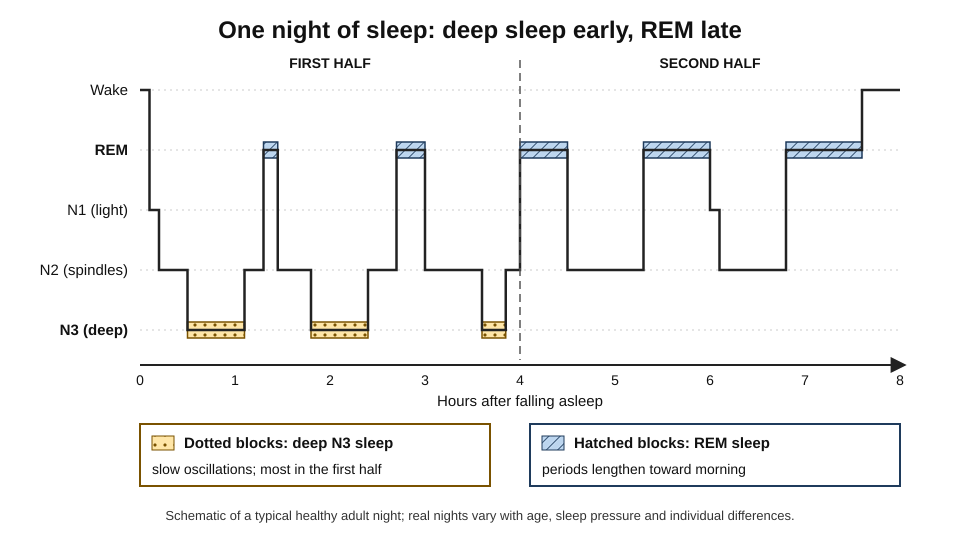
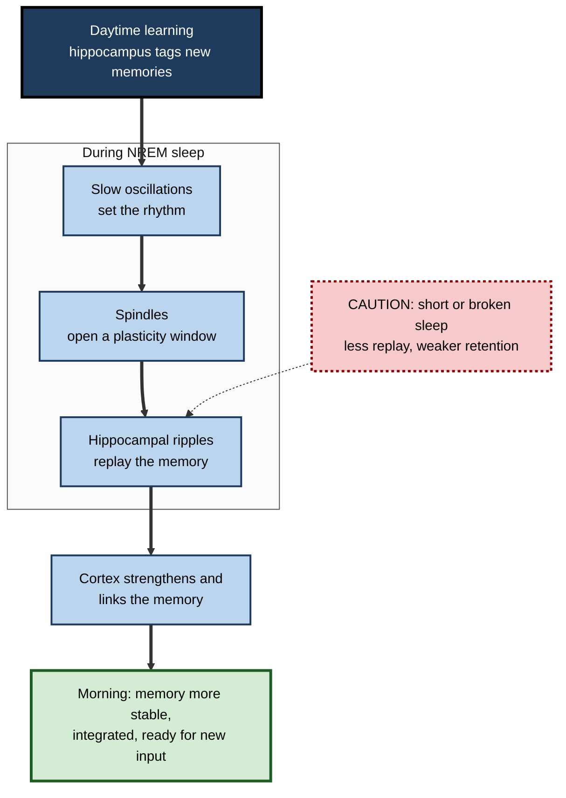

# G.3. Sleep and Memory Consolidation

> **In one sentence:** Sleep is not just rest from learning — while you sleep, your brain replays and reorganises what you learned during the day, so memories are more stable and better connected in the morning.
>
> **Why it matters:** Sleep is one of the cheapest, best-evidenced learning tools available. Skipping it before learning makes you take in less; skipping it after learning makes you keep less. Teams that routinely trade sleep for extra hours pay for it in what people remember and how well they think.
>
> **Level span:** Novice → Expert · **Reading time:** ~19 min · **Builds on:** stages of memory formation; synaptic consolidation

---

## The Learning Ladder

| Level | Badge | After this level you can... |
|---|---|---|
| 1 | NOVICE | Explain why a good night's sleep helps you remember what you learned. |
| 2 | FOUNDATIONS | Name the sleep stages and say which kinds of memory each one is linked to. |
| 3 | PRACTITIONER | Plan learning, naps and deadlines so sleep works for memory instead of against it. |
| 4 | ADVANCED | Explain active systems consolidation, the spindle–ripple coupling, synaptic homeostasis, targeted memory reactivation and the strength of the evidence. |
| 5 | EXPERT / PRO | Design schedules, policies and products that protect sleep-dependent learning, and recognise overclaims. |

---

## Level 1 · Novice — The Big Picture

Think of your brain at the end of the day as an office after a busy launch. Papers are everywhere: notes from meetings, half-finished ideas, new contacts. Overnight a cleaning and filing crew comes in. They sort what matters into the right folders, link related documents, and throw out clutter. In the morning, things are easier to find. **Sleep is that overnight filing crew.**

Two simple facts follow:

1. **Sleep before learning** gets your brain ready to take in new information. A sleepy brain is like an inbox that is already full.
2. **Sleep after learning** helps lock in what you learned. Memories that are followed by sleep usually last better than memories followed by the same number of hours awake.

You have already experienced this when:

- You struggled with a problem late at night, slept, and the solution seemed obvious in the morning.
- You practised a piece of music or a sports move, and the next day it felt smoother even though you had not practised since.
- You pulled an all-nighter before an exam and found your mind "blank" when you needed it.

The novice rule: **protect the night before and the night after anything important you need to learn.**

---

## Level 2 · Foundations — Core Concepts

### The architecture of a night

Sleep is not one state. It cycles through stages roughly every 90 minutes, four to six times a night.

| Stage | What it is like | Brain signature | Memory link (broad picture) |
|---|---|---|---|
| **N1** | Drowsy transition | Slowing brain waves | Little direct role |
| **N2** | Light but true sleep; about half the night | **Sleep spindles** — short bursts of fast waves | Declarative memory; also motor skill learning |
| **N3 (slow-wave sleep, SWS)** | Deep sleep, hard to wake from | **Slow oscillations** — large, slow waves | Consolidation of facts and events (declarative memory) |
| **REM** | Rapid eye movement; vivid dreams; muscles relaxed | Fast, wake-like activity | Emotional memory processing; some procedural and creative-insight effects (evidence more mixed) |

N2 and N3 together are called **non-REM (NREM) sleep**. Deep N3 sleep is concentrated in the first half of the night; REM periods get longer toward morning. That is why cutting sleep short at either end removes different things.

*Figure G.3-1 — One night of sleep: deep sleep early, REM late.* Dotted blocks mark deep N3 sleep, concentrated in the first half; hatched blocks mark REM, which lengthens toward morning. Schematic of a typical healthy adult.

### Key Terms

| Term | Plain meaning |
|---|---|
| **Declarative memory** | Memory for facts and events you can put into words. |
| **Procedural memory** | Memory for skills and how to do things. |
| **Slow oscillation** | A very slow, large brain wave (around one per second) during deep sleep that coordinates activity across the brain. |
| **Sleep spindle** | A burst of faster waves lasting about a second, generated by the thalamus, common in N2 and N3. |
| **Sharp-wave ripple** | A very brief, high-frequency burst in the hippocampus during which recent experiences are replayed. |
| **Replay** | Reactivation, during rest or sleep, of the same neural patterns that were active while learning. |
| **Sleep pressure** | The build-up of need for sleep across waking hours. |

**Figure G.3-2 — What sleep does for memory, step by step.**

*How to read it:* the thick path follows a memory through one night; the dotted arrow shows where sleep loss interferes.

---

## Level 3 · Practitioner — Putting It to Work

### The Sleep-Smart Learning Plan

1. **Schedule important learning when you are rested.** Avoid deep learning after a short night; use those days for routine work.
2. **Learn before a normal night, not before an all-nighter.** Material studied in the evening followed by full sleep tends to be retained well.
3. **Spread learning across several nights.** Each sleep consolidates the previous session; a three-evening plan beats one long evening.
4. **Guard both ends of the night.** Going to bed late cuts into deep sleep early in the night; waking very early cuts REM.
5. **Use naps strategically.** A nap of roughly 20–90 minutes after a learning block can aid retention, particularly when it contains NREM sleep. Keep naps earlier in the day so night sleep is not disturbed.
6. **Avoid alcohol as a "sleep aid".** It fragments sleep and suppresses REM, and heavy drinking around learning is linked to poorer memory.
7. **Retest after sleep.** Check what you remember the morning after, then repair gaps.

**Figure G.3-3 — Cramming versus sleep-spread preparation.**

```mermaid
%%{init: {'theme':'base','themeVariables':{'fontFamily':'Arial, Helvetica, sans-serif','fontSize':'15px','primaryColor':'#FFFFFF','primaryTextColor':'#111111','primaryBorderColor':'#222222','lineColor':'#333333','secondaryColor':'#F2F2F2','tertiaryColor':'#FFFFFF','clusterBkg':'#FAFAFA','clusterBorder':'#555555','edgeLabelBackground':'#FFFFFF','titleColor':'#111111'}}}%%
flowchart TD
    classDef key     fill:#BCD5EE,stroke:#1F3B5C,stroke-width:2px,color:#000000
    classDef good    fill:#D3ECD3,stroke:#1E5E24,stroke-width:3px,color:#000000
    classDef caution fill:#F6CACA,stroke:#8B0000,stroke-width:2.5px,stroke-dasharray:3 3,color:#000000

    subgraph A["Plan A: cram"]
        A1["6 hours study<br/>the night before"]
        A2["4 hours sleep"]
        A3["CAUTION: tired encoding,<br/>little consolidation"]
    end
    subgraph B["Plan B: spread"]
        B1["2 hours, evening 1"]
        B2["Full sleep"]
        B3["2 hours, evening 2<br/>start with recall"]
        B4["Full sleep"]
        B5["Short recall check<br/>on the day"]
    end
    A1 --> A2 --> A3
    B1 ==> B2 ==> B3 ==> B4 ==> B5

    class A1,A2 key
    class A3 caution
    class B1,B2,B3,B4 key
    class B5 good
```

*How to read it:* both plans use similar study time; Plan B places sleep between sessions so each night consolidates the previous one.

### Worked example — a product manager preparing for a board presentation

| | Before | After |
|---|---|---|
| **Preparation** | Writes and memorises the narrative the night before until 2 a.m. | Drafts the narrative three days out; rehearses aloud once each evening. |
| **Sleep** | Four and a half hours. | Normal sleep each night. |
| **On the day** | Loses the thread when questioned about a metric. | Recalls the structure and numbers; handles questions flexibly. |

### Common mistakes

- **Believing you can "catch up" fully at the weekend.** Recovery sleep helps alertness but does not undo encoding deficits from earlier in the week.
- **Treating caffeine as a substitute for sleep.** It masks sleepiness but does not restore sleep-dependent consolidation.
- **Learning heavily on the night of a red-eye flight or a shift change.**
- **Assuming "I'm fine on five hours".** People who are chronically short of sleep consistently underestimate their own impairment.

---

## Level 4 · Advanced — Mechanisms, Models & Evidence

### From "passive protection" to "active consolidation"

In 1924 John Jenkins and Karl Dallenbach found that people forgot less after sleeping than after the same interval awake. For decades this was explained as **passive protection**: sleep simply shields memories from interference. Later work showed that sleep does more than shelter memory — it actively processes it.

The leading framework, the **active systems consolidation** account developed by Jan Born, Susanne Diekelmann, Björn Rasch and colleagues, proposes:

1. During learning, the hippocampus rapidly binds the features of an experience.
2. During NREM sleep, **slow oscillations** in the cortex orchestrate **thalamic spindles**, which in turn group **hippocampal sharp-wave ripples**.
3. Each ripple replays a compressed version of recent experience. When ripples are nested inside spindles at the right phase of the slow oscillation, information is passed to the cortex while the cortex is primed for plastic change.
4. Over repeated nights, the memory becomes more integrated with existing knowledge in the cortex.

Recordings in epilepsy patients with implanted electrodes have provided direct evidence of replay and ripples in the human brain, and a 2024 review of human replay emphasises that it also contributes to prioritising important experiences and to generalisation.

### The synaptic homeostasis hypothesis

Giulio Tononi and Chiara Cirelli proposed a complementary idea: waking learning increases synaptic strength overall, which is costly and eventually saturating. Slow-wave sleep **downscales** synapses across the board, preserving relative differences while restoring capacity to learn the next day. Active consolidation (strengthening specific traces) and downscaling (renormalising the whole system) are not mutually exclusive; many researchers think both occur.

### Targeted memory reactivation (TMR)

If replay matters, can we steer it? In **targeted memory reactivation**, a sound or smell is paired with learning, then replayed quietly during NREM sleep. A widely cited 2020 meta-analysis pooling 91 experiments with about 2,000 participants found reliable benefits of cueing during N2 and slow-wave sleep — not during REM — for both declarative and skill memories. Research since 2024 has refined the picture: cueing tends to enhance neutral aspects more than emotional ones, can promote relational and inferential memory, and cueing efficacy depends on precise timing with slow oscillations.

TMR is a research tool, not yet a consumer product. Effects in individual labs are modest and vary, and commercial devices claiming to boost learning during sleep have not demonstrated robust benefits in independent trials.

### How strong is the evidence?

| Question | Current picture |
|---|---|
| Does sleep loss *before* learning impair encoding? | Yes. A 2021–2022 meta-analysis reported a medium-sized impairment (Hedges' g around 0.6). |
| Does sleep loss *after* learning impair retention? | Yes, on average, though the effect is smaller and more variable than for pre-learning loss. |
| Is partial sleep restriction as harmful as total deprivation? | A 2024 meta-analysis of five decades of studies found effects of restriction on memory comparable to deprivation overall, with total deprivation worse when it occurs before encoding. |
| Are the studies trustworthy? | Both meta-analyses flagged publication bias and low statistical power; the direction is robust, exact sizes are uncertain. |
| Do naps help? | Generally yes for declarative learning, including in young children; size depends on nap length and content. |

### Rest without sleep

Brief periods of quiet wakeful rest immediately after learning — sitting with eyes closed, no new input — have been shown in many lab studies to improve later recall compared with doing a distracting task, and a 2025 meta-analysis confirmed a significant overall effect. Classroom-based studies are more mixed: one ecologically realistic study found no advantage over light distractor tasks. Hippocampal ripples also occur during waking rest, suggesting a mechanism similar to sleep.

### Ageing and individual differences

Deep slow-wave sleep and spindles decline with age, and these declines correlate with poorer overnight memory retention in older adults. Sleep disorders such as obstructive sleep apnoea fragment sleep and are associated with memory complaints; treating them can help. Chronotype (being a "lark" or an "owl") affects when people sleep best but not whether they need sleep.

### Contested side topics

- **The glymphatic "brain-washing" hypothesis.** A 2013 mouse study suggested sleep greatly increases clearance of waste from the brain. A 2024 study using a different method reported *reduced* clearance during sleep in mice, reigniting debate; other 2024–2026 work, including a human crossover trial, supports sleep-related clearance. Treat popular claims that "sleep flushes out toxins" as plausible but scientifically unsettled.
- **REM sleep and creativity.** Some studies link REM to novel associations and insight; others do not replicate cleanly. Treat as promising, not settled.

---

## Level 5 · Expert / Pro — Professional Mastery

### Sleep as a learning-design variable

Professionals who design learning — and managers who design work — make choices that either protect or destroy sleep-dependent consolidation.

| Design choice | Sleep-hostile | Sleep-friendly |
|---|---|---|
| Bootcamp format | 10-hour days plus evening socials | 6-hour days; key content early; evenings free |
| Global teams | Training scheduled at 7 a.m. or 10 p.m. local time for some regions | Rotating time slots or recorded content plus live practice in daytime |
| Certification | Exam the morning after a release deadline | Exam scheduled after a recovery night |
| On-call rotations | Training in the week after night shifts | Training placed in rested weeks |
| Product design | Push notifications for study streaks late at night | Quiet hours; streaks that do not penalise sleep |

### Metrics a pro might track

- Distribution of learning sessions by local time of day.
- Proportion of programme participants on night shift or on call during the programme.
- Next-day retention scores compared with same-day scores (a large drop can flag poor consolidation conditions).

### Professional scenario

**Role:** Engineering director at a company running quarterly "hack weeks" plus intensive onboarding for new hires.
**Situation:** New hires are joining at hack week, working late into the night, and later show poor recall of core architecture concepts from onboarding sessions held during the same week.
**What the pro does:** Moves onboarding content out of hack week entirely; caps late-night work for new hires; schedules architecture sessions across the following two weeks in mornings, each followed by a next-day recall exercise. Time-to-first-independent-change improves the following quarter.

### Ethical and policy limits

- Do not moralise sleep. Carers, parents of infants, shift workers and people with insomnia often cannot simply "sleep more". Designing flexible learning schedules is more useful than prescribing bedtimes.
- Wearable sleep scores are estimates with known error, especially for staging; do not use them for performance management.
- Sleep disorders are medical conditions; persistent problems warrant professional evaluation, not productivity hacks.

### AI-era note

Learning platforms can now detect when a learner studies and when they return. Responsible products use this to recommend a recall session the next day rather than encouraging late-night bingeing. AI tutors that keep a learner engaged far into the night may raise immediate engagement metrics while undermining consolidation.

---

## Myths vs. Evidence

| Myth | What the evidence shows |
|---|---|
| "You can learn new material while asleep from audio recordings." | Learning genuinely new complex material during sleep is not supported; cueing *already learned* material (TMR) can modestly help. |
| "Some people thrive on five hours." | A very small genetic minority may need less; most people who claim this underestimate their impairment. |
| "Sleep only protects memories from interference." | Sleep actively reorganises and strengthens memories through replay. |
| "Weekend lie-ins fully repay weekday sleep debt." | Recovery sleep helps alertness but does not fully restore cognition or undo lost learning. |
| "Sleep's main job is flushing toxins." | Brain clearance during sleep is an active, contested research area; memory functions are better established. |

## Practitioner Toolkit

**Sleep-for-learning checklist**

- [ ] Important learning is scheduled on days after a normal night.
- [ ] Learning is spread across at least two nights.
- [ ] I do not study late into the night before a test or presentation.
- [ ] I take a short quiet break immediately after an intense learning block.
- [ ] Naps, if used, are earlier in the day and do not disrupt night sleep.
- [ ] I check recall the morning after and repair gaps.
- [ ] Persistent sleep problems have been discussed with a health professional.

**Evening routine template (for learning weeks)**

| Time before bed | Action |
|---|---|
| 3 hours | Last large meal and last alcohol, if any |
| 1–2 hours | Final short review: recall the day's three key points without notes |
| 1 hour | Screens dimmed; no new demanding material |
| Morning | Two-minute recall of yesterday's points before email |

## Self-Check

1. **[NOVICE]** Why does sleeping after learning help you remember?
2. **[NOVICE]** Why is an all-nighter before an exam a poor strategy?
3. **[FOUNDATIONS]** Which sleep stage dominates the first half of the night, and which the second?
4. **[FOUNDATIONS]** What are sleep spindles and slow oscillations?
5. **[PRACTITIONER]** Design a three-day plan for learning a new framework that uses sleep well.
6. **[ADVANCED]** Describe the slow oscillation–spindle–ripple sequence in active systems consolidation.
7. **[ADVANCED]** What is targeted memory reactivation, and in which sleep stages does it work best?
8. **[ADVANCED]** Why should you be cautious about exact effect sizes in sleep-deprivation research?
9. **[EXPERT / PRO]** Name three changes an organisation could make to protect sleep-dependent learning.

### Answer Key

1. During sleep the brain replays and reorganises new memories, strengthening and integrating them.
2. Sleep loss impairs encoding and removes the overnight consolidation of what was studied.
3. Deep N3 slow-wave sleep dominates early; REM dominates later.
4. Spindles are second-long bursts of fast waves from the thalamus; slow oscillations are large, roughly one-per-second waves in deep sleep. Both coordinate memory consolidation.
5. Example: day 1 evening study plus full sleep; day 2 begin with recall, then new material, full sleep; day 3 recall check and repair.
6. Cortical slow oscillations time thalamic spindles, which group hippocampal ripples carrying replayed memories, enabling transfer to cortex during a plastic window.
7. Re-presenting a cue associated with learning during sleep to bias replay; it works best in N2 and slow-wave sleep.
8. Meta-analyses found publication bias and low statistical power; direction is robust but magnitudes may be inflated.
9. Any three: avoid late or very early sessions, spread bootcamps across days, keep training out of on-call and night-shift weeks, avoid tests after deadlines, design products with quiet hours.

## Key Takeaways

- Sleep **before** learning prepares encoding; sleep **after** learning consolidates.
- **NREM sleep** (slow oscillations, spindles, ripples) is central for fact and event memory; REM is linked to emotional processing.
- Replay during sleep **actively reorganises** memories toward the cortex.
- **Partial sleep loss** harms memory almost as much as total loss, on current evidence.
- **Spread learning across nights** and protect the night before and after key learning.
- **Quiet rest** after learning can help; naps help many learners.
- Claims about learning during sleep and sleep "detox" are **overstated or contested**.

## Glossary

| Term | Meaning |
|---|---|
| Active systems consolidation | Theory that sleep replay transfers and integrates memories into cortex. |
| Declarative memory | Memory for facts and events that can be stated. |
| Glymphatic system | Proposed fluid pathway for clearing brain waste; its sleep dependence is debated. |
| Hypnogram | Chart of sleep stages across a night. |
| NREM sleep | Non-rapid-eye-movement sleep: stages N1, N2 and N3. |
| Procedural memory | Memory for skills and procedures. |
| REM sleep | Rapid-eye-movement sleep, associated with vivid dreams. |
| Replay | Reactivation of learning-related neural patterns during rest or sleep. |
| Sharp-wave ripple | Brief, fast hippocampal oscillation carrying replay. |
| Sleep spindle | Short burst of fast waves from the thalamus during NREM sleep. |
| Slow oscillation | Large, slow wave of deep sleep that coordinates consolidation. |
| Synaptic homeostasis hypothesis | Theory that sleep downscales synapses strengthened during waking. |
| Targeted memory reactivation | Using cues during sleep to bias replay of specific memories. |
| Wakeful rest | Quiet, low-stimulation rest while awake, which can aid consolidation. |
