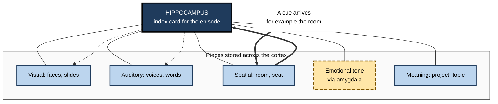
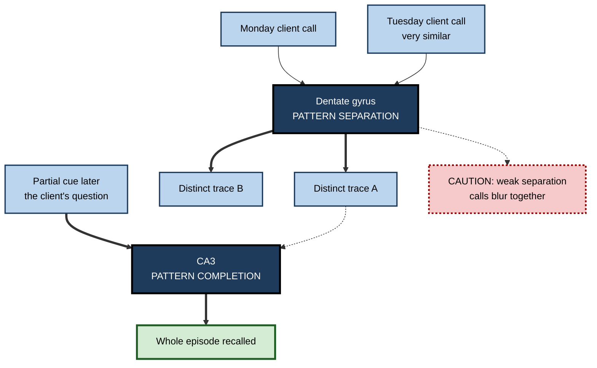

# G.4. The Role of the Hippocampus

> **In one sentence:** The hippocampus is a small, curved structure deep in each side of the brain that quickly ties together the pieces of an experience — what, where and when — so it can be remembered later, and it acts as the brain's index and map.
>
> **Why it matters:** Almost every new fact, event, place and conversation you need to remember at work passes through the hippocampus first. Its strengths (fast binding, mapping, imagination) and weaknesses (sensitivity to stress, sleep loss and ageing) explain many everyday memory successes and failures.
>
> **Level span:** Novice → Expert · **Reading time:** ~18 min · **Builds on:** stages of memory formation; synaptic plasticity

---

## The Learning Ladder

| Level | Badge | After this level you can... |
|---|---|---|
| 1 | NOVICE | Say where the hippocampus is and what it does in plain words. |
| 2 | FOUNDATIONS | Describe its main jobs: binding, indexing, mapping, and its role in new memories versus skills. |
| 3 | PRACTITIONER | Use hippocampus-friendly practices: rich context, distinct episodes, active navigation, protected sleep. |
| 4 | ADVANCED | Explain pattern separation and completion, place and grid cells, index theory, and the case of H.M. |
| 5 | EXPERT / PRO | Apply hippocampal principles to knowledge work, tool design and organisational learning, with appropriate caution. |

---

## Level 1 · Novice — The Big Picture

Deep inside your brain, one on each side, sits a structure about the length of your little finger, curled like a seahorse. Its name, **hippocampus**, comes from the Greek for "seahorse".

Think of the hippocampus as a **librarian with a card catalogue**. When something happens to you, the details are stored in many parts of the brain: the sounds in hearing areas, the faces in visual areas, the feelings in emotional areas. The hippocampus does not store all of those details itself. Instead, it writes an index card that says "these pieces belong together, from this moment, in this place". Later, when you see one piece — a face, a smell, a location — the card lets the brain pull up the rest.

The hippocampus is also your **inner map-maker**. It helps you know where you are, how places connect and how to get from one to another.

You have already experienced it at work when:

- You walked into a meeting room and suddenly remembered a conversation that happened there weeks ago.
- You could picture where on a page or slide a fact appeared.
- You found your way around a new office building after a few days without needing signs.

The novice point: **the hippocampus is the fast "glue" for new experiences and the brain's map.**

---

## Level 2 · Foundations — Core Concepts

### What the hippocampus does

| Job | Plain meaning | Work example |
|---|---|---|
| **Binding** | Linking the separate elements of an event into one memory. | Remembering who said what in last Tuesday's stand-up. |
| **Indexing** | Storing a pointer to the cortical pieces rather than the full content. | A familiar phrase pulls back the whole client meeting. |
| **Spatial mapping** | Building a mental map of places and routes. | Navigating a new campus or a large codebase's folder structure (by analogy). |
| **Fast learning** | Forming a memory from a single experience. | Remembering a one-time incident in production. |
| **Imagining and planning** | Recombining past elements to simulate the future. | Picturing how tomorrow's workshop will unfold. |
| **Novelty detection** | Signalling when something is new and worth remembering. | Noticing that a dashboard looks "off". |

### What it does *not* mainly do

The hippocampus is critical for **declarative** memory — facts and events — but not for most **skill learning** or **habit formation**, which rely more on other circuits such as the basal ganglia and cerebellum. Working memory — holding a phone number for a few seconds — also largely works without it.

### The case of H.M.

In 1953, surgeons removed much of the hippocampus and surrounding tissue on both sides of the brain of Henry Molaison (known for decades as "H.M.") to treat severe epilepsy. Brenda Milner and William Scoville reported in 1957 that he could no longer form new lasting memories of facts or events. Yet he could hold information briefly, his intelligence was intact, many older memories remained, and he could learn new motor skills such as mirror drawing — improving day by day while not remembering having practised. His case established that:

- memory is a separate function from intelligence and perception;
- there are multiple memory systems;
- the hippocampal region is essential for forming new declarative memories.

**Figure G.4-1 — The hippocampus as an index linking cortical pieces.**

*How to read it:* plain lines are links stored at learning; thick arrows show a cue reaching the index; dotted arrows show the index reactivating the other pieces.

### Key Terms

| Term | Plain meaning |
|---|---|
| **Medial temporal lobe** | The inner part of the temporal lobe, containing the hippocampus and nearby cortex. |
| **Entorhinal cortex** | The main gateway between hippocampus and the rest of the cortex. |
| **Dentate gyrus** | Hippocampal input region that makes similar experiences distinct. |
| **CA3 and CA1** | Hippocampal subregions; CA3 can complete partial patterns, CA1 relays outputs. |
| **Place cell** | A hippocampal neuron that fires when an animal is in a particular location. |
| **Grid cell** | An entorhinal neuron that fires in a repeating triangular grid across space. |
| **Pattern separation** | Making similar memories distinct so they do not blur together. |
| **Pattern completion** | Recalling a whole memory from a partial cue. |

---

## Level 3 · Practitioner — Putting It to Work

### Five hippocampus-friendly habits

1. **Give each learning episode a distinct context.** Distinctive settings, examples and stories help pattern separation, so similar sessions do not blur together. Name sessions ("the outage post-mortem with the red diagram") rather than "meeting 14".
2. **Use space as a scaffold.** The hippocampus is a map-maker. Spatial organisation — a consistent layout for notes, a physical or visual "memory palace", diagrams with stable positions — gives memories a location to hang on.
3. **Navigate actively sometimes.** Following turn-by-turn directions requires little map-building. Studies associate habitual reliance on GPS with poorer spatial memory, though these are mostly correlational. Try planning a route yourself in a new city before checking the app.
4. **Protect sleep and manage chronic stress.** The hippocampus is especially sensitive to both, and needs sleep to hand memories over to the cortex.
5. **Expect partial cues to work.** Pattern completion means a single strong cue can bring back an episode. Leave yourself rich cues: a photo of the whiteboard, a one-line summary tagged with who was there.

**Figure G.4-2 — Separate, then complete: keeping similar memories apart and getting them back.**

*How to read it:* top half stores similar events as separate traces; bottom half shows a partial cue retrieving a whole trace. The dotted caution branch is what happens when separation fails.

### Worked example — a sales lead remembering many similar prospects

| | Before | After |
|---|---|---|
| **Notes** | Generic CRM notes, same template, no context. | Each note starts with one distinctive detail: setting, a memorable remark, a visual. |
| **Preparation** | Reads all notes in one sitting the morning of a busy day. | Reviews the next day's three prospects the evening before, picturing each meeting. |
| **Outcome** | Mixes up two prospects' requirements. | Recalls each prospect's priorities from the distinctive cue. |

### Common mistakes

- **Making every session look identical.** Same room, same template, same slides: great for efficiency, poor for distinct memories.
- **Over-relying on location cues.** Context helps, but if you learn something only in one setting, recall elsewhere may be weaker. Vary practice settings once the basics are learned.
- **Assuming navigation apps are harmless for learning a city.** They are excellent tools; they just do not build your map.

---

## Level 4 · Advanced — Mechanisms, Models & Evidence

### Circuit in brief

Information from across the cortex converges on the **entorhinal cortex**, enters the hippocampus at the **dentate gyrus**, passes to **CA3** (which has dense recurrent connections, so it can act as an autoassociative network), then **CA1**, and back out via the subiculum and entorhinal cortex to the cortex. This loop supports:

- **Pattern separation** in the dentate gyrus: sparse firing and, in some species, adult-born neurons help orthogonalise similar inputs.
- **Pattern completion** in CA3: recurrent connections let a partial cue reinstate a full stored pattern.
- **Comparison and output** in CA1: matching expectation against input, signalling novelty.

### Hippocampal indexing theory

Proposed by Timothy Teyler and Pascal DiScenna in 1986 and later updated, **indexing theory** holds that the hippocampus stores a compact index of which cortical patterns were active together during an episode. Retrieval reactivates the index, which reinstates the cortical pattern. Engram studies in mice fit this well: reactivating a small set of tagged hippocampal neurons can drive recall of a full contextual memory.

### Maps of space, time and concepts

- John O'Keefe discovered **place cells** in the rat hippocampus in 1971; May-Britt and Edvard Moser later discovered **grid cells** in entorhinal cortex. The three shared the 2014 Nobel Prize in Physiology or Medicine.
- **Time cells** fire at particular moments within a sequence, suggesting the hippocampus encodes temporal structure, not just space.
- Human imaging studies suggest the same mapping machinery organises abstract "spaces" — social hierarchies, concept dimensions — a line of work often called **cognitive maps**.
- Eleanor Maguire's studies of London taxi drivers, beginning in 2000, found that drivers who learned the city's layout had larger posterior hippocampi than controls, and that changes emerged over training, an influential example of experience-related structural change.

### Imagination and the future

Patients with hippocampal damage often struggle not only to remember the past but also to imagine richly detailed future or fictional scenes. This supports the idea that the hippocampus constructs scenes from elements, serving both memory and planning.

### Replay and sharp-wave ripples

During rest and sleep, hippocampal **sharp-wave ripples** carry compressed replays of recent experiences, sometimes in reverse or in novel combinations. In humans, ripple rates rise during successful recall and, according to a 2024 study, during spontaneous self-generated thought. Disrupting ripples in rodents impairs memory; prolonging them improves it.

### Vulnerabilities

| Vulnerability | Evidence summary |
|---|---|
| **Chronic stress** | The hippocampus has many glucocorticoid receptors; prolonged stress hormones impair hippocampal plasticity in animals and are associated with smaller volume in humans. |
| **Sleep loss** | Impairs hippocampal encoding activity the next day. |
| **Ageing** | Gradual volume loss and reduced pattern separation, which may explain more confusion between similar memories. |
| **Alzheimer's disease** | Early pathology appears in the entorhinal cortex and hippocampus, explaining why new-memory problems are often the first sign. |
| **Oxygen deprivation and some infections** | CA1 neurons are especially sensitive. |

### Open debates

- **Adult neurogenesis in humans.** Rodents clearly produce new dentate gyrus neurons in adulthood. In humans, 2018 studies reached opposite conclusions about whether neurogenesis continues meaningfully into adulthood; the question remains contested.
- **Does the hippocampus remain needed for old memories?** Theories differ on whether detailed episodic memories ever become independent of it — the subject of systems consolidation.

---

## Level 5 · Expert / Pro — Professional Mastery

### Applying hippocampal principles to knowledge work

| Principle | Professional application |
|---|---|
| Binding needs attention | Single-tasking in meetings where you need to remember who committed to what. |
| Distinctiveness reduces interference | Vary examples and stories across similar training modules; give projects memorable code names. |
| Space scaffolds memory | Keep stable layouts in documentation and dashboards so users build a map; avoid reshuffling navigation every release. |
| Partial cues retrieve wholes | Decision logs with "who, where, what, why" make past decisions retrievable months later. |
| Imagination uses memory | Pre-mortems and scenario planning draw on a rich bank of episodic experiences — another reason experience diversity matters. |

### Designing tools that do not starve the map

Product teams increasingly face a design choice: tools that *replace* the user's mental model (auto-navigation, AI that answers without showing structure) versus tools that *build* it (overviews, breadcrumbs, maps of the information space). For expert users who must later work without the tool, the second approach supports long-term competence.

### Professional scenario

**Role:** Head of knowledge management at a consulting firm.
**Situation:** Consultants say they "cannot remember" lessons from past engagements; the knowledge base is a flat list of near-identical slide decks.
**What the pro does:** Introduces a short, distinctive case story at the top of every engagement summary (the client's key surprise, the turning-point meeting), adds a stable visual map of practice areas, and runs quarterly "case retrieval" sessions where teams reconstruct past engagements from a single cue before checking the archive. Usage and recall of prior lessons improve.

### Ethical limits

Brain-structure findings are easily overinterpreted. A larger hippocampus in a group of taxi drivers does not mean a brain-training app will "grow" your hippocampus, and structural scans are not tools for judging employees. Use these findings to understand learning, not to rank people.

---

## Myths vs. Evidence

| Myth | What the evidence shows |
|---|---|
| "The hippocampus is where memories are stored forever." | It indexes and binds; content is distributed across cortex, and older memories reorganise over time. |
| "Without a hippocampus you cannot learn anything." | H.M. learned new motor skills; skill and habit learning use other systems. |
| "Brain-training games grow your hippocampus." | Structural growth claims for commercial games lack robust support; real-world navigation and exercise have better evidence. |
| "Adults definitely grow lots of new hippocampal neurons." | Human adult neurogenesis is contested. |
| "Memory problems in old age are always Alzheimer's." | Some decline in pattern separation is normal ageing; only assessment can distinguish disease. |

## Practitioner Toolkit

**Hippocampus-friendly learning checklist**

- [ ] I attended fully during the event I need to remember.
- [ ] I captured one distinctive cue for each similar episode.
- [ ] I used a consistent spatial layout for notes or diagrams.
- [ ] I practised recalling from a partial cue before checking.
- [ ] I slept normally after the learning day.
- [ ] I varied the context of practice after initial learning.

**Episode capture template (for meetings and incidents)**

| Who | Where / setting | Distinctive cue | Decision or fact | Why |
|---|---|---|---|---|
| | | | | |

## Self-Check

1. **[NOVICE]** Where is the hippocampus and what is its nickname?
2. **[NOVICE]** Give a work example of the hippocampus acting as an index.
3. **[FOUNDATIONS]** What did the case of H.M. reveal about memory systems?
4. **[FOUNDATIONS]** Which kinds of memory depend least on the hippocampus?
5. **[PRACTITIONER]** How would you reduce confusion between many similar client meetings?
6. **[ADVANCED]** Contrast pattern separation and pattern completion and name the subregions involved.
7. **[ADVANCED]** What are place cells and grid cells?
8. **[ADVANCED]** Why does hippocampal damage impair imagining the future?
9. **[EXPERT / PRO]** How might a product team design a tool that builds rather than replaces users' mental maps?

### Answer Key

1. Deep in the medial temporal lobe on each side; "seahorse".
2. Example: hearing a project code name brings back the meeting, people and decisions linked to it.
3. Forming new declarative memories depends on the hippocampal region, while short-term memory, intelligence, old memories and skill learning can survive — so memory has multiple systems.
4. Procedural skills, habits, and short-term or working memory.
5. Add distinctive cues per meeting, review each separately, and compare them explicitly.
6. Separation makes similar inputs distinct (dentate gyrus); completion recovers a whole from part (CA3).
7. Place cells fire at specific locations; grid cells fire in repeating triangular grids across space.
8. Imagining requires recombining stored scene elements, a constructive function supported by the hippocampus.
9. Provide overviews, stable layouts, breadcrumbs and explanations of structure rather than only direct answers.

## Key Takeaways

- The hippocampus **binds** the pieces of an experience and stores an **index**, not the whole memory.
- It is essential for forming new **facts and events**, not for most skills and habits.
- **Pattern separation** keeps similar memories apart; **pattern completion** retrieves wholes from parts.
- It builds **maps** of space, time and even concepts, and supports **imagination**.
- It is sensitive to **stress, sleep loss, ageing and Alzheimer's disease**.
- Distinct contexts, spatial scaffolds and active navigation are **practical hippocampus-friendly habits**.

## Glossary

| Term | Meaning |
|---|---|
| CA1 | Hippocampal output subregion that compares and relays information. |
| CA3 | Hippocampal subregion with recurrent connections that supports pattern completion. |
| Cognitive map | An internal representation of the layout of an environment or concept space. |
| Dentate gyrus | Hippocampal input region supporting pattern separation. |
| Entorhinal cortex | Gateway between the hippocampus and the rest of the cortex; home of grid cells. |
| Grid cell | Neuron firing in a regular triangular grid across space. |
| Hippocampal indexing theory | Theory that the hippocampus stores pointers to cortical patterns of an episode. |
| Medial temporal lobe | Inner temporal brain region containing the hippocampus. |
| Pattern completion | Retrieving a whole memory from part of it. |
| Pattern separation | Making similar memories distinct. |
| Place cell | Neuron that fires when an animal is at a specific location. |
| Time cell | Neuron that fires at a specific moment in a sequence. |
