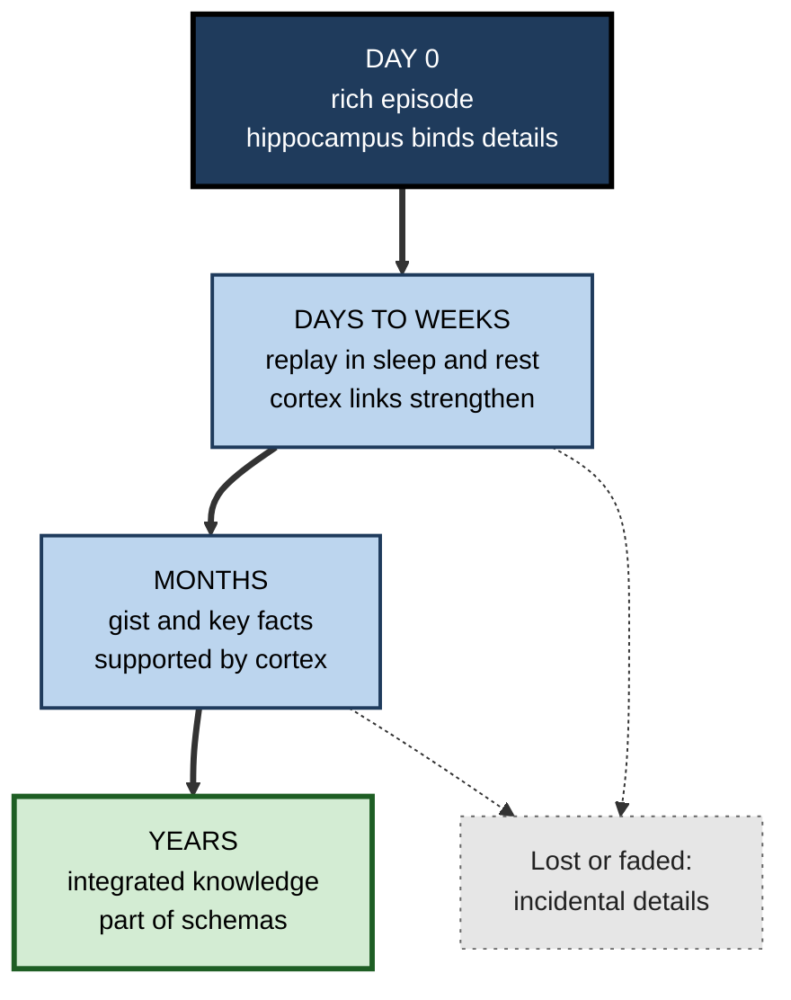
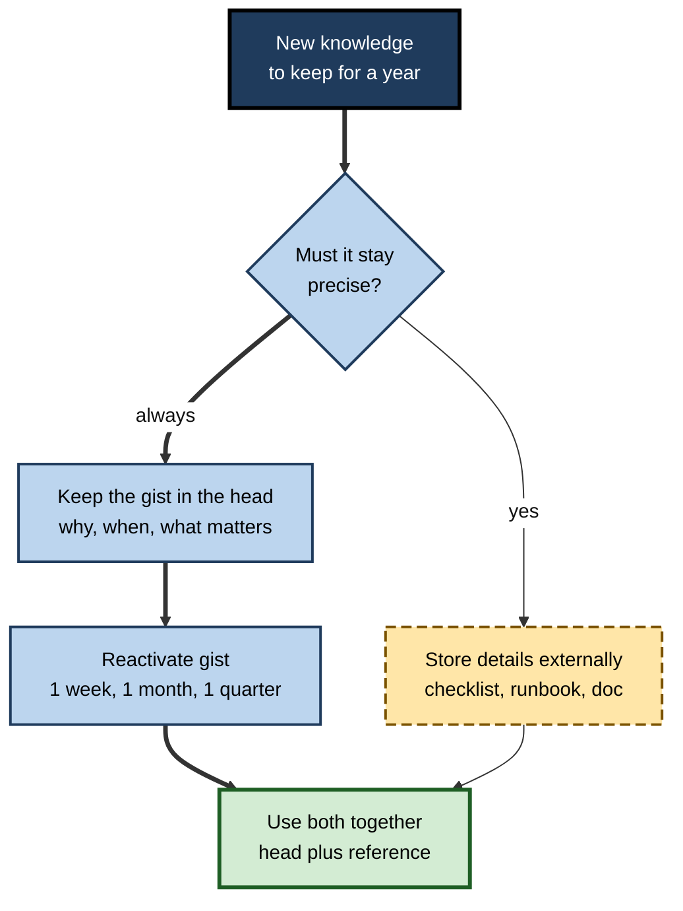
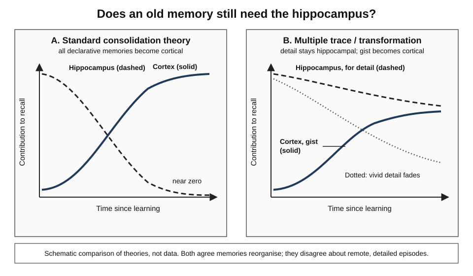

# G.5. Systems Consolidation Over Time

> **In one sentence:** Over weeks, months and years, memories slowly reorganise — shifting from depending on the hippocampus toward being supported by the cortex, while vivid details tend to fade and the general gist becomes woven into what you already know.
>
> **Why it matters:** This slow reorganisation explains why old knowledge feels solid but less detailed, why experts absorb new material in their field faster, and why one-off training rarely survives the year. Designing for the long haul means designing for systems consolidation.
>
> **Level span:** Novice → Expert · **Reading time:** ~18 min · **Builds on:** stages of memory formation; the role of the hippocampus; sleep and consolidation

---

## The Learning Ladder

| Level | Badge | After this level you can... |
|---|---|---|
| 1 | NOVICE | Explain that memories change and settle over months and years, not just overnight. |
| 2 | FOUNDATIONS | Describe the hippocampus-to-cortex shift, gist versus detail, and the role of prior knowledge. |
| 3 | PRACTITIONER | Plan learning and knowledge capture so important details and gist both survive over time. |
| 4 | ADVANCED | Compare standard consolidation, multiple trace, trace transformation, contextual binding and complementary learning systems theories. |
| 5 | EXPERT / PRO | Use schema-based acceleration and long-horizon reinforcement in professional development and organisational memory. |

---

## Level 1 · Novice — The Big Picture

Think about your first day at your current job. You probably remember the general shape — where you sat, who welcomed you, how you felt — but many details are gone: what you ate for lunch, the exact words in your welcome email. Meanwhile, what you learned that day has become part of how you just *know* things about the company.

That change over time is **systems consolidation**: memories reorganise across the brain over weeks to years. A useful analogy is moving from a busy project workspace to a well-organised archive. New work lives on the desk (the hippocampus) where all the specifics are at hand. Over time, the important parts are summarised and filed into the permanent library (the cortex), connected to related files. The summary is durable and easy to use with other knowledge; some of the original detail is lost or stays only in the desk drawer.

You have already experienced this when:

- A childhood memory feels like a story you know rather than a scene you relive.
- You can explain how a process works but cannot remember the meeting where you learned it.
- A topic you studied years ago still makes sense, even though you cannot recall the textbook.

The novice point: **memories do not freeze after the first night; they keep reshaping for a long time.**

---

## Level 2 · Foundations — Core Concepts

### Two clocks of consolidation

| | Synaptic consolidation | Systems consolidation |
|---|---|---|
| **Time scale** | Minutes to hours | Days to years |
| **Where** | Within the neurons that were active | Across brain regions — hippocampus, cortex, prefrontal areas |
| **What changes** | Strength and structure of specific synapses | Which networks support the memory, and its content |
| **Main driver** | Protein synthesis, gene expression | Repeated reactivation (replay in sleep and rest, and later retrieval) |

### What changes during systems consolidation

1. **Dependence shifts.** Recent memories rely heavily on the hippocampus; older ones are increasingly supported by cortical networks.
2. **Content transforms.** Vivid, context-rich details tend to fade, while the **gist** — the core meaning — persists and becomes more general.
3. **Integration grows.** The memory becomes linked with related knowledge, turning episodes into **semantic knowledge** (general facts and concepts) and into **schemas** (organised frameworks of knowledge).

**Figure G.5-1 — How a memory reorganises over time.**

*How to read it:* the thick path follows a memory over time; dotted arrows show detail being shed at each step.

### Key Terms

| Term | Plain meaning |
|---|---|
| **Systems consolidation** | Slow reorganisation of a memory across brain regions. |
| **Recent versus remote memory** | Memories from days or weeks ago versus months or years ago. |
| **Gist** | The central meaning of an experience, without peripheral details. |
| **Semanticisation** | The process by which episodic memories turn into general knowledge. |
| **Schema** | An organised framework of knowledge that guides understanding and memory. |
| **Medial prefrontal cortex** | Front, middle part of the brain that helps integrate memories with existing schemas. |
| **Temporal gradient** | The pattern in which recent memories are more vulnerable to hippocampal damage than remote ones. |

---

## Level 3 · Practitioner — Putting It to Work

### The Long-Horizon Memory Plan

Because consolidation keeps going for months, what you do *after* initial learning shapes what survives.

1. **Decide what must stay detailed.** Some knowledge must survive with precision (exact dosage limits, safety thresholds, contract clauses). Other knowledge only needs the gist (why a design decision was made). Label each.
2. **Capture details externally.** Gist survives in memory better than details. Put precise numbers, steps and edge cases in checklists, runbooks and reference docs.
3. **Reactivate the gist at widening intervals.** Brief recall — explain it to a colleague, apply it to a case — at one week, one month and one quarter keeps the memory active as it reorganises.
4. **Connect it to existing frameworks.** New knowledge that fits a schema consolidates faster. Before learning, sketch where it fits in what you already know.
5. **Refresh the episode when context matters.** When the original context matters (an incident, a negotiation), revisit the record of it, not just your memory of it — memory will have smoothed the details.

**Figure G.5-2 — Detail versus gist: what to store where.**

*How to read it:* the gist always goes into the thick in-head path; precise details additionally go to an external store, and both meet in use.

### Worked example — an engineering team after a major outage

| | Before | After |
|---|---|---|
| **Capture** | Verbal debrief; everyone "will remember". | Written post-incident review with timeline, exact commands and thresholds. |
| **Six months later** | Team remembers "the database thing in spring" but not the trigger or fix. | Team recalls the gist (connection-pool exhaustion under retry storms) and finds exact values in the review. |
| **Reinforcement** | None. | The lesson is reused in two design reviews and a quarterly game day. |
| **One year later** | Similar outage recurs. | New hire learns it in onboarding; early warning added. |

### Common mistakes

- **Trusting long-term memory for precise details.** Precision fades first.
- **Assuming "I learned it once, it is consolidated".** Without reactivation, remote memories become harder to access.
- **Ignoring prior knowledge.** Presenting new material with no links to what learners know slows integration.

---

## Level 4 · Advanced — Mechanisms, Models & Evidence

*Figure G.5-3 — Two views of systems consolidation.* Panel A: under the standard theory, hippocampal involvement (dashed) falls to near zero while cortical support (solid) rises. Panel B: under multiple trace and transformation theories, detailed episodic recall keeps relying on the hippocampus, the cortical gist rises, and vivid detail (dotted) fades. Schematic.

### Standard consolidation theory

The **standard model**, articulated by Larry Squire, Pablo Alvarez and colleagues in the 1990s, proposes that the hippocampus initially binds an experience's cortical components. Through repeated reactivation, direct cortico-cortical connections strengthen until the cortex can retrieve the memory on its own. Evidence: temporally graded retrograde amnesia in patients and animals with hippocampal damage — recent memories lost, remote memories spared.

### Multiple trace theory and trace transformation theory

Lynn Nadel and Morris Moscovitch proposed **multiple trace theory** in 1997. Each retrieval of an episode creates a new hippocampally mediated trace, and detailed, vivid **episodic** memory always depends on the hippocampus, however old. What becomes cortex-dependent is a **semantic**, gist-like version. Their later **trace transformation theory** (with Gordon Winocur) adds that memories change form over time: a detail-rich hippocampal version and a schematic cortical version can coexist, and which one is used depends on task demands. Evidence: patients with hippocampal damage often retain the gist of remote events but lose rich detail, and remote memories that remain vivid still activate the hippocampus in imaging studies.

### Contextual binding theory

Andrew Yonelinas and colleagues argued in 2019 that the hippocampus supports retrieval of the **context** in which an item was encountered. Apparent "consolidation" over time may partly reflect contextual interference: older memories are less confusable with recent contexts. This account shares much with transformation theory and reframes some temporal gradients.

### Complementary learning systems

James McClelland, Bruce McNaughton and Randall O'Reilly (1995) offered a computational reason for systems consolidation. A system that learns fast (hippocampus) can capture single episodes, but if the slow-learning cortex were trained the same way it would suffer **catastrophic interference** — new learning overwriting old. Interleaved replay of new and old memories lets the cortex gradually extract structure without overwriting what it knows. This framework has strongly influenced artificial intelligence research on continual learning.

### Schemas speed consolidation

A landmark 2007 rat study by Dorothy Tse, Richard Morris and colleagues showed that when animals already had a relevant **schema** (a learned layout of flavour–location pairs), new associations became hippocampus-independent within about 48 hours rather than weeks. Human imaging studies point to the medial prefrontal cortex as a hub that detects schema congruency and speeds integration. The principle is now central to the science of expertise: experts consolidate new domain information faster because it slots into existing frameworks.

### Engram-level findings

In 2017, Takashi Kitamura, Susumu Tonegawa and colleagues reported that in mice, prefrontal cortex engram cells for a memory are formed at the time of learning but are initially "silent"; they mature over about two weeks with hippocampal input, while hippocampal engrams gradually become less necessary. This suggests memories are encoded in parallel in both systems from the start, with maturation rather than transfer.

### Recent developments

- Research published in 2025 on spaced versus massed learning in animals reported that time-dependent consolidation after spaced training promoted neural integration and replay in the cortex rather than the hippocampus, offering a systems-level account of why spacing produces durable memory.
- Studies of human replay increasingly show that replay is selective, prioritising memories that are important for future behaviour, consistent with consolidation being an active curation process.

### Where the field stands

| Question | Consensus level |
|---|---|
| Do memories reorganise over time across brain regions? | Strong consensus. |
| Do remote *semantic* memories become largely cortex-supported? | Broad agreement. |
| Do remote *detailed episodic* memories still need the hippocampus? | Contested; the evidence leans toward continued involvement for vivid detail. |
| Does prior knowledge accelerate consolidation? | Strong evidence in animals; growing human evidence. |

---

## Level 5 · Expert / Pro — Professional Mastery

### Designing for a one-year memory horizon

Most training is evaluated at the end of the session. Systems consolidation says the real question is what remains after months. Experts design programmes with:

- **Schema-first openings.** Start a course with a simple framework and return to it repeatedly, so every new element has a place to integrate.
- **Long-horizon reinforcement.** Short retrieval and application tasks at weeks one, four and twelve.
- **Explicit gist plus external detail.** Teach principles for the head and provide job aids for the specifics.
- **Interleaving old and new.** Mirroring complementary learning systems, mix review of prior modules with new ones so new learning integrates rather than overwrites.

### Organisational memory

Organisations face their own version of systems consolidation. Recent project knowledge lives in the "hippocampus" of a few people and chat threads; durable organisational knowledge needs to be integrated into documented frameworks, standards and training. Practices that help:

| Practice | Brain parallel |
|---|---|
| Post-incident and post-project reviews written within days | Early capture before detail fades |
| Quarterly "what we learned" syntheses | Replay and integration into schemas |
| Architecture decision records linked to principles | Linking episodes to semantic frameworks |
| Onboarding that tells the stories behind standards | Pairing gist with memorable episodes |

### Professional scenario

**Role:** Head of clinical training at a medical-device company training sales and field engineers.
**Situation:** Field engineers pass certification but, nine months later, audits find errors on rarely used procedures.
**What the pro does:** Separates content into "gist" (why the device behaves as it does) and "precision" (exact calibration steps). Builds a schema-first course anchored on a single device-physics diagram used in every module. Moves exact steps into a mandatory checklist on the service app. Adds monthly ten-minute scenario drills mixing old and new procedures. Nine-month audit errors on rare procedures fall.

### AI-era implications

Generative AI can produce instant summaries — essentially an external "gist". The risk is that people stop doing the integrating work that consolidation depends on. A pro uses AI summaries as a *check* after attempting their own synthesis, and uses AI to generate varied retrieval prompts spread over months.

### Ethical note

Because detail fades and gist persists, people's confident recollections of old events — in performance reviews, disputes or investigations — are often reconstructed. Fair processes rely on contemporaneous records, not memory alone.

---

## Myths vs. Evidence

| Myth | What the evidence shows |
|---|---|
| "Once consolidated overnight, a memory is permanent." | Systems consolidation continues for months to years and memories keep changing. |
| "Old memories are stored exactly as they happened." | Remote memories lose detail and become more gist-like and schema-consistent. |
| "The hippocampus is irrelevant for old memories." | Contested; vivid remote episodes appear to keep engaging it. |
| "Experts just have better memories." | Experts' schemas let new domain information consolidate faster; their general memory is typically ordinary. |
| "A single, intense course creates lasting knowledge." | Without reactivation over weeks and months, much is lost. |

## Practitioner Toolkit

**Long-horizon checklist**

- [ ] I labelled what must stay precise versus what needs only the gist.
- [ ] Precise details are in an external reference I trust.
- [ ] I sketched how the new knowledge fits my existing frameworks.
- [ ] I scheduled reactivation at about one week, one month and one quarter.
- [ ] I mix review of older topics with new ones.

**Template — knowledge-for-a-year card**

| Item | Gist (in head) | Precise details (where stored) | Schema it attaches to | Reactivation dates |
|---|---|---|---|---|
| | | | | |

## Self-Check

1. **[NOVICE]** What does it mean that memories "reorganise" over time?
2. **[FOUNDATIONS]** How do synaptic and systems consolidation differ in time scale and location?
3. **[FOUNDATIONS]** What tends to fade first: details or gist?
4. **[PRACTITIONER]** How would you preserve both the gist and details of a major incident for a year?
5. **[ADVANCED]** Contrast the standard model with multiple trace theory on remote episodic memory.
6. **[ADVANCED]** Why does the complementary learning systems framework need a slow cortex and a fast hippocampus?
7. **[ADVANCED]** What did the 2007 schema study in rats show?
8. **[EXPERT / PRO]** How would you redesign a one-day course for retention at twelve months?

### Answer Key

1. The brain regions supporting a memory and its content change across weeks to years — shifting toward cortex and toward gist.
2. Synaptic: minutes to hours within neurons. Systems: days to years across brain regions.
3. Details.
4. Write a timely review with exact details; reactivate the gist through later discussions, design reviews and drills; link it to existing standards.
5. Standard model: all remote declarative memories become hippocampus-independent. Multiple trace: vivid episodic detail always needs the hippocampus; only gist becomes cortical.
6. Fast learning in cortex would overwrite existing knowledge; a fast hippocampus captures episodes and replays them interleaved so the slow cortex can integrate without catastrophic interference.
7. With a pre-existing schema, new associations became hippocampus-independent within about two days instead of weeks.
8. Open with a schema, split into spaced sessions, add retrieval and application tasks at weeks one, four and twelve, provide job aids for details, and interleave review.

## Key Takeaways

- **Systems consolidation** reorganises memories over days to years, from hippocampus toward cortex.
- **Gist survives; detail fades** — store precise details externally.
- Theories disagree on whether **vivid remote episodes** ever leave the hippocampus.
- **Complementary learning systems** explain why slow integration prevents new learning from overwriting old.
- **Prior knowledge (schemas) speeds consolidation** — the hidden advantage of experts.
- Design learning and organisational memory for a **one-year horizon**, with reactivation over months.

## Glossary

| Term | Meaning |
|---|---|
| Catastrophic interference | When new learning overwrites previously learned knowledge in a network. |
| Complementary learning systems | Framework pairing a fast hippocampal learner with a slow cortical learner. |
| Contextual binding theory | Account emphasising the hippocampus's role in retrieving context, and context interference over time. |
| Gist | The core meaning of an experience. |
| Medial prefrontal cortex | Brain region that helps integrate memories with schemas. |
| Multiple trace theory | Theory that detailed episodic memories always depend on the hippocampus. |
| Remote memory | A memory formed months or years ago. |
| Schema | An organised knowledge framework. |
| Semanticisation | Transformation of episodes into general knowledge. |
| Standard consolidation theory | Theory that memories become fully cortex-dependent over time. |
| Systems consolidation | Slow, cross-regional reorganisation of memory. |
| Trace transformation theory | Theory that memories change form over time, with detailed and schematic versions coexisting. |
