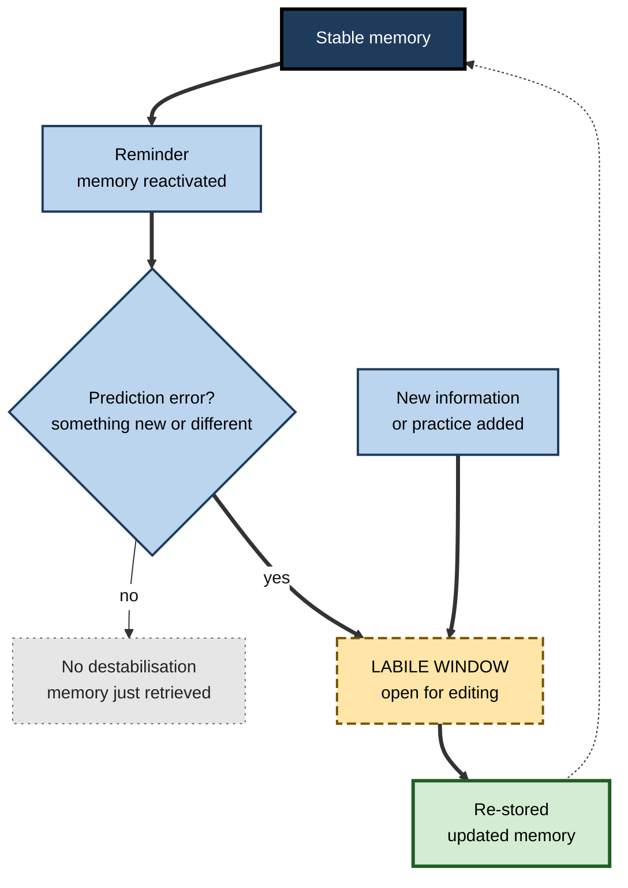
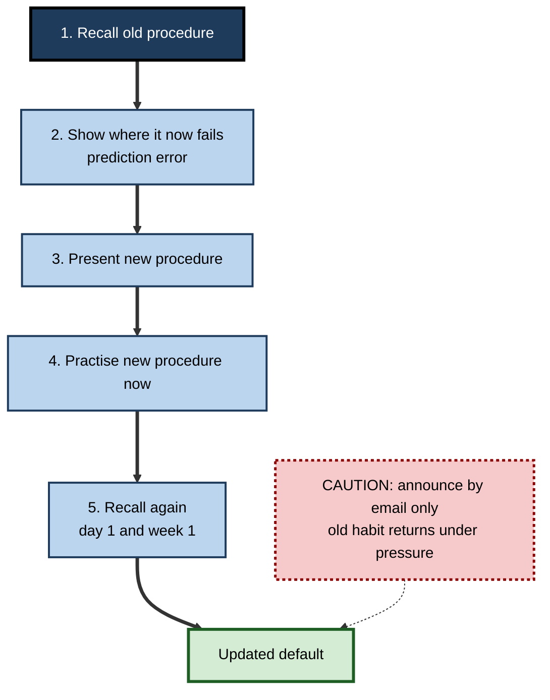

# G.6. Reconsolidation: Updating Memories

> **In one sentence:** When you recall a memory and something about the situation is unexpected, that memory can briefly become changeable again, and it must be re-stored — giving the brain a chance to update, strengthen or even weaken it.
>
> **Why it matters:** Reconsolidation is the brain's built-in mechanism for keeping knowledge current. It explains why updating outdated procedures works best when people first recall the old version, why misinformation can creep into memories, and why "memory editing" therapies are promising but much less certain than headlines suggest.
>
> **Level span:** Novice → Expert · **Reading time:** ~18 min · **Builds on:** stages of memory formation; synaptic and systems consolidation

---

## The Learning Ladder

| Level | Badge | After this level you can... |
|---|---|---|
| 1 | NOVICE | Explain that remembering something can change it. |
| 2 | FOUNDATIONS | Define reconsolidation, destabilisation, prediction error and the reconsolidation window. |
| 3 | PRACTITIONER | Use a recall-then-update routine to replace outdated knowledge at work. |
| 4 | ADVANCED | Describe the key experiments, boundary conditions and replication problems. |
| 5 | EXPERT / PRO | Apply reconsolidation principles cautiously in change management, training and evaluation of clinical claims. |

---

## Level 1 · Novice — The Big Picture

Imagine a document saved in a shared drive. Most of the time it sits there unchanged. But when someone opens it for editing, it is temporarily unlocked — changes can be made — and then it is saved again. If an edit happens while it is open, the saved version is different.

Memories can work in a similar way. When you recall a memory, and something about the situation surprises you, the memory can become "open for editing" for a while. During that time, new information can be added, and the memory is then saved again in its updated form. This re-saving is called **reconsolidation**.

You have already experienced something like this when:

- A colleague corrected a detail of a story you tell often, and now you tell it the corrected way without effort.
- Your company changed a process, and after recalling the old steps and then practising the new ones, the old version stopped popping up.
- Someone described a shared event differently, and later you were unsure which version was true.

The beginner's point: **remembering is not just reading a memory; it can also rewrite it.**

---

## Level 2 · Foundations — Core Concepts

### The basic cycle

1. A memory is consolidated and stable.
2. A **reminder** reactivates it.
3. If the reminder includes something unexpected — a **prediction error** — the memory can become **destabilised** (labile, changeable).
4. During a limited **reconsolidation window** (thought to be roughly a few hours in animal studies), the memory can be modified: strengthened, updated with new information, or weakened.
5. The memory is **restabilised** — re-stored — in its new form.

**Figure G.6-1 — The reconsolidation cycle.**

*How to read it:* the thick path shows a memory becoming editable only when recall involves a prediction error; the dotted arrow returns the updated memory to stable storage.

### Key Terms

| Term | Plain meaning |
|---|---|
| **Reconsolidation** | Re-storing a memory after it has been reactivated and destabilised. |
| **Destabilisation** | A reactivated memory becoming temporarily changeable. |
| **Prediction error** | A mismatch between what you expected and what happened. |
| **Reconsolidation window** | The limited time during which a destabilised memory can be modified. |
| **Boundary conditions** | Factors that determine whether reconsolidation happens at all — such as memory age, strength and type of reminder. |
| **Extinction** | New learning that a cue no longer predicts an outcome; it *competes* with the old memory rather than changing it. |
| **Memory updating** | Integrating new information into an existing memory. |

### Reconsolidation versus extinction

This distinction matters for anyone trying to change habits, fears or procedures.

| | Extinction | Reconsolidation-based updating |
|---|---|---|
| **What happens** | A second, competing memory is learned ("the alarm is no longer followed by a shock"). | The original memory itself is modified. |
| **Durability** | Old memory can return — with time, a new context or stress. | If successful, the old version should not return. |
| **Work example** | New process taught separately; old habits creep back under pressure. | Old process recalled, then corrected in the moment; the updated process becomes the default. |

---

## Level 3 · Practitioner — Putting It to Work

You cannot verify in daily life whether a memory has truly "reconsolidated". But the behavioural principles from this research align with well-supported practices for updating knowledge.

### The Recall–Surprise–Replace routine

1. **Recall the old version.** Ask people to retrieve the outdated knowledge first: "Walk me through how you currently approve a purchase order."
2. **Create a clear prediction error.** Show where the old version now leads to the wrong outcome: "Under the new policy, step three would now trigger an audit flag."
3. **Provide the new version immediately.** Present the corrected steps while the old ones are active.
4. **Practise the new version right away.** Have people perform it, not just read it.
5. **Repeat the recall later with the new version.** A day and a week later, ask them to retrieve the procedure; the new version should come first.

**Figure G.6-2 — Updating outdated procedures at work.**

*How to read it:* the thick path is the recommended routine; the dotted caution shows the common shortcut that leaves the old memory competing.

### Worked example — a finance team adopting a new expense-approval rule

| | Before | After |
|---|---|---|
| **Change communication** | Email with new rule; PDF attached. | 15-minute session: each person describes how they would approve a sample claim under the old rule, then sees the new outcome. |
| **Practice** | None. | Three sample claims approved under the new rule on the spot. |
| **Follow-up** | None. | Two-question quiz the next day and a week later. |
| **One month later** | Many approvals still follow the old rule. | Few errors; the new rule is the default. |

### Common mistakes

- **Avoiding mention of the old way** for fear of reinforcing it. Activating it, then correcting it explicitly, is generally more effective than ignoring it.
- **Re-presenting without surprise.** Simply reminding people of a memory may strengthen it rather than make it updatable.
- **Assuming change is complete after one session.** Updated memories still need consolidation and later retrieval.

---

## Level 4 · Advanced — Mechanisms, Models & Evidence

### The key experiments

- **Early hints (1968).** Donald Lewis and colleagues showed that electroconvulsive shock could disrupt old memories in rats if they were reactivated just before — a finding largely set aside for decades.
- **The landmark study (2000).** Karim Nader, Glenn Schafe and Joseph LeDoux trained rats to fear a tone. A day later they played the tone (reactivation) and infused a protein-synthesis inhibitor into the amygdala. The rats later showed much less fear — but only if the memory had been reactivated. The conclusion: reactivated memories need new protein synthesis to be re-stored.
- **Episodic updating in humans (2007).** Almut Hupbach and colleagues found that reminding people of a first word list before they learned a second list caused items from the second list to intrude into recall of the first — consistent with updating the original memory.
- **Fear updating without drugs (2010).** Daniela Schiller and colleagues reported that performing extinction training within the reconsolidation window, after a single reminder, prevented the return of fear in humans for up to a year.
- **Propranolol (2009 onward).** Merel Kindt and colleagues reported that giving the beta-blocker propranolol before reactivating a fear memory reduced later fear responses, launching a wave of clinical studies.

### Boundary conditions

Reconsolidation does not happen every time a memory is recalled. Factors that seem to matter include:

| Factor | Effect |
|---|---|
| **Prediction error** | Destabilisation appears to require a mismatch; too little produces simple retrieval, too much may create a new memory instead. |
| **Memory strength and age** | Stronger and older memories are harder to destabilise. |
| **Reminder duration** | Brief reminders favour reconsolidation; long exposures favour extinction. |
| **Memory type** | Fear, motor, episodic and drug-cue memories behave differently. |

The non-linear role of prediction error is now seen as the central and hardest-to-control factor. It may explain many conflicting results: the "right amount" of surprise differs between people and procedures.

### The replication problem

Reconsolidation is one of the most exciting — and most contested — findings in memory research.

- **Behavioural updating** in the style of Schiller's study has been tested in more than twenty studies, with at least fourteen reporting non-replication. Some carefully designed replications found no evidence of the effect.
- **Propranolol.** Early meta-analyses suggested benefits. A 2022 corrected and updated meta-analysis concluded there was no reliable effect of propranolol versus placebo on disrupting traumatic memories. Several failures have been attributed to not achieving destabilisation, which is hard to verify independently.
- **Clinical applications** — for phobias, post-traumatic stress disorder (PTSD) and addiction — show some promising individual results, especially single-session treatments for specific phobia, but are not established standard treatments.

The consensus position as of 2026: **reconsolidation is a real phenomenon, well supported in animal studies, but in humans its occurrence is unreliable and depends on boundary conditions that cannot yet be measured directly.** Translational claims should be treated cautiously.

### Links to everyday memory distortion

Reconsolidation offers one mechanism for how recalled memories absorb new information, which connects to misinformation effects and false memories. Not all memory distortion requires reconsolidation; source confusion and reconstruction at retrieval also contribute.

### Reconsolidation and retrieval practice

Retrieval strengthens memories (the testing effect). One hypothesis is that each retrieval with some novelty — a new context, a new question form — partially destabilises and then re-stores the memory more strongly and with more connections. This is plausible and consistent with data, but not proven.

---

## Level 5 · Expert / Pro — Professional Mastery

### Change management through the memory lens

Large organisations constantly need people to *unlearn*: old tools, old policies, old safety procedures. Professionals can design updates that work with memory rather than against it.

| Change-management practice | Reconsolidation-informed version |
|---|---|
| Announcement email | Short session that activates the old routine first |
| New slide deck | Side-by-side "old outcome versus new outcome" scenarios |
| Single training | Training plus recall checks at day 1 and week 1 |
| Generic FAQ | FAQ framed around the specific mistakes people make under the old habit |
| Measuring awareness | Measuring which version people produce under time pressure |

### Correcting misconceptions in training

Research on correcting misconceptions — in science education and in combating misinformation — finds that **refutation**, which explicitly states the misconception and then explains why it is wrong, tends to outperform simply presenting the correct information. This aligns with the recall-and-update logic of reconsolidation, though the two research traditions developed separately.

### Evaluating clinical and commercial claims

You may encounter claims about "erasing bad memories", "rewiring trauma" or "memory reconsolidation therapy" in wellness or coaching products. A pro asks:

1. Is there a randomised controlled trial with a credible control condition?
2. Was the outcome measured after a delay, with standard clinical measures?
3. Has it been independently replicated?
4. Is it delivered by qualified clinicians where mental health conditions are involved?

Evidence-based treatments for PTSD and anxiety exist. Reconsolidation-based approaches remain largely experimental and should not replace them.

### Professional scenario

**Role:** Safety training lead at a logistics company.
**Situation:** A forklift loading procedure has changed after an incident. Drivers attended a briefing, yet two weeks later several still follow the old sequence when rushed.
**What the pro does:** Runs a ten-minute "toolbox talk" at each depot: drivers verbally walk through the old sequence, are shown the incident footage at the step where it fails, then practise the new sequence on a real vehicle. Adds a quick recall question at the next two shift starts. Supervisors observe compliance under time pressure, not just in the briefing.

### Ethical limits

- Memory updating can be misused — leading questions in interviews or investigations can contaminate witness memories.
- Pharmacological memory modification raises consent and identity questions, and is not established practice.
- In the workplace, the aim is accurate, current knowledge — not manipulating how people remember events.

---

## Myths vs. Evidence

| Myth | What the evidence shows |
|---|---|
| "Scientists can now erase traumatic memories with a pill." | A 2022 corrected meta-analysis found no reliable effect of propranolol on traumatic memory; clinical use is experimental. |
| "Every time you remember something, it becomes editable." | Destabilisation seems to require prediction error and depends on boundary conditions. |
| "Never mention the old way when teaching the new one." | Explicitly activating and correcting the old way usually improves updating. |
| "Reconsolidation findings are rock solid in humans." | Many human studies have failed to replicate; the effect is real but unreliable. |
| "Recalled memories are exact copies of the original." | Recall can incorporate new information, contributing to distortions. |

## Practitioner Toolkit

**Recall–Surprise–Replace checklist**

- [ ] Learners recall the old procedure or belief.
- [ ] A concrete case shows where the old version now fails.
- [ ] The new version is presented immediately.
- [ ] Learners practise the new version on the spot.
- [ ] Recall checks happen a day and a week later.
- [ ] Success is measured by what people do under time pressure.

**Script for a five-minute update conversation**

"Talk me through how you'd handle X today. — Here's what happens now if we do that. — Here's the new way. — Let's run it once together. — Tomorrow I'll ask you to walk me through it again."

## Self-Check

1. **[NOVICE]** How can remembering something change it?
2. **[FOUNDATIONS]** Define destabilisation and the reconsolidation window.
3. **[FOUNDATIONS]** How does extinction differ from reconsolidation-based updating?
4. **[PRACTITIONER]** Outline the five steps of the Recall–Surprise–Replace routine.
5. **[ADVANCED]** What did Nader, Schafe and LeDoux show in 2000?
6. **[ADVANCED]** Why is prediction error considered a key boundary condition?
7. **[ADVANCED]** What is the current status of propranolol-based reconsolidation treatment?
8. **[EXPERT / PRO]** What questions would you ask about a coaching product claiming to "rewrite traumatic memories"?

### Answer Key

1. A recalled memory, if destabilised, can be modified and is then re-stored in its new form.
2. Destabilisation: a reactivated memory becoming temporarily changeable. Window: the limited period during which it can be modified before restabilising.
3. Extinction creates a competing memory, so the old one can return; reconsolidation updating modifies the original memory.
4. Recall the old version; show where it fails; present the new version; practise it; recall again later.
5. Blocking protein synthesis in the amygdala after reactivating a fear memory weakened it, showing reactivated memories need re-storage.
6. Without mismatch a memory is simply retrieved; with too much, a new memory forms; only a suitable mismatch destabilises it.
7. A 2022 corrected meta-analysis found no reliable effect on traumatic memories; it remains experimental.
8. Controlled trials, delayed standard outcomes, independent replication, and delivery by qualified clinicians.

## Key Takeaways

- **Recall can reopen a memory** for modification; it is then re-stored — reconsolidation.
- **Prediction error** is usually required for destabilisation, making the process conditional and hard to control.
- **Extinction competes; reconsolidation edits** — relapse after change suggests the old memory was never updated.
- In practice, **recall the old, show the mismatch, practise the new** is a sound updating routine.
- Animal evidence is strong; **human replication is inconsistent**, and propranolol effects on trauma are not supported by a corrected meta-analysis.
- Treat "memory erasure" claims with **scepticism**; use reconsolidation ideas to design better updates, not to manipulate.

## Glossary

| Term | Meaning |
|---|---|
| Boundary conditions | Factors determining whether reconsolidation occurs. |
| Destabilisation | Reactivated memory becoming temporarily modifiable. |
| Extinction | Learning that a cue no longer predicts an outcome, forming a competing memory. |
| Labile | Unstable and open to change. |
| Memory updating | Integrating new information into an existing memory. |
| Prediction error | Mismatch between expectation and outcome. |
| Propranolol | A beta-blocker drug studied for disrupting emotional memory reconsolidation. |
| Protein-synthesis inhibitor | A drug that blocks protein production, used in animal studies of consolidation. |
| Reconsolidation | Re-storage of a reactivated, destabilised memory. |
| Reconsolidation window | Time period during which a destabilised memory can be changed. |
| Refutation | Explicitly naming and correcting a misconception. |
| Restabilisation | Return of a memory to a stable state after modification. |
