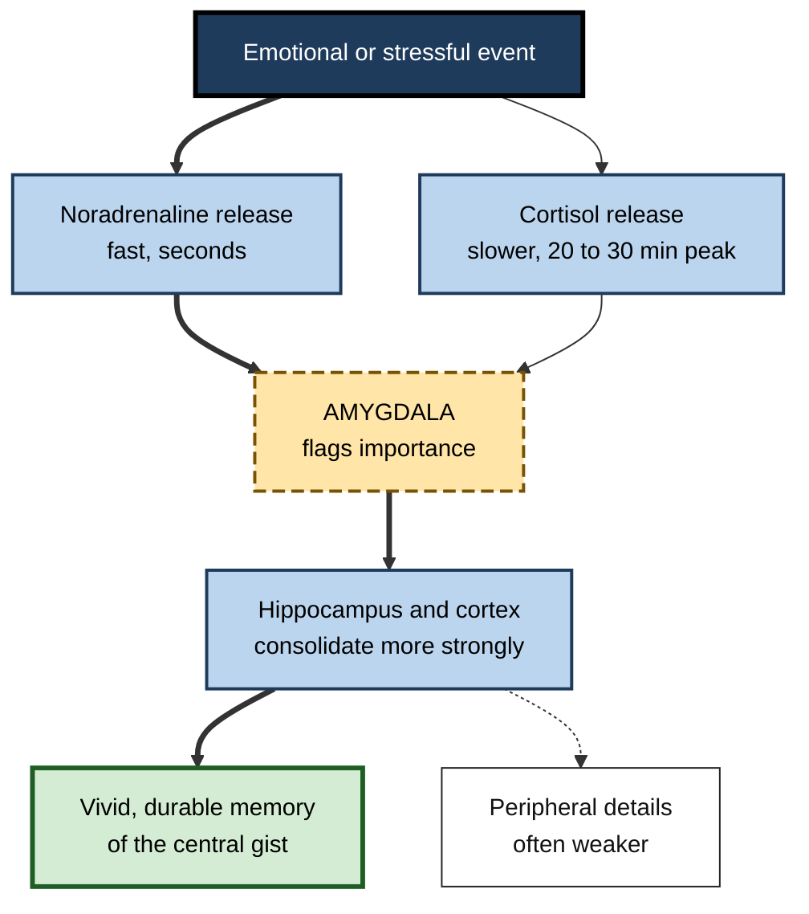
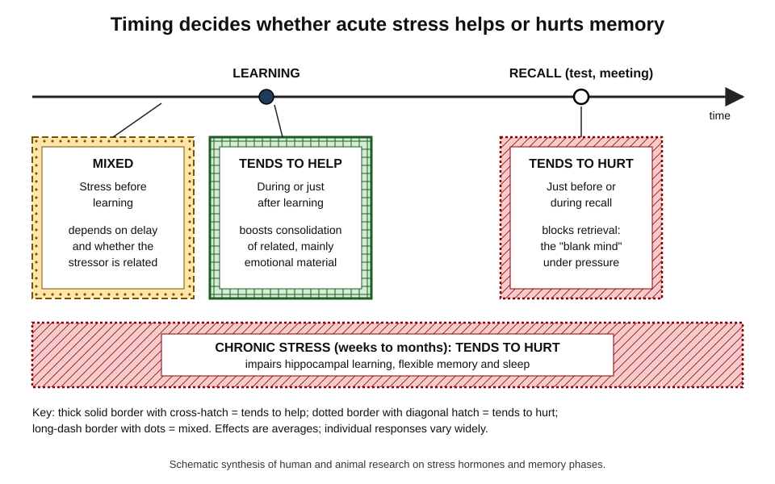
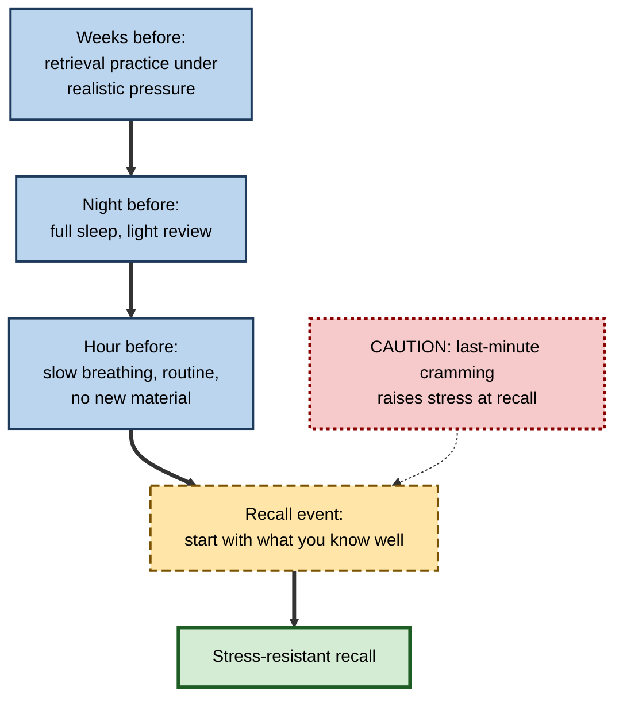

# G.7. Emotion, Stress, and Memory Formation

> **In one sentence:** Emotional and stressful moments release chemicals that tell the brain "this matters, keep it" — which can make memories stronger — but the same chemicals at the wrong time, or for too long, can block learning and recall.
>
> **Why it matters:** Workplaces are full of stress: deadlines, presentations, incidents, performance reviews. Understanding how stress interacts with memory explains why people "blank" in interviews, why incidents are remembered vividly but inaccurately, and how to design high-stakes training that sticks without harming people.
>
> **Level span:** Novice → Expert · **Reading time:** ~18 min · **Builds on:** stages of memory formation; the hippocampus; consolidation

---

## The Learning Ladder

| Level | Badge | After this level you can... |
|---|---|---|
| 1 | NOVICE | Explain why emotional events are remembered well and why stress can make your mind go blank. |
| 2 | FOUNDATIONS | Name the amygdala, noradrenaline and cortisol, and describe how they affect memory. |
| 3 | PRACTITIONER | Time challenge and calm so stress helps learning and does not sabotage recall. |
| 4 | ADVANCED | Explain the timing-dependent effects of stress, the amygdala modulation hypothesis, tunnel memory and flashbulb memories. |
| 5 | EXPERT / PRO | Design high-stakes training, assessments and incident processes with stress effects in mind, ethically. |

---

## Level 1 · Novice — The Big Picture

Think of your brain as having a **highlighter pen** controlled by your emotions. When something surprising, frightening, exciting or important happens, your body releases stress chemicals, and the highlighter comes out: "remember this!" That is why you remember where you were when you heard big news, or your first presentation that went badly.

But the highlighter has two problems:

1. **It highlights the centre, not the edges.** You remember the main emotional thing vividly, but peripheral details can be lost.
2. **If it is pressed too hard at the wrong time, the page jams.** In a stressful exam or interview, your body is flooded with stress chemicals, and you cannot get to memories you know you have.

You have already experienced this when:

- You remember a heated meeting word for word but not what was decided afterwards.
- You went blank in an interview and remembered the perfect answer on the way home.
- You learned a safety rule the day something went wrong, and you have never forgotten it.

The novice point: **emotion and stress can strengthen memories, but timing and dose decide whether they help or hurt.**

---

## Level 2 · Foundations — Core Concepts

### The key players

| Player | What it is | What it does for memory |
|---|---|---|
| **Amygdala** | An almond-shaped structure next to the hippocampus | Detects emotional significance and boosts consolidation in other memory regions |
| **Noradrenaline (norepinephrine)** | A fast-acting brain chemical released with arousal | Signals importance; increases attention and strengthens consolidation of arousing events |
| **Cortisol** | The main stress hormone in humans, released by the adrenal glands | Slower acting; enhances consolidation after learning, but impairs retrieval and, over time, damages hippocampal function |
| **Hippocampus** | The memory binder | Rich in cortisol receptors, so very sensitive to stress |
| **Prefrontal cortex** | Front brain region for planning and flexible thinking | Shuts down partially under high stress, impairing reasoning and flexible recall |

### Arousal versus valence

Two dimensions of emotion matter:

- **Arousal** — how activating something is (calm to intense).
- **Valence** — how pleasant or unpleasant it is.

Arousal, more than valence, drives the memory boost through noradrenaline. Strong positive events (winning a deal) and strong negative ones (losing one) can both be remembered well.

**Figure G.7-1 — How an emotional event gets "highlighted" in memory.**

*How to read it:* the thick path is the fast noradrenaline route through the amygdala; the thin arrow is the slower cortisol route; the dotted arrow shows detail that tends to lose out.

### Key Terms

| Term | Plain meaning |
|---|---|
| **Acute stress** | Short-term stress lasting minutes to hours. |
| **Chronic stress** | Ongoing stress over weeks or months. |
| **HPA axis** | The hypothalamus–pituitary–adrenal hormone system that produces cortisol. |
| **Arousal** | How physiologically activated a person is. |
| **Valence** | Whether an emotion is pleasant or unpleasant. |
| **Flashbulb memory** | A vivid, confident memory of the circumstances in which you learned surprising, important news. |
| **Tunnel memory** | Better memory for central details and worse for peripheral ones under high emotion. |

---

## Level 3 · Practitioner — Putting It to Work

### Timing is everything

The most useful practical insight is that **stress affects each memory stage differently**.

*Figure G.7-2 — Timing decides whether acute stress helps or hurts memory.* Cross-hatched box with thick border: stress during or right after learning tends to enhance consolidation of related, especially emotional, material. Diagonal-hatched boxes with dotted borders: stress just before recall, and chronic stress, tend to impair. Dotted box with long-dash border: stress well before learning has mixed effects.

### The Stress-Smart Learning Method

1. **Learn under moderate, relevant challenge.** Realistic simulations, time-bound exercises and real stakes can strengthen memory for the *core* of the lesson — if the challenge relates directly to it.
2. **Keep the stressor connected to the content.** Stress that is part of the learning task tends to help; unrelated stress (an angry email arriving mid-course) tends to distract.
3. **Debrief after high-arousal practice.** Since emotion favours central details, use a calm debrief to draw attention to the peripheral but important points.
4. **Lower stress before recall.** Before an interview, exam or presentation, use calming routines; avoid last-minute cramming that raises anxiety.
5. **Over-learn for high-pressure recall.** Memories that have been retrieved many times are more resistant to stress-induced blanking. Studies have found that people who learned through retrieval practice were less affected by acute stress at test.
6. **Watch for chronic stress.** If you are stressed for weeks, learning capacity drops. Reduce load before expecting big learning gains.

**Figure G.7-3 — Before a high-stakes recall event.**

*How to read it:* follow the thick path for preparation; the dotted caution shows the habit that undermines it.

### Worked example — a customer-success manager preparing for a quarterly business review

| | Before | After |
|---|---|---|
| **Preparation** | Reads all account data the morning of the review; anxious. | Practises answering likely tough questions aloud over the previous week. |
| **Before the meeting** | Checks email and receives a complaint ten minutes before. | Blocks 20 minutes beforehand; reviews three key messages only. |
| **During the meeting** | Blanks on a renewal figure under challenge. | Recalls figures; handles challenge calmly. |
| **After** | Remembers the confrontation, not the agreed actions. | Writes actions immediately after the meeting while memory is fresh. |

### Common mistakes

- **Believing more pressure always means better learning.** Very high stress narrows attention and impairs flexible thinking.
- **Assuming vivid memories are accurate.** Confidence and vividness are not proof of accuracy.
- **Scheduling learning during crunch periods.** Chronic stress is the enemy of new learning.

---

## Level 4 · Advanced — Mechanisms, Models & Evidence

### The amygdala modulation hypothesis

James McGaugh and colleagues showed over several decades that the **basolateral amygdala** modulates consolidation in other regions. Arousal releases noradrenaline in the amygdala; this, together with glucocorticoids such as cortisol, enhances consolidation in the hippocampus and cortex. Blocking noradrenaline signalling with beta-blockers, in animals and humans, reduced the memory advantage of emotional material in several classic studies. Importantly, the amygdala is not where emotional memories are "stored"; it boosts storage elsewhere.

### Timing-dependent effects of stress hormones

A large body of human research, much of it from Lars Schwabe, Oliver Wolf, Benno Roozendaal and colleagues, supports the following picture:

| Phase | Typical finding |
|---|---|
| **Stress shortly before or during encoding** | Can enhance memory for stress-related, emotional material; can impair unrelated material. Effects depend on timing. |
| **Stress after encoding (consolidation)** | Generally enhances consolidation, especially of emotionally arousing material; elevated cortisol in early consolidation selectively preserves the emotionally salient aspects while neutral details may be lost. |
| **Stress before retrieval** | Generally impairs retrieval, again often more strongly for emotional material. |
| **Chronic stress** | Impairs hippocampal plasticity and flexible memory; associated with reduced hippocampal volume in some human studies. |

Not every study replicates each effect — for example, some studies find no consolidation benefit of post-encoding stress — and moderators include sex hormones, time of day (cortisol follows a daily rhythm), individual stress reactivity, and how closely the stressor relates to the material.

### Stress shifts memory systems

Under stress, people and animals tend to shift from flexible, hippocampus-based "cognitive" learning to rigid, habit-based learning supported by the striatum. Schwabe and Wolf demonstrated this shift in humans. Practical consequence: under pressure, people revert to well-practised habits — good if the habits are correct, dangerous if the training never made the correct procedure habitual.

### The inverted U — with caveats

The **Yerkes–Dodson law** is often drawn as an inverted U: performance rises with arousal up to a point, then falls. The original 1908 study used mice and electric shocks in a discrimination task, and the popular graph oversimplifies it. Modern evidence supports a more specific version: moderate arousal helps simple or well-learned tasks, while complex, flexible tasks are impaired at lower arousal levels. Treat the inverted U as a heuristic, not a law.

### Flashbulb memories and confidence

After shocking public events, people form **flashbulb memories** that feel vivid. Studies following people over time — for example after the September 11, 2001 attacks — found that accuracy declined at a similar rate to ordinary memories, while confidence and vividness stayed high. Emotion boosts *confidence* and *centrality* more reliably than *accuracy* of details.

### Stress, emotion and other memory phenomena

- **Weapon focus**: witnesses fixate on a threatening object and remember less about the perpetrator's face — a form of tunnel memory.
- **Mood congruence**: people recall memories that match their current mood more easily.
- **Emotional memory in sleep**: REM sleep has been linked to processing emotional memories, possibly preserving content while reducing emotional charge; evidence is mixed.

### Recent findings

- A 2025 study distinguished cortisol effects on item memory versus associative memory across encoding, consolidation and retrieval, finding that the same hormone can enhance one aspect while impairing another.
- Studies of cortisol suppression in 2026 found impaired retrieval of emotional memory, underlining that the stress system is involved in normal emotional recall, not just pathological states.

---

## Level 5 · Expert / Pro — Professional Mastery

### Designing high-stakes training

Professions where people must perform under pressure — aviation, medicine, emergency response, cybersecurity incident response, trading — use **stress inoculation** and **high-fidelity simulation**. The memory science suggests design principles:

| Principle | Implementation |
|---|---|
| Practise under realistic pressure | Simulations with time limits, noise, ambiguous information |
| Make the correct procedure a habit | Repeated drills so the habit system holds the right response |
| Debrief calmly | Structured debriefs afterwards to capture peripheral lessons |
| Build stress-resistant retrieval | Spaced retrieval practice before high-stakes assessment |
| Avoid traumatic training | Overwhelming stress impairs learning and can harm wellbeing |

### Assessments and interviews

High-stress assessments can underestimate what people know, especially for those with high anxiety. Fairer approaches include practice rounds, clear expectations, work-sample tasks, and allowing brief preparation. In hiring, this improves the signal about skill rather than about stress tolerance — unless stress tolerance is genuinely the job requirement.

### Incident processes and memory accuracy

After incidents, emotionally charged memories are vivid but selectively accurate. Pros:

- capture timelines from logs and contemporaneous messages, not memory alone;
- interview people separately and early, using open questions;
- avoid blame-laden questions, which raise stress and distort recall;
- run blameless post-incident reviews, which improve both accuracy and learning.

### Professional scenario

**Role:** Incident response lead at a financial-services company.
**Situation:** Engineers forget runbook steps during real outages despite passing quarterly training.
**What the pro does:** Recognises that stress before retrieval impairs access, and stress shifts people toward habits. Replaces slide-based training with monthly game days that simulate pressure, with the same runbook steps drilled until automatic. Adds a calm debrief after each game day. Introduces checklists for rare steps that cannot be made habitual. Mean time to recovery in real incidents improves.

### Ethical limits

- Deliberately inducing intense stress to "make training memorable" can cross ethical lines, harm psychological safety, and impair learning.
- Chronic workplace stress is an organisational problem, not just an individual one; resilience training without reducing excessive demands is insufficient.
- People with trauma histories or anxiety disorders may react strongly to simulations; provide opt-outs and support.

---

## Myths vs. Evidence

| Myth | What the evidence shows |
|---|---|
| "Stress always ruins memory." | Acute stress around learning can enhance consolidation of related material; it is retrieval and chronic stress that suffer most. |
| "Vivid memories are accurate memories." | Flashbulb memories stay vivid and confident while accuracy declines. |
| "The amygdala stores emotional memories." | It mainly modulates consolidation in other regions. |
| "Yerkes–Dodson proves a precise optimal stress level." | It is a rough heuristic based on a 1908 animal study; optimal arousal depends on task complexity. |
| "Pressure makes people perform their training." | Pressure makes people perform their *habits*; training must make the right response habitual. |

## Practitioner Toolkit

**Stress-and-memory checklist for learning designers**

- [ ] Challenge is relevant to the content being learned.
- [ ] High-arousal practice is followed by a calm debrief.
- [ ] Learners practise retrieval repeatedly before high-stakes recall.
- [ ] Assessments include a calm lead-in and clear expectations.
- [ ] Rare, critical steps are on checklists, not left to stressed memory.
- [ ] Training is not scheduled during chronic crunch periods.

**Personal pre-recall routine (10 minutes)**

| Minute | Action |
|---|---|
| 0–3 | Slow breathing, longer exhale than inhale |
| 3–6 | Recall three things you know well about the topic |
| 6–9 | Visualise the first two minutes going well |
| 9–10 | Start with an easy, well-practised point |

## Self-Check

1. **[NOVICE]** Why do you remember emotional events so well?
2. **[NOVICE]** Why might you go blank in a stressful interview?
3. **[FOUNDATIONS]** What roles do noradrenaline and cortisol play?
4. **[FOUNDATIONS]** Define arousal and valence.
5. **[PRACTITIONER]** How should you time stress and calm around a learning event and a recall event?
6. **[ADVANCED]** What is the amygdala modulation hypothesis?
7. **[ADVANCED]** What do flashbulb memory studies reveal about emotion and accuracy?
8. **[ADVANCED]** Why does stress make people fall back on habits?
9. **[EXPERT / PRO]** How would you redesign incident training for people who forget steps under pressure?

### Answer Key

1. Arousal releases noradrenaline and cortisol, which act via the amygdala to strengthen consolidation.
2. Stress hormones just before retrieval impair access to stored memories.
3. Noradrenaline rapidly signals importance and boosts consolidation; cortisol acts more slowly, enhancing consolidation after learning but impairing retrieval and, when chronic, hippocampal function.
4. Arousal: level of activation. Valence: pleasantness or unpleasantness.
5. Relevant challenge during learning; calm before and during recall; avoid chronic stress during learning periods.
6. The basolateral amygdala, activated by arousal hormones, enhances consolidation of memories in other brain regions.
7. Vividness and confidence remain high while accuracy declines like ordinary memories.
8. Stress shifts control from flexible hippocampal learning to rigid habit systems in the striatum.
9. Realistic pressure drills repeated until habitual, calm debriefs, spaced retrieval, and checklists for rare steps.

## Key Takeaways

- Emotion and stress **highlight** important events via the amygdala, noradrenaline and cortisol.
- **Timing matters**: stress around learning can help; stress before recall and chronic stress hurt.
- Emotion boosts **central gist and confidence**, not necessarily accuracy of details.
- Under pressure, people **fall back on habits** — train the right habits.
- Design high-stakes training with **realistic but not traumatic** pressure and calm debriefs.
- Capture incident facts from **records**, not vivid memories alone.

## Glossary

| Term | Meaning |
|---|---|
| Acute stress | Short-term stress over minutes to hours. |
| Amygdala | Brain structure that detects emotional significance and modulates memory consolidation. |
| Arousal | Level of physiological activation. |
| Chronic stress | Long-lasting stress over weeks or months. |
| Cortisol | The main human stress hormone. |
| Flashbulb memory | Vivid, confident memory of learning about a shocking event. |
| HPA axis | Hormone system producing cortisol. |
| Noradrenaline | Arousal chemical that boosts attention and consolidation. |
| Stress inoculation | Training that gradually exposes people to stressors to build coping. |
| Tunnel memory | Enhanced central and reduced peripheral memory under emotion. |
| Valence | Pleasantness or unpleasantness of an emotion. |
| Yerkes–Dodson law | Rough heuristic that performance rises then falls with arousal. |
