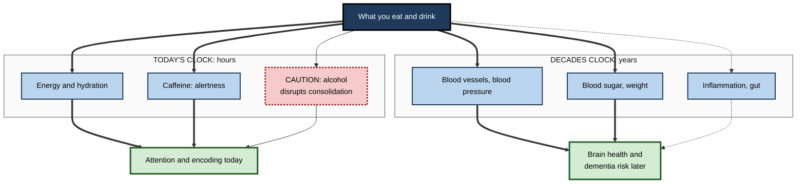
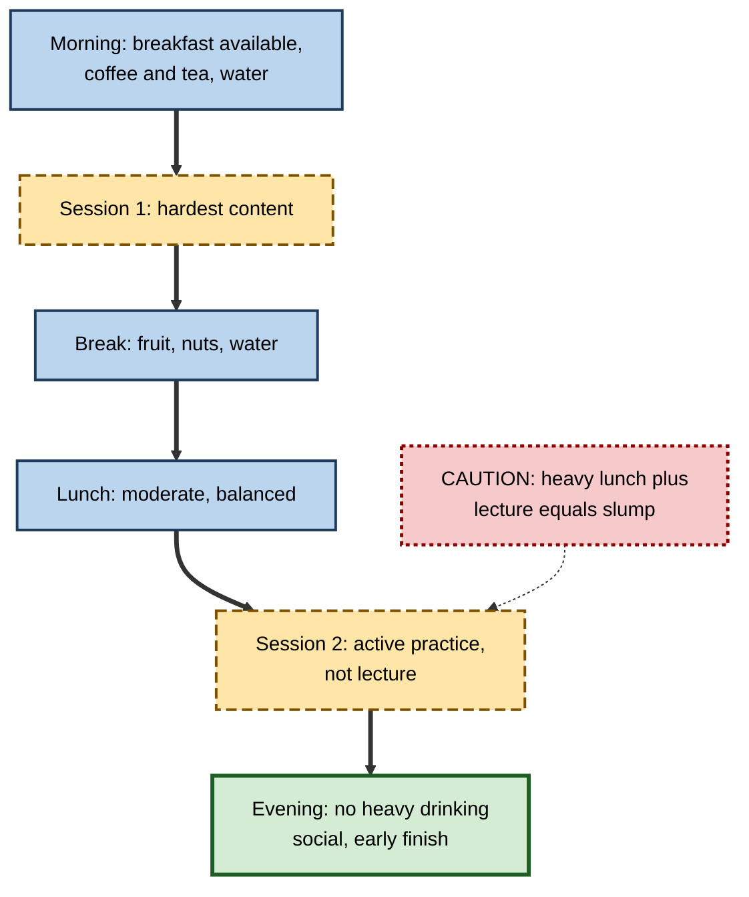

# G.8. Nutrition and Memory Health

> **In one sentence:** What you eat and drink affects memory in two ways — in the short term through energy, hydration, caffeine and alcohol, and over decades through overall diet patterns that support brain and blood-vessel health — but no single food or supplement is a memory booster for healthy people.
>
> **Why it matters:** Nutrition is one of the most marketed and least understood areas of "brain health". Professionals who can separate solid evidence from hype make better choices for themselves, avoid wasting money, and design workplaces and learning events that support thinking instead of undermining it.
>
> **Level span:** Novice → Expert · **Reading time:** ~18 min · **Builds on:** stages of memory formation; sleep and consolidation
>
> **Important:** This note is educational, not medical or dietary advice. Talk to a qualified health professional before changing your diet substantially, starting supplements, or if you are worried about your memory.

---

## The Learning Ladder

| Level | Badge | After this level you can... |
|---|---|---|
| 1 | NOVICE | Explain how eating, drinking, caffeine and alcohol affect how well you learn today. |
| 2 | FOUNDATIONS | Distinguish short-term effects from long-term dietary patterns and name the patterns with the best evidence. |
| 3 | PRACTITIONER | Plan food, drink and caffeine around learning days and events sensibly. |
| 4 | ADVANCED | Interpret trial and observational evidence on diets and supplements, including null results. |
| 5 | EXPERT / PRO | Evaluate brain-health claims and design workplace nutrition policies responsibly. |

---

## Level 1 · Novice — The Big Picture

Your brain is a hungry organ. It makes up only about 2 percent of body weight but uses roughly 20 percent of the body's energy at rest. Like a high-performance engine, it needs steady fuel, enough water and no sugar in the petrol tank.

Think of nutrition and memory on two clocks:

- **Today's clock.** Skipping meals, being dehydrated, drinking heavily last night or overdoing caffeine can make you foggy, distracted and less able to take in new information *today*.
- **The decades clock.** Eating patterns over many years affect your heart and blood vessels, your blood sugar and your weight — and those, in turn, affect how healthy your brain stays as you age.

You have already experienced the today clock when:

- You tried to learn something in the afternoon slump after a heavy lunch.
- A morning after a late night of drinking, nothing from a meeting stuck.
- You had too much coffee and felt jittery and scattered.

The beginner's point: **there are no magic memory foods, but steady, ordinary good eating and drinking habits make learning easier, and long-term patterns matter for brain health.**

---

## Level 2 · Foundations — Core Concepts

### Short-term factors versus long-term patterns

| Factor | Time scale | What the evidence broadly shows |
|---|---|---|
| **Meal timing and energy** | Hours | Very low blood sugar and hunger impair attention; very large meals can cause post-meal sleepiness. |
| **Hydration** | Hours | Noticeable dehydration is linked to poorer attention, mood and short-term memory; effects are modest. |
| **Caffeine** | Hours | Improves alertness and attention, especially when tired; memory effects are small and mixed. |
| **Alcohol** | Hours to days | Impairs encoding and consolidation; heavy drinking can cause blackouts; long-term heavy use harms the brain. |
| **Dietary pattern** (e.g. Mediterranean-style) | Years to decades | Associated with lower risk of cognitive decline in observational studies; trial evidence is mixed. |
| **Specific deficiencies** (e.g. vitamin B12, thiamine) | Months to years | Real deficiencies can cause memory problems; correcting them can help. |
| **Supplements in well-nourished people** | Months | Mostly weak or null effects; a few modest positive results in older adults. |

**Figure G.8-1 — Two clocks: how nutrition reaches memory.**

*How to read it:* thick arrows are well-established routes; dotted arrows are plausible but less established (for example the gut–brain route).

### Key Terms

| Term | Plain meaning |
|---|---|
| **Dietary pattern** | The overall mix of foods eaten over time, rather than single nutrients. |
| **Mediterranean diet** | A pattern rich in vegetables, fruit, legumes, whole grains, fish, nuts and olive oil, with little red meat and processed food. |
| **MIND diet** | A hybrid of the Mediterranean and DASH (blood-pressure) diets designed for brain health, emphasising leafy greens and berries. |
| **Flavanols** | Plant compounds found in cocoa, tea, apples and berries. |
| **Observational study** | A study that tracks people's habits and outcomes without assigning them; cannot prove cause. |
| **Randomised controlled trial (RCT)** | A study that randomly assigns people to an intervention or control; stronger evidence of cause. |
| **Nootropic** | A substance marketed to enhance cognition. |

---

## Level 3 · Practitioner — Putting It to Work

### The Learning-Day Nutrition Routine

1. **Eat a regular meal one to three hours before demanding learning.** Choose balanced foods (protein, fibre, some carbohydrate) rather than a very large or very sugary meal.
2. **Drink water through the day.** Keep a bottle at your desk during long sessions.
3. **Use caffeine deliberately.** A moderate dose can help alertness for a morning session. Avoid it in the six hours or so before bed — sleep matters more for memory than caffeine does.
4. **Skip alcohol on learning nights.** Alcohol after learning can impair consolidation and fragments sleep.
5. **Plan snacks for long sessions.** Fruit, nuts or yoghurt beat pastries for steady energy.
6. **Think long term.** Shift gradually toward a Mediterranean-style pattern: more plants, legumes, whole grains, fish and olive oil; fewer ultra-processed foods.

**Figure G.8-2 — Planning a full-day workshop around food and drink.**

*How to read it:* the thick path is a sensible day; the dotted caution marks the common post-lunch trap.

### Worked example — an offsite leadership programme

| | Before | After |
|---|---|---|
| **Morning** | Pastries and coffee only. | Mixed breakfast options plus coffee, tea and water. |
| **Lunch** | Large buffet with dessert; lecture straight after. | Moderate lunch; post-lunch slot is a walking discussion. |
| **Evening** | Open bar until late; session at 8 a.m. next day. | Dinner with limited alcohol; first session at 9:30 a.m. |
| **Day-2 recall** | Participants struggle to recall day-1 frameworks. | Participants reconstruct frameworks in a quick recall exercise. |

### Common mistakes

- **Buying "brain supplements" instead of fixing sleep and diet basics.**
- **Using energy drinks late into the night to study.**
- **Assuming a single "superfood" (blueberries, walnuts) will improve memory.**
- **Overlooking treatable deficiencies.** Vegans, older adults and people on certain medicines (such as metformin or acid-suppressing drugs) can be at higher risk of low vitamin B12; a clinician can test this.

---

## Level 4 · Advanced — Mechanisms, Models & Evidence

### How diet could affect memory

Plausible biological routes include:

- **Vascular health.** The brain depends on healthy small blood vessels. High blood pressure, diabetes and high LDL cholesterol damage them; these are recognised dementia risk factors, and diet influences all three.
- **Glucose regulation.** Insulin resistance and diabetes are associated with poorer memory and higher dementia risk.
- **Inflammation and oxidative stress.** Diets rich in plant foods may reduce chronic inflammation.
- **Gut–brain axis.** Gut bacteria produce compounds that may affect the brain. A 2025 study linked a Mediterranean-style diet to gut-bacteria changes that correlated with better memory. This is an exciting but early field.
- **Specific nutrients.** Omega-3 fatty acids (especially DHA) are structural components of neuron membranes; B vitamins are involved in homocysteine metabolism; flavanols may improve blood flow.

### Dietary patterns: what the trials say

| Study type | Finding |
|---|---|
| **Observational meta-analyses (to 2025)** | Higher adherence to a Mediterranean diet is associated with lower risk of cognitive impairment, dementia and Alzheimer's disease. Associations are moderate and could be partly explained by other healthy behaviours, education and income. |
| **MIND diet trial (published 2023)** | Over three years, older adults on the MIND diet improved slightly in cognition — but so did the control group, who also had mild calorie restriction and counselling. The difference was not statistically significant. Post-hoc analyses suggest higher adherence may matter. |
| **PREDIMED-related analyses** | Earlier Spanish trial analyses suggested cognitive benefits of a Mediterranean diet supplemented with olive oil or nuts; interpretation was complicated by later methodological concerns about the parent trial. |

Interpretation: diet pattern is likely a modest contributor to brain health, with the strongest case coming from its effects on vascular and metabolic risk factors. A single trial over three years may be too short to detect effects on decline that unfold over decades.

### Supplements: a mixed picture

| Supplement | Current evidence (healthy or mildly affected adults) |
|---|---|
| **Multivitamin** | The COSMOS trials in older US adults found that a daily multivitamin modestly improved episodic memory and global cognition compared with placebo over two to three years; the effect on global cognition was described as roughly equivalent to two years less cognitive ageing. Needs replication in more diverse populations. |
| **Cocoa flavanols** | COSMOS found no overall cognitive benefit of cocoa extract; a related study suggested benefits for memory in people with low habitual flavanol intake. |
| **Omega-3 (fish oil)** | Trials in healthy adults have mostly shown no consistent memory benefit; eating fish as part of a diet pattern is associated with better outcomes in observational data. |
| **Ginkgo biloba** | A large US trial found it did not prevent dementia or cognitive decline in older adults. |
| **B vitamins** | Helpful when a deficiency exists or homocysteine is high; no consistent benefit otherwise. |
| **Creatine** | Some small trials and meta-analyses suggest modest benefits, possibly more in older adults or under sleep deprivation; preliminary. |
| **"Nootropic stacks"** | Rarely tested rigorously; quality control varies; some contain undeclared stimulants. |

### Caffeine and alcohol in more detail

- **Caffeine** reliably improves alertness and reaction time, especially when sleep-deprived. A widely cited 2014 study found that 200 mg of caffeine taken *after* studying improved some aspects of memory 24 hours later; later studies have been mixed. Because caffeine can disrupt sleep, timing matters more than dose for memory.
- **Alcohol** in moderate to high amounts impairs hippocampal encoding and consolidation; at high levels it can produce **blackouts** (periods with no memory formation). The 2024 Lancet Commission on dementia lists excessive alcohol consumption among fourteen modifiable risk factors. Some older studies suggested light drinking was protective; more recent analyses attribute much of this to confounding.

### Prescription stimulants as "smart drugs"

Some students and professionals use prescription stimulants (such as methylphenidate or modafinil) without a medical need, hoping to boost learning. Reviews find small or inconsistent benefits for memory in healthy people, mostly on alertness and attention, alongside risks including sleep disruption, anxiety, dependence and legal issues. This is not recommended outside medical supervision.

---

## Level 5 · Expert / Pro — Professional Mastery

### Evaluating brain-health claims

Nutrition marketing is full of cognition claims. A pro applies a quick evidence hierarchy:

1. **Is there a randomised trial in people like me?** Animal or cell studies do not count.
2. **Was memory measured with validated tests after a meaningful period?**
3. **How big was the effect, and did it replicate?**
4. **Who funded it, and was it pre-registered?**
5. **Could the same benefit come from improving sleep, exercise or overall diet?**

### Workplace nutrition policy

| Area | Evidence-informed choice |
|---|---|
| Meeting and training catering | Balanced options; water visible; fewer pastries and sugary drinks |
| Late-night work culture | Discourage energy-drink-fuelled crunch; protect sleep |
| Social events after training | Limit alcohol on nights between learning days |
| Wellness benefits | Fund dietitian access rather than "brain supplement" vendors |
| Inclusivity | Respect cultural, religious and medical dietary needs; fasting periods |

### Professional scenario

**Role:** People-operations manager at a scale-up planning a three-day onboarding bootcamp.
**Situation:** Feedback from the last bootcamp mentioned afternoon fatigue and a heavy-drinking welcome party the first night; day-2 retention checks were poor.
**What the pro does:** Changes catering to balanced lunches and visible water stations, schedules active practice after lunch, moves the welcome event to the final evening, and keeps alcohol limited. Day-2 recall improves, and feedback notes higher energy. The manager avoids claiming the food "boosts memory"; the real gains come from removing obstacles to attention and sleep.

### Responsible communication

- Do not offer dietary prescriptions to colleagues; point to professionals.
- Avoid body-shaming or moralising language about food.
- Recognise that eating disorders, diabetes and other conditions require individual care.

---

## Myths vs. Evidence

| Myth | What the evidence shows |
|---|---|
| "Specific superfoods boost memory." | No single food has shown robust memory effects in healthy people; overall patterns matter more. |
| "Brain supplements sharpen memory." | Most show no reliable benefit; a multivitamin showed modest effects in older adults in one trial programme. |
| "Fish oil capsules improve memory." | Trials in healthy adults have mostly been null. |
| "A sugary snack boosts learning." | Brief alertness effects at best; steady, balanced meals support attention better. |
| "A drink helps you relax and remember." | Alcohol impairs encoding and consolidation and disrupts sleep. |
| "The MIND diet is proven to prevent decline." | Its three-year trial did not beat a control diet; observational support remains. |

## Practitioner Toolkit

**Learning-day nutrition checklist**

- [ ] I ate a balanced meal before demanding learning.
- [ ] I had water available and drank through the day.
- [ ] I used caffeine early, not late.
- [ ] I avoided alcohol on the night after important learning.
- [ ] I planned lighter, active sessions after lunch.

**Supplement-claim scorecard**

| Question | Yes / No |
|---|---|
| Randomised trial in comparable people? | |
| Memory measured with validated tests? | |
| Effect replicated independently? | |
| Independent funding or pre-registration? | |
| Benefit beyond fixing sleep, diet and exercise? | |

*Reminder:* this is educational content, not medical advice. Discuss supplements and diet changes with a qualified professional.

## Self-Check

1. **[NOVICE]** Why does your brain need steady fuel and water?
2. **[NOVICE]** Name one way alcohol harms learning.
3. **[FOUNDATIONS]** What is the difference between an observational study and a randomised trial?
4. **[FOUNDATIONS]** What is the Mediterranean diet?
5. **[PRACTITIONER]** Plan food and drink for a full-day workshop to support learning.
6. **[ADVANCED]** What did the MIND diet trial find, and why is it hard to interpret?
7. **[ADVANCED]** What did the COSMOS trials find about multivitamins and cocoa extract?
8. **[EXPERT / PRO]** List five questions to evaluate a brain-supplement claim.

### Answer Key

1. The brain uses about a fifth of the body's resting energy; low fuel or dehydration impairs attention and encoding.
2. It impairs encoding and consolidation and disrupts sleep; heavy drinking can cause blackouts.
3. Observational studies track habits and outcomes without assignment and cannot prove cause; randomised trials assign interventions and can.
4. A pattern rich in plants, legumes, whole grains, fish, nuts and olive oil, low in red meat and processed foods.
5. Balanced breakfast, water, early caffeine, fruit and nut snacks, moderate lunch followed by active practice, and limited alcohol in the evening.
6. Both MIND and control groups improved; the difference was not significant. The control group also received diet counselling and calorie restriction, and three years may be too short.
7. Multivitamins modestly improved memory and global cognition in older adults; cocoa extract had no overall effect, with possible benefits for those with low flavanol intake.
8. Randomised trial in similar people, validated memory outcomes, replication, independent funding or pre-registration, and benefit beyond basic lifestyle fixes.

## Key Takeaways

- Nutrition affects memory on **two clocks**: today's attention and encoding, and decades of brain health.
- **Steady meals, water, early caffeine and little alcohol** support learning days.
- **Mediterranean-style patterns** are associated with lower dementia risk; trial evidence is mixed.
- Most **supplements** do not reliably help healthy people; a multivitamin showed modest benefits in older adults.
- **Real deficiencies** (such as vitamin B12) can cause memory problems and need clinical assessment.
- Judge claims by **trial evidence**, and fix sleep, diet and exercise first.
- This note is **educational, not medical advice**.

## Glossary

| Term | Meaning |
|---|---|
| Blackout | A period during intoxication for which no memories are formed. |
| Confounding | When another factor explains an observed association. |
| Dietary pattern | The overall combination of foods eaten over time. |
| Flavanols | Plant compounds in cocoa, tea and berries. |
| Gut–brain axis | Communication between gut bacteria and the brain. |
| Homocysteine | Blood compound linked to B-vitamin status and vascular health. |
| Mediterranean diet | Plant-rich eating pattern with fish and olive oil. |
| MIND diet | Brain-focused hybrid of Mediterranean and DASH diets. |
| Nootropic | A substance marketed to improve cognition. |
| Observational study | Study that observes rather than assigns behaviours. |
| Randomised controlled trial | Study that randomly assigns participants to conditions. |
| Vitamin B12 deficiency | Low B12 levels that can cause nerve and memory problems. |
