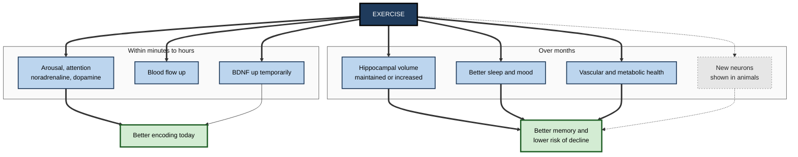
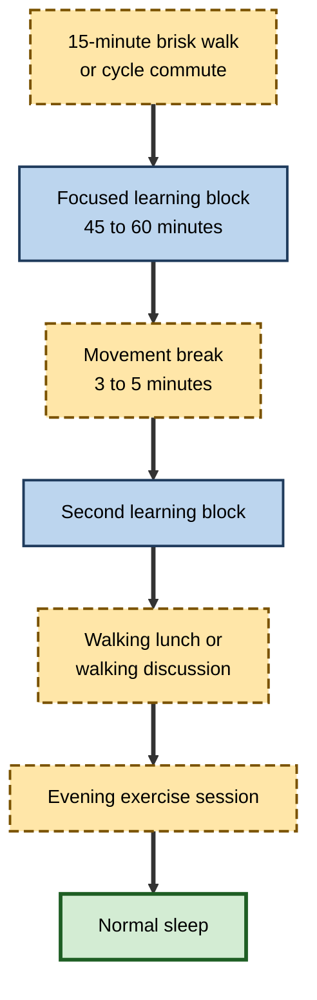

# G.9. Exercise Effects on Memory

> **In one sentence:** Moving your body — from a brisk walk to a sports session — tends to help memory a little right away and more meaningfully over months, by boosting alertness, blood flow and growth factors that support the hippocampus.
>
> **Why it matters:** Exercise is one of the few lifestyle factors with randomised-trial evidence for small but real cognitive benefits across the lifespan, and physical inactivity is a recognised modifiable dementia risk factor. For knowledge workers who sit most of the day, it is also a practical lever for better learning days.
>
> **Level span:** Novice → Expert · **Reading time:** ~17 min · **Builds on:** the hippocampus; synaptic plasticity; consolidation
>
> **Note:** This is educational content, not medical advice. Check with a health professional before starting a new exercise programme if you have a health condition.

---

## The Learning Ladder

| Level | Badge | After this level you can... |
|---|---|---|
| 1 | NOVICE | Explain in plain words how moving your body helps your brain and memory. |
| 2 | FOUNDATIONS | Distinguish acute from chronic effects and name the main biological mechanisms. |
| 3 | PRACTITIONER | Fit exercise around learning to support encoding and consolidation. |
| 4 | ADVANCED | Interpret the meta-analytic evidence, effect sizes and debates, including publication bias. |
| 5 | EXPERT / PRO | Design workplace programmes and learning events that use movement credibly. |

---

## Level 1 · Novice — The Big Picture

Think of your brain as a garden. Exercise does two things for it. In the short term, it is like watering: blood flow and alertness rise, so the garden looks livelier for a while. In the long term, it is like good soil and fertiliser: regular activity helps the brain grow and maintain the connections that memory depends on, especially in the hippocampus.

You have already experienced this when:

- A short walk cleared your head and you came back able to concentrate.
- You noticed that during weeks when you exercised regularly you felt sharper.
- A meeting held while walking felt more energetic and memorable than one in a stuffy room.

The novice point: **regular movement is good for your memory, and a short bout of activity can give you a small, temporary lift.** It is not a miracle — but it is one of the best-supported habits for a healthy brain.

---

## Level 2 · Foundations — Core Concepts

### Acute versus chronic effects

| | Acute exercise | Chronic exercise (training) |
|---|---|---|
| **What it is** | A single bout, such as 20 minutes of brisk cycling | Regular activity over weeks to months |
| **Main effects** | Short-lived boost in arousal, attention and possibly encoding | Lasting improvements in cognition, memory and executive function; brain structure changes |
| **Strength of evidence** | Small effects, with some debate about publication bias | Small-to-moderate effects in many randomised trials |

### How exercise may help memory

| Mechanism | Plain meaning |
|---|---|
| **Increased blood flow** | More oxygen and nutrients reach the brain. |
| **BDNF (brain-derived neurotrophic factor)** | A protein that supports synaptic plasticity and neuron survival; levels rise with exercise. |
| **Neurogenesis (in animals)** | Running increases the birth of new neurons in the rodent hippocampus; in humans this remains uncertain. |
| **Arousal and neurotransmitters** | Noradrenaline and dopamine rise, improving attention and possibly consolidation. |
| **Better sleep and mood** | Regular exercise improves sleep quality and reduces anxiety and depressive symptoms, which indirectly help memory. |
| **Vascular and metabolic health** | Lower blood pressure, better blood sugar control — both protect the brain over decades. |

**Figure G.9-1 — Pathways from exercise to memory.**

*How to read it:* the top group are short-term effects, the bottom group long-term ones; dotted arrows mark mechanisms established in animals but uncertain in humans.

### Key Terms

| Term | Plain meaning |
|---|---|
| **Aerobic exercise** | Sustained activity that raises heart rate, like brisk walking, running, cycling. |
| **Resistance training** | Exercise against a load, like weights or body-weight exercises. |
| **Mind–body exercise** | Practices such as yoga and tai chi combining movement, breathing and attention. |
| **Exergame** | A video game requiring physical movement. |
| **BDNF** | Brain-derived neurotrophic factor, a protein supporting plasticity. |
| **Executive function** | Planning, inhibition and flexible thinking. |
| **Standardised mean difference (SMD)** | A way of expressing effect size; around 0.2 is small, 0.5 medium, 0.8 large. |

---

## Level 3 · Practitioner — Putting It to Work

### The Move-to-Learn Plan

1. **Build a regular base.** Aim for the World Health Organization's adult guideline: 150–300 minutes of moderate aerobic activity per week (or 75–150 minutes vigorous), plus muscle-strengthening activity on two or more days. Any amount is better than none.
2. **Move before demanding learning.** A 10–20 minute brisk walk or light cardio before a study session can raise alertness. Avoid exhausting yourself immediately before learning.
3. **Consider moving after learning, too.** Some studies found that a bout of exercise some hours after learning improved retention days later, plausibly by boosting consolidation; evidence is still limited.
4. **Break up long sitting.** Stand, stretch or walk for a few minutes every 30–60 minutes during long study or work blocks.
5. **Combine movement with thinking.** Walking discussions and walking one-to-ones work well for reflective conversations, not for detailed note-taking.
6. **Pick activities you will keep doing.** The best exercise for memory is the one you do consistently — aerobic, resistance, dance, yoga and sport all show benefits.

**Figure G.9-2 — A learning day with movement built in.**

*How to read it:* long-dash boxes are movement, solid boxes are learning; the day ends with sleep, which exercise also supports.

### Worked example — a remote software developer learning a new language

| | Before | After |
|---|---|---|
| **Routine** | Sits 9–10 hours; studies after work on the sofa. | Walks 20 minutes before the morning study block; stands up every 45 minutes. |
| **Weekly activity** | Almost none. | Three runs and two short strength sessions per week. |
| **Learning** | Evening study feels sluggish; little sticks. | Morning study block with higher focus; evening run after study days. |
| **Three months later** | Stalled. | Completes the course, sleeping better and reporting better concentration. |

### Common mistakes

- **Exhausting workouts right before learning.** Very intense, fatiguing exercise can temporarily impair cognition.
- **Expecting dramatic immediate memory gains.** Acute effects are small; chronic training gives the bigger payoff.
- **Treating exercise as optional for "brain workers".** Inactivity is a dementia risk factor.

---

## Level 4 · Advanced — Mechanisms, Models & Evidence

### Chronic training: the big picture

A large umbrella review published in the *British Journal of Sports Medicine* in 2025 pooled 133 systematic reviews covering more than 2,700 randomised trials and over 250,000 participants. It found that exercise improved:

| Outcome | Effect size (SMD) | Interpretation |
|---|---|---|
| General cognition | about 0.42 | small to moderate |
| Memory | about 0.26 | small |
| Executive function | about 0.24 | small |

Other findings: memory and executive function benefits were larger in children and adolescents than in adults and older adults; low-to-moderate intensity activity was effective; exergames, mind–body practices, dance, aerobic and resistance training all showed benefits. Umbrella reviews inherit the quality of the reviews they include, and heterogeneity was substantial.

### Brain structure

A frequently cited 2011 trial by Kirk Erickson and colleagues found that a year of moderate aerobic walking in older adults increased hippocampal volume by about 2 percent, while a stretching control group showed the typical age-related decline; improvements correlated with serum BDNF and spatial memory. Later meta-analyses suggest exercise helps *preserve* hippocampal volume rather than reliably growing it, and not every trial replicates the volume change.

### Acute exercise

- Meta-analyses suggest a single bout of moderate exercise before encoding produces a small improvement in memory, particularly free recall of verbal material.
- A 2024 Bayesian meta-analysis found evidence for a small beneficial effect of acute physical activity on cognition in young adults.
- A 2024 network meta-analysis found high-intensity interval training (HIIT) produced the largest acute rise in blood BDNF; how blood levels relate to brain BDNF in humans is uncertain.
- A meta-meta-analysis has argued that after correcting for publication bias, the average acute effect on memory may be close to zero, even though individual well-designed studies on verbal episodic memory converge on small positive effects. This tension is unresolved.

### Exercise after learning

Experiments on timing have found that exercise after learning, including a few hours after, can improve retention at later tests, possibly by elevating noradrenaline and dopamine during early consolidation. For motor skills, studies found that a bout of intense exercise after practice enhanced retention. The number of such studies is modest.

### Animal mechanisms

Henriette van Praag and colleagues showed in 1999 that voluntary running in mice increased hippocampal neurogenesis and improved learning. Rodent studies also show exercise raises hippocampal BDNF, enhances LTP, and improves vascularisation. Translation to humans is plausible but indirect; human adult neurogenesis remains debated.

### Dementia prevention

The 2024 Lancet Commission on dementia included physical inactivity among fourteen modifiable risk factors that together account for an estimated 45 percent of dementia cases worldwide (a population-level estimate based on observational data, not a guarantee for individuals). Multidomain trials such as the Finnish FINGER study, combining exercise, diet, cognitive training and vascular risk management, have shown modest cognitive benefits in at-risk older adults; worldwide adaptations are ongoing.

### Moderators and open questions

- **Dose and type**: Benefits appear across types; the optimal combination is unclear.
- **Fitness change**: Cognitive gains do not always track gains in aerobic fitness, suggesting multiple pathways.
- **Who benefits most**: Children, adolescents and people with lower baseline activity often show larger effects.
- **Publication bias and blinding**: Participants cannot be blinded to exercise, and positive results are more often published.

---

## Level 5 · Expert / Pro — Professional Mastery

### Designing movement into learning and work

| Context | Evidence-informed design |
|---|---|
| Full-day training | Movement breaks every 60 minutes; post-lunch active session; walking reflection pairs |
| Remote learning | Encourage walking before live sessions; camera-off movement breaks |
| Leadership offsites | Morning optional activity; walking one-to-ones |
| Wellness programmes | Track participation and sustained activity, not just sign-ups |
| Office design | Stairs, walking routes, standing options |

### Measuring impact credibly

A pro avoids claiming that a step-count challenge "boosted cognition by 20 percent". Better metrics: participation and retention in activity programmes, self-reported sleep and energy, and — if cognition is measured — validated tests with a control group, reported with effect sizes.

### Professional scenario

**Role:** Head of learning at a professional-services firm running a two-week analyst bootcamp.
**Situation:** Analysts sit for nine hours daily in classrooms; afternoon engagement and day-to-day retention are low.
**What the pro does:** Restructures days into 50-minute blocks with five-minute movement breaks, makes the post-lunch slot an active case exercise with standing groups, and offers optional morning runs or yoga. Retention checks the following morning improve modestly, and engagement scores rise. The pro reports this honestly as a package of changes, not as proof that exercise alone caused the improvement.

### Inclusion and ethics

- Not everyone can exercise in the same way; design inclusive options (chair-based movement, flexible timing).
- Avoid tying exercise to performance evaluation or making it compulsory.
- Wearable data is personal health data; collect only with consent and clear purpose.

---

## Myths vs. Evidence

| Myth | What the evidence shows |
|---|---|
| "One workout instantly supercharges memory." | Acute effects are small and debated; chronic training gives more reliable benefits. |
| "Only intense cardio helps the brain." | Moderate activity, resistance training, mind–body exercise and dance also show benefits. |
| "Exercise grows new brain cells in adults." | Shown in rodents; human adult neurogenesis is uncertain. |
| "It's too late to benefit in older age." | Trials in older adults show benefits, although effects tend to be smaller than in young people. |
| "Brain games are as good as exercise." | Exercise has broader evidence for general cognitive and health benefits than most commercial brain games. |

## Practitioner Toolkit

**Weekly movement-for-memory checklist**

- [ ] At least 150 minutes of moderate activity this week (or equivalent vigorous).
- [ ] Two sessions of muscle-strengthening activity.
- [ ] A short walk before my most demanding learning block.
- [ ] Movement breaks during long sitting.
- [ ] Activities I enjoy enough to repeat.

**Template — move-and-learn log**

| Day | Activity and minutes | Learning block | Focus (1–5) | Next-day recall (1–5) |
|---|---|---|---|---|
| | | | | |

*Reminder:* this is educational content, not medical advice.

## Self-Check

1. **[NOVICE]** How can a short walk help you learn?
2. **[FOUNDATIONS]** What is the difference between acute and chronic exercise effects?
3. **[FOUNDATIONS]** What is BDNF and why does it matter?
4. **[PRACTITIONER]** Plan a learning day that incorporates movement.
5. **[ADVANCED]** What did the 2025 umbrella review find about exercise and memory?
6. **[ADVANCED]** Why is the acute-exercise literature contested?
7. **[ADVANCED]** What did the 2011 walking trial find about hippocampal volume?
8. **[EXPERT / PRO]** How would you evaluate a workplace movement programme honestly?

### Answer Key

1. It raises alertness, attention and blood flow, which supports encoding for a while afterwards.
2. Acute: short-term effects of one bout. Chronic: lasting effects of regular training over weeks or months.
3. Brain-derived neurotrophic factor, a protein supporting synaptic plasticity and neuron survival; exercise raises it.
4. Example: morning walk, focused blocks with movement breaks, walking lunch, evening exercise, normal sleep.
5. Small improvements in memory (SMD around 0.26), larger for general cognition (around 0.42), bigger in young people, across many exercise types.
6. Effects are small and some analyses suggest publication bias could reduce the average effect to near zero.
7. A year of moderate walking increased hippocampal volume by about 2 percent in older adults, compared with decline in controls.
8. Track participation and sustained activity; if measuring cognition, use validated tests, a control group and effect sizes; avoid exaggerated claims.

## Key Takeaways

- Exercise helps memory through **arousal, blood flow, BDNF, sleep, mood and vascular health**.
- **Chronic training** gives small-to-moderate cognitive benefits; memory effects are small but real on average.
- **Acute effects** are small and debated; a walk before learning is still sensible.
- Many **exercise types** work; consistency matters most.
- **Physical inactivity** is a modifiable dementia risk factor.
- Design movement into learning days **inclusively** and report results **honestly**.

## Glossary

| Term | Meaning |
|---|---|
| Acute exercise | A single bout of physical activity. |
| Aerobic exercise | Sustained activity raising heart rate. |
| BDNF | Brain-derived neurotrophic factor, supporting plasticity. |
| Chronic exercise | Regular training over weeks or months. |
| Executive function | Planning, inhibition and flexible thinking. |
| Exergame | Video game requiring physical activity. |
| HIIT | High-intensity interval training. |
| Mind–body exercise | Practices like yoga and tai chi. |
| Neurogenesis | Birth of new neurons. |
| Publication bias | Tendency for positive results to be published more than null ones. |
| Resistance training | Exercise against a load. |
| Umbrella review | A review that synthesises multiple systematic reviews. |
