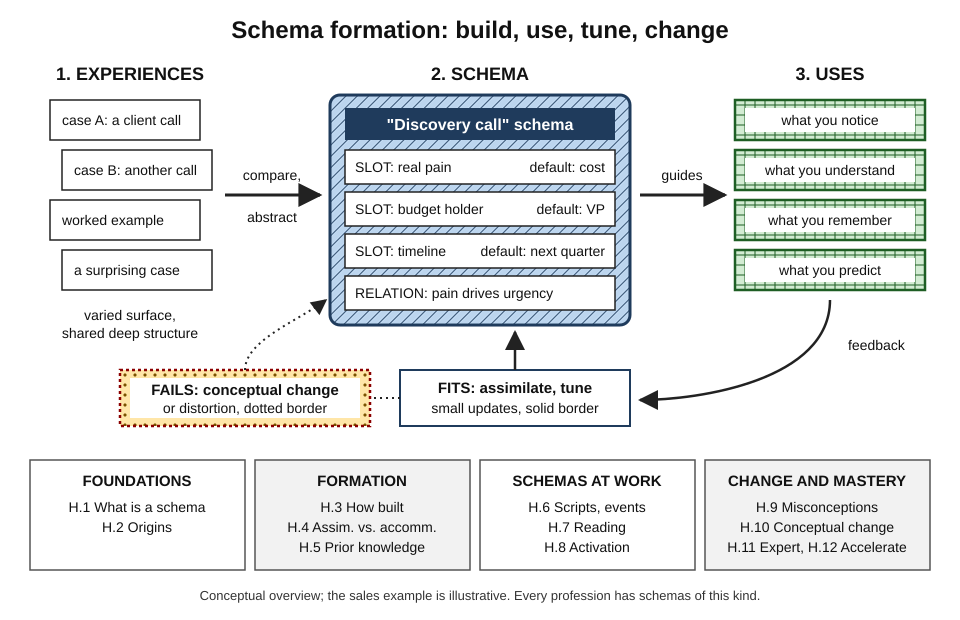
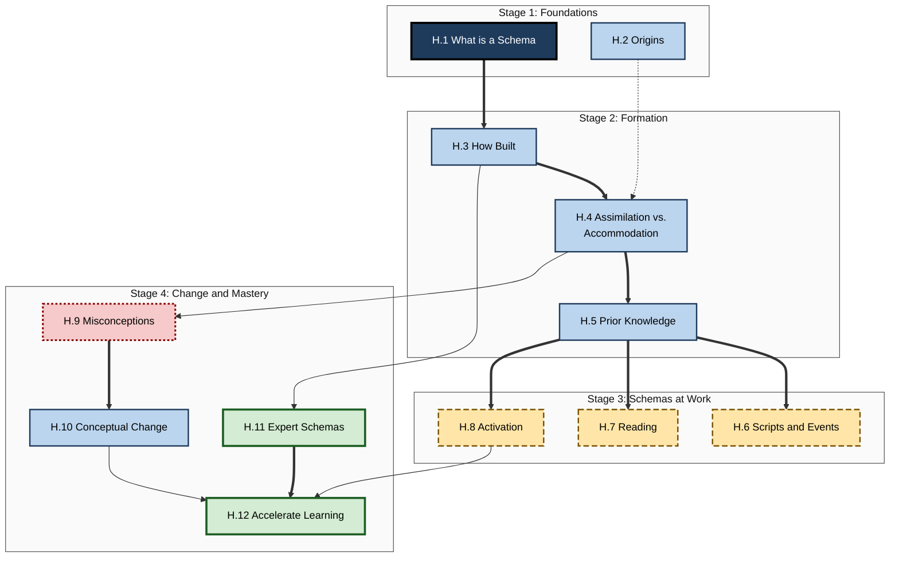
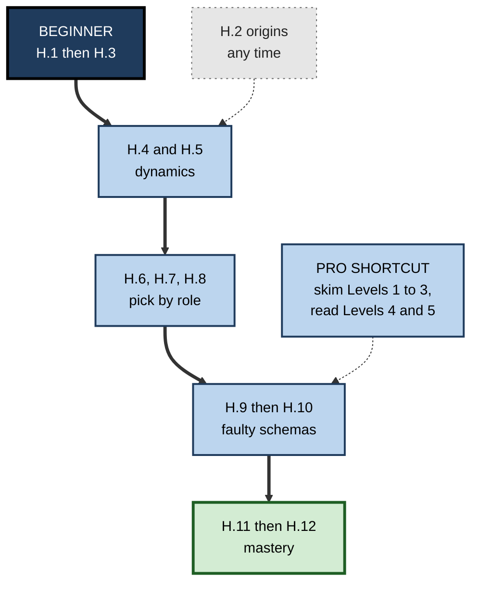

# H. Schema Formation

> **What this subtopic is about:** How the mind organizes knowledge into schemas — structured templates for kinds of things, situations and events — how those schemas are built, activated, distorted and changed, and how to use them deliberately to learn faster and build real expertise.
>
> **Who it is for:** Anyone who learns for a living — students, new joiners, career switchers, managers, trainers, L&D professionals and experts who teach others · **Notes in this subtopic:** 12 · **Level span:** Novice → Expert

---

## Overview

A **schema** is an organized, generic knowledge structure in long-term memory, with slots for the usual parts of a situation, default guesses for what is not stated, and relations that link the parts. Schemas are why a restaurant you have never visited still makes sense, why an experienced engineer reads a stack trace in seconds, and why two people can read the same report and come away with very different understanding.

This subtopic moves through four stages. It starts with **foundations** — what a schema is and where the idea came from. It then explains **how schemas form and grow**: through varied examples and comparison, through assimilation and accommodation, and on the base of prior knowledge. Next it shows **schemas at work** in everyday events, reading and the moments before learning. Finally it turns to **changing and mastering schemas**: faulty schemas (misconceptions), conceptual change, rich expert schemas, and a schema-first approach to accelerating learning.

*Figure H-1 — Schema formation at a glance.* Experiences feed schema building (left); schemas then guide perception, comprehension and memory (centre); feedback either tunes them or, when they fail, drives conceptual change (right). The four bands across the bottom match the four stages of this subtopic.

---

## Why It Matters

- **Expertise is mostly schema quality.** Experts differ from novices less in raw memory or intelligence than in the size and organization of their schemas.
- **Learning speed depends on schemas.** New information that fits an existing schema is understood and consolidated faster; information with nowhere to attach is easily lost.
- **Schemas cause predictable errors.** False memories, biased defaults, misreading and resistance to new ideas are all schema effects.
- **Change programmes are schema change.** Reskilling, new operating models and AI adoption succeed only when people genuinely restructure how they think.
- **AI raises the stakes.** Judging fluent AI output requires rich schemas, while letting AI do the thinking can bypass the processing that builds them.

---

## What You Will Learn

| # | Note | Core question it answers | Primary level |
|---|---|---|---|
| H.1 | What is a Schema? | What is a schema, what are its parts, and how does it help and mislead us? | Novice |
| H.2 | Schema Theory Origins | Where did schema theory come from, and which parts of it still hold? | Foundations |
| H.3 | How Schemas Are Built | How do experiences turn into schemas, and how can we speed that up? | Foundations |
| H.4 | Assimilation vs. Accommodation | When do we fit new information into old schemas, and when must we change them? | Foundations |
| H.5 | Schemas and Prior Knowledge | How does what we already know help or hinder new learning? | Practitioner |
| H.6 | Scripts and Event Schemas | How do we understand and remember sequences of events? | Practitioner |
| H.7 | Schemas in Reading Comprehension | Why does understanding a text depend so much on knowledge? | Practitioner |
| H.8 | Schema Activation Before Learning | What should happen in the minutes before new learning? | Practitioner |
| H.9 | Misconceptions as Faulty Schemas | Why do wrong ideas feel right and resist correction? | Advanced |
| H.10 | Schema Change and Conceptual Change | What actually changes a faulty schema? | Advanced |
| H.11 | Building Rich Expert Schemas | How do expert schemas differ, and how are they built? | Expert |
| H.12 | Using Schemas to Accelerate Learning | How do we put it all together to get up to speed fast? | Expert |

---

## Concept Map

**Figure H-2 — How the twelve notes fit together.**

*How to read it:* boxes are grouped into four stages; thick arrows show the main line of ideas, thin arrows show supporting links, and the dotted arrow marks historical background. H.12 draws the whole subtopic together.

---

## Recommended Learning Path

1. **Start here (everyone):** H.1, then H.3. These give you the core vocabulary — slots, defaults, relations — and the mechanics of building schemas.
2. **Understand the dynamics:** H.4 and H.5. How new information is absorbed or forces change, and how prior knowledge shapes everything.
3. **See schemas in action:** H.6, H.7 and H.8, in any order, depending on whether your work is event-heavy (H.6), reading-heavy (H.7) or teaching-heavy (H.8).
4. **Deal with what goes wrong:** H.9, then H.10.
5. **Aim for mastery:** H.11, then H.12.
6. **Context, any time:** H.2 places the ideas historically; read it when you want to argue precisely about what "schema" means.

**Figure H-3 — Suggested routes through the subtopic.**

*How to read it:* the thick path is the beginner route; experienced practitioners can skim the early levels of each note and enter at H.9; the dotted origin box can be read at any point.

**Where a beginner starts:** Level 1 and 2 of H.1, H.3 and H.5. **What a pro can skim:** Levels 1–3 of most notes; the Level 4 evidence sections and Level 5 scenarios carry the professional value, especially in H.5 (the prior-knowledge paradox), H.8 (prequestion effect sizes), H.10 (refutation and the backfire debate) and H.11 (cognitive task analysis).

---

## The Big Ideas in Brief

**H.1 What is a Schema?** A schema is an organized, generic knowledge structure with slots, defaults and relations, abstracted from many experiences. It makes understanding fast and reduces working-memory load, but it also fills gaps with plausible falsehoods and steers attention away from the unexpected. Neural evidence links schemas to the medial prefrontal cortex and shows existing schemas speed up consolidation of fitting information.

**H.2 Schema Theory Origins.** The idea runs from Kant through Head's body schema, Bartlett's reconstructive memory and Piaget's schemes, to the 1970s frames, scripts and schemata of Minsky, Schank and Abelson, and Rumelhart, then into cognitive load theory and modern neuroscience. Bartlett's dramatic distortion findings replicate only partly; Piaget's stage ages have been revised; the core ideas endure.

**H.3 How Schemas Are Built.** Schemas grow by accretion, tuning and restructuring. They are built from many varied examples, through comparison, explanation and spaced practice, with sleep helping integration. Comparing two or more cases produces far more abstraction than studying one; worked examples help novices most and should be faded as expertise grows.

**H.4 Assimilation vs. Accommodation.** Most learning fits new input into existing schemas; real change requires altering the schema itself. Disequilibrium can lead to accommodation or to distortion. Accommodation needs the mismatch to be noticed, a plausible alternative, and time and safety. Organizations often over-assimilate change: new words, old thinking.

**H.5 Schemas and Prior Knowledge.** Prior knowledge strongly predicts final performance, but a large 2022 meta-analysis found its average relation to learning *gains* close to zero with very wide variation — it can help, hurt or do nothing. Memory favours both clearly congruent and clearly novel information. Diagnose prior knowledge with explain-why and misconception probes before teaching.

**H.6 Scripts and Event Schemas.** Scripts are schemas for event sequences, with roles, props, scenes and tracks. People fill memory gaps with script actions and remember deviations well. Event segmentation theory explains how prediction failures carve experience into units. Professional checklists and runbooks are external scripts; train for when the script breaks.

**H.7 Schemas in Reading Comprehension.** Understanding a text means building a situation model, mostly from the reader's schemas. Topic knowledge can outweigh general reading skill, and a lottery-based study of a knowledge-rich curriculum found sizeable reading gains. Build the missing schema before a hard read; write documents that supply schemas; treat AI summaries as a textbase, not understanding.

**H.8 Schema Activation Before Learning.** Advance organizers produce small-to-moderate benefits; prequestions reliably improve learning of the questioned content, with little effect on other content. Activation must be followed by refutation when misconceptions are likely. A five-minute routine — frame, bridge, ask, expose, loop back — captures most of the value.

**H.9 Misconceptions as Faulty Schemas.** Misconceptions are coherent, often sensible-seeming schemas — false beliefs, flawed models or category mistakes. They persist because they work in everyday life and protect themselves through assimilation. Old intuitions are suppressed rather than erased. Detect them with prediction and twist-case probes.

**H.10 Schema Change and Conceptual Change.** Change needs dissatisfaction, intelligibility, plausibility and fruitfulness, plus "warm" factors such as identity and trust. Refutation texts have consistent support in a pre-registered meta-analysis; the much-feared backfire effect proved rare. Change is gradual, and organizations must also change templates, metrics and tools.

**H.11 Building Rich Expert Schemas.** Experts have large, principle-organized, conditionalized schemas and big chunks or templates, shown classically in chess and physics. Deliberate, feedback-rich practice is necessary but not sufficient. Rich schemas risk entrenchment and expert blind spots; cognitive task analysis extracts what experts cannot easily say.

**H.12 Using Schemas to Accelerate Learning.** Build a small, accurate skeleton of the domain first; fill it with worked examples, self-explanation and case comparison; strengthen it with spaced retrieval and interleaving. Schema-first onboarding cuts time to competence. AI should prompt and critique the learner's thinking, not replace it.

---

## Novice-to-Pro Progression

| Level | What competence looks like here |
|---|---|
| NOVICE | Explains what a schema is with everyday examples; recognizes that understanding depends on what you already know. |
| FOUNDATIONS | Uses the vocabulary — slots, defaults, assimilation, accommodation, scripts, situation models — accurately; distinguishes kinds of prior knowledge and misconceptions. |
| PRACTITIONER | Sketches schemas, maps scripts, runs pre-read and activation routines, diagnoses prior knowledge and builds schemas deliberately from varied cases. |
| ADVANCED | Interprets the evidence, including contested and failed-to-replicate findings; explains neural and cognitive mechanisms; detects misconceptions and runs refutation-based change. |
| EXPERT / PRO | Designs schema-first onboarding, case libraries, misconception inventories and AI-assisted practice; extracts expert schemas; measures time to competence and novel-case performance. |

---

## Where This Shows Up at Work

- **Onboarding:** schema-first role maps, case cards and faded worked examples shorten time to competence.
- **Engineering and operations:** incident case libraries, runbooks as scripts, and contributing-factor models replace "single root cause" thinking.
- **Consulting and sales:** expert diagnostic schemas (pricing problems, account health, discovery calls) captured as canvases and playbooks with deviations.
- **Data and analytics:** misconception inventories for statistics and experimentation; explicit causal models instead of correlation-driven claims.
- **Documentation and communication:** writing that supplies schemas — purpose first, predictable structure, early examples, explicit refutation of surprising points.
- **Change management:** treating transformation as conceptual change — elicit, refute, replace, rehearse — and changing the templates and metrics that encode the old schema.
- **Healthcare and safety-critical work:** cue-based decision training derived from cognitive task analysis.
- **AI adoption:** surfacing staff's schemas of what AI is, refuting misconceptions, and preserving unaided practice so juniors build the schemas needed to judge AI output.

---

## Capstone Exercises

1. **Schema sketch (NOVICE to PRACTITIONER).** Pick a recurring situation in your work. Draw its schema: slots, defaults, relations. Test it against three real cases and revise.
2. **Script map with deviations (PRACTITIONER).** Map the script of a recurring meeting or process you lead, including the five most likely deviations and your response to each. Use it for a month and update it.
3. **Prior-knowledge diagnostic (PRACTITIONER).** Write a five-question explain-why diagnostic for a topic you teach or onboard others on. Include one misconception probe. Run it with three colleagues.
4. **Refutation rewrite (ADVANCED).** Take a common misconception in your field. Write a refutation paragraph using the template from H.10 and test whether it changes predictions on a twist case.
5. **Case library (ADVANCED to EXPERT).** Collect twenty real cases from your domain, sort them by deep pattern, and compare your sorting with an expert's.
6. **Schema-first onboarding design (EXPERT / PRO).** Redesign the first month of onboarding for a role you know: skeleton map, worked examples, case comparisons, AI use rules, and a time-to-competence metric.

---

## Key Takeaways

- A **schema** is an organized knowledge structure with slots, defaults and relations; it makes understanding fast and creates predictable errors.
- Schemas are **built from varied examples through comparison, explanation and spaced practice**, and change by accretion, tuning and restructuring.
- **Prior knowledge** shapes all learning; its effect must be diagnosed, not assumed.
- Schemas drive **event memory, reading comprehension and readiness to learn**.
- **Misconceptions are faulty schemas**; changing them requires refutation, a better model, practice and attention to identity and trust.
- **Expertise is rich, principle-organized schema**; it can be extracted, taught and accelerated.
- In the AI era, **build schemas deliberately** and use AI to prompt and critique, not to think for you.
