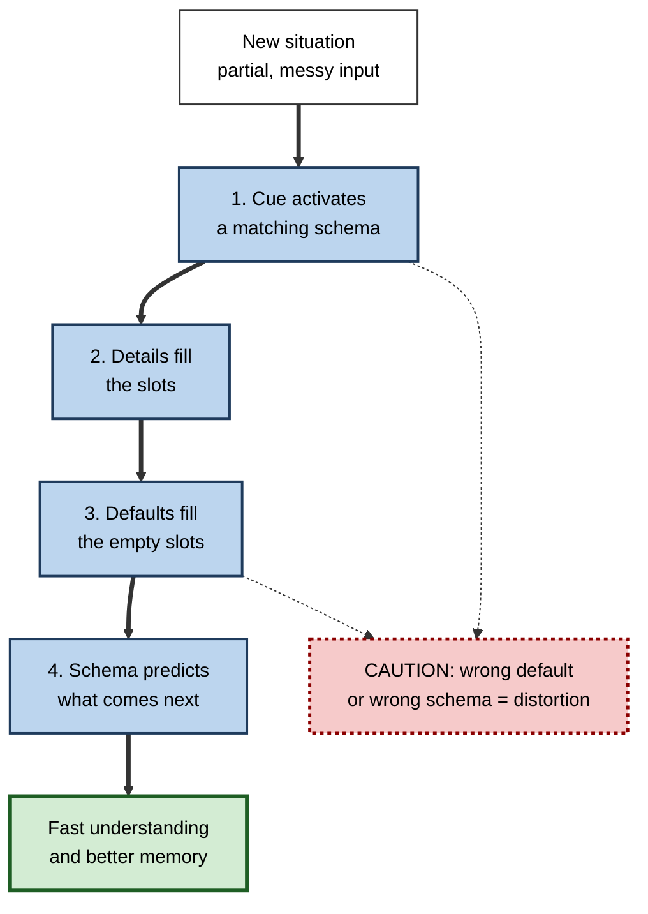
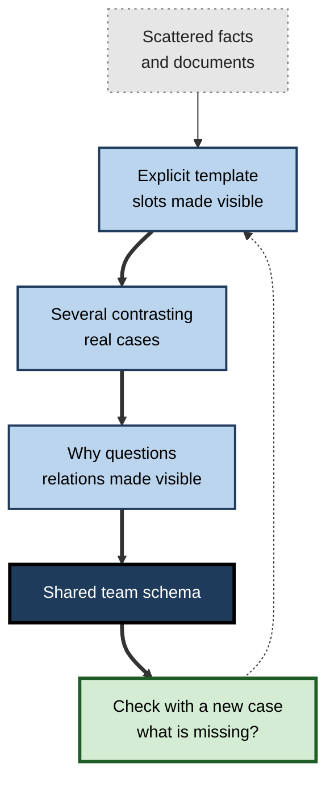

# H.1. What is a Schema?

> **In one sentence:** A schema is an organized bundle of knowledge in your long-term memory about some kind of thing or situation, with "slots" for the usual parts and sensible default guesses for anything you have not been told.
>
> **Why it matters:** Schemas are why experts understand faster, remember more and spot problems sooner than beginners. Knowing what schemas are lets you learn on purpose by building them, and lets you notice when a schema is quietly distorting what you see.
>
> **Level span:** Novice → Expert · **Reading time:** ~17 min · **Builds on:** long-term memory, working memory (basic idea only)

---

## The Learning Ladder

| Level | Badge | After this level you can... |
|---|---|---|
| 1 | NOVICE | Explain what a schema is with an everyday example and say why it helps you understand quickly. |
| 2 | FOUNDATIONS | Name the parts of a schema (slots, default values, relations, constraints) and distinguish schemas from single facts, scripts and mental models. |
| 3 | PRACTITIONER | Draw out the schema behind a topic you are learning and use it to spot gaps in your own knowledge. |
| 4 | ADVANCED | Explain how schemas work in the mind and brain, where they help memory and where they distort it, and what is still debated. |
| 5 | EXPERT / PRO | Design training, documentation and AI-assisted workflows that deliberately build, check and update schemas in other people. |

---

## Level 1 · Novice — The Big Picture

Walk into a restaurant you have never visited. Without any instructions you know roughly what will happen: someone seats you or you find a table, you read a menu, you order, food arrives, you eat, you pay. You did not learn this restaurant. You brought a general "restaurant" pattern with you, and it filled in everything nobody told you.

That general pattern is a **schema** (plural *schemas* or *schemata*): a mental template, built from many past experiences, that captures what things of a certain kind are usually like. You have schemas for objects (a chair, a car), places (an office, an airport), people roles (a doctor, a manager), events (a job interview, a birthday party) and abstract ideas (a contract, a budget, a software bug).

A good analogy is a **form with blank fields**. A "job interview" form has fields like *interviewer*, *questions about experience*, *a chance to ask questions*, *thank-you at the end*. When you go to a real interview, your brain fills in the fields with the actual details. Any field nobody fills in gets a sensible default ("there will probably be a question about my weaknesses").

You have already experienced schemas at work when:

- You read "She grabbed her umbrella and sighed" and instantly assumed it was raining, although rain was never mentioned.
- You started a new job and the second week felt far easier than the first, because you had built a schema for how things work there.
- You confidently remembered seeing something that was never there — books in an office, a till in a shop — because it "belongs" in that kind of place.

The beginner's takeaway: **a schema is your brain's ready-made frame for a kind of situation. It makes understanding fast, but it can also make you see what you expect instead of what is there.**

---

## Level 2 · Foundations — Core Concepts

### A working definition

Cognitive scientists describe a schema as **a structured, generic knowledge representation in long-term memory, abstracted from many specific experiences, that guides how new information is perceived, interpreted, stored and recalled.** Four words in that definition carry the weight:

1. **Structured** — a schema is not a loose pile of facts; its parts are connected by relations (part-of, causes, comes-before, is-a-kind-of).
2. **Generic** — it describes a *type* ("meetings"), not one instance ("Tuesday's meeting").
3. **Abstracted** — it is distilled from repeated experiences; the specific details of each episode fall away and the common pattern remains.
4. **Guides processing** — it is active: it directs attention, fills gaps, generates expectations and shapes memory.

### The anatomy of a schema

The classic account by David Rumelhart (1980) and the related "frames" of Marvin Minsky (1974) describe the same building blocks.

| Part | What it is | Example in a "software bug report" schema |
|---|---|---|
| **Slot (variable)** | A field that each instance fills differently | Steps to reproduce, expected result, actual result, environment |
| **Default value** | The assumed filler when no information is given | Environment = production, severity = medium |
| **Constraint** | What kinds of value can go in a slot | Severity must be one of low, medium, high, critical |
| **Relation** | How slots connect | Actual result differs from expected result *because of* the bug |
| **Embedded schema** | A smaller schema nested inside | "Environment" has its own schema: OS, version, browser |

**Figure H.1-1 — How a schema processes a new situation.**

*How to read it:* the thick path is what normally happens in a split second; the dotted arrows show where errors creep in.

### Schemas compared with related ideas

| Term | What it is | How it relates to a schema |
|---|---|---|
| **Fact** | One isolated piece of information | Facts become useful once they sit in a schema's slots. |
| **Concept** | A mental category ("dog", "invoice") | Most researchers treat concepts as small schemas or as nodes within them. |
| **Script** | A schema for a sequence of events | A special kind of schema, ordered in time (restaurant, code review). |
| **Mental model** | A runnable simulation of how a specific system works | Built *from* schemas to reason about one situation; more specific and dynamic. |
| **Chunk** | A group of elements treated as one unit in working memory | A schema lets many elements be handled as one chunk. |
| **Stereotype** | A schema about a social group | Same mechanism; risky because defaults are applied to individuals. |

### Key terms

| Term | Plain meaning |
|---|---|
| **Schema** | An organized, generic knowledge structure for a type of thing or situation. |
| **Slot** | A field in a schema that each specific case fills differently. |
| **Default value** | The assumed filler for an empty slot. |
| **Instantiation** | Applying a schema to a specific case by filling its slots. |
| **Schema activation** | The moment a schema becomes "switched on" by cues and starts guiding processing. |
| **Schema-congruent** | Fits what the schema expects. |
| **Schema-incongruent** | Violates what the schema expects. |

---

## Level 3 · Practitioner — Putting It to Work

You cannot see a schema directly, but you can draw one. Making your schema explicit is one of the fastest ways to discover what you understand and what you only recognize.

### The Schema Sketch — a five-step method

1. **Pick a type, not an instance.** "Sales discovery calls", not "my call with Acme on Monday". Schemas are about kinds of things.
2. **List the slots.** Ask: what does every instance of this have? Write each as a field name (customer pain, budget holder, timeline, current solution).
3. **Write your defaults.** For each slot, what do you assume if nobody tells you? Defaults reveal your hidden expectations.
4. **Draw the relations.** Connect slots with labeled arrows: *causes*, *must happen before*, *depends on*, *is part of*. This is the step novices usually cannot complete, and it is the most important.
5. **Test against three real cases.** Fill the slots for three actual instances. Where a case does not fit, either the schema needs a new slot or a new sub-type, or your understanding of that case was shallow.

### Worked example — a new product manager learning "incident postmortems"

| | Before (facts without a schema) | After (schema sketched) |
|---|---|---|
| **What she knows** | Has read four postmortems; remembers fragments: "there was a timeline", "someone mentioned blameless". | Slots: trigger, detection, impact, timeline, root causes, contributing factors, action items, owners. |
| **Defaults** | None, so every new document feels new. | Default: multiple contributing factors, not one root cause; action items have owners and dates. |
| **Relations** | Unconnected. | Detection delay *increases* impact; contributing factors *explain* trigger; action items *target* factors. |
| **Result** | Reads the fifth postmortem slowly; cannot say whether it is good. | Reads it in minutes and notices immediately that no action item addresses the detection delay. |

The schema did not just help her remember; it told her **what to look for** and made a missing element visible. That is the practical power of schemas: a gap in a slot stands out.

### Common mistakes at this level

- **Listing topics instead of slots.** "Postmortems: blameless culture, SRE, Google" is a list of associations, not a structure.
- **Skipping the relations.** A schema without relations is a checklist. Understanding lives in the arrows.
- **Building from one example.** A schema abstracted from one case treats that case's quirks as defaults.
- **Forgetting that defaults are guesses.** A default is a bet, not a fact; mark it as such and check it.

---

## Level 4 · Advanced — Mechanisms, Models & Evidence

### What schemas do to memory: the classic evidence

Several well-known experiments show schemas operating at every stage of memory.

- **Comprehension depends on activating the right schema.** In a famous 1972 study by John Bransford and Marcia Johnson, people read a passage describing a procedure in vague terms. It seemed nonsensical — until readers were told beforehand that the topic was washing clothes. Those given the title before reading understood and recalled far more than those given it after. The schema had to be active *during* encoding.
- **Schemas fill gaps at recall.** In a 1981 study by William Brewer and James Treyens, people waited briefly in an "office" and were later asked what it contained. Many recalled books — which office schemas include — although there were none. They also recalled schema-typical items well and many odd items poorly.
- **Schemas shape what is noticed.** In a 1978 study by Richard Anderson and James Pichert, readers who took the perspective of a burglar or a home buyer recalled different details of the same house description; switching perspective later brought out further details, showing that the schema also guides retrieval.
- **Schemas reshape stories over time.** Frederic Bartlett's work in the 1930s found that people retelling an unfamiliar folk tale gradually made it more conventional. Later replication attempts are mixed: under strict accuracy instructions distortion is smaller than Bartlett reported, while under more natural conditions and long delays schema-driven rationalization does appear.

### Four defining features from modern memory research

Memory researchers Asaf Gilboa and colleagues summarize schemas as having four features: they are built on an **associative network** of elements; they are **abstracted from many episodes**; they **lack the detail** of any one episode; and they are **adaptable**, updating as new information comes in. This last feature distinguishes a schema from a rigid rule.

### Where schemas live in the brain

Converging evidence from humans and animals points to the **medial prefrontal cortex** (mPFC, the middle front part of the brain) as central to holding and applying schemas, working with the **hippocampus**, which binds new episodes. In a landmark 2007 study, Dorothy Tse and colleagues trained rats for weeks on a layout of flavor–location pairs. Once the rats had this schema, they learned new pairs that fit it within a single trial and those memories became independent of the hippocampus within about two days — far faster than standard consolidation predicts. A 2025 perspective in a leading neuroscience review journal links schema learning to reinforcement-learning ideas, proposing that the mPFC compresses experience into low-dimensional "task structure" that can be reused. The neural details are covered in the memory consolidation notes; the key point for learners is that **an existing schema speeds up the storage of new, fitting knowledge**.

### The double edge: help and distortion

| Schemas help by... | Schemas distort by... |
|---|---|
| Making understanding fast | Filling gaps with plausible but false defaults |
| Directing attention to what matters | Directing attention away from unexpected details |
| Reducing working-memory load (many items become one chunk) | Making people overconfident in "remembered" details |
| Speeding storage of fitting information | Producing false memories for schema-typical items |
| Supporting inference and prediction | Causing people to dismiss evidence that does not fit |

Neuroimaging work published in 2024 found that when a strong schema is active, brain activity patterns for schema-typical lures that were never seen closely resemble patterns for items that were actually seen, which helps explain why schema-based false memories feel genuine.

### Open debates

- **Is "schema" one thing?** Critics note that schemas lack agreed boundaries or units of measurement, so the term can describe almost any knowledge structure. Many researchers now treat "schema" as a family of related representations rather than a single mechanism.
- **Symbolic slots or statistical patterns?** Early accounts described explicit slots and defaults; connectionist and machine-learning views treat schemas as patterns that emerge in distributed networks. Both describe the same behavior at different levels.
- **Congruent versus surprising.** Information that fits a schema is usually remembered better, but highly surprising information can also be remembered well. When each wins is an active research question.

---

## Level 5 · Expert / Pro — Professional Mastery

### Schemas as the real product of training

Experienced learning designers treat schemas as the *unit of expertise*. Courses that deliver facts produce people who can answer quiz questions; courses that build schemas produce people who can read a new situation, know what matters, notice what is missing and predict what happens next. Practical design moves:

| Goal | Professional move |
|---|---|
| Make the schema visible | Teach the slots explicitly: templates, canvases, checklists that mirror the expert structure. |
| Make the relations visible | Ask "why does X lead to Y?" more often than "what is X?" |
| Build from variety | Show several contrasting cases so the schema abstracts the pattern, not one example's quirks. |
| Expose wrong defaults | Present cases where the usual default fails (the incident with no single root cause). |
| Check the schema, not recall | Assess by giving a new case and asking what is missing or what happens next. |

**Figure H.1-2 — From facts to a working schema in a team.**

*How to read it:* the thick path builds the schema; the dotted arrow shows that each check feeds back into the template.

### The AI-era twist

Generative AI produces fluent answers that slot neatly into whatever schema the user already has. That is helpful when the schema is sound and dangerous when it is not: a novice without a schema cannot tell that a plausible AI answer is missing a critical slot. Reviews of cognitive offloading published in 2025 and 2026 warn that letting AI generate the structure of a document or solution can bypass the very processing that would have built the learner's schema. Experts use AI to *stress-test* their schemas ("What does a typical X contain that this one lacks?") rather than to supply them.

### Professional scenario

**Role:** Head of customer-success enablement at a software company.
**Situation:** New account managers memorize product facts in onboarding but still miss renewal risks that veterans spot immediately.
**What the pro does:** Interviews five top performers and extracts their shared "account health" schema: slots for executive sponsor, usage trend, open escalations, budget cycle, competitor contact, with defaults and warning combinations. This becomes a one-page canvas used in every account review. New hires practise on ten anonymized real accounts, each chosen to break a different default. The assessment is a novel account where they must name the two biggest risks and the missing information. Time-to-first-accurate-risk-call drops, and managers report reviews now sound like the veterans' reviews.

### Ethical limits

Schemas about people are stereotypes. The same mechanism that lets a recruiter scan a CV in seconds can fill empty slots with biased defaults about age, gender or background. Professionals who rely on fast schema-based judgment build in structured checks — standardized criteria, blind review steps, and explicit "what would change my mind?" questions.

---

## Myths vs. Evidence

| Myth | What the evidence shows |
|---|---|
| "A schema is just a fancy word for knowledge." | A schema is a specific *organization* of knowledge with slots, defaults and relations; two people can know the same facts but hold very different schemas. |
| "Schemas only matter for children." | Schema effects on comprehension, memory and expertise are strong in adults and central to professional expertise. |
| "If I remember it vividly, it happened." | Schema-consistent false memories can feel just as vivid as true ones. |
| "Experts have better memories in general." | Expert memory advantages are largely domain-specific and depend on schemas; outside their domain experts recall about as well as anyone. |
| "Schemas are bad because they cause bias." | Schemas are essential for understanding; the goal is to keep them accurate and checkable, not to eliminate them. |
| "Bartlett proved memory always distorts stories over time." | Replications are mixed; distortion depends on instructions, delay and material. |

## Practitioner Toolkit

**Schema Sketch checklist**

- [ ] I chose a *type* of situation, not a single instance.
- [ ] I listed 5–10 slots that every instance has.
- [ ] I wrote my default for each slot and marked it as an assumption.
- [ ] I drew labeled relations between slots.
- [ ] I tested the schema on three real, varied cases.
- [ ] I noted where a case did not fit and revised the schema.

**Template — one-page schema canvas**

| Slot | Typical value (default) | Allowed range | Linked to (relation) | Warning sign if... |
|---|---|---|---|---|
| | | | | |

**Daily habit:** when something surprises you at work, ask "Which default did that break?" Write the answer down; that is a schema update.

## Self-Check

1. **[NOVICE]** In your own words, what is a schema? Give an everyday example.
2. **[NOVICE]** Why did the readers in the "washing clothes" study understand more when given the title first?
3. **[FOUNDATIONS]** Name four parts of a schema and give an example of each from your work.
4. **[FOUNDATIONS]** How does a script differ from a general schema?
5. **[PRACTITIONER]** Why is drawing relations the most important step in sketching a schema?
6. **[ADVANCED]** What did the rat experiment by Tse and colleagues show about schemas and memory consolidation?
7. **[ADVANCED]** Give two ways schemas help memory and two ways they distort it.
8. **[EXPERT / PRO]** How would you assess whether new hires have acquired an expert schema rather than memorized facts?
9. **[EXPERT / PRO]** What risk does generative AI pose for learners who lack a schema for a topic?

### Answer Key

1. An organized mental template for a kind of thing or situation, with slots and default values — for example, knowing what will happen at a restaurant.
2. The title activated the relevant schema *during* reading, so each vague sentence could be fitted into slots; given after reading, it came too late.
3. Slots, default values, constraints, relations (plus embedded schemas). Examples vary.
4. A script is a schema for a sequence of events, ordered in time, such as a meeting or a deployment.
5. Relations carry understanding — why things connect and what causes what; without them the schema is just a checklist.
6. Rats with a well-learned schema acquired fitting new associations in a single trial, and those memories became hippocampus-independent within about two days, much faster than usual.
7. Help: faster understanding, lower working-memory load, faster storage, better prediction. Distort: false memories for typical items, missing unexpected details, biased defaults, dismissing misfitting evidence.
8. Give a novel case and ask them to identify what is missing, what is risky and what will happen next; compare with expert judgment.
9. They cannot see what a plausible AI answer leaves out, and letting the AI produce the structure can bypass the processing that would build their own schema.

## Key Takeaways

- A **schema** is an organized, generic knowledge structure with **slots, defaults and relations**, abstracted from many experiences.
- Schemas make understanding **fast** and reduce working-memory load by turning many elements into one unit.
- The same mechanism produces **distortions**: false memories, missed surprises and biased defaults.
- An existing schema **speeds storage** of new fitting knowledge — a key reason experts learn faster in their domain.
- You can **make schemas explicit** by sketching slots, defaults and relations, then testing against varied cases.
- Training should aim to build **expert schemas**, assessed with novel cases, not just recall of facts.
- Use AI to **challenge** schemas, not to replace building them.

## Glossary

| Term | Meaning |
|---|---|
| Chunk | A group of elements that working memory handles as a single unit. |
| Concept | A mental category; often treated as a small schema. |
| Default value | The assumed filler for a schema slot when no information is given. |
| Frame | Minsky's term for a schema-like data structure with slots. |
| Hippocampus | Brain structure that binds new episodes; works with the mPFC to integrate them into schemas. |
| Instantiation | Applying a general schema to a specific case. |
| Medial prefrontal cortex (mPFC) | Front, middle region of the brain strongly linked to storing and applying schemas. |
| Mental model | A runnable representation of how a specific system works, built from schemas. |
| Schema | An organized, generic knowledge structure that guides perception, interpretation and memory. |
| Schema activation | The switching-on of a schema by cues, so that it begins guiding processing. |
| Script | A schema for a familiar sequence of events. |
| Slot | A variable in a schema that each instance fills. |
| Stereotype | A schema about a social group, applied to individuals. |
