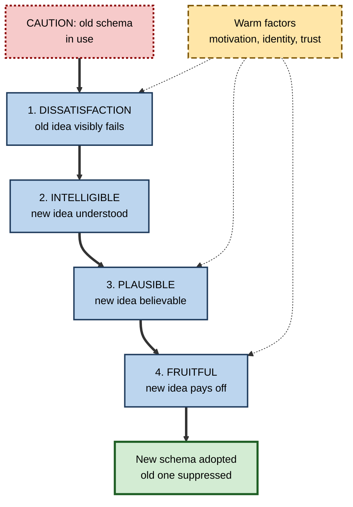
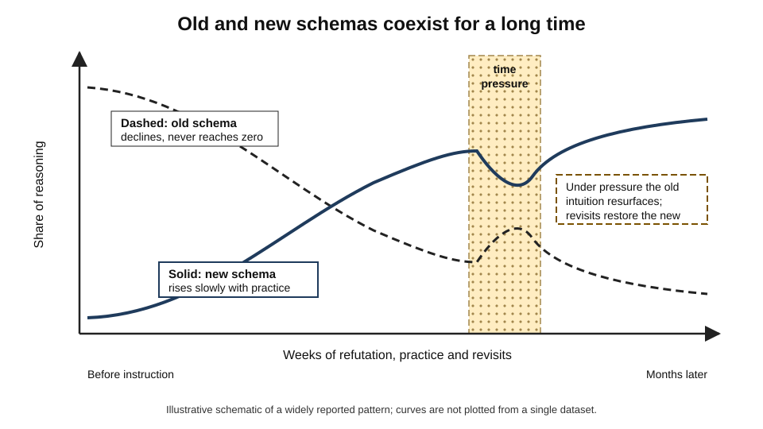
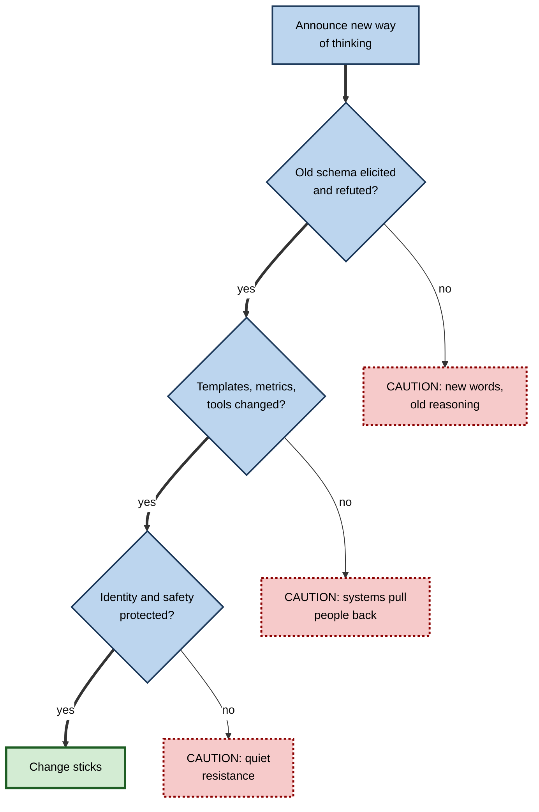

# H.10. Schema Change and Conceptual Change

> **In one sentence:** Conceptual change is the slow, effortful process of replacing or reorganizing a faulty schema — and it works best when people see clearly why the old idea fails, understand a better one, find it believable, and see that it pays off.
>
> **Why it matters:** Reskilling, strategy shifts, safety culture and AI adoption all depend on people genuinely changing how they think, not just learning new words. The research on conceptual change tells you which methods actually shift schemas and which only create the appearance of change.
>
> **Level span:** Novice → Expert · **Reading time:** ~18 min · **Builds on:** assimilation and accommodation; misconceptions as faulty schemas

---

## The Learning Ladder

| Level | Badge | After this level you can... |
|---|---|---|
| 1 | NOVICE | Explain why changing your mind about how something works is harder than learning a new fact. |
| 2 | FOUNDATIONS | Name the four classic conditions for conceptual change and the main kinds of change. |
| 3 | PRACTITIONER | Run a refutation-based routine to change a specific faulty schema in yourself or others. |
| 4 | ADVANCED | Summarize the evidence on refutation texts, cognitive conflict, analogies and "warm" factors, including what failed to replicate. |
| 5 | EXPERT / PRO | Design organizational unlearning, reskilling and change programmes grounded in conceptual-change evidence. |

---

## Level 1 · Novice — The Big Picture

Learning that your colleague's birthday is in May is easy. Learning that the way you have always thought about something is wrong is not. You have to notice the problem, give up a familiar idea, understand a new one, and then keep using the new one even when the old one feels more natural.

That second kind of learning is **conceptual change**: changing a schema itself rather than adding to it. It is what happened, historically, when people moved from believing the Sun circles the Earth to understanding the reverse. It is also what happens when a manager realizes that "holding people accountable" is not about blame, or when a developer stops thinking of the database as "just storage" and starts thinking of it as a system with its own performance behaviour.

An analogy: conceptual change is like **renovating a house you are living in**. You cannot demolish everything and start fresh; you still need somewhere to sleep tonight. You have to replace the structure piece by piece while still using the building — and for a while, old and new walls exist side by side.

You have already gone through conceptual change if:

- You moved from "being busy means being productive" to "productive means finishing the right things".
- You switched from thinking of feedback as criticism to thinking of it as information.
- You changed your view of a person or situation after seeing them from a new angle.

The beginner's takeaway: **changing a schema takes more than a correction. You need to see why the old idea fails and why the new one is better — and expect the old idea to linger for a while.**

---

## Level 2 · Foundations — Core Concepts

### The four classic conditions

In 1982, George Posner, Kenneth Strike, Peter Hewson and William Gertzog proposed that people accept a new conception — and give up an old one — when four conditions are met. This framework remains the most widely taught model of conceptual change.

| Condition | Question the learner implicitly asks | What helps |
|---|---|---|
| **Dissatisfaction** | "Does my current idea fail?" | Cases where the old schema makes a wrong prediction |
| **Intelligibility** | "Do I understand the new idea?" | Clear explanations, diagrams, worked examples |
| **Plausibility** | "Could it be true? Does it fit other things I know?" | Links to accepted knowledge, credible evidence |
| **Fruitfulness** | "Does it do more for me than the old idea?" | Showing it solving problems the old idea could not |

**Figure H.10-1 — The path to conceptual change.**

*How to read it:* each condition must be met in turn; the dotted arrows show that motivation, identity and trust influence whether people engage with the dissatisfaction, believe the new idea and value its payoff.

### Kinds of conceptual change

| Kind | What changes | Example |
|---|---|---|
| **Belief revision** | A single wrong belief is replaced | "Our SLA is 99.9%, not 99.99%." |
| **Model transformation** | A flawed model is replaced by a better one | From "one bottleneck" to "flow through a system of queues". |
| **Ontological shift** | The concept moves to a different category of explanation | From "an outage is caused by one person's mistake" to "outages emerge from interacting system conditions". |
| **Framework revision** | A whole network of assumptions is reorganized | From project-based to product-based thinking across an organization. |

### Key terms

| Term | Plain meaning |
|---|---|
| **Conceptual change** | Restructuring a schema rather than adding to it. |
| **Cognitive conflict** | The awareness that evidence contradicts one's current idea. |
| **Refutation text** | A text that states a misconception, explicitly refutes it and explains the correct idea. |
| **Bridging analogy** | A sequence of intermediate cases linking an intuition that is correct to a counterintuitive target. |
| **Ontological shift** | Moving a concept to a different kind of category. |
| **Warm conceptual change** | Conceptual change shaped by motivation, emotion and identity, not just logic. |
| **Unlearning** | Discarding or deliberately suppressing outdated knowledge or routines. |

---

## Level 3 · Practitioner — Putting It to Work

### The Refute–Replace–Rehearse routine

1. **Elicit.** Ask a prediction question that brings the old schema into the open. Get people to commit.
2. **Confront.** Show a case where the old schema's prediction fails — ideally real data from their own work.
3. **Refute explicitly.** State the misconception plainly, say it is wrong, and explain *why it seems right* (acknowledging the sensible origin lowers defensiveness).
4. **Replace.** Present the new model clearly: a diagram, a worked example, a comparison table of old versus new predictions.
5. **Show the payoff.** Solve a problem with the new model that the old one could not.
6. **Rehearse discrimination.** Practise on mixed cases — some where both models agree, some where they differ — so people learn *when* the old intuition misleads.
7. **Revisit.** Return weeks later with a new twist case. Expect some regression; re-correct briefly.

### Worked example — changing a "root cause" schema in an operations team

| | Before (announcement) | After (Refute–Replace–Rehearse) |
|---|---|---|
| **Intervention** | Memo: "We now run blameless postmortems." | Workshop starting with a past incident: "What was the root cause?" Most name one person's mistake. |
| **Confrontation** | — | Timeline shows six conditions that had to coincide; removing any one would have prevented the outage. |
| **Refutation** | — | "The single-root-cause idea feels right because stories need a villain. Complex systems fail differently." |
| **Replacement** | — | Contributing-factors model with a one-page template. |
| **Payoff** | — | Applied to two older incidents, it surfaces three systemic fixes the original reviews missed. |
| **Three months later** | Postmortems still name "human error" as root cause. | Most postmortems list multiple contributing factors and system-level actions. |

### Common mistakes at this level

- **Skipping elicitation.** If people have not committed to the old view, they can claim they "always knew" the new one, and nothing changes.
- **Refuting without explaining why the old idea is appealing.** People defend ideas that feel obviously sensible.
- **Confronting without supplying an alternative.** Conflict with no better model leads to confusion or explaining away.
- **Expecting a one-off session to work.** Conceptual change is gradual and needs revisiting.
- **Mistaking vocabulary for change.** People adopting new terms while reasoning the old way is the most common false positive.

---

## Level 4 · Advanced — Mechanisms, Models & Evidence

### Refutation texts: the best-supported single technique

A **refutation text** names a common misconception, explicitly states that it is incorrect, and presents the scientific explanation. A pre-registered meta-analysis published in 2024–2025, synthesizing 76 studies, 111 samples and 294 effect sizes, found a **consistent advantage** for refutation texts over standard expository texts in addressing scientific misconceptions. Earlier meta-analyses reached similar conclusions. Mechanistically, refutation texts are thought to work by **co-activating** the misconception and the correct idea, making the conflict noticeable, and supplying the explanation in the same moment.

Boundary conditions: effects are larger when the explanation is clear and causal, when the misconception is common and well specified, and when outcomes are measured soon after; long-term persistence is less studied and some regression is typical.

### Broader conceptual-change strategies

A 2024 meta-analysis of conceptual-change strategies in science education found strong overall effects but marked dependence on **duration, instructional design and assessment format**. Strategies that combined cognitive conflict with structured alternatives and sustained practice outperformed brief, single-technique interventions.

| Strategy | Evidence summary |
|---|---|
| **Cognitive conflict alone** | Mixed: can trigger change, but learners often explain away anomalies unless supported. |
| **Refutation text or lecture** | Consistently positive across many studies. |
| **Bridging analogies** | Positive in physics and other domains when anchored in a correct intuition (developed by John Clement and colleagues). |
| **Ontological training** | Teaching the category of "emergent processes" helped students understand diffusion and similar concepts in work by Chi and colleagues. |
| **Inoculation and prebunking** | Warning learners in advance about misleading arguments reduces later uptake of misinformation; a 2025 study extended this to conceptual contamination in science learning. |

### Change is gradual and incomplete

Conceptual change research increasingly describes change as a **gradual shift in which ideas people use in which contexts**, rather than a sudden swap. Old intuitions remain available and can be reactivated under time pressure or stress. This matches findings that even scientists show slower responses when intuition and science conflict.

*Figure H.10-2 — Gradual conceptual change.* Solid line: share of reasoning that uses the new schema, rising slowly with a dip under pressure. Dashed line: share using the old schema, falling but never reaching zero. Schematic of a widely reported pattern; not plotted from a single dataset.

### Warm conceptual change

Early models of conceptual change were "cold" — purely about logic and evidence. Work from the 1990s onward, starting with Paul Pintrich and colleagues' influential 1993 critique, showed that **motivation, emotion, identity and trust** strongly affect whether change happens. People resist changes that threaten their identity, status or group membership, and are more open when they feel competent, safe and respected. Recent studies on refutation texts report that conceptual change can reduce negative emotions and improve attitudes toward a topic, suggesting that cognitive and affective change interact.

### What failed to replicate: the backfire effect

A widely publicized idea from around 2010 claimed that correcting a misconception can "backfire", making people believe it more strongly. Large, later replication efforts found this effect to be **rare**; in most studies, corrections reduce belief in misinformation, even if they do not eliminate it. The practical guidance shifted accordingly: correct clearly, explain why, offer an alternative — and do not avoid correcting out of fear of backfire.

### Neural perspective

Neuroimaging studies of people with scientific training, working through counterintuitive problems, report activity in regions associated with **inhibitory control** and conflict monitoring, supporting the idea that conceptual change involves building new schemas *and* learning to inhibit old ones.

---

## Level 5 · Expert / Pro — Professional Mastery

### Organizational unlearning

Organizations face conceptual change at scale: shifting from waterfall to product thinking, from blame to learning culture, from human-only to human-plus-AI workflows. Research on **organizational unlearning** emphasizes that old routines and assumptions persist in processes, incentives and tools — not just in heads. Professional practice therefore works on two levels:

| Level | Conceptual-change move |
|---|---|
| **Individual schemas** | Elicit, confront, refute, replace, rehearse, revisit |
| **Shared schemas** | Leaders model the new framing; stories and case examples circulate |
| **Embedded schemas** | Change templates, metrics, incentives and tools that encode the old schema |
| **Warm factors** | Protect identity ("your experience is valuable; this extends it"), provide safety to try, recognize early adopters |

**Figure H.10-3 — Why a change programme stalls or sticks.**

*How to read it:* the thick path shows the three conditions for durable change; each "no" branch is a distinct, common failure mode.

### AI adoption as conceptual change

Moving teams to AI-assisted work requires several conceptual changes at once: from "the tool retrieves facts" to "the tool generates plausible text that must be verified"; from "AI output is finished work" to "AI output is a draft I am accountable for"; from "learning is less necessary now" to "knowing enough to judge output matters more". Effective programmes treat these as misconceptions to elicit and refute, with real examples of fluent but wrong output from the team's own domain.

### Professional scenario

**Role:** HR business partner leading a shift to skills-based talent management in a manufacturing firm.
**Situation:** Managers still describe people by job titles and tenure; the new skills taxonomy is ignored.
**What the pro does:** Runs sessions where managers first predict who on their team could fill a new role, using their usual reasoning. Then shows skills data revealing two strong internal candidates they overlooked. Acknowledges why title-based thinking made sense historically. Introduces a simple skills profile and practises with real vacancies. Changes the promotion template to require skills evidence. Revisits after three months with a fresh vacancy. Internal fills for new roles rise; managers' language in talent reviews shifts from titles to skills.

### Ethical limits

Conceptual-change techniques are powerful persuasion tools. Professionals reserve them for well-supported conclusions, are transparent about intent, and remain open to evidence that the "old" schema was right in some contexts.

---

## Myths vs. Evidence

| Myth | What the evidence shows |
|---|---|
| "Showing people the evidence is enough." | Evidence without a clear alternative and support is often explained away. |
| "Correcting misconceptions usually backfires." | Large replication efforts found backfire effects rare; clear corrections usually help. |
| "Conceptual change is a sudden insight." | It is usually gradual, with old and new ideas coexisting for a long time. |
| "Conceptual change is purely logical." | Motivation, identity, emotion and trust strongly influence it. |
| "Once people use the new terms, they have changed." | New vocabulary is easily absorbed into old schemas; check reasoning on twist cases. |

## Practitioner Toolkit

**Refute–Replace–Rehearse checklist**

- [ ] I elicited the old schema with a prediction question.
- [ ] I showed a case where the old schema fails, from the learners' own context if possible.
- [ ] I named the misconception and explained why it seems right.
- [ ] I presented the new model clearly, with an example.
- [ ] I showed a payoff the old schema could not deliver.
- [ ] I set practice on mixed cases that require discriminating between models.
- [ ] I scheduled a revisit with a new twist case.
- [ ] I checked templates, metrics and tools for the old schema.

**Template — refutation paragraph**

> Many people believe **[misconception]**. That makes sense because **[why it seems right]**. But it is not accurate: **[evidence]**. What actually happens is **[correct model]**, because **[causal explanation]**. You can see the difference when **[twist case]**.

## Self-Check

1. **[NOVICE]** Why is conceptual change harder than learning a new fact?
2. **[NOVICE]** Give an example of conceptual change you have experienced.
3. **[FOUNDATIONS]** Name and explain the four conditions from Posner and colleagues.
4. **[FOUNDATIONS]** What is an ontological shift? Give an example.
5. **[PRACTITIONER]** Why should you explain why the misconception seems right?
6. **[ADVANCED]** What did the 2024–2025 pre-registered meta-analysis find about refutation texts?
7. **[ADVANCED]** What is the current status of the "backfire effect"?
8. **[EXPERT / PRO]** Why can organizational change stall even after successful workshops?
9. **[EXPERT / PRO]** List three conceptual changes needed for effective AI adoption.

### Answer Key

1. It requires noticing that an existing schema fails, understanding and believing a new one, and suppressing the old one, which remains available.
2. Answers vary — for example, shifting from "feedback is criticism" to "feedback is information".
3. Dissatisfaction (old idea fails), intelligibility (new idea understood), plausibility (new idea believable), fruitfulness (new idea pays off).
4. Moving a concept into a different category of explanation — for example, from "outages are caused by one person" to "outages emerge from interacting conditions".
5. It reduces defensiveness and helps learners identify when the intuition will mislead them.
6. A consistent advantage for refutation texts over standard texts across 76 studies, 111 samples and 294 effect sizes.
7. It is rare; large replications found corrections usually reduce belief in misinformation.
8. Templates, metrics, incentives and tools may still encode the old schema, and identity or safety concerns may drive quiet resistance.
9. AI generates rather than retrieves; AI output is a draft I am accountable for; domain knowledge matters more for judging output.

## Key Takeaways

- **Conceptual change** restructures schemas; it is slower and harder than adding facts.
- Change needs **dissatisfaction, intelligibility, plausibility and fruitfulness**.
- **Refutation** — naming, refuting and explaining — is the best-supported single technique.
- Change is **gradual**; old intuitions are suppressed, not erased, and resurface under pressure.
- **Warm factors** — identity, motivation, trust — can make or break change.
- The **backfire effect is rare**; correct clearly and offer an alternative.
- In organizations, change **templates, metrics and tools**, not just minds.

## Glossary

| Term | Meaning |
|---|---|
| Backfire effect | Claimed strengthening of a belief after correction; found to be rare. |
| Bridging analogy | A chain of intermediate cases linking a correct intuition to a counterintuitive target. |
| Cognitive conflict | Awareness that evidence contradicts one's current idea. |
| Conceptual change | Restructuring of a schema rather than addition to it. |
| Fruitfulness | The new idea's ability to solve problems the old one could not. |
| Inoculation (prebunking) | Warning people in advance about misleading arguments. |
| Intelligibility | Whether the new idea is understood. |
| Ontological shift | Moving a concept into a different category of explanation. |
| Organizational unlearning | Discarding outdated routines and assumptions embedded in an organization. |
| Plausibility | Whether the new idea seems believable and consistent with other knowledge. |
| Refutation text | Text that names, refutes and explains a misconception. |
| Warm conceptual change | Conceptual change shaped by motivation, emotion and identity. |
