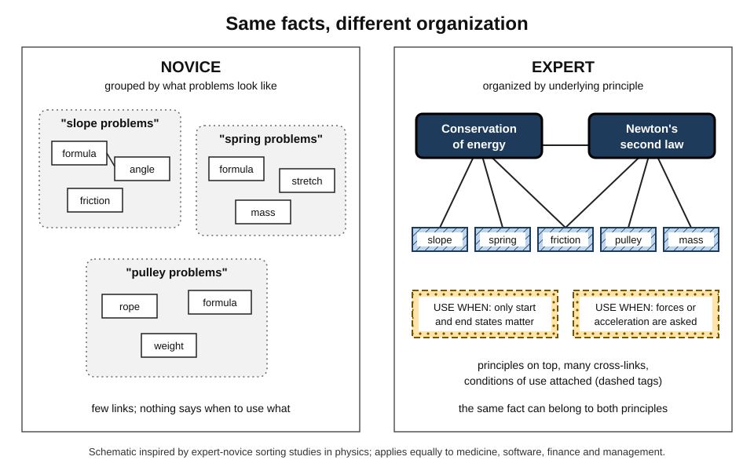
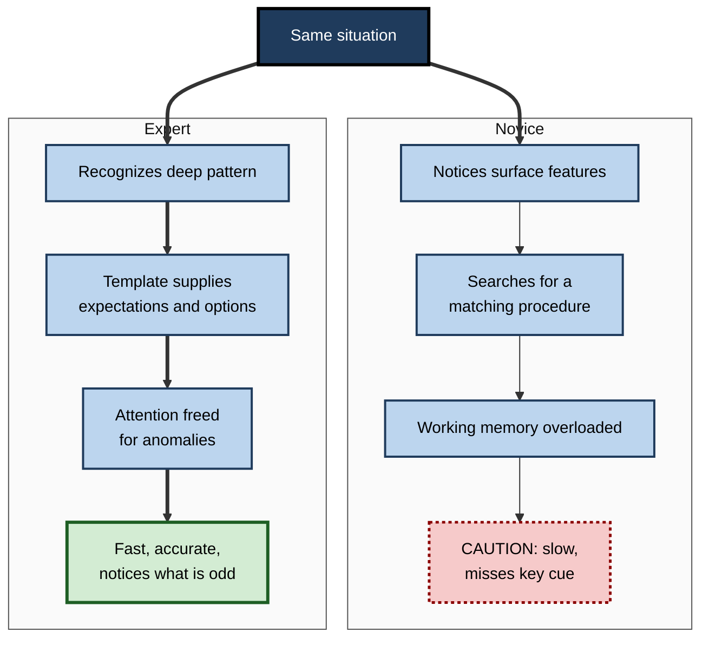
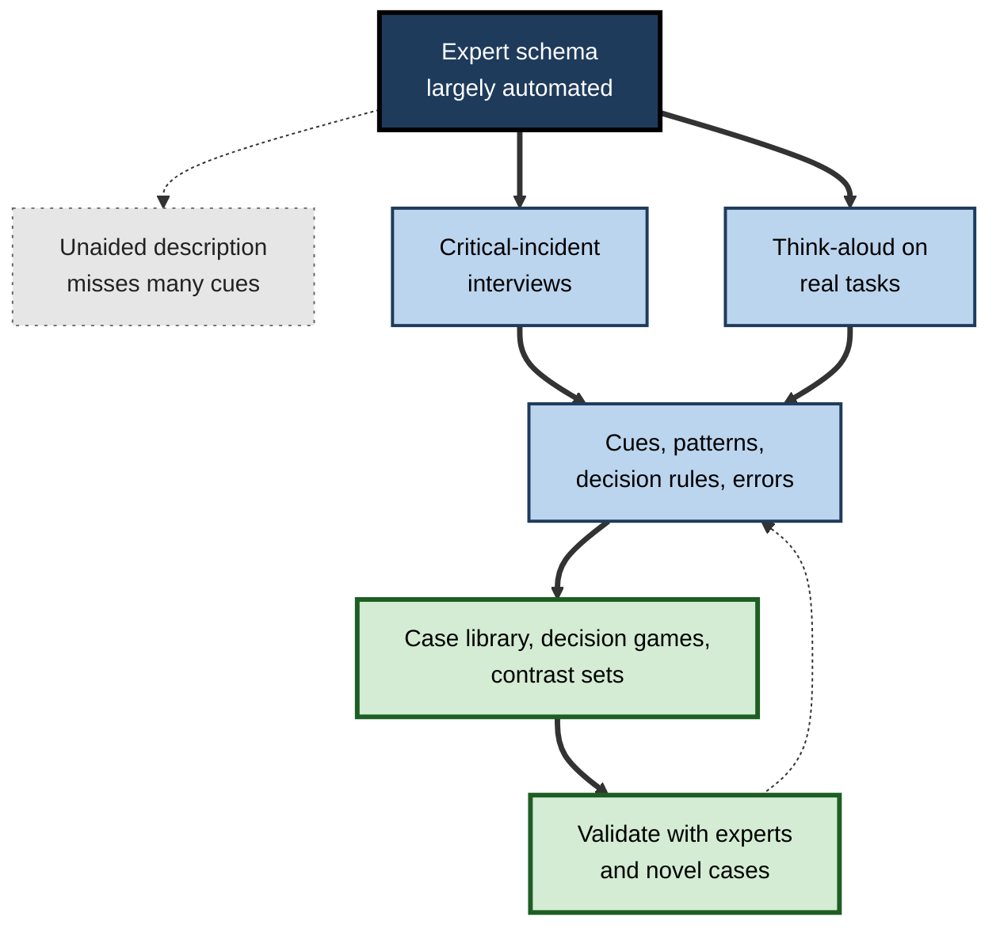

# H.11. Building Rich Expert Schemas

> **In one sentence:** Experts do not simply know more facts; they have large, deeply organized schemas built around the underlying principles of their field, which let them see meaningful patterns instantly, remember far more, and know what to do next.
>
> **Why it matters:** Expertise is what organizations pay for, and it is mostly schema quality. Knowing how expert schemas differ from novice ones — and how they are built — lets you accelerate your own development, extract expertise from senior people and design training that produces experts rather than people who have merely been trained.
>
> **Level span:** Novice → Expert · **Reading time:** ~18 min · **Builds on:** how schemas are built; schemas and prior knowledge; scripts

---

## The Learning Ladder

| Level | Badge | After this level you can... |
|---|---|---|
| 1 | NOVICE | Explain how an expert "sees" a situation differently from a beginner. |
| 2 | FOUNDATIONS | Describe the main differences between novice and expert schemas: size, organization, deep features, conditions of use and automation. |
| 3 | PRACTITIONER | Use case libraries, sorting tasks, deliberate practice and feedback to enrich your own schemas. |
| 4 | ADVANCED | Explain the classic chess and physics evidence, chunking and template theory, long-term working memory, and the debates about deliberate practice and expertise flexibility. |
| 5 | EXPERT / PRO | Extract expert schemas with cognitive task analysis and turn them into training, tools and AI-supported practice. |

---

## Level 1 · Novice — The Big Picture

Show a chessboard from a real game to a chess master for five seconds, then remove it. The master can rebuild most of the position. A beginner places a handful of pieces. But scatter the pieces randomly — positions that could never occur in a real game — and the master's advantage largely disappears.

The master does not have a better memory. The master has **richer schemas**: thousands of familiar patterns of pieces ("a castled king with a pawn shield", "a typical attack on the queen's side"). A real position is a few familiar patterns; a random position is just a pile of pieces, for the master as for the beginner.

The same thing happens in every profession. A senior radiologist glances at a scan and sees the shadow that matters. An experienced editor reads a paragraph and knows what is wrong with its structure. A veteran engineer reads an error message and knows which three things to check. They are seeing the situation through **rich expert schemas**.

An analogy: a novice looking at a professional situation is like a tourist looking at a city with no map — every street is new. An expert has a **detailed mental map with the main roads, landmarks and shortcuts marked**, and knows which route to take for each destination.

You have already seen this when:

- A colleague solved in minutes a problem you had been stuck on for hours, because they "had seen this kind of thing before".
- You became fast at something in your own job that new joiners find overwhelming.
- An expert could not explain *how* they knew — they just saw it.

The beginner's takeaway: **expertise is mostly the quality of your schemas — how much you know, and how it is organized around what matters.**

---

## Level 2 · Foundations — Core Concepts

### How expert schemas differ from novice schemas

| Feature | Novice schemas | Expert schemas |
|---|---|---|
| **Size** | Small, few patterns | Very large libraries of patterns and cases |
| **Organization** | Loosely connected facts, grouped by surface features | Hierarchies organized around deep principles |
| **What gets noticed** | Surface features (topic, wording, look) | Deep structure (the principle, the cause, the risk) |
| **Conditions of use** | Knows *what*, not *when* | Knowledge tagged with when and why it applies |
| **Chunk size** | Small chunks; working memory fills fast | Large chunks; much more can be held and processed |
| **Automation** | Effortful, step by step | Routine parts automatic; attention freed for novelty |
| **Self-monitoring** | Poor sense of what they don't know | Better at noticing errors and anomalies |

*Figure H.11-1 — Novice versus expert knowledge organization.* Left: a novice's facts are grouped by surface features, with few links. Right: an expert's knowledge is organized under deep principles, with many cross-links and attached "when to use" conditions. Schematic based on expertise research.

### Key terms

| Term | Plain meaning |
|---|---|
| **Expertise** | Consistently superior performance on representative tasks of a domain. |
| **Chunk** | A familiar pattern treated as a single unit. |
| **Template** | A large, high-level chunk with slots for variable details (template theory). |
| **Deep features** | The principles, causes and structures that define a problem type. |
| **Conditionalized knowledge** | Knowledge stored with the conditions under which it applies. |
| **Long-term working memory** | Experts' ability to use long-term memory structures to hold far more information active than working memory alone allows. |
| **Deliberate practice** | Effortful practice targeted at specific weaknesses, with feedback. |
| **Adaptive expertise** | Expertise that flexibly handles novel situations, not just routine ones. |

**Figure H.11-2 — How a situation is processed by a novice and by an expert.**

*How to read it:* the same input splits into two routes; the expert route is driven by recognition of a deep pattern rather than search.

---

## Level 3 · Practitioner — Putting It to Work

### Five practices that build expert schemas

1. **Build a case library.** Collect real cases from your work — incidents, deals, designs, negotiations — with what happened and why. Aim for dozens, then hundreds. Expert schemas are built from many cases.
2. **Sort by deep structure.** Regularly group cases by underlying principle, not by client or date. Ask: "Which of these are really the same problem?" Compare your sorting with an expert's.
3. **Practise deliberately on weaknesses.** Identify specific sub-skills you get wrong; design short, focused practice with immediate feedback (decision exercises, code katas, mock negotiations).
4. **Predict before you look.** Before seeing the outcome of a case or the expert's answer, commit to a prediction. The gap between prediction and outcome is where schemas get tuned.
5. **Tag knowledge with conditions.** For each technique, write "use when... / don't use when..." Experts' knowledge is conditionalized; novices' is not.

### Worked example — a junior consultant building a "pricing problem" schema

| | Before (accumulating experience) | After (deliberate schema building) |
|---|---|---|
| **Cases** | Has worked on three pricing projects; remembers them as separate stories. | Collects 25 pricing cases from the firm's archive. |
| **Organization** | By client industry. | Re-sorted by deep problem: value capture, competitive response, channel conflict, packaging. |
| **Practice** | Learns on live projects only. | Weekly 30-minute exercise: reads a case brief, predicts the core problem, compares with the partner's diagnosis. |
| **Conditions** | "We usually do a conjoint study." | "Conjoint when features are separable and customers can judge trade-offs; not for new categories." |
| **After six months** | Recognizes cases resembling her own three. | Diagnoses the core problem in new cases in the first meeting, matching partners' diagnoses far more often. |

### Common mistakes at this level

- **Equating years with expertise.** Experience without feedback and reflection can produce confident but poorly calibrated schemas.
- **Collecting cases without comparing them.** Schemas form from comparison, not accumulation.
- **Practising what you are already good at.** Comfortable repetition builds automation but not new schema structure.
- **Learning only the "happy path".** Experts know failure modes; build cases of what went wrong.
- **Ignoring conditions.** Techniques without "when" knowledge produce misapplication.

---

## Level 4 · Advanced — Mechanisms, Models & Evidence

### Chess: chunks and templates

Adriaan de Groot's studies of chess masters in the 1940s and William Chase and Herbert Simon's 1973 follow-up established the central finding: masters recall briefly shown game positions far better than weaker players, but the advantage shrinks dramatically for random positions. Chase and Simon explained this with **chunking**: experts perceive familiar configurations as single units and have tens of thousands of such chunks.

Later work by Fernand Gobet and Simon refined this into **template theory**: frequently encountered chunks develop into larger templates — schema-like structures with fixed core and variable slots. Template theory accounts for more of the data than competing theories, including findings that experts recall several boards at once and that chunks are larger than first thought. It also explains a subtle result: strong players keep a **small** advantage even with random positions, because a large chunk library occasionally finds familiar patterns by chance.

### Physics: deep versus surface features

In a landmark 1981 study, Michelene Chi, Paul Feltovich and Robert Glaser asked physics experts and novices to sort problems. Novices grouped them by **surface features** ("inclined plane problems", "spring problems"). Experts grouped them by **deep principles** ("conservation of energy", "Newton's second law"). The same pattern has since been found in mathematics, medicine, programming, management and many other fields. Expert schemas are indexed by principle, which is why experts retrieve the right approach while novices retrieve a superficially similar one.

### Long-term working memory

K. Anders Ericsson and Walter Kintsch proposed in 1995 that experts develop **long-term working memory**: retrieval structures in long-term memory that let them keep large amounts of task information accessible, far beyond normal working-memory limits. This explains why expert waiters, doctors and programmers can hold complex situations in mind and resume after interruptions. It is domain-specific — a direct product of rich schemas.

### Recognition-primed decisions

Gary Klein's studies of firefighters, military commanders and nurses showed that experienced professionals rarely compare options systematically under time pressure. They **recognize** the situation as a type, which immediately brings plausible goals, cues to watch, expectancies and a workable action; they then mentally simulate that action to check it. This **recognition-primed decision** model is schema theory in action: decisions flow from pattern recognition built through extensive experience.

### How expert schemas are built: practice and its debates

Ericsson's work on **deliberate practice** argued that expert performance results from years of effortful, feedback-rich practice aimed at weaknesses. A 2014 meta-analysis by Brooke Macnamara and colleagues found that deliberate practice explained a meaningful but smaller share of performance differences than this view implied, varying considerably by domain; later analyses continued the debate. The current consensus is nuanced: high-quality, feedback-rich practice is necessary for expertise in most domains, but not sufficient, and other factors (starting age, working-memory capacity, opportunity, motivation) also matter.

### The dark side: entrenchment and expert blind spots

| Risk | Description |
|---|---|
| **Cognitive entrenchment** | Highly stable schemas can make experts less flexible when the domain changes (new technology, new rules). |
| **Einstellung** | A familiar solution blocks a better one. Studies have shown even strong chess players miss shorter solutions when a familiar one is visible. |
| **Expert blind spot** | Experts underestimate the steps novices need, making them poor teachers without support. |
| **Routine vs. adaptive expertise** | Giyoo Hatano and Kayoko Inagaki distinguished routine experts (fast and accurate on familiar tasks) from adaptive experts (able to invent new procedures). Adaptive expertise requires understanding *why* procedures work, not just how. |

The **expertise reversal effect** completes the picture: instructional support that helps novices becomes redundant or harmful for experts. A 2025 meta-analysis confirmed this interaction across many studies and found it asymmetric — providing support to novices helps more than withholding it from experts.

---

## Level 5 · Expert / Pro — Professional Mastery

### Extracting expert schemas: cognitive task analysis

Experts' knowledge is largely automated, so they omit much of it when explaining. Research on **cognitive task analysis** (CTA), associated with Richard Clark and colleagues, suggests that experts leave out a large share of the decisions and cues they actually use when describing a task. CTA uses structured interviews, think-aloud observation and critical-incident methods to surface:

- the cues experts notice;
- the patterns (schemas) they recognize;
- the goals and expectancies each pattern brings;
- the decision rules and their conditions;
- the common errors and how experts detect them.

Training built from CTA has repeatedly outperformed training built from experts' unaided descriptions in fields such as surgery and the military.

**Figure H.11-3 — From hidden expert schema to trainable content.**

*How to read it:* the dotted branch on the left shows what is lost when experts simply describe their work; the thick paths show cognitive task analysis surfacing the schema and turning it into practice material, validated in a loop.

### Turning expert schemas into training and tools

| Output | What it contains |
|---|---|
| **Case libraries** | Real cases organized by deep pattern, with expert commentary |
| **Decision games** | Short scenarios: "What do you notice? What do you expect? What do you do?" |
| **Contrast sets** | Pairs of cases that look alike but differ in deep structure, and vice versa |
| **Cue checklists** | The few signals experts use to classify situations |
| **Simulation with feedback** | Compressed experience with immediate, expert-calibrated feedback |

### AI-era implications

AI changes the economics of expertise. Routine pattern recognition is increasingly automated, which can remove the very practice through which juniors used to build schemas ("the apprenticeship gap"). At the same time, judging AI output — spotting the plausible but wrong answer — requires rich schemas. Organizations respond by:

- deliberately preserving schema-building practice for juniors (doing tasks unaided before using AI on them);
- using AI to generate large, varied case sets and simulations for decision games;
- pairing AI tools with expert-curated case libraries rather than replacing them;
- assessing judgment on novel and adversarial cases, not just speed with AI.

### Professional scenario

**Role:** Clinical education lead at a hospital network.
**Situation:** Newly qualified nurses are slow to recognize early patient deterioration; senior nurses "just know" but cannot say how.
**What the pro does:** Runs cognitive task analysis interviews with six expert nurses about past deterioration cases. Extracts a cue set (subtle changes in breathing, behaviour, skin and the patient's own sense that something is wrong) and the patterns these combine into. Builds a library of 40 anonymized cases, including look-alike cases that were not deterioration. New nurses complete short weekly decision games with expert feedback. Assessment uses unseen cases. Recognition speed and accuracy on simulated cases improve, and new nurses' escalations become better aligned with senior judgment.

### Developing adaptive, not just routine, expertise

- Vary practice so schemas are not tied to one context.
- Ask "why does this work?" so knowledge is principled, not procedural.
- Expose experts regularly to novel problems and changing conditions to counter entrenchment.
- Use experts as coaches with structured support for the expert blind spot (templates, CTA outputs).

---

## Myths vs. Evidence

| Myth | What the evidence shows |
|---|---|
| "Experts have better general memories." | Expert memory advantages are largely domain-specific and shrink sharply on meaningless material. |
| "Ten thousand hours makes an expert." | Practice quality matters more than hours; deliberate practice explains a meaningful but limited share of differences. |
| "Experts can tell you how they do it." | Much expert knowledge is automated; experts omit many cues and decisions in self-reports. |
| "Experts are always more flexible." | Rich schemas can cause entrenchment and Einstellung; adaptive expertise must be cultivated. |
| "With AI, juniors no longer need deep schemas." | Judging AI output requires rich schemas; removing practice risks an apprenticeship gap. |

## Practitioner Toolkit

**Expert-schema building plan (monthly)**

- [ ] Add at least ten real cases to my case library.
- [ ] Re-sort the library by deep principle; compare with an expert's sorting.
- [ ] Identify one weak sub-skill; schedule deliberate practice with feedback.
- [ ] Predict before checking on at least five new cases.
- [ ] Write "use when / don't use when" for two techniques.
- [ ] Do one task unaided that I normally use AI for.

**Template — case card**

| Field | Content |
|---|---|
| Situation (one paragraph) | |
| Key cues | |
| Deep pattern | |
| What was done | |
| Outcome | |
| What an expert noticed that a novice would miss | |
| Look-alike case that differs | |

## Self-Check

1. **[NOVICE]** Why could chess masters recall real positions but not random ones?
2. **[NOVICE]** Give an example of an expert in your workplace "seeing" something others miss.
3. **[FOUNDATIONS]** Name five ways expert schemas differ from novice schemas.
4. **[FOUNDATIONS]** What is conditionalized knowledge?
5. **[PRACTITIONER]** Why should you sort cases by deep principle?
6. **[ADVANCED]** What did Chi, Feltovich and Glaser find?
7. **[ADVANCED]** What does template theory add to chunking theory?
8. **[EXPERT / PRO]** Why is cognitive task analysis needed to capture expert knowledge?
9. **[EXPERT / PRO]** How can organizations prevent AI from creating an apprenticeship gap?

### Answer Key

1. Real positions consist of familiar chunks the master recognizes; random positions contain few, so the advantage largely disappears.
2. Answers vary — for example, a senior engineer spotting a race condition from a log pattern.
3. Larger; organized around deep principles; attention to deep features; conditionalized; larger chunks; automated routine parts; better self-monitoring.
4. Knowledge stored together with the conditions under which it applies.
5. Expert schemas are indexed by principle; sorting by principle builds that organization and improves retrieval of the right approach.
6. Experts sorted physics problems by deep principles; novices by surface features.
7. Large, schema-like templates with fixed cores and variable slots, explaining multi-board recall and other findings.
8. Much expert knowledge is automated, so experts omit many cues and decisions when describing their work.
9. Preserve unaided practice for juniors, use AI to generate case-based practice, keep expert-curated case libraries and assess judgment on novel cases.

## Key Takeaways

- Expertise is largely the **size and organization** of schemas, not general memory or intelligence.
- Experts see **deep principles**; novices see **surface features**.
- **Chunks and templates** let experts perceive and hold far more information.
- Expert schemas grow through **many varied cases, comparison, deliberate practice and feedback**.
- Rich schemas carry risks: **entrenchment, Einstellung and expert blind spots**.
- **Cognitive task analysis** extracts expert schemas for training.
- In the AI era, **protect schema-building practice** for juniors.

## Glossary

| Term | Meaning |
|---|---|
| Adaptive expertise | Expertise that flexibly handles novel problems. |
| Apprenticeship gap | Loss of junior learning opportunities when routine tasks are automated. |
| Chunk | A familiar pattern perceived as a single unit. |
| Cognitive entrenchment | Reduced flexibility caused by highly stable expert schemas. |
| Cognitive task analysis | Methods for extracting the cues, decisions and knowledge experts use. |
| Conditionalized knowledge | Knowledge stored with conditions for its use. |
| Deliberate practice | Focused, effortful practice on weaknesses with feedback. |
| Expert blind spot | Experts' difficulty seeing what novices need to learn. |
| Long-term working memory | Expert retrieval structures that extend effective working memory. |
| Recognition-primed decision | Deciding by recognizing a situation type and simulating a typical action. |
| Routine expertise | Fast, accurate performance on familiar tasks. |
| Template | Large schema-like chunk with fixed core and variable slots. |
