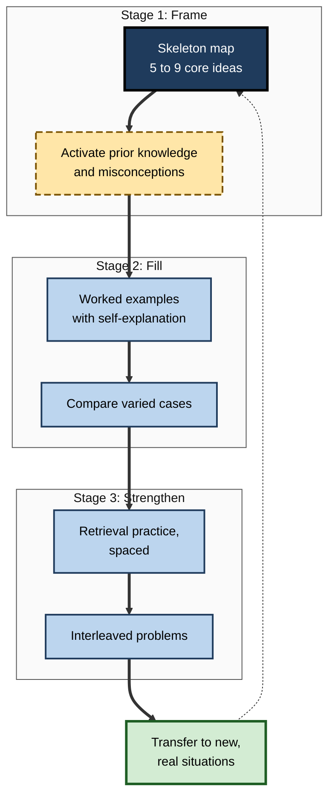
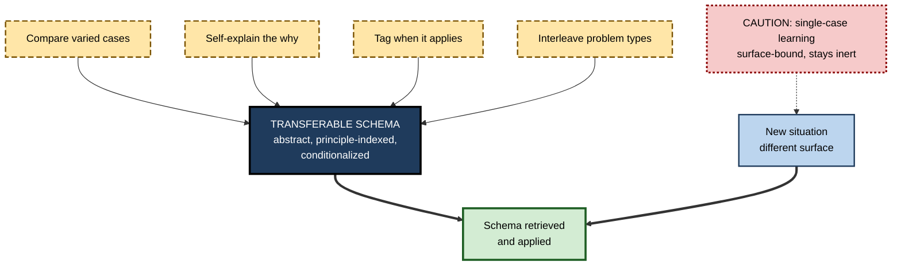

# H.12. Using Schemas to Accelerate Learning

> **In one sentence:** You can learn a new field much faster by deliberately building its core schema first — the few big ideas and how they connect — and then hanging details on it, using examples, comparison, explanation and practice to fill and test that frame.
>
> **Why it matters:** Professionals constantly have to get up to speed: a new role, a new client industry, a new technology, a new regulation. Schema-first learning turns months of confusion into weeks of structured progress, and the same principles let you onboard others faster.
>
> **Level span:** Novice → Expert · **Reading time:** ~18 min · **Builds on:** all earlier notes in this subtopic, especially how schemas are built, prior knowledge and schema activation

---

## The Learning Ladder

| Level | Badge | After this level you can... |
|---|---|---|
| 1 | NOVICE | Explain why learning the big picture first makes details easier to learn. |
| 2 | FOUNDATIONS | Describe the schema-first approach and the techniques that build schemas quickly: skeleton maps, worked examples, comparison, self-explanation, retrieval and interleaving. |
| 3 | PRACTITIONER | Run a 30-day schema-first plan to get up to speed in a new domain. |
| 4 | ADVANCED | Explain the evidence behind each technique, its boundary conditions, and how schemas support transfer. |
| 5 | EXPERT / PRO | Design schema-first onboarding and upskilling for teams, including AI-assisted learning, and measure time to competence. |

---

## Level 1 · Novice — The Big Picture

Imagine two people assembling a 1,000-piece jigsaw puzzle. One starts picking up random pieces and trying to fit them together. The other first looks at the picture on the box, then builds the border, then sorts pieces by color region. The second person finishes much faster — not because she is smarter, but because she has a **frame** that tells her where each piece goes.

Learning a new field works the same way. Most people start with details: terms, tools, procedures, one at a time. Each detail is hard to remember because it has nowhere to go. A faster approach starts with the **picture on the box** — the field's main ideas and how they connect — and builds a rough frame. Then every new detail has a place.

An analogy: a schema is like a **coat rack**. With no rack, coats pile up on the floor in a heap and you cannot find anything. With a good rack, every coat has a hook. Building the rack first takes a little time, but everything after goes faster.

You have already used this when:

- Someone explained "the three things that really matter in this job" on your first day, and everything else made more sense.
- You learned a second programming language much faster than your first, because you already had schemas for variables, loops and functions.
- A good textbook chapter started with a diagram that you kept coming back to.

The beginner's takeaway: **build the big frame first, then fill in the details. The frame makes every detail faster to learn and easier to remember.**

---

## Level 2 · Foundations — Core Concepts

### The schema-first principle

Learning accelerates when the learner has a schema that new information can attach to. Since novices lack one, the fastest route is to **build a minimal, accurate schema early**, then elaborate it. This rests on findings covered throughout this subtopic: schema-congruent information is understood and consolidated faster; prior knowledge predicts later performance; and activated schemas guide attention.

### Seven schema-building techniques

| Technique | What it does for the schema | When it helps most |
|---|---|---|
| **Skeleton map** | Lays out the core concepts and relations as a one-page diagram | At the very start, and revisited throughout |
| **Worked examples, then fading** | Shows the schema in action; frees working memory to notice structure | Novices; problem-solving domains |
| **Comparison of cases** | Separates deep structure from surface features | After a few examples are understood |
| **Self-explanation** | Learner explains *why* each step or idea works, creating relations | While studying examples and texts |
| **Elaborative questioning** | "Why is this true? How does it relate to X?" adds links | With factual and conceptual material |
| **Retrieval practice** | Recalling the schema strengthens and reveals gaps | Throughout, spaced over time |
| **Interleaving** | Mixing problem types forces learners to identify which schema applies | After each type has been learned |

**Figure H.12-1 — The schema-first learning sequence.**

*How to read it:* the thick path runs from building a frame, through filling it, to strengthening it; the dotted arrow shows the skeleton map being revised as real use reveals gaps.

### Key terms

| Term | Plain meaning |
|---|---|
| **Skeleton map** | A one-page diagram of a domain's core concepts and their relations. |
| **Self-explanation** | Explaining to yourself why each step or statement holds. |
| **Elaborative interrogation** | Asking and answering "why" questions about facts. |
| **Retrieval practice** | Recalling information from memory to strengthen it. |
| **Interleaving** | Mixing different problem types in practice. |
| **Transfer** | Applying learning to new situations. |
| **Time to competence** | How long it takes a new person to perform independently to standard. |

---

## Level 3 · Practitioner — Putting It to Work

### The 30-day schema-first plan for a new domain

**Days 1–3: Build the frame.**

1. Find two or three good overviews (an introductory chapter, a senior colleague's whiteboard talk, an AI-generated outline you then verify against a trusted source).
2. Draw a skeleton map: five to nine core concepts, connected by labeled arrows. Keep it to one page.
3. Ask an expert to critique the map: "What is missing? What is wrong? What matters most?"
4. List your prior knowledge that connects ("this is like...") and any likely misconceptions.

**Days 4–14: Fill the frame with examples.**

5. Study worked examples or real cases for each core concept. After each step, write a one-line self-explanation of *why*.
6. Place each new term or fact on your map. If it has nowhere to go, the map needs a new node or link.
7. Compare pairs of cases weekly: what is the shared deep structure?

**Days 15–30: Strengthen and test.**

8. Redraw the skeleton map from memory every few days; compare with the original; repair gaps.
9. Practise on mixed problems or cases, so you must decide which concept applies.
10. Do one real task unaided; note where your schema failed and update the map.

### Worked example — a finance manager moving into a cybersecurity governance role

| | Before (detail-first) | After (schema-first) |
|---|---|---|
| **First week** | Reads a 200-page security standard from page one; drowns in control numbers. | Builds a skeleton map: assets, threats, vulnerabilities, controls, risk, residual risk, assurance. Expert adds "incident response" and "third parties". |
| **Weeks 2–3** | Memorizes acronyms. | Studies five real incidents, mapping each onto the skeleton; self-explains why each control failed. |
| **Bridge from prior knowledge** | None. | "Risk and controls work like financial internal controls, *except* threats are adaptive adversaries." |
| **Week 4** | Can define terms; cannot lead a risk review. | Leads a risk review using the map; asks the questions a CISO would ask. |

### Common mistakes at this level

- **Making the skeleton too detailed.** A 40-node map is not a skeleton. Keep the first version small; detail comes later.
- **Never getting expert critique.** A self-made skeleton can encode misconceptions from the start.
- **Studying examples passively.** Reading examples without self-explanation produces far less schema building.
- **Practising one type at a time forever.** Blocked practice feels fluent but does not train the choice of which schema to use.
- **Letting AI build the map for you.** A generated map you have not wrestled with is a reference, not a schema in your head.

---

## Level 4 · Advanced — Mechanisms, Models & Evidence

### Why frames accelerate learning

Several lines of evidence explain the acceleration:

- **Encoding.** As Bransford and Johnson's 1972 study showed, information is understood far better when an appropriate schema is active during learning.
- **Consolidation.** Animal and human studies show that schema-consistent information is integrated into long-term memory faster; Tse and colleagues' 2007 rodent study found new fitting associations consolidated within about two days.
- **Working memory.** Schemas let many elements be handled as one chunk, which is the core claim of cognitive load theory and the reason experts can learn complex new material in their field faster than novices.

### Evidence behind the techniques

| Technique | Evidence summary | Boundary conditions |
|---|---|---|
| **Worked examples and fading** | One of the best-replicated effects for novices in instructional research. | Reverses for learners with strong schemas (expertise reversal, confirmed by a 2025 meta-analysis). |
| **Self-explanation** | Michelene Chi's work from 1989 onward found that learners who explained examples to themselves learned more; prompting self-explanation helps many learners. | Quality of explanations matters; incorrect explanations need feedback. |
| **Comparison of cases** | Comparing two or more analogous cases yields more abstraction and transfer than studying one. | Novices need guidance on what to compare. |
| **Concept and skeleton maps** | Meta-analyses have found moderate benefits of studying and constructing concept maps compared with reading text or lists. | Benefits depend on active construction and accuracy; large, messy maps help little. |
| **Retrieval practice** | Among the most robust findings in learning science, with benefits for retention and some transfer. | Needs feedback when retrieval fails; covered in depth elsewhere in this map. |
| **Interleaving** | Improves the ability to identify which strategy applies, especially in mathematics and category learning. | Works best after initial learning of each type; feels harder and is often rejected by learners. |
| **Advance organizers and prequestions** | Small-to-moderate benefits for organizers; moderate benefits of prequestions for targeted content. | Prequestion benefits are mostly specific to what is asked. |

### Schemas and transfer

**Transfer** — applying learning to new situations — is notoriously hard. Schemas are a central part of the explanation of when it succeeds. Transfer is more likely when:

1. the learner has an **abstract schema**, not just memories of specific cases (comparison helps build this);
2. the schema is **indexed by deep features**, so new situations retrieve it despite different surfaces;
3. knowledge is **conditionalized** — tagged with when it applies;
4. the learner has practised **recognizing** which schema fits (interleaving helps).

Far transfer to very different domains remains rare even with good instruction; near transfer within a domain is achievable and is where schema-first methods pay off most. Transfer itself is the subject of a separate part of this map.

**Figure H.12-2 — What makes a schema transferable.**

*How to read it:* four practices feed a transferable schema, which can be retrieved when a new situation arrives; the dotted branch shows that schemas learned from a single case usually fail to be retrieved.

### Desirable difficulty and the feeling of slowness

Many schema-building techniques — self-explanation, comparison, retrieval, interleaving — feel slower and harder than reading and re-reading. They are **desirable difficulties**: they reduce performance in the moment while improving durable learning. Schema-first learning can therefore feel *less* productive in the first week. Expect this, and judge progress by unaided performance on new cases.

---

## Level 5 · Expert / Pro — Professional Mastery

### Schema-first onboarding

Organizations that measure **time to competence** often find that onboarding is organized around tools and policies (detail-first) rather than around the role's core schemas. Schema-first onboarding redesigns it:

| Week | Detail-first onboarding | Schema-first onboarding |
|---|---|---|
| 1 | System access, tool tutorials, policy reading | Role skeleton map: the five things that matter, how work flows, how success is judged |
| 2 | Shadowing without structure | Shadowing with a case card: map what you observe onto the skeleton |
| 3–4 | First tasks, ad hoc help | Worked examples of typical tasks, then faded support; weekly case comparison |
| 5–8 | "Up to speed" assumed | Unaided realistic task; skeleton redrawn from memory; gaps closed |

### Designing for teams

- **Shared skeleton maps** create a common schema across functions — useful when consultants, engineers and business owners must collaborate.
- **Case libraries** organized by deep structure accelerate everyone, not just new joiners.
- **Expert time is used for critique**, not lecturing: experts review skeleton maps and case diagnoses, where their schemas add most value.
- **Adapt to prior knowledge**: test-out options for experienced hires, primers for career switchers.

### AI-assisted schema-first learning

Generative AI is a powerful accelerator for schema-first learning when used for the right steps:

| Use AI to... | Avoid using AI to... |
|---|---|
| Draft a first skeleton outline, then verify and rebuild it yourself | Replace the act of building and redrawing the map |
| Generate varied cases and worked examples for comparison | Do the comparison and abstraction for you |
| Ask you self-explanation and prequestions | Supply explanations before you attempt them |
| Critique your map and explanations | Accept its critique without checking against trusted sources |
| Create interleaved practice sets | Solve the practice problems |

Research on AI in learning published in 2024–2026 converges on a design principle: AI that **prompts the learner's thinking** supports learning, while AI that **does the thinking** boosts immediate performance and can reduce later unaided performance.

### Measuring acceleration

- **Time to competence**: days until a defined independent task is performed to standard.
- **Skeleton accuracy**: expert rating of the learner's map drawn from memory at weeks 1, 4 and 8.
- **Novel-case performance**: diagnosis or decision quality on unseen cases.
- **Support load**: number of routine help requests to senior staff.

### Professional scenario

**Role:** Engineering director at a company acquiring a smaller firm with a different technology stack.
**Situation:** Forty engineers must become productive on the acquired platform within a quarter; previous integrations took most of a year.
**What the pro does:** Has the acquired firm's two most senior architects build a one-page skeleton map of the platform (core services, data flow, deployment model, failure modes), verified in a review. Each engineer's first week centres on the map plus three worked walk-throughs of real changes. Weekly sessions compare pairs of past incidents. An AI assistant connected to the codebase is configured to quiz engineers on the map and explain code only after they have proposed an explanation. Engineers redraw the map from memory at weeks 2 and 6. Median time to first independent production change falls substantially compared with the previous integration.

### Limits

- **Schema-first is not lecture-first.** A frame delivered as a long lecture without examples and practice does not stick.
- **The initial schema can be wrong.** Expert critique and real-world testing are essential.
- **Some domains resist simple skeletons.** Highly interconnected or rapidly changing fields need multiple overlapping maps and frequent revision.

---

## Myths vs. Evidence

| Myth | What the evidence shows |
|---|---|
| "Start with the details; the big picture will emerge." | The big picture often emerges very slowly or not at all; an early frame accelerates learning. |
| "Reading more is the fastest way to get up to speed." | Active schema-building techniques outperform passive reading for durable learning. |
| "Interleaving and self-testing slow you down." | They feel slower but produce better retention and better choice of strategies. |
| "Worked examples are spoon-feeding." | For novices, they are among the most efficient ways to build schemas; fade them as expertise grows. |
| "AI can build the schema for you." | AI can supply a map; only your own processing builds the schema in your head. |

## Practitioner Toolkit

**30-day schema-first checklist**

- [ ] Day 1–3: skeleton map of five to nine concepts with labeled links.
- [ ] Expert critique of the map.
- [ ] Prior-knowledge bridges and likely misconceptions listed.
- [ ] Worked examples studied with written self-explanations.
- [ ] Every new term placed on the map.
- [ ] Weekly comparison of two cases.
- [ ] Map redrawn from memory at least three times.
- [ ] Interleaved practice in weeks 3–4.
- [ ] One unaided real task; map updated.

**Template — skeleton map prompts**

| Prompt | Your answer |
|---|---|
| What are the five to nine ideas everything else depends on? | |
| How does each connect to the others (causes, part of, depends on)? | |
| What do experts look at first? | |
| What is this field's most common beginner misconception? | |
| What does this resemble that I already know — and how does it differ? | |

## Self-Check

1. **[NOVICE]** Why does building a big-picture frame first speed up learning?
2. **[NOVICE]** Give an example from your career where an early overview helped you.
3. **[FOUNDATIONS]** List five schema-building techniques and what each contributes.
4. **[FOUNDATIONS]** What is a skeleton map, and why should it be small?
5. **[PRACTITIONER]** Why should you redraw your map from memory?
6. **[ADVANCED]** Name three mechanisms that explain why schemas accelerate learning.
7. **[ADVANCED]** What conditions make a schema transferable?
8. **[EXPERT / PRO]** Redesign the first month of onboarding for a role you know using a schema-first approach.
9. **[EXPERT / PRO]** Which steps of schema-first learning should AI support, and which should it not replace?

### Answer Key

1. New details have a place to attach, so they are understood, chunked and consolidated faster.
2. Answers vary — for example, a manager's "three things that matter" briefing on day one.
3. Skeleton map (frame), worked examples (structure in action), comparison (deep vs. surface), self-explanation (relations), retrieval practice (strength and gap detection), interleaving (choosing the schema).
4. A one-page diagram of the core concepts and relations; it should be small so it can be held in mind and acts as a frame rather than a reference document.
5. Retrieval strengthens the schema and reveals gaps; comparing with the original shows what to repair.
6. Better encoding when a schema is active, faster consolidation of schema-consistent information, reduced working-memory load through chunking.
7. Abstract (from comparison), indexed by deep features, conditionalized, and practised in recognizing which schema applies.
8. Answers vary; should include a skeleton map in week one, worked examples with fading, case comparison, redraw-from-memory checks and an unaided realistic task.
9. Support: drafting outlines to verify, generating cases, prompting self-explanation, critiquing, creating practice sets. Not replace: building and redrawing the map, comparison and abstraction, attempting explanations and solving practice problems.

## Key Takeaways

- **Build the frame first**: a small, accurate skeleton of the domain makes every detail faster to learn.
- **Fill the frame** with worked examples, self-explanation and comparison of varied cases.
- **Strengthen** with spaced retrieval and interleaving; expect it to feel slower.
- Schemas that are **abstract, principle-indexed and conditionalized** transfer best.
- **Schema-first onboarding** cuts time to competence; use experts for critique.
- Let AI **prompt and critique**, not think for you.

## Glossary

| Term | Meaning |
|---|---|
| Concept map | Diagram of concepts connected by labeled relations. |
| Desirable difficulty | Learning condition that feels harder but improves durable learning. |
| Elaborative interrogation | Asking and answering "why" questions about information. |
| Fading | Gradually removing support from worked examples. |
| Interleaving | Mixing different problem types during practice. |
| Retrieval practice | Recalling information from memory to strengthen learning. |
| Self-explanation | Explaining to oneself why steps or statements hold. |
| Skeleton map | One-page diagram of a domain's core concepts and relations. |
| Time to competence | Time for a new person to reach independent, standard performance. |
| Transfer | Applying learning in new situations. |
| Worked example | Fully solved problem studied to learn its structure. |
