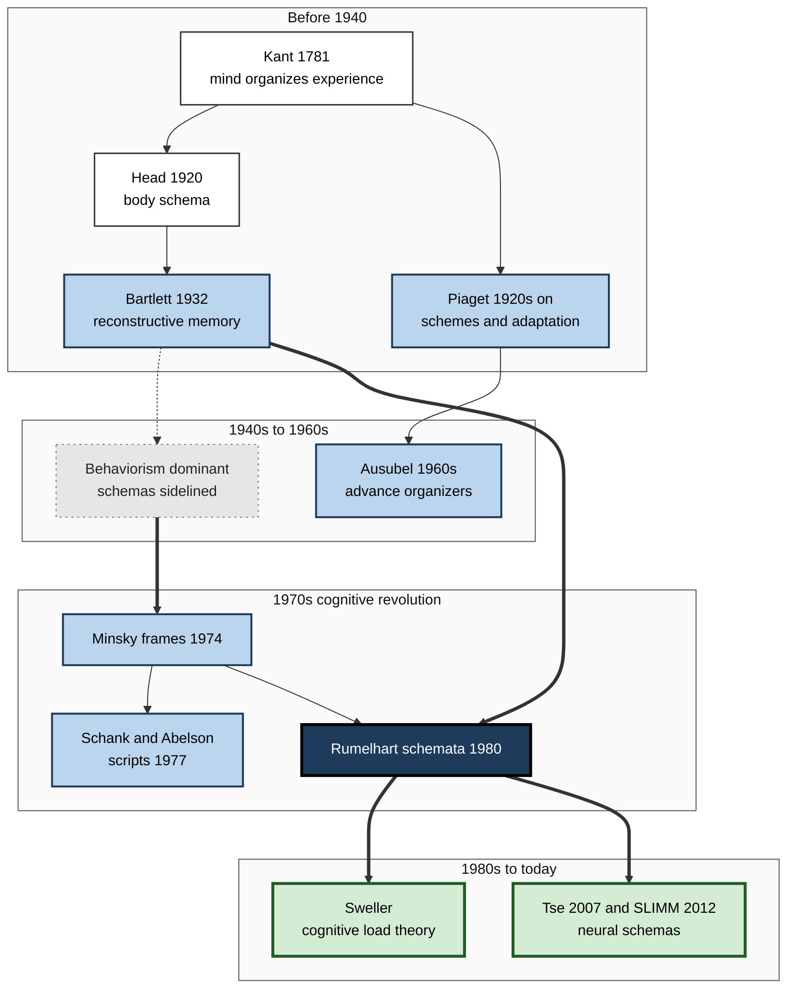
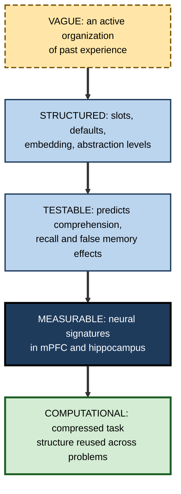

# H.2. Schema Theory Origins

> **In one sentence:** Schema theory grew over two centuries, from a philosopher's idea that the mind needs frameworks to make sense of experience, through psychologists who studied how memory reshapes stories and how children build understanding, to computer scientists and neuroscientists who modeled and measured those frameworks.
>
> **Why it matters:** Knowing where the idea came from tells you what each version of "schema" claims, which claims are well supported and which are historical baggage, so you can use the concept precisely instead of as a buzzword.
>
> **Level span:** Novice → Expert · **Reading time:** ~15 min · **Builds on:** the basic idea of a schema

---

## The Learning Ladder

| Level | Badge | After this level you can... |
|---|---|---|
| 1 | NOVICE | Tell the story of schema theory in a few sentences and name its main contributors. |
| 2 | FOUNDATIONS | Distinguish the philosophical, developmental, memory, computational and educational strands of the theory. |
| 3 | PRACTITIONER | Recognize which strand a modern claim or training product is drawing on and judge its fit. |
| 4 | ADVANCED | Explain the criticisms each strand faced, what replicated and what did not, and how the theory was revived. |
| 5 | EXPERT / PRO | Use the history to argue precisely in design and research discussions, and spot when "schema" is being overextended. |

---

## Level 1 · Novice — The Big Picture

Long before brain scans, people noticed something odd about the mind: we never see the world "raw". We see a chair, not a pattern of brown shapes; we hear a sentence, not a stream of sounds. Something inside us organizes experience as it comes in.

Schema theory is the long effort to describe that "something". The story has five chapters:

1. **A philosopher** (Immanuel Kant, 1780s) argued that the mind must bring frameworks to experience, otherwise sensations would be meaningless.
2. **A memory researcher** (Frederic Bartlett, 1932) showed that people remember stories by fitting them into what they already know — and change them in the process.
3. **A developmental psychologist** (Jean Piaget, from the 1920s onward) described how children build and rebuild mental structures as they grow.
4. **Computer scientists and cognitive psychologists** (1970s) tried to program these structures into machines, turning a vague idea into precise models with slots and default values.
5. **Educators and neuroscientists** (1960s to today) turned the theory into teaching methods and found brain systems that build and use schemas.

An analogy: schema theory is like the history of maps. Early maps were rough sketches based on intuition; later, surveyors made them precise; today satellites measure them. The idea that "the territory has a shape" stayed constant, while the tools for describing it improved.

You have already used this history if you have ever been told "activate prior knowledge" in a training course. That advice comes straight from this chain of ideas.

---

## Level 2 · Foundations — Core Concepts

### The five strands

| Strand | Key figures and dates | Core claim | Lasting contribution |
|---|---|---|---|
| **Philosophical** | Immanuel Kant, 1781 | The mind applies general rules ("schemata") to link abstract concepts with concrete sensations. | Knowledge is actively organized, not passively received. |
| **Neurological** | Henry Head and Gordon Holmes, 1911; Head, 1920 | The brain keeps a "postural schema" — an updating model of the body's position. | Schemas as continuously updated models, not fixed images. |
| **Memory** | Frederic Bartlett, 1932 | Remembering is reconstruction, guided by an organized mass of past experience. | Memory is reconstructive; schemas shape recall. |
| **Developmental** | Jean Piaget, 1920s–1970s | Children build schemes and adapt them by assimilation and accommodation. | Learners construct knowledge; prior structures shape what is learned next. |
| **Computational and cognitive** | Marvin Minsky (frames, 1974); Roger Schank and Robert Abelson (scripts, 1977); David Rumelhart (schemata, 1975–1980) | Knowledge can be represented as structures with slots, defaults and embedded sub-structures. | Precise, testable definitions of schema parts. |
| **Educational** | David Ausubel, 1960s; Richard Anderson and colleagues, 1970s–80s; John Sweller, 1980s onward | Learning depends on connecting new material to existing structures. | Advance organizers, schema-based reading research, cognitive load theory. |
| **Neuroscientific** | Dorothy Tse, Richard Morris and colleagues, 2007; Marlieke van Kesteren and colleagues, 2012; Asaf Gilboa and colleagues | Schemas are supported by medial prefrontal cortex–hippocampus interactions and speed consolidation. | Biological evidence that schemas change how memory is stored. |

**Figure H.2-1 — The main lines of descent in schema theory.**

*How to read it:* boxes are grouped by era; thick arrows mark the most direct lines of influence; the dotted arrow shows Bartlett's ideas being sidelined during the behaviorist period.

### Key terms

| Term | Plain meaning |
|---|---|
| **Schema (Kant)** | A rule that lets an abstract concept apply to concrete experience. |
| **Reconstructive memory** | Remembering by rebuilding an event from fragments plus general knowledge, rather than replaying a copy. |
| **Scheme (Piaget)** | An organized pattern of action or thought that a child applies to the world. |
| **Frame (Minsky)** | A data structure for a stereotyped situation, with slots and default values. |
| **Script (Schank and Abelson)** | A frame for a familiar sequence of events. |
| **Advance organizer (Ausubel)** | Introductory material that provides a framework for new learning. |
| **Cognitive revolution** | The 1950s–70s shift from behaviorism to studying internal mental processes. |

---

## Level 3 · Practitioner — Putting It to Work

### Why history is practical

The word "schema" is used today in learning products, leadership courses, therapy, data engineering and AI. Each use descends from a different strand, and each carries different promises. Practitioners who know the lineage can ask sharper questions.

### The Lineage Check — four steps

1. **Find the claim.** What exactly is being said about schemas? ("Our course activates learners' schemas.")
2. **Match it to a strand.** Is this the memory strand (comprehension and recall), the developmental strand (constructing understanding), the computational strand (structures with slots), the educational strand (organizers, load) or the neural strand (consolidation)?
3. **Recall that strand's evidence.** Each strand has its own evidence base and its own limits (see Level 4).
4. **Ask for the matching test.** A memory claim should show better delayed recall; an educational claim should show better learning on a fair comparison; a neural claim in a sales pitch is usually decoration.

### Worked example — evaluating a vendor's "schema-based" microlearning platform

| | Before (taken at face value) | After (lineage check) |
|---|---|---|
| **Claim** | "Uses brain-based schema activation for 3x retention." | Educational and memory strands. |
| **What the evidence supports** | Assumed true. | Activating relevant prior knowledge helps comprehension; prequestions help for the material they target. "3x" has no basis in those literatures. |
| **Neural language** | Impressive. | Neural schema research is real but describes consolidation in labs; it does not certify a product. |
| **Decision** | Buy. | Pilot with a delayed, unaided test against the existing course. |

Note: Schema theory is not a different meaning of the word "schema" used in databases (a table design) or psychotherapy (deep beliefs about self in schema therapy). Those uses share an ancestor but are separate technical vocabularies.

### Common mistakes at this level

- **Treating Piaget's stages as schema theory.** Piaget's age-based stages are one part of his work and have been heavily revised; his schemes and adaptation processes are the part schema theory kept.
- **Quoting Bartlett as proof that all memory is invented.** His findings show reconstruction, not that memories are fiction.
- **Assuming "brain-based" means "proven to work in training".** Neural findings explain mechanisms; learning methods need learning evidence.

---

## Level 4 · Advanced — Mechanisms, Models & Evidence

### Kant and the body schema

Kant's "schemata" were rules mediating between pure concepts and sensory intuition — a philosophical answer to how categories apply to experience. The neurologists Henry Head and Gordon Holmes borrowed the word in the early twentieth century for the brain's constantly updated model of body posture: each new movement is measured against the existing schema and changes it. That idea — an active, updating standard against which input is compared — is what Bartlett took into memory research.

### Bartlett: memory as reconstruction

In *Remembering* (1932), Bartlett had English participants read and later reproduce an unfamiliar Native American folk tale. He reported that reproductions became shorter, more conventional and more coherent from the participants' cultural point of view; unfamiliar elements were dropped or rationalized. He defined a schema as an active organization of past reactions and experiences.

Replication status matters. Later studies following his "repeated reproduction" procedure found less distortion than Bartlett described, especially when participants were told to be accurate. A 1999 study by Bergman and Roediger did observe increasing distortion and rationalization over longer delays. The current reading: reconstruction is real and well supported by other paradigms, but Bartlett's specific, dramatic pattern depended on his informal methods.

### Piaget: constructing knowledge

Piaget described children as active builders of knowledge through **schemes** — organized patterns of action and thought — adapted by **assimilation** (fitting new experience into existing schemes) and **accommodation** (changing schemes to fit experience), balanced by **equilibration**. A 2022 systematic review of two decades of research found the assimilation–accommodation pair still widely used across psychology and education, while noting persistent vagueness in how the processes are defined and measured. Piaget's stage timings were shown to underestimate young children when tasks were made more natural, as in McGarrigle and Donaldson's 1970s conservation studies.

### The quiet years and the revival

From the 1930s to the 1950s, American psychology was dominated by **behaviorism**, which avoided internal mental structures as unscientific. Bartlett's schemas were largely set aside. The **cognitive revolution** of the 1950s–60s, driven partly by computing, made internal representations respectable again.

In the 1970s, three overlapping proposals gave schemas precise form:

- **Frames** (Minsky, 1974): structures for stereotyped situations, with terminals (slots) filled by defaults that can be replaced.
- **Scripts** (Schank and Abelson, 1977): frames for event sequences, used to let computers understand stories.
- **Schemata** (Rumelhart and colleagues, 1975–1980): building blocks of cognition with variables, embedding, multiple levels of abstraction, and active recognition processes.

These converged on a shared model, and psychologists tested its predictions in reading, memory and problem-solving research.

**Figure H.2-2 — How the definition of "schema" sharpened over time.**

*How to read it:* each step down makes the concept more precise; later stages do not replace earlier ones but give them firmer evidence.

### Criticisms that shaped the theory

| Criticism (mostly 1980s) | Response |
|---|---|
| "Schema" explains everything, so it predicts nothing. | Researchers specified conditions: schema-congruent items are better recalled, *unless* they are highly surprising; false memories appear for typical items. |
| How are schemas learned in the first place? | Rumelhart and Norman's accretion, tuning and restructuring; later, connectionist models showing schema-like patterns emerging from statistical learning. |
| Slots and defaults look too rigid. | Distributed-network models treat schemas as flexible, graded patterns. |
| No biological evidence. | Animal and human neuroscience from 2007 onward identified neural correlates and consolidation effects. |

### The modern picture

Today the theory lives in three active research fronts. In **educational psychology**, schema construction and automation are the explicit goals of cognitive load theory. In **memory neuroscience**, the SLIMM framework (Schema-Linked Interactions between Medial prefrontal and Medial temporal regions) predicts that schema-congruent information is integrated via the medial prefrontal cortex while novel information relies more on the hippocampus. In **computational neuroscience**, a 2025 perspective links schemas to reinforcement learning, describing them as compressed representations of task structure that let animals and people generalize quickly. Machine-learning research borrows the term again, studying whether large models learn schema-like event knowledge.

---

## Level 5 · Expert / Pro — Professional Mastery

### Using history to argue precisely

Senior learning designers, researchers and consultants use the lineage to keep discussions honest:

| Situation | Imprecise claim | Precise version |
|---|---|---|
| Course design review | "We need to activate schemas." | "Learners need a framework *during* reading; give the overview before the detail, as in Bransford and Johnson's study." |
| Diversity training debate | "Schemas cause bias." | "Social schemas supply defaults; structured criteria limit default-driven judgment." |
| AI product pitch | "Our model has human-like schemas." | "It shows schema-like event predictions on benchmark X; that is not evidence it reasons like people." |
| Research proposal | "Schema-based instruction improves outcomes." | "Which schema? Measured how? Compared with what?" |

### Professional scenario

**Role:** Learning-science lead at a large consulting firm.
**Situation:** A new leadership curriculum cites "schema theory" on every slide; senior partners are sceptical and ask whether it is pop psychology.
**What the pro does:** Rewrites the rationale in three short paragraphs, each tied to one strand: Bartlett and modern false-memory research (why debriefs must capture notes immediately), Ausubel and organizer research (why each module starts with a one-page framework), and cognitive load theory (why novices get worked cases before open problems). Drops the neural claims from the pitch, keeping them only in a background note. The partners accept the curriculum because every claim now has a matching, modest test.

### Expert-level judgement

- **Name the strand.** "Schema" means different things in Kant, Piaget, Rumelhart and neuroscience; say which one you mean.
- **Separate durable ideas from period details.** Reconstruction, constructed knowledge and slot-and-default structures endure; Bartlett's exact distortion pattern and Piaget's stage ages do not.
- **Respect the revival's lesson.** The concept became useful only when it made specific, falsifiable predictions. Hold modern uses to the same standard.

---

## Myths vs. Evidence

| Myth | What the evidence shows |
|---|---|
| "Piaget invented schema theory." | Piaget was one major contributor; Kant, Head, Bartlett and the 1970s cognitive scientists are equally foundational. |
| "Bartlett proved memory is unreliable fiction." | He showed reconstruction; replications show his specific distortion pattern is smaller under controlled conditions. |
| "Schema theory is an old, abandoned idea." | It is active in cognitive load theory, reading research and memory neuroscience, with major reviews published in 2024 and 2025. |
| "Database schemas and psychological schemas are the same concept." | They share the idea of structure but are separate technical terms. |
| "Neuroscience has proven schema-based teaching works." | Neuroscience explains mechanisms; teaching effects must be shown with learning studies. |

## Practitioner Toolkit

**Lineage check for any "schema" claim**

- [ ] I wrote the exact claim down.
- [ ] I identified which strand it draws on.
- [ ] I recalled that strand's main evidence and limits.
- [ ] I asked what test would confirm the claim.
- [ ] I removed neural language that does not change the decision.

**Ready-to-use explanation (60 seconds):** "Schema theory says we understand new things by fitting them into organized knowledge we already have. It started with Kant, was shown in memory by Bartlett, in development by Piaget, was made precise by 1970s cognitive science, and now has neural evidence. Practically: give people a framework first, build it with varied examples, and check it with new cases."

## Self-Check

1. **[NOVICE]** Name three people who contributed to schema theory and one idea each.
2. **[NOVICE]** Why did schema theory go quiet for a few decades?
3. **[FOUNDATIONS]** How does a script differ from a frame?
4. **[FOUNDATIONS]** What did Head and Holmes mean by a postural schema?
5. **[PRACTITIONER]** A vendor says their product is "schema-based". What three questions would you ask?
6. **[ADVANCED]** What is the replication status of Bartlett's "War of the Ghosts" findings?
7. **[ADVANCED]** What was the main criticism of schema theory in the 1980s, and how was it answered?
8. **[EXPERT / PRO]** How does the SLIMM framework extend the classic theory?
9. **[EXPERT / PRO]** Rewrite "our training activates schemas" as a precise, testable claim.

### Answer Key

1. Examples: Kant (the mind organizes experience), Bartlett (memory is reconstructive), Piaget (children build and adapt schemes), Minsky (frames), Rumelhart (schemata with slots and defaults), Ausubel (advance organizers).
2. Behaviorism dominated psychology and rejected unobservable mental structures until the cognitive revolution.
3. A frame is a structure for any stereotyped situation; a script is a frame specialised for a sequence of events in time.
4. A continuously updated model of the body's position against which each new movement is compared.
5. Which strand and evidence base? What outcome improves, measured how and after what delay? Compared with what alternative?
6. Mixed: strict replications found less distortion; studies with longer delays and natural conditions found rationalization increasing over time. Reconstruction itself is well supported.
7. That "schema" was too vague to predict anything; researchers specified conditions (congruency, typicality, surprise) and built learning models.
8. It specifies brain mechanisms: medial prefrontal cortex supports integrating schema-congruent information, hippocampus supports novel information, and it predicts when each dominates.
9. For example: "Giving a one-page framework before each module will improve delayed, unaided performance on novel cases compared with the same module without the framework."

## Key Takeaways

- Schema theory has **several strands**: philosophical, neurological, memory, developmental, computational, educational and neural.
- **Bartlett** established reconstructive memory; **Piaget** established constructed knowledge; the **1970s** gave schemas slots, defaults and testable predictions.
- The idea was **sidelined under behaviorism** and **revived by the cognitive revolution**.
- Some classic details are **contested or revised** (Bartlett's distortion pattern, Piaget's stage ages); the core ideas endure.
- Modern schema research is active in **cognitive load theory, reading science and memory neuroscience**.
- Use the history to make **precise, testable claims** and to challenge vague "brain-based" marketing.

## Glossary

| Term | Meaning |
|---|---|
| Accommodation | Changing an existing scheme to fit new experience. |
| Advance organizer | Introductory framework presented before new material. |
| Assimilation | Fitting new experience into an existing scheme. |
| Behaviorism | Approach to psychology that studied only observable behavior. |
| Cognitive revolution | Mid-twentieth-century return to studying internal mental processes. |
| Equilibration | Piaget's balancing process between assimilation and accommodation. |
| Frame | Minsky's slot-and-default structure for a stereotyped situation. |
| Reconstructive memory | Rebuilding past events from fragments plus general knowledge. |
| Scheme | Piaget's term for an organized pattern of action or thought. |
| Script | A schema for an ordered sequence of events. |
| SLIMM | A neural framework for how schemas and novelty shape memory via mPFC and hippocampus. |
