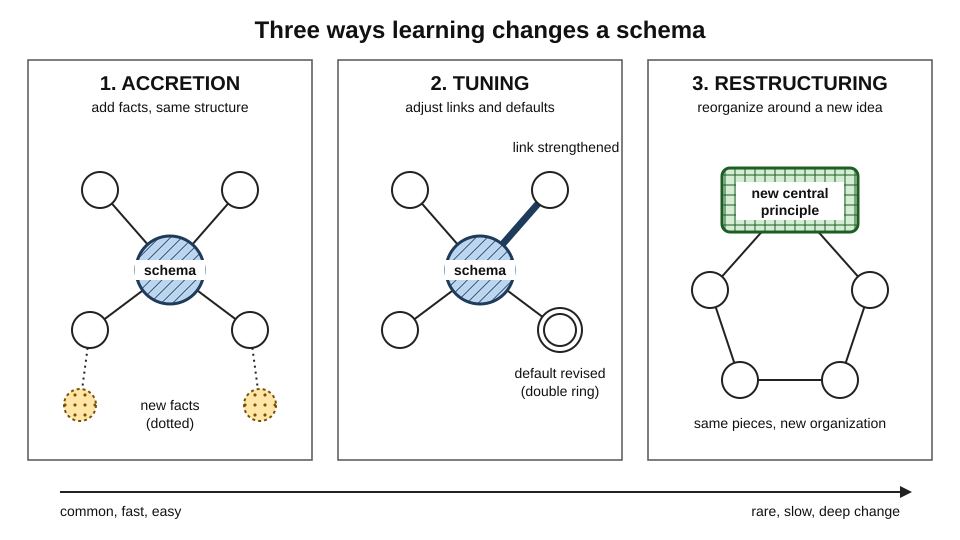
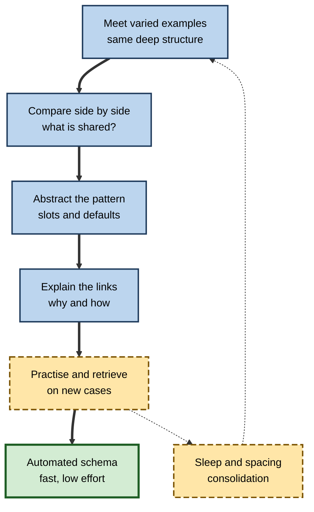
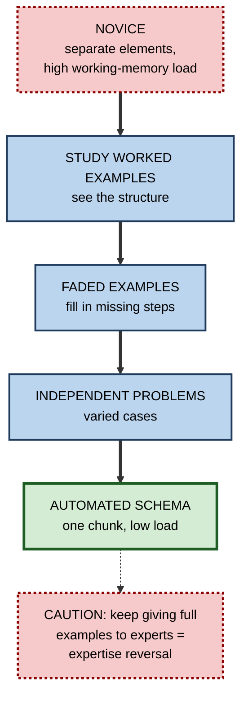

# H.3. How Schemas Are Built

> **In one sentence:** Schemas are built by meeting many varied examples of the same kind of thing, comparing them to pull out what they share, linking the shared parts into a structure, and practising until that structure works automatically.
>
> **Why it matters:** If you know how schemas are built, you can build them deliberately — in yourself, in new hires, in clients — instead of waiting years for experience to do it by accident.
>
> **Level span:** Novice → Expert · **Reading time:** ~17 min · **Builds on:** what a schema is (slots, defaults, relations)

---

## The Learning Ladder

| Level | Badge | After this level you can... |
|---|---|---|
| 1 | NOVICE | Explain in plain words how repeated, varied experience turns into a mental pattern. |
| 2 | FOUNDATIONS | Name and describe accretion, tuning and restructuring, and the role of comparison and abstraction. |
| 3 | PRACTITIONER | Use a step-by-step routine — varied cases, comparison, explanation, practice — to build a schema on purpose. |
| 4 | ADVANCED | Explain the evidence on analogical comparison, worked examples, sleep, consolidation and automation, and their limits. |
| 5 | EXPERT / PRO | Design programmes and AI-assisted practice that build schemas at scale and measure whether they formed. |

---

## Level 1 · Novice — The Big Picture

Nobody is born with a schema for "a good spreadsheet model" or "a difficult client conversation". We build them, slowly, out of experience.

Think about how a child learns what a dog is. She sees a small white dog, a big brown dog, a dog on television, a picture of a cartoon dog. No single dog teaches her the idea. What teaches her is **the pattern across many dogs**: four legs, fur, a tail that wags, barking. Over time she also learns what is *not* essential (size, color) and what separates dogs from cats. That pattern is her dog schema.

Adults build professional schemas the same way. After your first customer complaint you remember that one complaint. After your twentieth, you have a pattern: the customer usually wants to be heard first, the real issue is often not the stated one, offering a fix too early backfires. Nobody gave you this pattern; you **extracted** it from many cases.

An analogy: building a schema is like making a **composite sketch** from many photographs of faces from one family. Each photo is different, but if you lay them over each other, the shared family features become clear and the accidental details fade.

You have already experienced schema-building when:

- Your third trip through an airport felt easier than your first, even in a different country.
- After reviewing several contracts, you started knowing where to look for the risky clauses.
- After a few projects, you could predict where delays would come from before the plan was finished.

The beginner's takeaway: **schemas are built from many varied examples, by noticing what they have in common and how the parts connect.**

---

## Level 2 · Foundations — Core Concepts

### Three modes of schema learning

In 1978, David Rumelhart and Donald Norman proposed that learning changes knowledge structures in three different ways. The model is still widely used to describe how schemas grow.

| Mode | What happens | Everyday example | Work example |
|---|---|---|---|
| **Accretion** | New facts are added to an existing schema's slots; the structure does not change. | Learning a new restaurant's menu. | Learning another API endpoint in a system you already understand. |
| **Tuning** | The schema itself is adjusted: defaults change, slots become more precise, the range of allowed values shifts. | Realizing that in some countries you pay at the counter, not the table. | Learning that in this company "urgent" tickets are often not urgent. |
| **Restructuring** | A new schema is created, often by reorganizing old knowledge around a new principle. | Understanding that whales are mammals, not fish. | Moving from "code is a list of instructions" to "code is a set of interacting components with contracts". |

Restructuring is the rarest, the slowest and the most powerful. It is where deep understanding and genuine expertise jumps happen.

*Figure H.3-1 — Accretion, tuning and restructuring.* Left: accretion adds new filled slots (dotted circles) without changing the structure. Middle: tuning changes existing parts (thicker links, a revised default). Right: restructuring reorganizes the same knowledge around a new central principle. Schematic, not plotted data.

### The core ingredients

1. **Multiple examples** — a schema is abstracted from many episodes; one example cannot show which features are essential.
2. **Variation** — examples must differ in surface details (setting, numbers, names) while sharing the deep structure, so the learner can tell which is which.
3. **Comparison** — actively looking at two or more examples side by side to find what they share.
4. **Explanation** — linking the parts with reasons ("this causes that"), which creates the relations inside the schema.
5. **Practice and retrieval** — using the schema repeatedly so it becomes reliable and fast.
6. **Time and sleep** — consolidation integrates new learning with existing knowledge between sessions.

**Figure H.3-2 — The schema-building cycle.**

*How to read it:* the thick path is one pass of schema building; the dotted loop shows that spaced sessions with sleep in between let the cycle repeat on a stronger base.

### Key terms

| Term | Plain meaning |
|---|---|
| **Abstraction** | Pulling out the general pattern from specific cases. |
| **Accretion** | Adding information to an existing schema without changing its structure. |
| **Tuning** | Adjusting an existing schema's defaults, slots or ranges. |
| **Restructuring** | Building a new schema by reorganizing knowledge around a new principle. |
| **Analogical comparison** | Comparing two cases to find their shared relational structure. |
| **Surface features** | Details that vary across cases but do not matter (names, numbers, setting). |
| **Deep (structural) features** | The underlying principles and relations that define the type. |
| **Schema automation** | Practising until a schema can be applied with little conscious effort. |

---

## Level 3 · Practitioner — Putting It to Work

### The Compare–Explain–Apply routine

1. **Collect three to five cases** of the same type that look different on the surface. (For "negotiating scope with a client": a design agency case, a software contract, an internal project.)
2. **Put two side by side** and write: "What do these have in common, ignoring the industry details?" Do this before reading any expert summary.
3. **Name the slots** that emerged ("the client's real constraint", "what we can trade", "the walk-away point").
4. **Explain the relations** in sentences: "Because the deadline is fixed, scope becomes the variable."
5. **Read the expert version** — a textbook model, a senior colleague's framework — and compare it with your own. The gaps are your learning agenda.
6. **Apply to a new case** without notes, a day or more later. Fill the slots; predict the outcome.
7. **Look for a case that breaks it.** Tune the schema where it fails.

### Worked example — a junior data analyst learning "A/B test analysis"

| | Before (one example at a time) | After (Compare–Explain–Apply) |
|---|---|---|
| **Learning material** | Follows one tutorial on a button-color test. | Studies three tests: a pricing page, an email subject line, an onboarding flow. |
| **What she extracts** | "You compare conversion rates and check the p-value." | Slots: unit of randomization, primary metric, guardrail metric, sample size, novelty effect, segment differences. |
| **Relations** | None. | Small sample *inflates* chance of false wins; novelty effects *fade*, so test duration matters. |
| **Transfer test** | Applies button-test steps to a retention test; misses that the metric needs a longer window. | Notices immediately that a retention metric changes the duration slot. |

### Common mistakes at this level

- **Using only one example.** The learner treats the example's accidents as rules.
- **Using examples that are too similar.** If every case is in retail, "retail" gets baked into the schema.
- **Reading the summary first.** Being handed the abstraction skips the comparison that makes it stick; try to extract it first, then check.
- **Never testing on a new case.** A schema that has only met its training examples has not been checked.
- **Expecting restructuring to be quick.** Deep reorganization often takes weeks or months of varied practice.

---

## Level 4 · Advanced — Mechanisms, Models & Evidence

### Comparison drives abstraction

A long line of research on analogy, associated with Dedre Gentner, Mary Gick and Keith Holyoak, shows that people rarely extract a general principle from a single example, even when it is explained well. In Gick and Holyoak's classic 1980s studies, people who read one story with a solution principle seldom applied it to an analogous problem; people who read and **compared two** analogous stories were much more likely to form an abstract schema and transfer it. Later work found that comparison works best when the cases are **aligned** (placed side by side with a prompt to find correspondences) and when surface features differ but relational structure matches. Comparing cases is one of the most reliable ways to shift attention from surface to deep features.

### Worked examples and schema acquisition

**Cognitive load theory**, developed by John Sweller from the 1980s, argues that the main goal of instruction is schema construction and automation in long-term memory. Novices solving problems by trial and error spend their limited working memory on searching, leaving little for noticing the pattern. **Worked examples** — fully worked solutions to study — free working memory to notice the structure. This **worked-example effect** is one of the best replicated findings in instructional research for novices. Importantly, the effect fades and can reverse as learners gain expertise (the **expertise reversal effect**; a 2025 meta-analysis confirmed this interaction between prior knowledge and instructional guidance). A schema-building sequence therefore moves from studying examples, through partially completed examples ("fading"), to independent problem solving.

### Consolidation and sleep

New schemas do not form in a single session. Memory research shows that the hippocampus rapidly binds new episodes, and that over hours to days, through replay during rest and sleep, shared structure is extracted and integrated into cortical networks. A study published in the mid-2020s reported that the emergence of a new schema — not just memory for individual items — depended on sleep after learning. Rodent work by Tse and colleagues (2007) showed the other side: once a schema exists, new, fitting information is consolidated much faster. The details belong to memory-consolidation science; the practical implication is that **schema building benefits from spaced sessions with sleep in between**.

### Statistical learning and implicit schema formation

Not all schema building is deliberate. People pick up regularities — which events co-occur, what usually follows what — through **statistical learning**, often without awareness. A new employee "absorbs" the rhythm of a team long before being able to describe it. Connectionist models from the 1980s onward showed that schema-like patterns, including default values, can emerge in neural networks simply from exposure to many examples. Implicit schemas are efficient but harder to inspect and correct, which is why explicit comparison and explanation remain valuable.

### Automation

Once built, a schema can be practised until it runs with little conscious effort. **Automation** frees working memory for the novel parts of a task. An experienced driver attends to traffic, not to gear changes; a senior engineer reads a stack trace and goes straight to the likely cause. Automation requires extensive, spaced practice and is domain-specific.

**Figure H.3-3 — From novice to automated schema: what changes.**

*How to read it:* guidance is highest at the top and is withdrawn step by step; the dotted branch warns that support helpful for novices becomes a burden once the schema exists.

### Boundary conditions and open questions

- **Variation must be calibrated.** Too little and the schema is narrow; too much at the start and novices cannot find any pattern. A common recommendation is to begin with closely related cases, then widen.
- **Comparison needs guidance for novices.** Without prompts, learners often compare the wrong (surface) features.
- **Restructuring is poorly understood.** Accretion and tuning are easy to produce in studies; reliable methods for triggering deep restructuring remain an active research topic (see the notes on conceptual change).
- **Individual differences.** People with more relevant prior knowledge typically build new schemas faster in that domain, but a 2022 meta-analysis showed the link between prior knowledge and *gains* is highly variable.

---

## Level 5 · Expert / Pro — Professional Mastery

### Designing schema-building programmes

| Design lever | Novice-heavy audience | Mixed or experienced audience |
|---|---|---|
| Cases | Several worked cases, close in structure | Fewer, more varied, messier cases |
| Comparison | Guided: side-by-side tables with prompts | Open: "what is the common pattern across these incidents?" |
| Guidance | High at first, faded step by step | Low; problems first, support on request |
| Practice | Spaced over weeks, mixed case types | Spaced, interleaved, on real work |
| Check | Novel case: fill slots, predict outcome | Novel case with an unusual twist |

Strong organizations also **harvest** schemas: they interview experienced staff, collect real cases (incidents, deals, designs), and turn them into case libraries organized by deep structure rather than by date or client.

### AI-era practice

Generative AI makes it trivially easy to produce dozens of varied examples on demand — a genuine help for schema building, since varied examples are expensive to write by hand. The risk lies elsewhere. If the AI also performs the comparison and abstraction ("summarize what these have in common"), the learner skips the step that does the building. Research reviews published in 2025–2026 on cognitive offloading and "metacognitive laziness" report that unmanaged AI help raises task performance while reducing the learner's own processing. A productive pattern:

1. Ask the AI for varied cases of the same type.
2. Do the comparison and draft the schema yourself.
3. Ask the AI to critique your schema and propose a case that would break it.
4. Retest yourself, unaided, days later.

### Professional scenario

**Role:** Engineering manager at a fintech company.
**Situation:** Junior engineers handle production incidents slowly; each incident is treated as brand new.
**What the pro does:** Builds a case library of twenty past incidents, tagged by deep pattern (resource exhaustion, bad deploy, dependency failure, data corruption). In weekly 30-minute sessions, pairs of juniors compare two incidents from the same pattern but different services and write the shared slots. After four weeks they study incidents from *different* patterns that look similar on the surface. Game-day drills test them on unseen incidents. Within a quarter, juniors classify incidents faster in drills and escalate fewer routine cases.

### Metrics that show a schema is forming

- **Classification by deep structure**: can people sort new cases by underlying pattern, not surface features?
- **Gap detection**: do they notice what is missing from a case?
- **Prediction**: can they forecast what happens next?
- **Speed with accuracy** on routine cases (a sign of automation).

---

## Myths vs. Evidence

| Myth | What the evidence shows |
|---|---|
| "One great example is enough to teach a principle." | Single examples rarely transfer; comparing two or more is far more effective. |
| "Experience automatically builds expertise." | Experience builds schemas only when cases are varied, compared and reflected on; years alone are a weak predictor. |
| "Problem solving is always better than studying examples." | For novices, worked examples usually build schemas faster; problem solving wins once the schema exists. |
| "Just give people the framework and they will have the schema." | Frameworks help, but the schema forms through applying them to varied cases. |
| "An AI summary of the pattern saves learning time." | It saves task time; letting AI do the abstraction removes the processing that builds the learner's schema. |

## Practitioner Toolkit

**Schema-building checklist**

- [ ] I have at least three cases that differ on the surface but share the deep structure.
- [ ] I compared at least two side by side before reading the expert summary.
- [ ] I wrote the slots and explained the relations in my own words.
- [ ] I practised on a new case after at least one night's sleep.
- [ ] I looked for a case that breaks my schema and tuned it.
- [ ] I reduced support as my accuracy improved.

**Template — comparison table**

| Feature | Case 1 | Case 2 | Case 3 | Shared (deep) or surface? |
|---|---|---|---|---|
| | | | | |

## Self-Check

1. **[NOVICE]** Why can't one example teach a schema?
2. **[NOVICE]** Give an example of a schema you built from experience at work.
3. **[FOUNDATIONS]** Define accretion, tuning and restructuring with an example of each.
4. **[FOUNDATIONS]** What is the difference between surface and deep features?
5. **[PRACTITIONER]** Why should you try to compare cases before reading an expert summary?
6. **[ADVANCED]** What did Gick and Holyoak's comparison studies show?
7. **[ADVANCED]** Why do worked examples help novices but not experts?
8. **[EXPERT / PRO]** Design a four-week routine to build a schema for "handling difficult stakeholder emails".
9. **[EXPERT / PRO]** How can AI help schema building without replacing it?

### Answer Key

1. One example cannot show which features are essential and which are accidental; the pattern only appears across varied cases.
2. Answers vary — for example, a pattern for running effective retrospectives built over many sprints.
3. Accretion: adding new facts to an existing schema (a new API endpoint). Tuning: adjusting defaults or ranges (learning "urgent" means something else here). Restructuring: reorganizing around a new principle (seeing code as components with contracts).
4. Surface features vary without mattering (names, numbers, industry); deep features are the principles and relations that define the type.
5. The act of comparing and abstracting is what builds the schema; reading the summary first skips that processing.
6. People rarely transferred a principle from one analogous story but did so much more often after comparing two, which led them to form an abstract schema.
7. Novices lack the schema, so examples spare working memory for noticing structure; experts already have the schema, so examples add redundant information (expertise reversal).
8. Answers vary: week 1 collect and compare varied emails; week 2 write slots and relations; week 3 draft responses to new emails with feedback; week 4 unaided responses to surprising cases, then tune.
9. Let AI generate varied cases and critique your schema; do the comparison and abstraction yourself and test yourself unaided.

## Key Takeaways

- Schemas are built from **many varied examples**, through **comparison, abstraction and explanation**.
- Learning changes schemas by **accretion** (adding), **tuning** (adjusting) and **restructuring** (reorganizing).
- **Comparing two or more cases** is far more powerful than studying one.
- **Worked examples** build schemas fastest for novices; guidance should **fade** as expertise grows.
- **Spacing and sleep** help integrate new schemas; existing schemas speed up later learning.
- **Automation** through practice frees working memory for novel challenges.
- Use AI to **generate cases and critique**, not to do the abstraction for you.

## Glossary

| Term | Meaning |
|---|---|
| Abstraction | Extracting a general pattern from specific cases. |
| Accretion | Adding information to a schema without changing its structure. |
| Analogical comparison | Aligning two cases to find shared relational structure. |
| Automation | Practising a schema until it runs with little conscious effort. |
| Consolidation | Stabilization and integration of new memories over time, especially during sleep. |
| Deep features | The underlying principles that define a type of problem or situation. |
| Expertise reversal effect | Guidance that helps novices becomes ineffective or harmful for experts. |
| Fading | Gradually removing steps from worked examples so learners complete more themselves. |
| Restructuring | Creating a new schema by reorganizing knowledge around a new principle. |
| Statistical learning | Implicit pick-up of regularities from repeated exposure. |
| Surface features | Case details that vary without changing the underlying type. |
| Tuning | Refining a schema's defaults, slots or ranges. |
| Worked example | A fully solved problem studied to learn the solution structure. |
