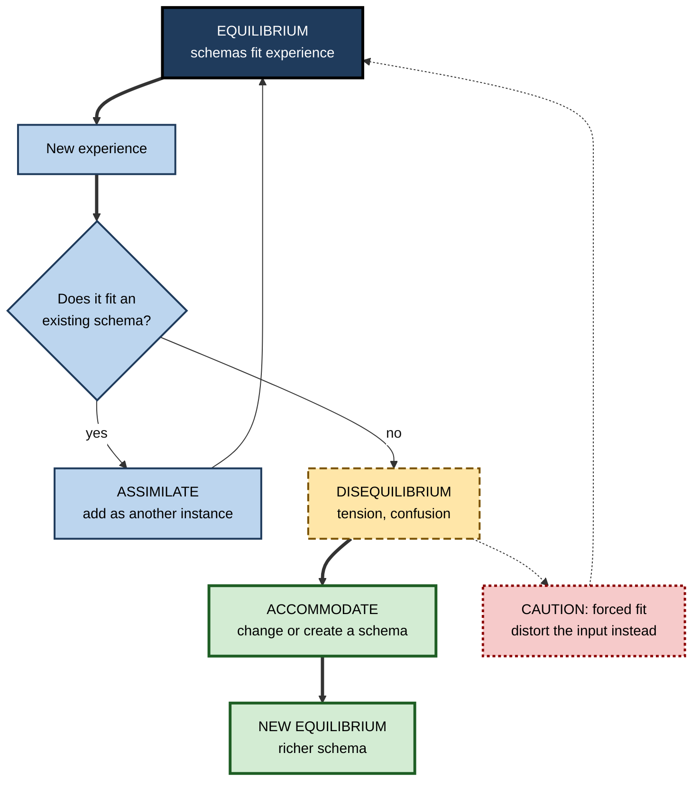
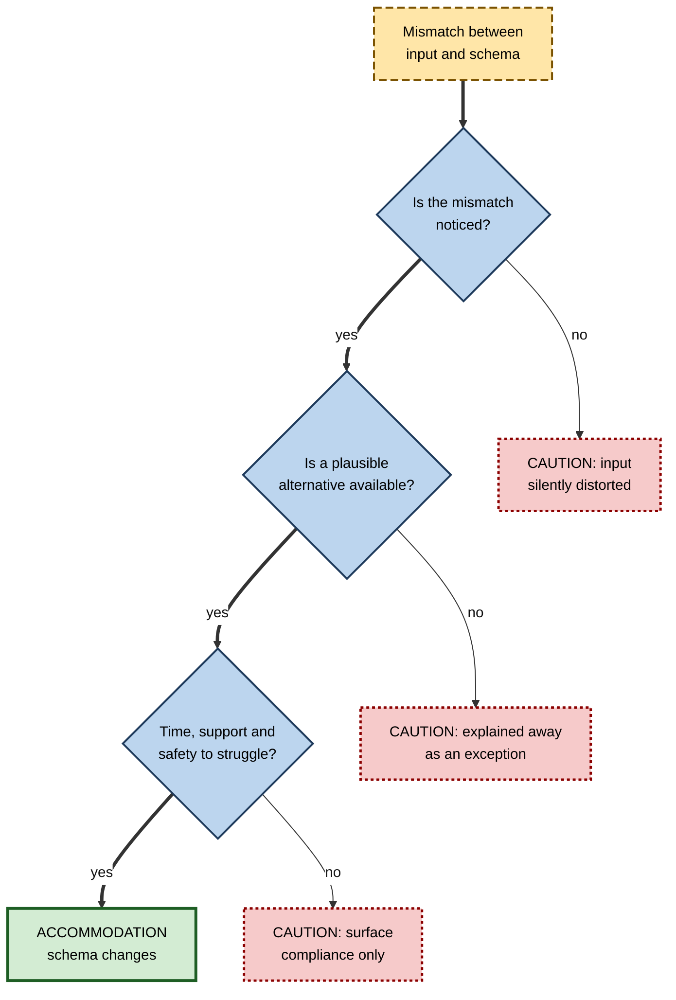

# H.4. Assimilation vs. Accommodation

> **In one sentence:** Assimilation is fitting new information into a schema you already have; accommodation is changing the schema because the new information does not fit.
>
> **Why it matters:** Most everyday learning is assimilation, which is fast but can quietly bend new facts to fit old beliefs. Real breakthroughs — and real reskilling — need accommodation, which is slower and uncomfortable. Knowing which one is happening tells you when to push through confusion and when to stop forcing a fit.
>
> **Level span:** Novice → Expert · **Reading time:** ~16 min · **Builds on:** what a schema is; how schemas are built

---

## The Learning Ladder

| Level | Badge | After this level you can... |
|---|---|---|
| 1 | NOVICE | Explain assimilation and accommodation with everyday examples. |
| 2 | FOUNDATIONS | Describe equilibrium, disequilibrium and equilibration, and relate them to accretion, tuning and restructuring. |
| 3 | PRACTITIONER | Notice when you are forcing new information into an old schema and switch deliberately to accommodation. |
| 4 | ADVANCED | Evaluate Piaget's model against modern evidence, including its criticisms and the cognitive mechanisms behind each process. |
| 5 | EXPERT / PRO | Design change programmes, reskilling and AI adoption so that people accommodate rather than distort new ideas. |

---

## Level 1 · Novice — The Big Picture

A toddler who knows the word "dog" sees a cow for the first time and shouts "dog!" She has a schema — four legs, furry, an animal — and the cow fits it well enough. This is **assimilation**: treating the new thing as one more example of something you already know.

Then a parent says, "No, that's a cow. It's much bigger, it says moo, and it lives on a farm." Now the child has to change her mental picture: there are different kinds of four-legged animals, and size and sound matter. This is **accommodation**: changing your schema because the new thing does not fit.

An analogy: imagine your knowledge as a **set of drawers**. Assimilation is putting a new item into an existing drawer. Accommodation is realizing the item does not belong in any drawer, so you add a new drawer, relabel an old one, or reorganize the whole cabinet.

You have already done both:

- When you started using a new email app and found it worked like your old one, you **assimilated** it — same schema, new details.
- When you moved from spreadsheets to a database and discovered that data lives in related tables, not one big grid, you had to **accommodate** — your "spreadsheet" schema could not hold the new idea.
- When a new manager behaved differently than your previous ones and your usual approach stopped working, you had to rebuild your expectations — accommodation, often with some frustration.

The beginner's takeaway: **assimilation keeps your schema and adds to it; accommodation changes the schema itself.** Both are normal and both are needed.

---

## Level 2 · Foundations — Core Concepts

### Piaget's adaptation model

Swiss psychologist Jean Piaget described intellectual growth as **adaptation**, made up of two complementary processes, kept in balance by a third:

| Process | Definition | What changes | Feels like |
|---|---|---|---|
| **Assimilation** | Interpreting new experience in terms of existing schemas. | The interpretation of the input. | Easy, familiar, "this is like..." |
| **Accommodation** | Modifying existing schemas, or creating new ones, to fit new experience. | The schema itself. | Effortful, confusing, "this doesn't make sense yet..." |
| **Equilibration** | The drive to restore balance between existing schemas and experience. | The overall system. | Relief when it "clicks". |

**Disequilibrium** is the state of tension when experience does not fit your schemas. Piaget saw it as the engine of development: it pushes the learner to accommodate.

**Figure H.4-1 — The equilibration cycle.**

*How to read it:* when input fits, assimilation returns you to the same balance; when it does not, disequilibrium leads either to accommodation (thick path, a richer schema) or to a forced fit that distorts the input (dotted path back to the old balance).

### Connecting to accretion, tuning and restructuring

Piaget's terms map roughly onto the three learning modes described by Rumelhart and Norman:

| Piaget | Rumelhart and Norman | Example |
|---|---|---|
| Assimilation | Accretion | Adding another customer to your "enterprise client" schema. |
| Minor accommodation | Tuning | Realizing enterprise clients in this region buy through partners. |
| Major accommodation | Restructuring | Realizing "client" should be split into user, buyer and budget holder. |

### Key terms

| Term | Plain meaning |
|---|---|
| **Adaptation** | Adjusting to the environment through assimilation and accommodation. |
| **Assimilation** | Fitting new experience into an existing schema. |
| **Accommodation** | Changing a schema, or making a new one, to fit new experience. |
| **Equilibrium** | A state in which schemas account for experience. |
| **Disequilibrium** | The tension of experience that schemas cannot account for. |
| **Equilibration** | The process that moves from disequilibrium to a new equilibrium. |
| **Over-assimilation** | Forcing new information into an old schema so that it is distorted. |

---

## Level 3 · Practitioner — Putting It to Work

### The Fit Test — a routine for learning something new

1. **Name the schema you are using.** When you meet a new idea, ask: "What does this remind me of?" Write it down ("This new framework is like Scrum").
2. **List the matches.** Where does the new idea fit your schema?
3. **List the mismatches — deliberately.** Where does it not fit? Look for at least three. Novices skip this step, because assimilation feels like understanding.
4. **Check the mismatches are real.** Ask an expert or the source: are these differences essential?
5. **Decide: assimilate or accommodate.** If mismatches are minor, add the new idea as a variant (tuning). If they are central, build a new schema or reorganize the old one.
6. **Write the new boundary.** "It is like Scrum *except*... and that changes..."

### Worked example — a project manager moving into product management

| | Before (over-assimilation) | After (deliberate accommodation) |
|---|---|---|
| **Schema used** | "Product management is project management with a roadmap." | Starts there, then lists mismatches. |
| **What gets distorted** | Treats the roadmap as a delivery plan with fixed dates; measures success by on-time delivery. | Notices success is measured by outcomes (adoption, retention), not delivery. |
| **Mismatches found** | None noticed. | Scope is uncertain by design; discovery is part of the job; saying no is core. |
| **New schema** | — | Two linked schemas: *delivery* (what she knew) and *discovery* (new), with a rule for when each applies. |
| **Result** | Ships features on time that nobody uses. | Runs experiments before committing to build. |

### Common mistakes at this level

- **Mistaking assimilation for understanding.** "This is just like X" feels like insight but often hides the differences that matter.
- **Avoiding disequilibrium.** Confusion feels bad, so people retreat to familiar explanations. Productive confusion is a signal to accommodate.
- **Throwing everything away.** Accommodation rarely means discarding old knowledge; it usually means adding boundaries ("true when...") and new branches.
- **Never naming the old schema.** You cannot change a schema you have not made explicit.

---

## Level 4 · Advanced — Mechanisms, Models & Evidence

### What holds up and what does not

Piaget's adaptation processes remain among the most cited ideas in psychology and education. A 2022 systematic review in a European psychology journal examined two decades of research using assimilation and accommodation, finding the concepts still productive across fields — from child development to personality and coping — but noting that definitions vary widely and measurement is often indirect. Schema theory as a whole faces the same critique: schemas lack clear units and boundaries, which makes it hard to measure how much a schema has changed.

Parts of Piaget's broader theory have been substantially revised:

- **Stage ages are too conservative.** When tasks are made more natural and meaningful, children show abilities earlier than Piaget reported; McGarrigle and Donaldson's 1970s conservation studies are the classic example.
- **Development is more domain-specific** than a universal stage model suggests; a person can be advanced in one domain and naive in another.
- **Social and cultural input matters more** than Piaget emphasized, as Vygotsky's tradition argued.

What remains well supported is the core: learners interpret new input through existing structures, and significant learning sometimes requires changing those structures rather than adding to them.

### Cognitive mechanisms behind each process

| Process | Likely mechanisms (modern terms) |
|---|---|
| Assimilation | Schema activation, pattern completion, gap-filling with default values, rapid integration of schema-congruent information (supported by the medial prefrontal cortex in neural models). |
| Accommodation | Prediction-error detection, attention to surprising information, hippocampus-dependent encoding of novel associations, gradual reorganization during consolidation. |

Modern **predictive processing** accounts describe the brain as constantly predicting input. Small prediction errors are absorbed (assimilation, or tuning); large, persistent prediction errors drive model updating (accommodation). The SLIMM framework from memory neuroscience makes a similar distinction: schema-congruent information is integrated via the medial prefrontal cortex, while highly novel information relies on the hippocampus, with intermediate information remembered least well.

### Why people over-assimilate

Several well-documented tendencies push people toward assimilation even when accommodation is needed:

- **Confirmation bias** — preferring information that fits existing beliefs.
- **Belief perseverance** — keeping beliefs after the evidence for them has been discredited.
- **Fluency** — familiar framings feel more true and more understood.
- **Cost** — accommodation demands working-memory effort and tolerating uncertainty.

Research on misconceptions shows that learners often reinterpret contradicting evidence to protect an existing schema — for example, explaining away a surprising experimental result as a measurement error. Simply presenting conflicting information is therefore not enough; it must be noticed, understood, and accompanied by a plausible alternative.

**Figure H.4-2 — What decides between assimilation, accommodation and distortion.**

*How to read it:* accommodation requires all three conditions; failing any one leads to a different kind of non-learning.

### Open debates

- **Is accommodation one process or many?** Small tunings and large reorganizations may rely on different mechanisms; conceptual change research suggests large changes are gradual and partial.
- **Does disequilibrium always help?** Confusion can promote learning when it is resolvable and supported; unresolved confusion tends to produce frustration and disengagement.
- **Do old schemas disappear?** Evidence from adults suggests earlier intuitive schemas are often suppressed rather than erased; they can resurface under time pressure.

---

## Level 5 · Expert / Pro — Professional Mastery

### Organizational change as mass accommodation

Most organizational change asks people to accommodate: a new operating model, a new tool, a new strategy. The default human response is assimilation — interpreting the change through existing schemas ("Agile is just shorter project phases", "the AI tool is just a better search engine"). Change programmes stall not because people resist, but because they **sincerely believe they have already adopted the change** while operating under the old schema.

Professionals counter this by:

| Move | Purpose |
|---|---|
| Name the old schema explicitly | "Here is how we used to think about X." People cannot change what stays implicit. |
| Highlight the critical differences | Contrast tables: old way, new way, why the difference matters. |
| Create safe disequilibrium | Pilots, simulations and cases where the old schema visibly fails, without career risk. |
| Supply the new schema | A clear, concrete model with worked examples, not just a vision statement. |
| Allow time | Accommodation is gradual; expect a period of lower performance. |
| Check for distortion | Ask people to explain the new approach in their own words; listen for old-schema language. |

### AI adoption: a live example

Teams adopting generative AI often assimilate it into an existing schema — "search engine", "autocomplete" or "junior employee". Each schema brings defaults that cause specific errors: the search schema assumes outputs are retrieved facts (they may be fabricated); the junior-employee schema assumes the tool learns from feedback within a team (it typically does not, unless configured). Effective AI enablement programmes deliberately surface these schemas and help staff accommodate a more accurate model: a probabilistic generator that must be verified, prompted with context, and checked against sources.

### Professional scenario

**Role:** Transformation lead in a regional bank.
**Situation:** Eighteen months after an "agile transformation", teams use stand-ups and sprints but still plan annual fixed-scope projects. Surveys show staff believe they are fully agile.
**What the pro does:** Diagnoses over-assimilation: the agile vocabulary was absorbed into the existing project schema. Runs workshops where teams map their actual decision flow and compare it side by side with an outcome-driven model, finding the three critical differences (who decides scope, when funding is committed, what counts as success). Pilots outcome-based funding with two teams, with leadership explicitly protecting them from delivery-date penalties. Measures change by how teams describe their work and how scope decisions are made, not by ceremony adoption.

### Ethical and practical limits

- **Not every mismatch merits accommodation.** Sometimes the new input is wrong. Experts weigh evidence before restructuring.
- **Disequilibrium has a cost.** Repeated, unsupported disruption damages motivation and trust; pace change to people's capacity.
- **Respect existing expertise.** Framing change as "your old schema was stupid" triggers defense. Framing it as "your schema was right for X; this situation needs an extension" invites accommodation.

---

## Myths vs. Evidence

| Myth | What the evidence shows |
|---|---|
| "Learning is mostly accommodation." | Most everyday learning is assimilation or tuning; major accommodation is rarer and slower. |
| "Confusion means teaching has failed." | Resolvable confusion can signal productive disequilibrium; unresolved confusion is the problem. |
| "Showing people contradictory evidence changes their minds." | Contradictions are often explained away unless a plausible alternative and support are provided. |
| "Piaget's theory has been disproven." | His stage ages and universality were revised; the adaptation processes remain widely used and useful. |
| "Once a schema changes, the old one is gone." | Old intuitive schemas often persist and can resurface under pressure. |
| "If people use the new words, they have changed their thinking." | New vocabulary is easily assimilated into old schemas without real change. |

## Practitioner Toolkit

**Fit Test checklist**

- [ ] I named the schema I am using to understand this new thing.
- [ ] I listed where it fits.
- [ ] I listed at least three places where it does not fit.
- [ ] I checked whether those differences are essential.
- [ ] I decided: tune the old schema or build a new one.
- [ ] I wrote the boundary sentence: "It is like X except..."

**Template — Old schema / new schema contrast**

| Dimension | Old schema says | New reality says | Why it matters |
|---|---|---|---|
| | | | |

**Phrase to use in teams:** "What are we assuming this is like — and where is that comparison misleading us?"

## Self-Check

1. **[NOVICE]** Define assimilation and accommodation with one example each.
2. **[NOVICE]** Why did the toddler call the cow a dog?
3. **[FOUNDATIONS]** What is disequilibrium and why did Piaget think it mattered?
4. **[FOUNDATIONS]** How do assimilation and accommodation map onto accretion, tuning and restructuring?
5. **[PRACTITIONER]** Why must you deliberately list mismatches when learning something new?
6. **[ADVANCED]** Which parts of Piaget's theory have been revised, and which remain useful?
7. **[ADVANCED]** Name three reasons people over-assimilate.
8. **[EXPERT / PRO]** A team says it has "fully adopted" a new way of working but outcomes have not changed. How would you diagnose over-assimilation?
9. **[EXPERT / PRO]** What schema do many staff use for generative AI, and what errors does it cause?

### Answer Key

1. Assimilation: fitting new information into an existing schema (a new email app treated like the old one). Accommodation: changing the schema (learning that databases use related tables, not one grid).
2. Her "dog" schema (four legs, furry animal) was broad enough to absorb the cow — assimilation.
3. The tension when experience does not fit schemas; it motivates accommodation and drives development.
4. Assimilation is like accretion; minor accommodation is tuning; major accommodation is restructuring.
5. Assimilation feels like understanding and hides differences; mismatches are what reveal the need to accommodate.
6. Revised: stage ages, universality, neglect of social context. Useful: learners interpret through existing structures; significant learning sometimes needs structural change.
7. Confirmation bias, belief perseverance, fluency of familiar framings, effort cost of accommodation.
8. Ask people to describe their work and decisions in their own words; look for old-schema language and decision patterns; compare the actual decision flow with the intended model.
9. Search engine, autocomplete or junior employee; errors include treating fabricated output as retrieved fact and assuming the tool learns from team feedback.

## Key Takeaways

- **Assimilation** fits new input into existing schemas; **accommodation** changes the schemas.
- **Disequilibrium** — the tension of misfit — is the trigger for accommodation, but it can also lead to distortion.
- Most learning is assimilation; **deep learning and real change need accommodation**.
- Accommodation needs the mismatch to be **noticed**, a **plausible alternative**, and **time and safety**.
- Piaget's **stages were revised**, but his adaptation processes remain useful.
- In organizations, change often fails through **sincere over-assimilation**: new words, old schema.

## Glossary

| Term | Meaning |
|---|---|
| Accommodation | Changing or creating schemas to fit new experience. |
| Adaptation | Piaget's term for adjusting to the environment through assimilation and accommodation. |
| Assimilation | Fitting new experience into existing schemas. |
| Belief perseverance | Holding on to a belief after its supporting evidence is discredited. |
| Confirmation bias | Favouring information that confirms existing beliefs. |
| Disequilibrium | Tension arising when experience does not fit schemas. |
| Equilibration | The process of restoring balance between schemas and experience. |
| Over-assimilation | Distorting new information to force it into an old schema. |
| Prediction error | The gap between what the brain expects and what it receives. |
| Predictive processing | A view of the brain as continuously predicting input and updating on errors. |
