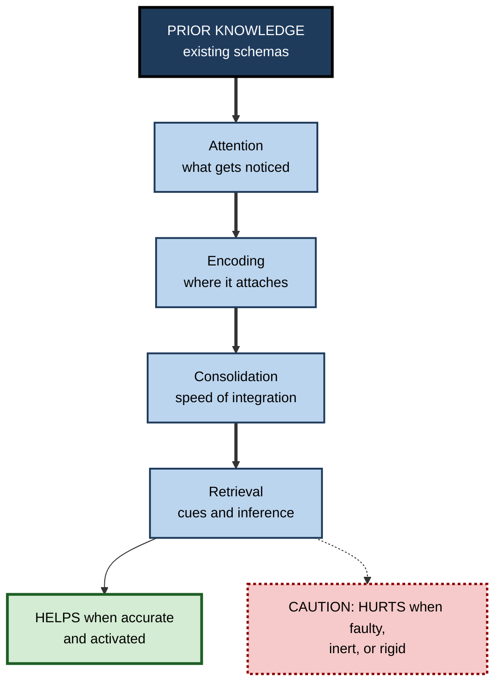
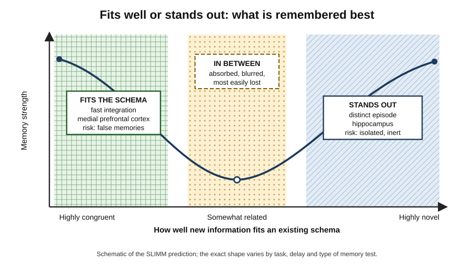
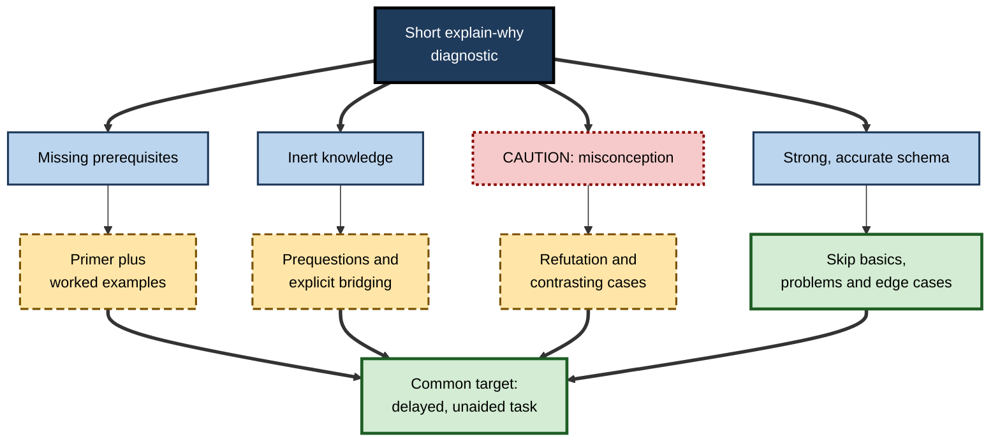

# H.5. Schemas and Prior Knowledge

> **In one sentence:** What you already know — organized as schemas — decides what you notice, how easily you understand new material and how well you remember it, sometimes helping a great deal and sometimes getting in the way.
>
> **Why it matters:** Prior knowledge is the single best predictor of how well someone will perform after a course, and the most common reason the same training works brilliantly for one person and fails for another. Professionals who diagnose prior knowledge first design far better learning.
>
> **Level span:** Novice → Expert · **Reading time:** ~17 min · **Builds on:** what a schema is; assimilation and accommodation

---

## The Learning Ladder

| Level | Badge | After this level you can... |
|---|---|---|
| 1 | NOVICE | Explain why people who know more about a topic learn new things about it more easily. |
| 2 | FOUNDATIONS | Distinguish helpful, missing, inert and faulty prior knowledge, and explain the "rich get richer" pattern. |
| 3 | PRACTITIONER | Diagnose your own or a learner's prior knowledge before learning and adjust the approach. |
| 4 | ADVANCED | Interpret the evidence, including the 2022 meta-analysis that complicated the "prior knowledge always helps" story, and explain the mechanisms. |
| 5 | EXPERT / PRO | Build prior-knowledge diagnostics and adaptive pathways into training, onboarding and AI tutoring. |

---

## Level 1 · Novice — The Big Picture

Two people attend the same one-hour talk on a new tax rule. One is an accountant; the other is a graphic designer. An hour later the accountant can explain the rule, its exceptions and how it affects her clients. The designer remembers that "something changed about deductions". Same talk, same hour, very different learning.

The difference is **prior knowledge**: what each person knew before the talk began. The accountant had a well-organized schema for taxes, with slots ready for the new details. Each new fact had a place to go. The designer had to hold every new term in mind with nothing to attach it to, and most of it fell away.

An analogy: prior knowledge is like **Velcro**. New information sticks to what is already there. The more hooks you have, the more sticks. A smooth surface — no prior knowledge — lets most of it slide off.

But Velcro can grab the wrong thing. If your prior knowledge is wrong, new information sticks to the wrong place. If you are a long-time user of one software tool, you may struggle more with a different tool than a beginner would, because your old habits keep interfering.

You have already experienced both sides when:

- A second language from the same family as one you already speak felt much easier to learn than the first.
- You read a news story about your own field and instantly understood the implications, while friends found it confusing.
- You kept pressing the wrong keyboard shortcut after switching operating systems — old knowledge interfering with new.

The beginner's takeaway: **what you already know is the foundation for what you learn next — usually a big help, sometimes a trap.**

---

## Level 2 · Foundations — Core Concepts

### "The most important single factor"

The educational psychologist David Ausubel wrote in 1968 that if he had to reduce all of educational psychology to one principle, it would be this: the most important single factor influencing learning is what the learner already knows — ascertain this and teach accordingly. Decades of research have broadly supported the first half, with an important twist explained at Level 4.

### Four kinds of prior knowledge

| Kind | What it is | Effect on new learning | Work example |
|---|---|---|---|
| **Relevant and accurate** | Correct schemas in the same domain | Strongly helps: faster understanding, better memory | An experienced nurse learning a new protocol |
| **Missing** | No schema for the domain | Slow, effortful, easily overloaded | A marketer reading a machine-learning paper |
| **Inert** | Knowledge you have but do not activate | No help unless it is cued | Statistics from university, unused when reading a dashboard |
| **Faulty** | Misconceptions or outdated schemas | Interferes: distorts new information | Believing "correlation in our data proves the feature works" |

### How helpful prior knowledge helps

1. **It provides slots.** New facts have somewhere to go.
2. **It chunks information.** Many details are handled as one unit, freeing working memory.
3. **It guides attention.** You notice what matters and ignore noise.
4. **It supports inference.** You fill gaps and predict consequences.
5. **It speeds consolidation.** Schema-consistent information is integrated into long-term memory faster.

**Figure H.5-1 — How prior knowledge shapes each stage of learning.**

*How to read it:* prior knowledge acts at every stage along the thick path; whether the overall effect is positive depends on whether that knowledge is accurate, activated and flexible.

### Key terms

| Term | Plain meaning |
|---|---|
| **Prior knowledge** | Everything a learner knows before a learning episode, including misconceptions. |
| **Domain-specific knowledge** | Knowledge about one field, as opposed to general ability. |
| **Inert knowledge** | Knowledge that exists in memory but is not used when relevant. |
| **Proactive interference** | Old learning disrupting the learning or recall of new material. |
| **Matthew effect** | "The rich get richer": people who know more learn more, widening gaps. |
| **Einstellung effect** | A familiar solution blocking the search for a better one. |
| **Schema congruency** | How well new information fits existing schemas. |

---

## Level 3 · Practitioner — Putting It to Work

### The Prior-Knowledge Diagnostic — before any significant learning

1. **Write the target.** What should the learner be able to do afterwards?
2. **List prerequisites.** What must already be known for the target to make sense? Ask an expert to check the list; experts routinely underestimate prerequisites (the **curse of knowledge**).
3. **Probe quickly.** Use three to five questions that require explanation, not recognition: "Explain why...", "What would happen if..." Recognition quizzes overestimate knowledge.
4. **Look for misconceptions, not just gaps.** Include one question where a common wrong idea would produce a predictable wrong answer.
5. **Sort the learner (or yourself) into a path.**
   - *Missing prerequisites:* fill them first with short, focused material.
   - *Inert knowledge:* activate it with a prompt or prequestion.
   - *Faulty knowledge:* address it explicitly before new material.
   - *Strong knowledge:* skip the basics; go to problems and edge cases.
6. **Re-probe after learning** to see whether the misconception changed.

### Worked example — onboarding analysts to a forecasting tool

| | Before (one-size course) | After (diagnose first) |
|---|---|---|
| **Design** | Same four-hour course for all twelve analysts. | Ten-minute diagnostic with five explain-why questions. |
| **What the diagnostic found** | — | Four analysts lacked basic time-series concepts; three believed "more variables always improves a forecast"; five were strong. |
| **Paths** | — | Group A: 45-minute primer first. Group B: misconception session with cases where extra variables hurt. Group C: skip to advanced features. |
| **Outcome** | Strong analysts bored; weak ones lost; misconception survives. | Each group finishes faster; the misconception drops on the re-probe. |

### Common mistakes at this level

- **Using self-ratings as the diagnostic.** People's confidence in their knowledge is a weak guide, especially in areas where they hold misconceptions.
- **Testing recognition instead of understanding.** Multiple-choice "Which is the definition of X?" misses inert and faulty knowledge.
- **Ignoring strong learners.** Making experts sit through basics wastes time and can reduce their learning (expertise reversal).
- **Assuming related experience transfers automatically.** Knowledge from a neighbouring domain often stays inert unless the connection is made explicit.

---

## Level 4 · Advanced — Mechanisms, Models & Evidence

### The prior-knowledge paradox

For decades, narrative reviews concluded that prior knowledge is among the strongest determinants of learning. A large 2022 meta-analysis by Bianca Simonsmeier, Maja Flaig and colleagues, pooling thousands of effect sizes, found two things at once:

- Prior knowledge **strongly predicted post-test knowledge** — people who knew more before usually knew more after.
- But prior knowledge was, on average, **almost unrelated to knowledge gains** once gains were normalized for how much room there was to improve. The average correlation was close to zero, and the spread across studies was very wide, from strongly negative to strongly positive.

In other words, knowing more puts you ahead, but it does not reliably make you *gain* more from a given lesson. Whether it helps, hurts or does nothing depends on conditions. A 2025 review by Wolfgang Schneider and Simonsmeier catalogued sixteen distinct mechanisms through which prior knowledge can affect learning — some positive (better encoding, more efficient chunking, better self-regulation), some negative (interference, overconfidence, reduced attention to "known" material, misconceptions), and some neutral — as a framework for explaining this variability.

This is the evidence-based nuance behind Ausubel's principle: the learner's prior knowledge matters enormously, *and* its effect must be diagnosed, not assumed.

### Schema congruency and memory: a U-shaped pattern

Memory neuroscience adds a second nuance. The SLIMM framework, proposed by Marlieke van Kesteren and colleagues in 2012, predicts that memory is best for information that is either **highly congruent** with a schema (integrated rapidly via the medial prefrontal cortex) or **highly novel and surprising** (encoded strongly via the hippocampus), and worst for information in between — related enough to be absorbed by the schema but not distinct enough to stand out.

*Figure H.5-2 — Memory as a function of schema congruency.* The solid curve shows the predicted U-shape: strong memory at both ends, weakest in the middle. Labels mark the brain systems thought to dominate at each end. Schematic based on the SLIMM framework; experimental results support both ends, and the exact shape varies by task and test.

Experimental results generally support the congruency advantage for item memory and show distinct benefits for surprising information in some tasks, while schema-congruent material also produces more **false memories** for typical-but-absent items. A practical reading: connect new material to what learners know, *and* make the genuinely new parts stand out as new.

### When prior knowledge gets in the way

| Mechanism | What happens | Classic or recent evidence |
|---|---|---|
| **Misconceptions** | Faulty schemas distort new information to fit. | Decades of science-education research on intuitive physics and biology. |
| **Proactive interference** | Old associations compete with new ones. | Switching tools, languages or procedures. |
| **Einstellung effect** | A familiar method blocks a better one. | Luchins' water-jar problems (1940s); studies with chess players showing experts can miss a shorter solution when a familiar one is visible. |
| **Expertise reversal** | Instruction designed for novices becomes redundant or harmful for experts. | Confirmed by a 2025 meta-analysis. |
| **Overconfidence** | "I know this" reduces attention to new details. | Learners skim familiar-seeming material and miss changes. |
| **Curse of knowledge** | Experts cannot imagine not knowing, so they skip steps when teaching. | Well documented in communication and teaching research. |

### The Matthew effect

Because prior knowledge typically raises post-test performance, small early differences can compound: those who know more understand more of the next lesson, which builds more knowledge for the following one. This "rich get richer" pattern is clearest in reading, where background knowledge feeds comprehension and comprehension feeds knowledge. Workplace learning shows the same pattern: experienced staff get more out of advanced training, widening skill gaps unless novices receive deliberate catch-up support.

---

## Level 5 · Expert / Pro — Professional Mastery

### Designing for different prior knowledge

**Figure H.5-3 — Routing learners by prior knowledge.**

*How to read it:* every path ends at the same performance target; what differs is the route, chosen by the diagnostic.

Practical design patterns used in mature L&D teams:

- **Pre-assessment with "test-out"**: experienced staff skip modules by demonstrating competence on a realistic task.
- **Bridging statements**: explicitly name the prior knowledge to use ("This works like the approval process you already know, except...").
- **Misconception-first modules** in domains with known faulty schemas (statistics, security, finance).
- **Adaptive platforms and AI tutors** that adjust explanation depth based on learner responses. These work best when the diagnostic asks for explanations; an AI that judges only from click patterns or self-ratings may misroute learners.

### AI-era implications

Generative AI tutors can adapt to prior knowledge at a scale no human trainer can. They also amplify the Matthew effect in a new way: people with strong schemas can evaluate AI output and use it to go further, while those without schemas cannot tell good output from bad and may simply accept it. Research on AI-assisted knowledge work published in 2026 has described this pattern as "confidence without competence"; it is an emerging literature, so treat specific effect sizes with caution. Organizations that care about equity therefore invest *more* in foundational schemas for novices in the AI era, not less.

### Professional scenario

**Role:** Learning-experience designer at a global pharmaceutical company.
**Situation:** A mandatory data-privacy course has the same pass rate across departments, yet audit findings cluster in two teams.
**What the pro does:** Replaces the recognition-based final quiz with a scenario diagnostic administered *before* the course. It reveals that the two teams share a specific faulty schema — they treat pseudonymized data as anonymous. The designer adds a short refutation module for those teams, with real cases, and lets a third team with strong scores test out. Audit findings in the two teams fall the following year; total training hours drop.

### Metrics

- Pre/post change on explain-why items (not just post scores).
- Misconception rate before and after.
- Time saved through test-out without loss of on-the-job performance.
- Gap between highest and lowest prior-knowledge groups after training.

---

## Myths vs. Evidence

| Myth | What the evidence shows |
|---|---|
| "Prior knowledge always makes learning faster." | It strongly predicts final knowledge, but its relation to *gains* varies widely and can be negative. |
| "Experts don't need training on basics, so experts don't need training." | Experts need different training — problems, edge cases, updates — not none. |
| "People know what they know." | Self-assessment is a weak guide; misconceptions are held with confidence. |
| "Anything familiar-sounding is easier." | Familiarity can cause skimming and interference, hiding important differences. |
| "Adaptive AI will close skill gaps automatically." | Without foundational schemas, novices may be less able to use AI well, widening gaps. |

## Practitioner Toolkit

**Before you learn or teach, check:**

- [ ] I wrote the target performance.
- [ ] I listed the prerequisites and had an expert check them.
- [ ] I probed with explain-why questions, not recognition.
- [ ] I included one item designed to reveal a known misconception.
- [ ] I chose a path: fill, activate, correct or skip.
- [ ] I re-probed after learning.

**Template — five-question diagnostic**

| # | Question type | Example stem | What a wrong answer reveals |
|---|---|---|---|
| 1 | Prerequisite | "Explain what X means in your own words." | Missing knowledge |
| 2 | Application | "What would happen to Y if Z doubled?" | Inert knowledge |
| 3 | Misconception probe | "A colleague says ___. Is she right? Why?" | Faulty schema |
| 4 | Transfer | "How is this like / unlike ___ you use now?" | Interference risk |
| 5 | Edge case | "When would the usual approach fail?" | Depth of schema |

## Self-Check

1. **[NOVICE]** Why did the accountant learn more from the tax talk than the designer?
2. **[NOVICE]** Give one example where your prior knowledge made learning harder.
3. **[FOUNDATIONS]** Name the four kinds of prior knowledge and their effects.
4. **[FOUNDATIONS]** What is the Matthew effect in learning?
5. **[PRACTITIONER]** Why are recognition quizzes poor prior-knowledge diagnostics?
6. **[ADVANCED]** What is the "prior-knowledge paradox" revealed by the 2022 meta-analysis?
7. **[ADVANCED]** What does the SLIMM framework predict about memory and schema congruency?
8. **[EXPERT / PRO]** How might generative AI widen skill gaps, and how would you counter it?
9. **[EXPERT / PRO]** Design a test-out option for experienced staff in a mandatory course.

### Answer Key

1. Her tax schema had slots for the new details, so they were understood, chunked and stored; the designer had nothing to attach them to.
2. Answers vary — for example, keyboard shortcuts from one system interfering after switching.
3. Relevant and accurate (helps), missing (slow, overload), inert (no help unless cued), faulty (interferes).
4. Learners who know more learn more from new material, so initial gaps widen over time.
5. They test familiarity rather than understanding and miss inert and faulty knowledge.
6. Prior knowledge strongly predicts post-test knowledge but, on average, is nearly unrelated to normalized learning gains, with very wide variation between studies.
7. Memory is best for highly congruent (mPFC-supported) and highly novel (hippocampus-supported) information, worst for the intermediate.
8. Strong-schema users can evaluate and extend AI output while novices cannot; counter by investing in foundational schemas and verification skills for novices.
9. For example: a realistic scenario task scored against the course objectives; those who pass skip the course and receive only update briefings.

## Key Takeaways

- **Prior knowledge**, organized as schemas, shapes attention, encoding, consolidation and retrieval.
- It is the **best predictor of final performance**, but its effect on **learning gains varies** and can be negative.
- Distinguish **accurate, missing, inert and faulty** prior knowledge; each needs a different response.
- Memory favors both **schema-congruent** and **clearly novel** information; the in-between is most easily lost.
- **Diagnose before you teach**, using explain-why and misconception probes, not self-ratings.
- In the AI era, **strong foundational schemas** decide who benefits from AI help.

## Glossary

| Term | Meaning |
|---|---|
| Curse of knowledge | Difficulty imagining what it is like not to know something you know. |
| Domain-specific knowledge | Knowledge about a particular field. |
| Einstellung effect | A familiar solution preventing discovery of a better one. |
| Expertise reversal effect | Guidance that helps novices becoming unhelpful for experts. |
| Inert knowledge | Knowledge that is held but not used when relevant. |
| Matthew effect | Cumulative advantage: those who know more gain more. |
| Normalized gain | Learning gain expressed relative to the room left for improvement. |
| Prior knowledge | All knowledge, accurate or not, that a learner brings to a learning episode. |
| Proactive interference | Older learning disrupting new learning or recall. |
| Schema congruency | Degree to which new information fits existing schemas. |
| SLIMM | Framework linking schema congruency to mPFC and hippocampal memory systems. |
| Test-out | Demonstrating competence to skip training. |
