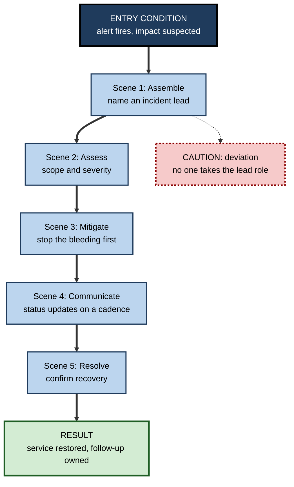
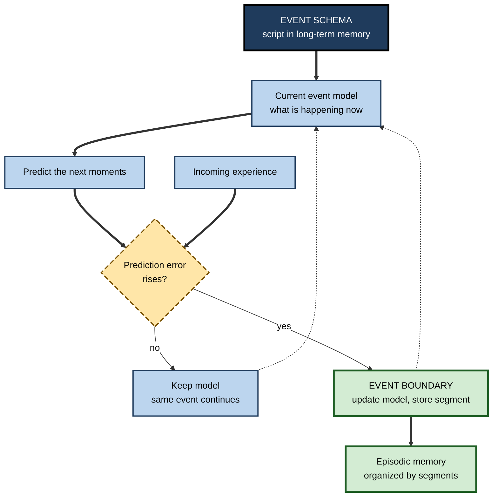

# H.6. Scripts and Event Schemas

> **In one sentence:** A script is a schema for a familiar sequence of events — like ordering at a café or running a sprint review — that tells you who does what, in which order, and what usually happens next.
>
> **Why it matters:** Much professional skill is knowing the script of a situation (a negotiation, an incident, a client kickoff) well enough to act smoothly and to notice instantly when something departs from it. Scripts also explain why people remember the unusual parts of events and forget the routine ones.
>
> **Level span:** Novice → Expert · **Reading time:** ~16 min · **Builds on:** what a schema is; how schemas are built

---

## The Learning Ladder

| Level | Badge | After this level you can... |
|---|---|---|
| 1 | NOVICE | Describe what a script is and give everyday and workplace examples. |
| 2 | FOUNDATIONS | Name the parts of a script (roles, props, entry conditions, scenes, results) and explain event boundaries. |
| 3 | PRACTITIONER | Write down the script of a professional situation and use it to prepare, act and debrief. |
| 4 | ADVANCED | Explain classic script memory findings, event segmentation theory and the brain basis of event schemas. |
| 5 | EXPERT / PRO | Design onboarding, runbooks, simulations and AI tools around scripts — and train people for when scripts break. |

---

## Level 1 · Novice — The Big Picture

When you go to a coffee shop you do not think about each step. You queue, read the board, order, pay, wait at the counter, hear your name, take your cup. You know this sequence so well that you only notice it when something goes wrong — the barista asks you to pay *after* you collect, or there is no queue at all and you hesitate.

That ready-made sequence is a **script**: a mental template for a type of event, with the usual steps in the usual order. Scripts are a special kind of schema — one organized in **time**.

An analogy: a script is like the **plot outline of a genre film**. In a heist movie you know there will be a team assembled, a plan explained, a complication, and a twist. Each film fills in the details differently, but the outline lets you follow along and predict what is coming.

You have already relied on scripts when:

- You attended your first wedding in a new culture and felt lost — your script for weddings did not match theirs.
- You joined a new company and the first few stand-up meetings felt awkward until you learned "how they run here".
- You remembered the one meeting where the projector caught fire, but cannot recall any of the dozens of normal ones.

The beginner's takeaway: **scripts let you move smoothly through familiar events and make the unusual parts stand out.**

---

## Level 2 · Foundations — Core Concepts

### The anatomy of a script

Roger Schank and Robert Abelson introduced scripts in 1977, originally to help computers understand stories. Their classic example was the restaurant script. Its parts generalize to any professional event.

| Part | Meaning | Restaurant | Client kickoff meeting |
|---|---|---|---|
| **Roles** | Who takes part | Customer, server, cook, cashier | Client sponsor, project lead, team members |
| **Props** | Objects involved | Tables, menu, food, bill | Agenda, scope document, slides |
| **Entry conditions** | What must be true to start | Customer is hungry and has money | Contract signed, team assigned |
| **Scenes** | Main ordered stages | Entering, ordering, eating, paying | Introductions, goals, scope, risks, next steps |
| **Tracks** | Variants of the script | Fast food, fine dining | In person, remote, executive-only |
| **Results** | What is true at the end | Customer full, restaurant paid | Shared understanding, agreed next steps |

**Figure H.6-1 — A professional script: the incident response call.**

*How to read it:* the thick path is the default sequence of scenes; the dotted branch shows a common deviation that experienced responders notice immediately.

### Event schemas and event boundaries

Scripts are one kind of **event schema** — knowledge of how a type of event usually unfolds. Modern research adds the idea of **event boundaries**: the moments when we perceive one meaningful unit of activity ending and another beginning (finishing the order and starting to wait). We automatically chop the continuous stream of experience into these units, and they shape what we remember.

### Key terms

| Term | Plain meaning |
|---|---|
| **Script** | A schema for a familiar, ordered sequence of events. |
| **Event schema** | General knowledge of how a type of event unfolds. |
| **Scene** | A main stage within a script. |
| **Track** | A variant of a script (fast food versus fine dining). |
| **Entry condition** | What must be true for the script to start. |
| **Event boundary** | A perceived point where one event ends and another begins. |
| **Event model** | The working representation of "what is happening now", held while an event unfolds. |
| **Script deviation** | Something that departs from the expected script: an obstacle, error or interruption. |

---

## Level 3 · Practitioner — Putting It to Work

### The Script Map — preparing for a recurring professional event

1. **Name the event type.** "Quarterly business review with a key account."
2. **List the roles and their goals.** Who is there, and what does each want from it?
3. **Write the scenes in order** — five to eight, no more.
4. **Mark the entry conditions and desired results.** What must be ready before; what must be true after?
5. **Note the tracks.** How does the script change for a renewal at risk versus a growth account?
6. **List the likely deviations.** Where does this event typically go off-script — a surprise objection, an executive who arrives late, a demo that fails? Prepare a response for each.
7. **Debrief against the script.** Afterwards, note where reality departed from the map; update the map.

### Worked example — a new consultant facing her first steering committee

| | Before (no script) | After (script mapped with a senior colleague) |
|---|---|---|
| **Preparation** | Polishes slides; assumes the meeting is a presentation. | Learns the real script: pre-wired decisions, a 5-minute status, a decision scene, an "any other business" scene where escalations surface. |
| **During** | Presents all 30 slides; runs out of time before the decision. | Front-loads the decision; keeps status brief; prepares for the escalation scene. |
| **Deviation** | The sponsor raises a budget concern; she is caught off guard. | Has anticipated the budget question as a likely deviation; answers with a prepared one-pager. |
| **Debrief** | "It went badly." | Updates the script: this committee also expects a risk heat-map. |

### Common mistakes at this level

- **Assuming your script is universal.** Scripts vary by company, country and team. What counts as "a meeting" in one culture is very different in another.
- **Over-scripting.** Turning every interaction into a rigid procedure makes people brittle when something unexpected happens.
- **Mapping only the happy path.** The value of a script is often in the anticipated deviations.
- **Never updating the script.** Scripts drift as organizations change; old scripts produce outdated expectations.

---

## Level 4 · Advanced — Mechanisms, Models & Evidence

### Classic findings on script memory

A 1979 study by Gordon Bower, John Black and Terrence Turner established several findings that have shaped the field:

- **People agree on scripts.** Asked to list the actions in everyday events (a lecture, a doctor's visit), participants produced strikingly similar lists and agreed on the main scenes.
- **Scripts fill gaps in memory.** After reading short stories that mentioned only some script actions, people falsely "remembered" unmentioned actions that belong to the script.
- **Deviations are remembered well.** Obstacles, errors and interruptions — things that departed from the script — were recalled better than routine actions.

Later work refined these findings: schema-consistent actions are often reconstructed rather than remembered, while schema-inconsistent actions are encoded as distinct episodes, unless they are trivial or irrelevant.

### Event segmentation theory

Event segmentation theory, developed by Jeffrey Zacks and colleagues in the 2000s, proposes that the mind keeps an **event model** of what is happening now and constantly uses it to predict the next moments. When predictions start failing — a change of location, goal, person or action — the system perceives an **event boundary**, updates its model, and starts a new segment.

Key findings:

- People segment activity in consistent ways, and better segmentation ability predicts better memory for events, an effect found to last up to a month in studies.
- Boundaries act like chapter breaks in memory: information within an event is bound together; information across a boundary is harder to link. Walking through a doorway can reduce memory for what was just handled in the previous room (the "doorway effect", which has some mixed replications).
- Event schemas supply the predictions: a strong script makes predictions accurate, so boundaries fall where the script's scenes change.

**Figure H.6-2 — How event models, schemas and boundaries interact.**

*How to read it:* the schema feeds predictions; when predictions fail, a boundary is drawn and a memory segment is stored; dotted arrows show the model being kept or refreshed.

### The brain basis

Neuroimaging studies of people watching films or listening to stories show that regions including the medial prefrontal cortex and parts of the default mode network carry representations of **event schemas** that generalize across different stories with the same structure (for example, different airport or restaurant stories). Research published in the early 2020s found that how strongly these regions tracked the schema during an event predicted later memory for the event's details. At event boundaries, the hippocampus shows bursts of activity associated with storing the just-completed event.

### Boundary conditions and debates

- **How rigid are scripts?** Early accounts described fixed sequences; modern views treat scripts as flexible, with optional scenes and many tracks.
- **Culture and scripts.** Scripts are learned socially and differ across cultures, which affects memory and expectations in cross-cultural teams.
- **Machine scripts.** Researchers have tested whether large language models encode event schemas; they can generate plausible typical sequences, which has revived interest in Schank's ideas in AI, although whether this reflects human-like event understanding is debated.

---

## Level 5 · Expert / Pro — Professional Mastery

### Scripts in professional practice

Professions formalize scripts constantly: aviation checklists, surgical safety checklists, incident runbooks, sales playbooks, legal procedures, onboarding plans. These are **external scripts** — shared, written versions of an event schema. Well designed, they reduce errors in routine steps and free attention for judgment. Poorly designed, they become box-ticking or blind spots.

| Design question | Weak practice | Strong practice |
|---|---|---|
| Granularity | Every micro-step | The critical scenes and checks only |
| Deviations | Not covered | Common deviations and responses listed |
| Ownership | Role ambiguous | Each scene has a named role |
| Updating | Written once | Revised after every significant deviation |
| Training | Read the document | Rehearsed in simulations, including off-script cases |

### Training for the moment the script breaks

Expertise in high-stakes fields is often described as knowing the script so well that deviations jump out — what decision researcher Gary Klein called recognizing when **expectancies are violated**. Experienced firefighters, nurses and incident commanders notice that "something is wrong" because the event is departing from the script. Simulation-based training deliberately includes unexpected deviations so that learners build two things: the script itself and a sensitivity to departures from it.

### AI-era practice

AI agents and copilots now execute parts of professional scripts (drafting status updates during an incident, summarizing meetings). This changes the human role: the professional increasingly monitors the script rather than running every step. Two risks follow. First, if people never perform the scenes, they may not build the script well enough to notice when the AI goes off-script. Second, AI tools built on typical sequences tend to assume the default track and can miss unusual situations. Teams therefore keep humans practising critical scenes unaided and design AI handoffs at scene boundaries, where humans can check state.

### Professional scenario

**Role:** Head of sales enablement at a B2B software company.
**Situation:** New reps follow the discovery-call script word for word; calls feel robotic, and reps freeze when buyers go off-script.
**What the pro does:** Rewrites the playbook as a script map — five scenes, each with a goal rather than lines — plus a list of the eight most common buyer deviations and two good responses each. Weekly role-plays use an experienced manager (or an AI role-play partner configured with the deviation list) to throw unannounced deviations. Call reviews tag where the rep noticed a deviation. Within a quarter, recorded calls show more natural flow and better recovery from objections.

### Ethical limits

Scripts encode norms, and norms can exclude. Interview scripts that reward one cultural style of self-presentation, or customer-service scripts that ignore accessibility needs, systematically disadvantage some people. Professionals review scripts for whose expectations they encode.

---

## Myths vs. Evidence

| Myth | What the evidence shows |
|---|---|
| "We remember events as they happened." | Routine parts are often reconstructed from the script; people recall script actions that never occurred. |
| "Scripts make people robotic." | Rigid word-for-word scripts can; scene-and-goal scripts free attention for judgment. |
| "Checklists are for beginners." | Checklists improve reliability for experts too in high-stakes routine steps; their value depends on design. |
| "Everyone shares the same scripts." | Scripts are culturally learned and differ across teams, organizations and countries. |
| "AI can run the script, so people don't need to know it." | Without the script, people cannot notice when the AI goes off-script. |

## Practitioner Toolkit

**Script Map checklist**

- [ ] Event type named.
- [ ] Roles and their goals listed.
- [ ] Five to eight scenes in order.
- [ ] Entry conditions and results written.
- [ ] Main tracks (variants) noted.
- [ ] Top deviations and responses prepared.
- [ ] Debrief scheduled to update the map.

**Template — script map**

| Scene | Goal | Owner (role) | Usual signals | Likely deviation | Response |
|---|---|---|---|---|---|
| | | | | | |

## Self-Check

1. **[NOVICE]** What is a script? Give one everyday and one workplace example.
2. **[NOVICE]** Why do you remember the unusual meeting but not the routine ones?
3. **[FOUNDATIONS]** Name five parts of a script.
4. **[FOUNDATIONS]** What is an event boundary?
5. **[PRACTITIONER]** Why should a script map include deviations?
6. **[ADVANCED]** What three findings did Bower, Black and Turner report?
7. **[ADVANCED]** According to event segmentation theory, what triggers a boundary?
8. **[EXPERT / PRO]** How would you design simulation training that builds both a script and deviation sensitivity?
9. **[EXPERT / PRO]** What risk arises when AI agents perform scenes of a professional script?

### Answer Key

1. A schema for an ordered sequence of events; for example, ordering coffee, and running a sprint review.
2. Routine parts match the script and are reconstructed or merged; deviations are encoded as distinct episodes.
3. Roles, props, entry conditions, scenes, tracks, results.
4. A perceived point where one meaningful event ends and another begins.
5. Deviations are where errors and opportunities lie; preparing responses turns surprises into expected variants.
6. People agree on script actions; they falsely recall unmentioned script actions; deviations are recalled better than routine actions.
7. Rising prediction error — the current event model stops predicting what happens next.
8. Rehearse the normal script first, then add unannounced, realistic deviations; debrief on whether and how quickly they were noticed.
9. People may not build the script well enough to notice AI errors, and AI may default to the typical track and miss unusual situations.

## Key Takeaways

- A **script** is a schema for an ordered sequence of events, with **roles, props, entry conditions, scenes, tracks and results**.
- Scripts make routine events smooth and **make deviations stand out**.
- People **reconstruct routine parts** of events from scripts, sometimes falsely.
- **Event segmentation** divides experience into units at points of prediction failure, shaping memory.
- Professional checklists, runbooks and playbooks are **external scripts**; design them around scenes, owners and deviations.
- Train for the **moment the script breaks**, especially as AI takes over routine scenes.

## Glossary

| Term | Meaning |
|---|---|
| Default mode network | Brain network active in remembering, imagining and understanding narratives. |
| Entry condition | What must be true for a script to begin. |
| Event boundary | The perceived end of one event and start of another. |
| Event model | Working representation of the current event. |
| Event schema | General knowledge of how a type of event unfolds. |
| Event segmentation theory | Theory that the mind divides experience into events at points of prediction error. |
| Expectancy violation | Noticing that events depart from what a schema predicts. |
| Runbook | A written operational script for handling a known situation. |
| Scene | A main stage in a script. |
| Script | A schema for a familiar sequence of events. |
| Track | A variant of a script. |
