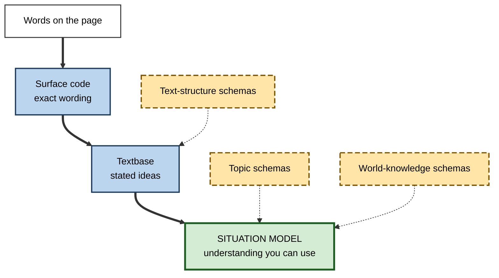
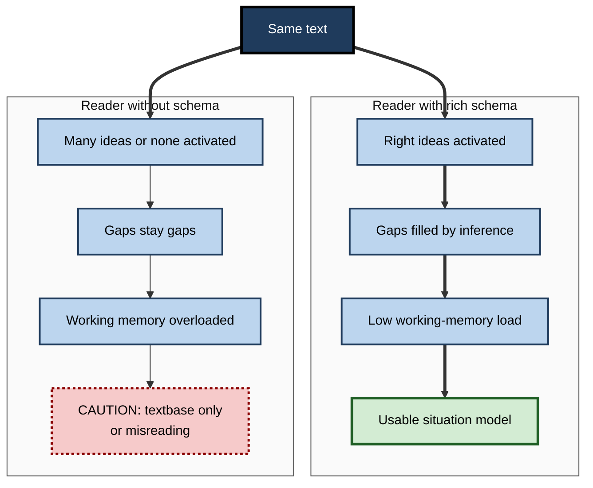

# H.7. Schemas in Reading Comprehension

> **In one sentence:** You understand what you read by connecting the words to schemas you already have — about the topic, about how the world works and about how texts of that kind are organized — so the same text can be crystal clear to one reader and baffling to another.
>
> **Why it matters:** Professionals spend hours a day reading documentation, contracts, reports, research and AI-generated text. Reading comprehension is far more about knowledge than about generic "reading skills", which changes how you should onboard people, write documents and use AI summaries.
>
> **Level span:** Novice → Expert · **Reading time:** ~17 min · **Builds on:** what a schema is; schemas and prior knowledge

---

## The Learning Ladder

| Level | Badge | After this level you can... |
|---|---|---|
| 1 | NOVICE | Explain why understanding a text depends on what you already know. |
| 2 | FOUNDATIONS | Distinguish topic schemas, world-knowledge schemas and text-structure schemas, and define the situation model. |
| 3 | PRACTITIONER | Prepare to read difficult professional texts by building and activating the right schemas first. |
| 4 | ADVANCED | Explain the classic and recent evidence on knowledge and comprehension, including the construction–integration model and knowledge-rich curriculum studies. |
| 5 | EXPERT / PRO | Write and curate documents, onboarding materials and AI-assisted reading workflows that work for readers with different schemas. |

---

## Level 1 · Novice — The Big Picture

Try reading this: "The batter lofted a fly to deep left; the runner tagged up from third and scored." If you know baseball, you see the whole play. If you don't, you understand every word and still have no idea what happened.

Now try: "The SLA breach triggered a P1, so the IC paged the on-call SRE." Software operations people understand that instantly. Others see a jumble of letters.

Reading is not just turning letters into words. It is **building a mental picture of what the text describes**, and that picture is built from your schemas. The text gives you clues; your knowledge fills in everything the writer did not say. Writers always leave most things unsaid, because they assume readers share their schemas.

An analogy: a text is like **flat-pack furniture instructions**. The instructions assume you already know what a screwdriver is, what "tighten" means and roughly what a bookcase looks like. Someone with that knowledge builds the bookcase quickly. Someone without it stares at the diagrams.

You have already experienced this when:

- A legal or medical document was "in English" but still impossible to follow.
- An article about your own field felt easy and fast, while one about an unfamiliar field took three readings.
- You read a novel set in an unfamiliar culture and missed jokes that native readers found obvious.

The beginner's takeaway: **comprehension depends on knowledge. The more relevant schemas you have, the more a text makes sense.**

---

## Level 2 · Foundations — Core Concepts

### Three kinds of schema at work while reading

| Schema type | What it covers | Example | Without it... |
|---|---|---|---|
| **Topic (content) schema** | Knowledge about the subject | Knowing how interest rates affect bond prices | Facts float unconnected; inferences fail. |
| **World-knowledge schema** | General knowledge of people, causes, social situations | Knowing that a CEO's "strategic review" often precedes layoffs | Implications and subtext are missed. |
| **Text-structure (formal) schema** | Knowledge of how this kind of text is organized | Knowing a research paper has methods before results; a contract has definitions first | Readers get lost, read in the wrong order, miss key sections. |

### Three levels of understanding

Psychologist Walter Kintsch distinguished three levels of representation a reader builds:

1. **Surface code** — the exact words. Fades quickly.
2. **Textbase** — the ideas the text explicitly states. Enough to summarize, not enough to apply.
3. **Situation model** — a mental model of the situation the text describes, integrating the text with prior knowledge. This is where real understanding, inference and application live.

Schemas matter most at the third level. A reader with weak schemas may build a textbase (can repeat the main points) but not a situation model (cannot apply or critique them).

**Figure H.7-1 — From words on a page to understanding.**

*How to read it:* the thick path is processing from words to understanding; dotted arrows show where schemas feed in. Topic and world knowledge are what turn a textbase into a usable situation model.

### Key terms

| Term | Plain meaning |
|---|---|
| **Reading comprehension** | Building a meaningful, usable understanding from text. |
| **Decoding** | Turning written symbols into words. |
| **Background knowledge** | What the reader knows about the topic and the world. |
| **Inference** | Filling in information the text does not state. |
| **Situation model** | A mental model of what the text describes, integrated with prior knowledge. |
| **Textbase** | The explicit ideas stated in the text. |
| **Text-structure schema** | Knowledge of how a type of text is organized. |
| **Knowledge threshold** | A level of background knowledge below which comprehension drops sharply. |

---

## Level 3 · Practitioner — Putting It to Work

### The Pre-Read routine for difficult professional texts

1. **Identify the text type.** Is this a standard, a contract, a research paper, an architecture decision record? Recall (or look up) its usual structure. Read its structure first: headings, abstract, conclusion, definitions.
2. **Check your topic schema.** Before reading, write three things you already know and three terms you are unsure of. If you are unsure of more than a few key terms, the text is above your knowledge threshold.
3. **Build a minimal schema first if needed.** Read a short, plain introduction to the topic, or ask a colleague for a five-minute explanation. Then return to the hard text.
4. **Read for the situation model.** As you read, ask: "What would this look like in practice? What follows from this?" not just "What does it say?"
5. **Stop at confusion and name the missing schema.** Is the problem a word, a concept, a causal link or the structure? Fix that one thing.
6. **Explain it without the text.** Close the document and explain what it means for your work. Gaps show where your situation model is incomplete.

### Worked example — a product designer reading a security architecture review

| | Before (cold read) | After (Pre-Read routine) |
|---|---|---|
| **Approach** | Reads 20 pages start to finish. | Skims structure first: threat model, controls, residual risks. |
| **Schema check** | — | Unsure of "threat model", "zero trust", "token scope". |
| **Schema building** | — | Fifteen-minute primer with an engineer, using a diagram of the login flow. |
| **Comprehension** | Can quote phrases; cannot say what affects her design. | Identifies two design changes: session timeout behaviour and a permission prompt. |

### Common mistakes at this level

- **Blaming reading skill when the gap is knowledge.** Re-reading harder rarely fixes a missing schema; building the schema does.
- **Relying on generic strategies alone.** "Find the main idea" helps little when you cannot tell what matters in the domain.
- **Reading linearly when the text type does not reward it.** Research papers, contracts and standards are rarely best read front to back.
- **Mistaking a textbase for understanding.** Being able to summarize a document is not the same as being able to apply it.

---

## Level 4 · Advanced — Mechanisms, Models & Evidence

### Classic demonstrations

- **The "washing clothes" passage.** In John Bransford and Marcia Johnson's 1972 study, a vague procedural passage was understood and recalled far better when readers knew the topic beforehand. A title given after reading did not help: the schema must be active during reading.
- **Perspective shapes what is noticed.** Richard Anderson and James Pichert's 1978 study showed that readers adopting a burglar's or home buyer's perspective encoded different details of the same text.
- **Knowledge can beat reading ability.** In Donna Recht and Lauren Leslie's 1988 "baseball study", middle-school students with high baseball knowledge but weak general reading ability understood and recalled a baseball passage better than strong readers with little baseball knowledge. This study is widely cited as evidence that topic knowledge can outweigh general reading skill for a given text.
- **Cultural schemas shape understanding.** Studies in the late 1970s and early 1980s found that readers recalled culturally familiar texts (for example, a wedding in their own culture) more accurately and with fewer distortions than unfamiliar ones.

### The construction–integration model

Kintsch's construction–integration model describes reading as a two-phase cycle. In **construction**, each sentence activates many associated ideas from memory, relevant and irrelevant alike. In **integration**, ideas that fit together strengthen each other and the irrelevant ones fade, leaving a coherent representation. Prior knowledge determines what gets activated and how quickly coherence is reached. Readers with rich schemas activate the right associations and make bridging inferences automatically; readers with weak schemas must hold more in working memory, which is why research has found that relevant knowledge reduces working-memory demands during reading.

### Recent evidence on knowledge-building curricula

The idea that comprehension is mostly knowledge has shaped education policy debates. A study published in 2023–2024 used admission lotteries to compare children who did and did not win places at schools using the Core Knowledge curriculum, which systematically builds knowledge in history, science and the arts. Lottery winners scored substantially higher on state reading tests in grades 3 through 6 — a gain reported as roughly 16 percentile points — with smaller gains in other subjects. Because the comparison relies on random lotteries, it is stronger evidence than most correlational studies, though it concerns one curriculum in one state. Other studies, including large-sample work on a **knowledge threshold**, suggest that below a certain level of topic knowledge, comprehension is consistently poor regardless of strategy use.

These findings do not mean reading strategies are useless. Brief instruction in strategies such as summarizing, questioning and monitoring comprehension shows benefits, particularly early on, but the benefits appear to plateau quickly, while knowledge keeps paying off.

**Figure H.7-2 — Why the same text works for one reader and not another.**

*How to read it:* both readers receive the same input; the difference in outcome comes entirely from the schemas each brings.

### Boundary conditions and debates

- **Knowledge and decoding both matter.** For beginning readers, decoding is a bottleneck; the knowledge argument concerns comprehension once decoding is reasonably fluent.
- **Which knowledge?** Broad knowledge helps general comprehension; specialized texts need specialized schemas. Debates continue about how to select knowledge for curricula.
- **Schemas can mislead reading.** Readers sometimes assimilate a text into what they expect it to say, missing claims that contradict their beliefs — a reason refutation texts make contradictions explicit.

---

## Level 5 · Expert / Pro — Professional Mastery

### Writing for readers' schemas

Writers of professional documents control how much schema the reader must bring. Experts design documents that **supply missing schemas** without boring experts.

| Technique | What it does |
|---|---|
| **State the purpose and audience at the top** | Activates the right topic schema before details. |
| **Use predictable structures** | Templates (decision records, RFCs, one-pagers) let readers use text-structure schemas. |
| **Define terms at first use, and link them to familiar ideas** | Bridges from known schemas to new ones. |
| **Show a concrete example early** | Builds a situation model the abstractions can attach to. |
| **Layer the document** | Summary for all, detail for specialists, glossary for newcomers. |
| **Make surprising claims explicit** | Prevents readers from assimilating them into what they expected. |

### AI summaries and reading

Generative AI can summarize, simplify and explain documents on demand, which is a powerful way to **build a quick schema before a hard read**. It also creates a trap. A summary gives a textbase, not a situation model; readers who only read summaries can repeat points without being able to apply or challenge them. Reviews of cognitive offloading published in 2025–2026 make the same point more generally: when a tool does the integrating, the reader's own processing — the part that builds schemas — is reduced. Professionals use AI to *prepare* to read ("Explain the key concepts I need for this paper") and to *test* their comprehension ("Ask me five questions about section 3"), not as a substitute for reading critical documents.

### Professional scenario

**Role:** Technical writer leading documentation for a developer platform.
**Situation:** Support tickets show that new users misconfigure authentication, although the docs describe every step correctly.
**What the pro does:** Interviews five new users and finds they lack a schema for how tokens, scopes and roles relate — each page assumes it. Adds a one-page conceptual overview with a single diagram at the start of the authentication section, a worked example connecting the three ideas, and consistent page structures (Purpose, Prerequisites, Steps, Verify). Ticket volume for authentication falls the next quarter; the step pages themselves barely changed.

### Organizational implications

- **Onboarding reading lists should be sequenced** so early documents build the schemas later ones assume.
- **Glossaries and concept maps** are high-leverage artefacts for teams with domain jargon.
- **Cross-functional documents** need translation layers; the same memo cannot assume finance, engineering and legal schemas at once.

---

## Myths vs. Evidence

| Myth | What the evidence shows |
|---|---|
| "Reading comprehension is a general skill you can train once." | Comprehension depends heavily on topic knowledge; strategy training helps briefly, knowledge keeps helping. |
| "Good readers understand anything." | Strong readers with little topic knowledge can understand less than weak readers with high knowledge, as in the baseball study. |
| "If I can summarize it, I understand it." | Summarizing shows a textbase; applying and inferring require a situation model. |
| "AI summaries make reading unnecessary." | Summaries give the gist; they do not build the schemas needed to apply or critique. |
| "Simplifying language solves comprehension problems." | Plain language helps, but if readers lack the concepts, simple words do not supply them. |

## Practitioner Toolkit

**Pre-Read checklist**

- [ ] I identified the text type and skimmed its structure.
- [ ] I listed what I know and the key terms I am unsure of.
- [ ] If too many terms were unclear, I built a minimal schema first.
- [ ] I read for implications, not just content.
- [ ] I named the missing schema at each point of confusion.
- [ ] I explained the text without looking at it.

**Writer's checklist for a professional document**

- [ ] Purpose and audience stated in the first lines.
- [ ] Predictable structure used.
- [ ] Key terms defined and connected to familiar ideas.
- [ ] A concrete example early.
- [ ] Surprising or counterintuitive claims stated explicitly.

## Self-Check

1. **[NOVICE]** Why can you understand every word of a text but still not understand it?
2. **[NOVICE]** Give an example of a text that is easy for you but hard for others.
3. **[FOUNDATIONS]** Name the three kinds of schema used in reading.
4. **[FOUNDATIONS]** What is the difference between a textbase and a situation model?
5. **[PRACTITIONER]** What should you do if a text has too many unfamiliar key terms?
6. **[ADVANCED]** What did the baseball study show?
7. **[ADVANCED]** Why is the Core Knowledge lottery study considered stronger evidence than many earlier studies?
8. **[EXPERT / PRO]** How would you redesign documentation that is correct but frequently misunderstood?
9. **[EXPERT / PRO]** How should professionals use AI summaries in reading?

### Answer Key

1. Comprehension needs schemas to connect words into a situation model; without topic or world knowledge, the words do not combine into meaning.
2. Answers vary — for example, an incident report in your own team's jargon.
3. Topic (content), world-knowledge, and text-structure (formal) schemas.
4. A textbase is the explicitly stated ideas; a situation model integrates them with prior knowledge into a usable understanding.
5. Build a minimal schema first — a short primer or explanation — then return to the text.
6. Students with high baseball knowledge but weak reading ability understood a baseball passage better than strong readers with little baseball knowledge.
7. It compared lottery winners and losers, approximating random assignment, and followed students for several years.
8. Diagnose the missing schema with users, then add a conceptual overview, an early worked example and consistent structures.
9. To build a schema before reading and to test comprehension afterwards — not as a substitute for reading important documents.

## Key Takeaways

- Comprehension is **building a situation model**, and schemas supply most of it.
- Three schema types matter: **topic, world knowledge and text structure**.
- **Knowledge often outweighs general reading skill** for understanding a specific text.
- When a text is too hard, **build the missing schema first**, then read.
- Good writers **supply schemas**: purpose first, predictable structure, defined terms, early examples.
- AI summaries give a **textbase**, not understanding; use AI to prepare and to test.

## Glossary

| Term | Meaning |
|---|---|
| Background knowledge | What a reader already knows about the topic and the world. |
| Bridging inference | Connecting two pieces of text with knowledge the text does not state. |
| Construction–integration model | Kintsch's model of reading as activating associations then settling on a coherent interpretation. |
| Decoding | Converting written symbols into words. |
| Knowledge threshold | Level of topic knowledge below which comprehension drops sharply. |
| Situation model | Mental model of the described situation, integrated with prior knowledge. |
| Surface code | Memory of the exact words of a text. |
| Text-structure schema | Knowledge of how a type of text is organized. |
| Textbase | Representation of the ideas explicitly stated in a text. |
