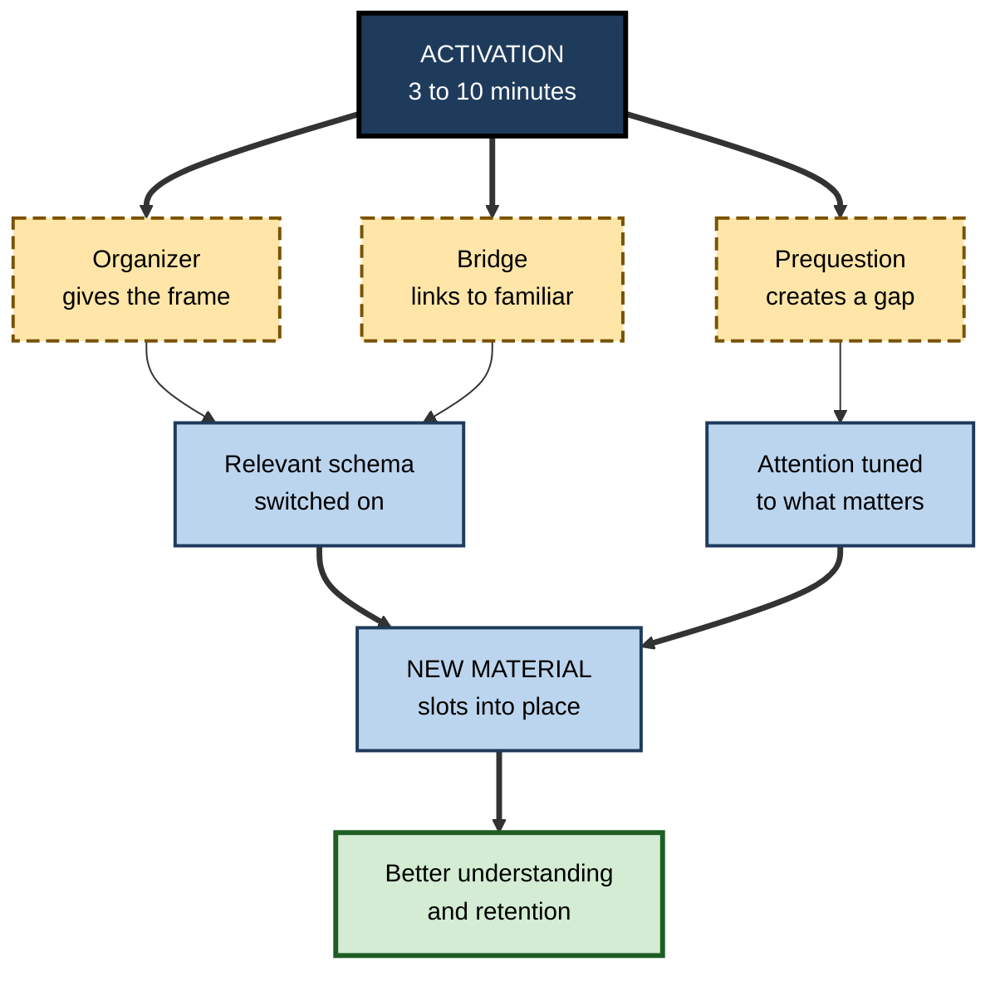
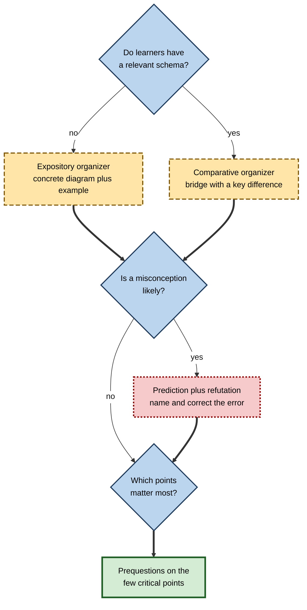

# H.8. Schema Activation Before Learning

> **In one sentence:** Schema activation means switching on the right existing knowledge before new material arrives — with an overview, a question, a comparison or a quick attempt — so the new information has somewhere to attach.
>
> **Why it matters:** A few minutes of the right activation can make the next hour of learning noticeably more effective; the wrong kind can waste time or even strengthen misconceptions. Professionals who know which techniques work, and when, design better meetings, workshops, onboarding and self-study.
>
> **Level span:** Novice → Expert · **Reading time:** ~16 min · **Builds on:** what a schema is; schemas and prior knowledge

---

## The Learning Ladder

| Level | Badge | After this level you can... |
|---|---|---|
| 1 | NOVICE | Explain why "warming up" your knowledge before learning helps. |
| 2 | FOUNDATIONS | Name the main activation techniques — advance organizers, prequestions, pretests, bridging, prediction — and what each does. |
| 3 | PRACTITIONER | Choose and run a five-minute activation routine suited to the material and the learners. |
| 4 | ADVANCED | Summarize the evidence for each technique, including effect sizes, boundary conditions and when activation backfires. |
| 5 | EXPERT / PRO | Build activation into programmes, meetings and AI-assisted learning at scale, and measure its effect. |

---

## Level 1 · Novice — The Big Picture

Imagine walking into a dark room full of furniture. You can feel your way around, but you will bump into things and miss a lot. Now imagine someone switches on the light for a second before you enter. You still have to walk through the room, but you know where the sofa is, where the table is, and where the door on the other side leads.

**Schema activation** is switching on that light. Before learning something new, you bring the relevant knowledge you already have to the front of your mind, and you get a rough picture of what is coming. Then, when the details arrive, they slot into place instead of piling up.

You have already used schema activation when:

- You looked at the table of contents before reading a long report.
- A presenter started with "Today we'll cover three things..." and the talk was easier to follow.
- Someone asked you a question you could not answer, and when the answer came up later in the talk, it stuck.
- You thought "this is like what we did last year, but..." before starting a new project.

There is a catch. If the knowledge you switch on is wrong, you are now more ready to fit new information into a wrong picture. Good activation switches on the *right* knowledge, and flags the wrong knowledge so it can be corrected.

The beginner's takeaway: **a few minutes spent switching on what you know, and previewing what is coming, makes new information easier to understand and remember.**

---

## Level 2 · Foundations — Core Concepts

### The main activation techniques

| Technique | What it is | How it helps | Example at work |
|---|---|---|---|
| **Advance organizer** | A short, high-level framework presented before the material (overview, analogy, diagram). | Supplies or activates a schema to attach details to. | "This system has three layers: data, services, interface." |
| **Prequestions** | Questions given before learning, on content to be covered. | Directs attention; a failed attempt primes memory for the answer. | "Before the session: why do you think our churn rose in Q2?" |
| **Pretest** | A short test on material not yet learned. | Similar to prequestions; also shows learners what they do not know. | Five-question quiz before a compliance module. |
| **Bridging** | Explicitly linking the new topic to something familiar. | Activates a relevant schema from another domain. | "Feature flags work like a light dimmer for code." |
| **Prediction** | Asking learners to predict an outcome before seeing it. | Engages existing schemas and exposes misconceptions. | "Predict what happens to latency if we double the cache size." |
| **Knowledge inventory** | Listing what you already know and want to know. | Brings inert knowledge to the surface. | "Write three things you know about the client's industry." |

**Figure H.8-1 — How activation prepares the ground for new information.**

*How to read it:* different techniques work through two main routes — switching on a relevant schema, and tuning attention — which together help new material slot into place.

### Key terms

| Term | Plain meaning |
|---|---|
| **Schema activation** | Bringing relevant existing knowledge into an active, ready state. |
| **Advance organizer** | Introductory framework presented before new material. |
| **Expository organizer** | An organizer that gives a new framework when learners lack one. |
| **Comparative organizer** | An organizer that links new material to a familiar schema. |
| **Prequestion** | A question asked before the answer has been taught. |
| **Pretesting effect** | Better learning of material that was tested before it was taught. |
| **Specific vs. general effect** | Benefit for the exact content asked about versus other content in the same lesson. |

---

## Level 3 · Practitioner — Putting It to Work

### The Five-Minute Activation routine

Use before a course module, a meeting, a demo, a document or a self-study session.

1. **Frame (1 minute).** Show the big picture: three to five parts and how they connect. One diagram or sentence. ("Pricing has three levers: list price, discount policy and packaging.")
2. **Bridge (1 minute).** Name a familiar schema it resembles, *and* one way it differs. ("Like our old discount process, except approvals are automatic under 15%.")
3. **Ask (2 minutes).** Pose two or three prequestions on the most important points. Learners commit to an answer — written or spoken — even if they guess.
4. **Expose (1 minute).** Include one question that tends to reveal a common misconception. Note the answers; do not correct them yet.
5. **Learn, then close the loop.** During the material, the answers emerge. Afterwards, return to the prequestions and the misconception explicitly.

### Worked example — a 45-minute internal training on a new expense policy

| | Before (straight into content) | After (Five-Minute Activation) |
|---|---|---|
| **Opening** | "Let's go through the policy, section by section." | One slide: the policy's three parts — limits, approvals, receipts. |
| **Bridge** | None. | "Same idea as the travel policy, except meals now have a daily cap rather than per-meal limits." |
| **Prequestions** | None. | "Can you expense a client dinner over the cap? Who approves it?" |
| **Misconception probe** | None. | "Is a card statement a valid receipt?" (Most say yes; the answer is no.) |
| **One week later** | Several staff submit card statements as receipts. | Far fewer errors on the points that were prequestioned. |

### Common mistakes at this level

- **Open-ended brainstorming with no structure.** "Tell me everything you know about X" can activate irrelevant or wrong ideas and use up time.
- **Activating and then ignoring misconceptions.** If a wrong idea is brought to mind and never refuted, it may be strengthened.
- **Overlong organizers.** An organizer is a frame, not a summary of the whole lesson. More than a few minutes is usually too much.
- **Expecting prequestions to help with everything.** Their benefit is largely limited to the content asked about; ask about what matters most.
- **Skipping the loop-back.** Without revisiting the prequestions, the misconception probe and the gaps stay unresolved.

---

## Level 4 · Advanced — Mechanisms, Models & Evidence

### Advance organizers

David Ausubel introduced advance organizers in the 1960s, distinguishing **expository** organizers (supplying a new framework) from **comparative** organizers (linking to a familiar one). Meta-analyses from the 1980s onward found **small to moderate positive effects** on learning and retention, with considerable variability. Syntheses of multiple meta-analyses put the average effect in roughly the small-to-moderate range. Effects tend to be larger when:

- the material is poorly organized or unfamiliar;
- the organizer is conceptual (a framework or model), not just a list of topics;
- outcomes measure understanding and transfer, not just recall of details.

Some studies suggest learners with very weak prior knowledge benefit less, possibly because an abstract organizer is itself hard to understand without examples — which is why concrete, illustrated organizers often work better for novices.

### Prequestions and pretesting

Asking questions before learning — even questions learners will almost certainly get wrong — reliably improves learning of the questioned content. A preregistered meta-analysis published in 2023–2024 found a **moderate effect for the specific content** asked about (around g = 0.5), and a **near-zero effect for content not asked about**. A 2025 multilevel meta-analysis similarly found a moderate-to-large specific effect. Classroom studies have shown that students perform better on final-exam questions about content that had been pretested.

Proposed mechanisms include:

- **Attention:** prequestions tell learners what to look for.
- **Curiosity and error-driven learning:** an incorrect guess creates a gap the answer fills, and errors followed by feedback are well remembered.
- **Schema activation:** attempting an answer activates related knowledge, providing hooks for the correct information.

An important nuance: learners usually *underestimate* the benefit of pretesting and dislike being asked questions they cannot answer. Telling them why it works improves acceptance.

**Figure H.8-2 — Choosing an activation technique.**

*How to read it:* start at the top; the choice of organizer depends on prior knowledge, misconceptions call for an explicit prediction-and-refutation step, and prequestions are reserved for the most important content.

### When activation backfires

- **Activating misconceptions without correcting them.** Learners may assimilate new information into the faulty schema. Activation should be followed by explicit contrast (see the notes on misconceptions and conceptual change).
- **Activating the wrong schema.** A misleading analogy ("a neural network is like a brain") can produce lasting distortions.
- **Overloading.** Long activation phases use up working memory and time.
- **Narrowing attention too much.** Because prequestions focus attention on their content, some studies find learners attend less to other material; hence the near-zero general effect.

### Neural perspective

Memory research shows that information congruent with an active schema is integrated faster, with the medial prefrontal cortex playing a central role. In laboratory studies, reactivating a schema just before learning improves memory for related new information. These findings support the logic of activation, though laboratory timescales and materials differ from workplace learning.

---

## Level 5 · Expert / Pro — Professional Mastery

### Designing activation into programmes

| Context | Activation pattern |
|---|---|
| **Onboarding** | Day-one system map of the organization and product; each later session opens by placing its content on that map. |
| **Workshops** | Pre-work of three prequestions; opening poll; misconception probe; final loop-back. |
| **Meetings** | Agenda framed as decisions to make; a one-line context reminder before each item. |
| **Documentation** | Purpose and overview first; "if you know X, this is like X except..." callouts. |
| **E-learning** | Short pretest, ungraded, with feedback after the module, not before. |
| **Coaching** | "What do you think is going on?" before offering the expert view. |

### AI-assisted activation

Generative AI makes activation cheap: it can draft organizers, bridging analogies and prequestions for any material in seconds. Professionals apply three safeguards:

1. **Check analogies for accuracy.** AI analogies can be vivid but misleading; an inaccurate bridge activates the wrong schema.
2. **Target prequestions.** Ask the AI for questions on the *most important and most misunderstood* points, since benefits are specific to what is asked.
3. **Keep the learner's attempt first.** An AI that immediately answers the prequestion removes the attempt that produces the benefit.

### Measuring the effect

A simple A/B approach works in organizations: run the same module with and without the activation phase, then compare delayed, unaided performance on items that were prequestioned and items that were not. Expect gains mainly on the targeted items; if there are none, check whether the prequestions addressed what the assessment measured.

### Professional scenario

**Role:** Learning lead for a consulting firm's analytics academy.
**Situation:** Participants arrive at a three-day modelling course with very different backgrounds; the first day is consistently rated confusing.
**What the pro does:** Sends a one-page organizer (the five stages of the modelling workflow with a worked mini-example) and six prequestions two days before. Opens each module with a two-minute bridge and a misconception probe ("Does a higher R-squared always mean a better model?"). Closes each day by revisiting the prequestions. A delayed check three weeks later shows clear improvement on the targeted concepts compared with the previous cohort, and day-one confusion ratings drop.

---

## Myths vs. Evidence

| Myth | What the evidence shows |
|---|---|
| "Testing before teaching is pointless — they don't know it yet." | Prequestions and pretests reliably improve learning of the questioned content. |
| "Any warm-up activity activates the right knowledge." | Unstructured brainstorming can activate irrelevant or faulty ideas. |
| "Advance organizers are just agendas." | Effective organizers are conceptual frameworks; topic lists add little. |
| "Prequestions improve learning of the whole lesson." | Benefits are mostly specific to the content asked about. |
| "Activating misconceptions makes them worse, so avoid them." | Activating misconceptions *and then refuting them explicitly* is one of the more effective approaches; activation without refutation is the risk. |

## Practitioner Toolkit

**Five-Minute Activation checklist**

- [ ] A one-sentence or one-diagram frame of the whole.
- [ ] A bridge to something familiar, with one key difference.
- [ ] Two or three prequestions on the most important points.
- [ ] One misconception probe.
- [ ] Learners commit to answers before the content.
- [ ] Loop back to the prequestions and misconception at the end.

**Template — activation card**

| Element | Content |
|---|---|
| Frame (3–5 parts) | |
| Bridge: "Like ___, except ___" | |
| Prequestion 1 | |
| Prequestion 2 | |
| Misconception probe | |
| Loop-back time | |

## Self-Check

1. **[NOVICE]** What is schema activation, in your own words?
2. **[NOVICE]** Why does previewing a table of contents help?
3. **[FOUNDATIONS]** What is the difference between an expository and a comparative organizer?
4. **[FOUNDATIONS]** What is the pretesting effect?
5. **[PRACTITIONER]** Why should a misconception probe be followed by a loop-back?
6. **[ADVANCED]** What do recent meta-analyses say about specific versus general effects of prequestions?
7. **[ADVANCED]** Under what conditions do advance organizers work best?
8. **[EXPERT / PRO]** How would you test whether an activation phase improves a corporate module?
9. **[EXPERT / PRO]** What safeguards should apply when AI generates organizers and prequestions?

### Answer Key

1. Bringing relevant existing knowledge into an active state, and previewing what is coming, before new learning.
2. It activates a framework for the document's structure so details can be placed as you read.
3. Expository organizers provide a new framework when learners lack one; comparative organizers link new material to a familiar schema.
4. Being tested on content before it is taught improves later learning of that content.
5. Activated misconceptions can absorb new information unless they are explicitly contrasted with the correct idea.
6. Moderate (around g = 0.5 or higher) benefit for questioned content; near-zero benefit for non-questioned content.
7. When material is unfamiliar or poorly organized, when the organizer is conceptual and concrete enough, and when outcomes measure understanding.
8. Run versions with and without activation; compare delayed, unaided performance on prequestioned and non-prequestioned items.
9. Check analogies for accuracy, target prequestions at critical and commonly misunderstood points, and keep the learner's own attempt before any answer.

## Key Takeaways

- **Schema activation** switches on relevant knowledge before learning so new material has somewhere to attach.
- **Advance organizers** have small-to-moderate benefits, largest when they are conceptual and the material is unfamiliar.
- **Prequestions** reliably help — mainly for the **specific content** asked about.
- Activation must be **paired with refutation** when misconceptions are likely.
- Keep activation **short, targeted and looped back** at the end.
- AI makes activation easy to produce; **accuracy and the learner's own attempt** are what make it work.

## Glossary

| Term | Meaning |
|---|---|
| Advance organizer | Introductory framework given before new material. |
| Bridging | Explicitly linking new content to familiar knowledge. |
| Comparative organizer | Organizer linking new material to an existing schema. |
| Expository organizer | Organizer supplying a new framework. |
| General effect | Benefit of prequestions for content not asked about. |
| Knowledge inventory | Listing what you already know before learning. |
| Misconception probe | A question designed to reveal a common faulty belief. |
| Prequestion | A question posed before the content is taught. |
| Pretesting effect | Improved learning of content that was tested before being taught. |
| Schema activation | Bringing relevant prior knowledge into a ready state. |
| Specific effect | Benefit of prequestions for the content they asked about. |
