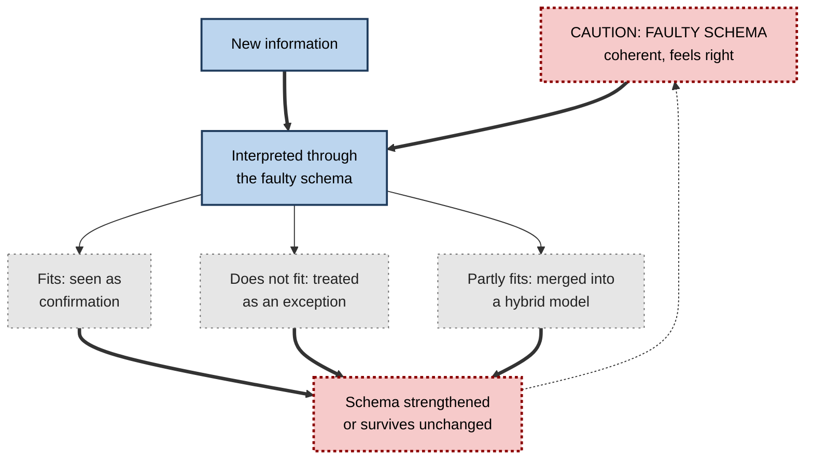
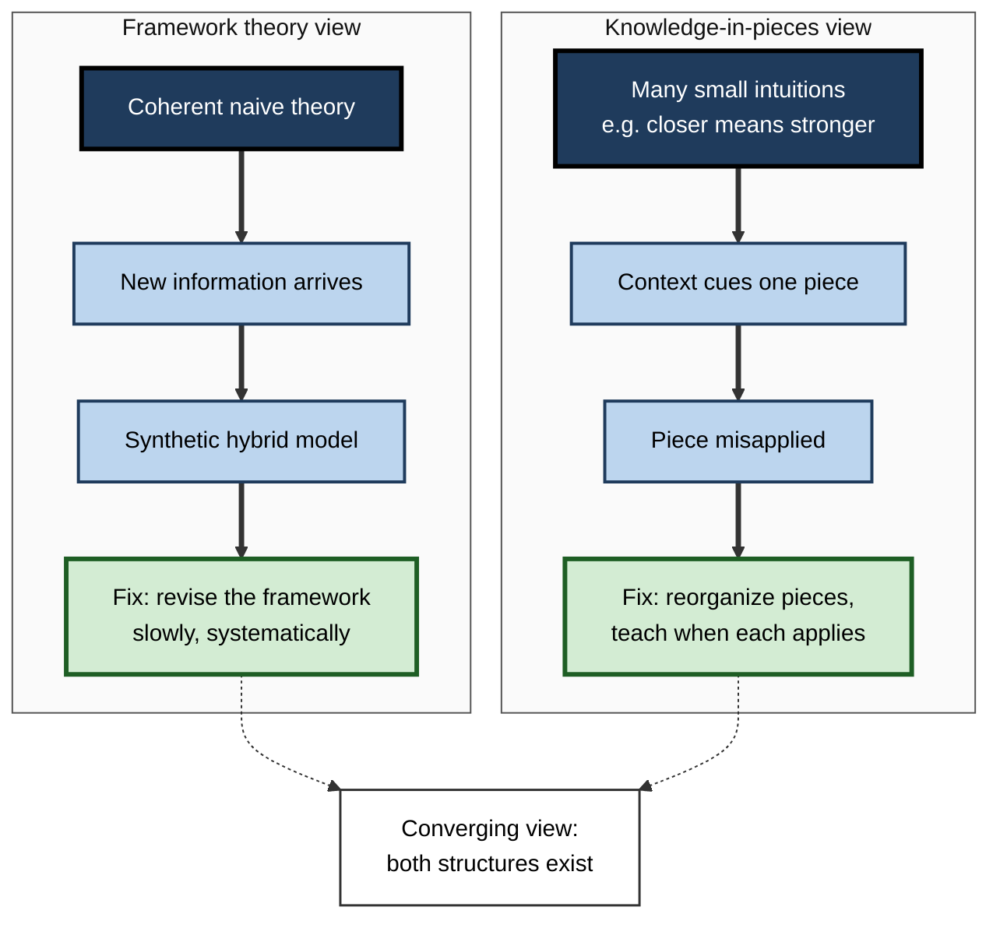

# H.9. Misconceptions as Faulty Schemas

> **In one sentence:** A misconception is not just a wrong fact but a faulty schema — a coherent, often sensible-seeming way of understanding something that happens to be wrong, and that quietly distorts everything new you learn about it.
>
> **Why it matters:** Misconceptions survive courses, degrees and years of experience. In professional life they drive costly decisions (adding people to a late project, trusting a correlation, assuming an AI "looked it up"). Treating them as faulty schemas, not missing facts, is the key to finding and fixing them.
>
> **Level span:** Novice → Expert · **Reading time:** ~17 min · **Builds on:** what a schema is; assimilation and accommodation; prior knowledge

---

## The Learning Ladder

| Level | Badge | After this level you can... |
|---|---|---|
| 1 | NOVICE | Explain why misconceptions are hard to fix and give examples from everyday life and work. |
| 2 | FOUNDATIONS | Distinguish false beliefs, flawed mental models and category mistakes, and explain where misconceptions come from. |
| 3 | PRACTITIONER | Detect misconceptions in yourself and others using prediction and explanation probes. |
| 4 | ADVANCED | Explain the research on why misconceptions persist, including framework theories, knowledge in pieces and the evidence that intuitions are suppressed rather than erased. |
| 5 | EXPERT / PRO | Build misconception diagnosis into training, hiring, AI rollouts and decision processes. |

---

## Level 1 · Novice — The Big Picture

Ask a group of adults why it is warmer in summer than in winter. Many will say "because the Earth is closer to the Sun in summer". It sounds reasonable: closer to a fire means warmer. It is also wrong. The seasons come from the tilt of the Earth's axis, and the Northern Hemisphere's summer actually happens when Earth is slightly *farther* from the Sun.

That wrong answer is a **misconception**: a mistaken understanding that feels right. It is not random. It comes from a sensible everyday schema ("closer to a heat source = warmer") applied where it does not fit.

An analogy: a misconception is like a **map with a wrong road drawn on it**. The rest of the map is fine, and the wrong road looks just like the real ones. You keep using it confidently — until it leads you somewhere you did not mean to go. And because it is drawn into the map, every new route you plan uses it too.

You have probably met misconceptions at work:

- "If the project is late, add more people." (Often makes it later, because new people need onboarding and coordination.)
- "Our numbers went up after the campaign, so the campaign worked." (Correlation is not proof of cause.)
- "The AI said it, so it must be from a source." (Generative AI produces plausible text; it does not necessarily retrieve facts.)
- "We're too small to be a target for hackers." (Automated attacks target everyone.)

The beginner's takeaway: **misconceptions are sensible-seeming mental models that are wrong. They feel like knowledge, so you have to look for them on purpose.**

---

## Level 2 · Foundations — Core Concepts

### Three kinds of faulty schema

Cognitive scientist Michelene Chi distinguished misconceptions by how deep the fault runs. This matters because each kind needs a different fix.

| Kind | What is wrong | Example | How hard to fix |
|---|---|---|---|
| **False belief** | A single incorrect proposition inside an otherwise sound schema | "The heart oxygenates blood." | Usually easy: a clear correction often works. |
| **Flawed mental model** | A coherent but wrong model of how a system works | "The heart has one loop: body to heart to body." | Harder: needs the model replaced, not just a fact. |
| **Category mistake** | The concept is put in the wrong *kind* of category | Heat understood as a substance that flows, rather than as energy of molecular motion; a traffic jam seen as caused by one driver rather than emerging from many interactions | Hardest: needs a shift to a different type of explanation. |

### Where misconceptions come from

1. **Everyday experience.** Pushed objects stop, so "motion needs a force to keep going" seems obvious — it is the friction we do not see.
2. **Language.** "The sun rises", "heat escapes", "the market wants" all carry hidden models.
3. **Over-extension of a valid schema.** "More effort, more output" works for simple tasks, fails for complex coordination.
4. **Instruction and simplification.** Simplified teaching models ("electrons orbit like planets") get taken literally.
5. **Social and media sources.** Repeated myths (we use 10% of our brains; people have fixed "learning styles") spread because they are memorable and simple.
6. **Synthesis of conflicting inputs.** Learners combine new information with an old schema to form a hybrid model that is still wrong.

**Figure H.9-1 — How a faulty schema protects itself.**

*How to read it:* whatever the new information is, it passes through the faulty schema; all three routes tend to leave the schema in place, and the dotted arrow shows the cycle repeating.

### Key terms

| Term | Plain meaning |
|---|---|
| **Misconception** | A mistaken understanding held with confidence, usually part of a broader faulty schema. |
| **Preconception** | Prior understanding learners bring before instruction; may be accurate or not. |
| **Alternative conception** | A neutral term for a learner's idea that differs from the accepted one. |
| **Category mistake (ontological miscategorization)** | Placing a concept in the wrong kind of category. |
| **Synthetic model** | A hybrid model combining new information with an old faulty schema. |
| **Concept inventory** | A research-designed test that diagnoses specific misconceptions. |
| **Neuromyth** | A misconception about the brain and learning. |

---

## Level 3 · Practitioner — Putting It to Work

### Finding misconceptions: the Predict–Explain–Compare probe

Misconceptions hide from ordinary questions. People often give the correct textbook answer while still reasoning with the wrong model. These probes expose them.

1. **Ask for a prediction, not a definition.** "What will happen to delivery date if we add two engineers next week?" Definitions can be memorized; predictions reveal the working model.
2. **Ask for the reason.** "Why?" The reasoning shows the schema.
3. **Use a twist case.** Pick a situation where the common misconception and the correct model give *different* answers.
4. **Compare with reality or an expert model.** Show what actually happens, then ask the person to reconcile the difference.
5. **Watch for hybrid answers.** "The new people help, but only after they've learned the code, so it's fine" can still hide the coordination cost.
6. **Record the misconception precisely** — the wrong model, not just the wrong answer — so it can be targeted.

### Worked example — a marketing team and attribution

| | Before (fact correction) | After (schema diagnosis) |
|---|---|---|
| **Symptom** | Team credits every sales increase to the latest campaign. | Same. |
| **Response** | Analyst sends a note: "Correlation isn't causation." Team agrees, behaviour unchanged. | Analyst runs a probe: "Sales rose 12% in a month with no campaign. What caused it?" Team struggles. |
| **Diagnosis** | — | The team's schema: "sales are a direct, immediate response to marketing". Missing slots: seasonality, pricing, sales activity, lag, chance. |
| **Fix** | — | Build a shared causal model with those slots; introduce holdout groups; review three past campaigns with the new model. |
| **Result** | Same mistakes next quarter. | Campaign claims start including a comparison group. |

### Common mistakes at this level

- **Correcting the fact, not the model.** People nod at the correction and continue to reason with the old schema.
- **Testing with recognition questions.** Multiple-choice questions with textbook wording miss misconceptions that prediction questions catch.
- **Assuming experts are immune.** Experts hold misconceptions outside — and sometimes inside — their specialty.
- **Shaming.** Misconceptions are a normal product of a sensible mind meeting a complex world. Shaming makes people hide them.

---

## Level 4 · Advanced — Mechanisms, Models & Evidence

### Why misconceptions are so persistent

Decades of science-education research — on physics, biology, chemistry, statistics and economics — show misconceptions surviving instruction. Physics education research with **concept inventories**, such as the Force Concept Inventory developed in the early 1990s, found that many students who passed traditional mechanics courses still reasoned with pre-Newtonian ideas such as "motion requires a continuing force". A widely shown documentary of the late 1980s filmed graduating students at a prestigious university giving the "closer to the Sun" explanation of the seasons.

Reasons for persistence:

| Reason | Explanation |
|---|---|
| **They work in everyday life** | Most everyday predictions from intuitive physics are good enough. |
| **They are coherent** | A faulty schema explains a lot, so isolated counter-evidence seems minor. |
| **They are embedded** | Connected to many other ideas, so changing one requires changing many. |
| **Assimilation bias** | New information is interpreted through the faulty schema (see Figure H.9-1). |
| **Category errors are invisible** | Learners do not realize a different *kind* of explanation is needed. |
| **Confidence** | Misconceptions feel like knowledge, so learners do not seek correction. |

### Two theories of what a misconception is

Researchers disagree about the structure of misconceptions, and the debate has practical consequences.

- **Framework theory** (Stella Vosniadou and colleagues): children build coherent naive "framework theories" (for example, that the Earth is flat and supported). When taught the scientific view, they form **synthetic models** — such as a hollow sphere with people living on a flat surface inside — that reconcile new information with the framework. Change requires revising the framework, which is slow.
- **Knowledge in pieces** (Andrea diSessa and colleagues): intuitive knowledge consists of many small, loosely connected elements called **phenomenological primitives** ("closer means stronger", "more effort means more result"), activated by context. Misconceptions are not coherent theories but pieces applied in the wrong context. Change involves reorganizing and recontextualizing these pieces, many of which are useful.

Recent work suggests the two views are converging: knowledge systems contain both coherent structures and fragmented elements, and the proportion varies by domain and learner.

**Figure H.9-2 — Two views of a misconception.**

*How to read it:* each column is one theory's account from origin to fix; dotted arrows show the two accounts meeting in a combined view.

### Intuitions are suppressed, not erased

A striking finding from Andrew Shtulman and Joshua Valcarcel's 2012 study: adults with science education verified statements faster and more accurately when intuition and science agreed (for example, "rocks are made of matter") than when they conflicted ("air is made of matter"), even though they knew the scientific answer. Related work has found that experts, including professional scientists, show a similar slowdown under time pressure. The interpretation is that scientific knowledge **suppresses** rather than **replaces** earlier intuitive schemas, which remain available and can resurface under stress, speed or fatigue. Neuroimaging studies have associated these conflict situations with brain regions involved in inhibitory control.

Practical implication: fixing a misconception is partly about building a new schema and partly about **learning to inhibit the old one** in the right contexts — something that improves with practice on discriminating cases.

### Misinformation as a source

A 2025 study in a leading science-education journal examined how exposure to misinformation can "contaminate" conceptual understanding, and tested inoculation-style strategies (warning learners about the misleading technique beforehand). This links classic misconception research with the misinformation research that has grown since the late 2010s. In workplaces, the same applies to repeated internal myths ("the client never reads the report") and to plausible but wrong AI-generated explanations.

---

## Level 5 · Expert / Pro — Professional Mastery

### Professional misconceptions with real costs

| Domain | Common faulty schema | Cost |
|---|---|---|
| Project management | "Adding people speeds up a late project" | Larger delays, burnout |
| Analytics | "A significant result means a large, important effect" | Bad investment decisions |
| Security | "Attackers target only big organizations" | Under-protection |
| Management | "People are motivated mainly by money" | Ineffective incentive design |
| Learning and development | "People learn best in their preferred learning style" | Wasted design effort |
| AI use | "The model looked it up" / "It remembers our earlier chats by default" | Unverified claims, data leakage |

### Building misconception diagnosis into organizations

- **Concept inventories for your domain.** For critical knowledge (risk, safety, statistics, compliance), build a short set of prediction questions where the common misconception gives a distinct wrong answer. Use before and after training.
- **Misconception registers.** L&D teams and senior practitioners keep a list of the top misconceptions in their domain, with probes and refutations, and update it from incidents and reviews.
- **Pre-mortems and red teams.** These surface faulty schemas in plans before they become costly.
- **Hiring.** Interview questions that ask candidates to predict and explain reveal working schemas better than knowledge questions.

### AI-era specifics

Generative AI can both create and fix misconceptions. Fluent but wrong explanations from AI can seed new faulty schemas, especially for novices who cannot evaluate them. Conversely, AI tutors can be set up to probe with prediction questions and respond with refutations. Researchers and practitioners also note that many users hold misconceptions *about* AI itself — that it retrieves verified facts, reasons like a person, or keeps secrets by default. AI enablement programmes increasingly start with a misconception probe about how the tools work.

### Professional scenario

**Role:** Chief data officer at a retail group.
**Situation:** Business units launch dozens of experiments, but decisions keep following "statistically significant" results with tiny effects, and failed rollouts follow.
**What the pro does:** Commissions a ten-item prediction-based inventory on experiment interpretation. Results show two dominant faulty schemas: "significant means important" and "no significant difference means no effect". The CDO adds a refutation module, changes the experiment template to require effect size and confidence interval in plain language, and makes the inventory part of analyst onboarding. Six months later the inventory scores improve and the proportion of rollouts based on trivially small effects falls.

### Ethical considerations

Labelling someone's belief a "misconception" assumes the accepted view is correct. In established science that is usually safe; in contested business, social or emerging fields it may not be. Professionals distinguish settled knowledge from reasonable disagreement, and remain open to the possibility that the "misconception" is a valid alternative view.

---

## Myths vs. Evidence

| Myth | What the evidence shows |
|---|---|
| "Misconceptions are just gaps in knowledge." | They are active, often coherent schemas that distort new information. |
| "Telling people the right answer fixes the misconception." | Simple correction often fails for flawed models and category mistakes; the schema must change. |
| "Educated people don't hold basic misconceptions." | Well-educated adults and professionals show many, and intuitions resurface under time pressure. |
| "Once corrected, a misconception is gone." | Evidence suggests old intuitions are suppressed, not erased. |
| "Multiple-choice tests show whether misconceptions are fixed." | Only well-designed items do; prediction and explanation probes are more revealing. |

## Practitioner Toolkit

**Misconception hunt checklist**

- [ ] I identified the critical concepts in this domain.
- [ ] For each, I listed the common faulty schemas (ask experts, check incidents).
- [ ] I wrote prediction questions where the faulty and correct models give different answers.
- [ ] I asked for reasons, not just answers.
- [ ] I recorded the faulty model precisely.
- [ ] I classified each: false belief, flawed model, or category mistake.

**Template — misconception register entry**

| Concept | Faulty schema (in learners' words) | Kind | Probe question | Correct model | Refutation case |
|---|---|---|---|---|---|
| | | | | | |

## Self-Check

1. **[NOVICE]** Why do many people think the seasons are caused by distance from the Sun?
2. **[NOVICE]** Give one misconception you have seen at work.
3. **[FOUNDATIONS]** Explain the difference between a false belief, a flawed mental model and a category mistake.
4. **[FOUNDATIONS]** Name four sources of misconceptions.
5. **[PRACTITIONER]** Why are prediction questions better than definition questions for detecting misconceptions?
6. **[ADVANCED]** Contrast the framework-theory and knowledge-in-pieces views.
7. **[ADVANCED]** What did Shtulman and Valcarcel's study suggest about what happens to intuitions after learning science?
8. **[EXPERT / PRO]** How would you build a misconception diagnostic for a critical skill in your organization?
9. **[EXPERT / PRO]** Name two misconceptions people commonly hold about generative AI and their consequences.

### Answer Key

1. They apply a sensible everyday schema — closer to a heat source means warmer — where it does not fit; the real cause is axial tilt.
2. Answers vary — for example, "adding people speeds up a late project".
3. A false belief is one wrong proposition; a flawed mental model is a coherent wrong model of a system; a category mistake places a concept in the wrong kind of category, needing a different type of explanation.
4. Everyday experience, language, over-extension of valid schemas, simplified instruction, social and media sources, synthesis of conflicting inputs.
5. Definitions can be memorized while the faulty model remains; predictions require using the working model, which exposes it.
6. Framework theory sees coherent naive theories producing synthetic models; knowledge in pieces sees many small intuitions misapplied in context. Recent work suggests both exist.
7. Intuitions persist and are suppressed rather than replaced, shown by slower, less accurate responses when intuition and science conflict.
8. Identify critical concepts, collect common faulty schemas, write prediction items with distinct wrong answers, use before and after training, track results.
9. That it retrieves verified facts (leading to unverified claims) and that it remembers or keeps information private by default (leading to data leakage or false assumptions).

## Key Takeaways

- A misconception is a **faulty schema**, not a missing fact.
- Kinds: **false beliefs** (easy), **flawed mental models** (harder), **category mistakes** (hardest).
- Misconceptions persist because they are **coherent, useful in everyday life, embedded and confidence-inducing**.
- Detect them with **prediction, explanation and twist cases**, not definitions.
- Old intuitions are **suppressed, not erased**, and resurface under pressure.
- Organizations benefit from **misconception registers and domain concept inventories**, including for AI use.

## Glossary

| Term | Meaning |
|---|---|
| Alternative conception | Neutral term for a learner's idea that differs from the accepted view. |
| Category mistake | Placing a concept in the wrong kind of category. |
| Concept inventory | Diagnostic test targeting specific misconceptions. |
| Framework theory | View that naive knowledge forms coherent theories. |
| Inhibitory control | Ability to suppress an automatic but inappropriate response. |
| Knowledge in pieces | View that intuitive knowledge consists of many small, context-cued elements. |
| Misconception | Mistaken understanding held with confidence. |
| Neuromyth | Misconception about the brain and learning. |
| Phenomenological primitive | Small intuitive explanatory element, such as "closer means stronger". |
| Synthetic model | Hybrid of new information and a prior faulty schema. |
