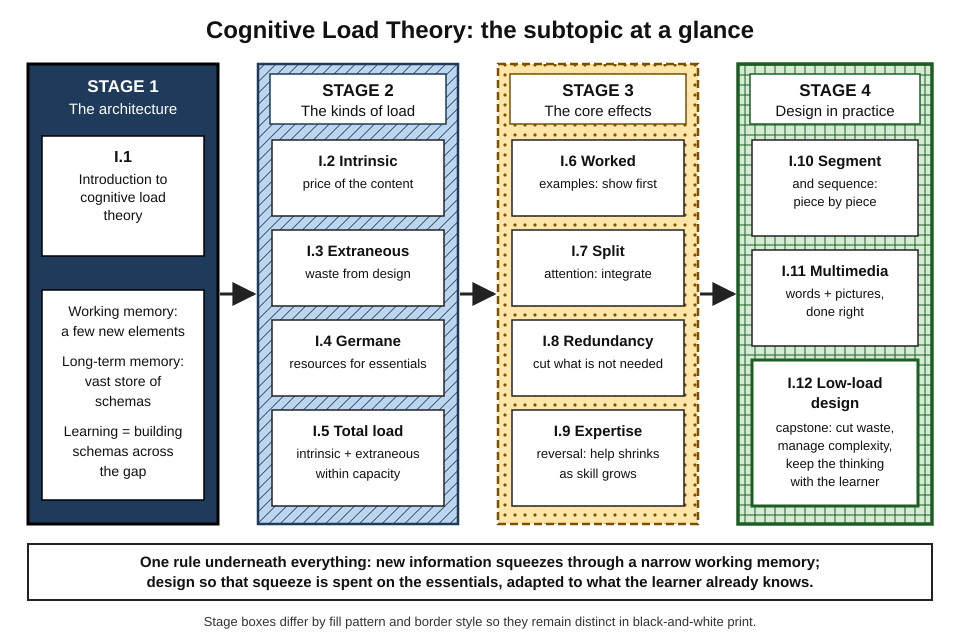
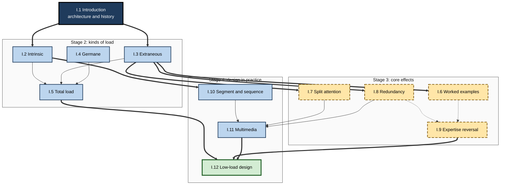
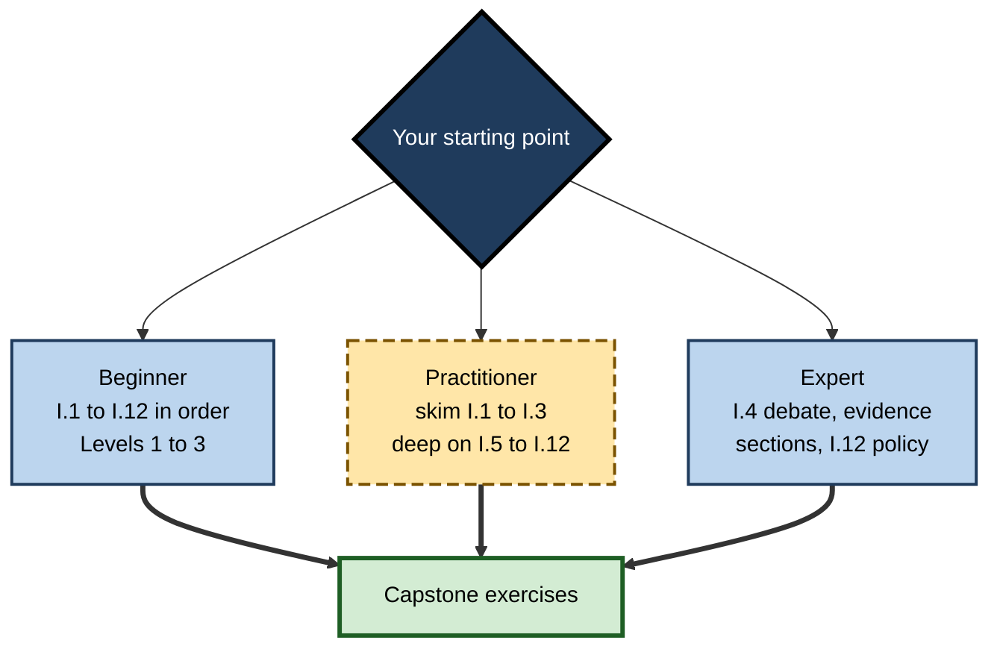

# I. Cognitive Load Theory

> **What this subtopic is about:** How the narrow capacity of working memory shapes learning, and how to design explanations, courses, documents, videos and AI-supported learning so that the limited capacity is spent on what matters.
>
> **Who it is for:** Anyone who learns or teaches complex material — students, new hires, managers, trainers, instructional designers, technical writers, engineering and product leaders · **Notes in this subtopic:** 12 · **Level span:** Novice → Expert

---

## Overview

Cognitive load theory (CLT) is one of the most practically useful theories in learning science. Developed by John Sweller and colleagues from the 1980s onward, it starts from a simple fact about the mind: **working memory can handle only a few new elements at once, while long-term memory is vast**. Learning means building organised knowledge — schemas — in long-term memory, and every new element on its way there must squeeze through working memory.

From that starting point the theory explains why some material is inherently hard (intrinsic load), why poor presentation wastes capacity (extraneous load), and how the capacity left over must be directed at the essentials (germane resources). It then predicts a set of replicated **instructional effects**: worked examples beat unguided problem solving for novices; integrated formats beat split sources; unneeded information hurts; and support that helps novices can hinder experts.

This subtopic also reflects where the field stands in 2026. Germane load is no longer treated as a third additive load: current CLT describes total load as intrinsic plus extraneous, with germane referring to the resources a learner devotes to intrinsic content. Element interactivity has become the unifying mechanism. Large meta-analyses published in 2018 to 2025 have quantified the main effects. And generative AI has introduced a new design risk: tools that lower felt load by doing the essential thinking for the learner.

*Figure I-1 — Cognitive load theory: the subtopic at a glance.* Four stages from left to right, each a distinct pattern and border style: architecture, kinds of load, core effects and design in practice. The bar at the bottom states the rule that connects them.

---

## Why It Matters

- **Training time is expensive.** Overloaded learners spend hours and retain little; experts forced through novice material waste time and disengage.
- **Most professional content is badly loaded.** Dense slides read aloud, diagrams with distant legends, long unsegmented videos and "figure it out" onboarding are everyday sources of avoidable load.
- **The fixes are cheap.** Integrating labels, adding worked examples, segmenting and routing by expertise cost little and have medium-sized, well-replicated effects.
- **AI changes the stakes.** Tools that remove waste help; tools that remove essential processing raise practice performance while lowering real capability.
- **The ideas travel beyond training.** Documentation, dashboards, interfaces, meetings and even team structures carry cognitive load; the same lens improves them.

---

## What You Will Learn

| # | Note | Core question it answers | Primary level |
|---|---|---|---|
| I.1 | Introduction to Cognitive Load Theory | What is CLT, what architecture is it based on, and how strong is its evidence? | Novice → Advanced |
| I.2 | Intrinsic Cognitive Load | Why are some things inherently hard, and how do we stage that difficulty? | Foundations |
| I.3 | Extraneous Cognitive Load | What mental effort is wasted by design, and how do we remove it? | Practitioner |
| I.4 | Germane Cognitive Load | What turns effort into learning, and why was the concept redefined? | Advanced |
| I.5 | Managing Total Cognitive Load | How do we keep total load in a productive band for each learner? | Practitioner |
| I.6 | Worked Examples Effect | Why does studying solved examples beat unguided problem solving for novices? | Practitioner |
| I.7 | Split-Attention Effect | Why should mutually referring information be integrated? | Practitioner |
| I.8 | Redundancy Effect in Instruction | When does adding information hurt, and when does overlap help? | Practitioner |
| I.9 | Expertise Reversal Effect | Why does support that helps novices hinder experts? | Advanced |
| I.10 | Segmenting and Sequencing Content | How should content be cut and ordered? | Practitioner |
| I.11 | Multimedia Learning Principles | How should words and pictures be combined? | Practitioner |
| I.12 | Designing Low-Load Learning Experiences | How do all the principles combine into a design process? | Expert / Pro |

---

## Concept Map

**Figure I-2 — How the twelve notes relate.**

*How to read it:* thick arrows are the main dependencies; dotted arrows show that expertise reversal grows out of the worked-example and redundancy effects; everything flows into I.12.

---

## Recommended Learning Path

1. **Start with I.1** — the architecture and vocabulary everything else uses.
2. **Read I.2 and I.3 together** — the two loads that add up, and the difference between content and waste.
3. **Read I.4** — the modern view of germane load; skim Level 4 on a first pass if you are new.
4. **Read I.5** — putting the load budget together.
5. **Work through I.6 to I.8** — the three most practical effects; apply each to one piece of your own material.
6. **Read I.9** — the rule that tempers all the others.
7. **Read I.10 and I.11** — cutting, ordering and combining media.
8. **Finish with I.12** — the integrated design process and capstone.

A **beginner** should follow the path in order and stop at Level 3 of each note on a first pass. A **practising designer or trainer** can skim Levels 1 to 2 and focus on Levels 3 to 5, especially I.4, I.9 and I.12. An **expert** can read I.4 (germane debate), the evidence sections of I.6 to I.11, and I.12's AI policy.

**Figure I-3 — Paths by experience level.**

*How to read it:* choose one route by experience; all routes end in the capstone exercises.

---

## The Big Ideas in Brief

**I.1 Introduction to Cognitive Load Theory.** Working memory holds only about three to five new elements, briefly; long-term memory stores schemas without known limit. CLT is a set of replicated instructional effects built on this architecture. It is well supported but has faced criticism over circular explanations and measurement, which drove its recent revisions.

**I.2 Intrinsic Cognitive Load.** Difficulty comes from element interactivity — how many elements must be understood together — relative to what the learner already knows. It cannot be designed away but can be staged through pre-training, isolated-then-interacting elements, and simple-to-complex task sequences.

**I.3 Extraneous Cognitive Load.** Waste from presentation and procedure: unguided search, split sources, redundancy, transient information, seductive details, poor signalling, interface friction and interruptions. It is the load designers control most, and it matters most when content is complex.

**I.4 Germane Cognitive Load.** Originally a third additive load; now, following Sweller (2010), Kalyuga (2011) and the 2019 "20 years later" review, usually defined as the working memory resources devoted to intrinsic content. Total load is intrinsic plus extraneous. The debate continues over measurement, cost-benefit framing and the role of motivation; low load with AI tools can signal skipped processing.

**I.5 Managing Total Cognitive Load.** Keep total load within capacity and in a productive band using five levers: content, design, learner, time and team. Read effort ratings together with performance. Collaboration helps for complex tasks; fatigue and stress shrink capacity.

**I.6 Worked Examples Effect.** Novices learn more from studying solved examples than from unguided problem solving; a 2023 mathematics meta-analysis found a medium average effect. Fade support through completion problems; productive failure is a compatible, conceptually focused alternative when followed by instruction.

**I.7 Split-Attention Effect.** When sources need each other, integrate them in space and time; a 2018 meta-analysis found a medium benefit. If a source is understandable alone, the issue is redundancy instead.

**I.8 Redundancy Effect in Instruction.** Unneeded or duplicated information costs attention. A 2023 review separated content redundancy (often helpful, depending on prior knowledge) from channel redundancy (written text with visuals tends to hurt), refining the classic rule. Accessibility layers should be available and user-controlled.

**I.9 Expertise Reversal Effect.** Support that helps novices can hinder experts. A 2025 meta-analysis of 60 studies confirmed the effect and found it asymmetric: helping novices matters more than withholding help from experts. Diagnose quickly, route and fade.

**I.10 Segmenting and Sequencing Content.** Cut at meaning boundaries, let learners control pace, pre-train components, and order whole tasks from simple to complex. A 2019 meta-analysis found small-to-medium segmenting benefits, unexpectedly larger for more knowledgeable learners on retention.

**I.11 Multimedia Learning Principles.** Mayer's theory and 15 principles: reduce extraneous, manage essential, foster generative processing. A 2022 meta-meta-analysis supports most principles, each with boundary conditions. VR, avatars and AI media must follow the same rules.

**I.12 Designing Low-Load Learning Experiences.** An eight-step process: define performance, analyse, sequence, support and fade, design media, add thinking, pilot, evaluate durably. Low-load means no waste, not no effort; AI should remove friction, never the essential thinking.

---

## Novice-to-Pro Progression

| Level | What competence looks like here |
|---|---|
| NOVICE | Recognises overload, split sources and redundancy in everyday materials; explains why "too much at once" fails. |
| FOUNDATIONS | Uses the vocabulary correctly: intrinsic, extraneous, germane resources, element interactivity, schema; knows the current two-load model. |
| PRACTITIONER | Audits and redesigns a lesson, deck or video: integrates sources, adds worked examples with fading, segments, removes redundancy. |
| ADVANCED | Interprets meta-analytic evidence and boundary conditions; explains the germane debate and expertise reversal; measures effort with performance. |
| EXPERT / PRO | Builds design standards, adaptive paths and AI-use policies at programme scale; evaluates with delayed, unaided performance and on-the-job transfer. |

---

## Where This Shows Up at Work

- **Onboarding.** Load maps for the first weeks; pre-training; worked examples of real tasks; routing experienced hires past basics.
- **Corporate L&D and compliance.** Segmented, scenario-based modules with integrated visuals instead of text-heavy screens.
- **Software engineering.** Annotated reference changes and incident write-ups as worked examples; documentation with code and explanation together; internal platforms that remove extraneous load from product teams; team boundaries sized to what a team can hold in mind.
- **Data and analytics.** Directly labelled charts and annotated dashboards; commented notebooks as worked examples.
- **Consulting and sales.** Annotated past deliverables and recorded calls; diagnostic-based paths for mixed-experience cohorts.
- **Healthcare and safety-critical work.** Modelling examples, at-the-point-of-use checklists, segmented system training.
- **Product and AI design.** In-context explanations; AI tutors that hint before answering and fade support; separating performance mode from learning mode.

---

## Capstone Exercises

1. **Audit and redesign.** Take a slide deck or e-learning module you own. Run an extraneous-load audit (I.3), integrate split sources (I.7), cut redundancy (I.8), and segment it (I.10). Record what you changed and why.
2. **Build a fading sequence.** For one skill you teach, write two worked examples with varied surfaces, two completion problems and one independent task (I.6). Define your fading rule.
3. **Diagnose and route.** Design a three-item first-step diagnostic for a mixed audience and two learning paths (I.9). Explain what each path removes or adds.
4. **Explain the germane debate.** In one page, explain to a colleague why "increasing germane load" is outdated language and what to say instead (I.4).
5. **Design an AI policy.** Write a five-rule policy for AI tutor use in one of your programmes, separating removal of extraneous work from essential processing (I.12).
6. **Evaluate durably.** Plan a comparison of an old and redesigned module using delayed, unaided performance and effort ratings (I.5, I.12).

---

## Key Takeaways

- **Working memory is narrow for new information**; design must respect that limit.
- **Total load = intrinsic + extraneous**; germane refers to the resources devoted to intrinsic content, not a third load.
- **Cut waste first**: integrate sources, remove redundancy, show worked examples, signal structure.
- **Stage complexity**: pre-train, segment, sequence simple to complex.
- **Adapt to expertise**: support that helps novices can hinder experts — diagnose, route and fade.
- **Low-load means no waste, not no effort**; keep the essential thinking with the learner, especially when AI is in the loop.
- Judge designs by **delayed, unaided performance**, not by how easy they felt.
