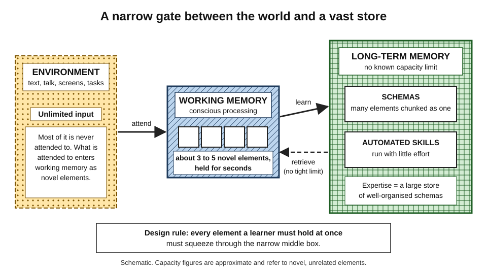
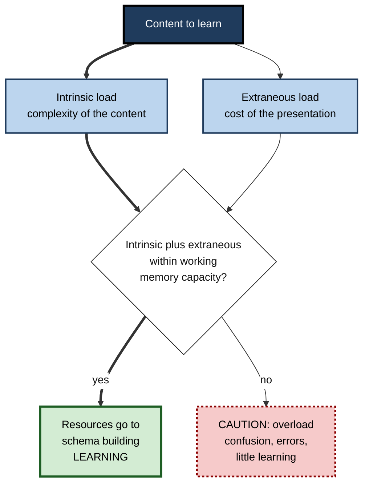
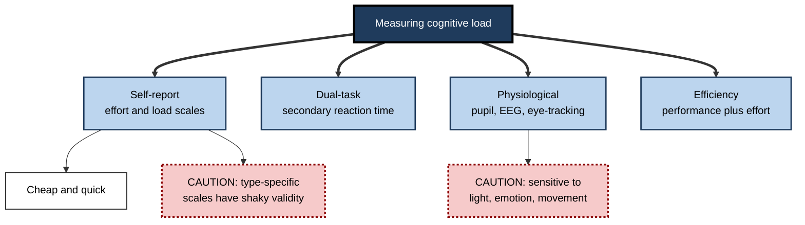

# I.1. Introduction to Cognitive Load Theory

> **In one sentence:** Cognitive load theory explains that your mind can only juggle a few new things at once, so good teaching arranges information so that none of that small juggling space is wasted.
>
> **Why it matters:** Almost every training session, onboarding programme, slide deck, tutorial and dashboard either respects or ignores this limit. Professionals who understand it design explanations that people actually absorb, and they stop blaming learners for failures that were caused by the material.
>
> **Level span:** Novice → Expert · **Reading time:** ~18 min · **Builds on:** basic ideas of working memory and long-term memory

---

## The Learning Ladder

| Level | Badge | After this level you can... |
|---|---|---|
| 1 | NOVICE | Explain in plain words why "too much at once" stops people learning. |
| 2 | FOUNDATIONS | Describe the cognitive architecture behind the theory and name the types of cognitive load. |
| 3 | PRACTITIONER | Spot overload in a real lesson or document and apply a first-pass fix. |
| 4 | ADVANCED | Explain the theory's history, its evidence base, how load is measured and the main criticisms. |
| 5 | EXPERT / PRO | Use the theory to design and evaluate training, documentation and AI-assisted learning at scale. |

---

## Level 1 · Novice — The Big Picture

Imagine carrying groceries from the car with only two hands. If the bags are packed sensibly, you get everything inside in one trip. If someone hands you loose apples, a carton of eggs and a bag of flour, you drop things, even though the total weight is the same. Your hands did not get weaker; the *packaging* failed you.

Your mind works in a similar way. When you meet something new, you can only hold and work with a handful of pieces at once. **Cognitive load** is the amount of mental work your mind is being asked to do at a given moment. **Cognitive load theory (CLT)** is a scientific theory, developed by educational psychologist John Sweller and colleagues from the 1980s onward, that explains how this limit affects learning and how to design teaching around it.

You have already experienced overload when:

- someone gave you directions with seven turns while you were driving in an unfamiliar city;
- a colleague explained a new tool while you were also trying to read the screen, follow the slides and take notes;
- you opened a spreadsheet with forty columns and had no idea where to look first.

In each case the information was not impossible. There was just too much *new* material arriving at once, in a shape that made you hold it all in your head.

The beginner's version of the theory fits in three sentences:

1. Your mind has a tiny "workbench" for new information.
2. Learning means building organised knowledge in a huge "warehouse" behind the workbench.
3. Good instruction keeps the workbench clear of clutter so that the real work of building knowledge can happen.

---

## Level 2 · Foundations — Core Concepts

### The cognitive architecture behind the theory

CLT rests on a model of **human cognitive architecture**, meaning the way the main parts of the mind are organised and interact.

- **Working memory** is the part of the mind where conscious thinking happens. For *new* information it is severely limited: modern estimates put it at about three to five meaningful elements at a time, held for only a few seconds unless rehearsed.
- **Long-term memory** is the vast store of everything you know. It has no known capacity limit.
- A **schema** is an organised unit of knowledge in long-term memory that groups many elements into one. An experienced driver holds "merge onto a motorway" as a single schema; a learner driver must juggle mirrors, speed, indicator and gap as separate elements.
- **Automation** is what happens when a schema is practised until it runs with little conscious effort, freeing working memory for other things.

The crucial asymmetry: working memory is tightly limited for *novel* information, but it can handle huge amounts of *organised* information retrieved from long-term memory. That asymmetry is why experts and novices experience the same task so differently.

*Figure I.1-1 — The cognitive architecture assumed by cognitive load theory.* New information must pass through a narrow working memory; organised schemas retrieved from long-term memory flow back without the same tight limit. Solid arrows show learning; the dashed arrow shows retrieval.

### Primary and secondary knowledge

CLT borrows a distinction from evolutionary educational psychologist David Geary. **Biologically primary knowledge** is what humans evolved to acquire without being taught, such as speaking a first language, recognising faces or basic social reasoning. **Biologically secondary knowledge** is cultural knowledge that must be deliberately taught, such as reading, algebra, accounting rules or a programming language. CLT is a theory about secondary knowledge — exactly the kind that careers depend on.

### Types of cognitive load

| Type | Plain meaning | Can a designer change it? |
|---|---|---|
| **Intrinsic load** | The mental effort the content itself demands, because of how many elements must be understood together. | Only by changing the task, the order, or the learner's prior knowledge. |
| **Extraneous load** | Mental effort wasted on the way information is presented, not on the content. | Yes — this is the main target of good design. |
| **Germane load** (contested term) | Effort devoted to actually building schemas. Recent versions of the theory no longer treat it as a separate, additive load. | Indirectly, by freeing and directing working memory. |

Each type has its own note in this subtopic; here you only need the shape: **intrinsic** is the price of the content, **extraneous** is waste, and **germane** is the part of your effort that turns into learning.

**Figure I.1-2 — How CLT explains success or failure of a lesson.**

*How to read it:* the thick path is a successful lesson; if the two loads together exceed capacity, the dotted-border outcome follows.

### Key terms

| Term | Plain meaning |
|---|---|
| **Element** | Any unit that must be processed: a word, a symbol, a step, a rule. What counts as one element depends on the learner's existing knowledge. |
| **Element interactivity** | How many elements must be held and related to each other at the same time to understand something. |
| **Schema** | An organised chunk of knowledge in long-term memory. |
| **Cognitive load** | The demand a task places on working memory. |
| **Instructional design** | The deliberate planning of learning materials and activities. |

---

## Level 3 · Practitioner — Putting It to Work

### The five-question overload scan

Use these questions on any lesson, slide, document, video or onboarding plan before you deliver it.

1. **What is genuinely new for this audience?** List the new terms, rules and steps. If the list for one sitting is long, intrinsic load is high.
2. **How many of those must be held together?** A glossary of ten independent terms is easier than a process where ten steps depend on each other.
3. **What is the learner forced to do that is not the content?** Hunting between a diagram and a separate legend, reading text while the presenter says different words, decoding jargon, navigating a clumsy interface. Each is extraneous load.
4. **Is there an example before the exercise?** Novices facing an unfamiliar problem with no example spend their capacity on trial-and-error search.
5. **Who is the audience?** Something essential for a beginner may be clutter for an expert.

### Worked example — onboarding to an internal data platform

| | Before | After |
|---|---|---|
| **Format** | One 90-minute live demo covering ingestion, transformation, scheduling, permissions and monitoring. | Five short sessions, one concept each, in a deliberate order. |
| **Slides** | Architecture diagram on one slide; component descriptions on the next three. | Each component label sits directly on the diagram. |
| **Practice** | "Now build your own pipeline" with a blank editor. | A complete, annotated sample pipeline; then one with the last step missing; then a blank editor. |
| **Narration** | Presenter reads bullet points aloud. | Presenter talks over the diagram; slides carry only labels. |
| **Result** | Participants rate it "very thorough" and still ask seniors for help on day one. | Participants build a working pipeline alone by the end of week one. |

Every change in the right-hand column is a named CLT effect you will meet later in this subtopic: segmenting, split attention, worked examples with fading, and redundancy.

### Common mistakes at this level

- **Treating "more content" as "better training".** More content per minute usually means less learning per minute.
- **Assuming difficulty is the learner's fault.** Often the design forces learners to hold elements that the design could have held for them.
- **Applying one design to every audience.** The right amount of support depends on prior knowledge.
- **Confusing "low load" with "easy and passive".** The goal is to remove *waste*, not to remove thinking.

---

## Level 4 · Advanced — Mechanisms, Models & Evidence

### A short history

CLT began with Sweller's work in the 1980s on problem solving. He found that novices solving unfamiliar problems often use **means–ends analysis** — repeatedly comparing the current state with the goal and searching for a move that reduces the difference. This strategy can solve the problem, yet it ties up working memory so completely that little is left for noticing the underlying pattern. People could solve many problems and still not learn how. The worked-example studies with algebra that followed made the point practical: studying solved examples often beat solving equivalent problems.

Through the 1990s the research group in Australia, together with Fred Paas and Jeroen van Merriënboer in the Netherlands, identified a series of **cognitive load effects**: reproducible experimental findings in which one instructional format beats another for reasons the theory predicts. A landmark 1998 synthesis set out the architecture and the three-load framework. In 2010, element interactivity was proposed as the single mechanism behind all load types. A 2019 update ("20 years later") reworked the role of germane load and added newer effects.

### The theory as a set of effects

| Effect | One-line summary |
|---|---|
| Worked example | Studying solved examples beats unguided problem solving for novices. |
| Completion problem | Partly worked problems bridge examples and full problems. |
| Split attention | Physically or temporally separated sources that must be combined increase load. |
| Modality | Spoken words with a diagram can beat written words with a diagram, under conditions. |
| Redundancy | Adding unnecessary or duplicate information can hurt learning. |
| Expertise reversal | Support that helps novices can hinder experts. |
| Guidance fading | Gradually removing support as expertise grows works better than abrupt removal. |
| Element interactivity | Most CLT effects appear only when the content is high in element interactivity. |
| Transient information | Information that disappears, such as speech or animation, can overload memory if long and complex. |
| Working memory depletion | Sustained effort temporarily reduces working memory capacity; rest helps it recover, which offers one explanation of the spacing effect. |

### How cognitive load is measured

There is no direct meter for cognitive load, so researchers triangulate.

- **Subjective ratings.** The most widely used is a single 9-point mental-effort scale introduced by Fred Paas in 1992. Multi-item questionnaires developed in 2013 (Leppink and colleagues) and 2017 (Klepsch, Schmitz and Seufert) attempt to separate the types of load.
- **Performance-based measures.** A secondary task, such as reacting to a tone, slows when the main task consumes more capacity.
- **Physiological measures.** Pupil dilation, eye-tracking, heart-rate variability, EEG and functional near-infrared spectroscopy. These are sensitive but noisy and costly.
- **Instructional efficiency.** A combination of test performance and rated effort, so that equal scores achieved with less effort count as more efficient.

**Figure I.1-3 — The main families of cognitive load measures.**

*How to read it:* the four boxes in the second row are the measure families; dotted-border boxes flag their main weaknesses.

### Strength of evidence and open criticisms

The core instructional effects — worked examples, split attention, expertise reversal, segmenting and several multimedia effects — are supported by many randomised experiments and by meta-analyses, with typical effects in the small-to-medium range. That makes CLT one of the most practically useful theories in educational psychology.

The theory has also drawn serious criticism, most prominently from Ton de Jong in 2010:

- **Circularity risk.** In older versions, if a design helped, researchers could call the load "germane"; if it hurt, "extraneous". Without independent measurement, such explanations could not be falsified. This criticism is a major reason germane load was reconceptualised.
- **Measurement.** Self-reports of different load types do not always separate cleanly, and single effort ratings are taken after the task, not during it.
- **Narrow scope.** Classic CLT focused on well-structured domains such as mathematics, science and programming, and on short laboratory tasks. Evidence for long, ill-structured, collaborative or motivational settings is thinner.
- **Neglect of emotion and motivation.** Recent work (from about 2020 onward) increasingly models how affect, anxiety and willingness to invest effort interact with load.

### What changed recently

Research output on CLT grew rapidly between 2021 and 2025, much of it concerning digital and AI-supported learning. Three developments stand out. First, element interactivity has become the central explanatory concept, with recent papers proposing ways to count it. Second, germane load is now usually described as working memory *resources* devoted to intrinsic load, not a third additive load. Third, generative AI has exposed a new risk: tools can lower felt load by doing the essential thinking for the learner, which looks efficient and produces little learning.

---

## Level 5 · Expert / Pro — Professional Mastery

### How professionals use CLT

- **Learning and development (L&D) teams** use it to justify shorter, sequenced modules, worked examples before practice, clean slide design and adaptive paths for experienced staff.
- **Technical writers and developer-experience teams** apply it to documentation: integrate code with its explanation, introduce one concept per page, and provide runnable examples before reference material.
- **Product and UX designers** borrow the same ideas to reduce the mental work of using software, though their goal is task performance rather than learning.
- **Engineering leaders** use a looser version: the Team Topologies approach treats a team's cognitive load as a sizing constraint, arguing that a team should own only as much software as it can hold in mind, and that internal platforms exist to remove extraneous load from product teams.

That last use is an analogy rather than a direct application of the experimental research, and a pro is explicit about the difference.

### Professional scenario

**Role:** Head of enablement at a software company.
**Situation:** Sales engineers must learn a new product line in two weeks. The existing programme is eight hours of recorded webinars with dense slides. Quiz scores are high immediately after; three weeks later, demos are shaky.
**What the pro does:** Audits the programme with the five-question scan; splits the webinars into short segments, each with one concept; replaces slide text with labelled diagrams and voice-over; adds three annotated demo scripts that fade into a blank one; offers a "fast lane" for engineers who pass a short diagnostic, skipping the basics. Success is measured by a recorded, unaided demo two weeks after training, not by the end-of-module quiz.

### Expert-level judgement

- **Ask "load for whom?"** Load is a property of the task *and* the learner. The same page is overloading for a beginner and padding for a veteran.
- **Separate learning design from performance design.** A user interface should minimise effort; a lesson should minimise *wasted* effort while keeping the essential thinking with the learner.
- **Respect the boundary conditions.** Most CLT effects shrink or vanish when the content is simple; they matter most for complex, highly interactive material.
- **Use AI to reduce extraneous load, not intrinsic processing.** Let assistants format, summarise logistics or translate jargon; keep problem solving, explanation and judgement with the learner.

---

## Myths vs. Evidence

| Myth | What the evidence shows |
|---|---|
| "CLT says learning should be as easy as possible." | CLT says to remove *wasted* effort. Effort on the essential content is how schemas form. |
| "Working memory holds seven items." | The older "seven plus or minus two" figure is now usually revised to about three to five meaningful chunks for novel information. |
| "There are three additive types of load: intrinsic, extraneous and germane." | Current versions treat total load as intrinsic plus extraneous; germane refers to resources devoted to intrinsic load. |
| "CLT only applies to schoolchildren." | Many studies involve adults, university students, medical trainees and professionals; the architecture is the same. |
| "If people rate a course as easy, the load was right." | Low felt load can also mean the learner skipped the essential thinking, for example by letting an AI do it. |
| "CLT is just common sense." | Several CLT findings are counter-intuitive, such as adding helpful text harming learning, or support that helps novices hurting experts. |

## Practitioner Toolkit

**Overload scan checklist**

- [ ] I listed the new elements for this audience and session.
- [ ] I checked which elements must be held together.
- [ ] I removed anything learners must hunt for, cross-reference or decode.
- [ ] I put a worked example before the first independent task.
- [ ] I checked whether experienced learners can skip the basic support.
- [ ] I planned a delayed, unaided check of learning, not only a rating.

**Template — one-page load audit**

| Section of material | New elements | Must be held together? | Extraneous costs found | Fix |
|---|---|---|---|---|
| | | | | |

## Self-Check

1. **[NOVICE]** In everyday words, what is cognitive load?
2. **[NOVICE]** Why can the same explanation feel easy to an expert and overwhelming to a beginner?
3. **[FOUNDATIONS]** What are working memory, long-term memory and a schema?
4. **[FOUNDATIONS]** Which type of load is the main target of instructional design, and why?
5. **[PRACTITIONER]** Name three things in a training session that add extraneous load.
6. **[ADVANCED]** Why did critics call older versions of CLT circular?
7. **[ADVANCED]** Name two ways of measuring cognitive load and one weakness of each.
8. **[EXPERT / PRO]** How would you use AI tools in a course so that they reduce load without removing learning?

### Answer Key

1. The amount of mental work your mind is being asked to do at a given moment, especially when handling new information.
2. The expert retrieves organised schemas that act as single units; the beginner must hold many separate new elements in a limited working memory.
3. Working memory is the limited space for conscious processing; long-term memory is the vast store of knowledge; a schema is an organised chunk of knowledge that groups many elements into one.
4. Extraneous load, because it comes from the presentation, which the designer controls, and contributes nothing to learning.
5. Examples: a diagram with its explanation on a separate slide; reading bullet points aloud; undefined jargon; a confusing learning platform; unrelated decorative animations.
6. Because outcomes were explained after the fact by labelling load "germane" when learning improved and "extraneous" when it did not, without independent measurement.
7. Self-report scales (cheap, but type-specific versions have shaky validity); physiological measures (sensitive, but affected by light, emotion and movement); dual-task measures (objective, but intrusive).
8. Use AI to handle formatting, logistics, jargon translation and hints, while keeping problem solving, explanation and judgement with the learner, and check learning without the tool.

## Key Takeaways

- Working memory is **narrow for new information** and long-term memory is **vast**; learning means building schemas across that gap.
- **Intrinsic load** is the price of the content; **extraneous load** is waste from the presentation.
- **Germane load** is now usually treated as resources devoted to intrinsic load, not a separate additive load.
- CLT is best understood as a set of **replicated instructional effects** with clear boundary conditions.
- Load depends on **both the task and the learner**: support that helps novices can hinder experts.
- Low felt load is not automatically good; **the goal is to remove waste, not thinking**.

## Glossary

| Term | Meaning |
|---|---|
| Automation | Practising a schema until it runs with little conscious effort. |
| Biologically primary knowledge | Knowledge humans evolved to acquire without instruction. |
| Biologically secondary knowledge | Cultural knowledge that must be explicitly taught. |
| Cognitive load | The demand a task places on working memory. |
| Cognitive load effect | A replicated finding in which one instructional format beats another for reasons CLT predicts. |
| Element interactivity | The number of elements that must be processed simultaneously to understand something. |
| Extraneous load | Load caused by how information is presented rather than by the content. |
| Germane load | Working memory resources devoted to dealing with intrinsic load and building schemas. |
| Intrinsic load | Load caused by the complexity of the content relative to the learner's knowledge. |
| Means–ends analysis | A problem-solving strategy of repeatedly reducing the difference between current state and goal. |
| Schema | An organised unit of knowledge in long-term memory. |
| Working memory | The limited system for holding and processing information consciously. |
