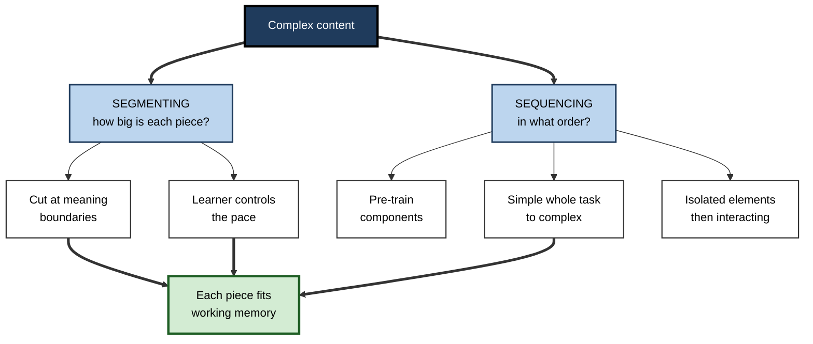
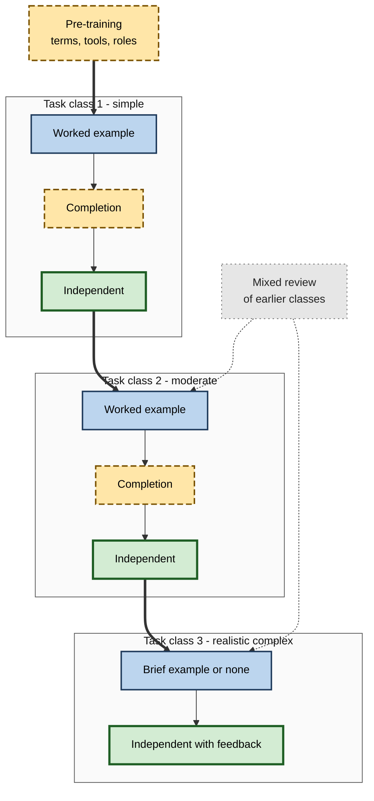

# I.10. Segmenting and Sequencing Content

> **In one sentence:** Segmenting means breaking complex material into meaningful, learner-paced chunks, and sequencing means putting those chunks — and the tasks that use them — in an order that lets each new piece build on what is already understood.
>
> **Why it matters:** Two courses with identical content can produce very different learning purely because of how the content is cut and ordered. For anyone who designs training, onboarding, documentation or video, segmenting and sequencing are among the highest-leverage, lowest-cost decisions available.
>
> **Level span:** Novice → Expert · **Reading time:** ~18 min · **Builds on:** intrinsic load, element interactivity, transient information

---

## The Learning Ladder

| Level | Badge | After this level you can... |
|---|---|---|
| 1 | NOVICE | Explain why "bite-sized" and "in the right order" both matter. |
| 2 | FOUNDATIONS | Define segmenting, pre-training, simple-to-complex sequencing and the transient information effect. |
| 3 | PRACTITIONER | Segment a video or lesson at meaningful boundaries and sequence tasks for a real skill. |
| 4 | ADVANCED | Interpret the segmenting meta-analysis, explain why segmenting works and where it fails, and compare whole-task and part-task approaches. |
| 5 | EXPERT / PRO | Design programme-level sequences, microlearning and spaced paths that respect cognitive load. |

---

## Level 1 · Novice — The Big Picture

Imagine someone tells you a ten-minute story about how to fix a leaking tap — every tool, every step, every warning — without pausing, and then asks you to do it. You would remember the beginning, maybe the end, and very little in between. Now imagine they show you one step, wait while you do it, then show the next. Same information; much better result.

That is **segmenting**: cutting a long, complex explanation into meaningful pieces that you can take at your own pace. Its partner is **sequencing**: putting the pieces in an order where each one makes sense because of the ones before it — names of tools before steps that use them; simple leaks before tricky ones.

You have already experienced both when:

- a recipe was written as numbered steps rather than one long paragraph;
- a video course had short chapters you could pause and replay;
- a good teacher started with an easy version of a problem before the full, messy one.

The key idea for a beginner: **cut where the meaning breaks, let people control the pace, and build from simple to complex.**

---

## Level 2 · Foundations — Core Concepts

### Segmenting

The **segmenting principle** states that people learn better when a complex, continuous presentation is broken into meaningful segments that learners can advance through at their own pace, rather than as one continuous unit. Two parts matter:

1. **Meaningful boundaries** — each segment covers a coherent step or idea;
2. **Learner pacing** — the learner decides when to continue, giving time to process before new information arrives.

### Why continuous presentations overload

The **transient information effect**, described by Wayne Leahy and John Sweller around 2011, explains much of the problem. Speech, animation and video are *transient*: information disappears as new information arrives. To understand the later part, learners must hold the earlier part in working memory. If the material is long and complex, that holding overloads memory. Static text and diagrams, by contrast, can be re-inspected at will.

### Sequencing

Sequencing decides the order of segments and tasks. Three well-supported patterns:

| Pattern | Idea | Example |
|---|---|---|
| **Pre-training** | Teach names and characteristics of key components before the full explanation. | Learn the parts of a car's braking system before watching how braking works. |
| **Simple-to-complex** | Start with simplified versions of the whole task, then add complexity. | Write a single-table query, then a join, then a multi-join with aggregation. |
| **Isolated then interacting** | Present elements separately before showing how they interact. | Learn each project-management role, then a meeting where they negotiate. |

**Figure I.10-1 — Segmenting and sequencing as two cuts through content.**

*How to read it:* segmenting and sequencing are two separate decisions; both aim at the same result at the bottom.

### Key terms

| Term | Plain meaning |
|---|---|
| **Segmenting** | Breaking a continuous presentation into meaningful, learner-paced parts. |
| **Learner pacing** | The learner, not the system, decides when to move on. |
| **Transient information** | Information that disappears as the presentation continues. |
| **Pre-training** | Teaching key component names and characteristics in advance. |
| **Simple-to-complex sequencing** | Ordering whole tasks from simpler to more complex versions. |
| **Task class** | A group of tasks of similar complexity used at one stage of training. |

---

## Level 3 · Practitioner — Putting It to Work

### Segmenting a video, lesson or document

1. **Write the steps or ideas** of the content as a list.
2. **Mark meaningful boundaries** — the end of a step, a decision point, a change of concept. Never cut mid-idea to hit a time target.
3. **Keep each segment to one main idea**, typically short enough to be held in mind (for videos, often a few minutes, but meaning matters more than duration).
4. **Add a pause control** — "Continue" buttons, chapter markers, or natural pauses in live delivery.
5. **Give each segment a title** that signals its content, so learners can navigate and review.
6. **Add a quick check** or action at the end of key segments.

### Sequencing a skill

1. **List the components** and decide which need pre-training (terms, tools, roles).
2. **Design a ladder of whole tasks** from simple to complex, each still realistic.
3. **Within each rung, fade support** from worked examples to independent practice.
4. **Revisit earlier material** later in the sequence, mixed with new content, to support retention.

**Figure I.10-2 — A sequenced path for one skill.**

*How to read it:* the thick path runs from pre-training through three task classes; support fades inside each class; dotted arrows add review of earlier material.

### Worked example — a 25-minute product demo video

**Before:** one continuous 25-minute screen recording with narration covering setup, configuration, reporting and troubleshooting. Completion data show most viewers drop off halfway; support tickets ask about steps covered in the video.

**After:**

1. A two-minute "meet the interface" pre-training segment naming the five main areas.
2. Eight segments, one task each, titled ("Connect a data source", "Build your first report"), with a pause at the end of each.
3. The order follows the user's real workflow, from simplest task to troubleshooting.
4. Each segment ends with a "try it now" prompt in a sandbox.
5. A one-page reference with the key steps for later lookup (reduces reliance on re-watching transient video).

### Common mistakes at this level

- **Segmenting by clock, not meaning.** Cutting at fixed intervals splits ideas in half.
- **Segments without learner pacing.** Auto-advancing segments recreate the continuous problem.
- **Over-fragmenting.** Too many tiny pieces lose the big picture and add navigation load; provide an overview and a final integrated task.
- **Sequencing by the expert's logic.** Experts often order content by system architecture; novices need the order of tasks they will perform.

---

## Level 4 · Advanced — Mechanisms, Models & Evidence

### The segmenting meta-analysis

A 2019 meta-analysis by Rey, Beege, Nebel, Wirzberger, Schmitt and Schneider in *Educational Psychology Review* combined 56 investigations with 88 comparisons. Findings:

- Segmenting produced **small to medium benefits** for both retention and transfer.
- When learners controlled the pacing, the effect on transfer was about d = 0.45 (30 comparisons).
- Segmenting **reduced overall cognitive load** and **increased learning time** — part of the benefit may simply be more time spent processing.
- Unexpectedly, learners with **higher prior knowledge benefited more** on retention than low-knowledge learners — a finding that complicates the simple "segmenting is for novices" story and is not fully explained.

The 2022 meta-meta-analysis by Noetel and colleagues also listed segmentation among principles with robust support.

### Why segmenting works — competing explanations

| Explanation | Idea |
|---|---|
| **Transient information** | Pauses stop new information overwriting what is still being processed. |
| **Event boundaries** | Cutting at meaningful boundaries helps learners structure the content into units. |
| **More time** | Learner-paced segments give more total processing time. |
| **Learner control** | Control over pace lets learners adapt to their own speed. |

These are complementary; studies rarely isolate them cleanly.

### Pre-training evidence

Mayer's research programme found that teaching names and characteristics of components before a complex explanation improves learning, especially for novices and for fast-paced or complex material. The mechanism is intrinsic load management: components become familiar elements before they must interact.

### Whole-task versus part-task

There is a long-standing tension:

- **Part-task** approaches teach components separately and combine later. Efficient for building fluent sub-skills, but learners can struggle to integrate parts.
- **Whole-task** approaches, such as the four-component instructional design (4C/ID) model of van Merriënboer, keep tasks whole but simplify them, moving through task classes from simple to complex. They are designed to support integration and transfer for complex professional skills.

Current practice often combines them: whole-task classes as the backbone, with **part-task practice** inserted for components that must become automatic.

### Sequencing and spacing

Sequencing interacts with memory research beyond CLT. Spreading practice of earlier material across later sessions (spacing) and mixing problem types (interleaving) improve retention. From a CLT perspective, rest between sessions may also allow recovery of working memory capacity (the working memory depletion account, which is newer and less established than the spacing effect itself). Interleaving should usually follow initial understanding; mixing types too early can overload novices.

### Microlearning — a caution

"Microlearning" is a popular industry label for very short learning units. It aligns with segmenting when units are meaningful and learner-paced. It conflicts with sequencing when units are disconnected fragments with no build-up, no integration and no complex whole tasks. Short is not automatically effective; structure is.

---

## Level 5 · Expert / Pro — Professional Mastery

### Programme-level sequencing

- **Map dependencies** between topics and order modules so that each draws on existing schemas.
- **Front-load pre-training** in a low-pressure format (short reading, glossary quiz) before intensive sessions.
- **Use task classes** for complex roles: graduated, realistic cases rather than a topic-by-topic syllabus.
- **Build in mixed review** of earlier material and periodic integrated tasks.
- **Provide maps.** A visible course map counters fragmentation and helps learners place each segment.

### Video and content production standards

- Segment at meaning boundaries; give every segment a descriptive title.
- Default to pause-able, learner-paced delivery; avoid auto-play chains for complex content.
- Provide a static reference companion to counter transience.
- Track where learners pause, rewind or drop out — these are load signals.

### AI-era implications

AI tools can **auto-segment** transcripts and **generate chapter titles**, saving production time. They usually cut on topic shifts, which may or may not match task boundaries, so review is needed. AI tutors can also manage sequencing adaptively, holding back complex tasks until simpler ones are mastered — but only if designed to do so; general-purpose chatbots will answer any question at any level, which can let learners skip the sequence entirely.

### Professional scenario

**Role:** Learning lead for a hospital's new electronic health record roll-out.
**Situation:** Clinicians receive a four-hour training session covering every module. After go-live, errors cluster in medication ordering, which was covered in hour three.
**What the pro does:** Creates a 15-minute pre-training module on screen layout and terminology; splits training into role-specific segments by real clinical workflow; sequences medication ordering from simple single orders to complex multi-drug orders with interactions; provides at-the-elbow quick reference cards; adds short refreshers at one and four weeks. Medication-ordering errors are tracked by cohort to evaluate the change.

---

## Myths vs. Evidence

| Myth | What the evidence shows |
|---|---|
| "Shorter is always better." | Segments must be meaningful and connected; fragmentation without structure can harm integration. |
| "Segmenting only helps beginners." | The 2019 meta-analysis found learners with higher prior knowledge benefited more on retention. |
| "A long video is fine if people can pause it." | Pausing helps, but meaningful segments with titles and checks help more. |
| "Teach parts first, always." | Whole-task approaches with simplified versions often support integration and transfer better for complex skills. |
| "Microlearning is a proven learning method." | It is a format, not a method; it works when segments are meaningful, sequenced and revisited. |

## Practitioner Toolkit

**Segmenting and sequencing checklist**

- [ ] Content listed as steps or ideas with dependencies.
- [ ] Segments cut at meaning boundaries, each with a descriptive title.
- [ ] Learner controls pace; no auto-advance for complex content.
- [ ] Pre-training covers component names and terms.
- [ ] Whole tasks ordered from simple to complex.
- [ ] Support fades within each stage.
- [ ] Earlier material revisited later in mixed practice.
- [ ] Static reference available for transient media.

**Template — segment plan**

| # | Segment title | One main idea | Prerequisite segments | End-of-segment check |
|---|---|---|---|---|
| | | | | |

## Self-Check

1. **[NOVICE]** Why is a step-by-step demonstration easier to follow than one long explanation?
2. **[FOUNDATIONS]** What are the two key features of effective segmenting?
3. **[FOUNDATIONS]** What is the transient information effect?
4. **[PRACTITIONER]** How would you decide where to cut a long video?
5. **[ADVANCED]** Summarise the 2019 segmenting meta-analysis, including one surprising finding.
6. **[ADVANCED]** Compare part-task and whole-task sequencing.
7. **[ADVANCED]** When does microlearning align with CLT, and when does it conflict?
8. **[EXPERT / PRO]** How would you use AI tools in segmenting and sequencing without losing quality?

### Answer Key

1. Each step can be processed before the next arrives, keeping working memory within capacity.
2. Meaningful boundaries and learner-controlled pacing.
3. Information that disappears (speech, animation, video) must be held in working memory to connect with later information; long, complex transient material overloads it.
4. At meaning boundaries — end of a step, decision point or concept change — not at fixed time intervals.
5. 56 investigations, 88 comparisons; small-to-medium benefits for retention and transfer; reduced load and increased learning time; learner-paced transfer effect about d = 0.45; higher prior knowledge learners benefited more on retention.
6. Part-task teaches components separately for fluency but risks poor integration; whole-task keeps tasks whole but simplified and progresses through task classes, supporting integration and transfer.
7. Aligns when units are meaningful, paced, sequenced and revisited; conflicts when units are disconnected fragments without integration.
8. Use AI to draft segments and titles and to adapt sequencing, but review boundaries against real tasks, and prevent tutors from letting learners skip the sequence.

## Key Takeaways

- **Segment at meaning boundaries** and let learners **control the pace**.
- Transient media overload memory when **long and complex**; segments and static references help.
- **Pre-train** component names; order tasks **simple to complex**.
- Segmenting has **small-to-medium, well-replicated benefits**, including for more knowledgeable learners.
- **Whole-task sequences** with part-task practice support complex professional skills.
- Short is not enough: **structure, integration and review** make segments work.

## Glossary

| Term | Meaning |
|---|---|
| 4C/ID model | A whole-task instructional design model using task classes of increasing complexity. |
| Event boundary | A natural break between meaningful units of activity or content. |
| Interleaving | Mixing different problem types in practice. |
| Learner pacing | Learner control over when to move to the next segment. |
| Microlearning | Very short learning units; a format rather than a method. |
| Part-task practice | Practising a component skill separately. |
| Pre-training | Teaching key components before a complex explanation. |
| Segmenting principle | Better learning from meaningful, learner-paced segments than continuous presentation. |
| Task class | A set of whole tasks of similar complexity. |
| Transient information effect | Learning loss when information disappears before it can be processed. |
