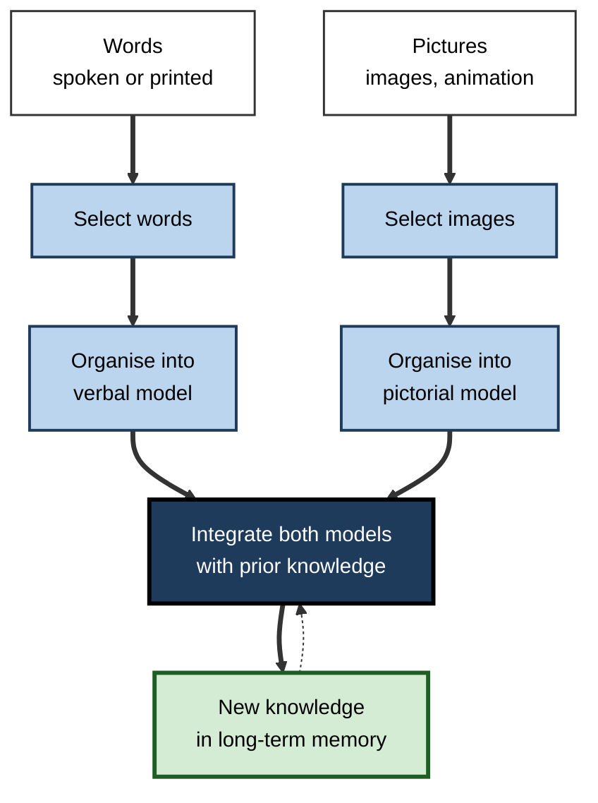
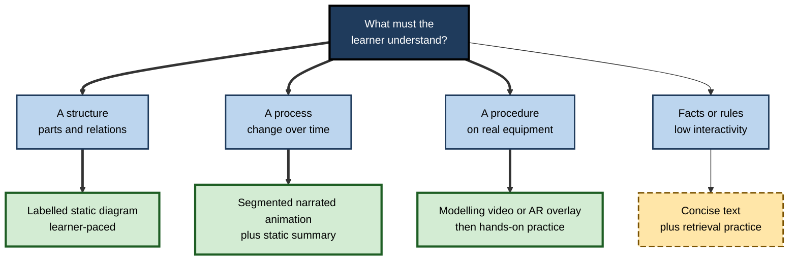

# I.11. Multimedia Learning Principles

> **In one sentence:** Multimedia learning principles are evidence-based rules for combining words and pictures — text, narration, images, animation, video — so that people understand and remember more.
>
> **Why it matters:** Almost all professional learning is now multimedia: slide decks, e-learning, explainer videos, recorded demos, webinars, AI-generated content. These principles are the closest thing the field has to an engineering standard for designing them.
>
> **Level span:** Novice → Expert · **Reading time:** ~19 min · **Builds on:** working memory, extraneous and intrinsic load, split attention, redundancy, segmenting

---

## The Learning Ladder

| Level | Badge | After this level you can... |
|---|---|---|
| 1 | NOVICE | Explain why words plus relevant pictures usually teach better than words alone. |
| 2 | FOUNDATIONS | Describe the cognitive theory of multimedia learning and its three kinds of processing. |
| 3 | PRACTITIONER | Apply the main principles to a slide deck, video or e-learning module. |
| 4 | ADVANCED | Judge the evidence for each principle, its boundary conditions and how it connects to cognitive load theory. |
| 5 | EXPERT / PRO | Set multimedia standards for teams and evaluate new formats such as VR, avatars and AI-generated media. |

---

## Level 1 · Novice — The Big Picture

Try explaining how a bicycle pump works using only words. Now try with a simple diagram and a few words. The second is much easier, because your listener can see the parts and hear how they move together. That is the basic insight behind **multimedia learning**: people learn more deeply from words and pictures together than from words alone.

But "add pictures" is not enough. A diagram with its labels in a separate box, a video with music blaring, slides crammed with text read aloud — these are multimedia too, and they can make learning worse. The **multimedia learning principles** are a set of research-based rules about which combinations of words and pictures help, and which hurt.

You have already met them when:

- a clear labelled diagram made a confusing process click;
- a narrated animation was easy to follow because the voice described exactly what was on screen;
- a "fun" video full of jokes and stock footage left you entertained but unable to remember the point.

The key idea for a beginner: **use relevant pictures with words, keep them together, and cut everything that does not help.**

---

## Level 2 · Foundations — Core Concepts

### The cognitive theory of multimedia learning

Richard Mayer developed the **cognitive theory of multimedia learning (CTML)** from the 1990s onward. It rests on three assumptions:

1. **Dual channels.** People have separate channels for processing visual/pictorial and auditory/verbal information (building on Paivio's dual coding and Baddeley's working memory model).
2. **Limited capacity.** Each channel can process only a small amount at once.
3. **Active processing.** Learning requires **selecting** relevant words and images, **organising** them into coherent mental models, and **integrating** them with each other and with prior knowledge.

### Three kinds of processing

| Kind | Meaning | Design goal |
|---|---|---|
| **Extraneous processing** | Processing that does not serve the learning goal, caused by poor design. | Reduce it. |
| **Essential processing** | Processing needed to represent the core material, driven by its complexity. | Manage it. |
| **Generative processing** | Deeper processing to make sense of the material, driven by motivation. | Foster it. |

These map closely onto cognitive load theory's extraneous load, intrinsic load and (in its current sense) germane processing. CLT and CTML developed in parallel, share many studies and are best treated as complementary.

**Figure I.11-1 — Mayer's model: from words and pictures to knowledge.**

*How to read it:* two channels run in parallel and meet at integration; the dotted arrow shows prior knowledge feeding back into integration.

### The principles in three groups

The third edition of Mayer's *Multimedia Learning* (2021) organises 15 principles by the kind of processing they target.

| Group | Principle | One-line rule |
|---|---|---|
| **Reduce extraneous processing** | Coherence | Exclude extraneous words, pictures and sounds. |
| | Signalling | Highlight the essential material and its organisation. |
| | Redundancy | Do not add printed text that duplicates narration over graphics. |
| | Spatial contiguity | Place words near the corresponding pictures. |
| | Temporal contiguity | Present corresponding words and pictures at the same time. |
| **Manage essential processing** | Segmenting | Present complex lessons in learner-paced segments. |
| | Pre-training | Teach names and characteristics of key concepts first. |
| | Modality | Present words as speech rather than printed text with graphics. |
| **Foster generative processing** | Multimedia | Use words and pictures rather than words alone. |
| | Personalisation | Use a conversational rather than formal style. |
| | Voice | Use a friendly human voice rather than a machine voice. |
| | Image | Adding the speaker's image does not necessarily improve learning. |
| | Embodiment | On-screen agents should use human-like gestures and movement. |
| | Immersion | Immersive virtual reality does not automatically improve learning. |
| | Generative activity | Prompt learners to summarise, map, draw, explain or enact. |

Image and immersion are framed as cautions: popular features that do not reliably help.

### Key terms

| Term | Plain meaning |
|---|---|
| **Multimedia** | Presenting both words and pictures. |
| **Dual channels** | Separate processing streams for visual and auditory-verbal information. |
| **Signalling** | Cues that highlight key information and structure. |
| **Seductive details** | Interesting but irrelevant material. |
| **Pedagogical agent** | An on-screen character that guides learning. |
| **Generative activity** | A learner task that requires making sense of the material. |

---

## Level 3 · Practitioner — Putting It to Work

### A seven-step multimedia review

1. **Is there a relevant visual for each key idea?** If the content is a process, structure or comparison, add a diagram (multimedia).
2. **Cut the extras.** Remove decorative images, background music, tangents and "fun facts" unrelated to the goal (coherence).
3. **Put words with pictures.** Labels on diagrams; narration in sync with what is on screen (contiguity).
4. **Choose the channel.** For short explanations of a visual, narrate rather than print (modality); keep printed text to labels and keywords (redundancy).
5. **Signal the structure.** Headings, numbered steps, highlighting the part being discussed, verbal signposts ("the second reason is...") (signalling).
6. **Chunk and prepare.** Segment complex sequences; pre-teach key terms (segmenting, pre-training).
7. **Engage the learner.** Conversational tone; a natural voice; at least one generative task such as "sketch the flow" or "explain to a colleague" (personalisation, voice, generative activity).

### Worked example — a compliance e-learning module on data handling

| Principle | Before | After |
|---|---|---|
| Multimedia | Six screens of text | A labelled data-flow diagram for each scenario |
| Coherence | Stock photos of padlocks and hackers; background music | Removed |
| Contiguity | Definitions in a glossary pop-up | Definitions placed at first use, beside the diagram |
| Modality and redundancy | Narration reads on-screen paragraphs | Narration explains; screen shows diagram with labels |
| Signalling | No visual emphasis | Each data step highlighted as it is discussed |
| Segmenting | One 20-minute sequence | Five scenario segments with "continue" control |
| Personalisation | "Employees shall ensure..." | "You will often need to..." |
| Generative activity | Multiple-choice quiz | "Mark where this data flow breaks policy" on a new diagram |

### Common mistakes at this level

- **Decorative visuals** that look professional but carry no information.
- **Reading slides aloud**, combining redundancy and split attention.
- **Talking-head video** where the speaker's face occupies the screen while the content is invisible.
- **Assuming new technology helps by itself** — VR, avatars and animations need the same principles.
- **Applying modality rigidly** to long or complex explanations, which then become transient and overloading.

---

## Level 4 · Advanced — Mechanisms, Models & Evidence

### The evidence base

- Mayer's third edition rests on more than 200 experimental comparisons across the principles.
- A 2022 overview of reviews with meta-meta-analysis by Noetel and colleagues in *Review of Educational Research* covered 29 reviews, about 1,189 studies and 78,000 participants. It found 11 design principles with significant positive meta-analytic effects on learning and five that improved management of cognitive load. Large benefits appeared for captioning second-language videos, spatial and temporal contiguity, and several other principles; signalling showed a reliable but small effect; coherence and modality had robust support.
- A 2018 meta-analysis found a medium effect (g about 0.63) for spatial contiguity; a 2019 meta-analysis found small-to-medium segmenting effects.
- Recent syntheses focus increasingly on **boundary conditions**: principles do not apply equally across media types, learner groups and content.

### Boundary conditions to know

| Principle | Key boundary condition |
|---|---|
| Multimedia | Benefits mainly lower-knowledge learners; pictures must be relevant. |
| Modality | Works for short, system-paced explanations; long or complex narration becomes transient. Learner-paced written text can match or beat narration. |
| Redundancy | Captions help second-language learners; short keywords can help. |
| Signalling | Small effects; stronger for complex or poorly structured material. |
| Coherence | Some interesting elements may raise motivation; the trade-off is contested. |
| Segmenting | Must be meaningful and learner-paced. |
| Personalisation | Effects can fade over long courses; overly casual tone can annoy. |
| Image | Showing the instructor's face can help social presence but often does not improve learning; it competes for visual attention. |

### Expertise reversal across principles

Most multimedia principles were tested with novices on short lessons. For experienced learners, many effects shrink or reverse: diagrams alone may beat integrated text, pre-training becomes unnecessary, and narration may be redundant. Professional audiences are often mixed, which makes layered and adaptive designs important.

### New media: what recent research shows

- **Immersive VR** often increases presence and enjoyment but does not automatically improve learning, and can add extraneous load through novelty and interface demands. Well-designed VR with integrated guidance and generative activities can help, especially for spatial and procedural skills.
- **Mixed and augmented reality** offer extreme spatial contiguity — instructions overlaid on the real object — and recent studies test exactly this principle in technical-skill training.
- **Pedagogical agents and avatars** help mainly when they gesture and direct attention meaningfully (embodiment); static or decorative agents do little.
- **Synthetic voices** were less effective than human voices in older studies; modern neural text-to-speech is far closer to human speech, and whether the voice effect still holds is an open question under active study.

**Figure I.11-2 — Choosing a multimedia format for a learning goal.**

*How to read it:* identify the kind of knowledge first; the format follows from it.

---

## Level 5 · Expert / Pro — Professional Mastery

### Team standards

- **Style guides** that encode principles: direct labelling, no decorative stock imagery, on-screen text limits during narration, segment length and titling rules.
- **Review checklists** used before release, alongside accessibility checks.
- **Production templates** for slides and videos that make good choices the default.
- **Evidence culture**: A/B tests or pilot comparisons with delayed performance measures for high-volume content.

### Presentations at work

For live presentations and webinars, the principles translate directly: one idea per slide; visuals carry structure; the speaker carries explanation; slide text is labels and key numbers; build complex diagrams progressively; pause between segments for questions or a short task.

### AI-generated media

Generative tools now produce slides, diagrams, narrated videos and avatar presenters in minutes. They also amplify classic mistakes: decorative images, dense bullet text, synthetic presenters filling the screen, and verbose narration duplicated on screen. Professionals use AI for speed and then apply the principles as an editing pass. AI-generated diagrams also require accuracy review; a beautiful wrong diagram does more harm than none.

### Professional scenario

**Role:** Head of customer education at a SaaS company.
**Situation:** The company plans to replace its tutorial library with AI-generated avatar videos to cut costs. A pilot shows high completion but no reduction in support tickets.
**What the pro does:** Reviews the pilot videos against the principles. Finds that the avatar occupies half the screen while the product UI is small, that narration is duplicated as full on-screen captions burned in, and that videos are single long takes. Redesigns the template: product UI full-screen with highlights, optional avatar in a small corner or removed, user-controlled captions, segments per task with chapter titles, and a "try it" prompt after each. Ticket reduction becomes the success measure, compared between the old and new templates.

---

## Myths vs. Evidence

| Myth | What the evidence shows |
|---|---|
| "People are visual or auditory learners, so match the medium to their style." | The learning-styles matching hypothesis is not supported; nearly everyone benefits from relevant words plus pictures. |
| "More media is more engaging, so better." | Irrelevant media adds extraneous processing; coherence is well supported. |
| "Showing the instructor's face improves learning." | It can improve social presence but often does not improve learning and competes for attention. |
| "VR is the future of all training." | Immersion increases presence, not automatically learning; it must follow the same principles. |
| "Narration is always better than text." | Modality holds mainly for short, system-paced explanations; long narration becomes transient. |

## Practitioner Toolkit

**Multimedia review checklist**

- [ ] Each key idea has a relevant visual.
- [ ] No decorative images, music or tangents.
- [ ] Words placed with and synchronised to pictures.
- [ ] On-screen text limited to labels and keywords during narration.
- [ ] Key structure signalled (headings, highlights, verbal signposts).
- [ ] Complex sequences segmented and learner-paced; key terms pre-taught.
- [ ] Conversational tone and natural voice.
- [ ] At least one generative activity.
- [ ] Captions and transcripts available and user-controlled.

**Template — principle audit grid**

| Screen or slide | Coherence | Contiguity | Redundancy | Signalling | Segment | Generative task | Fix |
|---|---|---|---|---|---|---|---|
| | | | | | | | |

## Self-Check

1. **[NOVICE]** Why do words plus relevant pictures usually teach better than words alone?
2. **[FOUNDATIONS]** Name the three assumptions of the cognitive theory of multimedia learning.
3. **[FOUNDATIONS]** What are extraneous, essential and generative processing?
4. **[PRACTITIONER]** List four principles for reducing extraneous processing.
5. **[PRACTITIONER]** How would you redesign a narrated slide deck that reads full paragraphs aloud?
6. **[ADVANCED]** What did the 2022 meta-meta-analysis conclude?
7. **[ADVANCED]** Give the main boundary condition of the modality principle.
8. **[EXPERT / PRO]** How would you govern AI-generated training videos?

### Answer Key

1. They use both the visual and verbal channels and let learners build connected verbal and pictorial models.
2. Dual channels, limited capacity, active processing.
3. Extraneous: caused by poor design, not serving the goal. Essential: needed to represent the core content. Generative: deeper sense-making, driven by motivation.
4. Coherence, signalling, redundancy, spatial contiguity, temporal contiguity (any four).
5. Replace paragraphs with labelled visuals, narrate the explanation, keep only keywords on screen, highlight the part being discussed, segment the deck.
6. Across 29 reviews (about 1,189 studies), 11 principles had significant positive effects on learning and 5 improved cognitive load management; contiguity and second-language captions were among the largest, signalling small but reliable.
7. It holds mainly for short, system-paced explanations; long or complex narration becomes transient and can overload.
8. Use a template encoding the principles, edit AI output for coherence and redundancy, review accuracy, keep the content (not the avatar) dominant, and evaluate with delayed or behavioural outcomes.

## Key Takeaways

- People learn better from **relevant words and pictures together**, processed through two limited channels.
- Design goals: **reduce extraneous, manage essential, foster generative** processing.
- Best-supported principles include **contiguity, coherence, segmenting, modality (with limits) and signalling**.
- Every principle has **boundary conditions**, especially learner expertise.
- New media — **VR, avatars, AI video** — must follow the same principles.
- Learning-styles matching is a **myth**; good multimedia design helps nearly everyone.

## Glossary

| Term | Meaning |
|---|---|
| Coherence principle | Exclude extraneous material. |
| Cognitive theory of multimedia learning | Mayer's theory of how people learn from words and pictures. |
| Dual channels | Separate visual and auditory-verbal processing streams. |
| Embodiment principle | On-screen agents should use human-like gestures. |
| Essential processing | Processing needed to represent core material. |
| Extraneous processing | Processing caused by poor design that does not serve the goal. |
| Generative processing | Deep sense-making processing. |
| Immersion principle | Immersive VR does not automatically improve learning. |
| Modality principle | Speech rather than printed text with graphics, under conditions. |
| Personalisation principle | Conversational style improves learning. |
| Signalling principle | Highlight essential material and organisation. |
| Temporal contiguity | Present corresponding words and pictures together in time. |
