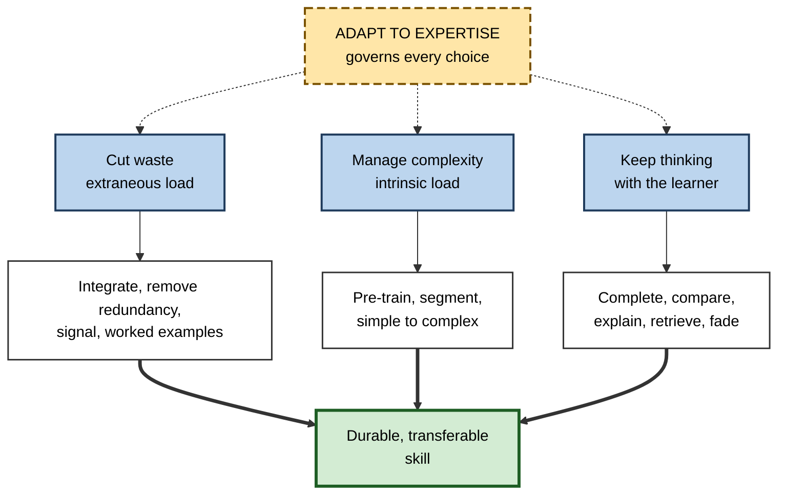
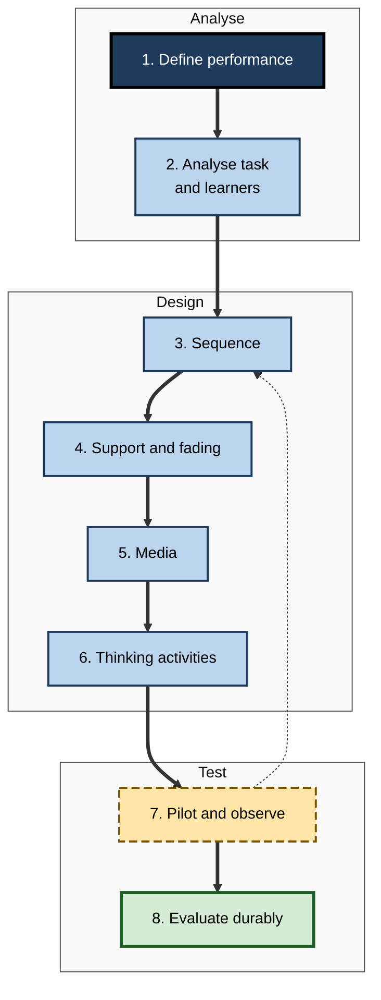

# I.12. Designing Low-Load Learning Experiences

> **In one sentence:** Designing a low-load learning experience means building lessons, courses and tools where learners spend almost none of their limited mental capacity on waste, and as much as they can handle on the thinking that actually builds skill.
>
> **Why it matters:** This is where every cognitive load principle comes together into a repeatable design process. It is the practical difference between training that produces capable people and training that produces completion certificates.
>
> **Level span:** Novice → Expert · **Reading time:** ~19 min · **Builds on:** all earlier ideas in cognitive load theory — load types, worked examples, split attention, redundancy, expertise reversal, segmenting and multimedia principles

---

## The Learning Ladder

| Level | Badge | After this level you can... |
|---|---|---|
| 1 | NOVICE | Explain what "low-load" means and why it is not the same as "easy". |
| 2 | FOUNDATIONS | Name the design moves that reduce waste, manage complexity and keep thinking with the learner. |
| 3 | PRACTITIONER | Run a complete low-load design process on a real lesson or module. |
| 4 | ADVANCED | Resolve tensions with desirable difficulties, motivation, accessibility and expertise, and evaluate designs with evidence. |
| 5 | EXPERT / PRO | Lead low-load design at programme and organisation scale, including AI-supported learning. |

---

## Level 1 · Novice — The Big Picture

Think about the best teacher, coach or senior colleague you have learned from. They probably did a few things consistently. They showed you how before asking you to try. They gave you one thing at a time. They put the explanation right where you needed it. They did not waste your time on things you already knew. And when you were ready, they stepped back and let you do it yourself.

That is, in plain words, a **low-load learning experience**. "Low-load" does not mean easy or effortless. It means **no wasted effort**: your mind is not busy fighting confusing materials, hunting for information or holding too much at once, so it can work hard on the real thing.

You have already experienced the difference:

- a well-designed app tutorial that walked you through your first task step by step, versus a manual you abandoned;
- a colleague who sat with you and solved one ticket together before you tried the next, versus being handed a wiki link;
- a course that let you skip what you knew, versus one that made you sit through everything.

The key idea for a beginner: **clear away the clutter, take it one step at a time, show before asking, and hand over control as the learner grows.**

---

## Level 2 · Foundations — Core Concepts

### The three design goals

Every cognitive load technique serves one of three goals:

| Goal | Load concept | Main techniques |
|---|---|---|
| **Cut waste** | Reduce extraneous load | Integrate sources, remove redundancy and seductive details, signal structure, provide worked examples instead of unguided search. |
| **Manage complexity** | Stage intrinsic load | Pre-train, segment, sequence simple-to-complex, isolate then integrate elements. |
| **Keep thinking with the learner** | Direct germane resources | Completion problems, self-explanation where suitable, comparison of examples, generative activities, fading, retrieval. |

Plus one rule that governs all three: **adapt to expertise** — what helps a novice may hinder an expert.

**Figure I.12-1 — The low-load design model.**

*How to read it:* three goals with their techniques lead to the outcome; the long-dashed governing box influences every goal (dotted arrows).

### Key terms

| Term | Plain meaning |
|---|---|
| **Low-load design** | Design that minimises wasted mental effort while preserving essential thinking. |
| **Learning objective** | A specific statement of what learners will be able to do. |
| **Task analysis** | Breaking a skill into its components and their relationships. |
| **Fading** | Gradually removing support as competence grows. |
| **Productive load** | Load spent on essential processing, within capacity. |
| **Pilot test** | A trial of a design with a small group of real learners before full release. |

---

## Level 3 · Practitioner — Putting It to Work

### The eight-step low-load design process

1. **Define the performance.** Write the objective as a task on the job: "Given a customer escalation, draft a resolution plan that meets policy within 30 minutes."
2. **Analyse the task and the learners.** List the elements and their dependencies; estimate element interactivity; run a short diagnostic to establish prior knowledge.
3. **Plan the sequence.** Pre-training for terms and components; task classes from simple to realistic; segments at meaning boundaries.
4. **Design the support.** For each task class: worked example, second varied example, completion problems, independent task. Decide fading criteria.
5. **Design the media.** Labelled visuals, integrated explanations, narration synced to visuals, no decoration, short segments, signalling.
6. **Add the thinking.** One generative or retrieval activity per segment; comparison prompts across examples; feedback on attempts.
7. **Pilot and observe.** Watch three to five real learners; log hesitation, errors, rewinds; collect effort ratings and a performance check.
8. **Evaluate durably.** Measure delayed, unaided performance on realistic tasks; for work skills, observe on-the-job behaviour.

**Figure I.12-2 — From objective to evaluated design.**

*How to read it:* follow the thick arrows; the dotted arrow is the redesign loop after piloting.

### Worked example — onboarding new support agents to a ticketing system and product

**Before:** two days of classroom slides on product features, a system demo, a policy handbook, then "shadow a senior for a week". New agents take many weeks to resolve tickets independently, and quality scores are inconsistent.

**After:**

| Step | Design decision |
|---|---|
| Performance | "Resolve a tier-1 ticket to quality standard without help." |
| Analysis | Elements: product areas, ticket categories, policies, tool actions; diagnostic shows some hires have support experience. |
| Sequence | Pre-training: product map and ticketing terms. Task classes: password and account tickets, then billing, then multi-issue tickets. |
| Support | For each class: two annotated resolved tickets, two partly resolved tickets, then live tickets with review. |
| Media | Short segmented screen recordings with labels on the UI; policy snippets placed beside the step they govern. |
| Thinking | "Which policy applies and why?" before seeing the annotated answer; mixed review of earlier ticket types. |
| Adaptation | Experienced hires skip class one after a diagnostic. |
| Evaluation | Independent resolution rate and quality at weeks two and six, compared with the previous cohort. |

### Common mistakes at this level

- **Designing content before defining performance.** Leads to "cover everything" courses.
- **Skipping the learner analysis.** One design for all leads to overload for some and underload for others.
- **Reducing load by removing the thinking.** Answer-giving tools and passive videos lower load and learning together.
- **Never piloting.** Designers are experts in their content and cannot see novice friction.
- **Evaluating with satisfaction scores only.**

---

## Level 4 · Advanced — Mechanisms, Models & Evidence

### Resolving the main tensions

| Tension | Resolution |
|---|---|
| **Low load versus desirable difficulties** | Remove extraneous load always; add difficulty (spacing, interleaving, retrieval, generation) when intrinsic load is manageable for the learner. Difficulty is desirable only if it can be overcome. |
| **Guidance versus discovery** | Explicit guidance first for novices; problem-first designs can benefit conceptual understanding when followed by strong instruction. Unguided discovery for novices is not supported. |
| **Coherence versus motivation** | Strip irrelevant material, but use relevant real-world cases, conversational tone and meaningful goals to sustain motivation. |
| **Redundancy versus accessibility** | Make captions, transcripts and alternatives available and user-controlled. |
| **Standardisation versus adaptation** | Standardise principles and templates; adapt paths and support levels by diagnosed expertise. |

### What the evidence supports, by strength

| Design move | Evidence |
|---|---|
| Worked examples for novices | Strong; medium average effect in a 2023 mathematics meta-analysis. |
| Integrating split sources | Strong; medium effect in a 2018 meta-analysis. |
| Segmenting with learner pacing | Moderate to strong; small-to-medium effects in a 2019 meta-analysis. |
| Adapting guidance to expertise | Strong and robust, asymmetric (2025 meta-analysis of 60 studies). |
| Multimedia principles generally | Strong overall (2022 meta-meta-analysis), with principle-specific boundary conditions. |
| Productive failure before instruction | Moderate; benefits conceptual transfer when implemented with fidelity. |
| Germane-load questionnaires as design metrics | Weak; contested validity. |

### Emerging areas (2024 to 2026)

- **Affect and load.** Models increasingly integrate emotion: anxiety and frustration consume capacity; emotion regulation may be one way learners manage load. Psychologically safe, well-paced environments protect capacity.
- **Self-management.** Teaching learners to integrate split materials and regulate their own load is gaining support, important for workplace learners facing undesigned information.
- **AI and cognitive offloading.** Research distinguishes offloading that removes extraneous work (helpful) from offloading that removes essential processing (harmful). Field studies show unrestricted AI answer-giving can raise practice scores while lowering later unaided performance, whereas tutors designed to give hints and require attempts reduce that harm.
- **Digital extraneous load.** Technical friction, interface complexity, notifications and multitasking are now treated as first-class sources of extraneous load.

---

## Level 5 · Expert / Pro — Professional Mastery

### Leading low-load design at scale

- **Design system.** Templates for slides, videos, job aids and e-learning that make integrated, coherent, segmented design the default.
- **Review gates.** Every course passes an extraneous-load audit, an expertise-routing check and an accessibility check before launch.
- **Measurement framework.** Track delayed unaided performance and on-the-job behaviour, not just completion and satisfaction. Combine effort ratings with performance to diagnose overload, underload and skipped processing.
- **Capability building.** Train subject-matter experts — who author most corporate content — in a short set of rules: show before ask, one idea per segment, labels on visuals, do not read slides, fade support.
- **Work environment.** Learning on the job competes with interruptions and tool sprawl; protect learning time and reduce environmental extraneous load.

### Designing AI-supported learning

A practical policy for AI tutors and copilots in learning settings:

1. **AI may remove extraneous work**: formatting, finding information, translating jargon, generating varied worked examples, summarising logistics.
2. **AI should scaffold, not replace, essential processing**: hints before answers, questions before explanations, required learner attempts.
3. **AI should fade**: support decreases as performance improves.
4. **Assessment is unaided**: competence is checked without the tool, at a delay.
5. **Accuracy is reviewed**: generated examples and diagrams in high-stakes domains need expert checking.

### Professional scenario

**Role:** Director of learning at a large engineering organisation introducing an internal AI coding assistant.
**Situation:** Junior engineers using the assistant ship tickets faster, but code reviews reveal they cannot explain their own changes, and incident debugging remains dependent on seniors.
**What the pro does:** Separates performance mode from learning mode. For designated learning tickets, the assistant is configured to explain relevant code and suggest next steps rather than write the change; juniors complete a short "explain your change" note reviewed by a senior. A curated library of annotated past changes serves as worked examples. Quarterly, juniors complete an unaided debugging exercise. Delivery speed dips slightly on learning tickets; independent debugging improves over two quarters, and the policy becomes part of engineering onboarding.

### Ethical and professional limits

- **Do not confuse low load with low standards.** Removing waste is about respect for the learner's capacity, not lowering expectations.
- **Avoid surveillance.** Physiological or behavioural load measurement in workplaces raises privacy and consent issues; use aggregate, voluntary data.
- **Include everyone.** Learners with disabilities, second-language speakers and people under stress experience load differently; design for flexibility.

---

## Myths vs. Evidence

| Myth | What the evidence shows |
|---|---|
| "Low-load means easy." | Low-load means no wasted effort; essential thinking should remain challenging. |
| "Engaging means entertaining." | Relevance, clarity and appropriate challenge sustain engagement; irrelevant entertainment adds load. |
| "One well-designed course works for everyone." | Expertise reversal means paths must adapt. |
| "If learners finish and like it, it worked." | Only delayed, unaided performance and on-the-job behaviour show learning. |
| "AI tools reduce cognitive load, so they improve learning." | They help when removing waste and harm when removing essential processing. |
| "Discovery learning is more authentic, so better." | For novices, explicit guidance with fading outperforms minimal guidance. |

## Practitioner Toolkit

**Low-load design checklist**

- [ ] Objective written as an observable task.
- [ ] Elements and dependencies mapped; prior knowledge diagnosed.
- [ ] Pre-training for terms and components.
- [ ] Task classes from simple to realistic.
- [ ] Worked examples, completion problems, independent tasks with fading criteria.
- [ ] Visuals labelled; explanations integrated; no decoration.
- [ ] On-screen text limited during narration; captions user-controlled.
- [ ] Segments at meaning boundaries, learner-paced, titled.
- [ ] One thinking activity per segment; feedback on attempts.
- [ ] Experienced learners can skip or take an advanced path.
- [ ] AI tools configured to scaffold, not replace.
- [ ] Pilot with real learners; delayed unaided evaluation.

**Template — one-page low-load design brief**

| Field | Entry |
|---|---|
| Performance objective | |
| Audience and diagnostic | |
| Key elements and dependencies | |
| Pre-training content | |
| Task classes (simple to complex) | |
| Support and fading rule | |
| Media decisions | |
| Thinking activities | |
| AI use policy | |
| Pilot plan | |
| Delayed evaluation measure | |

## Self-Check

1. **[NOVICE]** What is the difference between low-load and easy?
2. **[FOUNDATIONS]** Name the three design goals and one technique for each.
3. **[FOUNDATIONS]** What single rule governs all three goals?
4. **[PRACTITIONER]** List the eight steps of the low-load design process.
5. **[PRACTITIONER]** Why pilot with real learners rather than reviewing the material yourself?
6. **[ADVANCED]** How do you reconcile low-load design with desirable difficulties?
7. **[ADVANCED]** Which design move has the weakest evidence as a metric, and why?
8. **[EXPERT / PRO]** Write a five-point policy for AI tutors in learning settings.

### Answer Key

1. Low-load removes wasted effort; the essential thinking can and should still be demanding.
2. Cut waste (integrate sources); manage complexity (segment and sequence); keep thinking with the learner (completion problems or comparison).
3. Adapt to expertise.
4. Define performance; analyse task and learners; plan sequence; design support and fading; design media; add thinking activities; pilot and observe; evaluate durably.
5. Designers are experts and cannot see novice friction; real learners reveal hesitation, errors and confusion.
6. Always remove extraneous load; add desirable difficulties when intrinsic load is manageable and the learner can overcome them.
7. Germane-load questionnaires; their validity as a measure of a distinct load is contested.
8. AI removes extraneous work; scaffolds rather than replaces essential processing; fades support; assessment is unaided; generated content is reviewed for accuracy.

## Key Takeaways

- **Low-load means no waste**, not no effort.
- Three goals: **cut waste, manage complexity, keep thinking with the learner** — governed by **adapting to expertise**.
- Follow a process: **define, analyse, sequence, support, media, thinking, pilot, evaluate**.
- Resolve tensions with desirable difficulties, motivation and accessibility **deliberately**.
- Evaluate with **delayed, unaided performance**, not satisfaction.
- In the AI era, let tools **remove friction, never the essential thinking**.

## Glossary

| Term | Meaning |
|---|---|
| Delayed unaided evaluation | Measuring performance some time after training without notes or tools. |
| Design system | Shared templates and standards that make good design the default. |
| Fading rule | An explicit criterion for reducing support. |
| Learning objective | A specific, observable statement of what learners will be able to do. |
| Low-load design | Design minimising wasted mental effort while preserving essential thinking. |
| Pilot test | A trial of a design with a small group of real learners. |
| Productive load | Load spent on essential processing within capacity. |
| Task analysis | Breaking a skill into components and their relationships. |
| Task class | A set of tasks of similar complexity in a sequence. |
