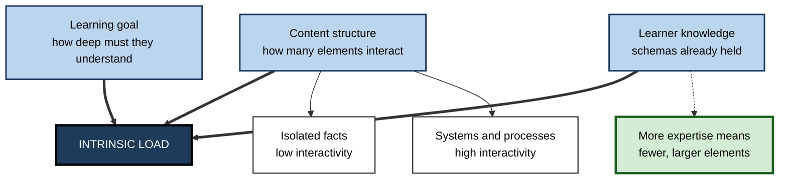
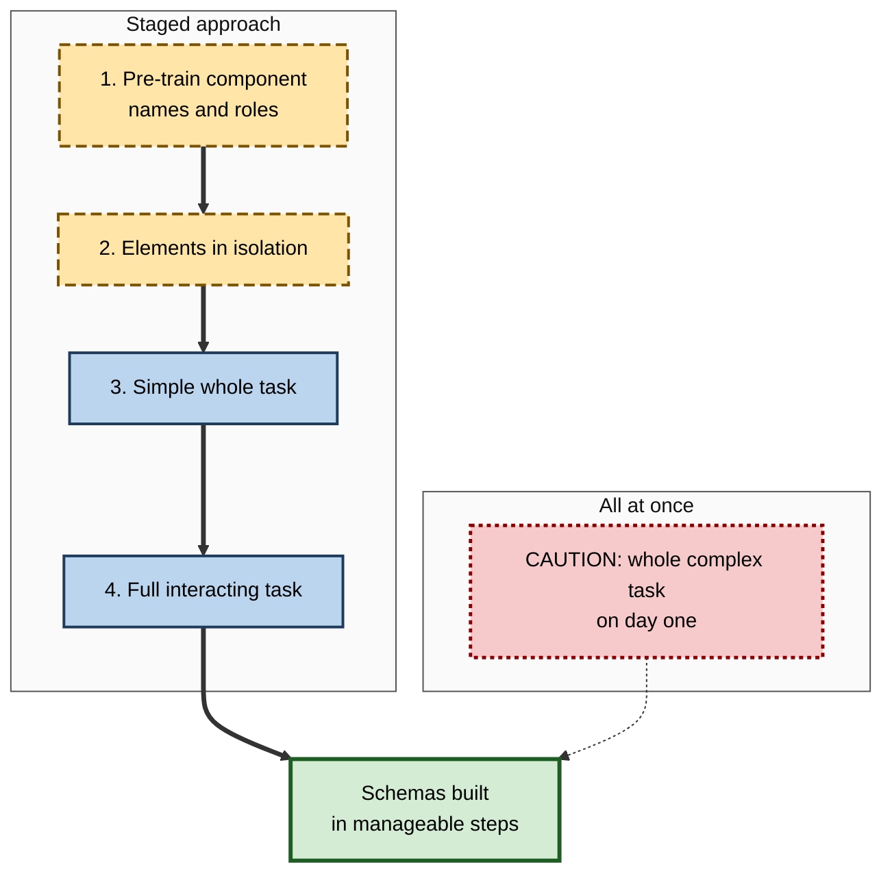

# I.2. Intrinsic Cognitive Load

> **In one sentence:** Intrinsic cognitive load is how hard something is to understand because of how many of its parts you must think about together, given what you already know.
>
> **Why it matters:** You cannot design intrinsic load away, but you can schedule it, slice it and prepare people for it. Getting that right is the difference between a course that builds competence step by step and one that buries people on day one.
>
> **Level span:** Novice → Expert · **Reading time:** ~17 min · **Builds on:** working memory, schemas, the basic idea of cognitive load

---

## The Learning Ladder

| Level | Badge | After this level you can... |
|---|---|---|
| 1 | NOVICE | Explain why some topics are naturally harder than others. |
| 2 | FOUNDATIONS | Define element interactivity and explain why intrinsic load depends on the learner. |
| 3 | PRACTITIONER | Estimate the intrinsic load of a topic and apply four techniques to manage it. |
| 4 | ADVANCED | Explain how element interactivity underpins all load types and where the concept is contested. |
| 5 | EXPERT / PRO | Plan curricula, onboarding paths and AI-supported practice around intrinsic load. |

---

## Level 1 · Novice — The Big Picture

Learning twenty country capitals and learning how a car engine works can take similar amounts of time, but they feel completely different. Capitals can be learned one at a time: knowing that Lima is the capital of Peru does not depend on knowing that Oslo is the capital of Norway. An engine is different. You cannot understand the piston without the crankshaft, the crankshaft without the fuel cycle, and the fuel cycle without the timing. The pieces only make sense together.

That built-in difficulty is **intrinsic cognitive load**: the mental effort that comes from the content itself, not from how it is presented. "Intrinsic" means "belonging to the thing itself".

An analogy: a recipe for scrambled eggs and a recipe for a soufflé might be printed in the same clear font on the same clean page. The soufflé is still harder, because more steps depend on each other and on timing. Good layout cannot change that. It can only help you take it one step at a time.

You have already met intrinsic load when:

- learning to drive, where steering, braking, mirrors and gears all had to be managed together;
- reading a contract where each clause referred to definitions and exceptions elsewhere;
- debugging code where a bug only appeared when three components interacted.

The key idea for a beginner: **some things are hard because their pieces are tangled together, and the more you already know, the less tangled they feel.**

---

## Level 2 · Foundations — Core Concepts

### Element interactivity

The central concept is **element interactivity**: the number of elements that must be processed in working memory *at the same time* in order to understand something.

- **Low element interactivity:** elements can be learned in isolation. Vocabulary lists, keyboard shortcuts, the names of tools, individual product codes. There may be many elements, so learning takes time, but each is light on working memory.
- **High element interactivity:** elements only make sense in relation to one another. Solving an equation, reading a balance sheet, understanding recursion, structuring a negotiation, designing a database schema.

A frequently used illustration: learning the word for "cat" in a new language is low in element interactivity, while learning that language's grammar for a sentence is high, because word order, case, tense and agreement interact.

### Intrinsic load is relative to the learner

What counts as one element depends on the learner's existing schemas. For an accountant, "accrual" is one element; for a new analyst it may be five (timing, revenue, expense, period, matching). **Intrinsic load is therefore a property of the content *and* the learner together.** As expertise grows, many interacting elements collapse into one schema, and the same material carries lower intrinsic load.

**Figure I.2-1 — What drives intrinsic load.**

*How to read it:* three factors feed intrinsic load (thick arrows); the dotted arrow shows how expertise reduces it over time.

### Key terms

| Term | Plain meaning |
|---|---|
| **Intrinsic cognitive load** | Load imposed by the content's complexity relative to the learner's knowledge. |
| **Element** | Anything that must be learned or processed: a concept, symbol, rule, step. |
| **Element interactivity** | How many elements must be processed simultaneously to understand. |
| **Understanding** | In CLT, the ability to process all the interacting elements of something together. |
| **Learning goal** | What exactly the learner must be able to do; deeper goals add interacting elements. |

### Intrinsic versus "lots of material"

A long list is not the same as high intrinsic load. Memorising two hundred product codes is time-consuming but low in interactivity; understanding how three pricing rules combine may take ten minutes and still be high in intrinsic load. Confusing volume with complexity leads designers to slice content in the wrong places.

---

## Level 3 · Practitioner — Putting It to Work

### Step 1 — Estimate intrinsic load

1. **Write the learning goal as a task.** "Configure a role-based access policy for a new team", not "understand access control".
2. **List the elements** a novice must handle: concepts, rules, steps, tool features.
3. **Draw the dependencies.** Which elements must be held together for the task to make sense?
4. **Mark what the audience already knows.** Those elements are probably already chunked into schemas.
5. **Count the largest cluster of unfamiliar, interacting elements.** If it is clearly more than a handful, expect overload.

### Step 2 — Manage it with four techniques

| Technique | What it does | Example |
|---|---|---|
| **Pre-training** | Teach names and properties of components first, so they become single elements before the full task. | Before a session on incident response, learners learn the five roles and the severity levels on their own. |
| **Isolated-then-interacting elements** | Present elements first as if they were independent, then show how they interact. | Teach each SQL clause separately, then combine them into a query. |
| **Simple-to-complex sequencing** | Begin with simplified versions of the whole task and add complexity in stages. | First a negotiation with one issue, then two issues, then multi-party. |
| **Part-task to whole-task** | Practise a demanding component separately, then reintegrate it. | Practise reading a stack trace before full debugging exercises. |

The isolated-then-interacting approach comes from a 2002 study by Pollock, Chandler and Sweller on training trade apprentices in electrical testing procedures: novices first shown elements in isolation, then interacting, outperformed those shown everything together. The trade-off is that the first phase gives only partial understanding, which must be resolved quickly in the second.

**Figure I.2-2 — Managing high intrinsic load: from tangled to staged.**

*How to read it:* the thick path is the staged route; the dotted arrow means the all-at-once route rarely reaches the same outcome for novices.

### Worked example — teaching cloud networking to new support engineers

**Before:** a single diagram of a virtual network with subnets, route tables, security groups, gateways and load balancers, explained in one hour. New engineers could repeat terms but could not diagnose a connectivity ticket.

**After:**

1. Pre-training: a one-page card defining each component in one sentence, with a ten-minute retrieval quiz.
2. Isolation: three short labs, each changing one component and observing the effect.
3. Simple whole task: diagnose a ticket where only one component is misconfigured.
4. Full task: diagnose tickets with interacting faults.

The total time rose slightly; time-to-first-solved-ticket fell, and escalations in the first month dropped.

### Common mistakes at this level

- **Slicing by volume, not interactivity.** Splitting a long video into parts at arbitrary time marks, cutting an interacting idea in half.
- **Staying in isolation too long.** Learners who never see the interacting whole build fragmented knowledge.
- **Over-simplifying the goal.** Removing interacting elements that the job actually requires produces people who pass the course and fail the work.
- **Ignoring prior knowledge.** A mixed audience experiences very different intrinsic load from the same material.

---

## Level 4 · Advanced — Mechanisms, Models & Evidence

### Element interactivity as the master mechanism

Sweller proposed in 2010 that element interactivity underlies not just intrinsic load but all load types. **Intrinsic** load comes from elements that are essential to the learning goal; **extraneous** load comes from elements imposed by the design that are not essential. The same mechanism — interacting elements competing for limited working memory — explains both. This unification answered part of the criticism that load types were defined after the fact.

A 2023 paper by Chen, Paas and Sweller argued that task complexity should be defined and measured through element interactivity, which requires considering both the structure of the information and what is already in the learner's long-term memory. In practice, researchers estimate element interactivity by analysing the task and counting the elements that must be processed together for a defined learner population.

### The element interactivity effect

One of the most important boundary conditions in CLT is the **element interactivity effect**: most cognitive load effects appear when intrinsic load is high and shrink or disappear when it is low. If the content is simple, there is plenty of spare capacity, so poor presentation does little harm. This is why a cluttered slide about a simple fact may be harmless, while the same clutter around a complex process can block learning entirely.

### Can intrinsic load be "reduced"?

This is a point of genuine debate:

- **Strict view:** intrinsic load is fixed for a given task, goal and learner. Techniques such as sequencing do not reduce it; they change *which* task the learner is doing at a given moment.
- **Practical view:** by changing the task temporarily (simplified versions, isolated elements) or changing the learner (pre-training), instructors effectively manage intrinsic load across a sequence.

Both views agree on what to do; they differ on how to describe it.

### Intrinsic load and desirable difficulties

Researchers in the desirable-difficulties tradition recommend making practice harder in certain ways — spacing, interleaving, generating answers. CLT researchers sometimes appear to recommend the opposite. The reconciliation is element interactivity and expertise: when intrinsic load is already near capacity, added difficulty becomes overload; when intrinsic load is low (for example because the learner is more advanced or the material is simpler), added difficulty can deepen processing. Some CLT researchers have argued that desirable difficulties work mainly with low element interactivity material.

### Evidence strength

| Claim | Strength |
|---|---|
| Content with interacting elements is harder to learn than isolated elements of equal number | Strong, foundational |
| Pre-training component names helps learning of complex processes | Moderate to strong, mainly in multimedia studies |
| Isolated-then-interacting sequencing helps novices with very complex material | Moderate; fewer studies, boundary conditions apply |
| Element interactivity can be counted reliably | Contested; counting depends on assumptions about learner knowledge |

---

## Level 5 · Expert / Pro — Professional Mastery

### Designing curricula around intrinsic load

Experts make intrinsic load an explicit design input:

- **Map the dependency graph** of the domain and teach in an order that respects it, so each new topic adds only a few interacting elements to an existing schema.
- **Build "complexity ladders"** of whole tasks — the core idea of the four-component instructional design model (4C/ID) from van Merriënboer, which organises training into task classes from simple to complex while keeping each task authentic.
- **Diagnose prior knowledge** before assigning learners to a path; a short "first step" test, where learners show the first move they would make on a problem, is a fast way to estimate expertise.
- **Separate memorisation from understanding.** Low-interactivity material (terms, codes, shortcuts) suits retrieval practice and spaced flashcards; high-interactivity material needs worked examples and guided problem solving.

### Teams and work design

Intrinsic load also shapes work, not just learning. A team asked to own a domain with many interacting parts — payments, compliance, three legacy systems — carries high intrinsic load before any process friction is added. Engineering organisations increasingly treat this as a design constraint when setting team boundaries. Splitting responsibilities along natural seams of low interactivity lets each team build deep schemas of its own area.

### AI-era implications

Generative AI tutors can be excellent at **pre-training** (explaining terms on demand) and at **generating simplified versions** of a task. The risk is that they can also silently remove intrinsic processing — solving the interacting part for the learner. A well-designed AI tutor explains components, scaffolds the order, and leaves the learner to integrate the elements.

### Professional scenario

**Role:** Learning architect for a bank's graduate programme.
**Situation:** Graduates struggle with a module on credit risk models that combines statistics, regulation and business judgement in one week.
**What the pro does:** Maps the elements and finds three dense clusters. Moves the statistical vocabulary into a pre-training module with retrieval quizzes in the week before; restructures the week into three task classes (single-factor scoring, multi-factor scoring, scoring under regulatory constraints); and adds a diagnostic so graduates with quantitative degrees skip the first class. Evaluation at eight weeks shows better unaided performance on case reviews, with no increase in total time.

---

## Myths vs. Evidence

| Myth | What the evidence shows |
|---|---|
| "Hard topics are hard because they contain a lot of material." | Difficulty comes mainly from element interactivity, not volume. |
| "Good design can make any topic easy." | Design controls extraneous load; intrinsic load is inherent to task, goal and learner and must be staged. |
| "Intrinsic load is fixed forever." | It falls as expertise grows, because interacting elements become single schemas. |
| "Always teach parts before the whole." | Isolation helps with very complex material for novices, but learners need the integrated whole soon after. |
| "Simplifying the task is dumbing it down." | Temporary simplification within a sequence that reaches the full task is a well-supported strategy. |

## Practitioner Toolkit

**Intrinsic load planning checklist**

- [ ] I wrote the learning goal as a concrete task.
- [ ] I listed the elements and drew their dependencies.
- [ ] I identified what the audience already knows.
- [ ] I moved component names and definitions into pre-training.
- [ ] I ordered whole tasks from simple to complex.
- [ ] I made sure learners reach the full, interacting task before the end.
- [ ] I checked whether experienced learners can skip early stages.

**Template — element interactivity map**

| Element | Depends on | Already known by audience? | Stage introduced |
|---|---|---|---|
| | | | |

## Self-Check

1. **[NOVICE]** Why is learning a list of words easier than learning grammar?
2. **[NOVICE]** Why does a topic feel easier once you know more about it?
3. **[FOUNDATIONS]** Define element interactivity.
4. **[FOUNDATIONS]** Why is intrinsic load a property of both content and learner?
5. **[PRACTITIONER]** Name the four techniques for managing intrinsic load and give an example of one.
6. **[ADVANCED]** What is the element interactivity effect, and why does it matter for designers?
7. **[ADVANCED]** How can CLT and the desirable-difficulties tradition both be right?
8. **[EXPERT / PRO]** How would you assign a mixed-experience cohort to different paths?

### Answer Key

1. Words can be learned one at a time (low interactivity); grammar requires several rules to be applied together (high interactivity).
2. Elements you already know are chunked into schemas, so there are fewer separate elements to hold in working memory.
3. The number of elements that must be processed simultaneously in working memory to understand something.
4. What counts as an element depends on the learner's existing schemas; the same content has many elements for a novice and few for an expert.
5. Pre-training, isolated-then-interacting elements, simple-to-complex sequencing, part-task to whole-task. Example: teaching each SQL clause separately before combining them.
6. CLT effects mostly appear only when intrinsic load is high; designers should focus their effort where material is complex.
7. Added difficulty helps when intrinsic load is low enough to leave spare capacity, and hurts when intrinsic load is already near capacity.
8. Use a short diagnostic, such as a first-step test, and route learners to the task class that matches their expertise, allowing advanced learners to skip early stages.

## Key Takeaways

- Intrinsic load comes from **element interactivity**: how many elements must be understood together.
- It depends on the **learner's prior knowledge** as much as on the content.
- Designers cannot remove it but can **stage** it: pre-training, isolation, simple-to-complex, part-to-whole.
- Most CLT effects matter only when **intrinsic load is high**.
- Learners must reach the **full, interacting task**; isolation is a temporary bridge.
- Diagnose expertise and **route learners** accordingly.

## Glossary

| Term | Meaning |
|---|---|
| 4C/ID model | Four-component instructional design: a whole-task training model built around task classes from simple to complex. |
| Element | A unit to be learned or processed, whose size depends on prior knowledge. |
| Element interactivity | The number of elements that must be processed together to understand something. |
| Element interactivity effect | The finding that most CLT effects appear only with high element interactivity material. |
| First-step diagnostic | A rapid test asking learners for the first step they would take on a problem, used to estimate expertise. |
| Intrinsic cognitive load | Load imposed by the complexity of content relative to the learner's knowledge. |
| Isolated-interacting elements | Presenting elements separately first, then together. |
| Part-task practice | Practising a component of a complex task separately. |
| Pre-training | Teaching component names and characteristics before a complex lesson. |
| Task class | A group of whole tasks of similar complexity in a training sequence. |
