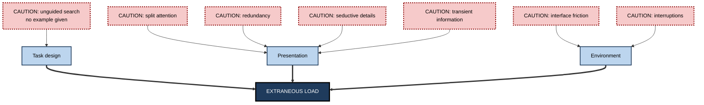
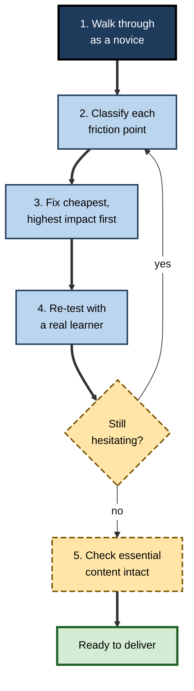

# I.3. Extraneous Cognitive Load

> **In one sentence:** Extraneous cognitive load is mental effort wasted on the way information is presented — hunting, decoding, cross-referencing, ignoring distractions — instead of on the thing you are trying to learn.
>
> **Why it matters:** It is the one kind of load a designer, trainer, writer or manager fully controls. Removing it is usually cheap, and it frees capacity that learners can spend on the real content.
>
> **Level span:** Novice → Expert · **Reading time:** ~17 min · **Builds on:** working memory limits, intrinsic load

---

## The Learning Ladder

| Level | Badge | After this level you can... |
|---|---|---|
| 1 | NOVICE | Recognise when a lesson or document is harder than it needs to be because of how it is presented. |
| 2 | FOUNDATIONS | Name the main sources of extraneous load and explain why they hurt learning. |
| 3 | PRACTITIONER | Run an extraneous-load audit on a real piece of material and fix the worst problems. |
| 4 | ADVANCED | Explain when extraneous load matters, why it depends on the learner, and how the concept is being updated for digital learning. |
| 5 | EXPERT / PRO | Build extraneous-load reduction into design standards, review processes and tooling. |

---

## Level 1 · Novice — The Big Picture

Imagine assembling flat-pack furniture. The task itself — matching parts, following steps — takes some thought. Now imagine the instructions are on a different sheet for each step, the parts are labelled with codes that only appear in a separate table, and the pictures are tiny. Assembly becomes much harder, but *the furniture did not change*. The extra struggle came entirely from the instructions.

That wasted struggle is **extraneous cognitive load**. "Extraneous" means "coming from outside, not belonging". It is the part of mental effort that does nothing to help you learn or do the task.

You have already met extraneous load when:

- a presenter read out slide text that was different from what they were saying, and you could follow neither;
- a software manual referred you to "figure 7" three pages away;
- an e-learning course made you click through animations and pop-ups before you could see the content;
- you had to keep an error message in your head while scrolling through a long log file.

The beginner's key idea: **when material is harder than the topic itself, the extra difficulty is waste, and someone can remove it.**

---

## Level 2 · Foundations — Core Concepts

### Definition

**Extraneous cognitive load** is the working memory load imposed by instructional procedures or presentation that are not needed to reach the learning goal. Because working memory is limited, every unit of capacity spent on extraneous load is unavailable for dealing with the content.

### The main sources

| Source | What happens in the learner's head | Typical example |
|---|---|---|
| **Unguided search** | Trial-and-error problem solving ties up working memory in comparing states and goals. | Novices given a hard problem and no example. |
| **Split attention** | Learner must mentally combine sources that are separated in space or time. | Diagram on one page, explanation on the next. |
| **Redundancy** | Learner processes information they do not need, or the same information twice. | Narration that reads out identical on-screen text. |
| **Transient information** | Information disappears before it can be processed. | Long spoken explanation of a complex process with no visual record. |
| **Seductive details** | Interesting but irrelevant material draws attention and processing. | Decorative stock photos, entertaining anecdotes unrelated to the point. |
| **Poor signalling** | Learner cannot tell what is important or how parts relate. | Wall of text with no headings or highlights. |
| **Interface friction** | Navigating the medium takes effort. | Clunky learning platforms, unfamiliar tools, broken links. |
| **Interruptions** | Attention is pulled away; the learner must reconstruct their place. | Notifications during a training video. |

**Figure I.3-1 — Where extraneous load comes from.**

*How to read it:* the dotted-border boxes are specific sources; they feed three families, which all feed extraneous load.

### Key terms

| Term | Plain meaning |
|---|---|
| **Extraneous cognitive load** | Load caused by presentation or procedure, not by the content. |
| **Split attention** | Having to mentally integrate separated sources of information. |
| **Redundancy** | Unnecessary or duplicated information that must still be processed. |
| **Seductive details** | Interesting but irrelevant additions that compete for attention. |
| **Signalling** | Cues such as headings, highlighting or arrows that show what matters and how parts relate. |
| **Coherence** | Including only material that serves the learning goal. |

---

## Level 3 · Practitioner — Putting It to Work

### The extraneous-load audit

Run this on any slide deck, document, video or e-learning module.

1. **Walk through it as a novice.** Note every moment you have to search, scroll back, hold something in mind, or wonder "where should I look?".
2. **Classify each moment** using the source table above.
3. **Fix the cheapest, highest-impact items first:**
   - put labels on diagrams instead of in separate legends;
   - remove decorative images, background music and tangents;
   - stop reading slide text aloud; reduce slides to labels and visuals while you talk;
   - add headings, numbered steps and highlighting of the key relationship;
   - provide a worked example before any unfamiliar problem;
   - give a persistent visual or written summary for long spoken explanations.
4. **Re-test with one real learner** from the target audience. Watch where they still hesitate.
5. **Check you did not remove essential content.** Coherence means removing the irrelevant, not the difficult.

**Figure I.3-2 — The audit loop.**

*How to read it:* follow the thick arrows; the thin loop repeats until the test learner no longer stalls.

### Worked example — a security-awareness module

| Element | Before | After |
|---|---|---|
| Opening | 90-second animated intro with music | One sentence: what you will be able to do |
| Phishing explanation | Text on left, sample email on right, legend at bottom | Callouts placed directly on the sample email |
| Narration | Reads every on-screen sentence | Speaks while the screen shows only the email and callouts |
| Examples | Cartoon hacker images throughout | Removed |
| Practice | "Spot the phish" with ten emails and no prior example | One fully annotated example, then practice with feedback |

The module becomes several minutes shorter, and nothing essential has been removed. The right way to judge the redesign is not a satisfaction survey but a later simulated phishing test comparing click rates of people trained on each version; results will vary by organisation, which is exactly why the comparison is worth running.

### Common mistakes at this level

- **Adding "engagement" that adds load.** Animations, background music and jokes often function as seductive details.
- **Reading slides aloud.** For most adult audiences this creates redundancy.
- **Over-correcting into minimalism.** Removing all signalling and examples can raise extraneous load by forcing learners to search.
- **Fixing the font while leaving the structure.** Extraneous load is mostly about structure and integration, not typography.

---

## Level 4 · Advanced — Mechanisms, Models & Evidence

### Why extraneous load is defined by elements too

In the element-interactivity version of CLT, extraneous load arises when a design forces learners to process interacting elements that are not essential to the goal. Split attention, for example, adds the element "find the matching part of the diagram" to every sentence. Means–ends search adds many elements: the current state, the goal, the candidate moves, the differences.

### Extraneous load is relative

Two important qualifications:

1. **It matters most when intrinsic load is high.** With simple content, spare capacity absorbs poor design. This is the element interactivity effect.
2. **What is extraneous depends on the learner.** An explanation that is essential for a novice can be redundant for an expert; processing it becomes extraneous load. This is the mechanism behind the expertise reversal effect.

So "extraneous" is not a fixed label on a piece of content. It is a relation between the content, the design, the learner and the goal.

### Updated views for digital learning

In 2022, Skulmowski and Xu argued that classic CLT treated extraneous load narrowly, as a feature of instructional materials. In digital and online learning, extraneous load also comes from **technical problems, interface design, multitasking and distractions in the learner's environment**. They proposed a cost-benefit view: design features have cognitive costs (extraneous) and possible benefits (for example, interactivity that prompts deeper processing), and designers should weigh both rather than minimising every cost.

### Evidence

Effects linked to reducing extraneous load are among the most replicated in educational psychology:

| Design change | Evidence |
|---|---|
| Integrating separated text and pictures | A 2018 meta-analysis by Schroeder and Cenkci found a medium positive effect (g about 0.63) across 58 comparisons. |
| Worked examples instead of unguided problems for novices | A 2023 meta-analysis in mathematics found a medium average effect (g about 0.48). |
| Removing seductive details and extraneous material | Supported by multiple meta-analyses; effects vary with content and learners. |
| Signalling | Reliable but generally small effects. |

A large 2022 overview of multimedia design meta-analyses, covering 29 reviews and over 1,100 studies, concluded that the principles for reducing extraneous processing — contiguity, coherence, signalling — are among the best supported.

### Open questions

- **Measurement.** Self-report items for extraneous load ("the instructions were unclear") often correlate with intrinsic load items, so separating them empirically is hard.
- **Seductive details versus motivation.** Some interesting additions may raise interest enough to offset their cost, particularly in longer, voluntary learning. The balance is not settled.
- **Affect.** Frustration with a clunky interface may add load through emotional processing, an area of active research.

---

## Level 5 · Expert / Pro — Professional Mastery

### Making extraneous-load reduction a standard

Mature organisations do not rely on individual designers remembering principles. They embed them:

- **Design standards and templates** for slides, videos and documentation that enforce integrated labels, consistent signalling, and no decorative media.
- **Peer review checklists** that include the extraneous-load audit, the same way code review includes a security checklist.
- **Pilot testing** with a small group of real learners, watching for hesitation points before launch.
- **Platform selection** criteria that include navigation clarity and focus mode, not just feature lists.

### Beyond training: documentation, tools and work

Extraneous load is not only a training issue. Internal tools, wikis, dashboards and runbooks impose it every day. Developer-experience and internal-platform teams frame much of their work as removing extraneous load so that product teams can spend capacity on the problem they are solving. The same lens applies to meetings: an agenda, a pre-read with integrated visuals, and one decision per agenda item reduce the load of following a discussion.

### AI-era implications

Generative AI is a strong ally against extraneous load when it is used for **reformatting** (turning a wall of text into steps), **integrating** (placing explanations next to code), **translating jargon**, and **producing worked examples** on demand. It becomes a risk when it adds extraneous load — verbose, unfocused answers that the learner must filter — or when it removes intrinsic processing along with the waste. A practical rule: let AI remove the friction around the thinking, never the thinking itself.

### Professional scenario

**Role:** Developer-experience lead at a fintech company.
**Situation:** New engineers take six weeks to make their first production change. Exit interviews mention "documentation sprawl".
**What the pro does:** Runs an extraneous-load audit on the onboarding path. Finds that the setup guide references eleven separate pages, the architecture diagram's legend is on a different page, and the runbook mixes current and deprecated commands. The team consolidates setup into one page with commands inline, labels the diagram directly, removes deprecated content, and adds one worked end-to-end change. Time-to-first-change falls substantially over the next two cohorts, and the team adds the audit to the documentation review process.

---

## Myths vs. Evidence

| Myth | What the evidence shows |
|---|---|
| "More visuals always help." | Decorative visuals can be seductive details that reduce learning. Relevant, integrated visuals help. |
| "Reading the slides aloud reinforces the message." | For most adults this creates redundancy and can reduce learning. |
| "Extraneous load is just bad graphic design." | It is mostly about structure: separated sources, missing examples, transient information, interruptions. |
| "If content is simple, design does not matter." | Partly true — effects shrink with simple content — but complex content is where most professional learning happens. |
| "Entertainment keeps people engaged, so it is worth the load." | Interest can help motivation, but irrelevant entertainment often costs more learning than it gains. The trade-off is contested. |

## Practitioner Toolkit

**Extraneous-load checklist**

- [ ] Labels sit on or next to the thing they describe.
- [ ] No decorative images, music or animations without a learning purpose.
- [ ] I do not read on-screen text aloud word for word.
- [ ] Headings, numbering and highlighting show structure and the key relationship.
- [ ] A worked example precedes each new type of problem.
- [ ] Long spoken or animated explanations have a persistent summary.
- [ ] Navigation takes no thought; links and tools work.
- [ ] Notifications and interruptions are minimised during learning time.

**Template — friction log for a pilot test**

| Timestamp or page | What the learner did | Source of load | Fix |
|---|---|---|---|
| | | | |

## Self-Check

1. **[NOVICE]** What makes load "extraneous"?
2. **[NOVICE]** Give one everyday example of extraneous load.
3. **[FOUNDATIONS]** List four sources of extraneous load.
4. **[FOUNDATIONS]** Why does extraneous load reduce learning?
5. **[PRACTITIONER]** Describe the five steps of an extraneous-load audit.
6. **[ADVANCED]** Why can the same explanation be essential for one learner and extraneous for another?
7. **[ADVANCED]** What did the 2022 cost-benefit perspective add for digital learning?
8. **[EXPERT / PRO]** How would you make extraneous-load reduction part of an organisation's standard process?

### Answer Key

1. It comes from how information is presented or organised, not from the content needed to reach the goal.
2. Examples: instructions on a separate sheet from the diagram; a presenter reading different slide text; an app full of pop-ups.
3. Any four of: unguided search, split attention, redundancy, transient information, seductive details, poor signalling, interface friction, interruptions.
4. It consumes limited working memory that would otherwise be available for processing the essential content.
5. Walk through as a novice; classify friction points; fix the cheapest high-impact items; re-test with a real learner; check essential content is intact.
6. A novice needs the explanation to understand; an expert already has the schema, so processing the explanation is unnecessary work.
7. That extraneous load in digital settings also comes from technical issues, interfaces, multitasking and environment, and that design features should be weighed as costs and benefits.
8. Build principles into templates and standards, include the audit in peer review, pilot with real learners, and choose platforms with low interface friction.

## Key Takeaways

- Extraneous load is **waste created by presentation and procedure**, not by content.
- It is the type of load **designers control most directly**.
- Main sources: **unguided search, split attention, redundancy, transient information, seductive details, poor signalling, interface friction and interruptions**.
- It matters most when **intrinsic load is high** and depends on the **learner's expertise**.
- Digital learning adds **technical and environmental** sources.
- Remove the friction around the thinking, **never the thinking itself**.

## Glossary

| Term | Meaning |
|---|---|
| Coherence | Including only material that serves the learning goal. |
| Cost-benefit view | Weighing the cognitive costs and benefits of each design feature rather than minimising all load. |
| Extraneous cognitive load | Working memory load imposed by presentation or procedure rather than by essential content. |
| Interface friction | Effort spent operating the medium rather than learning. |
| Means–ends search | Trial-and-error problem solving that compares current state with goal, consuming working memory. |
| Redundancy | Unnecessary or duplicated information that learners must still process. |
| Seductive details | Interesting but irrelevant material that diverts processing. |
| Signalling | Cues that highlight key information and its organisation. |
| Split attention | Mentally integrating information separated in space or time. |
| Transient information | Information that disappears, such as speech or animation, before it can be fully processed. |
