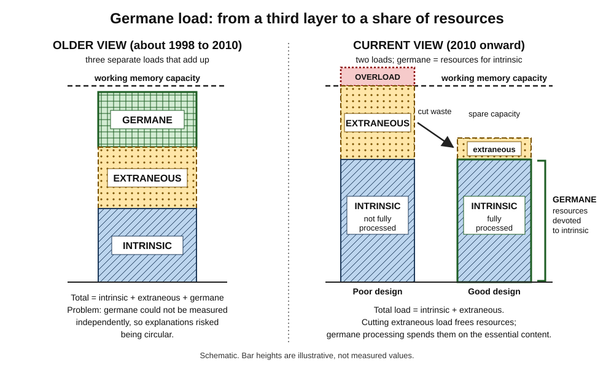
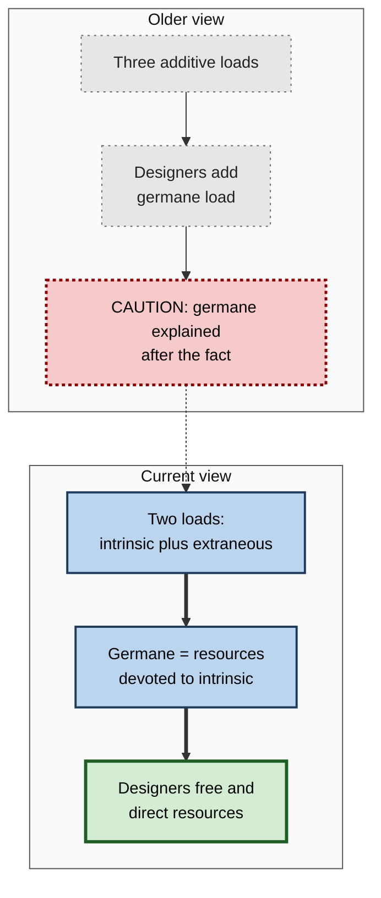
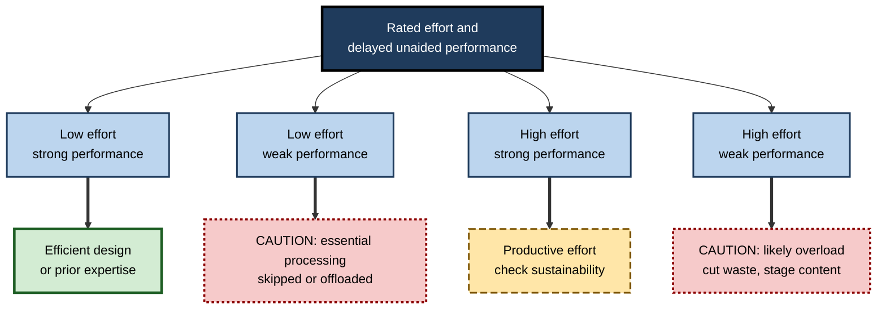

# I.4. Germane Cognitive Load

> **In one sentence:** Germane cognitive load is the part of your mental effort that actually goes into understanding and building knowledge — and modern researchers increasingly describe it not as a separate load but as how much of your mental capacity you spend on the essential content.
>
> **Why it matters:** Removing waste is only half of good design; the freed capacity must be spent on real thinking. Understanding the current, corrected view of germane load also protects professionals from outdated training advice that still circulates widely.
>
> **Level span:** Novice → Expert · **Reading time:** ~19 min · **Builds on:** intrinsic load, extraneous load, working memory

---

## The Learning Ladder

| Level | Badge | After this level you can... |
|---|---|---|
| 1 | NOVICE | Explain the difference between busy effort and learning effort. |
| 2 | FOUNDATIONS | Define germane load in both its original and current forms. |
| 3 | PRACTITIONER | Design activities that direct freed-up capacity toward the essential content. |
| 4 | ADVANCED | Explain why germane load was reconceptualised, what the current debate is, and how it is (and is not) measured. |
| 5 | EXPERT / PRO | Evaluate training and AI tools by whether they keep essential processing with the learner. |

---

## Level 1 · Novice — The Big Picture

Think of two people at the gym for an hour. One spends half the time looking for equipment, adjusting badly fitting machines and waiting. The other walks straight to a well-set-up station and spends the hour lifting. Both are "busy" for an hour, but only one spends the hour on the thing that makes them stronger.

Learning is similar. Some of your mental effort goes to the content itself — understanding how the ideas fit together. Some is wasted on the packaging. The part of your effort that turns into real understanding was named **germane cognitive load**. "Germane" means "relevant to the point".

You have already felt germane effort when:

- you explained a concept to a colleague and suddenly understood it better yourself;
- you compared two solved examples and noticed what they had in common;
- you worked through why a bug happened, not just how to make the error go away.

Here is the twist that matters for this note: scientists have changed their minds about what germane load is. Originally it was treated as a *third type of load* that added to the other two. Today, most researchers in the field describe it as **the share of your mental resources that you devote to the essential content**. The practical message for a beginner is the same either way: **clear away the clutter, then make sure the freed-up attention goes to the real thinking.**

---

## Level 2 · Foundations — Core Concepts

### The original definition (1998 version)

In the influential 1998 formulation by Sweller, van Merriënboer and Paas, cognitive load had three additive parts:

- **Intrinsic load** — from the complexity of the content;
- **Extraneous load** — from poor design, harmful to learning;
- **Germane load** — from activities that *help* schema construction, such as comparing varied examples or explaining to oneself.

The design advice was: reduce extraneous load, then "add" germane load, all within the limit of working memory.

### The current definition (2010 onward)

By 2010, Sweller had redefined germane load in terms of element interactivity. In 2011, Slava Kalyuga argued that, as traditionally used, germane load was **indistinguishable from intrinsic load** and therefore redundant as a separate category. The 2019 review "Cognitive architecture and instructional design: 20 years later" consolidated the shift:

- **Total cognitive load = intrinsic load + extraneous load.** Germane load is no longer a third additive source.
- **Germane load (or germane resources)** refers to the working memory resources devoted to dealing with the intrinsic, essential elements.
- Germane processing has a **redistributive role**: reducing extraneous load frees resources that the learner can redirect to intrinsic processing.

*Figure I.4-1 — Old and new views of germane cognitive load.* Left: the older additive stack of three loads. Right: in the current view only intrinsic and extraneous load add up; germane resources are the capacity devoted to intrinsic load, which good design makes possible by cutting waste. Bar heights are illustrative.

### Key terms

| Term | Plain meaning |
|---|---|
| **Germane cognitive load (original)** | Load from learning-relevant activities that build schemas, added to intrinsic and extraneous. |
| **Germane resources (current)** | Working memory resources devoted to the essential, intrinsic elements. |
| **Germane processing** | The mental activity of building and refining schemas. |
| **Redistributive function** | The idea that resources freed from extraneous load can be shifted to intrinsic processing. |
| **Generative processing** | Mayer's closely related term for deep processing that organises and integrates material. |

### Comparing the two views

**Figure I.4-2 — What changed in the model.**

*How to read it:* the grey, sparse-dotted boxes are the superseded view; the dotted arrow shows that its circularity problem motivated the current view.

---

## Level 3 · Practitioner — Putting It to Work

In practical terms, "fostering germane processing" means two things: **free capacity** (by reducing extraneous load and staging intrinsic load) and **direct it** toward the essential relationships in the content. The second step is easy to forget.

### Activities that direct capacity to the essentials

| Activity | How it directs processing | Caution |
|---|---|---|
| **Self-explanation** | Learners explain each step of an example: "why does this step follow?" | Prompts add load; for novices with complex material they can backfire. |
| **Comparing examples** | Two or more examples that differ on surface but share structure push learners to find the underlying principle. | Variability helps once basics are in place; too much variety too early overloads. |
| **Completion problems** | Learners fill in missing steps, so they must process the logic. | Gaps must be sized to current expertise. |
| **Retrieval practice** | Recalling key relationships strengthens schemas. | Works best once initial understanding exists. |
| **Imagining a procedure** | Mentally rehearsing steps instead of re-reading them. | Helps learners with some expertise; hurts true novices. |
| **Teaching or explaining to others** | Forces organisation and integration. | Requires enough knowledge to explain accurately. |

### A four-step method

1. **Strip the waste.** Run an extraneous-load audit first; there is no point prompting deep thinking while learners are fighting the layout.
2. **Stage the intrinsic load.** Sequence and pre-train so the essential content fits in working memory.
3. **Add one directing activity** that targets the key relationship — usually self-explanation, comparison or completion.
4. **Check that learners use the freed capacity.** Look at the quality of explanations, not just completion. Low effort with good outcomes is efficient; low effort with poor outcomes means processing was skipped.

### Worked example — teaching financial statement analysis

**Before:** analysts read three annotated sets of statements, then answer a quiz. Many report the material was "easy" and still struggle on real cases.

**After:**

1. Each worked case is laid out with the ratio calculation placed directly next to the line items it uses.
2. After the first case, learners answer two prompts: "Which line item drove the change in margin?" and "What would you check next?"
3. The second and third cases are deliberately different industries with the same underlying issue (working capital strain), followed by "What do these three cases have in common?"
4. The final task is a completion problem: the analysis is half done; learners finish it and justify their conclusion.

The visible difference is not more content but **more of the learner's capacity spent on the essential relationships**.

### Common mistakes at this level

- **Equating germane load with "making it harder".** Effort only helps if it is spent on the essential elements.
- **Prompting too early.** Self-explanation prompts for a complete novice on very complex material can overload.
- **Assuming freed capacity is used automatically.** Learners often coast when material feels easy; design must invite the thinking.
- **Teaching the 1998 model as current.** Many popular guides still present three additive loads.

---

## Level 4 · Advanced — Mechanisms, Models & Evidence

### Why the concept changed

Three problems drove the reconceptualisation.

1. **Circularity.** In the older model, if a design improved learning while load rose, the extra load was called germane; if learning fell, the load was called extraneous. Ton de Jong's 2010 critique and others showed that, without independent measurement, these explanations could not be falsified.
2. **Redundancy.** Kalyuga (2011) argued that germane load, as used, was simply intrinsic load being processed. Effects attributed to "increasing germane load" — such as the variability effect — could be explained by changing the intrinsic task (more varied examples bring more interacting elements).
3. **Measurement.** Questionnaires designed to capture germane load separately often produced unstable or unexpected factor structures; germane items tend to measure perceived learning or engagement rather than a distinct load.

### What the current model claims

- Working memory load comes from intrinsic and extraneous elements only.
- The learner allocates working memory resources; the portion allocated to intrinsic elements is germane.
- If extraneous load is high, fewer resources remain for intrinsic elements; reducing it allows more germane processing — provided the learner invests effort.

That last condition matters: the theory now treats **learner investment** — motivation, willingness to engage — as part of the picture.

### The state of the debate in 2024 to 2026

The reconceptualisation is widely accepted among core CLT researchers, but the field has not fully converged:

| Position | Summary |
|---|---|
| **Two-load model with germane resources** (Sweller, Kalyuga, Paas, van Merriënboer) | The mainstream position in CLT reviews; germane is a matter of resource allocation, not a third load. |
| **Germane as measurable perception** | Researchers using the 2013 Leppink scale or the 2017 Klepsch, Schmitz and Seufert questionnaire still report germane load scores. Klepsch and colleagues found that learners can rate germane aspects more distinctly when given an explanation of the load types first. Critics reply that these items measure perceived learning or engagement, not load. |
| **Cost-benefit view** (Skulmowski and colleagues) | Design features carry cognitive costs (extraneous) and benefits (germane processing); designers should weigh both rather than minimising all load. |
| **Motivation and affect integrated** | Germane processing depends on the learner choosing to invest effort; recent models fold motivation and emotion regulation into load. |
| **Generative processing** (Mayer's multimedia theory) | A parallel framework: extraneous, essential and generative processing. Generative processing overlaps strongly with the current meaning of germane. |

In practice, rigorous papers now state which sense of "germane" they mean. Much practitioner literature, however, still describes three additive loads — a lag of more than a decade.

### Evidence about "germane" activities

- **Self-explanation** has a long history of positive effects, but a 2023 meta-analysis of worked examples in mathematics found that adding self-explanation *prompts* to worked examples was associated with *smaller* benefits than worked examples alone. One plausible interpretation: prompts add load for novices. This result is a useful corrective to "always add prompts".
- **Variability of examples** helps transfer, but mainly once learners can handle the added interacting elements.
- **Productive failure** research (problem solving before instruction) reports better conceptual understanding and transfer when well implemented, and some studies report learners rating germane load higher in those conditions — another place where definitions matter.

### The AI-era wrinkle: when low load is bad news

Studies of generative-AI use in 2024 to 2026 repeatedly find that heavy, unstructured use lowers students' self-reported cognitive load and effort. In the current CLT view this is not necessarily good: if the tool performs the essential processing, the learner devotes few resources to intrinsic elements, and few schemas are built. Researchers now distinguish **dependent offloading** (delegating the core thinking) from **autonomous offloading** (delegating peripheral tasks while keeping the core reasoning), with the latter associated with better outcomes. The concept of "metacognitive laziness" — learners reducing reflection and self-evaluation when an AI is available — has entered the literature.

---

## Level 5 · Expert / Pro — Professional Mastery

### Using the modern view in design and evaluation

- **Two-step design logic.** First, minimise extraneous load. Second, design the essential processing so learners actually do it — explanation, comparison, completion, retrieval — sized to their expertise.
- **Read effort scores carefully.** Low effort plus strong delayed performance means efficiency. Low effort plus weak delayed performance means learners skipped the essential processing. High effort plus weak performance suggests overload.
- **Avoid "germane load" as a selling point.** Vendors claiming their product "increases germane load" are usually using the outdated model and rarely have independent measures.
- **Specify who does the essential processing** in any AI-assisted learning design. If the tool does it, the learner will not learn it.

**Figure I.4-3 — Interpreting effort and outcome together.**

*How to read it:* combine the two measures; dotted-border outcomes need redesign.

### Professional scenario

**Role:** Product manager for an AI tutoring feature in a corporate learning platform.
**Situation:** A pilot shows learners finish modules faster and rate them as less effortful, and leadership wants to celebrate "reduced cognitive load".
**What the pro does:** Asks for delayed, unaided assessment data. It shows weaker performance than the previous version. Logs reveal learners asking the tutor for final answers. The team redesigns the tutor to give hints and questions first, require a learner attempt before revealing worked solutions, and close each module with an unaided explanation task. Effort ratings rise slightly; delayed performance recovers. The PM reports both numbers and explains that the earlier "low load" reflected skipped processing.

### Ethical and practical limits

- Do not push effort for its own sake; fatigue and anxiety reduce available resources.
- Some learners need more support before they can invest productively; this is an equity issue, not a motivation flaw.
- Self-report germane scales are research instruments; using them for individual performance evaluation is unjustified.

---

## Myths vs. Evidence

| Myth | What the evidence shows |
|---|---|
| "There are three additive types of cognitive load." | Current CLT treats total load as intrinsic plus extraneous; germane refers to resources devoted to intrinsic load. |
| "Good design increases germane load, so harder is better." | Good design frees resources and directs them to essentials; arbitrary difficulty is not germane. |
| "Germane load can be reliably measured with a questionnaire." | Questionnaire scores exist but their validity as a separate load is disputed. |
| "Adding self-explanation prompts always helps." | A 2023 meta-analysis found prompts were associated with smaller worked-example benefits in mathematics; effects depend on learner and task. |
| "Lower cognitive load with AI tools means better learning." | Low load can signal that the AI did the essential processing; delayed unaided performance often suffers. |

## Practitioner Toolkit

**Germane-processing design checklist**

- [ ] Extraneous load audited and reduced first.
- [ ] Intrinsic load staged to fit the audience.
- [ ] One activity explicitly targets the key relationship (explain, compare, complete, retrieve).
- [ ] Prompts sized to expertise — fewer and simpler for novices.
- [ ] AI tools give hints before answers and require a learner attempt.
- [ ] Effort ratings interpreted together with delayed, unaided performance.

**Template — "who does the thinking?" table**

| Essential processing step | Done by learner? | Done by tool or instructor? | Change needed |
|---|---|---|---|
| | | | |

## Self-Check

1. **[NOVICE]** What is the difference between being busy and germane effort?
2. **[FOUNDATIONS]** How was germane load defined in 1998?
3. **[FOUNDATIONS]** How is it defined in current CLT?
4. **[PRACTITIONER]** Name three activities that direct capacity to the essential content, with one caution each.
5. **[ADVANCED]** Give the three reasons the concept was revised.
6. **[ADVANCED]** What is the redistributive function of germane processing?
7. **[ADVANCED]** Why might low self-reported load during AI-assisted study be bad news?
8. **[EXPERT / PRO]** A vendor claims its platform "maximises germane load". What do you ask?

### Answer Key

1. Busy effort may be spent on packaging, navigation or distraction; germane effort is spent on understanding the essential content.
2. As a third, additive load from learning-relevant activities that build schemas.
3. As the working memory resources devoted to intrinsic (essential) elements; total load is intrinsic plus extraneous.
4. Examples: self-explanation (prompts can overload novices); comparing varied examples (too much variety too early overloads); completion problems (gaps must match expertise).
5. Circular explanations, redundancy with intrinsic load, and lack of valid independent measurement.
6. Reducing extraneous load frees resources that can be redirected to processing intrinsic elements.
7. It may mean the AI performed the essential processing, so the learner built few schemas.
8. Which definition they use, how it is measured, and whether they have delayed, unaided performance data compared with an alternative.

## Key Takeaways

- Germane load began as a **third additive load** and is now usually treated as **resources devoted to intrinsic load**.
- The change answered **circularity, redundancy and measurement** problems.
- Good design **frees capacity and directs it** to the essential relationships.
- "Germane" activities must be **sized to expertise**; prompts can overload novices.
- **Low load is not automatically good**: with AI tools it can mean skipped processing.
- Judge designs by **effort and delayed performance together**.

## Glossary

| Term | Meaning |
|---|---|
| Autonomous offloading | Delegating peripheral tasks to a tool while keeping the core reasoning. |
| Dependent offloading | Delegating the core thinking of a task to a tool. |
| Generative processing | Deep processing that organises and integrates material, in Mayer's multimedia theory. |
| Germane cognitive load (original) | A third additive load from schema-building activities. |
| Germane resources | Working memory resources devoted to intrinsic elements. |
| Metacognitive laziness | Reduced reflection and self-monitoring when an AI tool is available. |
| Redistributive function | Shifting freed resources from extraneous to intrinsic processing. |
| Self-explanation | Explaining to oneself why each step or idea holds. |
| Variability effect | Better transfer from varied rather than uniform examples, under suitable conditions. |
