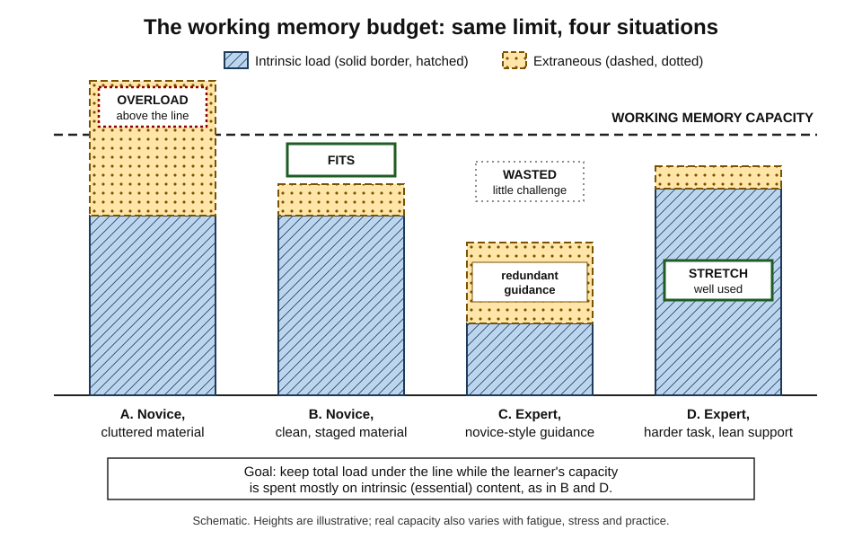
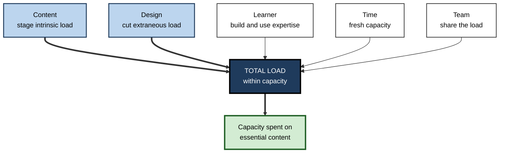
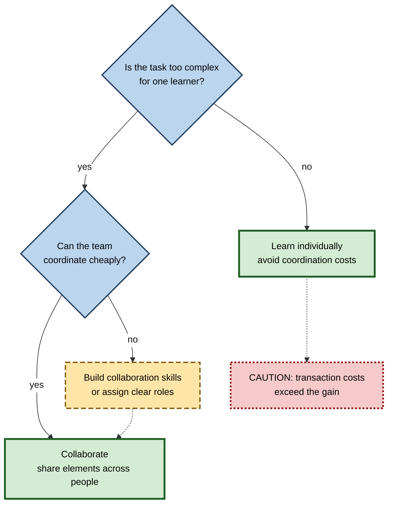

# I.5. Managing Total Cognitive Load

> **In one sentence:** Managing total cognitive load means keeping the combined mental demand of a learning task inside the learner's working memory limit, while making sure most of that limited space is spent on what actually needs to be learned.
>
> **Why it matters:** Overload wastes training time and erodes confidence; underload wastes experienced people's time and attention. Professionals who manage the whole budget — content, design, learner, time and team — get more learning out of every hour.
>
> **Level span:** Novice → Expert · **Reading time:** ~18 min · **Builds on:** intrinsic, extraneous and germane load

---

## The Learning Ladder

| Level | Badge | After this level you can... |
|---|---|---|
| 1 | NOVICE | Recognise signs of overload and underload in yourself and others. |
| 2 | FOUNDATIONS | Explain the load budget and the five levers that change it. |
| 3 | PRACTITIONER | Diagnose a session's load and choose the right lever to fix it. |
| 4 | ADVANCED | Use efficiency measures, explain working memory depletion and collective working memory, and judge the evidence. |
| 5 | EXPERT / PRO | Build load management into programmes, team practices and adaptive or AI-supported systems. |

---

## Level 1 · Novice — The Big Picture

Think of working memory as a small desk. Everything you need for the task in front of you must fit on the desk at once. Some of it is the real work (the documents you must read and compare). Some is clutter (packaging, unrelated papers, a ringing phone). If the desk overflows, things fall off, and you lose track. If the desk is nearly empty, you are bored and may drift off.

**Managing total cognitive load** means arranging things so the desk is well used but not overflowing — and so that most of what is on it is the real work.

You have already experienced both extremes:

- **Overload:** your first week in a new job, when every system, acronym and person was new and you went home exhausted, remembering little.
- **Underload:** a compulsory training course on something you already knew well, where your mind wandered and you remembered nothing either.

Signs of overload: losing your place, re-reading the same sentence, making careless errors, feeling flustered. Signs of underload: boredom, skimming, multitasking, "I already know this".

The beginner's key idea: **the right amount of load is "a good stretch" — enough to make you think, not so much that you drop things.**

---

## Level 2 · Foundations — Core Concepts

### The load budget

In current cognitive load theory, **total cognitive load = intrinsic load + extraneous load**. Learning suffers when this total exceeds working memory capacity. Within that total, the resources a learner devotes to intrinsic, essential elements are called germane resources. The design goal is therefore twofold:

1. keep total load within capacity;
2. make the intrinsic share as large as the learner can usefully handle.

*Figure I.5-1 — The working memory budget in four situations.* Hatched blocks with solid borders are intrinsic load; dotted blocks with dashed borders are extraneous load; the long-dashed line is capacity. A overflows; C wastes capacity on redundant guidance; B and D are well managed.

### The five levers

| Lever | What it changes | Examples |
|---|---|---|
| **Content** | How much intrinsic load is presented at once | Sequencing, pre-training, simplified whole tasks |
| **Design** | Extraneous load | Integrated formats, worked examples, removing redundancy |
| **Learner** | Effective capacity and what counts as an element | Prior knowledge, fluency, teaching learners to manage load themselves |
| **Time** | Whether capacity is fresh | Breaks, spacing sessions, pacing control |
| **Team** | Whether load can be shared | Collaboration on complex tasks, pairing, division of roles |

**Figure I.5-2 — Five levers for managing total load.**

*How to read it:* thick arrows are the levers designers use most; thin arrows are levers that depend on the learner, schedule or team.

### Key terms

| Term | Plain meaning |
|---|---|
| **Total cognitive load** | Intrinsic plus extraneous load at a given moment. |
| **Overload** | Total load exceeds capacity; processing breaks down. |
| **Underload** | Task demands too little; attention drifts and learning stalls. |
| **Mental effort** | The capacity a learner actually invests, which may be less than what the task demands. |
| **Instructional efficiency** | Performance achieved relative to effort invested. |

---

## Level 3 · Practitioner — Putting It to Work

### The load diagnosis routine

1. **Observe or ask.** Use a single 9-point effort rating ("How much mental effort did that take?", from very, very low to very, very high) after each segment, plus a short performance check.
2. **Read the pattern.**
   - High effort, poor performance: overload.
   - Low effort, poor performance: disengagement or skipped processing.
   - Low effort, good performance: efficient, or too easy for this learner.
   - High effort, good performance: productive stretch, but watch sustainability.
3. **Choose the lever.**
   - Overload with complex content: stage content (sequencing, pre-training).
   - Overload with messy materials: cut extraneous load.
   - Overload late in a long session: add a break or split the session.
   - Underload with experienced learners: remove guidance, increase task complexity.
4. **Re-run and compare.** Same rating, same check.

### Worked example — a two-day technical workshop

**Before:** Day 1 runs from 9:00 to 17:00 with five topics; slides are dense; labs start at 15:30. By the afternoon, error rates in labs are high and facilitators spend their time unblocking people. Experienced participants finish labs in ten minutes and check email.

**After:**

1. **Content:** pre-reading of terms with a short quiz; topics re-ordered so each builds on the last.
2. **Design:** slides trimmed to labelled diagrams; each lab starts with a fully worked example.
3. **Time:** labs interleaved with short explanation blocks; a real break every 60 to 75 minutes.
4. **Learner:** a ten-minute diagnostic routes experienced participants to an advanced lab track with less guidance.
5. **Team:** novices work in pairs on the hardest lab, with one driving and one navigating.

Effort ratings in the afternoon fall from "very high" to "moderately high", lab completion rises, and experienced participants report the day was worth attending.

### Common mistakes at this level

- **Treating a single rating as truth.** Ratings are noisy; look for patterns across segments and people.
- **Only reducing load.** Underload is also a failure, especially for experienced staff.
- **Ignoring time-of-day and fatigue.** Capacity is not constant across a long day.
- **Pairing everyone by default.** Collaboration adds coordination costs; it helps mainly with complex tasks.

---

## Level 4 · Advanced — Mechanisms, Models & Evidence

### Measuring total load and efficiency

The most used measure is the subjective mental-effort rating introduced by Fred Paas in 1992. In 1993 Paas and van Merriënboer proposed **instructional efficiency**: standardise performance scores and effort ratings, then compute the difference (performance minus effort, divided by the square root of two). A condition is more efficient when learners reach higher performance with less effort. Later variants measure effort during learning versus during testing, which answer different questions.

Limits: ratings are retrospective, sensitive to wording and to when they are asked, and do not reveal *which* type of load is responsible. Physiological measures (pupil dilation, EEG, heart-rate variability, functional near-infrared spectroscopy) offer continuous data but are confounded by emotion, lighting and movement, and remain mainly research tools.

### Working memory depletion

A newer CLT effect, proposed by Chen, Castro-Alonso, Paas and Sweller in 2018, is the **working memory depletion effect**: sustained, demanding cognitive effort temporarily reduces available working memory capacity, and rest restores it. The authors used it to offer a CLT explanation of the **spacing effect** — spaced practice allows recovery between sessions, while massed practice depletes capacity. This account is promising but relatively recent and less extensively replicated than the classic effects; other explanations of spacing (retrieval and consolidation accounts) are also well supported.

### Collective working memory

Kirschner, Paas and Kirschner proposed that groups can act as a **collective working memory**: by distributing elements across members, a team can process tasks that would overload an individual. The trade-off is **transaction costs** — the effort of communicating and coordinating. Their conclusion is that collaboration tends to pay off for high-complexity tasks and can be wasteful for simple ones, where individual learning is more efficient. Collaboration skills and prior experience of working together reduce transaction costs.

**Figure I.5-3 — When collaboration helps with load.**

*How to read it:* collaboration pays when the task is complex and coordination is cheap; for simple tasks forced group work tends to add cost (dotted arrow).

### Learner self-management of load

Most CLT research has the instructor control load. A growing line of work asks whether learners can manage it themselves — for example, by physically or digitally moving text next to the relevant part of a diagram when materials are split. Studies since the late 2010s suggest learners can be taught such strategies, with benefits that sometimes transfer to new materials. This matters in workplaces, where learners mostly face material nobody designed for them.

### Stress, emotion and capacity

Anxiety, time pressure and emotional strain consume working memory and reduce what is available for learning. Recent models integrate affect with load, proposing that emotion regulation is one way learners manage cognitive demand. The practical implication is old but now better grounded: psychological safety and manageable pacing are not soft extras; they protect capacity.

### Evidence summary

| Claim | Strength |
|---|---|
| Overload impairs learning of complex material | Strong |
| Effort ratings track task difficulty | Strong for group comparisons, weaker for individuals |
| Efficiency measures discriminate between designs | Moderate; depends on calculation choices |
| Working memory depletion explains spacing | Promising, contested, newer |
| Collaboration helps for complex tasks, hurts for simple ones | Moderate; context-dependent |
| Learners can be trained to self-manage load | Emerging |

---

## Level 5 · Expert / Pro — Professional Mastery

### Programme-level load management

- **Load maps for programmes.** Plot each module's new elements, complexity and timing across weeks, and smooth spikes, particularly in onboarding where HR, tools, people and role knowledge collide.
- **Adaptive routing.** Use diagnostics and in-course effort-plus-performance data to route learners: more guidance where effort is high and performance low; less where both indicate mastery.
- **Pacing and recovery.** Shorter sessions, real breaks and spacing protect capacity and fit well-established spacing research.
- **Work design.** Outside training, the same budget logic applies to jobs: context switching, interruptions and tool sprawl add extraneous load to daily work. Engineering organisations increasingly treat team cognitive load as a design constraint when setting ownership boundaries.

### AI-era implications

Adaptive systems and AI tutors can, in principle, monitor signs of overload (errors, hesitation, help requests) and adjust support in real time. The risk is optimising for *low* load. A system that minimises effort will drift toward doing the work for the learner. Good adaptive design targets a **productive load band**: within capacity, with the essential processing kept with the learner.

### Professional scenario

**Role:** Global onboarding lead for a professional-services firm.
**Situation:** New consultants have a first week packed with compliance, systems, firm methodology, client-confidentiality rules and team introductions. Satisfaction is acceptable, but week-four audits show basic compliance errors.
**What the pro does:** Builds a load map of the first month. Moves non-urgent material out of week one; turns compliance into short scenario-based segments spread over three weeks with retrieval checks; replaces a systems tour with task-based walkthroughs at the moment each system is first needed; pairs each new joiner with a buddy for the first client task. Week-four compliance errors fall, and the first week ends with energy rather than exhaustion.

### Expert-level judgement

- **Target the band, not the minimum.** The aim is productive load, not no load.
- **Measure effort with outcomes.** Never report effort reduction alone as success.
- **Design for the real environment.** Workplace learners are interrupted and tired; plan for it.
- **Respect individual differences without stereotyping.** Prior knowledge is the strongest driver of how much load a learner experiences.

---

## Myths vs. Evidence

| Myth | What the evidence shows |
|---|---|
| "Less load is always better." | Underload wastes capacity; the goal is a productive band with capacity spent on essentials. |
| "Group work always reduces load." | Collaboration helps with complex tasks but adds coordination costs that can outweigh benefits on simple tasks. |
| "Self-reported effort tells you which design is better." | Only when combined with performance; effort alone is ambiguous. |
| "Capacity is fixed through the day." | Sustained effort, stress and fatigue reduce effective capacity temporarily. |
| "Experienced staff need the same course as new staff." | Experts experience much lower intrinsic load and can be harmed by redundant guidance. |

## Practitioner Toolkit

**Session load checklist**

- [ ] New elements per segment are few and build on each other.
- [ ] Materials pass an extraneous-load audit.
- [ ] A diagnostic routes experienced learners to less guidance.
- [ ] Breaks at least every 60 to 75 minutes in long sessions.
- [ ] Collaboration used only for genuinely complex tasks, with clear roles.
- [ ] Effort rating and a performance check after each segment.

**Template — effort and performance log**

| Segment | Mean effort (1–9) | Performance check (%) | Pattern | Lever to adjust |
|---|---|---|---|---|
| | | | | |

## Self-Check

1. **[NOVICE]** Name two signs of overload and two of underload.
2. **[FOUNDATIONS]** What makes up total cognitive load in current CLT?
3. **[FOUNDATIONS]** List the five levers for managing load.
4. **[PRACTITIONER]** High effort and poor performance late in a long session: which lever first?
5. **[ADVANCED]** How is instructional efficiency calculated, in words?
6. **[ADVANCED]** What is the working memory depletion effect, and how certain is it?
7. **[ADVANCED]** When does collaboration help with cognitive load?
8. **[EXPERT / PRO]** Why should an adaptive AI system not simply minimise learner effort?

### Answer Key

1. Overload: losing your place, careless errors, re-reading, feeling flustered. Underload: boredom, skimming, multitasking.
2. Intrinsic load plus extraneous load; germane resources are the share devoted to intrinsic elements.
3. Content, design, learner, time, team.
4. Time: add a break or split the session; then check content and design.
5. Standardise performance and effort scores, subtract effort from performance, divide by the square root of two; higher means more efficient.
6. Sustained effort temporarily reduces working memory capacity and rest restores it; it is a newer, promising but less replicated account.
7. When the task is complex enough to overload one person and coordination costs are low.
8. Minimising effort drifts toward doing the essential processing for the learner, which reduces learning.

## Key Takeaways

- Total load is **intrinsic plus extraneous**; keep it **within capacity**.
- Aim for a **productive band**: avoid both overload and underload.
- Use **five levers**: content, design, learner, time and team.
- Judge with **effort and performance together**.
- Capacity is **not constant** — fatigue, stress and long sessions shrink it.
- Collaboration and AI help only when they **share load without removing essential processing**.

## Glossary

| Term | Meaning |
|---|---|
| Collective working memory | The idea that a group can distribute processing load across members. |
| Instructional efficiency | Performance relative to mental effort, computed from standardised scores. |
| Mental effort | The working memory capacity a learner actually invests in a task. |
| Overload | Total load exceeding working memory capacity. |
| Productive load band | A level of load within capacity that keeps the learner engaged with essential content. |
| Total cognitive load | The sum of intrinsic and extraneous load. |
| Transaction costs | The effort of communicating and coordinating in group work. |
| Underload | Too little demand, leading to disengagement. |
| Working memory depletion effect | A temporary reduction in working memory capacity after sustained effort. |
