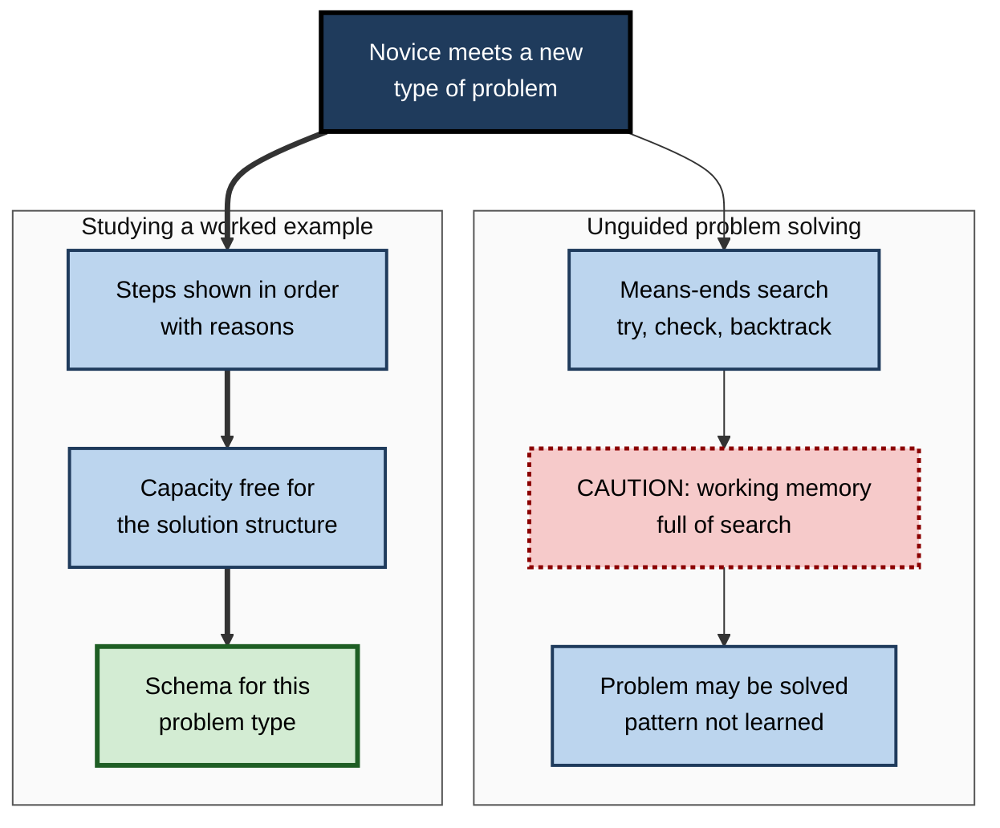
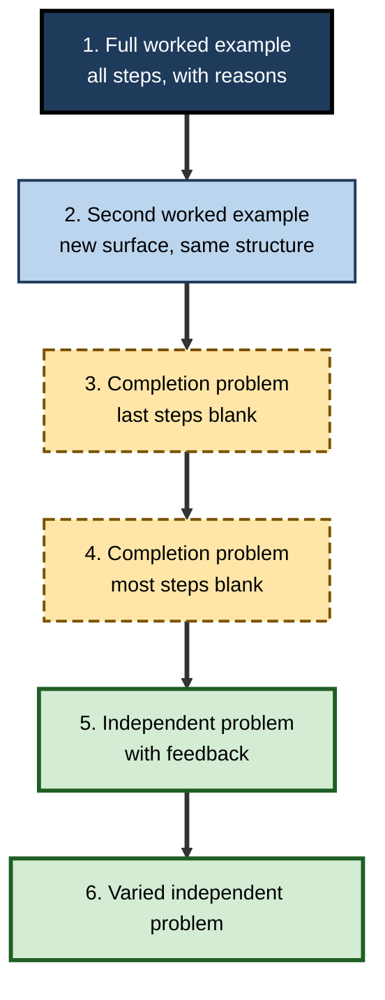

# I.6. Worked Examples Effect

> **In one sentence:** The worked examples effect is the finding that beginners learn a new kind of problem faster and better by studying fully solved, step-by-step examples than by trying to solve the same problems on their own.
>
> **Why it matters:** It is one of the most robust and practical findings in learning science. Any professional who trains others — in code, analysis, finance, sales, medicine or management — can apply it tomorrow with almost no cost.
>
> **Level span:** Novice → Expert · **Reading time:** ~18 min · **Builds on:** working memory limits, extraneous load, means–ends analysis

---

## The Learning Ladder

| Level | Badge | After this level you can... |
|---|---|---|
| 1 | NOVICE | Explain why studying a solved example can teach more than struggling alone. |
| 2 | FOUNDATIONS | Describe the effect, its key variants and the vocabulary around it. |
| 3 | PRACTITIONER | Build an example–problem sequence with fading for a real skill. |
| 4 | ADVANCED | Explain the mechanism, the meta-analytic evidence, boundary conditions, and the productive-failure debate. |
| 5 | EXPERT / PRO | Use worked examples at scale in onboarding, documentation, coaching and AI tutoring. |

---

## Level 1 · Novice — The Big Picture

When you learned to cook a new dish, you probably did not invent it from scratch. You watched someone make it, or followed a recipe step by step, and only later improvised. That recipe was a **worked example**: a complete, step-by-step demonstration of how to get from the problem to the solution.

The **worked examples effect** is the scientific finding that, for beginners, studying such examples often teaches more than solving problems unaided. This surprises many people, because "learning by doing" feels more active. The catch is that a beginner trying to solve an unfamiliar problem spends most of their mental energy searching — trying something, checking, backtracking — and has little left over to notice *why* the solution works.

You have already benefited from worked examples when:

- you copied the structure of a well-written email from a colleague before writing your own;
- you studied a solved spreadsheet formula, then adapted it to your data;
- you watched a senior colleague handle a difficult client call before taking one yourself.

The key idea for a beginner: **first see it done well, step by step; then do it yourself — with support that fades away.**

---

## Level 2 · Foundations — Core Concepts

### The original finding

In the mid-1980s, John Sweller and Graham Cooper showed that students who studied worked algebra examples learned to solve similar problems faster and made fewer errors than students who spent the same time solving the problems themselves. The explanation came from Sweller's earlier work: novices solving problems tend to use **means–ends analysis**, a search strategy that consumes working memory and leaves little capacity for learning the solution pattern.

### What makes a good worked example

A worked example shows:

1. the problem statement;
2. each step of the solution, in order;
3. ideally, the reason or principle behind each step;
4. the final answer.

It should be laid out so that explanation and steps are integrated (not split across pages), and it should highlight the structure that transfers to new problems.

### Key variants

| Variant | Description | When to use |
|---|---|---|
| **Example–problem pairs** | A worked example followed immediately by a similar problem to solve. | Standard default for novices. |
| **Completion problems** | Partly solved problems; learners fill in the missing steps. | Bridging from examples to independent work. |
| **Faded examples** | A series in which more steps are left blank each time. | Gradual transfer of responsibility. |
| **Modelling examples** | A person demonstrates and talks through the process (often on video). | Procedures, soft skills, tool use. |
| **Erroneous examples** | Examples containing mistakes for learners to find and fix. | Learners with some prior knowledge. |
| **Process-oriented examples** | Explain the reasoning and strategy, not just the steps. | Complex, less algorithmic tasks. |

**Figure I.6-1 — Why worked examples help novices.**

*How to read it:* both routes start with the same novice; the thick route ends in a schema, the thin route often ends with a solved problem but little learning.

### Key terms

| Term | Plain meaning |
|---|---|
| **Worked example** | A step-by-step demonstration of how to solve a problem. |
| **Means–ends analysis** | Problem solving by repeatedly reducing the difference between where you are and the goal. |
| **Completion problem** | A partly solved problem the learner finishes. |
| **Fading** | Gradually removing worked steps until the learner solves independently. |
| **Self-explanation** | The learner explaining to themselves why each step works. |

---

## Level 3 · Practitioner — Putting It to Work

### Building an example sequence with fading

1. **Choose the problem type** and write a clear, realistic example problem.
2. **Write a fully worked example** with every step and a short reason for each. Integrate explanations next to the steps.
3. **Write a second worked example** that differs on the surface (different context, numbers or data) but shares the same structure.
4. **Create a completion problem**: same structure, last one or two steps blank.
5. **Create a further completion problem** with more steps blank.
6. **Give an independent problem**, then a slightly varied one.
7. **Give feedback** with the worked solution after each attempt.

**Figure I.6-2 — A fading sequence from example to independence.**

*How to read it:* support decreases from top to bottom; long-dashed boxes are the bridging completion problems.

### Worked example — teaching junior analysts to write a cohort retention query

**Before:** a one-page explanation of window functions and date truncation, followed by "Write a query that shows monthly retention by signup cohort."

**After:**

1. A complete, commented query for weekly retention on a sample dataset, with each clause explained beside it.
2. A second complete query for a different product's monthly retention.
3. A version with the final aggregation missing.
4. A version with only the table and the goal given, plus a hint list.
5. An independent task on the analyst's real data, reviewed by a senior.

The test of success is not whether juniors can reproduce the sample query but whether, a week later and without the examples open, they can write a retention query for a new product and explain *why* each clause is there.

### Common mistakes at this level

- **Showing steps without reasons.** Learners copy surface features and fail on variations.
- **Using one example only.** Two or more examples with varied surfaces help learners extract the structure.
- **Separating explanation from steps.** That reintroduces split attention.
- **Never fading.** Learners who only study examples may not become independent.
- **Giving examples to experts.** For people who already know the procedure, examples become redundant (see expertise reversal).

---

## Level 4 · Advanced — Mechanisms, Models & Evidence

### Mechanism

Worked examples reduce extraneous load by replacing search with study. The learner's working memory can then be devoted to the intrinsic elements: the relationships between steps and the principle linking them. Over a series of examples, the learner builds a **problem schema** — a recognisable category of problem with an associated solution procedure.

### Evidence

- **Meta-analytic support.** A 2023 meta-analysis by Barbieri, Miller-Cotto, Clerjuste and Chawla synthesised 43 articles (55 studies, 181 effect sizes) on mathematics from elementary school to university. The average effect of worked examples on performance was medium (g about 0.48).
- **Moderators in that meta-analysis.** Correct examples alone produced larger effects than incorrect examples or mixed correct-and-incorrect examples. Surprisingly, adding self-explanation prompts was associated with *smaller* effects than examples without prompts — consistent with the idea that prompts add load for novices, though the finding needs replication across domains.
- **Breadth.** The effect has been demonstrated in mathematics, physics, programming, chess, statistics, medicine, writing and other domains, including adult and professional learners.

### Boundary conditions

| Condition | What happens |
|---|---|
| **Learner expertise** | As expertise grows, the advantage shrinks and can reverse; problem solving becomes better. |
| **Element interactivity** | Effect is strongest for complex, interacting material; weak for simple content. |
| **Example quality** | Badly structured or split-format examples lose much of the benefit. |
| **Engagement** | Learners who skim examples without processing them gain little; example–problem pairs help keep them active. |

### Guidance fading

Alexander Renkl, Robert Atkinson and colleagues showed in the early 2000s that **backward fading** (removing the last step first, then the second-to-last) and similar schemes support the transition from studying to solving. The general principle — reduce support as expertise grows — is called the **guidance fading effect** in CLT.

### The productive-failure debate

A competing line of research, led by Manu Kapur, argues for **productive failure**: letting learners attempt a problem *before* instruction, generating flawed solutions, then providing instruction that builds on their attempts. A 2021 meta-analysis by Sinha and Kapur (53 studies, 166 comparisons, over 12,000 participants) found problem-solving-first designs improved conceptual understanding and transfer (d about 0.36) compared with instruction-first, *when implemented with fidelity* to productive-failure principles, without harming procedural knowledge.

How to reconcile this with worked examples:

- Productive failure is followed by **explicit instruction**, often including worked solutions. It is not unguided learning.
- The benefits appear mainly for **conceptual understanding and transfer**, while worked examples reliably build procedural skill efficiently.
- Effects depend heavily on design fidelity and learner characteristics.
- CLT researchers note that the failed attempt may activate prior knowledge and show learners what they do not know, which can be consistent with CLT when intrinsic load of the exploration is manageable.

The debate is live and productive; neither side supports minimally guided discovery for novices.

---

## Level 5 · Expert / Pro — Professional Mastery

### Worked examples across professional settings

| Setting | Professional form of a worked example |
|---|---|
| Software engineering | Annotated reference pull requests; "golden path" sample services; Parsons problems (rearranging given code lines) for juniors. |
| Data and analytics | Commented notebooks that solve a realistic question, then a variant with gaps. |
| Consulting and strategy | Annotated past deliverables showing structure and reasoning, not just slides. |
| Sales and customer success | Recorded calls with commentary at decision points; scripts with rationale. |
| Management | Walk-throughs of a real performance conversation or prioritisation decision with the reasoning made explicit. |
| Healthcare and safety-critical work | Modelling examples of procedures with think-aloud commentary. |

### Generative AI as a worked-example engine

AI tools can now generate worked examples on demand, tailored to a learner's context. This is powerful, with three cautions:

1. **Accuracy.** Generated examples can contain subtle errors; in high-stakes domains they need expert review.
2. **Structure.** Request reasons for each step and two varied examples with the same structure.
3. **Fading.** Configure tutors to move from examples to hints to independent attempts, not to keep supplying full solutions. Field evidence from 2024 to 2026 shows that unrestricted answer-giving can raise practice performance while lowering later unaided performance.

### Professional scenario

**Role:** Engineering manager responsible for on-call readiness.
**Situation:** New engineers dread their first on-call rotation; incident handling is slow and inconsistent.
**What the pro does:** Builds a library of five annotated past incidents, each showing the alert, the diagnostic steps taken, the reasoning at each step and the resolution. New engineers study two, then "shadow-complete" a third where the last diagnostic steps are hidden, then handle a simulated incident with a senior observer, then join the rotation with a buddy for the first week. Time-to-mitigate in first rotations improves, and the library becomes part of the onboarding standard, with new incidents added after each post-incident review.

### Expert-level judgement

- **Examples first for novices; problems first for the experienced.** Use diagnostics to tell the difference.
- **Two or more examples per structure** with varied surfaces.
- **Fade deliberately**; set criteria for when support is removed.
- **Problem-first designs** can be valuable for conceptual goals if followed by strong instruction.

---

## Myths vs. Evidence

| Myth | What the evidence shows |
|---|---|
| "Learning by doing always beats studying examples." | For novices, studying worked examples typically produces better learning than unguided problem solving. |
| "Worked examples make learners passive." | Example–problem pairs, completion problems and fading keep learners active. |
| "Self-explanation prompts always improve examples." | A 2023 mathematics meta-analysis found prompts associated with smaller benefits; effects depend on learner and task. |
| "Productive failure proves examples are wrong." | Productive failure includes explicit instruction afterwards and benefits mainly conceptual transfer; both approaches reject unguided discovery for novices. |
| "Once something works for beginners, it works for everyone." | The worked example advantage shrinks and can reverse as expertise grows. |

## Practitioner Toolkit

**Worked example design checklist**

- [ ] Problem is realistic for the audience.
- [ ] Every step shown, with a short reason.
- [ ] Explanations sit next to the steps they explain.
- [ ] At least two examples share structure but differ in surface.
- [ ] Completion problems bridge to independent work.
- [ ] Fading criteria defined (for example, two correct completions in a row).
- [ ] Experienced learners can skip to problems.

**Template — example sequence plan**

| Step | Item | Steps shown | Steps left to learner | Feedback |
|---|---|---|---|---|
| 1 | Worked example A | All | None | — |
| 2 | Worked example B | All | None | — |
| 3 | Completion problem | First half | Second half | Worked solution |
| 4 | Independent problem | None | All | Worked solution |

## Self-Check

1. **[NOVICE]** Why can studying a solved example teach more than solving alone?
2. **[FOUNDATIONS]** What did Sweller and Cooper find?
3. **[FOUNDATIONS]** What is a completion problem?
4. **[PRACTITIONER]** Describe a fading sequence for a skill from your work.
5. **[ADVANCED]** What average effect did the 2023 mathematics meta-analysis find, and which moderator was surprising?
6. **[ADVANCED]** Name two boundary conditions of the worked examples effect.
7. **[ADVANCED]** How can productive failure and worked examples both be supported by evidence?
8. **[EXPERT / PRO]** How would you configure an AI tutor to use worked examples well?

### Answer Key

1. Problem solving by search uses most of working memory, leaving little for learning the pattern; studying an example frees capacity for the structure.
2. Students studying worked algebra examples learned faster and made fewer errors than those solving equivalent problems.
3. A partly solved problem in which the learner completes the missing steps.
4. Answers vary; should run from full examples through completion problems to independent tasks with feedback.
5. A medium effect (g about 0.48); self-explanation prompts were associated with smaller effects.
6. Learner expertise (effect reverses for experts) and element interactivity (weak for simple material); also example quality.
7. Productive failure includes explicit instruction after exploration and benefits mainly conceptual transfer; worked examples efficiently build procedures for novices. Neither supports unguided discovery.
8. Generate varied, step-by-step examples with reasons; move from examples to hints to independent attempts; require a learner attempt before showing solutions; review accuracy.

## Key Takeaways

- For novices, **studying worked examples beats unguided problem solving**.
- The mechanism is **reduced search load**, freeing capacity for the solution structure.
- **Fade support** through completion problems to independent practice.
- Use **multiple examples** with varied surfaces and explicit reasons.
- The benefit **shrinks and can reverse** with expertise.
- **Productive failure** is a compatible, conceptually focused alternative when followed by instruction.

## Glossary

| Term | Meaning |
|---|---|
| Backward fading | Removing worked steps starting from the last step. |
| Completion problem | A partly solved problem finished by the learner. |
| Erroneous example | An example containing errors for learners to detect and correct. |
| Guidance fading effect | Better learning when support is reduced gradually as expertise grows. |
| Means–ends analysis | Problem solving by reducing the difference between current state and goal. |
| Modelling example | A demonstration by a person, often with spoken reasoning. |
| Parsons problem | A programming exercise in which learners arrange given code lines into a working solution. |
| Problem schema | Knowledge of a problem category and its solution procedure. |
| Productive failure | Problem solving before instruction, followed by explicit instruction. |
| Worked example | A step-by-step demonstration of a problem's solution. |
