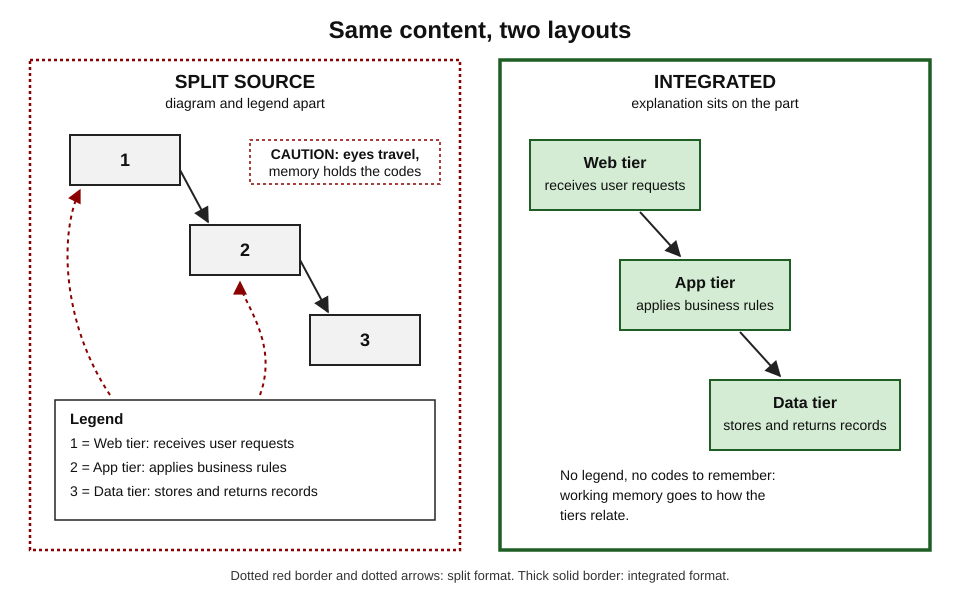
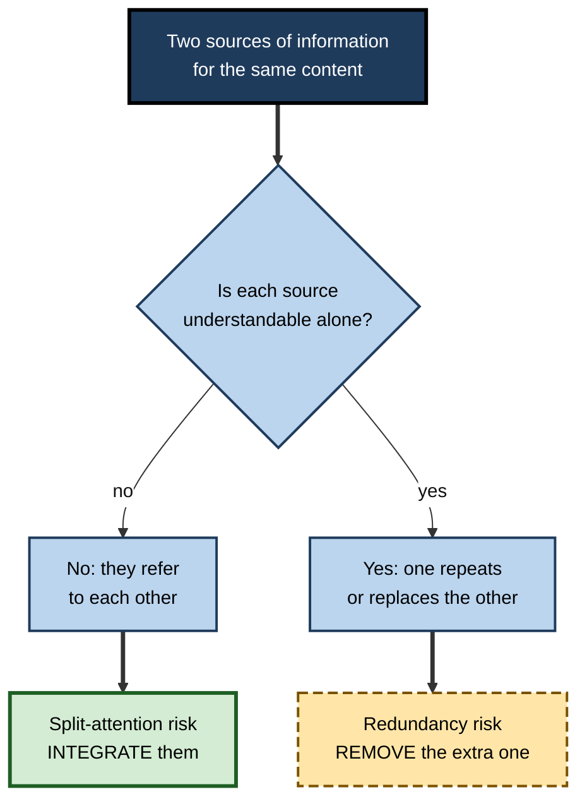
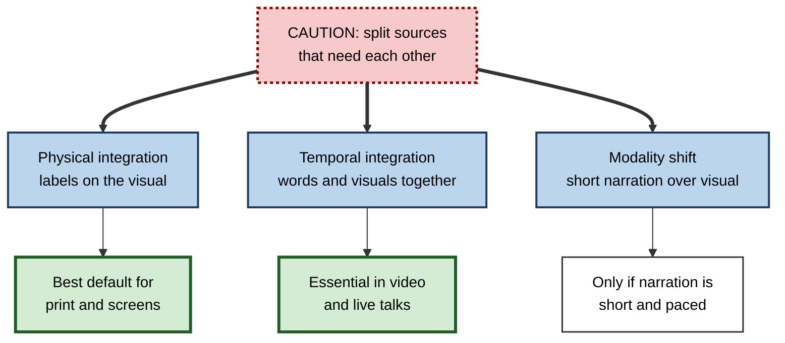

# I.7. Split-Attention Effect

> **In one sentence:** The split-attention effect is the finding that people learn less when they must flip between separate pieces of information — a diagram here, its explanation there — to make sense of them, and learn more when those pieces are combined in one place and time.
>
> **Why it matters:** Split formats are everywhere at work: dashboards with legends far from the data, slides followed by handouts, code separated from its documentation, video with instructions in another window. Fixing them is one of the cheapest, best-evidenced improvements a professional can make.
>
> **Level span:** Novice → Expert · **Reading time:** ~17 min · **Builds on:** working memory limits, extraneous load

---

## The Learning Ladder

| Level | Badge | After this level you can... |
|---|---|---|
| 1 | NOVICE | Recognise split-source material and say why it is harder to use. |
| 2 | FOUNDATIONS | Define spatial and temporal split attention and integrated formats. |
| 3 | PRACTITIONER | Convert split-source materials into integrated designs. |
| 4 | ADVANCED | Explain the mechanism, meta-analytic evidence, boundary conditions and the link to redundancy. |
| 5 | EXPERT / PRO | Embed integration standards in documentation, dashboards, training and interface design. |

---

## Level 1 · Novice — The Big Picture

Have you ever assembled something where the instructions said "attach part C7 to bracket F2", and you had to look at a parts list on another page to find out what C7 and F2 were? Every step meant looking away, remembering a code, finding the part, and coming back. You probably lost your place more than once.

That is **split attention**: your attention is split between separate sources that only make sense together, and your memory has to hold one while you search the other. The **split-attention effect** is the research finding that this arrangement reduces learning, and that putting the information together — for example, writing the part names directly on the picture — improves it.

You have already met split attention when:

- a chart's legend was so far from the lines that you kept looking back and forth;
- a lecturer talked about slide 12 while the handout was open at page 4;
- a tutorial video showed code that you had to type into a different window while remembering it.

The key idea for a beginner: **if two things must be understood together, put them together.**

---

## Level 2 · Foundations — Core Concepts

### Definition

The **split-attention effect** occurs when learners must mentally integrate two or more sources of information that are separated in space or time, and each source cannot be understood on its own. The mental integration consumes working memory — extraneous load — leaving less for learning. Physically integrating the sources removes that cost.

The effect was first systematically studied by Paul Chandler and John Sweller around 1991, initially with geometry and engineering materials, and has since been replicated across many domains.

### Two forms

| Form | What is separated | Example | Fix |
|---|---|---|---|
| **Spatial split attention** | Sources placed apart on the page or screen | Diagram with a separate legend | Place labels and explanations on or beside the diagram |
| **Temporal split attention** | Sources presented one after another | Narration explaining an animation that plays afterwards | Present related words and images at the same time |

In Richard Mayer's multimedia learning research, the same ideas appear as the **spatial contiguity** and **temporal contiguity** principles.

*Figure I.7-1 — Split-source versus integrated format.* Left (dotted border): numbered parts and a separate legend force the eye to travel and memory to hold codes. Right (thick solid border): each explanation sits on its part.

### Key terms

| Term | Plain meaning |
|---|---|
| **Split-source format** | Information that must be combined is presented in separate places or times. |
| **Integrated format** | The related pieces are combined physically or presented together. |
| **Spatial contiguity** | Placing related words and pictures close together. |
| **Temporal contiguity** | Presenting related words and pictures at the same time. |
| **Mutually referring** | Sources that each need the other to be understood. |

### When is it split attention, and when is it redundancy?

The test is simple: **can each source be understood alone?**

**Figure I.7-2 — Diagnosing split attention versus redundancy.**

*How to read it:* the same starting point leads to opposite fixes depending on whether the sources need each other.

---

## Level 3 · Practitioner — Putting It to Work

### The integration method

1. **Find mutually referring sources.** Look for legends, keys, footnotes, "see figure", numbered callouts, separate handouts, code with separate explanations, and narration out of sync with visuals.
2. **Decide which source is the anchor**, usually the visual (diagram, screenshot, code, chart).
3. **Move text onto or beside the anchor**: direct labels, callouts with leader lines, comments next to code lines.
4. **Keep the integrated text short.** Integration fails if the visual drowns in paragraphs; long explanations go next to the relevant region, not on top of it.
5. **Synchronise in time.** In video and live talks, speak about what is on screen now; reveal parts as you discuss them.
6. **Check for leftovers.** Remove any legend or explanation now duplicated.

### Worked example — a monthly operations dashboard

| Feature | Before (split) | After (integrated) |
|---|---|---|
| Line chart | Six colored lines with a legend box at the bottom right | Each line labelled directly at its right end |
| Thresholds | Explained in a footnote | Threshold line drawn on the chart with a short label |
| Metric definitions | On a separate "definitions" tab | Brief definition in a tooltip and a one-line subtitle |
| Commentary | Separate email from the analyst | Two short annotations at the points that changed |

Readers stop flipping between tabs; questions about "which line is which" disappear; meetings spend time on the decision rather than decoding the chart.

### Worked example — a code tutorial

**Before:** the full code listing on one page; numbered explanations on the following page ("Line 14 creates the connection pool...").
**After:** explanatory comments placed beside the relevant lines, or the listing broken into short chunks, each followed immediately by its explanation, with a final complete listing for reference.

### Common mistakes at this level

- **Over-integrating.** Cramming paragraphs into a diagram creates clutter; integrate *short* labels and place longer text adjacent.
- **Integrating redundant material.** If the diagram is self-explanatory to this audience, adding text creates redundancy instead.
- **Forgetting time.** Narration that describes a step before it appears on screen is temporal split attention.
- **Relying on color legends.** Color keys are a classic split source and fail in grey-scale print and for color-blind readers.

---

## Level 4 · Advanced — Mechanisms, Models & Evidence

### Mechanism

When sources are separated, the learner must hold elements from one source in working memory while searching for the corresponding elements in the other. Search and holding are extraneous processes; they add interacting elements unrelated to the content. Integration removes the search, letting the learner devote resources to the relations within the content itself.

### Evidence

- A 2018 meta-analysis by Noah Schroeder and Ali Cenkci on spatial contiguity and spatial split attention in multimedia environments found an overall effect of about g = 0.63 across 58 comparisons and more than 2,400 participants, with integrated designs benefiting learning across many moderator conditions.
- A 2022 overview of multimedia design meta-analyses by Noetel and colleagues (29 reviews, about 1,189 studies, 78,000 participants) placed spatial and temporal contiguity among the principles with the largest and most reliable benefits.
- Studies continue to probe details: for example, a 2024 study examined whether the size of presented materials changes the effect, and research with eye-tracking and brain imaging (including functional near-infrared spectroscopy in 2025) explores how proximity changes visual search and processing.

### Boundary conditions

| Condition | What happens |
|---|---|
| **Sources not mutually referring** | No split-attention effect; adding the second source may cause redundancy instead. |
| **Low element interactivity** | Little benefit; simple material leaves enough spare capacity. |
| **High learner expertise** | Experts may not need the text at all; integrated text can become redundant. |
| **Very dense integration** | Clutter can create its own extraneous load. |
| **Learner control** | Learners who can rearrange materials themselves can reduce split attention on their own. |

### Self-management of split attention

Since about the late 2010s, CLT researchers have studied whether learners can be taught to integrate split materials themselves — for instance, by moving text boxes next to the relevant parts of a diagram on a screen, or annotating printouts. Results suggest this can work and may transfer to new materials, which matters because workplace learners frequently face undesigned material. Treat this as promising, not settled.

### Relation to the modality effect

One classic way to remove split attention between a diagram and *written* text is to present the text as *speech* instead, so the eyes stay on the diagram — the **modality effect**. This works best when the narration is short and synchronised; long or complex spoken explanations become transient and can overload memory. Modality is discussed further with multimedia principles.

**Figure I.7-3 — Three ways to resolve split attention.**

*How to read it:* three fixes for the same problem, each with its main condition of use.

---

## Level 5 · Expert / Pro — Professional Mastery

### Integration as a professional standard

- **Documentation and developer experience.** Put code and explanation together; place configuration options next to the fields they control; avoid "see section 4.3" chains.
- **Data visualisation.** Direct labelling instead of legends; annotations on the chart; definitions in subtitles and tooltips. This also improves accessibility and print legibility.
- **Training delivery.** Talk to what is on screen; reveal diagram parts progressively; avoid parallel handouts during explanation.
- **Software interfaces and procedures.** In-context help and inline validation rather than separate manuals; checklists placed at the point of use.
- **Augmented and mixed reality.** Overlaying instructions on the real equipment is integration in its purest form; recent studies in technical-skill training use mixed reality to test spatial contiguity directly. The overlay must still be uncluttered and accurate.

### AI-era implications

AI assistants embedded inside tools — explaining the line of code under the cursor, or the chart a user is looking at — are an integrated format by design. A chatbot in a separate window, by contrast, can create split attention: users copy context across and hold it in mind. Product teams designing learning assistants should prefer in-context explanation for complex tasks.

### Professional scenario

**Role:** Technical writer for a cloud infrastructure product.
**Situation:** Support tickets show customers misconfigure a networking feature, even though every option is documented.
**What the pro does:** Notices the setup guide shows a screenshot of the console with numbered callouts and a numbered list on the next screen, and that option explanations live on a separate reference page. Rewrites the guide so each step shows the relevant console fragment with labels on the fields, places a one-sentence explanation of each option beside it, and links nothing out mid-procedure. Ticket volume on the feature falls, and the team adds "no split sources in procedures" to the style guide.

### Expert-level judgement

- **Integrate what must be understood together; remove what is not needed.** The two rules always work as a pair.
- **Design for the medium.** Print, screen, video and AR each need their own integration techniques.
- **Test with the target audience.** What is mutually referring for a novice may be redundant for an expert.

---

## Myths vs. Evidence

| Myth | What the evidence shows |
|---|---|
| "A legend is as good as direct labels." | Separated legends require search and holding in memory; integrated labels reliably improve learning of complex material. |
| "More text on the diagram always helps." | Only mutually referring information should be integrated; extra text can cause redundancy and clutter. |
| "Handouts during a talk support learning." | Parallel handouts that require cross-referencing during explanation often split attention; give them before or after. |
| "This only matters for school textbooks." | The effect has been found across domains and adult learners, and applies to dashboards, documentation and interfaces. |
| "Narration always fixes split attention." | Only when brief and synchronised; long narration becomes transient and can overload. |

## Practitioner Toolkit

**Integration checklist**

- [ ] No legends where direct labels are possible.
- [ ] Explanations sit next to the parts they explain.
- [ ] No "see figure X" or "see page Y" during a procedure.
- [ ] Code explanations are beside or immediately after the relevant lines.
- [ ] Narration describes what is on screen at that moment.
- [ ] Integrated text is short; longer text placed adjacent.
- [ ] Anything duplicated after integration is removed.

**Template — split-source finder**

| Location | Source A | Source B | Mutually referring? | Fix (integrate or remove) |
|---|---|---|---|---|
| | | | | |

## Self-Check

1. **[NOVICE]** What is split attention, in everyday words?
2. **[FOUNDATIONS]** What is the difference between spatial and temporal split attention?
3. **[FOUNDATIONS]** What question tells you whether to integrate or remove a source?
4. **[PRACTITIONER]** Give three changes that would integrate a dashboard.
5. **[ADVANCED]** Why does split attention increase extraneous load?
6. **[ADVANCED]** What did the 2018 meta-analysis find?
7. **[ADVANCED]** Name two boundary conditions.
8. **[EXPERT / PRO]** How does an in-tool AI assistant relate to split attention compared with a separate chat window?

### Answer Key

1. Having to look back and forth between separate pieces of information that only make sense together.
2. Spatial: sources separated on the page or screen. Temporal: related sources presented at different times.
3. Can each source be understood alone? If not, integrate; if yes, consider removing the redundant one.
4. Direct labels on lines, thresholds drawn on the chart, definitions in subtitles or tooltips, annotations at key points.
5. The learner must hold elements from one source while searching the other, adding processing unrelated to the content.
6. A medium overall benefit (about g = 0.63 across 58 comparisons) for integrated over separated designs.
7. Sources that are not mutually referring; low element interactivity; high expertise; over-dense integration.
8. In-tool explanation is integrated with the object being studied; a separate window can force users to carry context across, creating split attention.

## Key Takeaways

- When two sources **need each other**, **put them together** in space and time.
- Split attention adds **search and holding** to working memory: pure extraneous load.
- The effect is **well replicated** with a medium average benefit.
- If a source is understandable alone, the problem is **redundancy**, and the fix is removal.
- Integrate **short** text; avoid clutter.
- Apply it to **dashboards, docs, code, video, interfaces and AI assistants**, not just lessons.

## Glossary

| Term | Meaning |
|---|---|
| Direct labelling | Labelling chart elements at their location rather than in a legend. |
| Integrated format | A design in which mutually referring sources are combined. |
| Modality effect | Better learning when verbal explanation of a visual is spoken rather than written, under suitable conditions. |
| Mutually referring sources | Sources that cannot be understood without each other. |
| Spatial contiguity | Placing related words and images close together. |
| Split-attention effect | Reduced learning when learners must integrate separated, mutually referring sources. |
| Split-source format | A design that separates mutually referring sources. |
| Temporal contiguity | Presenting related words and images simultaneously. |
