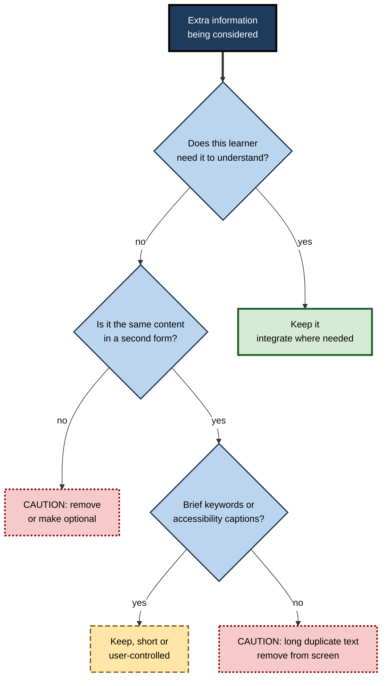
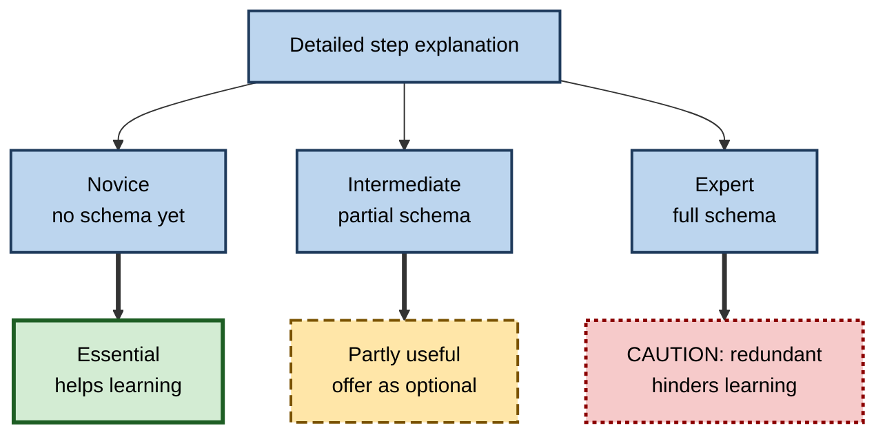

# I.8. Redundancy Effect in Instruction

> **In one sentence:** The redundancy effect is the finding that adding information learners do not need — including repeating the same information in a second form — can make learning worse, not better.
>
> **Why it matters:** "More is safer" is the default instinct in training, documentation and presentations. The redundancy effect shows when that instinct backfires, and recent research shows when some overlap is actually helpful — knowledge that separates thoughtful designers from rule-followers.
>
> **Level span:** Novice → Expert · **Reading time:** ~17 min · **Builds on:** extraneous load, split attention

---

## The Learning Ladder

| Level | Badge | After this level you can... |
|---|---|---|
| 1 | NOVICE | Explain why "say it twice" does not always help. |
| 2 | FOUNDATIONS | Define the redundancy effect and distinguish its main forms. |
| 3 | PRACTITIONER | Remove harmful redundancy from slides, videos and documents while keeping useful overlap. |
| 4 | ADVANCED | Explain the mechanism, the 2023 two-type framework, boundary conditions and accessibility tensions. |
| 5 | EXPERT / PRO | Set redundancy policies for content teams that balance learning, accessibility and audience expertise. |

---

## Level 1 · Novice — The Big Picture

Imagine a colleague giving you directions while also handing you a written note that says exactly the same thing, word for word, and insisting you read along as they speak. Instead of helping, it is distracting: you try to match the voice to the words, you read faster or slower than they talk, and you end up following neither well.

That is the **redundancy effect**: when instruction includes information that is unnecessary for learning — either because it duplicates something already given or because the learner already knows it — it can reduce learning. The learner still has to process the extra material, even if only to realise it is not needed.

You have already met redundancy when:

- a presenter read every bullet point aloud;
- a perfectly clear diagram came with a paragraph describing what the diagram already showed;
- an e-learning course explained basic steps you have done a hundred times, and you could not skip them.

The key idea for a beginner: **everything you add costs the learner attention. Add only what helps this learner.**

---

## Level 2 · Foundations — Core Concepts

### Definition

In cognitive load theory, the **redundancy effect** occurs when presenting additional information — the same information in another form, or information not needed for understanding — produces worse learning than presenting the essential information alone. The additional processing is extraneous load.

The effect was described by Chandler and Sweller in the early 1990s, when they found that a self-explanatory diagram learned better *without* accompanying text that restated it.

### Common forms

| Form | Example |
|---|---|
| **Same words, two channels** | Narration plus identical on-screen text in a long explanation. |
| **Self-explanatory visual plus text** | A clear flowchart with a paragraph narrating each box. |
| **Elaborations the learner does not need** | Extra background, history or definitions for an audience that already knows them. |
| **Duplicate sources** | The same procedure in a slide, a handout and a video at the same time. |

### Two types of redundancy (2023 framework)

A 2023 review of 63 studies by Trypke and colleagues distinguished two types:

| Type | Meaning | What the review found |
|---|---|---|
| **Content redundancy** | Additional content that overlaps with or adds to the essential content | Effects were often positive; whether it helps depends on learners' prior knowledge. |
| **Working-memory-channel redundancy** | The same content presented in more than one form (for example written plus spoken) | Negative for written text added to visualisations; but narration plus written text was sometimes positive. |

This refines the classic message. Not all overlap is harmful; it depends on what is duplicated, in which form, and for whom.

**Figure I.8-1 — A decision guide for redundancy.**

*How to read it:* start at the top; dotted-border outcomes mean remove or reduce; the long-dashed outcome means keep but limit.

### Key terms

| Term | Plain meaning |
|---|---|
| **Redundancy effect** | Worse learning when unnecessary information is added. |
| **Content redundancy** | Additional overlapping or elaborating content. |
| **Channel redundancy** | The same content in more than one form, such as written and spoken. |
| **Self-explanatory** | Understandable on its own without extra explanation. |
| **Expertise-related redundancy** | Information that helps novices but is unnecessary for experienced learners. |

---

## Level 3 · Practitioner — Putting It to Work

### The redundancy edit

1. **Identify the core carrier** of each idea: the diagram, the narration, the code, or the text.
2. **For every additional element, ask:** does this audience need it to understand? If not, delete it or move it to an optional layer.
3. **For narrated visuals:** keep on-screen text to labels and short key phrases; let narration carry the explanation.
4. **For self-explanatory visuals:** cut paragraphs that restate the visual; keep only what adds meaning (why, not what).
5. **For mixed audiences:** offer optional depth — expandable glossary entries in digital material, a "basics" appendix, or a skip-ahead path.
6. **Keep accessibility layers** (captions, transcripts, alt text) available but user-controlled.

### Worked example — a product training video

| Element | Before | After |
|---|---|---|
| On-screen text | Full sentences mirroring narration | Two to four keywords per scene |
| Diagram explanation | Narration plus caption box describing each part | Narration while parts highlight; labels on parts |
| Intro | Two minutes recapping company history | Removed; available as a separate optional video |
| Basics | Mandatory "what is a dashboard" segment | Skippable chapter marked "new to dashboards?" |
| Captions | Burned-in, always on | Closed captions available, user-controlled |

The video becomes shorter, cleaner and more accessible at once.

### Common mistakes at this level

- **Applying "never put text with narration" absolutely.** Short keywords, technical terms, numbers and second-language captions can help.
- **Removing accessibility features in the name of redundancy.** Captions and transcripts serve people who cannot use audio; make them available but optional.
- **Cutting essential explanations for novices** because experts find them redundant.
- **Confusing redundancy with repetition over time.** Revisiting material later (spacing, retrieval) is not the redundancy effect; that is beneficial review.

---

## Level 4 · Advanced — Mechanisms, Models & Evidence

### Mechanism

Redundant information still has to be processed: read, heard, compared to the other source and judged unnecessary. For narration plus identical on-screen text, learners may also try to synchronise reading and listening, which proceed at different speeds. That coordination and comparison are extraneous processes.

### Evidence and nuance

- Classic CLT and multimedia studies found that removing redundant text from self-explanatory diagrams, and removing on-screen text duplicating narration, often improved learning, especially with complex material and short, fast-paced presentations.
- The 2022 meta-meta-analysis by Noetel and colleagues reported robust evidence for verbal redundancy effects overall, while also finding large benefits of **captions for second-language video** — a case where duplicating speech in text helps because the learner cannot easily process the spoken language alone.
- The 2023 review by Trypke and colleagues, and a companion experimental paper by Albers and colleagues in the same year, show that redundancy effects depend on the *type* of redundancy and on prior knowledge: content overlap can help, written text added to visuals tends to hurt, and narration plus written text sometimes helps.
- Recent studies of software video tutorials suggest that signalling overlaps — short on-screen highlights matching the narration — can reduce extraneous load and improve retention rather than harm it.

### Boundary conditions

| Condition | Effect |
|---|---|
| **Learner pace** | Learner-controlled pacing reduces harm from narration plus text. |
| **Length** | Short phrases are less harmful than long duplicated passages. |
| **Second language or unfamiliar terms** | Text support can help. |
| **Prior knowledge** | Elaborations help novices and become redundant for experts. |
| **Element interactivity** | Effects are larger for complex material. |

### The link to expertise reversal

The **expertise reversal effect** is, at its core, a redundancy effect over time. Explanations that are essential for a novice become redundant once the learner has the relevant schemas, and processing them then hinders learning. This is why the same course can be ideal for one audience and counterproductive for another.

**Figure I.8-2 — How the same explanation shifts from essential to redundant.**

*How to read it:* one explanation, three learners, three different effects.

### Accessibility and inclusion

Accessibility standards require captions, transcripts and text alternatives. These are not in conflict with the redundancy effect if they are **available and user-controlled** rather than forced on all learners at all times. Learners who need them benefit; others can turn them off. Some learners — those with hearing differences, second-language learners, or people in noisy environments — may experience captions as essential, not redundant. Redundancy is always relative to the learner.

---

## Level 5 · Expert / Pro — Professional Mastery

### Redundancy policies for content teams

- **Single source of truth per idea in each piece of material.** Decide whether the diagram, narration or text carries it; others support only.
- **Layered content.** Core path lean; optional depth, glossary and basics available on demand.
- **Audience routing.** Diagnostics allow experienced learners to skip basics.
- **Accessible by default, optional by choice.** Captions and transcripts always available; never forced on-screen duplication.
- **Documentation hygiene.** Remove duplicate pages explaining the same procedure; duplicates drift out of sync and force readers to compare versions — redundancy and confusion together.

### Presentations and meetings

For live presentations, the most common redundancy is slides full of sentences read aloud. Professionals use slides for visuals, labels and key numbers and speak the explanation; a written document can be circulated before or after for those who need detail. Some organisations replace slide decks with written memos read in silence at the start of meetings — a different solution to the same problem: one channel at a time.

### AI-era implications

Generative AI tends to produce verbose output: summaries that restate the question, caveats repeated in every paragraph, and explanations at a level the user did not need. For learners, this is redundancy at scale. Good practice for AI-assisted learning tools: configure concise answers, adapt explanation depth to the learner's demonstrated level, and avoid auto-generated on-screen text that duplicates generated narration in AI-produced videos.

### Professional scenario

**Role:** Learning experience designer converting a two-day classroom course into e-learning.
**Situation:** The first draft has narration over slides containing the same sentences; each module begins with a three-minute recap; experienced staff complain the course is slow.
**What the pro does:** Reduces on-screen text to keywords and labelled visuals; moves recaps into optional "refresh" segments; adds a pre-test that lets experienced staff skip modules they pass; keeps closed captions and downloadable transcripts. Completion time drops, delayed scenario-test scores hold steady for novices and improve for experienced staff, who now spend their time on the advanced cases.

---

## Myths vs. Evidence

| Myth | What the evidence shows |
|---|---|
| "Saying it twice in two formats reinforces learning." | Same content in two channels at once often hurts, especially written text with visuals; some combinations can help. |
| "Never put any text with narration." | Short keywords, labels, technical terms and second-language captions can help; long duplicated passages tend to hurt. |
| "Redundancy rules conflict with accessibility." | Captions and transcripts can be available and user-controlled; this satisfies both. |
| "More background is always helpful." | Background novices need can be redundant for experts and slow them down. |
| "Repeating material across weeks is redundant." | Revisiting material over time (spacing, retrieval) is beneficial and is not the redundancy effect. |

## Practitioner Toolkit

**Redundancy checklist**

- [ ] Each idea has one primary carrier.
- [ ] On-screen text during narration is limited to labels and keywords.
- [ ] Self-explanatory visuals carry no restating paragraphs.
- [ ] Basics and background are optional or routed by diagnostic.
- [ ] Captions and transcripts are available and user-controlled.
- [ ] No duplicate documents describing the same procedure.

**Template — redundancy edit log**

| Element | Primary carrier | Duplicate or unneeded? | Action (cut, shorten, make optional) |
|---|---|---|---|
| | | | |

## Self-Check

1. **[NOVICE]** Why can repeating the same words in speech and on screen hurt?
2. **[FOUNDATIONS]** Define the redundancy effect.
3. **[FOUNDATIONS]** What are the two types of redundancy in the 2023 framework?
4. **[PRACTITIONER]** How would you edit a narrated slide deck for redundancy?
5. **[ADVANCED]** Give two situations where text alongside narration can help.
6. **[ADVANCED]** How is expertise reversal related to redundancy?
7. **[ADVANCED]** How can redundancy guidance and accessibility requirements both be met?
8. **[EXPERT / PRO]** What redundancy problems do generative-AI tools introduce, and how would you mitigate them?

### Answer Key

1. Learners must process both, try to synchronise them at different speeds, and compare them, consuming working memory.
2. Worse learning when unnecessary information — duplicate or not needed by the learner — is added to essential information.
3. Content redundancy (additional overlapping content) and working-memory-channel redundancy (same content in multiple forms).
4. Cut on-screen sentences to keywords and labels, let narration explain, remove restating captions, make basics optional, keep captions user-controlled.
5. Second-language learners; short keywords or technical terms; learner-paced presentations; brief signalling highlights.
6. Information essential for novices becomes redundant for experts and then hinders their learning.
7. Make captions, transcripts and alternatives available and user-controlled rather than forced on-screen duplicates.
8. Verbose, repetitive answers at the wrong level; mitigate with concise settings, adaptive depth, and avoiding duplicated on-screen text in generated media.

## Key Takeaways

- Unneeded or duplicated information **still costs attention**.
- Classic harm: **written text duplicating narration** or restating a **self-explanatory visual**.
- Recent work shows **not all overlap is harmful**: type of redundancy and prior knowledge matter.
- Redundancy is **relative to the learner**; expertise reversal is redundancy over time.
- **Accessibility layers** should be available and user-controlled.
- Give each idea **one primary carrier** and make extras optional.

## Glossary

| Term | Meaning |
|---|---|
| Channel redundancy | The same content in two forms, such as written and spoken, presented together. |
| Closed captions | Captions the user can turn on or off. |
| Content redundancy | Additional content overlapping with or elaborating essential content. |
| Expertise-related redundancy | Information unnecessary for experienced learners. |
| Layered content | A lean core with optional depth available on demand. |
| Primary carrier | The single element chosen to convey a given idea. |
| Redundancy effect | Worse learning when unnecessary information is added. |
| Self-explanatory | Understandable without additional explanation. |
