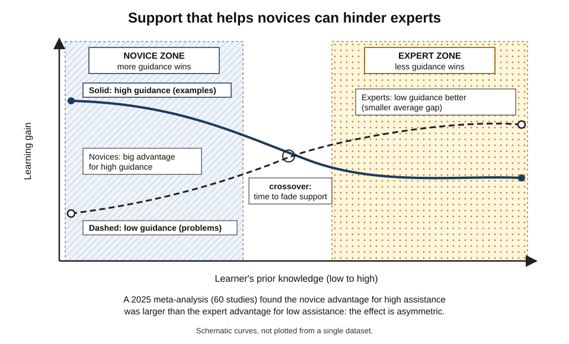
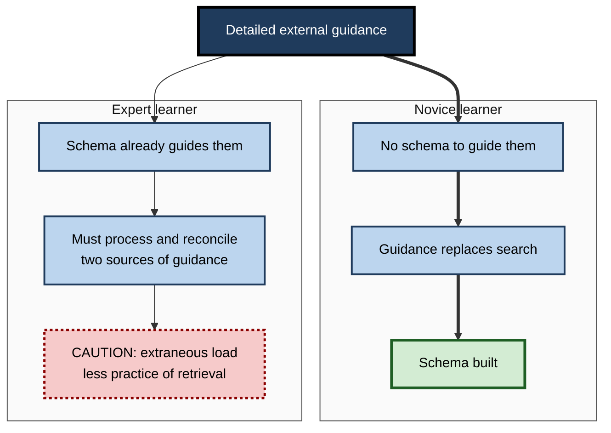
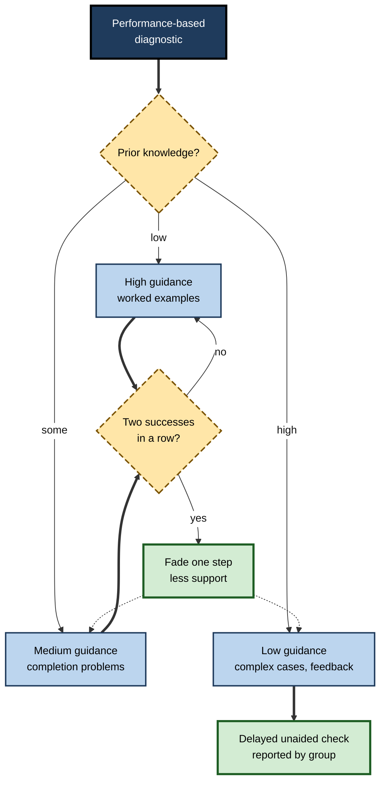

# I.9. Expertise Reversal Effect

> **In one sentence:** The expertise reversal effect is the finding that teaching methods which help beginners — detailed explanations, worked examples, lots of guidance — can become useless or even harmful as learners become more expert.
>
> **Why it matters:** It means there is no single "best" way to teach a topic; the best way depends on who is learning. Organisations that give everyone the same training waste experts' time and can actually slow their development.
>
> **Level span:** Novice → Expert · **Reading time:** ~18 min · **Builds on:** worked examples, redundancy, intrinsic load and schemas

---

## The Learning Ladder

| Level | Badge | After this level you can... |
|---|---|---|
| 1 | NOVICE | Explain why the same lesson can help one person and bore or hinder another. |
| 2 | FOUNDATIONS | Define the effect and describe its mechanism in terms of schemas and redundancy. |
| 3 | PRACTITIONER | Diagnose expertise quickly and adapt the level of guidance. |
| 4 | ADVANCED | Interpret the 2025 meta-analysis, its moderators and asymmetry, and explain open questions. |
| 5 | EXPERT / PRO | Build adaptive learning paths, fading policies and AI tutors that respond to growing expertise. |

---

## Level 1 · Novice — The Big Picture

Think of training wheels on a bicycle. For a child who has never ridden, they are essential: without them, the child falls. For a child who can already balance, they get in the way: they catch on curbs and stop the child leaning into turns. Same equipment, opposite effect, because the riders differ.

The **expertise reversal effect** is the learning-science version of this. Support that helps beginners — step-by-step explanations, worked examples, integrated text on diagrams — can slow down or hinder people who already know the basics. For them, the support is extra material to process, and it can stop them from practising the thinking they need.

You have already experienced it when:

- a mandatory "introduction" course explained things you knew, and you lost focus;
- a step-by-step wizard in software slowed you down once you knew where everything was;
- a manager micro-managed a task you could do on your own, and you learned less from it.

The key idea for a beginner: **good support is temporary; it should shrink as the learner grows.**

---

## Level 2 · Foundations — Core Concepts

### Definition

The **expertise reversal effect** occurs when an instructional technique that is effective for learners with low prior knowledge loses its effectiveness, or produces worse outcomes than an alternative, for learners with high prior knowledge. It was systematically described by Slava Kalyuga, Paul Ayres, Paul Chandler and John Sweller in 2003, drawing on a series of studies in which advantages for novices disappeared or reversed with experienced learners.

### Mechanism

- Novices lack schemas, so detailed guidance substitutes for missing knowledge and reduces search.
- Experts already have schemas that provide that guidance internally.
- When experts are given external guidance, they must process it, compare it with what they already know, and reconcile any differences. That is **redundant processing**: extraneous load.
- In addition, heavy guidance can prevent experts from practising retrieval and independent problem solving, which is what develops their expertise further.

*Figure I.9-1 — The expertise reversal effect.* Solid line: high-guidance instruction. Dashed line: low-guidance instruction. Hatched zone on the left: novices learn more with guidance; dotted zone on the right: experts learn more with less. The crossover marks the point at which support should fade. Curves are schematic.

### Examples of reversals reported in research

| Technique that helps novices | What happens with experts |
|---|---|
| Worked examples | Problem solving becomes as good or better. |
| Integrated diagrams with text | Diagram alone becomes better; text is redundant. |
| Detailed explanations | Brief or no explanation becomes better. |
| Pre-structured, step-by-step tasks | Open, less structured tasks become better. |
| Spoken explanation with visuals | Visuals alone may be enough. |

### Key terms

| Term | Plain meaning |
|---|---|
| **Expertise reversal effect** | Instruction that helps novices becomes ineffective or harmful for experts. |
| **Prior knowledge** | What the learner already knows about the domain; the main driver of the effect. |
| **Instructional guidance** | Support such as explanations, examples, structure and feedback. |
| **Adaptive instruction** | Changing the level of guidance to match the learner. |
| **Fading** | Gradually reducing guidance as expertise increases. |

**Figure I.9-2 — Why guidance turns from help into load.**

*How to read it:* the same guidance takes two different routes depending on what the learner already knows.

---

## Level 3 · Practitioner — Putting It to Work

### Step 1 — Diagnose expertise quickly

Long pre-tests are costly. Kalyuga and Sweller developed **rapid assessment** methods in the 2000s:

- **First-step test:** show a problem and ask for only the first step the learner would take. Experts can jump ahead or name the right approach immediately; novices hesitate or start with surface features.
- **Rapid verification:** show a partial solution step and ask whether it is correct.

Workplace equivalents: "What would you check first?", "Which of these three configurations would you choose and why?", a two-minute scenario question.

### Step 2 — Route or adapt

| Diagnosed level | Instructional approach |
|---|---|
| Novice | Worked examples, integrated explanations, segmented content, step-by-step tasks. |
| Intermediate | Completion problems, faded examples, brief explanations on demand. |
| Advanced | Independent problems, varied and complex cases, feedback rather than instruction. |
| Expert | Novel or edge cases, peer teaching, design and judgement tasks. |

### Step 3 — Re-diagnose as learners progress

Expertise grows during a course. Re-check after each major block and shift the guidance level. A good rule is to fade support once learners succeed on two consecutive completion or independent tasks.

### Worked example — sales methodology training for a mixed cohort

**Before:** every participant, from new graduates to fifteen-year veterans, completes the same six modules with the same scripted role-plays.

**After:**

1. A ten-minute diagnostic: three short scenarios, each asking "what would you do next and why?"
2. Novices take the full path with annotated example calls and scripted role-plays.
3. Experienced reps skip basics and go to complex, multi-stakeholder deal simulations with debrief.
4. All participants are re-diagnosed after week two; some novices move up.

Veterans stop disengaging; novices still get the support they need; total training hours fall.

### Common mistakes at this level

- **Equating job title or tenure with expertise.** Measure performance on the relevant task.
- **Withdrawing support too early.** The penalty of under-supporting novices is larger than the penalty of over-supporting experts.
- **Making advanced paths "the same, but faster".** Experts need different tasks, not compressed versions.
- **Never re-diagnosing.** Learners outgrow their initial assignment.

---

## Level 4 · Advanced — Mechanisms, Models & Evidence

### The 2025 meta-analysis

A 2025 meta-analysis in *Learning and Instruction*, titled "A cornerstone of adaptivity", synthesised 60 experimental studies with 5,924 participants. Key findings:

- Learners with **low prior knowledge** learned better from high-assistance instruction (d about 0.51).
- Learners with **high prior knowledge** learned better from low-assistance instruction (d about −0.43 for high versus low assistance).
- The effect was **robust across many contexts**, but **asymmetric**: providing assistance to novices helps more than withholding it from experts.
- Effects were **moderated** by how prior knowledge was assessed, the educational status of participants, and the domain. Evidence was less clear for younger students and for some fields, including humanities and language learning.

Practical implication of the asymmetry: **when unsure, err toward more support** — but build in fading.

### Relation to other CLT effects

- **Redundancy:** expertise reversal is essentially redundancy that emerges as learners gain knowledge.
- **Worked examples and guidance fading:** the expertise reversal effect is the theoretical reason fading works.
- **Element interactivity:** as expertise increases, the effective element interactivity of a task decreases, so techniques that reduce load become less necessary.
- **Imagination effect:** imagining a procedure helps more advanced learners but not novices, another expertise-dependent pattern.

### Boundary conditions and open questions

| Issue | Status |
|---|---|
| How to measure expertise reliably and quickly | Rapid methods work in structured domains; harder in ill-structured ones. |
| Ill-structured and creative domains | Fewer studies; reversal patterns less clear. |
| Learner control | Experts given control often skip support appropriately; novices often choose poorly. Shared control with recommendations is a promising compromise. |
| Motivation | Experts forced through novice material may disengage, adding a motivational cost beyond load. |
| Long-term development | Most studies are short; how reversals unfold over months of professional development is less studied. |

### Learner control and its pitfalls

Giving learners the choice of how much support to use seems like an elegant solution. Evidence suggests that learners with high prior knowledge often make reasonable choices, while novices tend to overestimate their knowledge and skip support they need. Systems that **recommend** a level based on diagnostics, and allow overrides, combine the strengths of both.

---

## Level 5 · Expert / Pro — Professional Mastery

### Adaptive learning at organisational scale

- **Diagnostic-first design.** Every major programme opens with a short performance-based diagnostic, not a self-rating.
- **Tiered paths.** Novice, intermediate and advanced tracks with different task types, not just different speeds.
- **Fading rules.** Explicit criteria for reducing guidance, built into the learning platform or facilitator guide.
- **Expert contribution roles.** Experienced staff become reviewers, mentors or case authors, which deepens their expertise and lowers program costs.
- **Measurement.** Track delayed performance separately for novice and experienced groups; an average can hide that one group was helped and the other harmed.

**Figure I.9-3 — An adaptive routing loop.**

*How to read it:* the diagnostic sets a starting level; success moves learners toward less guidance (dotted arrows); everyone ends with a delayed, unaided check.

### Beyond training: managing and documentation

The effect applies to management: detailed instructions help new team members and frustrate experienced ones. Situational leadership models describe similar adaptation. In documentation, layered content — quick-start, task guides, reference — lets different expertise levels enter at the right depth.

### AI-era implications

AI tutors and copilots can, in principle, adapt support continuously. Good designs:

- estimate expertise from performance (first-step quality, errors, time), not self-report;
- move from worked examples to hints to independent work as performance improves;
- let experienced users switch to terse, reference-style answers.

The risk is the reverse failure: an assistant that keeps giving full solutions to an advancing learner suppresses the independent practice that builds expertise. Evidence from 2024 to 2026 on generative-AI use shows that unrestricted answer-giving can raise practice performance while lowering later unaided performance.

### Professional scenario

**Role:** Learning platform product owner at a global consulting firm.
**Situation:** The firm's financial-modelling course has a high drop-out rate among experienced hires, who describe it as "patronising"; new graduates rate it highly.
**What the pro does:** Adds a three-problem first-step diagnostic; creates an advanced track of complex client cases with feedback only; implements a fading rule in the novice track; and reports delayed case-test results separately by track. Drop-out among experienced hires falls sharply, novice outcomes are unchanged, and senior consultants are recruited to author new advanced cases.

---

## Myths vs. Evidence

| Myth | What the evidence shows |
|---|---|
| "There is one best way to teach each topic." | The best method depends on prior knowledge; techniques reverse in effectiveness. |
| "Extra support never hurts." | For experienced learners, extra guidance can be redundant and reduce learning. |
| "Experts and novices need the same content, just at different speeds." | They need different task types and levels of guidance. |
| "Let learners choose their level and the problem is solved." | Experts often choose well; novices often skip support they need. Recommended paths with overrides work better. |
| "Tenure equals expertise." | Expertise is task-specific and must be measured on the relevant task. |

## Practitioner Toolkit

**Adaptive guidance checklist**

- [ ] A short, performance-based diagnostic opens the programme.
- [ ] At least two tracks with different task types.
- [ ] Explicit fading criteria (for example, two consecutive successes).
- [ ] Re-diagnosis after each major block.
- [ ] Learner override permitted, but defaults recommended by diagnostic.
- [ ] Outcomes reported separately for novice and experienced groups.

**Template — first-step diagnostic item**

| Scenario (two to three sentences) | Question | Expert-level answer | Novice-level answer | Route |
|---|---|---|---|---|
| | "What is the first thing you would do, and why?" | | | |

## Self-Check

1. **[NOVICE]** Give an everyday example of support that helps beginners but hinders experts.
2. **[FOUNDATIONS]** Define the expertise reversal effect.
3. **[FOUNDATIONS]** Explain its mechanism in terms of schemas and redundancy.
4. **[PRACTITIONER]** What is a first-step test, and why is it useful?
5. **[PRACTITIONER]** How would you adapt a worked-example-based course for advanced learners?
6. **[ADVANCED]** What did the 2025 meta-analysis find about asymmetry, and what does it imply?
7. **[ADVANCED]** Why is pure learner control not a complete solution?
8. **[EXPERT / PRO]** How should an AI tutor adapt as a learner gains expertise?

### Answer Key

1. Training wheels, step-by-step software wizards, detailed instructions from a manager.
2. Instruction that helps learners with low prior knowledge becomes ineffective or harmful for learners with high prior knowledge.
3. Experts already have schemas that guide them; external guidance becomes redundant information that must be processed and reconciled, adding extraneous load and reducing independent practice.
4. A quick assessment asking only for the first step on a problem; it estimates expertise in minutes.
5. Replace full examples with completion and independent problems, shorten explanations, offer complex varied cases with feedback.
6. Assistance helps novices more than withholding it helps experts; when uncertain, err toward support, but fade it.
7. Novices often misjudge their needs and skip support; recommended defaults with overrides work better.
8. Estimate expertise from performance, move from examples to hints to independent work, and offer terse answers to advanced users while avoiding full solutions that block practice.

## Key Takeaways

- **The best method depends on the learner's prior knowledge.**
- Support that helps novices becomes **redundant load** for experts.
- The effect is **robust but asymmetric**: helping novices matters more than withholding help from experts.
- **Diagnose quickly** and adapt guidance; **re-diagnose** as learners grow.
- **Fade** support with explicit criteria.
- AI and adaptive systems must **reduce help as competence rises**.

## Glossary

| Term | Meaning |
|---|---|
| Adaptive instruction | Instruction that adjusts guidance to the learner's level. |
| Expertise reversal effect | A technique effective for novices becoming ineffective or harmful for experts. |
| First-step test | A rapid diagnostic asking for the first solution step. |
| Imagination effect | Imagining a procedure benefits advanced learners more than studying it. |
| Instructional guidance | External support such as explanations, examples and structure. |
| Learner control | Allowing learners to choose features of instruction such as support level. |
| Prior knowledge | What a learner already knows in a domain. |
| Rapid verification | A diagnostic asking learners to judge whether a given solution step is correct. |
| Tiered path | Separate routes through a programme for different expertise levels. |
