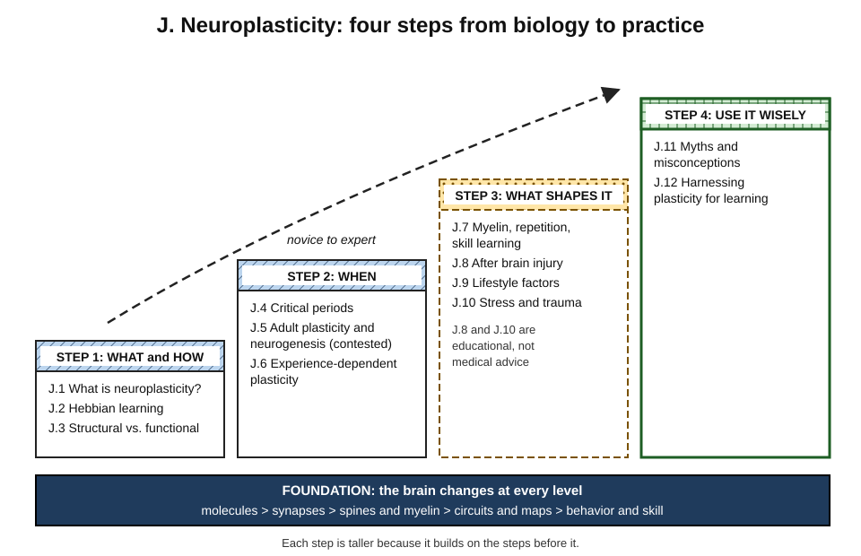
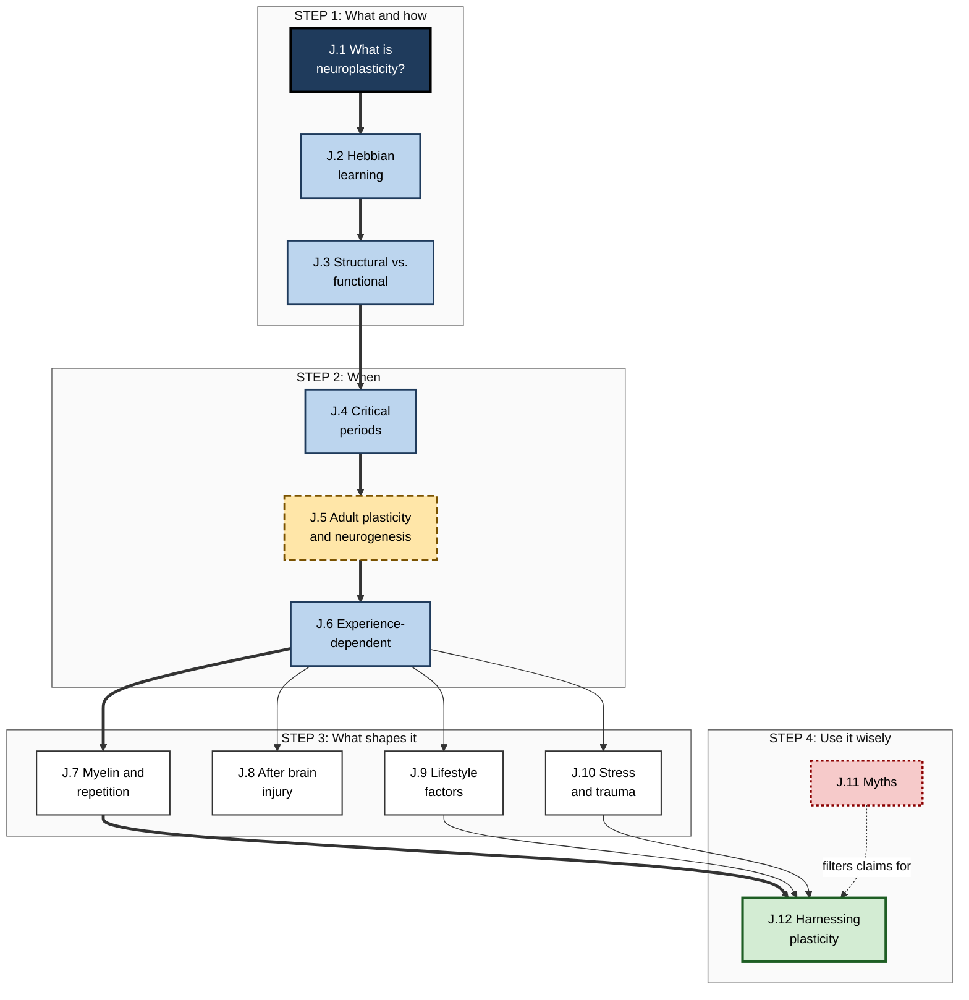
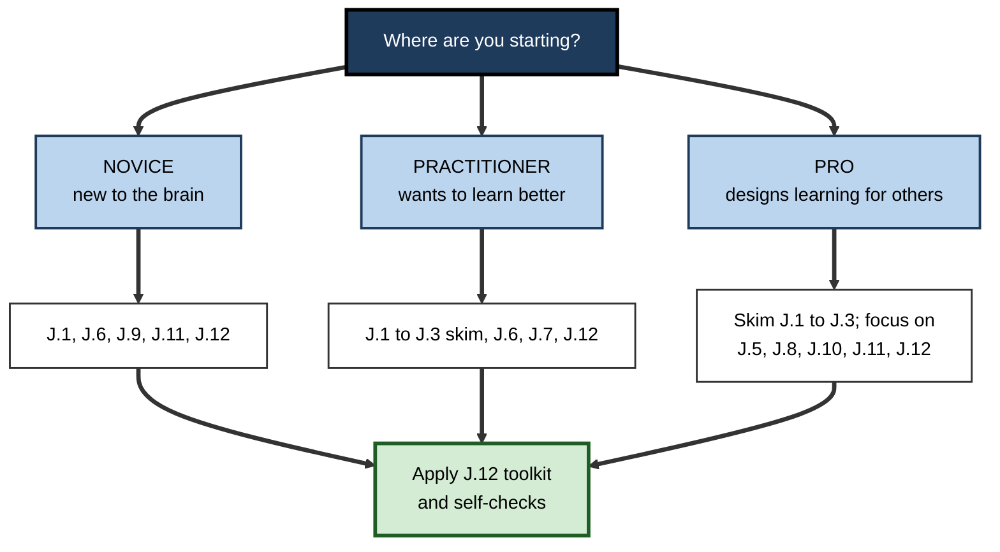

# J. Neuroplasticity

> **What this subtopic is about:** How the nervous system physically changes with experience — from synapses to myelin to whole maps — how that capacity shifts across the lifespan, what strengthens or disrupts it, and how to use it honestly to learn and to help others learn.
>
> **Who it is for:** Anyone who learns for a living — individual professionals, managers, L&D and enablement teams, coaches, educators and education-technology builders · **Notes in this subtopic:** 12 · **Level span:** Novice → Expert

---

## Overview

**Neuroplasticity** is the brain's lifelong capacity to change its structure and function in response to experience, practice, environment and injury. It is the biological reason learning is possible at all: every fact you remember and every skill you can perform corresponds to physical changes in how your neurons connect and communicate.

This subtopic moves from mechanism to practice. It starts with what plasticity is and the rules by which connections change (Hebbian learning, strengthening and weakening, timing). It then looks at *when* the brain is most changeable — critical periods in childhood, and the lifelong plasticity of adults, including the contested question of whether adult humans keep making new neurons. Next come the forces that shape plasticity: repetition and myelin, recovery after brain injury, lifestyle factors, and stress and trauma. It ends with the two things a professional most needs: the ability to spot neuromyths, and a practical method for harnessing plasticity for learning.

Throughout, the notes separate three categories of claim: **well established** (synaptic plasticity, map reorganisation, sensitive periods in sensory development, the dependence of rehabilitation on repetitive task-specific practice), **moderately supported** (human MRI evidence of structural change, myelin plasticity in humans, lifestyle effects) and **contested** (the scale and function of adult human hippocampal neurogenesis, broad transfer from brain training, the "70% proportional recovery rule" after stroke).

*Figure J-1 — The four-step structure of the Neuroplasticity subtopic.* Each step rests on the foundation of change at every biological level. Hatched headers: core science. Dotted, long-dash border: forces that shape plasticity. Thick solid border: application. The dashed arrow shows the novice-to-expert direction.

---

## Why It Matters

- **It replaces fatalism with realism.** Adults keep learning throughout life; "too old to learn" is false, while "harder and different" is often true for specific skills such as accent.
- **It explains why good learning methods work.** Spacing, retrieval, feedback, sleep and specificity all map onto known plasticity mechanisms.
- **It protects budgets and credibility.** "Brain-based" products and programmes are common; many rest on neuromyths. Professionals who know the science spend money on what works.
- **It matters in the AI era.** Plasticity follows use. If AI does the thinking, the relevant brain circuits are exercised less; deciding which skills must stay "in the head" is now a design decision.
- **It informs humane workplaces.** Stress, sleep and recovery shape plasticity; return-to-work after brain injury depends on graded, supported practice.

---

## What You Will Learn

| # | Note | Core question it answers | Primary level |
|---|---|---|---|
| J.1 | What is Neuroplasticity? | What does it mean for the brain to change, and at what levels? | Novice → Foundations |
| J.2 | Hebbian Learning: Neurons that Fire Together | By what rules do connections strengthen and weaken? | Foundations → Advanced |
| J.3 | Structural vs. Functional Plasticity | What is the difference between "software" and "hardware" change, and how fast is each? | Foundations → Advanced |
| J.4 | Critical Periods of Brain Development | When is the brain most changeable, and can windows reopen? | Foundations → Advanced |
| J.5 | Adult Brain Plasticity and Neurogenesis | How does the adult brain keep changing, and do adults make new neurons? | Practitioner → Expert |
| J.6 | Experience-Dependent Plasticity | How do individual experiences reshape specific circuits, and by what principles? | Foundations → Practitioner |
| J.7 | Myelin, Repetition, and Skill Learning | Why does repetition make skills fast and automatic? | Practitioner → Advanced |
| J.8 | Neuroplasticity After Brain Injury | How does the brain recover after injury, and what drives rehabilitation? | Practitioner → Expert |
| J.9 | Lifestyle Factors That Enhance Plasticity | Which habits genuinely support a learning-ready brain? | Novice → Practitioner |
| J.10 | Stress, Trauma, and Brain Plasticity | How do stress and trauma reshape the learning brain, and is it reversible? | Practitioner → Expert |
| J.11 | Neuroplasticity Myths and Misconceptions | Which popular brain claims are false, and how do I check new ones? | Novice → Expert |
| J.12 | Harnessing Neuroplasticity for Learning | How do I turn plasticity science into a practical learning method? | Practitioner → Expert |

---

## Concept Map

**Figure J-2 — How the twelve notes relate.**

*How to read it:* thick arrows are the main conceptual chain; thin arrows show supporting links; the dotted arrow shows that myth-spotting filters what goes into practical application. J.5 (long-dash border) contains the subtopic's main contested question.

---

## Recommended Learning Path

1. **Start with J.1** — everyone, including experts, should read its definition and evidence map.
2. **Read J.2 and J.3** to understand the rules and the two families of change.
3. **Read J.4, J.5 and J.6** in order to see how plasticity changes across the lifespan and with individual experience.
4. **Choose from J.7–J.10** according to your needs: J.7 for skill builders, J.8 for managers and anyone supporting recovery, J.9 for personal habits, J.10 for high-pressure workplaces.
5. **Read J.11** before buying or designing any "brain-based" programme.
6. **Finish with J.12**, which turns everything into a working method.

**Figure J-3 — Paths for different readers.**

*How to read it:* pick your starting box; each path ends with the practical toolkit. A professional can skim the early mechanism notes and concentrate on evidence debates and application.

---

## The Big Ideas in Brief

**J.1 What is Neuroplasticity?** The nervous system changes its structure and function with experience at every level — molecules, synapses, cells, circuits and maps. Lasting change needs repetition, attention, challenge, specificity and consolidation. Plasticity is neutral: it builds skills and also bad habits, pain and addiction. Brains balance plasticity with stability, which is why change takes time.

**J.2 Hebbian Learning.** Connections strengthen when one neuron repeatedly helps fire another, and weaken when activity is uncorrelated. Timing matters (spike-timing-dependent plasticity), stabilising mechanisms prevent runaway strengthening, and neuromodulators act as a "third factor" deciding what is learned. Newer findings such as behavioral-timescale plasticity show the brain uses several learning rules.

**J.3 Structural vs. Functional Plasticity.** Functional change (how existing connections work) is fast and fragile; structural change (spines, branches, myelin) is slower and durable. Human MRI shows structural change with training, often following an expansion–renormalisation pattern: volume grows then returns toward baseline while skill remains. Bigger is not the goal.

**J.4 Critical Periods of Brain Development.** Some systems have windows of heightened plasticity, especially in early life (vision, speech sounds). In humans most are graded sensitive periods. Windows are opened by maturing inhibition and closed by active brakes such as perineuronal nets, so reopening is possible in animals. Adults learn differently, not worse.

**J.5 Adult Brain Plasticity and Neurogenesis.** Adult plasticity is real and lifelong, mostly through changes to existing connections. Whether adult humans make meaningful numbers of new hippocampal neurons is contested. Large single-nucleus studies in 2025 and 2026 shifted the evidence toward some adult neurogenesis — rare, variable between people, reduced in Alzheimer's disease — but critics argue gene-expression classification does not prove cells are newborn, and the amount and function remain unknown.

**J.6 Experience-Dependent Plasticity.** Individual experiences reshape specific circuits throughout life. Cortical maps expand with attended use and shrink with disuse. Ten principles — use it or lose it, use it and improve it, specificity, repetition, intensity, time, salience, age, transference and interference — guide effective practice. Attention and neuromodulators gate change.

**J.7 Myelin, Repetition, and Skill Learning.** Myelin speeds and times signals, and adult myelin adapts to activity. In mice, new myelin is needed to learn some complex motor skills, and recent work shows remodelling is phase-dependent. Human evidence is indirect. Correct technique first, spaced repetition, overlearning and maintenance build automatic skill.

**J.8 Neuroplasticity After Brain Injury.** Recovery comes from reorganising surviving circuits plus compensation. Rehabilitation depends on task-specific, high-repetition, meaningful practice; timing matters, and very early high-dose activity can backfire. Paired vagus nerve stimulation is a promising adjunct. The note is educational, not medical advice.

**J.9 Lifestyle Factors That Enhance Plasticity.** Sleep has the strongest link to consolidation; exercise has modest cognitive benefits and robust animal effects; chronic stress undermines plasticity; diet and supplement claims are weaker than marketed. Multidomain programmes and addressing modifiable risk factors have the best population-level support.

**J.10 Stress, Trauma, and Brain Plasticity.** Moderate, controllable stress can help learning; chronic stress shifts the brain from flexible to habitual, threat-driven responding, with dendritic remodelling that is often reversible. Trauma-related brain differences are real on average but variable and partly pre-existing. Fear extinction is new learning. Educational, not medical advice.

**J.11 Neuroplasticity Myths and Misconceptions.** Neuromyths — 10% of the brain, learning styles, left/right brain, Mozart effect, brain-training transfer, "rewire in 21 days" — start from real findings and become distorted. Belief among educators remains high. A five-question claim check and refutation-plus-alternative corrections protect organisations.

**J.12 Harnessing Neuroplasticity for Learning.** Arrange attention, effortful retrieval, prediction error and feedback, spacing, sleep, variety and specificity. Expect specific, gradual change. Design AI use so the learner's brain does the core work, and measure learning by delayed, unaided, real-world performance.

---

## Novice-to-Pro Progression

| Level | What competence looks like here |
|---|---|
| **NOVICE** | Explains that the brain changes with experience at any age; names a few myths; knows that sleep and repeated practice matter. |
| **FOUNDATIONS** | Uses correct vocabulary (synapse, LTP and LTD, structural and functional plasticity, sensitive period, myelin); distinguishes established from contested claims. |
| **PRACTITIONER** | Plans personal learning with retrieval, spacing, feedback and sleep; recognises when stress or overload is undermining learning; checks claims before believing them. |
| **ADVANCED** | Explains mechanisms (NMDA coincidence detection, three-factor rules, perineuronal nets, oligodendrocyte dynamics, stress remodelling) and summarises current debates, including adult neurogenesis and proportional recovery. |
| **EXPERT / PRO** | Designs programmes, policies and products around plasticity principles; sets durable-learning metrics; writes accurate, motivating communication; governs AI use to preserve skill; refuses unsupported "brain" claims. |

---

## Where This Shows Up at Work

| Context | How plasticity science applies |
|---|---|
| **Onboarding** | Spread learning over weeks, start with calm skill acquisition, add pressure later, and measure time to independent performance. |
| **Reskilling mid- and late-career staff** | Lifelong plasticity makes reskilling realistic; allow more time and practice rather than lowering expectations. |
| **Sales and customer enablement** | Replace one-off bootcamps with spaced drills; measure at day 90 rather than day 5. |
| **Engineering and AI adoption** | Preserve unassisted practice of core skills; configure AI tools as coaches and critics in learning contexts. |
| **Safety-critical operations** | Use stress inoculation and quarterly refreshers for rare, critical procedures. |
| **People and wellbeing policy** | Protect sleep and recovery, address workload and control, and support graded return to work after illness or injury. |
| **Procurement of learning products** | Apply myth checks and require delayed performance evidence. |
| **Leadership communication** | Use plasticity to motivate ("everyone can keep learning") without overclaiming or blaming. |

---

## Capstone Exercises

1. **Personal plasticity project.** Choose one skill you need at work. Write a six-week plan using the J.12 template, including retrieval starts, spaced reviews, feedback sources, sleep protection and a day-42 unaided check. Run it and record the result.
2. **Vendor claim audit.** Take a real or sample "brain-based" learning product pitch. Rate each scientific claim as established, plausible, contested or unsupported, explain why, and recommend what to keep.
3. **Programme redesign.** Pick an existing one-day training in your organisation. Redesign it as a 6–12 week programme using the ten principles of experience-dependent plasticity, a stress-aware progression and durable-learning metrics.
4. **Evidence briefing on adult neurogenesis.** Write a one-page, balanced briefing for non-scientists on the state of adult human hippocampal neurogenesis research as of 2026, separating what is known, what is contested and what it means (and does not mean) for adult learners.
5. **AI-use policy.** Draft an AI-use guideline for a team of junior professionals that protects skill development: what must be practised unaided, how AI should be configured, and how skill will be assessed.
6. **Return-to-work plan.** Using a fictional case, draft a manager's checklist for supporting a colleague returning after a mild stroke, making clear which decisions belong to the clinical team.

---

## Key Takeaways

- The brain is **plastic for life**; change runs mainly through connections among existing neurons.
- Plasticity follows **rules**: correlated activity, timing, attention and neuromodulator gating, repetition, consolidation and specificity.
- **Sensitive periods** make some learning easier early, but adults keep learning — differently, not worse.
- **Adult human neurogenesis** remains **contested**: recent studies lean toward existence, but amount and function are unresolved.
- **Repetition, sleep, manageable stress and healthy habits** shape how much practice changes the brain.
- **Neuromyths** are widespread; check claims for human evidence and real-world outcomes.
- The practical payoff is a method — **focused, effortful, spaced, feedback-rich, specific practice** — and metrics that track **delayed, unaided performance**.
