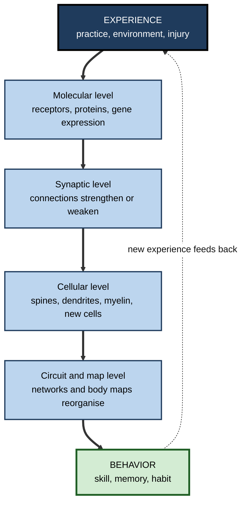
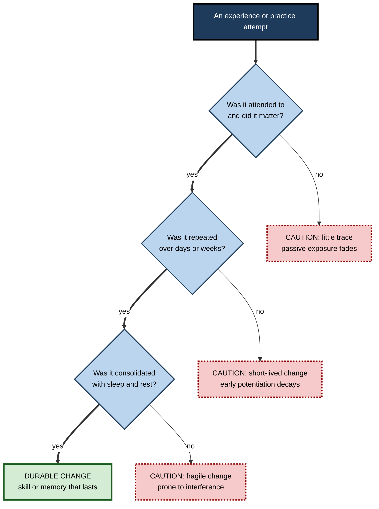

# J.1. What is Neuroplasticity?

> **In one sentence:** Neuroplasticity is the brain's ability to change its own wiring and workings in response to experience, practice, injury and the environment, at every age.
>
> **Why it matters:** Every skill you build at work leaves a physical trace in your nervous system. Knowing what plasticity really is, and what it is not, lets you design learning that actually changes people, and protects you from the flood of "rewire your brain" marketing.
>
> **Level span:** Novice → Expert · **Reading time:** ~17 min · **Builds on:** a basic idea of what learning is; nothing else required

---

## The Learning Ladder

| Level | Badge | After this level you can... |
|---|---|---|
| 1 | NOVICE | Explain neuroplasticity in plain words with an everyday example. |
| 2 | FOUNDATIONS | Name the levels at which the brain changes (molecule, synapse, cell, circuit, map) and the main types of plasticity. |
| 3 | PRACTITIONER | Recognise which everyday activities create lasting brain change and which do not. |
| 4 | ADVANCED | Explain the history, core mechanisms, stability–plasticity balance and the limits of the evidence. |
| 5 | EXPERT / PRO | Use plasticity science responsibly in learning design, leadership and communication, without overclaiming. |

---

## Level 1 · Novice — The Big Picture

Your brain is not a fixed machine that was finished in childhood. It is closer to a city that keeps rebuilding itself. Busy roads get widened, unused lanes get closed, new shortcuts appear when traffic changes. **Neuroplasticity** (also called **brain plasticity** or **neural plasticity**) is the name for this constant rebuilding: the nervous system changing its structure and function as a result of what you do and experience.

The word "plastic" here does not mean the material. It comes from the Greek *plastikos*, "able to be shaped". A plastic brain is a shapeable brain — not infinitely, not instantly, but genuinely.

You have already experienced neuroplasticity when:

- you learned to type, and now your fingers find keys you could not name if asked;
- you moved to a new city and, after a few weeks, stopped needing the map app for your daily route;
- you started a new job full of unfamiliar acronyms and, months later, used them without thinking;
- you broke an arm, used your other hand for six weeks, and found it had become noticeably more skilful.

In each case, repeated experience changed the connections between nerve cells, so the next time the task needed less effort. That is plasticity in action.

The beginner's key idea: **what you repeatedly pay attention to and do becomes easier for your brain, because your brain physically reorganises around it.** The flip side is also true: what you stop using tends to weaken.

---

## Level 2 · Foundations — Core Concepts

### A working definition

Neuroscientists define neuroplasticity as **the capacity of the nervous system to modify its structure, function and connections in response to intrinsic or extrinsic stimuli**. "Intrinsic" covers things like hormones and development; "extrinsic" covers experience, training, environment and injury.

### The building blocks

A **neuron** is a nerve cell that carries electrical and chemical signals. Neurons connect at **synapses**, tiny junctions where one neuron releases chemical messengers (**neurotransmitters**) that influence the next. The adult human brain contains on the order of 86 billion neurons and a vastly larger number of synapses. Learning mostly works by changing *which* synapses exist and *how strong* they are.

### Plasticity happens at several levels at once

**Figure J.1-1 — Neuroplasticity operates at nested levels, from molecules to behavior.**

*How to read it:* thick arrows show how one experience cascades upward from molecules to behavior; the dotted arrow shows that changed behavior creates new experiences, closing the loop.

### Main types of plasticity

| Type | What it means | Example |
|---|---|---|
| **Functional plasticity** | Existing connections change how strongly or how often they work. | A synapse becomes more efficient after repeated use. |
| **Structural plasticity** | The physical anatomy changes: new spines, branches, myelin, sometimes new cells. | Grey matter changes measured on MRI after months of training. |
| **Developmental plasticity** | Large-scale wiring of the young brain, partly guided by experience. | Children's visual system tuning in the first years of life. |
| **Experience-dependent plasticity** | Changes driven by an individual's unique experiences, lifelong. | A violinist's enlarged hand representation. |
| **Compensatory or reactive plasticity** | Reorganisation after damage or sensory loss. | Recovery of movement after a stroke; blind readers using visual cortex for Braille. |
| **Homeostatic plasticity** | Stabilising adjustments that keep overall activity in a healthy range. | Neurons turning their sensitivity down after a period of high activity. |

### Key terms

| Term | Plain meaning |
|---|---|
| **Neuron** | A nerve cell that sends electrical and chemical signals. |
| **Synapse** | The junction where two neurons communicate. |
| **Synaptic plasticity** | Changes in the strength of synapses; the best-studied cellular basis of learning. |
| **Long-term potentiation (LTP)** | A lasting increase in synaptic strength after particular patterns of activity. |
| **Long-term depression (LTD)** | A lasting decrease in synaptic strength; just as important as LTP for learning. |
| **Adaptive plasticity** | Change that improves function. |
| **Maladaptive plasticity** | Change that harms function, such as chronic pain, addiction or phantom-limb pain. |

---

## Level 3 · Practitioner — Putting It to Work

Knowing that the brain *can* change is not useful by itself. The practical question is: **which experiences produce durable change, and which wash out?** Research across animals and humans points to a consistent set of conditions.

### Five conditions that drive lasting change

1. **Repetition over time.** One exposure rarely rewires much. Repeated, spaced practice produces changes that last.
2. **Attention and relevance.** Plasticity is strongly gated by attention and by chemical signals of importance (such as dopamine, acetylcholine and noradrenaline). Passive exposure changes far less than engaged effort.
3. **Challenge at the edge of ability.** Tasks that are too easy produce little change; tasks that stretch you, with feedback, produce more.
4. **Specificity.** The brain changes in the circuits you actually use. Practising mental arithmetic does not rewire your tennis serve.
5. **Consolidation.** Sleep and rest periods are when many changes are stabilised. Skipping sleep undercuts the value of practice.

**Figure J.1-2 — From experience to lasting change.**

*How to read it:* only experiences that pass all three gates tend to leave durable traces; dotted-border boxes show the common failure points.

### Worked example — a project manager learning financial modelling

| | Before (plasticity-blind) | After (plasticity-aware) |
|---|---|---|
| **Approach** | A one-day workshop, then back to normal work. | A short workshop, then 20 minutes of modelling practice three times a week for six weeks. |
| **Attention** | Laptop open on email during the session. | Practice blocks with notifications off, each with a specific target. |
| **Difficulty** | Copies the trainer's model. | Builds models from a written brief, starting simple and adding complexity. |
| **Consolidation** | Late nights before the deadline. | Practice ends a few hours before sleep; quick recall the next morning. |
| **Six weeks later** | Has to relearn the formulas. | Builds a three-statement model unaided. |

### Common mistakes

- **Treating plasticity as instant.** Real structural change typically takes weeks to months of practice.
- **Assuming plasticity is always good.** The same mechanisms build bad habits, chronic pain and compulsive behaviors.
- **Expecting general upgrades.** Training changes the circuits that are trained; broad "brain power" boosts from narrow drills are not supported.
- **Believing it is over after childhood.** Adults remain plastic, though the rules and speed differ from childhood.

---

## Level 4 · Advanced — Mechanisms, Models & Evidence

### A short history of an idea that was resisted

- **Late 1800s.** William James wrote in 1890 that the nervous system has "plasticity", meaning it yields to influences while keeping its structure. Santiago Ramón y Cajal argued that learning might work by growing new connections between neurons.
- **Early and mid 1900s.** The dominant teaching held that the adult brain was essentially fixed: once development ended, connections could only be lost.
- **1949.** Donald Hebb proposed that when one neuron repeatedly helps fire another, the connection between them grows stronger — the foundation of modern synaptic learning theory.
- **1960s–1970s.** David Hubel and Torsten Wiesel showed that early visual experience shapes the visual cortex during a critical period. Eric Kandel's work on the sea slug *Aplysia* revealed molecular steps of simple learning. In 1973, Tim Bliss and Terje Lømo described long-term potentiation in the rabbit hippocampus.
- **1980s–1990s.** Michael Merzenich and colleagues showed that body maps in adult monkey cortex reorganise after changes in use. Human imaging later showed similar reorganisation in musicians and after amputation.
- **2000s–today.** MRI studies showed measurable structural change in adults after learning; live imaging in animals revealed individual synaptic spines appearing and disappearing with learning; myelin and glial cells joined the story; and the debate about new neurons in the adult human hippocampus intensified.

### Core mechanisms in brief

| Mechanism | Timescale | What happens |
|---|---|---|
| Short-term synaptic plasticity | Milliseconds to minutes | Temporary changes in transmitter release. |
| Early LTP and LTD | Minutes to hours | Receptors are modified or moved; no new proteins needed. |
| Late LTP and LTD | Hours to days | New protein synthesis and gene expression stabilise the change. |
| Structural spine remodelling | Hours to weeks | Dendritic spines grow, enlarge or are pruned. |
| Myelin remodelling | Days to weeks | Insulation around axons is added or adjusted, changing signal timing. |
| Map-level reorganisation | Weeks to months | Larger representations shift, expand or shrink. |

### The stability–plasticity balance

A brain that changed with every experience would forget everything it knew. A brain that never changed could not learn. This tension is called the **stability–plasticity dilemma**. Real brains resolve it with layered safeguards:

- **Gating:** plasticity is switched on mainly when neuromodulators signal that something is important, surprising or rewarding.
- **Homeostatic plasticity:** neurons scale their overall sensitivity up or down to keep activity in range.
- **Metaplasticity:** the history of a synapse changes how easily it can change in future — "the plasticity of plasticity".
- **Brakes that increase with age:** molecular and structural brakes, such as maturing inhibitory circuits and extracellular structures called perineuronal nets, stabilise mature circuits.

The same dilemma appears in artificial intelligence as **catastrophic forgetting**, where a neural network trained on a new task overwrites what it knew. Engineers borrowed ideas from neuroscience — replay, consolidation, protecting important weights — to reduce it.

### What the evidence does and does not show

- **Strong:** synaptic plasticity, cortical map reorganisation, critical periods in sensory development, and the dependence of rehabilitation on repetitive, task-specific practice.
- **Moderate:** human MRI evidence of grey and white matter changes with training. Effects are real but often small, sometimes transient, and the MRI signal cannot tell you *which* cellular change caused it.
- **Contested:** the scale and importance of adult neurogenesis in the human hippocampus; claims that commercial "brain training" produces broad cognitive gains.

A key nuance from recent work: structural change measured by MRI often follows an **expansion–renormalisation** pattern — volume increases during early learning, then partly returns toward baseline while performance stays high. This means "more grey matter" is not the goal; efficient, selected circuitry is.

---

## Level 5 · Expert / Pro — Professional Mastery

### Using the concept responsibly

Professionals who use neuroplasticity language — L&D leaders, coaches, product managers in education technology, clinicians, managers — carry two responsibilities. They should use it to **motivate** (people can change, at any age) and to **design** (repetition, attention, challenge, sleep), while avoiding **overclaiming** (instant rewiring, unlimited potential, generic brain upgrades).

| Statement | Verdict | Better version |
|---|---|---|
| "This 10-minute module rewires your brain." | Overclaim | "Repeated practice over several weeks builds lasting skill." |
| "Adults can't really change how they think." | False | "Adults remain plastic; change takes deliberate, repeated practice." |
| "Our app grows new brain cells." | Unsupported | "Our app supports spaced practice, which helps retention." |
| "Use it or lose it." | Broadly supported | Add: "and use it *specifically* — training is task-specific." |

### Designing for plasticity at organisational scale

1. **Plan for weeks, not events.** Budget for spaced follow-up practice, not just the launch session.
2. **Protect attention.** Design sessions that require active output; avoid background-video "learning".
3. **Build in feedback.** Plasticity depends on error signals; practice without feedback can entrench mistakes.
4. **Respect consolidation.** Avoid scheduling high-stakes learning into periods of chronic overload and sleep loss.
5. **Measure behavior, not brains.** Brain scans are research tools, not L&D metrics. Measure delayed performance and on-the-job transfer.

### The AI-era angle

When generative AI does the thinking, the brain's relevant circuits are not exercised, and plasticity follows use. Early evidence on **cognitive offloading** suggests that heavy reliance on AI for writing or problem solving can reduce the mental engagement that builds durable skill. A pro does not ban the tools; they decide which capabilities must be built in people's heads and design AI use so that people still do the core thinking for those capabilities.

### Professional scenario

**Role:** Head of learning at a 4,000-person professional-services firm.
**Situation:** A vendor pitches a "neuroplasticity-powered leadership programme" with brain-scan imagery and promises of rewiring in 30 days.
**What the pro does:** Asks the vendor what behavior will change, how it will be practised over time, and what delayed evidence they have. Notes that the scans are decorative, the 30-day promise is not grounded in evidence, and the programme is mostly lectures. Commissions instead a 12-week programme with short weekly practice sprints, peer feedback and a manager-observed behavior check at week 16. The pitch deck uses the word "neuroplasticity" once — to explain why the programme is spread over 12 weeks.

### Ethical limits

- Do not imply that people who struggle simply have not "rewired" hard enough. Plasticity is real, but so are constraints of health, age, disability and circumstance.
- Do not use neuroscience imagery to make weak programmes look scientific.
- Respect that brain change is personal; workplace "brain optimisation" schemes can slide into surveillance or pressure.

---

## Myths vs. Evidence

| Myth | What the evidence shows |
|---|---|
| "The adult brain is fixed." | Adult brains change throughout life at synaptic, structural and map levels. |
| "Neuroplasticity means anything is possible." | Change is real but bounded by biology, age, time and the specificity of practice. |
| "Plasticity is always positive." | Maladaptive plasticity underlies chronic pain, addiction and entrenched bad habits. |
| "You can rewire your brain in days." | Durable structural change generally needs weeks to months of repeated practice. |
| "Bigger brain regions mean better skills." | Volume changes are often transient; efficiency and selection matter more than size. |
| "Brain games make you smarter in general." | Training effects are mostly specific to the trained task; broad transfer is weak. |

## Practitioner Toolkit

**Plasticity-friendly practice checklist**

- [ ] I have a specific skill target, not a vague "get better at X".
- [ ] Practice is spaced across days or weeks, not crammed.
- [ ] Each session demands active output and full attention.
- [ ] Difficulty sits just beyond what I can already do comfortably.
- [ ] I get feedback quickly enough to correct errors.
- [ ] I protect sleep during intensive learning periods.
- [ ] I check skill after a delay, without help.

**Claim-check script for "neuro" marketing**

1. What exact behavior or skill will change?
2. Over what time span, with how much practice?
3. What evidence shows delayed, real-world improvement?
4. Would the claim still be persuasive without the brain imagery?

## Self-Check

1. **[NOVICE]** In one sentence, what is neuroplasticity?
2. **[NOVICE]** Give one example of neuroplasticity from your own life.
3. **[FOUNDATIONS]** What is the difference between functional and structural plasticity?
4. **[FOUNDATIONS]** Name three levels at which the brain changes with learning.
5. **[PRACTITIONER]** List three conditions that make practice more likely to produce lasting change.
6. **[ADVANCED]** What is the stability–plasticity dilemma, and name two ways the brain manages it?
7. **[ADVANCED]** Why is "more grey matter" not necessarily the goal of training?
8. **[EXPERT / PRO]** How would you rewrite a vendor's claim that a course "rewires the brain in 10 minutes"?
9. **[EXPERT / PRO]** Why is plasticity relevant to how people should use AI assistants?

### Answer Key

1. The nervous system's ability to change its structure and function in response to experience, practice, injury and environment.
2. Answers vary — learning a route, a language, a sport, software shortcuts.
3. Functional plasticity changes how existing connections work; structural plasticity changes the physical anatomy, such as spines, dendrites or myelin.
4. Any three of molecular, synaptic, cellular, circuit, map or network level.
5. Repetition over time, attention and relevance, challenge at the edge of ability, specificity, consolidation through sleep.
6. Brains must change to learn but stay stable to remember. Gating by neuromodulators, homeostatic plasticity, metaplasticity and age-related brakes manage it.
7. Volume changes are often transient (expansion then renormalisation); skilled performance relies on efficient, selected circuits, not size.
8. Replace with a behavior-focused, time-realistic claim, such as "repeated practice over several weeks builds lasting skill", and ask for delayed evidence.
9. Plasticity follows use; if AI does the thinking, the relevant circuits are exercised less, so skills that need to live in the head must still be practised by the person.

## Key Takeaways

- Neuroplasticity is the nervous system's **lifelong capacity to change** with experience.
- It operates at **multiple levels** — molecules, synapses, cells, circuits and maps.
- Lasting change needs **repetition, attention, challenge, specificity and consolidation**.
- Plasticity is **neutral**: it can build skills or entrench harmful patterns.
- Brains balance plasticity with **stability**; brakes increase with age but never fully lock change out.
- Evidence is strong for synaptic and map plasticity, moderate for MRI-level structural change and **contested** for adult human neurogenesis.
- Professionals use the concept to **design spaced, active, feedback-rich learning** and to reject overclaims.

## Glossary

| Term | Meaning |
|---|---|
| Catastrophic forgetting | In AI, the loss of old knowledge when a network learns something new. |
| Expansion–renormalisation | A pattern where brain volume grows during early learning and later partly returns to baseline. |
| Homeostatic plasticity | Adjustments that keep neural activity within a stable range. |
| Long-term depression (LTD) | A lasting weakening of a synapse. |
| Long-term potentiation (LTP) | A lasting strengthening of a synapse. |
| Maladaptive plasticity | Brain change that harms function. |
| Metaplasticity | Changes in how easily synapses can change in future. |
| Neuromodulator | A chemical such as dopamine or acetylcholine that adjusts how much plasticity occurs. |
| Neuroplasticity | The nervous system's capacity to change structure and function with experience. |
| Perineuronal net | A mesh of extracellular molecules that stabilises mature circuits. |
| Stability–plasticity dilemma | The trade-off between learning new things and keeping old knowledge. |
| Synapse | The junction where neurons communicate. |
