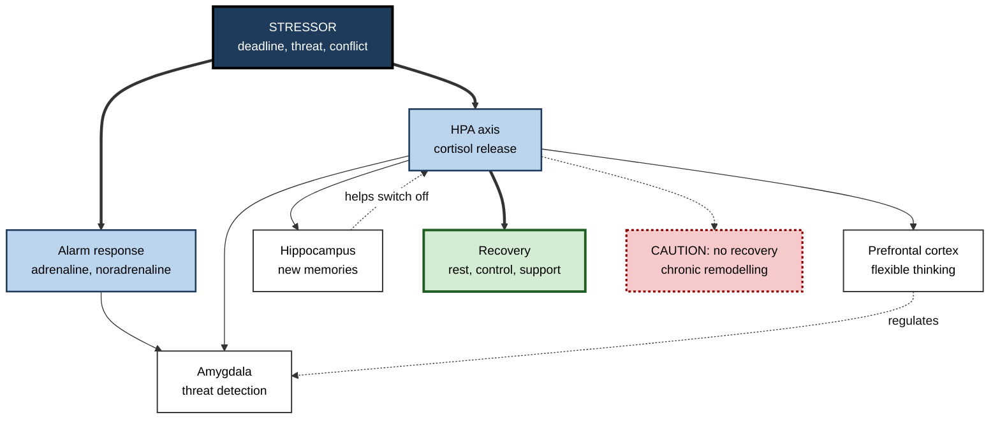
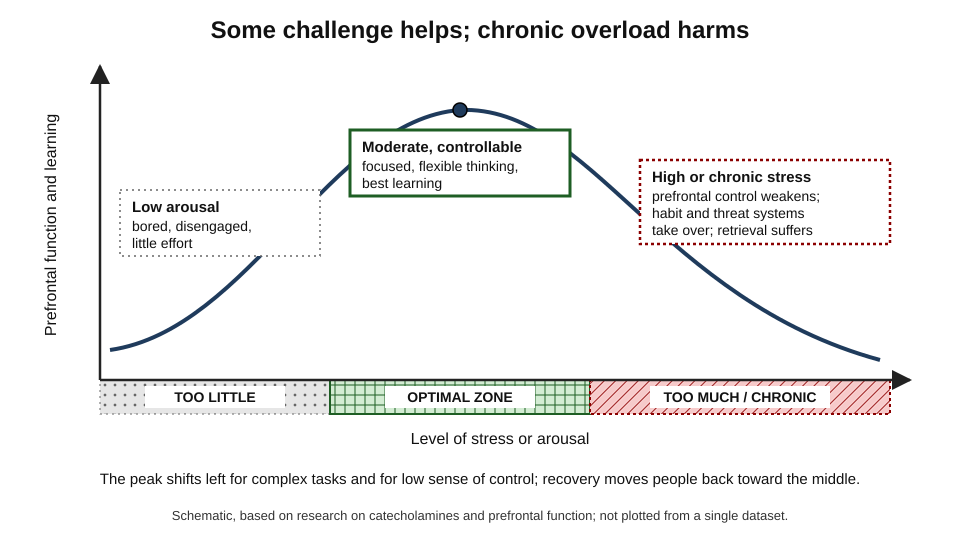
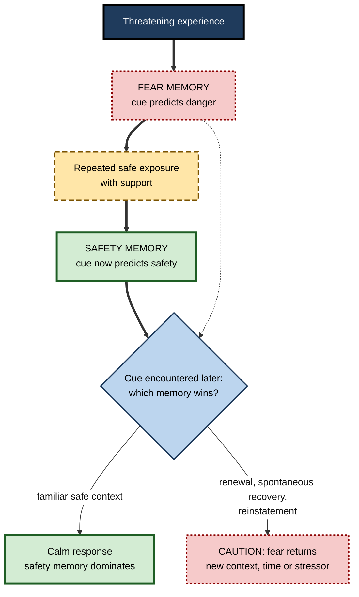

# J.10. Stress, Trauma, and Brain Plasticity

> **In one sentence:** Short, manageable stress can sharpen learning, but chronic stress and trauma reshape the brain in ways that weaken flexible thinking and strengthen threat responses — and because these changes are themselves plasticity, they are often partly reversible.
>
> **Why it matters:** Workplaces run on deadlines, pressure and sometimes crisis. Knowing how stress changes the learning brain helps you design training and teams that perform under pressure without burning people out, and respond to colleagues affected by trauma with understanding rather than judgement.
>
> **Level span:** Novice → Expert · **Reading time:** ~19 min · **Builds on:** what neuroplasticity is; experience-dependent plasticity; critical periods
>
> **Important:** This note is educational, not medical or psychological advice. It summarises research to build understanding. It does not diagnose or treat any condition. Anyone affected by trauma, persistent stress, anxiety or depression should seek support from qualified health professionals; in an emergency, contact local emergency services.

---

## The Learning Ladder

| Level | Badge | After this level you can... |
|---|---|---|
| 1 | NOVICE | Explain the difference between helpful short-term stress and harmful chronic stress. |
| 2 | FOUNDATIONS | Describe the stress response system and how stress affects memory and learning. |
| 3 | PRACTITIONER | Design study, training and team practices that use challenge without chronic overload. |
| 4 | ADVANCED | Explain structural brain changes under chronic stress, early adversity and trauma, their reversibility and the evidence limits. |
| 5 | EXPERT / PRO | Build stress-aware, trauma-informed learning and team environments within ethical and professional limits. |

---

## Level 1 · Novice — The Big Picture

Stress is your body's alarm system. When something challenging happens — a presentation, a deadline, a near-miss on the road — your body releases hormones that raise your heart rate, sharpen your focus and mobilise energy. In short bursts, this is useful: it helps you rise to the occasion and remember important events.

Problems arise when the alarm never switches off. Weeks or months of constant pressure, fear or insecurity — **chronic stress** — change the brain. The parts that help you plan, reflect and learn flexibly work less well, while the parts that detect threat become more reactive. A **traumatic** experience, such as violence or a life-threatening event, can produce similar but more intense changes.

An analogy: a smoke alarm is great when there is a fire. A smoke alarm that goes off every time you make toast makes life exhausting, and eventually you stop being able to cook properly at all.

You have already experienced this when:

- a moderate dose of pressure helped you finish a report with real focus;
- during a very stressful period, you found it hard to remember new names or learn a new tool;
- after a frightening event, you noticed you were jumpier for a while.

The good news: because these changes are a form of **plasticity**, they are often partly reversible when stress is reduced and recovery, support and treatment are available.

The beginner's key idea: **some challenge helps learning; constant, uncontrollable stress harms it — and recovery is possible.**

---

## Level 2 · Foundations — Core Concepts

### The stress response system

| Component | What it does | Timing |
|---|---|---|
| **Sympathetic nervous system** | Releases adrenaline and noradrenaline: faster heart, alertness. | Seconds |
| **HPA axis** (hypothalamus–pituitary–adrenal) | Releases **cortisol**, which mobilises energy and influences brain function. | Minutes to hours |
| **Brain targets** | Hippocampus, prefrontal cortex and amygdala are rich in stress-hormone receptors. | Minutes to months |

Three brain regions matter most for learning:

- **Prefrontal cortex:** planning, working memory, self-control, flexible thinking.
- **Hippocampus:** forming new memories and placing them in context; also helps switch off the stress response.
- **Amygdala:** detecting threat and tagging emotional significance.

### Acute versus chronic stress

| | Acute, manageable stress | Chronic or overwhelming stress |
|---|---|---|
| **Duration** | Minutes to hours, then recovery | Weeks to years, little recovery |
| **Sense of control** | Usually high | Often low |
| **Effect on learning** | Can enhance attention and memory for relevant, emotional events | Impairs flexible learning, working memory and memory retrieval |
| **Brain effect** | Temporary neuromodulator and hormone changes | Structural remodelling in prefrontal cortex, hippocampus and amygdala |

**Figure J.10-1 — How the stress system affects the learning brain.**

*How to read it:* stressors trigger fast and slower hormone systems that act on three key regions; dotted arrows show regulation and the risk path when recovery is missing.

### Key terms

| Term | Plain meaning |
|---|---|
| **Cortisol** | The main human stress hormone released by the adrenal glands. |
| **HPA axis** | The hormone chain from hypothalamus to pituitary to adrenal glands. |
| **Allostasis** | The body's process of adapting to challenges by changing its internal settings. |
| **Allostatic load** | The cumulative wear and tear from repeated or chronic adaptation. |
| **Trauma** | Exposure to an event involving actual or threatened death, serious injury or violence, which can overwhelm coping. |
| **PTSD** | Post-traumatic stress disorder: persistent intrusive memories, avoidance, negative mood changes and hyperarousal after trauma. |
| **Fear extinction** | Learning that a cue no longer predicts danger. |
| **Resilience** | Adapting well in the face of adversity; a process, not a fixed trait. |

---

## Level 3 · Practitioner — Putting It to Work

### Using challenge without chronic overload

1. **Add challenge in bounded doses.** Timed exercises, simulations and presentations create useful arousal. End them with recovery and debrief.
2. **Preserve a sense of control.** Stress hurts most when it is uncontrollable. Give learners choices, clear criteria and visible progress.
3. **Separate learning from evaluation when possible.** Low-stakes practice lets the prefrontal cortex do its job; high-stakes testing should come after skills are established.
4. **Practise under realistic pressure late, not early.** Learn the skill calmly first, then rehearse it under stress — the logic of **stress inoculation training** used by pilots, surgeons and emergency teams.
5. **Watch for chronic load.** Persistent overwork, insecurity and conflict undermine learning regardless of training quality.
6. **Protect recovery.** Sleep, breaks and time off allow stress systems to reset.

*Figure J.10-2 — The inverted-U relationship between stress and prefrontal function.* Too little arousal: disengagement. Moderate, controllable challenge: peak flexible thinking and learning. High or chronic stress: the prefrontal cortex is impaired and habit and threat systems dominate. Schematic; the curve shifts with task complexity, individual differences and sense of control.

### Worked example — onboarding to a 24/7 incident-response rota

| | High-stress approach | Stress-aware approach |
|---|---|---|
| **First week** | New engineer added to the on-call rota immediately. | Shadows on-call engineers; studies runbooks calmly. |
| **Practice** | Learns during real outages. | Practises in game-day simulations of increasing difficulty. |
| **Control** | Unclear escalation; fear of blame. | Clear escalation paths; blameless post-incident reviews. |
| **Pressure** | Constant from day one. | Introduced progressively; first real shift paired with a senior. |
| **Outcome** | Freezes in incidents; considers leaving. | Handles incidents confidently by week eight. |

### Common mistakes

- **"Pressure builds character."** Only when it is bounded, controllable and followed by recovery.
- **Testing new learners in high-stakes conditions.** This measures stress tolerance, not skill, and may impair learning.
- **Treating resilience as only an individual responsibility.** Workload, control and support are organisational factors.
- **Assuming visible calm means no stress.** People under chronic stress often mask it.

---

## Level 4 · Advanced — Mechanisms, Models & Evidence

### Prefrontal cortex under stress

Amy Arnsten's research shows that the prefrontal cortex depends on an optimal level of noradrenaline and dopamine — an inverted-U relationship. Under high stress, excessive catecholamine release rapidly weakens prefrontal network connections, while the amygdala and habit-related circuits are strengthened. The result is a shift from reflective, goal-directed control toward reflexive, habitual and threat-driven responses. Lars Schwabe and Oliver Wolf have shown in humans that stress shifts behavior from goal-directed toward habitual learning.

### Stress and memory phases

| Memory phase | Effect of acute stress (simplified) |
|---|---|
| **Encoding** | Emotionally relevant information around the stressor can be remembered better; unrelated material may be remembered worse. |
| **Consolidation** | Stress hormones after learning can enhance consolidation of emotional memories. |
| **Retrieval** | Cortisol tends to impair retrieval — the classic "blank" in a stressful exam or interview. |

### Structural remodelling under chronic stress

Pioneering work by Bruce McEwen and colleagues, mainly in rodents, established a regional pattern:

| Region | Chronic stress effect | Recovery |
|---|---|---|
| **Medial prefrontal cortex** | Dendritic shrinkage and spine loss in pyramidal neurons. | Largely recovers after stress ends in young animals; recovery is reduced with age. |
| **Hippocampus (CA3)** | Dendritic shrinkage; reduced neurogenesis in rodents. | Recovers within weeks after stress ends. |
| **Basolateral amygdala** | Dendritic growth and more spines. | Persists for at least three weeks after stress ends in rodent studies. |

A 2025 review of prefrontal cortex studies confirmed that chronic stress causes dendritic atrophy, spine loss and altered connectivity, with effects that vary by circuit: some projection-specific neurons are vulnerable and others resilient. The asymmetry in recovery — prefrontal and hippocampal changes reversing more readily than amygdala changes — may help explain why anxiety can linger after stress has passed.

McEwen framed this with the concept of **allostatic load**: adaptation to stress is healthy, but repeated or prolonged activation causes cumulative wear on brain and body.

### Early-life adversity

Childhood adversity — abuse, neglect, household dysfunction, poverty-related stress — is associated with differences in hippocampal, amygdala and prefrontal structure and function, and with higher risk of later physical and mental health problems. Key nuances:

- Effects depend on **timing**, since different regions have different sensitive periods.
- Associations are **probabilistic**: many people who experienced adversity show resilience.
- **Supportive relationships** and placement into stable, responsive care can buffer effects, as shown in randomised evidence from the Bucharest Early Intervention Project.

### Trauma and PTSD

- People with PTSD, on average, show **smaller hippocampal volume** and altered amygdala and prefrontal activity. A landmark twin study (Mark Gilbertson and colleagues, 2002) found smaller hippocampi both in combat veterans with PTSD and in their identical twins who had never been in combat, suggesting that a smaller hippocampus may partly be a **pre-existing vulnerability**, not only a consequence of trauma.
- A 2025 imaging study reported that brain changes in PTSD are **dynamic and phase-dependent**, varying with symptom duration.
- **Fear extinction is new learning, not erasure.** Exposure-based therapies build a new "safe" memory that competes with the fear memory. The old memory can return through **renewal** (a change of context), **spontaneous recovery** (time) or **reinstatement** (a new stressor). This is plasticity in both directions.
- **Reconsolidation** research tests whether recalled memories can be updated while temporarily unstable; human results, including with drugs such as propranolol, are mixed.

**Figure J.10-3 — Extinction builds a competing memory rather than erasing fear.**

*How to read it:* both memories survive and compete; the thick path shows how safety learning is built, and the dotted arrow shows the old fear memory still feeding into later responses.

### Treatment and brain change

Trauma-focused psychotherapies, such as prolonged exposure, cognitive processing therapy and eye movement desensitisation and reprocessing (EMDR), are recommended first-line treatments in major clinical guidelines. A systematic review of brain imaging before and after such therapies found that while symptoms improve, **consistent brain changes have not been established**; findings vary across studies. Psychedelic-assisted therapies are being studied partly because of their plasticity-promoting effects in animals; in 2024 the United States regulator declined to approve MDMA-assisted therapy for PTSD, requesting more evidence. This area remains **experimental**.

### Controllability and resilience

Steven Maier and Martin Seligman's revision of "learned helplessness" (2016) proposed that passivity in the face of uncontrollable stress is the brain's default, and that what is *learned* is the detection of control, via prefrontal circuits that then dampen stress responses. Experiencing control over stressors may build lasting resilience. Recent reviews describe resilience itself as **plastic**: an active, learnable process rather than a fixed trait.

---

## Level 5 · Expert / Pro — Professional Mastery

### Stress-aware learning design

| Design principle | Application |
|---|---|
| Graduated exposure | Simulations progress from calm to realistic pressure. |
| Controllability | Clear goals, transparent criteria, learner choice. |
| Psychological safety | Mistakes treated as learning; blameless reviews. |
| Recovery built in | Debriefs, breaks, manageable schedules. |
| Separate practice from appraisal | Low-stakes practice before high-stakes evaluation. |

### Trauma-informed workplace practice

Trauma-informed approaches, originally developed in health and social services, are increasingly used in workplaces. Core principles include **safety, trustworthiness and transparency, peer support, collaboration, empowerment and choice**, and **cultural sensitivity**. In practice:

- Give warnings and choices for training content that involves distressing material (for example, safety incidents or harassment case studies).
- Avoid surprise role-plays that recreate threatening situations without consent.
- Train managers to notice signs of distress and to refer to employee assistance or health services — not to diagnose or treat.
- Recognise **burnout**, which the World Health Organization classifies as an occupational phenomenon resulting from chronic workplace stress that has not been successfully managed; the main levers are workload, control, fairness and support.

### Professional scenario

**Role:** Learning lead for emergency-response training at an energy company.
**Situation:** The previous programme used intense, surprise drills from day one. Many trainees performed poorly, some left, and incident reviews showed panicked decision-making.
**What the pro does:** Redesigns the programme as staged stress inoculation: calm skill acquisition with clear procedures first; then simulations with gradually increasing time pressure, noise and complexity; then unannounced drills only after trainees have shown competence. Every drill ends with a structured, blameless debrief. Trainees can opt out of specific distressing scenarios after discussion. Performance under drill conditions improves, and attrition falls. Managers are trained to refer struggling staff to occupational health rather than "toughen them up".

### Ethical and professional boundaries

- Managers and trainers are **not therapists**; their role is to create safe conditions and refer.
- Avoid using neuroscience to blame individuals ("your amygdala is overreacting").
- Respect privacy; trauma histories are personal.
- Be cautious with workplace "resilience" programmes that place all responsibility on employees while ignoring structural stressors.

---

## Myths vs. Evidence

| Myth | What the evidence shows |
|---|---|
| "All stress is bad for the brain." | Short, controllable stress can enhance attention and memory; chronic, uncontrollable stress is harmful. |
| "Stress damage to the brain is permanent." | Many stress-related changes in prefrontal cortex and hippocampus reverse after stress ends, though amygdala changes may persist longer and recovery declines with age. |
| "Trauma always causes lasting brain damage." | Responses vary widely; many people are resilient, and some brain differences may predate trauma. |
| "Exposure therapy erases fear memories." | It builds new safety learning that competes with fear memories, which can return in some conditions. |
| "Resilience is a fixed personality trait." | Resilience is a dynamic, learnable process influenced by support and control. |
| "Pressure from day one toughens new staff." | Learning under early, intense stress impairs skill acquisition; graduated exposure works better. |

## Practitioner Toolkit

**Stress-aware training checklist**

- [ ] Skills are learned in low-stakes conditions before pressure is added.
- [ ] Pressure is increased gradually and predictably.
- [ ] Learners have clear criteria and some choice.
- [ ] Every high-pressure exercise ends with a debrief.
- [ ] Distressing content is flagged in advance, with alternatives available.
- [ ] Managers know how to refer people to support services.
- [ ] Workload and recovery time are reviewed, not only individual coping.

**Personal stress-and-learning reflection** (not a clinical tool)

| Question | Notes |
|---|---|
| Which stressors this month are short-term and which are chronic? | |
| Which do I have some control over? | |
| Where is my recovery time? | |
| Who can I talk to for support? | |

## Self-Check

1. **[NOVICE]** What is the difference between acute and chronic stress?
2. **[NOVICE]** Why can a little stress help performance?
3. **[FOUNDATIONS]** Name the three brain regions most affected by stress and their main roles.
4. **[FOUNDATIONS]** What is allostatic load?
5. **[PRACTITIONER]** What is stress inoculation training, and why does it introduce pressure late?
6. **[ADVANCED]** Describe the regional pattern of chronic stress effects on dendrites in rodents.
7. **[ADVANCED]** What did the Gilbertson twin study suggest about the hippocampus and PTSD?
8. **[ADVANCED]** Why is fear extinction described as new learning rather than erasure?
9. **[EXPERT / PRO]** List three principles of trauma-informed practice in training design.
10. **[EXPERT / PRO]** Where is the boundary between a manager's role and a clinician's role?

### Answer Key

1. Acute stress is short-term with recovery; chronic stress is prolonged with little recovery and often low control.
2. Moderate arousal sharpens attention and can enhance memory for relevant events.
3. Prefrontal cortex (planning, flexible thinking), hippocampus (new memories, stress regulation), amygdala (threat detection).
4. The cumulative wear and tear on brain and body from repeated or chronic stress adaptation.
5. Training that first builds skills calmly and then gradually adds realistic pressure; high stress early impairs learning.
6. Dendritic shrinkage in medial prefrontal cortex and hippocampal CA3; growth in basolateral amygdala, which persists longer after stress ends.
7. Smaller hippocampi were found in both PTSD-affected veterans and their unexposed twins, suggesting partly pre-existing vulnerability.
8. Extinction creates a new safety memory that competes with the fear memory; the original can return through renewal, spontaneous recovery or reinstatement.
9. Any three of: safety, transparency, choice, collaboration, peer support, cultural sensitivity, advance notice of distressing content.
10. Managers create safe conditions, adjust work and refer; diagnosis and treatment belong to qualified health professionals.

## Key Takeaways

- **Acute, controllable stress** can aid learning; **chronic, uncontrollable stress** impairs it.
- Stress acts on the **prefrontal cortex, hippocampus and amygdala**, shifting behavior from flexible to habitual and threat-driven.
- Chronic stress **remodels dendrites**; many changes are **reversible**, amygdala changes less so.
- Trauma-related brain differences are real on average, partly **pre-existing**, and highly variable between people.
- **Fear extinction** is new learning; **resilience** is a learnable, plastic process.
- Design learning with **graduated pressure, control, safety and recovery**.
- This note is **educational, not medical advice**; refer people to qualified professionals.

## Glossary

| Term | Meaning |
|---|---|
| Allostatic load | Cumulative wear and tear from chronic stress adaptation. |
| Amygdala | Brain region central to threat detection and emotional memory. |
| Burnout | An occupational phenomenon resulting from unmanaged chronic workplace stress. |
| Cortisol | The main human stress hormone. |
| Fear extinction | Learning that a cue no longer predicts danger. |
| HPA axis | Hormonal stress system linking hypothalamus, pituitary and adrenal glands. |
| PTSD | A condition of persistent trauma-related symptoms. |
| Reconsolidation | Re-stabilisation of a memory after recall, during which it may be updated. |
| Renewal | Return of an extinguished fear when the context changes. |
| Resilience | A dynamic process of adapting well to adversity. |
| Stress inoculation training | Graduated exposure to stressors after skills are learned. |
| Trauma-informed approach | Practice built on safety, trust, choice, collaboration and empowerment. |
