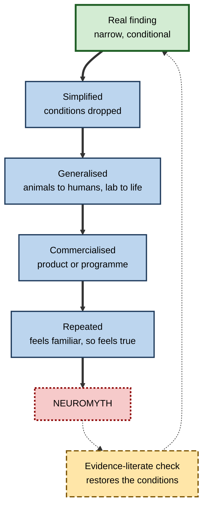
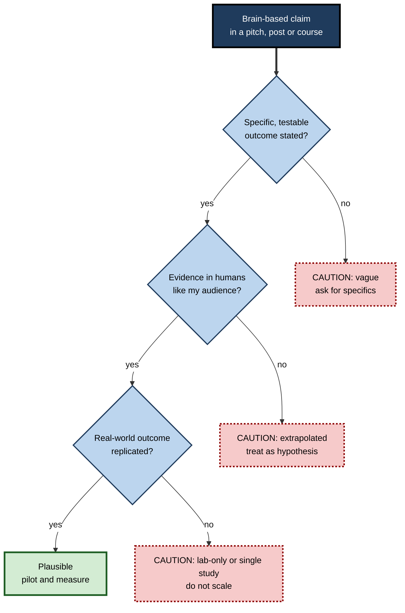

# J.11. Neuroplasticity Myths and Misconceptions

> **In one sentence:** Neuromyths are popular beliefs about the brain that distort real research — such as "we use 10% of our brains", "learning styles", or "rewire your brain in 21 days" — and spotting them protects your time, money and credibility.
>
> **Why it matters:** Corporate learning, coaching, education technology and self-help are saturated with "brain-based" claims. Professionals who can separate genuine plasticity science from myth make better decisions, waste less budget and earn trust with evidence-literate colleagues.
>
> **Level span:** Novice → Expert · **Reading time:** ~18 min · **Builds on:** what neuroplasticity is; basic familiarity with plasticity mechanisms

---

## The Learning Ladder

| Level | Badge | After this level you can... |
|---|---|---|
| 1 | NOVICE | Recognise the most common brain myths and say why they are wrong. |
| 2 | FOUNDATIONS | Explain what a neuromyth is, how myths form and why they persist. |
| 3 | PRACTITIONER | Use a simple checklist to evaluate brain-based claims in products, courses and articles. |
| 4 | ADVANCED | Explain the psychology of neuro-persuasion, evidence on myth prevalence and what reduces myth belief. |
| 5 | EXPERT / PRO | Lead evidence-literate procurement and communication, and correct myths without alienating people. |

---

## Level 1 · Novice — The Big Picture

Brain science is exciting, and popular culture loves it. But as research findings travel from laboratories to headlines, books, social media and training slides, they often get simplified, stretched and sometimes turned upside down. The results are **neuromyths**: confident-sounding statements about the brain that are false or badly oversimplified.

An analogy: think of the party game "telephone", where a message whispered along a line ends up garbled. A careful finding like "in rats, enriched cages increased cortical thickness" can turn into "brain toys make babies smarter" by the end of the line.

You have probably heard some of these:

- "We only use 10% of our brains."
- "I'm a visual learner, so I need diagrams."
- "She's right-brained — creative, not logical."
- "Play Mozart to babies to make them smarter."
- "It takes 21 days to rewire your brain for a new habit."
- "Brain-training games will make you sharper at everything."

Each of these contains a grain of something real, wrapped in a myth.

The beginner's key idea: **the brain is genuinely plastic, but that truth is often used to sell claims that research does not support. Be curious, and ask for evidence.**

---

## Level 2 · Foundations — Core Concepts

### What a neuromyth is

The term was popularised by the OECD in 2002 to describe "misconceptions generated by a misunderstanding, a misreading or a misquoting of facts scientifically established by brain research to make a case for use of brain research in education and other contexts". Neuromyths are not random errors; they usually start from a real finding.

### How a myth forms

**Figure J.11-1 — From real finding to neuromyth.**

*How to read it:* the thick path shows each step that distorts a finding; the dotted loop shows that checking the original conditions brings you back to the real science.

### Common neuromyths and the truths they distort

| Myth | Grain of truth | Reality |
|---|---|---|
| **We use only 10% of our brains** | Not all neurons fire at once. | Imaging shows activity across virtually the whole brain over a day; damage to almost any region has effects. |
| **Left-brained versus right-brained people** | Some functions are lateralised, such as much of language in the left hemisphere for most people. | Large imaging analyses find no evidence that individuals are globally "left-" or "right-brain dominant"; the hemispheres work together. |
| **Learning styles** (visual, auditory, kinaesthetic) | People have preferences, and some content suits some formats. | Studies testing whether matching teaching to a person's preferred style improves learning have repeatedly failed to find a benefit. |
| **The Mozart effect** | A 1993 study found a brief spatial-task boost after listening to Mozart. | The effect was small, short-lived, linked to arousal and mood, and not reliably replicated; it never showed lasting intelligence gains, especially not in babies. |
| **Everything is decided by age three** | Early sensitive periods exist for some systems. | The brain stays plastic for life; most adult skills are learned later. |
| **Brain training makes you smarter overall** | You get better at the trained games. | Large reviews and meta-analyses find near transfer, but little or no far transfer to general intelligence or daily life. |

### Key terms

| Term | Plain meaning |
|---|---|
| **Neuromyth** | A misconception about the brain derived from distorted research. |
| **Near transfer** | Improvement on tasks very similar to the trained one. |
| **Far transfer** | Improvement on different tasks or real-world abilities. |
| **Lateralisation** | Specialisation of certain functions in one hemisphere. |
| **Neuro-enchantment** | Being overly persuaded by brain images or neuroscience language. |
| **Refutation text** | Writing that explicitly states a myth and explains why it is wrong. |

---

## Level 3 · Practitioner — Putting It to Work

### More myths you will meet at work

| Myth | What the evidence shows |
|---|---|
| **"Rewire your brain in 21 days."** | The figure appears to come from a 1960s self-help book about adjusting to plastic surgery. A 2010 study of habit formation found a median of about 66 days to reach automaticity, with a very wide range between people and habits. |
| **"Dopamine detox resets your brain."** | Dopamine is not a "pleasure chemical" that can be flushed out. Reducing compulsive digital habits can help behavior, but not through the mechanism claimed. |
| **"Brain Gym exercises integrate the hemispheres."** | Movement breaks can refresh attention, but specific "cross-crawl" claims about hemispheric integration lack support. |
| **"Neuroplasticity means you can achieve anything."** | Plasticity is real but bounded by biology, time, opportunity and the specificity of practice. |
| **"Multitasking trains your brain."** | Heavy multitasking is associated with worse filtering of distractions; task switching has costs. |
| **"Smart drugs supercharge learning in healthy people."** | Effects in healthy adults are modest and inconsistent; they can increase confidence more than accuracy and carry risks. |
| **"You can grow new brain cells with this product."** | Adult human neurogenesis is contested and no product has been shown to increase it. |

### A five-question claim check

1. **What exactly is claimed?** Rewrite the claim as a testable statement about behavior or performance.
2. **Who was studied?** Animals, children, patients or healthy adults like your audience?
3. **What was measured?** Brain activity, lab tasks, or real-world outcomes?
4. **How strong is the evidence?** One small study, or replicated randomised trials and meta-analyses?
5. **Who benefits?** Is the claim attached to a product, certification or speaker fee?

**Figure J.11-2 — A decision path for brain-based claims.**

*How to read it:* a claim must pass all three questions before it deserves investment; dotted-border boxes show the most common failure points.

### Worked example — reviewing a vendor proposal

| Proposal says | Check | Revised view |
|---|---|---|
| "Based on the latest neuroscience of learning styles, content is personalised to each employee's style." | Learning-style matching lacks evidence. | Drop style matching; personalise by prior knowledge and role instead. |
| "Brain scans prove our method increases engagement." | Small, uncontrolled imaging study; engagement not linked to performance. | Ask for delayed performance data. |
| "Uses spaced retrieval practice." | Strong, replicated evidence. | Keep; this is the valuable part. |

### Common mistakes

- **Rejecting everything with "brain" in it.** Some brain-informed practices (spacing, retrieval, sleep) are well supported.
- **Correcting people with contempt.** It entrenches beliefs; respectful explanation works better.
- **Replacing one myth with another.** For example, claiming "adults never make new neurons" to debunk "neurogenesis supplements".

---

## Level 4 · Advanced — Mechanisms, Models & Evidence

### How common are neuromyths?

Surveys of teachers across many countries consistently find high belief in several neuromyths. Learning styles is usually the most widely endorsed; in many samples, a large majority of teachers agree with it. A 2025 survey of language teachers found learning styles, the value of special "stimulating environments" for preschoolers, and hemispheric dominance among the most common beliefs, and a cross-national study in 11 countries published in 2025 confirmed that neuromyths remain widespread. Reviews report that prevalence among educators **has not clearly declined over the past decade**. Comparable data for corporate L&D professionals are sparser, but the same myths appear frequently in workplace training materials.

### The neuroscience knowledge paradox

A widely cited finding (Sanne Dekker and colleagues, 2012) was that teachers with more general knowledge about the brain were *more* likely to endorse some neuromyths, not less — perhaps because enthusiasm for brain science increases exposure to popularised claims. Later studies show mixed patterns, but the lesson stands: **interest in neuroscience is not the same as evidence literacy**.

### Why neuroscience persuades

- **Seductive allure:** Deena Weisberg and colleagues (2008) found that adding irrelevant neuroscience language to psychological explanations made poor explanations seem more satisfying to non-experts.
- **Brain images:** early studies suggested brain images boost credibility; later replications found the image effect smaller than first thought, but neuroscience language effects persist.
- **Physical explanation bias:** a biological explanation feels more "real" than a psychological one, even when it adds nothing.

### Why myths persist

| Driver | Example |
|---|---|
| **Intuitive appeal** | Learning styles flatter individuality. |
| **Commercial incentives** | Products, certifications and talks built on myths. |
| **Repetition** | Familiar statements feel true (the illusory truth effect). |
| **Partial truth** | Each myth has a real kernel that makes it hard to dismiss. |
| **Hard-to-access evidence** | Primary research is technical; summaries are often inaccurate. |

### What reduces myth belief

- **Refutation texts**, which state the myth, explain why it is wrong and give a better alternative, outperform simple factual statements.
- **Professional development** focused on research literacy reduces some neuromyths in teachers, though effects can fade.
- **Replacing, not just removing.** People need an accurate alternative explanation to fill the gap.

### Evidence on brain training in detail

Large reviews (for example, a 2016 consensus review in a major psychological science journal and second-order meta-analyses) conclude that commercial brain-training games improve performance on the trained tasks, sometimes on similar tasks, but rarely on unrelated cognitive abilities or real-world outcomes. In 2016, United States regulators reached a multi-million-dollar settlement with a major brain-training company over advertising claims. Some specific programmes, such as speed-of-processing training in older adults, have shown more durable benefits in particular outcomes, so the honest summary is **"mostly narrow, occasionally useful, never a general upgrade"**.

---

## Level 5 · Expert / Pro — Professional Mastery

### Evidence-literate procurement

| Practice | Implementation |
|---|---|
| **Claims register** | Log every scientific claim in vendor proposals with evidence status. |
| **Evidence standards** | Require delayed performance outcomes, not only satisfaction or brain imagery. |
| **Pilot and measure** | Run small controlled pilots before scaling. |
| **Expert review** | Ask a learning scientist or evidence-literate colleague to review high-cost programmes. |
| **Contract terms** | Tie renewal to measured outcomes rather than to activity metrics. |

### Correcting myths without alienating people

1. **Start with shared goals:** "We both want people to learn effectively."
2. **Acknowledge the kernel of truth:** "Preferences are real, and varied formats help everyone."
3. **State the evidence clearly:** "Matching teaching to a person's preferred style hasn't been shown to improve learning."
4. **Offer the better alternative:** "Matching format to the content, and using retrieval and spacing, has strong evidence."
5. **Avoid ridicule:** People who believed a myth were usually taught it by trusted sources.

### Professional scenario

**Role:** Learning experience designer at a global consulting firm.
**Situation:** A senior partner insists that new leadership content include a "know your brain type" module and learning-style questionnaires, because "the science says people learn differently".
**What the pro does:** Agrees that people differ — in prior knowledge, goals and confidence — and proposes adapting content to those differences. Shares a one-page refutation summary on learning styles and hemispheric "brain types". Replaces the questionnaire with a diagnostic pre-assessment that routes people by actual skill gaps. Keeps one engaging, accurate segment on how the brain consolidates learning through spacing and sleep. The partner accepts because the alternative still honours individual differences.

### AI-era note

Generative AI tools can repeat neuromyths fluently, because myths are common in their training data. Professionals using AI to draft learning content should **fact-check brain-related statements** against reliable sources and ask the tool explicitly about evidence quality and replication status.

---

## Myths vs. Evidence

| Myth | What the evidence shows |
|---|---|
| "We use only 10% of our brains." | Virtually the whole brain is active over a day; no large region is unused. |
| "People are left-brained or right-brained." | No global individual hemispheric dominance; the hemispheres cooperate. |
| "Teaching to learning styles improves learning." | Matching instruction to preferred style has not been shown to improve outcomes. |
| "Mozart makes babies smarter." | The original effect was small, brief and not reliably replicated. |
| "Brain games boost general intelligence." | Gains are mostly specific to trained tasks; far transfer is weak or absent. |
| "Habits rewire in 21 days." | Habit automaticity in one study took a median of about 66 days, with wide variation. |
| "Neuroplasticity means anything is possible." | Plasticity is real but constrained by biology, time and specificity. |

## Practitioner Toolkit

**Neuromyth red-flag checklist**

- [ ] Uses "brain-based", "neuro-" or brain images without specific outcomes.
- [ ] Promises fast, general, effortless transformation.
- [ ] Cites a single study, an animal study or no study.
- [ ] Relies on learning styles, brain dominance or "brain types".
- [ ] Measures satisfaction or engagement rather than performance.
- [ ] Sells a product attached to the claim.

**Refutation template** (for slides, emails or conversations)

1. *Myth:* state it plainly.
2. *Why it seems true:* acknowledge the kernel.
3. *What research shows:* one or two clear sentences.
4. *What to do instead:* a practical, evidence-based alternative.

## Self-Check

1. **[NOVICE]** Name three common neuromyths.
2. **[NOVICE]** What is the grain of truth in the learning-styles myth?
3. **[FOUNDATIONS]** What is a neuromyth, and how does one typically form?
4. **[FOUNDATIONS]** What is the difference between near and far transfer?
5. **[PRACTITIONER]** List the five claim-check questions.
6. **[ADVANCED]** What is the neuroscience knowledge paradox?
7. **[ADVANCED]** What did the "seductive allure" study show?
8. **[ADVANCED]** What reduces belief in neuromyths most effectively?
9. **[EXPERT / PRO]** How would you correct a senior colleague's belief in learning styles?
10. **[EXPERT / PRO]** Why should AI-generated learning content be checked for neuromyths?

### Answer Key

1. Any three: 10% of the brain, left- or right-brained, learning styles, Mozart effect, brain games make you smarter, rewire in 21 days.
2. People do have preferences, and some content suits particular formats.
3. A misconception about the brain from distorted research; a narrow finding is simplified, generalised, commercialised and repeated.
4. Near transfer is improvement on similar tasks; far transfer is improvement on different abilities or real-world outcomes.
5. What exactly is claimed? Who was studied? What was measured? How strong is the evidence? Who benefits?
6. People with more general brain knowledge sometimes endorse more neuromyths, perhaps due to greater exposure to popular claims.
7. Adding irrelevant neuroscience language made poor explanations more satisfying to non-experts.
8. Refutation texts that state the myth, explain the error and provide an accurate alternative.
9. Start with shared goals, acknowledge the kernel, state the evidence, offer a better alternative, avoid ridicule.
10. AI tools learn from text containing common myths and can reproduce them fluently.

## Key Takeaways

- **Neuromyths** start from real findings and become distorted through simplification, generalisation and commercialisation.
- The most common include **10% of the brain, learning styles, left/right brain, Mozart effect and brain-training transfer**.
- Myth belief among educators is **high and not clearly declining**.
- Neuroscience language is **persuasive**, even when irrelevant.
- **Refutation plus an alternative** is the most effective correction.
- Evidence-literate professionals **require real-world outcomes** before investing.

## Glossary

| Term | Meaning |
|---|---|
| Far transfer | Improvement on tasks or abilities different from those trained. |
| Illusory truth effect | Repeated statements feel more true. |
| Lateralisation | Functional specialisation of a hemisphere. |
| Learning styles | The disproven idea that matching instruction to sensory preference improves learning. |
| Near transfer | Improvement on tasks similar to those trained. |
| Neuro-enchantment | Being overly persuaded by neuroscience imagery or terms. |
| Neuromyth | A misconception about the brain derived from distorted research. |
| Refutation text | Writing that names a myth, explains its error and gives an alternative. |
| Seductive allure | The tendency for neuroscience language to make explanations seem better. |
