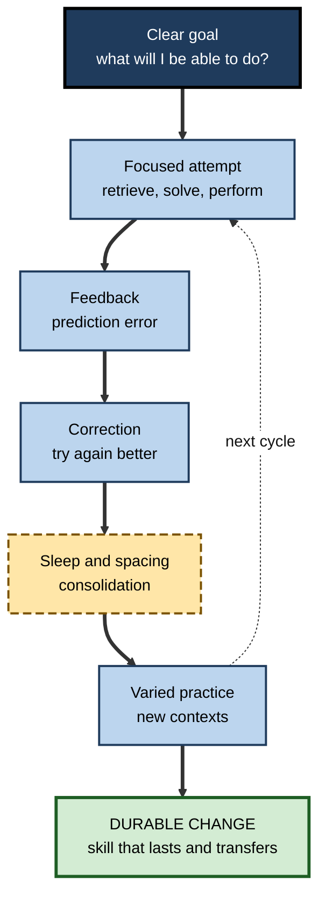
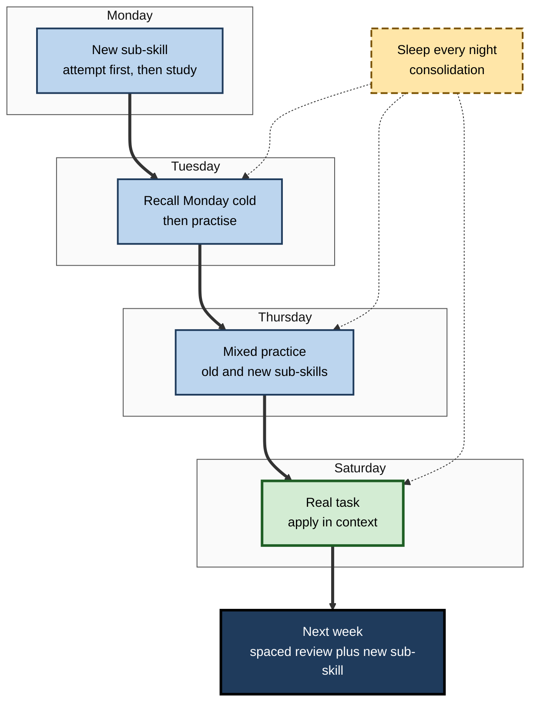

# J.12. Harnessing Neuroplasticity for Learning

> **In one sentence:** Harnessing neuroplasticity means deliberately arranging attention, effort, timing, feedback, sleep and meaning so that practice produces durable change in the brain — and refusing shortcuts that only feel like learning.
>
> **Why it matters:** Plasticity is the engine of every skill you will build in your career. People who work with the brain's rules rather than against them learn faster, retain more and keep adapting as technology and roles change, including in an era when AI can do much of the thinking for us.
>
> **Level span:** Novice → Expert · **Reading time:** ~19 min · **Builds on:** the other ideas in neuroplasticity — Hebbian learning, structural change, experience-dependent plasticity, myelin, sleep and stress

---

## The Learning Ladder

| Level | Badge | After this level you can... |
|---|---|---|
| 1 | NOVICE | List the everyday habits that make practice actually change your brain. |
| 2 | FOUNDATIONS | Connect each plasticity mechanism to a practical learning technique. |
| 3 | PRACTITIONER | Build a personal learning plan that uses those techniques week by week. |
| 4 | ADVANCED | Explain why the techniques work, where the evidence is strong, and where limits and debates remain. |
| 5 | EXPERT / PRO | Design plasticity-informed programmes for teams and organisations, including AI-era safeguards and metrics. |

---

## Level 1 · Novice — The Big Picture

Your brain changes whenever you learn. But not every hour of "studying" changes it equally. An hour of half-attentive video watching changes very little; twenty minutes of focused effort trying to recall, solve or perform something — then sleeping on it and doing it again a few days later — changes a lot.

Think of training a muscle. Watching someone else lift weights does nothing for you. Lifting something too light does little. Lifting something challenging, with good form, regularly, with rest days in between, builds strength. The brain is not a muscle, but its rules for change are surprisingly similar: **effort, repetition, recovery and the right level of challenge**.

You have already experienced this when:

- you remembered the parts of a training you had to *do* far better than the parts you only *heard*;
- you finally "got" something after struggling with it for a while;
- a skill you practised a little each day for a month stuck far better than one crammed into a weekend.

The beginner's key idea: **focus, effortful recall, spacing over days, good sleep and real practice are what turn experience into lasting brain change.**

---

## Level 2 · Foundations — Core Concepts

### From mechanism to technique

Each well-established plasticity mechanism suggests a learning technique:

| Plasticity mechanism | What it means | Learning technique |
|---|---|---|
| **Attention and neuromodulator gating** | Experience changes the brain more when it is attended and important. | Focused sessions; clear goals; remove distractions. |
| **Hebbian strengthening and weakening** | Co-active connections strengthen; mismatches weaken. | Active production; immediate corrective feedback. |
| **Prediction error** | Surprise and errors signal what needs updating. | Pretesting, attempting before being told, then feedback. |
| **Consolidation over time** | Changes stabilise over hours to days. | Spaced practice across days and weeks. |
| **Sleep-dependent consolidation** | Sleep replays and recalibrates new learning. | Protect sleep; review before sleep; recall next day. |
| **Structural selection** | Useful circuits are kept, others pruned. | Varied, interleaved practice of real tasks. |
| **Specificity** | Circuits used are circuits changed. | Practise the actual target skill. |
| **Use it or lose it** | Unused circuits weaken. | Scheduled maintenance practice. |

**Figure J.12-1 — The plasticity loop behind effective learning.**

*How to read it:* each cycle combines effortful attempt, feedback, correction and consolidation; the dotted arrow shows the cycle repeating with increasing variety until change is durable.

### Key terms

| Term | Plain meaning |
|---|---|
| **Retrieval practice** | Recalling information from memory rather than re-reading it. |
| **Spacing effect** | Better long-term retention when practice is spread out over time. |
| **Interleaving** | Mixing different types of problems or skills in one session. |
| **Pretesting** | Attempting questions before studying the material. |
| **Desirable difficulty** | A challenge that slows learning in the moment but improves retention and transfer. |
| **Prediction error** | The gap between what you expected and what happened, which drives updating. |
| **Cognitive offloading** | Letting a tool or person do mental work for you. |

---

## Level 3 · Practitioner — Putting It to Work

### The weekly plasticity plan

1. **Define the target.** "By the end of six weeks I will be able to ___ without help." Make it observable.
2. **Break it into sub-skills.** List three to six components to practise.
3. **Schedule short, focused sessions.** Twenty to fifty minutes, most days, with notifications off.
4. **Start each session with retrieval.** Before looking anything up, recall or attempt what you did last time.
5. **Attempt before you look.** For new material, try a problem or answer a question first; then study the solution.
6. **Get feedback fast.** Check answers, run the code, ask a mentor, compare with an expert example.
7. **Mix it up.** After the basics, interleave sub-skills and vary the context.
8. **Sleep on it.** End intensive study at least an hour before bed; do a brief recall the next morning.
9. **Space the reviews.** Revisit each sub-skill after roughly one day, a few days, a week and a few weeks.
10. **Maintain.** Once learned, keep the skill alive with occasional real use.

**Figure J.12-2 — One week of plasticity-informed practice.**

*How to read it:* each day builds on the previous with spaced recall and increasing variety; dotted arrows show nightly consolidation feeding each next session.

### Worked example — a marketing analyst learning SQL in six weeks

| | Before | After |
|---|---|---|
| **Method** | Watches a 10-hour video course at 1.5x speed over two weekends. | 30-minute sessions five days a week; each begins with writing last session's queries from memory. |
| **Practice** | Copies example queries. | Answers real business questions with own data; attempts before checking. |
| **Feedback** | None. | Runs queries; compares with a colleague's solutions weekly. |
| **AI use** | Asks an assistant to write every query. | Writes first; asks the assistant only to critique or explain errors. |
| **Week 6** | Can recognise syntax but cannot write a join unaided. | Writes multi-table queries and window functions independently. |

### Common mistakes

- **Mistaking exposure for practice.** Watching, reading and highlighting are low-plasticity activities.
- **Avoiding errors.** Errors followed by feedback are among the strongest learning signals.
- **Massing practice.** Long single sessions feel productive but are forgotten faster than spaced sessions.
- **Studying instead of sleeping.** It trades durable learning for a feeling of progress.
- **Letting tools do the core thinking.** If AI generates every answer, your brain practises supervising, not doing.

---

## Level 4 · Advanced — Mechanisms, Models & Evidence

### Why the techniques work

| Technique | Evidence strength | Plasticity rationale |
|---|---|---|
| **Retrieval practice** | Very strong; hundreds of studies and multiple meta-analyses. | Reactivation strengthens and reorganises memory traces; retrieval may trigger reconsolidation and integration. |
| **Spacing** | Very strong across ages and materials. | Allows consolidation between sessions; re-engages forgetting-and-relearning processes that strengthen traces. |
| **Interleaving** | Strong for discrimination and category learning, especially in mathematics; less consistent in some domains. | Forces selection between strategies, building flexible, discriminative circuits. |
| **Pretesting and errorful generation** | Moderate to strong when followed by feedback. | Prediction errors engage neuromodulatory signals that gate plasticity. |
| **Sleep after learning** | Strong. | Hippocampal replay and synaptic recalibration stabilise and integrate memories. |
| **Curiosity** | Moderate. | Curiosity engages dopamine-related circuits and has been shown to enhance memory for information learned in a curious state. |

These techniques are covered in depth elsewhere in learning science; here the key insight is that **they all work by engaging the same plasticity machinery**: attention, effortful reactivation, prediction error, time and sleep.

### What not to expect

- **No general "brain upgrade".** Plasticity is specific; training one skill rarely improves unrelated abilities.
- **No instant rewiring.** Durable change takes weeks to months.
- **No plasticity drugs for healthy learners.** Compounds that reopen plasticity in animals are experimental and not learning aids for healthy adults.
- **Individual variation.** Age, prior knowledge, sleep, stress and health all modulate how fast plasticity proceeds.

### AI and cognitive offloading: what recent research suggests

Generative AI changes which circuits get exercised. Several lines of evidence point the same way:

- **Field experiments in education:** a large 2025 study with high-school mathematics students found that unrestricted access to a GPT-4 assistant improved practice performance but **reduced** later unaided exam performance; a hint-based version largely avoided the harm.
- **Neural measures:** a 2025 study from MIT Media Lab recorded EEG while participants wrote essays with an AI chatbot, a search engine or no tools. The AI group showed the weakest brain connectivity patterns and poorest recall of their own essays. It was a small, initially non-peer-reviewed preprint and should be treated as **preliminary**, but it fits the broader pattern.
- **Reviews of cognitive offloading:** offloading boosts immediate performance and efficiency, but can reduce the deeper processing that builds durable memory and skill, especially when learners have weaker self-regulation.

The plasticity principle explains the pattern: **circuits that are not used are not strengthened**. AI is not inherently harmful to learning; how it is used determines whether the learner's brain does the work.

### Open debates

- How much **difficulty** is desirable for different learners, and how to personalise it.
- Whether **neurostimulation** (such as transcranial direct current stimulation) meaningfully enhances learning in healthy people; results so far are inconsistent.
- How **AI tutors** can be designed to preserve productive struggle while providing support.
- How to measure **real-world transfer** reliably at scale.

---

## Level 5 · Expert / Pro — Professional Mastery

### A plasticity-informed programme blueprint

| Component | Design choice | Rationale |
|---|---|---|
| **Duration** | 6–12 weeks rather than a single event. | Structural change and consolidation need time. |
| **Cadence** | Two to four short practice sessions per week. | Spacing and repetition. |
| **Session design** | Start with retrieval; attempt before instruction; end with application. | Reactivation, prediction error, specificity. |
| **Feedback** | Within a day; from peers, experts or well-configured AI. | Corrects errors before they entrench. |
| **Variety** | Interleaved cases and changing contexts after initial learning. | Builds flexible, transferable circuits. |
| **Workload** | Learning scheduled in working hours; no late-night deadlines. | Protects sleep and avoids chronic stress. |
| **AI policy** | "Attempt first, hints second, answers last"; AI as critic and coach. | Keeps the learner's circuits active. |
| **Maintenance** | Quarterly refreshers for critical, rarely used skills. | Use it or lose it. |

### Metrics that reflect real plasticity

1. **Delayed, unaided performance** at 30, 60 and 90 days.
2. **Transfer tasks** that differ from training examples.
3. **On-the-job behavior** observed by managers or captured in work data.
4. **Time to independent performance** for new joiners.
5. **Retention of rarely used critical skills** in drills.

Avoid relying on satisfaction scores, completion rates or brain-imaging claims as evidence of learning.

### Professional scenario

**Role:** VP of engineering at a scale-up adopting AI coding assistants across 300 developers.
**Situation:** Productivity metrics are up, but senior engineers report that junior developers struggle to debug unfamiliar code and to review AI-generated changes critically.
**What the pro does:** Frames the problem as a plasticity issue: juniors are practising prompting and accepting, not reasoning about code. Introduces weekly "unassisted katas" (30 minutes, AI off), requires a written explanation of every AI-generated change in code review, and configures the assistant in learning repositories to give hints and questions before code. Adds a quarterly debugging assessment without AI. Over two quarters, juniors' debugging assessment scores rise and production incidents linked to unreviewed AI code fall, while overall productivity remains high.

### Ethics and equity

- Not everyone can protect sleep, time and focus equally; caregivers, shift workers and people with disabilities need flexible designs.
- Plasticity science should **expand opportunity** ("everyone can keep learning"), never justify blame ("you just didn't try hard enough").
- Monitoring "brain performance" in employees crosses privacy lines; measure learning outcomes, not people's brains.

---

## Myths vs. Evidence

| Myth | What the evidence shows |
|---|---|
| "More hours of exposure means more learning." | Focused, effortful, spaced practice beats long, passive exposure. |
| "Errors should be avoided while learning." | Errors followed by feedback are powerful learning signals. |
| "Cramming works if the test is tomorrow." | It may help tomorrow, but most of it is forgotten quickly; spacing produces durable learning. |
| "AI help always speeds learning." | Unrestricted AI can boost practice performance while reducing unaided learning; design of use matters. |
| "Brain-boosting products can replace practice." | No product substitutes for effortful, spaced, task-specific practice. |
| "Once learned, skills last forever." | Unused skills fade; maintenance practice preserves them. |

## Practitioner Toolkit

**Personal plasticity plan**

| Week | Sub-skill | Sessions planned | Retrieval start? | Feedback source | Sleep protected? | Delayed check date |
|---|---|---|---|---|---|---|
| 1 | | | | | | |
| 2 | | | | | | |
| 3 | | | | | | |

**Session checklist**

- [ ] Notifications off; one clear goal.
- [ ] Started with recall of last session.
- [ ] Attempted before looking up answers.
- [ ] Got feedback on errors.
- [ ] Mixed in an older sub-skill.
- [ ] Used AI only for hints or critique.
- [ ] Ended at least an hour before sleep.

**AI-use ladder for learners**

1. Attempt alone.
2. Ask for a hint or a question, not an answer.
3. Ask for an explanation of your error.
4. Ask for a full solution only after a genuine attempt.
5. Redo the task alone afterwards.

## Self-Check

1. **[NOVICE]** Name four habits that make practice change your brain more.
2. **[NOVICE]** Why does watching a video change your brain less than doing the task?
3. **[FOUNDATIONS]** Match three plasticity mechanisms to learning techniques.
4. **[FOUNDATIONS]** What is prediction error, and how does it help learning?
5. **[PRACTITIONER]** Describe a session structure based on this note.
6. **[ADVANCED]** Which techniques have the strongest evidence, and what is their plasticity rationale?
7. **[ADVANCED]** What did the 2025 mathematics field experiment find about AI tutors?
8. **[ADVANCED]** Why should the MIT EEG study be treated as preliminary?
9. **[EXPERT / PRO]** Name four metrics that reflect durable learning.
10. **[EXPERT / PRO]** How would you design AI use in a team to preserve skill development?

### Answer Key

1. Focused attention, effortful retrieval, spaced practice, sleep, feedback, varied real-task practice.
2. Passive viewing engages fewer circuits and less effortful reactivation, attention and prediction error.
3. Examples: attention gating to focused sessions; consolidation to spacing; sleep consolidation to protecting sleep; prediction error to pretesting; structural selection to interleaving; specificity to real-task practice.
4. The gap between expectation and outcome; it signals what must be updated and engages neuromodulatory systems that gate plasticity.
5. Start with recall, attempt new material before instruction, get feedback, mix in older material, apply in context, end well before sleep.
6. Retrieval practice and spacing; they reactivate traces and allow consolidation over time.
7. Unrestricted GPT-4 help raised practice scores but lowered later unaided exam scores; a hint-based tutor largely avoided the harm.
8. It was small and initially not peer-reviewed.
9. Delayed unaided performance, transfer tasks, on-the-job behavior, time to independence, retention of critical skills.
10. Attempt-first norms, hint-based configurations, required explanations of AI output, regular unassisted practice and assessments.

## Key Takeaways

- Harnessing plasticity means arranging **attention, effort, feedback, spacing, sleep and specificity**.
- The best-supported techniques — **retrieval, spacing, interleaving, pretesting** — all engage the same plasticity machinery.
- **Errors with feedback** drive learning; avoid error-free, passive study.
- Expect **specific, gradual** change; no shortcuts give a general brain upgrade.
- **AI use determines whether the learner's brain does the work**; design for attempt-first, hints-before-answers.
- Measure learning by **delayed, unaided, real-world performance**.

## Glossary

| Term | Meaning |
|---|---|
| Cognitive offloading | Letting a tool do mental work you could do yourself. |
| Consolidation | Stabilisation of learning over time and sleep. |
| Desirable difficulty | A challenge that slows learning now but improves it later. |
| Interleaving | Mixing different problem types or skills in practice. |
| Maintenance practice | Occasional use that keeps a learned skill available. |
| Prediction error | The difference between expected and actual outcomes. |
| Pretesting | Attempting questions before instruction. |
| Retrieval practice | Recalling information from memory to strengthen it. |
| Spacing effect | Better retention from practice spread over time. |
| Transfer | Applying learning in new situations. |
