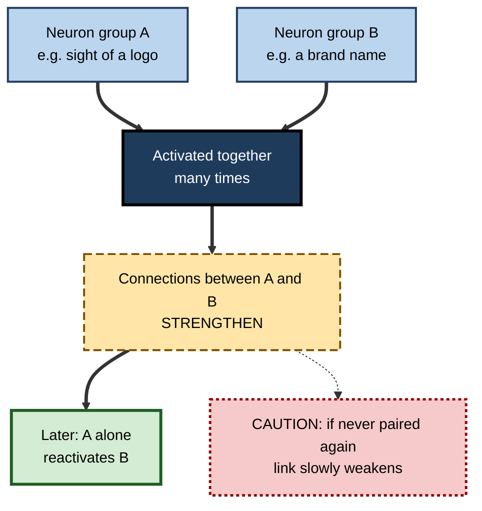
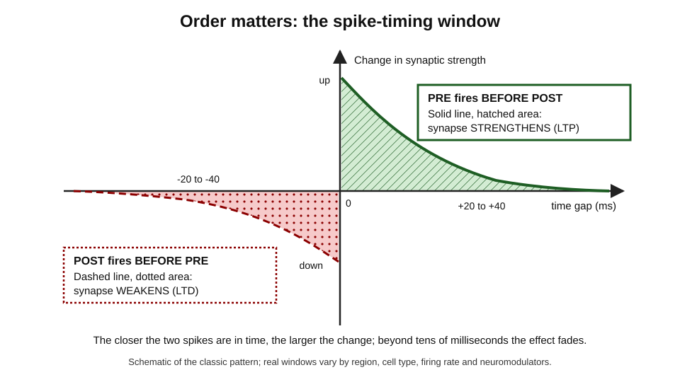
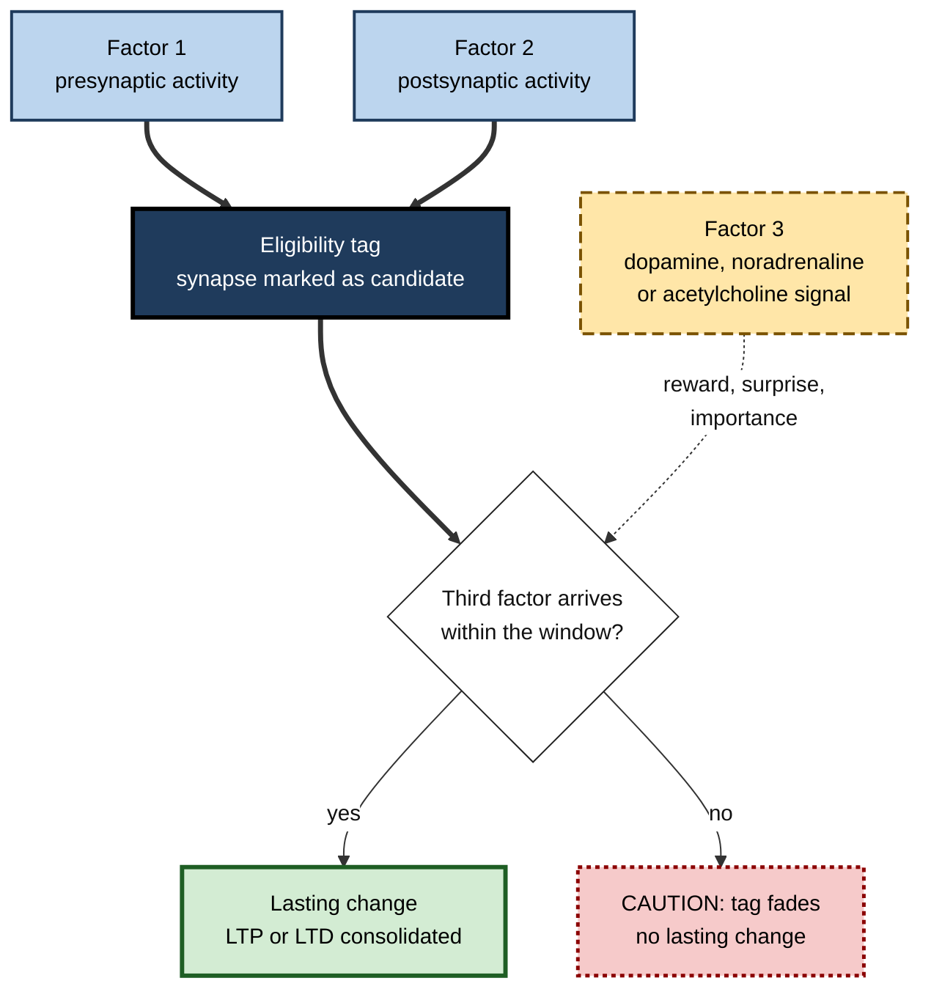

# J.2. Hebbian Learning: Neurons that Fire Together

> **In one sentence:** Hebbian learning is the rule that when one brain cell repeatedly helps another to fire, the connection between them grows stronger — summed up as "neurons that fire together wire together".
>
> **Why it matters:** It is the simplest explanation of why practice, association and habit work, and it sits underneath modern ideas about memory, skill and even artificial neural networks. Knowing its real shape (including timing, weakening and the need for a "this matters" signal) helps you design learning that sticks.
>
> **Level span:** Novice → Expert · **Reading time:** ~18 min · **Builds on:** what neurons and synapses are; the idea of neuroplasticity

---

## The Learning Ladder

| Level | Badge | After this level you can... |
|---|---|---|
| 1 | NOVICE | Explain "fire together, wire together" with an everyday example. |
| 2 | FOUNDATIONS | Describe Hebb's postulate, LTP, LTD and the cell assembly idea. |
| 3 | PRACTITIONER | Use pairing, timing and repetition deliberately to build associations and break unwanted ones. |
| 4 | ADVANCED | Explain NMDA receptors, spike-timing-dependent plasticity, BCM theory, homeostatic scaling, three-factor rules and behavioral-timescale plasticity. |
| 5 | EXPERT / PRO | Apply Hebbian thinking to habit design, training and AI, and recognise where the slogan misleads. |

---

## Level 1 · Novice — The Big Picture

Imagine two friends who always walk to work together. Over months, they start finishing each other's sentences; mention one and you think of the other. Brain cells behave in a similar way. When two connected neurons are active at the same time, again and again, the link between them strengthens. Later, activating one makes the other more likely to activate too.

This is **Hebbian learning**, named after the Canadian psychologist **Donald Hebb**, who proposed it in 1949. The catchy summary "neurons that fire together wire together" came later, from neuroscientist Carla Shatz.

You have already experienced Hebbian learning when:

- a song instantly brings back a specific summer;
- the smell of a certain coffee makes you think of your first office;
- you hear "Ctrl" and your fingers already reach for "C" and "V";
- a colleague's name comes to mind every time you see a particular dashboard they built.

Each is an association: two things experienced together became linked in your brain. The more often and more meaningfully they occurred together, the stronger the link.

The beginner's key idea: **things you repeatedly experience together become connected in your brain, so one starts to call up the other.**

---

## Level 2 · Foundations — Core Concepts

### Hebb's postulate

Hebb's original wording (1949) was roughly: when an axon of cell A is near enough to excite cell B and repeatedly or persistently takes part in firing it, some growth process or metabolic change takes place in one or both cells so that A's efficiency in firing B is increased.

Three ideas sit inside that sentence:

1. **Correlation:** the change depends on A and B being active together.
2. **Causation:** A should *take part in* firing B, not merely be active at the same time by coincidence.
3. **Locality:** the change happens at the specific connection between A and B, using only information available there.

### Cell assemblies

Hebb went further. He suggested that groups of neurons that are repeatedly active together become a **cell assembly** — a tightly connected group that can reactivate as a whole from a partial cue. Today this idea underlies the concept of a memory **engram**, the physical trace of a memory distributed across a set of cells.

**Figure J.2-1 — How co-activation builds an association.**

*How to read it:* co-activation (thick path) strengthens the link so that one cue can trigger the other; the dotted path shows that unused links fade.

### Strengthening and weakening

Learning would be impossible if synapses could only strengthen; everything would eventually connect to everything. The brain uses two opposite processes:

| Process | What it does | Rough trigger |
|---|---|---|
| **Long-term potentiation (LTP)** | Lasting strengthening of a synapse. | Strong, correlated activity of sending and receiving cells. |
| **Long-term depression (LTD)** | Lasting weakening of a synapse. | Weak or uncorrelated activity, or the wrong timing. |

### Key terms

| Term | Plain meaning |
|---|---|
| **Presynaptic neuron** | The sending cell at a synapse. |
| **Postsynaptic neuron** | The receiving cell. |
| **Synaptic weight** | How strongly one neuron influences another. |
| **Cell assembly** | A group of neurons that become wired to activate together. |
| **Engram** | The physical trace of a memory in the brain. |
| **Coincidence detector** | A mechanism that responds only when two signals happen together. |

---

## Level 3 · Practitioner — Putting It to Work

Hebbian learning suggests practical rules for building useful associations — and for weakening unhelpful ones.

### Building a useful association: the PAIR method

1. **Pair precisely.** Present the two things you want linked close together in time: a term and its meaning, a situation and the right response, an error message and its fix.
2. **Activate, do not just observe.** Retrieve or produce the second item yourself when you see the first. Active production engages the receiving circuits more strongly.
3. **Iterate across days.** Repeat the pairing in spaced sessions; a single strong pairing fades faster than repeated ones.
4. **Reduce noise.** Avoid pairing the target with irrelevant elements (the same slide background, the same order) that become accidental cues and do not exist in the real situation.

### Weakening an unwanted association

Because synapses weaken when activity is uncorrelated, unwanted links can be reshaped by repeatedly experiencing the cue *without* the old response, and instead with a new response. This is the logic behind habit replacement and behavioral therapies based on extinction. Note that the old link is usually *overlaid* by new learning, not erased; under stress or in the old context it can return.

### Worked example — onboarding to a monitoring dashboard

| | Before | After |
|---|---|---|
| **Training** | A slide deck listing every alert type and its meaning. | Each alert shown as it appears live, immediately paired with the action an engineer takes. |
| **Practice** | None after the session. | Short simulated incidents twice a week for a month; the trainee states the action before seeing it. |
| **Accidental cues** | Alerts always presented in the same order. | Order and context mixed so the link is alert-to-action, not slide-to-action. |
| **Result** | Trainee recognises the alert names but freezes on call. | Trainee responds quickly and correctly to real alerts. |

### Common mistakes

- **Pairing without engagement.** Background exposure produces weak associations.
- **Accidental pairing.** People learn whatever reliably co-occurs, including irrelevant cues such as the trainer's voice or the slide layout.
- **Assuming one pairing is enough.** Early strengthening decays unless repeated and consolidated.
- **Ignoring weakening.** Learning also means pruning wrong links; feedback on errors drives that.

---

## Level 4 · Advanced — Mechanisms, Models & Evidence

### The molecular coincidence detector

The best-understood mechanism for Hebbian LTP in the hippocampus and cortex involves the **NMDA receptor**, a glutamate receptor that opens fully only when two conditions are met at once: glutamate has been released by the presynaptic neuron *and* the postsynaptic membrane is already depolarised, which removes a magnesium block. The resulting calcium influx activates enzymes such as **CaMKII**, which leads to more AMPA receptors at the synapse and a stronger connection. Sustained, late-phase LTP needs new protein synthesis and can involve enlargement of the dendritic spine. Moderate, prolonged calcium entry instead tends to trigger LTD.

### Spike-timing-dependent plasticity (STDP)

In the late 1990s, experiments by Henry Markram, Guo-qiang Bi and Mu-ming Poo and others showed that the *order* of firing matters, at a millisecond scale. If the presynaptic neuron fires a few milliseconds *before* the postsynaptic neuron, the synapse tends to strengthen. If it fires *after*, the synapse tends to weaken. This turns Hebb's "taking part in firing" into a precise causal rule.

*Figure J.2-2 — The spike-timing-dependent plasticity window.* Horizontal axis: time of the postsynaptic spike minus the presynaptic spike. Right side (pre before post): strengthening. Left side (post before pre): weakening. The shape is schematic; real windows vary by brain region, cell type, firing rate and neuromodulators.

### Why pure Hebbian learning is unstable

A pure "fire together, wire together" rule is a positive feedback loop: stronger synapses cause more co-firing, which causes even stronger synapses. Left alone, it would saturate. Brains add stabilising mechanisms:

| Mechanism | Idea | Originators or key period |
|---|---|---|
| **BCM theory** | A sliding threshold: if a neuron has been very active, LTP becomes harder and LTD easier, and vice versa. | Bienenstock, Cooper and Munro, 1982 |
| **Synaptic scaling** | Neurons multiply all their synaptic strengths up or down to keep their average firing in range. | Gina Turrigiano and colleagues, late 1990s onward |
| **Competition** | Synapses compete for limited resources, so some must weaken for others to strengthen. | Developmental neuroscience, ongoing |
| **Inhibition** | Inhibitory neurons limit how many cells can fire together. | Ongoing |

### Three-factor learning rules

Hebb's rule has two factors: presynaptic and postsynaptic activity. Much evidence now supports a **third factor**: a neuromodulatory signal such as dopamine, noradrenaline or acetylcholine that indicates reward, surprise or importance. A synapse can be tagged as "eligible" by co-activity and then actually changed only if the third signal arrives within a time window. This explains why **attention, reward and surprise strongly shape what is learned**, and it connects Hebbian plasticity to reinforcement learning in AI.

**Figure J.2-3 — A three-factor learning rule.**

*How to read it:* co-activity only tags a synapse; a later neuromodulatory signal decides whether the tag becomes a lasting change.

### Behavioral timescale synaptic plasticity (BTSP)

Since 2017, Jeffrey Magee, Katie Bittner and colleagues have described a form of plasticity in hippocampal CA1 neurons that breaks the millisecond rule. A large **dendritic plateau potential** can strengthen inputs that were active seconds before or after it, and can create a new place-specific response in a single trial. Work published in 2024 linked this to delayed, stochastic activation of CaMKII in dendrites, and a 2025 review in a leading neuroscience journal described BTSP as a major new direction for learning and memory. BTSP is often called **non-Hebbian** or **"Hebbian-plus"**, because it does not require precise co-firing; it shows that the brain uses several learning rules, not one.

### Strength of the evidence

- **Very strong:** LTP and LTD exist and depend on NMDA receptors in many circuits; blocking them impairs several kinds of learning in animals.
- **Strong:** STDP exists in many preparations, but its exact form is variable and depends heavily on firing rates and neuromodulation.
- **Growing:** BTSP and three-factor rules as central mechanisms of real-world learning.
- **Open:** how synaptic rules combine at the scale of whole networks to produce human knowledge and skill.

---

## Level 5 · Expert / Pro — Professional Mastery

### Hebbian thinking in learning and habit design

| Hebbian principle | Design implication |
|---|---|
| Co-activation builds links | Pair cues with the target response in realistic contexts. |
| Causation, not just coincidence | The learner should *produce* the response, not merely see it beside the cue. |
| Weakening is learning too | Give corrective feedback so wrong links weaken. |
| Third factor gates learning | Make outcomes visible and meaningful; surprise and relevance boost retention. |
| Context becomes part of the memory | Vary contexts so learning transfers beyond the classroom. |

Habit design in products and workplaces relies on the same logic: a consistent cue, a routine, and a reward. Ethical designers ask whether the association serves the user, because the same mechanism powers compulsive app use.

### Hebbian learning and artificial intelligence

Hebb's rule inspired early neural network models, and Hopfield networks (recognised in the 2024 Nobel Prize in Physics alongside Geoffrey Hinton's work) use a Hebbian rule to store memories. Modern deep learning, however, mostly trains with **backpropagation**, which uses global error signals rather than local co-activity. Active research explores local, biologically plausible rules — including three-factor and BTSP-like rules — for energy-efficient neuromorphic chips and continual learning. For practitioners, the lesson is that "neural network" does not mean "works like the brain"; similarities are partial.

### Professional scenario

**Role:** Customer-support training lead in a software company.
**Situation:** New agents know the product but still choose the wrong escalation path under pressure.
**What the pro does:** Diagnoses an association problem: agents learned escalation rules as a list, not as cue-to-action links. Rebuilds training around 60 realistic ticket snippets, each requiring the agent to choose the path before seeing the answer, with immediate feedback. Snippets are shuffled across sessions and mixed with look-alike tickets that need a *different* path, so wrong links weaken. After four weeks of 15-minute sessions, mis-escalations fall substantially in the team's own ticket data.

### Where the slogan misleads

- "Fire together, wire together" hides **timing** (order matters), **weakening** (LTD is half the story) and **gating** (neuromodulators decide).
- It suggests that any repeated co-occurrence is good learning; in fact it also builds **biases, stereotypes and bad habits**.
- It is a **synapse-level** rule; jumping straight from it to classroom advice skips many levels of explanation.

---

## Myths vs. Evidence

| Myth | What the evidence shows |
|---|---|
| "Hebb said neurons that fire together wire together." | Hebb described causal participation in firing; the slogan came decades later and simplifies it. |
| "Synapses only strengthen with learning." | Weakening (LTD) and pruning are equally essential. |
| "Any repetition builds the right connection." | Repetition builds whatever is co-activated, including errors and irrelevant cues. |
| "Timing does not matter as long as things happen close together." | At synapses, millisecond order often decides strengthening versus weakening. |
| "AI neural networks learn the way brains do." | Most AI uses backpropagation, which differs substantially from local synaptic rules. |
| "Old associations are erased by new ones." | Old links are often suppressed rather than erased and can return under stress or in the old context. |

## Practitioner Toolkit

**Association-building checklist**

- [ ] The cue and target response are paired in a realistic context.
- [ ] Learners produce the response themselves before seeing it.
- [ ] Wrong responses get immediate corrective feedback.
- [ ] Pairings are repeated across several days.
- [ ] Order, layout and context are varied to avoid accidental cues.
- [ ] Look-alike cues requiring different responses are included.

**Habit replacement template**

| Cue (when...) | Old response | New response | Reward or visible outcome | Practice plan |
|---|---|---|---|---|
| | | | | |

## Self-Check

1. **[NOVICE]** What does "neurons that fire together wire together" mean in plain words?
2. **[NOVICE]** Give one example of an association you learned by Hebbian pairing.
3. **[FOUNDATIONS]** What is a cell assembly?
4. **[FOUNDATIONS]** Why does the brain need LTD as well as LTP?
5. **[PRACTITIONER]** Why should learners produce the response rather than just see it next to the cue?
6. **[ADVANCED]** Why is the NMDA receptor called a coincidence detector?
7. **[ADVANCED]** What does the STDP window show?
8. **[ADVANCED]** What problem do BCM theory and synaptic scaling solve?
9. **[EXPERT / PRO]** How does a three-factor rule change how you design training?
10. **[EXPERT / PRO]** Name two ways the slogan "fire together, wire together" misleads.

### Answer Key

1. When two connected brain cells are repeatedly active together, their connection strengthens, so one tends to activate the other.
2. Answers vary — a song tied to a memory, a keyboard shortcut, a smell tied to a place.
3. A group of neurons that have become strongly interconnected through repeated co-activation and can reactivate together from a partial cue.
4. Without weakening, all synapses would saturate, and the brain could not refine or correct associations.
5. Production engages the receiving circuits and makes the cue genuinely *cause* the response, matching Hebb's causal condition.
6. It opens fully only when presynaptic glutamate release and postsynaptic depolarisation happen together.
7. Pre-before-post firing within tens of milliseconds tends to strengthen a synapse; post-before-pre tends to weaken it.
8. The instability of pure Hebbian learning, which would otherwise drive synapses to saturation.
9. It means learning is gated by importance, reward and surprise, so training should make outcomes visible, meaningful and timely.
10. It hides timing and weakening, ignores neuromodulatory gating, and implies all repeated co-occurrence is good learning.

## Key Takeaways

- Hebbian learning: **repeated, causal co-activation strengthens connections**.
- **LTP and LTD** — strengthening and weakening — are both essential.
- At the synapse, **timing and order** matter (STDP).
- Pure Hebbian learning is unstable; **homeostatic and competitive mechanisms** keep it in check.
- **Neuromodulators act as a third factor**, gating what gets learned.
- **BTSP** shows the brain also uses rules that link events seconds apart in a single trial.
- In practice: pair cue and response, make learners produce it, vary context, give feedback.

## Glossary

| Term | Meaning |
|---|---|
| BCM theory | A model in which the threshold for strengthening slides with a neuron's recent activity. |
| Behavioral timescale synaptic plasticity (BTSP) | One-shot plasticity that links inputs active seconds around a dendritic plateau potential. |
| CaMKII | An enzyme activated by calcium that is central to LTP. |
| Cell assembly | A group of neurons wired to activate together. |
| Eligibility trace | A temporary tag marking a synapse as a candidate for change. |
| Engram | The physical trace of a memory. |
| Hebbian learning | Strengthening of connections through repeated causal co-activation. |
| NMDA receptor | A glutamate receptor that acts as a coincidence detector for LTP. |
| Spike-timing-dependent plasticity (STDP) | Plasticity whose direction depends on the order of pre- and postsynaptic spikes. |
| Synaptic scaling | Global adjustment of a neuron's synapses to stabilise its activity. |
| Three-factor rule | A learning rule requiring pre, post and a neuromodulatory signal. |
