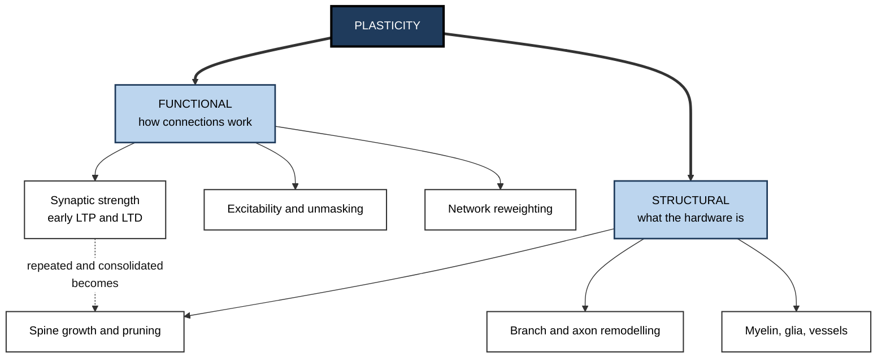
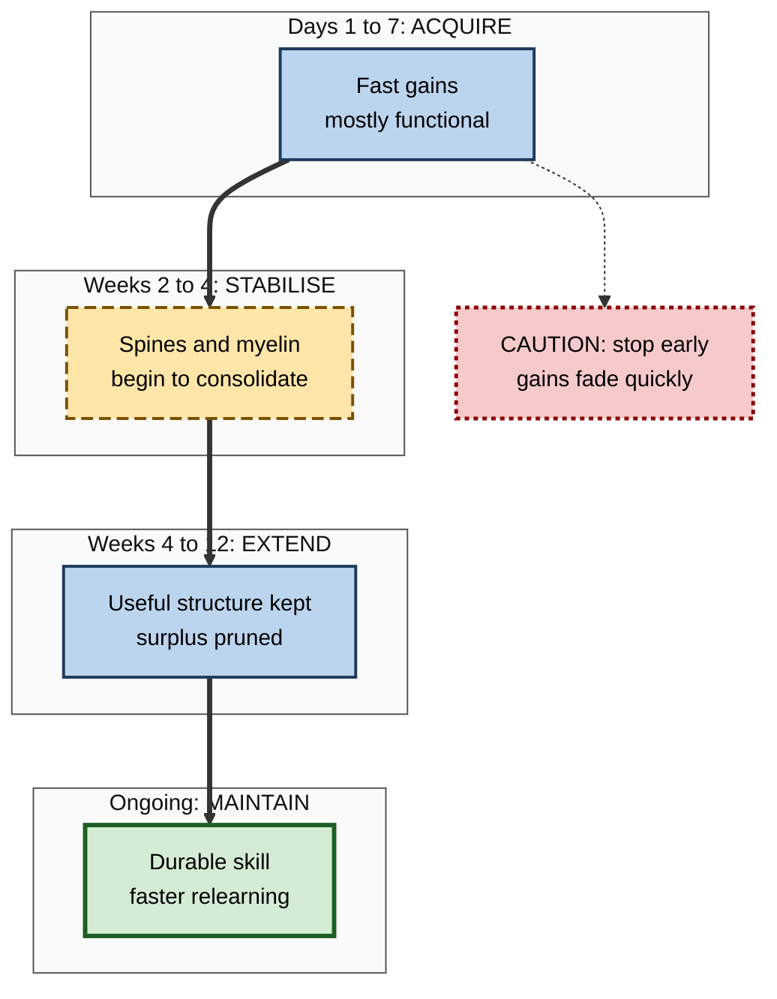
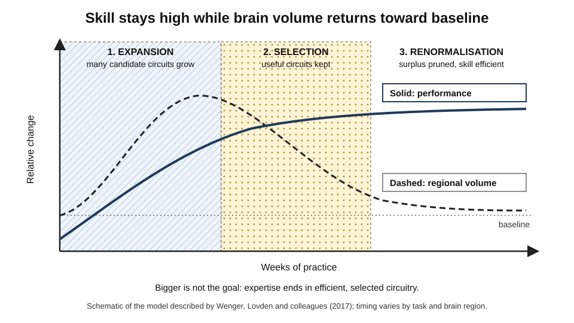

# J.3. Structural vs. Functional Plasticity

> **In one sentence:** Functional plasticity changes how existing brain connections work, while structural plasticity changes the physical hardware itself — new or lost spines, branches, myelin and, in some places, cells.
>
> **Why it matters:** The two kinds of change run on different timescales and leave different evidence. Knowing the difference lets you set realistic expectations for how fast skills form, read brain-imaging claims critically, and understand why early gains can fade unless practice continues.
>
> **Level span:** Novice → Expert · **Reading time:** ~17 min · **Builds on:** what neuroplasticity is; basic idea of synapses

---

## The Learning Ladder

| Level | Badge | After this level you can... |
|---|---|---|
| 1 | NOVICE | Explain the difference between "software" and "hardware" changes in the brain. |
| 2 | FOUNDATIONS | Name the main forms of functional and structural plasticity and their timescales. |
| 3 | PRACTITIONER | Match learning goals to the kind and pace of brain change they need. |
| 4 | ADVANCED | Interpret evidence from spine imaging, MRI and map studies, including the expansion–renormalisation pattern. |
| 5 | EXPERT / PRO | Critically evaluate imaging-based claims and design programmes for durable structural change. |

---

## Level 1 · Novice — The Big Picture

Think of a city's road network. Traffic engineers can make changes in two ways. They can **retime the traffic lights, open extra lanes at rush hour, or reroute traffic** — quick changes that use the roads that already exist. Or they can **build new roads, widen bridges and close old streets** — slow changes that alter the physical map.

The brain does both:

- **Functional plasticity** is like retiming the lights. Existing connections become more or less effective, or existing areas take on new jobs. It can happen within minutes.
- **Structural plasticity** is like building new roads. Neurons grow new contact points, branches are added or pruned, insulation around nerve fibres is adjusted. It usually takes days to months.

You have already experienced both:

- After 20 minutes with a new keyboard layout, you get a little faster. That early gain is mostly **functional**.
- After months of daily practice, the new layout feels natural even after a holiday. That durability reflects **structural** change underneath.

The beginner's key idea: **quick improvements come from tuning existing connections; long-lasting skills need physical rebuilding, which takes repeated practice over time.**

---

## Level 2 · Foundations — Core Concepts

### Functional plasticity

**Functional plasticity** is any change in how neurons and circuits *work* without (yet) changing their physical structure. Main forms:

| Form | What happens | Typical timescale |
|---|---|---|
| **Synaptic efficacy change** | A synapse transmits more or less strongly (early LTP or LTD). | Seconds to hours |
| **Intrinsic excitability change** | A neuron becomes easier or harder to fire overall. | Minutes to days |
| **Unmasking** | Existing but silent connections become active when a dominant input is removed. | Minutes to days |
| **Functional remapping** | An area takes over a role, or a task shifts to different regions. | Days to months |
| **Network reweighting** | Different regions coordinate more or less strongly during a task. | Minutes to weeks |

### Structural plasticity

**Structural plasticity** changes the physical anatomy:

| Form | What happens | Typical timescale |
|---|---|---|
| **Dendritic spine turnover** | Tiny protrusions that receive synapses appear, enlarge, shrink or disappear. | Hours to weeks |
| **Dendritic and axonal remodelling** | Branches grow or retract; axons sprout new terminals. | Days to months |
| **Myelin remodelling** | Insulation around axons is added, thinned or reshaped. | Days to weeks |
| **Glial and vascular change** | Support cells and blood vessels adapt to demand. | Days to weeks |
| **Neurogenesis** | New neurons are born (well established in rodents; contested in adult humans). | Weeks to months |

**Figure J.3-1 — Two families of plasticity and how they connect.**

*How to read it:* the two families branch from one concept; the dotted arrow shows that repeated functional changes are often stabilised by structural ones.

### They are partners, not rivals

In practice the two are tightly linked. A synapse that is strengthened functionally (early LTP) is often stabilised structurally (spine enlargement, more receptors anchored in place). Structural change, in turn, creates new possibilities for functional change. A useful rule: **functional change is fast and reversible; structural change is slower and more durable.**

### Key terms

| Term | Plain meaning |
|---|---|
| **Dendritic spine** | A small protrusion on a dendrite where most excitatory synapses form. |
| **Unmasking** | Activation of previously silent or suppressed connections. |
| **Grey matter** | Brain tissue rich in neuron bodies, dendrites and synapses. |
| **White matter** | Brain tissue made mostly of myelinated axons connecting regions. |
| **Voxel-based morphometry (VBM)** | An MRI method that estimates local grey matter volume or density. |
| **Diffusion MRI** | An MRI method that measures water movement to infer white matter structure. |

---

## Level 3 · Practitioner — Putting It to Work

### Matching goals to the kind of change you need

| Goal | Change mostly needed | Realistic timeframe | Implication |
|---|---|---|---|
| Remember a client's preferences for a meeting tomorrow | Functional | Hours to days | A quick review is fine. |
| Use a new software tool fluently | Functional then structural | Weeks | Daily use over several weeks. |
| Become fluent in a new programming language | Structural | Months | Sustained practice; expect plateaus. |
| Build expert judgement in a domain | Structural, widespread | Years | Deliberate practice with feedback over long periods. |

### A four-phase practice plan for durable change

1. **Acquire (days 1–7).** Short, focused sessions. Rapid gains come largely from functional tuning; expect them to be fragile.
2. **Stabilise (weeks 2–4).** Keep practising after the novelty wears off. This is when structural consolidation is building; stopping here loses much of the early gain.
3. **Extend (weeks 4–12).** Add variety and difficulty so the skill generalises. The brain keeps the useful new structure and prunes what is not needed.
4. **Maintain (ongoing).** Lower-frequency use keeps the skill available. Unused skills slowly weaken but usually relearn faster than they were first learned, a sign that some structural trace remains.

**Figure J.3-2 — Where functional and structural change dominate across a learning period.**

*How to read it:* the thick path moves from fast functional gains to durable structural change; the dotted arrow shows the common failure of stopping after early improvement.

### Worked example — a sales engineer learning a new product line

| | Before | After |
|---|---|---|
| **Plan** | Two-day product bootcamp, then straight to client calls. | Two-day bootcamp plus 15-minute demo drills four times a week for six weeks. |
| **Week 1** | Confident, quick recall of features. | Same. |
| **Week 4** | Confuses features across products under pressure. | Demo is fluent; handles unexpected questions. |
| **Interpretation** | Gains were mostly fast, fragile functional changes. | Continued practice allowed consolidation into durable structure. |

### Common mistakes

- **Reading early gains as mastery.** Rapid first-week progress is real but fragile.
- **Stopping at the plateau.** Plateaus often coincide with consolidation; continued practice pays off later.
- **Expecting visible "brain growth".** Durable skill does not require, and is not measured by, bigger brain regions.

---

## Level 4 · Advanced — Mechanisms, Models & Evidence

### Seeing structural change directly

Two-photon microscopy in living mice lets researchers image the same dendritic spines day after day. Studies in motor and sensory cortex have shown that learning a new motor task rapidly forms new spines on specific neurons, that some of these spines persist for long periods, and that the number of surviving new spines correlates with retained performance. Most new spines are lost; a minority are stabilised. Learning therefore involves both **formation and selective elimination**.

### Seeing it in humans: MRI evidence

Human evidence comes mainly from MRI:

- **London taxi drivers.** Eleanor Maguire and colleagues reported that licensed London taxi drivers, who must memorise the city's vast street network, had larger posterior hippocampal grey matter volume than controls, with volume correlating with years of driving. Later work found that trainees who qualified showed increases over the training period, while those who failed did not.
- **Juggling.** Bogdan Draganski and colleagues (2004) reported grey matter increases in a visual-motion area in adults who learned to juggle over three months; the increase partly reversed after they stopped practising.
- **White matter.** Diffusion MRI studies, including juggling studies, have reported changes in white matter measures after training.

These studies established that adult human brains change structurally with learning. But MRI measures are indirect: a change in "grey matter volume" could reflect spines, dendrites, glial cells, blood vessels, water content or myelin, and the signal cannot distinguish them.

### The expansion–renormalisation model

A pattern seen across several animal and human studies has been formalised as the **expansion–renormalisation model** (Elisabeth Wenger, Martin Lövdén and colleagues, 2017). During early learning, relevant brain regions expand — more spines, more support cells, more candidate circuitry. Then, as the skill becomes efficient, the system selects the useful circuits and prunes the rest, and volume returns partly or fully toward baseline while performance stays high.

*Figure J.3-3 — The expansion–renormalisation pattern.* Dashed line: measured brain volume rises during early learning and then returns toward baseline. Solid line: performance rises and stays high. Schematic; timings vary by task and region.

This explains a puzzle in the literature: some long-term training studies found volume increases that disappeared later even though skill remained. It also means **"bigger is better" is wrong**; the end state of expertise is efficient, selected circuitry.

### Functional reorganisation in humans

- **Musicians:** imaging and electrophysiology studies show enlarged and more refined representations of the fingers used to play, with larger effects in those who started young.
- **Blind Braille readers:** the visual cortex becomes active during tactile reading; disrupting it with transcranial magnetic stimulation impairs Braille reading, showing it is functionally involved.
- **Amputation:** the brain areas that represented the missing limb can respond to neighbouring body parts. Older models linked this remapping directly to phantom-limb pain; more recent research suggests the original limb representation is largely preserved, so the relationship is debated.

### Strength of the evidence and open debates

| Claim | Evidence strength |
|---|---|
| Learning causes spine formation and elimination in animal cortex | Strong |
| Adult humans show MRI-measurable structural change with intensive training | Moderate to strong; effect sizes often small |
| Structural MRI changes can be linked to specific cellular causes | Weak; MRI is indirect |
| Expansion followed by renormalisation is general | Moderate; supported by several studies, still being tested |
| Remapping after amputation explains phantom pain | Contested |

---

## Level 5 · Expert / Pro — Professional Mastery

### Reading brain-imaging claims like a pro

When someone cites "brain scans prove" a training effect, experts ask:

1. **Was it a randomised, controlled, longitudinal design?** Cross-sectional differences (experts versus novices) cannot show cause: people with certain brains may choose certain careers.
2. **How large was the sample?** Small MRI studies produce unstable, inflated effects.
3. **Was the change linked to behavior?** A volume change without performance change means little.
4. **Was it followed over time?** Without follow-up you cannot see renormalisation.
5. **What does the measure actually capture?** Volume, density and diffusion values are proxies.

### Designing for structural, not just functional, change

| Design lever | Why it targets durable change |
|---|---|
| Spread training over weeks with follow-up practice | Structural consolidation needs repeated activation over time. |
| Increase difficulty progressively | Selection and pruning favour circuits that handle the real task. |
| Vary contexts | Encourages generalisable structure rather than context-bound tuning. |
| Plan maintenance practice | Prevents unused circuitry from being pruned. |
| Measure at 30, 60 and 90 days | Separates fast functional gains from durable change. |

### Professional scenario

**Role:** Director of sales enablement.
**Situation:** The quarterly product-launch bootcamp produces excellent end-of-week certification scores, but three months later deal reviews show reps misrepresenting features.
**What the pro does:** Recognises the signature of fast functional gains without structural consolidation. Shortens the bootcamp by a day and reinvests the time in weekly 20-minute demo drills with peer feedback for eight weeks, plus a recertification at day 90. Reports the day-90 score, not the day-5 score, as the programme's success metric.

### AI-era note

When AI tools take over a task, the related circuits are used less, and both functional and structural support for that skill can weaken over time — the same "use it or lose it" logic that applies to any unused skill. Professionals decide which skills are core, and protect regular unaided practice of those even when tools are available.

---

## Myths vs. Evidence

| Myth | What the evidence shows |
|---|---|
| "If I improved quickly, the change is permanent." | Early gains are largely functional and fragile; durability needs continued practice. |
| "Learning makes brain regions grow bigger and bigger." | Volume often expands then renormalises while skill stays. |
| "MRI shows exactly which cells changed." | MRI measures are indirect proxies; cellular causes cannot be read directly. |
| "Expert brains differ, so training caused it." | Cross-sectional differences can reflect selection; longitudinal trials are needed. |
| "Structural change only happens in children." | Adults show spine turnover, myelin change and MRI-detectable change with training. |
| "Functional change is not real learning." | Functional change is the first stage of learning; it simply needs consolidation to last. |

## Practitioner Toolkit

**Durable-change planning template**

| Skill | Acquire (week 1) | Stabilise (weeks 2–4) | Extend (weeks 4–12) | Maintain | Day-90 check |
|---|---|---|---|---|---|
| | | | | | |

**Imaging-claim checklist**

- [ ] Longitudinal, randomised design with a control group?
- [ ] Sample size adequate and effect replicated?
- [ ] Brain change tied to measured behavior change?
- [ ] Follow-up long enough to see renormalisation?
- [ ] Claim matches what the imaging method can measure?

## Self-Check

1. **[NOVICE]** Using the road-network analogy, what is the difference between functional and structural plasticity?
2. **[FOUNDATIONS]** Name two forms of functional plasticity and two of structural plasticity.
3. **[FOUNDATIONS]** Which is usually faster, and which is usually more durable?
4. **[PRACTITIONER]** Why is stopping practice after a strong first week risky?
5. **[ADVANCED]** What did spine-imaging studies in mice show about learning?
6. **[ADVANCED]** What is the expansion–renormalisation model?
7. **[ADVANCED]** Why can a grey-matter volume change on MRI not be interpreted as "new neurons"?
8. **[EXPERT / PRO]** List three questions you would ask about a "brain scans prove our training works" claim.
9. **[EXPERT / PRO]** How would you measure whether a training programme produced durable change?

### Answer Key

1. Functional plasticity is retiming the traffic lights (existing connections work differently); structural plasticity is building or removing roads (physical hardware changes).
2. Functional: synaptic efficacy, intrinsic excitability, unmasking, remapping, network reweighting. Structural: spine turnover, dendritic or axonal remodelling, myelin remodelling, glial or vascular change, neurogenesis.
3. Functional is faster; structural is more durable.
4. Early gains are largely functional and fragile; structural consolidation needs continued practice over weeks.
5. Learning forms new spines quickly on relevant neurons; most are pruned, a minority persist, and surviving spines track retained skill.
6. Brain regions expand during early learning, then useful circuits are selected and the rest pruned, so volume returns toward baseline while performance remains.
7. MRI volume reflects many components (spines, dendrites, glia, vessels, water, myelin) and cannot identify which changed.
8. Is it longitudinal and controlled? Is the sample large and the effect replicated? Is brain change linked to behavior? Was there follow-up?
9. Delayed, unaided performance at 30, 60 and 90 days plus on-the-job behavior measures.

## Key Takeaways

- **Functional plasticity** changes how existing circuits work; **structural plasticity** changes the hardware.
- Functional change is **fast and fragile**; structural change is **slow and durable**; they work in sequence.
- Learning involves both **forming and pruning** connections.
- Adult human brains show **MRI-measurable structural change**, but MRI is indirect and effects are often small.
- **Expansion–renormalisation**: brain volume may grow then shrink back while skill stays.
- Design training for **weeks of spaced practice** and measure at **day 90**, not day 5.

## Glossary

| Term | Meaning |
|---|---|
| Dendritic spine | A tiny protrusion on a dendrite where an excitatory synapse sits. |
| Diffusion MRI | Imaging that infers white-matter structure from water movement. |
| Expansion–renormalisation | Early volume increase during learning followed by return toward baseline. |
| Functional plasticity | Change in how existing neural connections operate. |
| Grey matter | Tissue rich in neuron bodies, dendrites and synapses. |
| Intrinsic excitability | How easily a neuron fires in response to input. |
| Structural plasticity | Change in the physical anatomy of neural tissue. |
| Two-photon microscopy | A method for imaging structures such as spines in living brain tissue. |
| Unmasking | Activation of previously silent connections. |
| Voxel-based morphometry | An MRI analysis estimating local grey-matter volume. |
| White matter | Tissue composed mainly of myelinated axons. |
