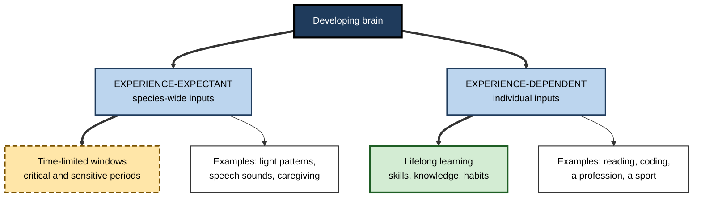
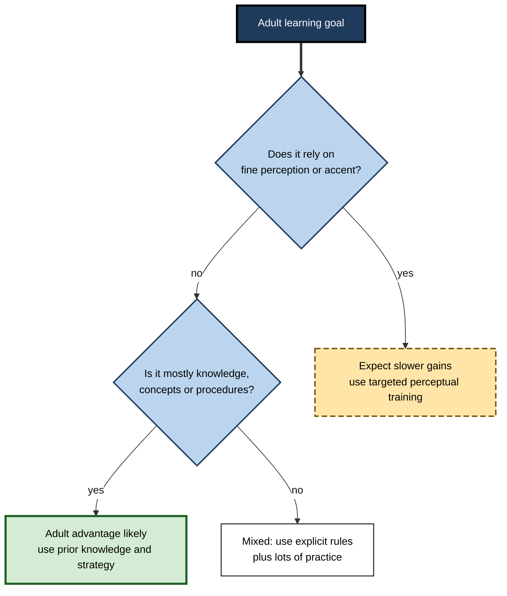
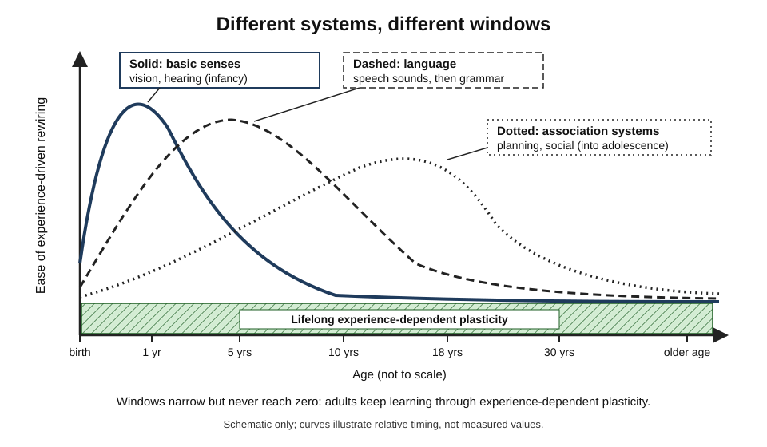

# J.4. Critical Periods of Brain Development

> **In one sentence:** A critical period is a window, usually early in life, when a brain system is especially sensitive to certain experiences and wires itself around them; after the window narrows, the same experience changes the brain far less easily.
>
> **Why it matters:** Critical periods explain why children pick up accents effortlessly and adults rarely do, why early deprivation can have lasting effects, and why adult learning works differently rather than not at all. Understanding them prevents both fatalism ("too old to learn") and false promises ("unlock your childhood brain").
>
> **Level span:** Novice → Expert · **Reading time:** ~18 min · **Builds on:** what neuroplasticity is; basic idea of synapses and circuits

---

## The Learning Ladder

| Level | Badge | After this level you can... |
|---|---|---|
| 1 | NOVICE | Explain what a critical period is with examples from vision and language. |
| 2 | FOUNDATIONS | Distinguish critical from sensitive periods and experience-expectant from experience-dependent learning. |
| 3 | PRACTITIONER | Apply the idea realistically to adult learning, such as second languages and late career changes. |
| 4 | ADVANCED | Explain the cellular "brakes" that open and close windows and the research on reopening them. |
| 5 | EXPERT / PRO | Use critical-period science responsibly in policy, product and L&D decisions without overclaiming. |

---

## Level 1 · Novice — The Big Picture

Imagine wet concrete. While it is fresh, a footprint leaves a deep, permanent mark. Once it sets, you can still scratch or carve it, but it takes much more effort, and the result looks different. Some brain systems behave like that concrete: early in life they are "wet" and set themselves according to what they experience; later they are firmer.

A **critical period** is that "wet concrete" time window for a particular brain system. Different systems have different windows: basic vision early, speech sounds in the first year, some aspects of grammar into later childhood and adolescence, and the slow-maturing planning and self-control systems later still.

You have already seen critical periods at work when:

- a family moves abroad and the young children end up with a native accent while the parents keep theirs;
- you meet adults who learned a second language later in life and speak it fluently, yet with a recognisable accent;
- you hear that a child born with cataracts needs early surgery to see normally.

The beginner's key idea: **some brain systems learn certain things most easily at particular ages — but "harder later" is not the same as "impossible later".** Adults keep learning; they just learn differently.

---

## Level 2 · Foundations — Core Concepts

### Critical versus sensitive periods

| Term | Meaning | Example |
|---|---|---|
| **Critical period** | A strict window; outside it, normal development of that function is very hard or impossible. | Binocular vision in cats and monkeys deprived of input to one eye early in life. |
| **Sensitive period** | A window of *heightened* sensitivity; learning is easier inside it but still possible outside. | Accent and speech-sound learning in humans. |

In human research, "sensitive period" is usually the more accurate term; most human abilities show gradual declines rather than hard cut-offs.

### Experience-expectant versus experience-dependent

William Greenough and colleagues (1987) drew a distinction that remains central:

- **Experience-expectant plasticity** prepares the brain for experiences that virtually every member of the species can expect — patterned light, voices, touch, a caregiver. The brain overproduces connections and then keeps those that the expected experience uses. Critical periods mostly belong here.
- **Experience-dependent plasticity** adapts the brain to an individual's *unique* experiences — your job, your languages, your hobbies — and continues throughout life.

**Figure J.4-1 — Two kinds of developmental plasticity.**

*How to read it:* the left branch is time-limited and depends on near-universal experiences; the right branch continues across the lifespan.

### Classic examples

| System | What happens in the window | Evidence base |
|---|---|---|
| **Binocular vision** | Each eye's input competes for cortical territory. Closing one eye early causes lasting weak vision in it (amblyopia). | David Hubel and Torsten Wiesel's experiments in cats and monkeys from the 1960s, recognised by the 1981 Nobel Prize. |
| **Speech sounds** | Infants can distinguish sounds from all languages; by about 10–12 months they specialise in the sounds of their own language. | Janet Werker, Patricia Kuhl and others. |
| **Hearing** | Children born deaf who receive cochlear implants early generally develop spoken language better than those implanted later. | Clinical cohort studies. |
| **Social and emotional development** | Early severe neglect is associated with lasting difficulties; earlier placement into family care is associated with better outcomes. | The Bucharest Early Intervention Project, a randomised study of institutionalised children in Romania. |

### Key terms

| Term | Plain meaning |
|---|---|
| **Amblyopia** | "Lazy eye": reduced vision in one eye caused by abnormal early visual experience. |
| **Ocular dominance** | How strongly cortical neurons respond to one eye versus the other. |
| **Monocular deprivation** | Experimentally depriving one eye of vision. |
| **Synaptic pruning** | Removal of unused connections, which sculpts circuits during development. |
| **Perineuronal net (PNN)** | A mesh of extracellular molecules around certain inhibitory neurons that helps close critical periods. |

---

## Level 3 · Practitioner — Putting It to Work

### What critical periods mean for adult learners

1. **Accent and fine sound discrimination** are the clearest cases of a sensitive period. Adults can improve with targeted perceptual training and feedback, but native-like accent is rare when learning begins after adolescence.
2. **Grammar** shows a gentler decline. A large online study (Joshua Hartshorne, Joshua Tenenbaum and Steven Pinker, 2018) suggested that the ability to reach native-like grammar declines from late adolescence. Its methods and interpretation are debated, but the general pattern of earlier being easier is widely accepted.
3. **Vocabulary, conceptual knowledge and professional skills** show no comparable hard window. Adults often learn these *faster* than children, because they can use prior knowledge, strategies and motivation.
4. **Adults compensate with strategy.** Explicit rules, deliberate practice, feedback and spaced retrieval let adults reach high proficiency in many domains even without childhood-style plasticity.

**Figure J.4-2 — Deciding what "late learning" means for a goal.**

*How to read it:* the first question identifies goals most affected by early sensitive periods; most professional skills fall on the "adult advantage" branch.

### Worked example — a 42-year-old consultant relocating to Germany

| | Fatalistic plan | Evidence-informed plan |
|---|---|---|
| **Belief** | "I'm past the critical period; I'll never really learn German." | "Accent will be harder; vocabulary and business usage are very learnable." |
| **Method** | Passive listening to podcasts. | Daily spaced vocabulary retrieval, explicit grammar study, weekly speaking with feedback, short pronunciation drills on the hardest sounds. |
| **Goal** | Vague fluency. | Run client meetings in German within 12 months; accent acceptable, not native. |
| **Outcome** | Gives up after three months. | Professional proficiency at month 12; accent noticeable but clear. |

### Common mistakes

- **Over-generalising.** Critical periods apply to specific systems, not to "learning" in general.
- **Fatalism.** "Too late" is rarely true; "harder and different" usually is.
- **Panic parenting and products.** Claims that children need special products in the "first three years" to avoid missing a window go beyond the evidence. Ordinary, responsive, language-rich care meets experience-expectant needs.

---

## Level 4 · Advanced — Mechanisms, Models & Evidence

### What opens and closes a window

Research led by Takao Hensch and others, mainly in the mouse visual cortex, has identified a sequence of molecular and cellular events:

| Stage | Mechanism |
|---|---|
| **Opening** | Maturation of fast-spiking, **parvalbumin-positive (PV) inhibitory interneurons** reaches a threshold level of inhibition. Signals such as the protein Otx2, carried into the cortex, help drive this maturation. |
| **Peak plasticity** | Balanced excitation and inhibition allow competitive, experience-driven rewiring. |
| **Closing** | **Brakes** accumulate: perineuronal nets wrap PV cells, myelin-associated signals (such as Nogo receptor pathways) restrict axon growth, molecules such as Lynx1 dampen cholinergic signals, and epigenetic changes reduce gene flexibility. |

The surprising insight: critical periods are **actively closed** by brakes, rather than simply running out. That makes them, in principle, reopenable.

*Figure J.4-3 — Sensitive periods across the lifespan.* Each curve shows the relative ease of experience-driven rewiring for one system. Solid: basic sensory systems peak early. Dashed: language sound and grammar systems peak in early and middle childhood. Dotted: higher-order association systems remain plastic into adolescence. The base band shows lifelong experience-dependent plasticity. Shapes are schematic, not measured curves.

### Hierarchy across the cortex

Recent developmental neuroscience proposes that critical-period-like plasticity progresses along a **sensorimotor-to-association axis**: primary sensory and motor regions mature first, while association regions supporting planning, social cognition and self-regulation remain plastic through adolescence. This helps explain adolescence as a second sensitive period for social and emotional learning, and why environmental factors in adolescence can have outsized effects.

### Reopening critical periods: what is known

| Approach | Status |
|---|---|
| Enzymatic removal of perineuronal nets (chondroitinase ABC) | Restores juvenile-like plasticity in adult animal visual cortex; not a human therapy. |
| Reducing inhibition, removing Otx2 or Lynx1 | Reopens plasticity in animal models. |
| Histone deacetylase (HDAC) inhibitors | Restore plasticity in animals. A small human study with valproate on pitch-naming is often cited; it is preliminary. |
| Dark exposure, enriched environments, exercise | Enhance adult visual plasticity in animals; human relevance under study. |
| Psychedelic compounds | A 2023 study in mice reported that several psychedelics reopen a social reward learning critical period, with duration related to the acute effects; reviews in 2024–2025 frame psychedelics as "psychoplastogens". Human evidence for critical-period reopening is indirect. |
| Perceptual learning and video-game-based treatments for amblyopia | Older children and some adults show measurable gains, overturning the strict view that amblyopia is untreatable after early childhood; gains are usually partial. |

### Ethical and scientific caution

Reopening a window is not automatically good. Critical periods close partly to **protect** mature circuits from being overwritten. Reopening plasticity could make a system vulnerable as well as trainable, which is why researchers pair it with targeted training and why "plasticity-boosting" claims need strong evidence.

### Evidence strength

- **Very strong:** critical periods in animal sensory systems; their cellular brakes.
- **Strong:** human sensitive periods for vision, hearing and speech-sound perception; early adversity effects.
- **Moderate and debated:** exact age boundaries for grammar; the size of adolescent sensitive periods.
- **Emerging:** pharmacological reopening in humans.

---

## Level 5 · Expert / Pro — Professional Mastery

### Applications by role

| Role | How critical-period science applies |
|---|---|
| **Policy and public health** | Supports early screening (vision, hearing), early intervention, and family-based care for children in institutions. |
| **Education product teams** | Avoid "window closing" fear marketing; design for adult learners' strengths in strategy and prior knowledge. |
| **L&D leaders** | Set realistic expectations for skills like accent; invest in explicit strategy and deliberate practice for adults. |
| **Managers of multinational teams** | Value clear communication over native-like accent; provide pronunciation support only where it materially affects work. |
| **Early-careers and adolescent programmes** | Recognise adolescence and early adulthood as a period of high social and self-regulatory plasticity; mentoring and feedback are especially influential. |

### Professional scenario

**Role:** Product lead at a language-learning company.
**Situation:** Marketing proposes a campaign: "After age 12 your brain's language window is closed — unless you use our app."
**What the pro does:** Rejects the framing as both inaccurate and demotivating. Commissions a campaign built on accurate claims: adults learn vocabulary and structure efficiently with spaced practice and feedback; pronunciation needs targeted work. Adds a pronunciation-feedback feature and a progress metric based on delayed recall rather than streaks. The product team tracks whether 90-day retention of learners improves.

### Expert judgement

- Treat critical periods as **system-specific**, **graded** and **partly reopenable**.
- Distinguish the **strength of a window** (how much harder learning becomes) from its **existence**.
- When adults struggle, look first at method, time, feedback and motivation, not at "closed windows".
- Do not confuse **experience-expectant** needs (meet them with ordinary rich environments) with **experience-dependent** enrichment (where specific training matters).

---

## Myths vs. Evidence

| Myth | What the evidence shows |
|---|---|
| "Everything important is decided by age three." | Early years matter for some systems, but the brain remains plastic throughout life; the "first three years" claim is overstated. |
| "Adults cannot learn languages." | Adults learn vocabulary and grammar effectively; native-like accent is the clearest late-learning limitation. |
| "Missing a window means permanent failure." | Most human windows are sensitive periods with gradual declines; later learning remains possible. |
| "More stimulation during windows is always better." | Experience-expectant systems need ordinary species-typical experiences, not special products. |
| "Amblyopia can only be treated in early childhood." | Older children and some adults show measurable, if partial, improvement with modern treatments. |
| "We can now reopen critical periods in people with a pill." | Reopening is shown mainly in animals; human evidence is preliminary. |

## Practitioner Toolkit

**Late-learning goal planner**

| Goal | Sensitive-period component? | Adult strengths to use | Method | Realistic target |
|---|---|---|---|---|
| | | | | |

**Checklist for "window" claims**

- [ ] Which specific system and which ages?
- [ ] Critical (strict) or sensitive (graded)?
- [ ] Human evidence or animal evidence?
- [ ] Does the claim sell fear or a product?
- [ ] What can still be learned later, and how?

## Self-Check

1. **[NOVICE]** Using the wet-concrete analogy, what is a critical period?
2. **[NOVICE]** Give one everyday example of a sensitive period.
3. **[FOUNDATIONS]** What is the difference between a critical and a sensitive period?
4. **[FOUNDATIONS]** Explain experience-expectant versus experience-dependent plasticity.
5. **[PRACTITIONER]** Which aspects of second-language learning are most and least affected by age?
6. **[ADVANCED]** What role do PV interneurons and perineuronal nets play?
7. **[ADVANCED]** Why does "actively closed" matter for the possibility of reopening?
8. **[ADVANCED]** What is the sensorimotor-to-association axis idea?
9. **[EXPERT / PRO]** How would you respond to marketing claiming adult brains cannot learn a language?
10. **[EXPERT / PRO]** Why is reopening plasticity not automatically beneficial?

### Answer Key

1. A time window when a brain system is especially easy to shape by experience, like wet concrete that later sets.
2. Accent acquisition in children; infants tuning into their language's speech sounds.
3. A critical period is strict; a sensitive period makes learning easier inside the window but still possible outside it.
4. Experience-expectant plasticity relies on species-typical experiences in time-limited windows; experience-dependent plasticity adapts to individual experiences throughout life.
5. Accent and fine sound discrimination are most affected; vocabulary, concepts and many grammatical skills are much less affected.
6. Maturing PV inhibition opens the window; perineuronal nets around PV cells help close it.
7. If brakes close windows, removing or loosening brakes could reopen plasticity.
8. Plasticity windows mature first in sensory and motor regions and later in association regions that remain plastic into adolescence.
9. Correct it with evidence: adults learn languages effectively, especially vocabulary and structure; accent is harder; method matters.
10. Closing protects mature circuits; reopening can increase vulnerability as well as trainability and needs targeted guidance.

## Key Takeaways

- Critical and sensitive periods are **windows of heightened plasticity** for specific brain systems.
- In humans, most windows are **graded sensitive periods**, not hard cut-offs.
- **Experience-expectant** systems need ordinary species-typical experience; **experience-dependent** learning continues lifelong.
- Windows are **opened by maturing inhibition** and **closed by active brakes** such as perineuronal nets.
- Reopening plasticity works in animals; **human applications are early-stage**.
- Adults learn differently, not worse: they use **strategy, prior knowledge and deliberate practice**.

## Glossary

| Term | Meaning |
|---|---|
| Amblyopia | Reduced vision in one eye due to abnormal early visual experience. |
| Critical period | A strict developmental window for shaping a brain system. |
| Experience-dependent plasticity | Lifelong change driven by individual experiences. |
| Experience-expectant plasticity | Development that relies on species-typical experiences in time-limited windows. |
| HDAC inhibitor | A drug that loosens chromatin and can restore plasticity in animal studies. |
| Ocular dominance | The relative influence of each eye on cortical neurons. |
| Parvalbumin (PV) interneuron | A fast-spiking inhibitory neuron whose maturation helps open critical periods. |
| Perineuronal net | Extracellular mesh around PV cells that stabilises circuits and helps close windows. |
| Psychoplastogen | A compound that rapidly promotes structural plasticity. |
| Sensitive period | A window of heightened, but not exclusive, sensitivity to experience. |
| Synaptic pruning | Removal of unused synaptic connections. |
