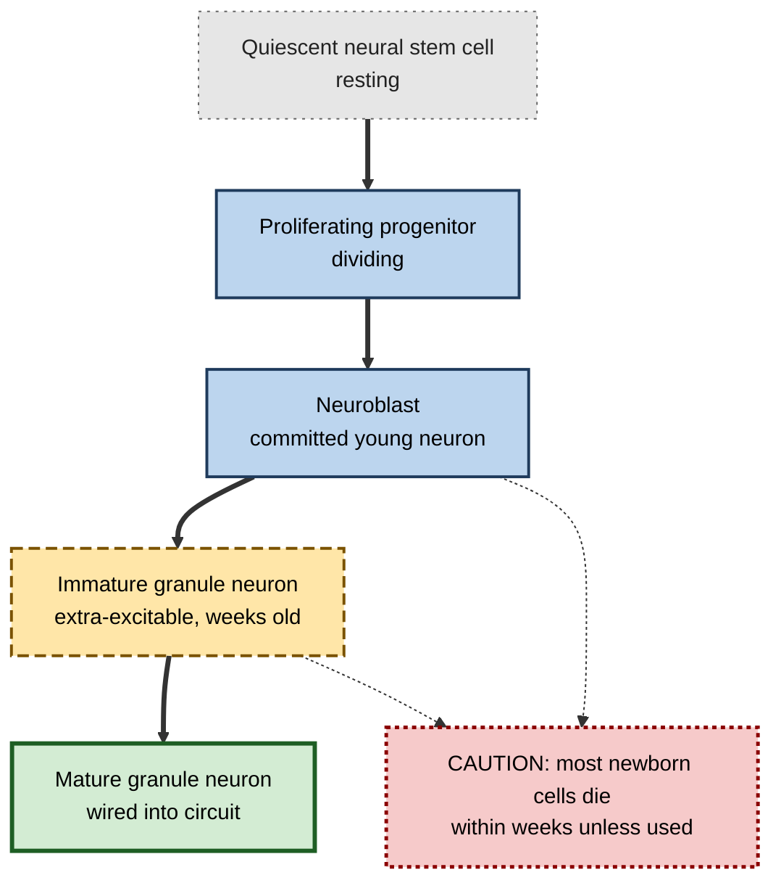
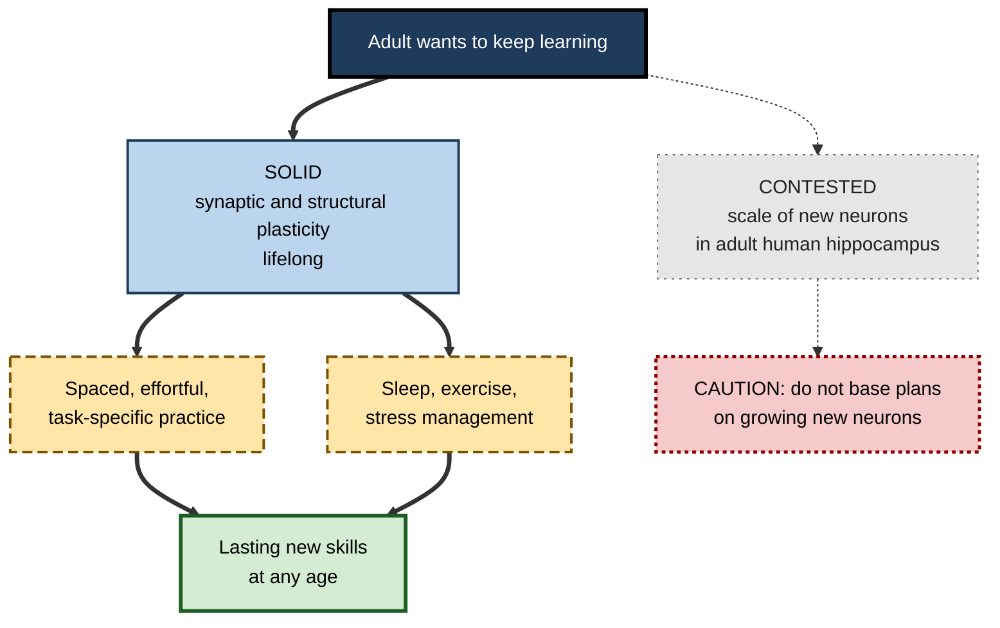
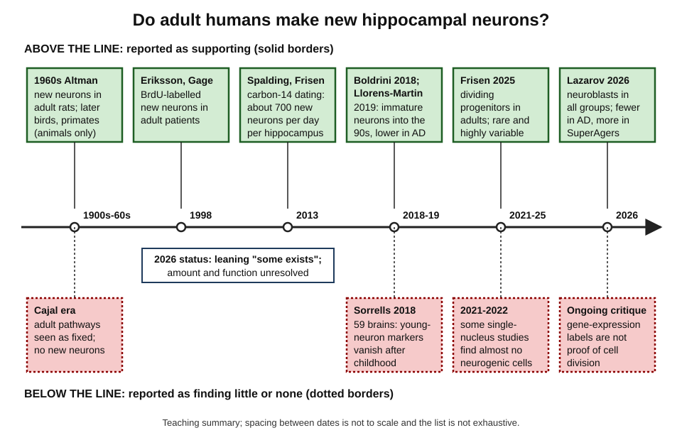
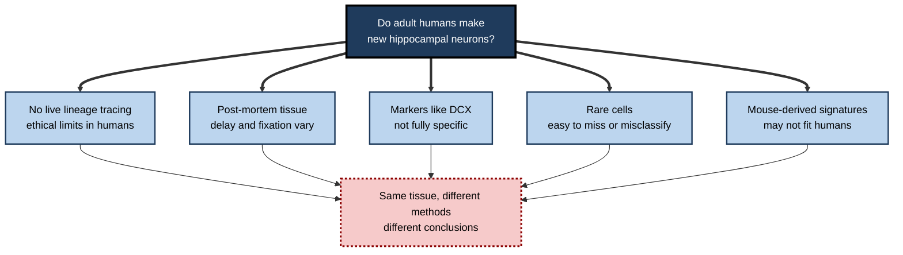

# J.5. Adult Brain Plasticity and Neurogenesis

> **In one sentence:** The adult brain keeps changing throughout life — mainly by reshaping connections between existing neurons — and whether adult humans also keep making meaningful numbers of new neurons in the memory-related hippocampus is one of neuroscience's most actively contested questions.
>
> **Why it matters:** Adult professionals can and do keep learning. But much popular advice ("grow new brain cells to get smarter") rests on the neurogenesis story, which is unsettled in humans. Knowing what is solid and what is disputed lets you motivate lifelong learning honestly.
>
> **Level span:** Novice → Expert · **Reading time:** ~19 min · **Builds on:** what neuroplasticity is; structural versus functional plasticity

---

## The Learning Ladder

| Level | Badge | After this level you can... |
|---|---|---|
| 1 | NOVICE | Explain that adult brains keep changing and what "neurogenesis" means. |
| 2 | FOUNDATIONS | Describe the main forms of adult plasticity and where adult neurogenesis is thought to occur. |
| 3 | PRACTITIONER | Apply what is solid about adult plasticity to your own learning, without relying on contested claims. |
| 4 | ADVANCED | Summarise the history and current state of the human neurogenesis debate, including 2025–2026 studies and their critiques. |
| 5 | EXPERT / PRO | Communicate the evidence accurately to learners, leaders and customers, and evaluate products that invoke neurogenesis. |

---

## Level 1 · Novice — The Big Picture

For most of the twentieth century, students were taught that you are born with all the brain cells you will ever have, and that adult brains slowly lose them. Half of that has been overturned and half is still being argued about.

**What is settled:** adult brains change all the time. Every new skill, fact, route and habit you acquire as an adult physically changes the connections between your nerve cells. A 50-year-old who learns to code, speak Spanish or manage a team is using genuine brain plasticity.

**What is debated:** whether adult humans keep making *new neurons*. Making new neurons is called **neurogenesis** (from "neuro", nerve, and "genesis", birth). In mice, rats, songbirds and many other animals, adult neurogenesis definitely happens, especially in a seahorse-shaped memory structure called the **hippocampus**. In humans, scientists have spent decades disagreeing about whether it happens at a meaningful scale after childhood.

An analogy: think of a large company. It can adapt by **reorganising its existing staff** — new teams, new reporting lines, new skills (that is like synaptic plasticity). It might also **hire new people** (that is like neurogenesis). Everyone agrees the adult brain reorganises its staff constantly. The argument is about how much hiring still happens in one particular department.

The beginner's key idea: **you do not need new neurons to learn as an adult — reshaping existing connections is the main engine of adult learning, and that engine runs for life.**

---

## Level 2 · Foundations — Core Concepts

### Forms of adult plasticity

| Form | Status in adult humans | Example |
|---|---|---|
| **Synaptic plasticity** | Firmly established | Strengthening and weakening of connections during any learning. |
| **Spine and dendrite remodelling** | Firmly established in animals; inferred in humans | New synaptic contact points forming during skill learning. |
| **Myelin plasticity** | Established in animals; supported by human imaging | Insulation around axons adjusting with practice. |
| **Map and network reorganisation** | Firmly established | Musicians' finger representations; recovery after stroke. |
| **Adult neurogenesis** | Established in many animals; **contested in humans** | New granule cells in the hippocampal dentate gyrus. |

### Where adult neurogenesis is thought to occur

In rodents, two regions produce new neurons throughout adulthood: the **subventricular zone**, which supplies the olfactory bulb (smell), and the **subgranular zone of the dentate gyrus** in the hippocampus. In humans, the olfactory route appears largely absent after infancy. The human debate focuses on the dentate gyrus.

**Figure J.5-1 — The steps of adult hippocampal neurogenesis, as described in rodents.**

*How to read it:* each box is a stage that researchers try to detect with specific markers; the dotted arrows show that survival is selective. Proving each stage exists in adult human tissue is exactly what the debate is about.

### Key terms

| Term | Plain meaning |
|---|---|
| **Neurogenesis** | The birth of new neurons. |
| **Hippocampus** | A brain structure central to forming new memories and spatial navigation. |
| **Dentate gyrus** | The part of the hippocampus where adult neurogenesis is studied. |
| **Neural stem or progenitor cell** | A cell that can divide and give rise to new neurons. |
| **Doublecortin (DCX)** | A protein used as a marker for immature neurons; its reliability in humans is disputed. |
| **Single-nucleus RNA sequencing** | A method that reads which genes are active in thousands of individual cell nuclei, used to classify cell types. |
| **Pattern separation** | The ability to keep similar memories distinct; in rodents, new neurons appear to help. |

---

## Level 3 · Practitioner — Putting It to Work

You can act on everything that is solid about adult plasticity today, without waiting for the neurogenesis debate to be settled.

### What adult learners can rely on

1. **You can keep learning at any age.** Synaptic and structural plasticity continue throughout life. Older adults often learn more slowly in some domains, especially speed-dependent ones, but compensate with knowledge and strategy.
2. **Practice is specific.** What changes is the circuitry you use. Choose practice that looks like the real task.
3. **Effort plus spacing beats intensity alone.** Spaced, effortful retrieval and practice reliably produce durable change in adults.
4. **Health underpins plasticity.** Physical activity, sleep and managing chronic stress support the conditions for plasticity, with or without neurogenesis.
5. **Novelty and challenge matter.** Learning genuinely new and complex skills engages plasticity more than repeating what you already know.

**Figure J.5-2 — Act on what is solid; hold contested claims loosely.**

*How to read it:* the thick path is what the evidence firmly supports; the sparse-dotted box marks the contested area, which should not drive practical decisions.

### Worked example — a 55-year-old finance manager moving into data analytics

| | Myth-driven plan | Evidence-driven plan |
|---|---|---|
| **Belief** | "My brain stopped growing decades ago" or "I need supplements to grow new neurons first." | "My brain will rewire with the right practice." |
| **Method** | Buys a neurogenesis supplement and a brain-game app. | Learns SQL and Python through spaced, project-based practice with feedback; keeps up regular aerobic exercise and good sleep. |
| **Expectation** | Rapid, general "brain boost". | Steady, task-specific gains over months. |
| **Result at 12 months** | Little change in analytic skill. | Builds dashboards and models independently. |

### Common mistakes

- **Assuming age blocks learning.** Age changes how you learn, not whether you can.
- **Chasing neurogenesis.** Products and routines marketed as "growing new brain cells" outrun the human evidence.
- **Ignoring the basics.** Practice design, sleep and health have stronger evidence than any neurogenesis-targeted hack.

---

## Level 4 · Advanced — Mechanisms, Models & Evidence

### A century-long argument

*Figure J.5-3 — The adult human neurogenesis debate over time.* Boxes above the timeline (solid borders) are studies reported as supporting adult human hippocampal neurogenesis; boxes below (dotted borders) are studies reported as finding little or none. The positions are approximate and the figure is a teaching summary, not a complete review.

**Phase 1 — Dogma and challenge (1900s–1990s).** Ramón y Cajal described adult nerve pathways as "fixed, ended, immutable". In the 1960s, Joseph Altman reported new neurons in adult rats; the work was largely ignored. Fernando Nottebohm's studies of songbirds in the 1980s, then rodent and primate work by Fred Gage, Elizabeth Gould and others, made adult neurogenesis in animals mainstream.

**Phase 2 — First human evidence (1998–2013).** In 1998, Peter Eriksson, Fred Gage and colleagues found cells labelled with BrdU — a dye incorporated into dividing cells, given to cancer patients for diagnostic reasons — that had become neurons in the dentate gyrus. In 2013, Kirsty Spalding, Jonas Frisén and colleagues used carbon-14 from Cold War nuclear tests, which dates when a cell's DNA was made, and estimated that roughly 700 new neurons are added to each human hippocampus per day in adults, with only a modest decline with age.

**Phase 3 — Direct contradiction (2018–2022).** In 2018, Shawn Sorrells, Arturo Alvarez-Buylla and colleagues examined 59 human hippocampi and found that markers of young neurons dropped sharply in childhood and were undetectable in adults. The same year, Maura Boldrini and colleagues reported persistent neurogenesis into old age. In 2019, María Llorens-Martín's group reported thousands of DCX-positive immature neurons in healthy people into their 80s and 90s, with sharp reductions in Alzheimer's disease, and argued that tissue processing — particularly long fixation — had hidden these cells in earlier studies. The first single-nucleus RNA sequencing studies around 2021–2022 disagreed: some found almost no neurogenic cells in adults, others reported immature neurons.

**Phase 4 — Large transcriptomic studies (2025–2026).**

- **July 2025 (Science).** Frisén's group at the Karolinska Institute profiled hippocampal tissue from 35 donors aged from birth to 78 using single-nucleus RNA sequencing, machine-learning classification, flow cytometry for a proliferation marker and spatial transcriptomics. They reported a continuum from quiescent stem cells through **proliferating progenitors** to immature neurons in adults, located in the dentate gyrus. The progenitors were rare — a few hundred among several hundred thousand nuclei analysed — and their abundance **varied greatly between individuals**, with some adults having many and others few.
- **February 2026 (Nature).** Orly Lazarov's group at the University of Illinois Chicago analysed about 356,000 nuclei from 38 donors in five groups: young adults, healthy older adults, "SuperAgers" (people over 80 with memory like people decades younger), people with early cognitive decline, and people with Alzheimer's disease. Using combined gene-expression and chromatin-accessibility profiling, they reported neural stem cells, neuroblasts and immature neurons in all groups; neuroblasts and immature neurons were **markedly reduced in Alzheimer's disease**, while SuperAgers showed a distinct, more active neurogenic profile described as a "resilience signature".

### Why the debate persists

**Figure J.5-4 — Why measuring human neurogenesis is so hard.**

*How to read it:* each middle box is a separate methodological obstacle; together they explain why careful labs reach different answers.

The central critiques of the newest studies:

- **Classification is not proof of division.** Single-nucleus methods infer a cell's identity from its gene-expression pattern. Critics argue that labelling a nucleus as a "proliferating progenitor" or "neuroblast" is a classification, not a direct observation of a dividing cell, and that mature neurons under stress or disease may switch on "young" genes. One critic described the assumption that these cells are truly dividing as a major leap; authors respond that, with current tools, this is the best available evidence.
- **Rarity and variability.** Even in supportive studies, progenitors are rare and vary widely between people. The **rate** of adult neurogenesis in humans remains uncertain, and estimates differ by orders of magnitude between methods.
- **Function is untested in humans.** In rodents, new neurons contribute to pattern separation, forgetting of old memories, and stress and mood regulation. Whether the small number of human adult-born neurons matters for memory or mood is unknown; the SuperAger association is correlational.

### Current state of the question (as of 2026)

| Question | Best current answer |
|---|---|
| Is there any adult human hippocampal neurogenesis? | Evidence has shifted toward "yes, at least some", driven by large 2025–2026 transcriptomic studies; a minority of experts remain unconvinced. |
| How much? | Unknown; likely low and highly variable between people; estimates conflict. |
| Does it decline with age and disease? | Most supporting studies report decline with age and sharper loss in Alzheimer's disease. |
| Does it matter for human learning? | Unknown; rodent evidence suggests a role in fine memory discrimination and mood. |
| Can lifestyle increase it in humans? | Not shown in humans; exercise and enrichment increase it in rodents. |
| Is it needed for adult learning? | No; synaptic and structural plasticity of existing neurons are sufficient for most learning. |

A fair summary: **the debate has moved from "does it exist?" toward "how much, in whom, and does it matter?" — but it is not closed.**

---

## Level 5 · Expert / Pro — Professional Mastery

### Communicating the evidence

| Audience | What to say |
|---|---|
| Adult learners | "Your brain keeps rewiring with practice at every age. That is well established." |
| Leaders funding reskilling | "Mid- and late-career reskilling is biologically realistic; design for spaced practice and support." |
| Health-curious employees | "Exercise and sleep support brain health; whether they grow new human neurons is not established." |
| Product and marketing teams | "Do not claim a product grows new brain cells; there is no human evidence for that." |

### Evaluating neurogenesis-based products and programmes

1. **Is the claim based on human or animal data?** Most "neurogenesis boosting" evidence is in rodents.
2. **Is neurogenesis measured or assumed?** In living humans it cannot currently be measured directly; MRI changes and blood markers are not neurogenesis.
3. **Is the outcome a real-world skill?** If not, the claim is decorative.
4. **Does the advice add anything beyond exercise, sleep and good practice?** Usually not.

### Professional scenario

**Role:** Chief people officer at a manufacturing company planning large-scale reskilling of workers aged 45–62 for automation-era roles.
**Situation:** Some managers say older workers "can't learn new tricks"; a vendor proposes a premium "neurogenesis wellness" add-on.
**What the pro does:** Cites the well-established evidence for lifelong synaptic and structural plasticity, and plans the programme around spaced practice, hands-on simulation and peer coaching, with extra time allowances rather than lower expectations. Declines the neurogenesis add-on, explaining that human evidence for lifestyle-driven neurogenesis does not exist and that the programme already includes what plausibly helps: activity breaks, reasonable schedules and stress reduction. Tracks certification pass rates by age band and finds no meaningful gap after the first cohort.

### Research frontier to watch

- Replication of transcriptomic findings by independent groups using shared standards.
- Methods that could track neurogenesis in living people.
- Whether neurogenic "resilience signatures" predict cognitive outcomes prospectively, and whether anything can change them.
- Therapies aimed at stimulating neural progenitors for neurodegenerative and psychiatric conditions — currently early-stage.

---

## Myths vs. Evidence

| Myth | What the evidence shows |
|---|---|
| "Adults never make new brain cells." | Overstated; recent studies report neurogenic cells in adult human hippocampus, though scale and function are disputed. |
| "Adults constantly grow new neurons, and that is how we learn." | Also overstated; human rates are uncertain and adult learning relies mainly on changing existing connections. |
| "Exercise grows new neurons in humans." | Shown in rodents; in humans exercise benefits brain health, but neurogenesis has not been measured directly. |
| "Brain games or supplements boost neurogenesis." | No credible human evidence. |
| "The debate is settled." | It has shifted toward existence, but quantity, function and methods remain contested. |
| "Older people cannot learn new skills." | Plasticity persists throughout life; older adults learn effectively with appropriate practice and time. |

## Practitioner Toolkit

**Lifelong-learning plan built on solid evidence**

- [ ] Choose a genuinely new, complex skill with real-world use.
- [ ] Schedule short, spaced practice sessions across months.
- [ ] Use retrieval and real tasks rather than re-reading.
- [ ] Get regular feedback from a person, a test or real results.
- [ ] Keep up regular physical activity and adequate sleep.
- [ ] Ignore products promising to grow new neurons.

**Claim-rating card**

| Claim | Human or animal? | Measured or assumed? | Real-world outcome? | Rating (solid / plausible / contested / unsupported) |
|---|---|---|---|---|
| | | | | |

## Self-Check

1. **[NOVICE]** What is neurogenesis?
2. **[NOVICE]** Do you need new neurons to learn as an adult? Why or why not?
3. **[FOUNDATIONS]** Which forms of adult plasticity are firmly established in humans?
4. **[FOUNDATIONS]** Where in the brain is adult human neurogenesis debated?
5. **[PRACTITIONER]** Name three evidence-based actions an adult learner can take regardless of the neurogenesis debate.
6. **[ADVANCED]** What did the 2013 carbon-14 study estimate, and how did it work?
7. **[ADVANCED]** What did the 2018 Sorrells study and the 2019 Moreno-Jiménez study conclude, and what methodological issue divided them?
8. **[ADVANCED]** What did the 2025 and 2026 transcriptomic studies report, and what is the main critique?
9. **[EXPERT / PRO]** How would you advise a team asked to market a product as "growing new brain cells"?
10. **[EXPERT / PRO]** Summarise the 2026 state of the debate in two sentences.

### Answer Key

1. The birth of new neurons.
2. No; most adult learning works by strengthening, weakening, adding and removing connections between existing neurons.
3. Synaptic plasticity, structural remodelling inferred from imaging, myelin plasticity and map or network reorganisation.
4. The dentate gyrus of the hippocampus.
5. Spaced, effortful, task-specific practice with feedback; adequate sleep; regular physical activity; managing chronic stress.
6. Roughly 700 new neurons per day added to each adult hippocampus, with modest decline with age; it dated cells using carbon-14 from nuclear tests incorporated into DNA.
7. Sorrells found markers undetectable after childhood; Moreno-Jiménez found many immature neurons into old age. They disagreed partly over tissue processing (fixation) and marker reliability.
8. They reported proliferating progenitors, neuroblasts and immature neurons in adults, reduced in Alzheimer's disease and more active in SuperAgers. Critics argue that gene-expression classification does not prove cells are dividing or newly born.
9. Advise against the claim: there is no human evidence that products grow new neurons; focus on demonstrated outcomes.
10. Evidence has moved toward the existence of some adult human hippocampal neurogenesis. How much occurs, in whom, and whether it matters for learning remain unresolved.

## Key Takeaways

- **Adult plasticity is real and lifelong**; it runs mainly on changes to existing connections.
- **Adult neurogenesis** is established in many animals; in humans it is **contested**.
- Recent large studies (2025 Science; 2026 Nature) **shifted the evidence toward existence**, with rare and variable neurogenic cells reduced in Alzheimer's disease.
- Critics note that **gene-expression classification is not direct proof** of newly born neurons.
- The **amount and function** of human adult neurogenesis remain unknown.
- Practical advice should rest on **solid plasticity science**, not on neurogenesis claims.

## Glossary

| Term | Meaning |
|---|---|
| BrdU | A chemical incorporated into DNA of dividing cells, used to label newborn cells. |
| Carbon-14 dating of cells | Estimating when a cell was born from atmospheric carbon-14 levels in its DNA. |
| Dentate gyrus | Hippocampal region where adult neurogenesis is studied. |
| Doublecortin (DCX) | A protein marker of immature neurons. |
| Immature neuron | A young neuron not yet fully integrated into circuits. |
| Neuroblast | A committed early-stage neuron. |
| Neurogenesis | The birth of new neurons. |
| Neural progenitor | A dividing cell that can give rise to neurons. |
| Pattern separation | Keeping similar memories distinct. |
| Single-nucleus RNA sequencing | Reading active genes in individual nuclei to classify cells. |
| SuperAger | A person over 80 with memory comparable to people decades younger. |
