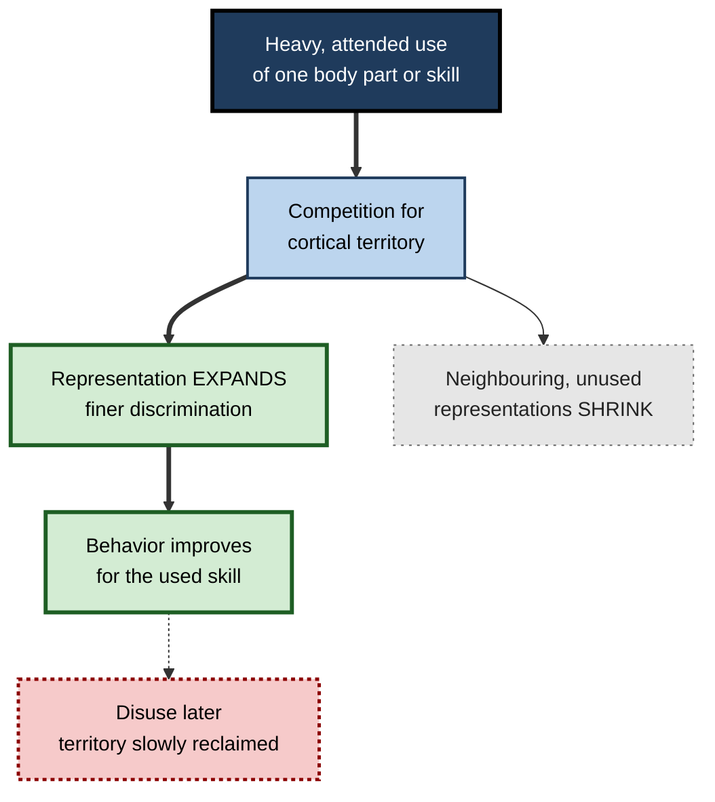
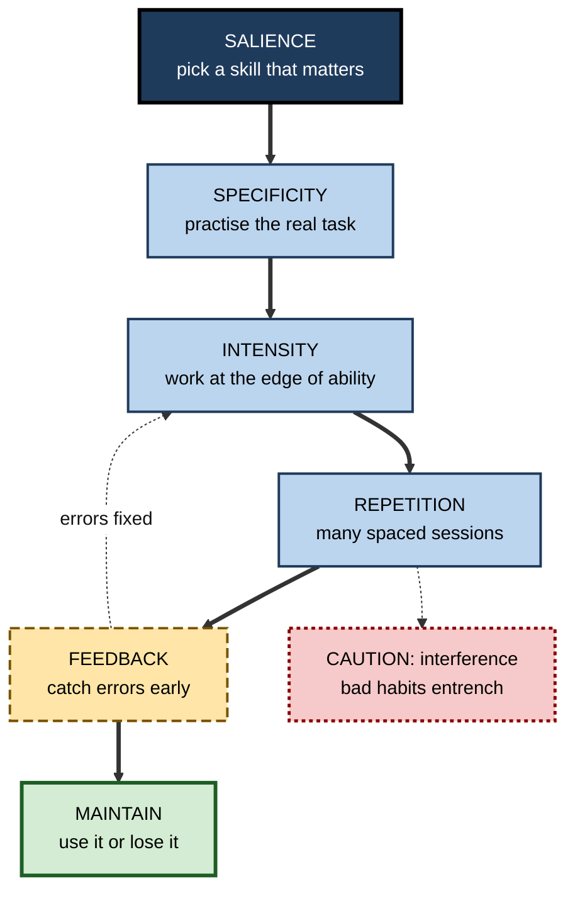

# J.6. Experience-Dependent Plasticity

> **In one sentence:** Experience-dependent plasticity is the lifelong process by which your particular experiences — your work, practice, environment and habits — reshape the specific brain circuits you use.
>
> **Why it matters:** It is the biological basis of becoming an expert, and it follows predictable rules: use, specificity, repetition, intensity, timing and, above all, attention and relevance. Those rules translate directly into how professionals should practise and how organisations should train.
>
> **Level span:** Novice → Expert · **Reading time:** ~18 min · **Builds on:** what neuroplasticity is; Hebbian learning; critical periods

---

## The Learning Ladder

| Level | Badge | After this level you can... |
|---|---|---|
| 1 | NOVICE | Explain how your unique experiences shape your brain, with examples. |
| 2 | FOUNDATIONS | Describe cortical maps, enriched environments and the classic studies behind experience-dependent plasticity. |
| 3 | PRACTITIONER | Apply the ten principles of experience-dependent plasticity to your own practice. |
| 4 | ADVANCED | Explain why attention and neuromodulators gate map change, and when plasticity becomes maladaptive. |
| 5 | EXPERT / PRO | Design training and work environments that drive the right plasticity and avoid the wrong kind. |

---

## Level 1 · Novice — The Big Picture

Your brain is shaped by what *you* do, not just by what all humans do. A violinist, a radiologist, a taxi driver and a software engineer start adult life with broadly similar brains. Years later, each has circuits tuned to their own world: finger control and pitch for the violinist, visual pattern detection for the radiologist, spatial memory for the driver, abstract structure for the engineer.

**Experience-dependent plasticity** is the name for this personal tailoring. It differs from the early, time-limited windows of brain development because it works throughout life and responds to *individual* experience.

Think of a well-used kitchen. The tools you use every day migrate to the front of the drawer; the ones you never use drift to the back or get given away. Your brain organises itself in a similar way: heavily used functions get more neural "space" and better connections; neglected ones shrink.

You have already experienced this when:

- after months in a new job, you started spotting problems in documents that you would have missed before;
- you noticed your touch-typing or your sport skills slip after a long break, then return quickly once you resumed;
- you met someone from a different profession who "sees" things in a situation that you simply do not notice.

The beginner's key idea: **your brain becomes good at what you repeatedly and attentively do — and gradually less good at what you stop doing.**

---

## Level 2 · Foundations — Core Concepts

### Cortical maps

Large parts of the cortex are organised as **maps**. The **somatosensory cortex** contains a map of the body surface; the **motor cortex** a map of movements; the **auditory cortex** a map of sound frequencies. Neuroscientists discovered that these maps are not fixed in adults; they redraw themselves according to use.

### Landmark findings

| Finding | What was shown | Period |
|---|---|---|
| **Enriched environments** | Rats raised in complex, stimulating cages developed thicker cortex, more synapses and better learning than rats in barren cages. | Mark Rosenzweig, Marian Diamond and colleagues, 1960s |
| **Map remodelling after amputation or training** | In adult monkeys, cortical territory for a lost finger was taken over by neighbours; training one fingertip enlarged its representation. | Michael Merzenich, Jon Kaas and colleagues, 1980s–1990s |
| **Attention gates map change** | Monkeys trained on a sound-frequency task showed map expansion only when they attended to the sounds, not when exposed passively. | Gregg Recanzone, Merzenich and colleagues, 1993 |
| **Musicians' hands** | String players showed larger representations of the left-hand fingers, especially those who began playing young. | Thomas Elbert and colleagues, 1995 |
| **Blind readers** | In people blind from early life, the visual cortex is recruited for Braille reading. | Several groups, 1990s onward |

**Figure J.6-1 — How use reshapes a cortical map.**

*How to read it:* used representations win territory through competition (thick path); unused neighbours lose it; the dotted arrow shows that gains depend on continued use.

### Key terms

| Term | Plain meaning |
|---|---|
| **Cortical map** | An orderly layout in the cortex where neighbouring neurons represent neighbouring body parts, sounds or features. |
| **Somatosensory cortex** | The cortex that processes touch and body position. |
| **Enriched environment** | A setting with more physical, social and cognitive stimulation than standard conditions. |
| **Cross-modal plasticity** | Recruitment of a brain area by a different sense, such as visual cortex used for touch. |
| **Neuromodulator** | A brain chemical, such as acetylcholine or dopamine, that tunes how much plasticity occurs. |

---

## Level 3 · Practitioner — Putting It to Work

### The ten principles

Rehabilitation scientists Jeffrey Kleim and Theresa Jones (2008) summarised decades of animal and human research into ten principles of experience-dependent plasticity. Although written for brain-injury rehabilitation, they apply to any skill learning.

| # | Principle | Meaning | Professional translation |
|---|---|---|---|
| 1 | **Use it or lose it** | Unused functions degrade. | Keep core skills in regular use. |
| 2 | **Use it and improve it** | Training a function enhances it. | Deliberately practise what you want to strengthen. |
| 3 | **Specificity** | The nature of training determines the change. | Practise the real task, not a distant proxy. |
| 4 | **Repetition matters** | Lasting change needs many repetitions. | One workshop is not enough. |
| 5 | **Intensity matters** | Sufficient challenge and dose are required. | Practice must be demanding, not comfortable. |
| 6 | **Time matters** | Different changes happen at different times in training. | Plan for weeks and phases. |
| 7 | **Salience matters** | Training must be meaningful to the learner. | Connect practice to real goals and consequences. |
| 8 | **Age matters** | Plasticity occurs more readily in younger brains. | Adults need more time and better methods, not lower expectations. |
| 9 | **Transference** | Plasticity in one circuit can support related skills. | Choose foundational skills that unlock others. |
| 10 | **Interference** | Plasticity can hinder other learning, including bad compensations. | Correct poor technique early, before it is entrenched. |

**Figure J.6-2 — A practice cycle built on the ten principles.**

*How to read it:* the thick path is the practice cycle; the dotted feedback loop returns to challenge; the dotted caution box shows what happens when repetition lacks feedback.

### Worked example — a junior UX designer building critique skills

| | Before | After |
|---|---|---|
| **Practice** | Reads design blogs; occasionally attends critique sessions as a listener. | Writes a structured critique of two real designs a week, then compares with a senior's critique. |
| **Specificity** | General reading about design. | The exact task: written critique against heuristics. |
| **Salience** | Low; no stakes. | Critiques feed into actual design reviews. |
| **Feedback** | None. | Weekly comparison with expert critique, discussed in 15 minutes. |
| **Six months later** | Can name usability heuristics. | Spots usability issues quickly and explains them convincingly. |

### Common mistakes

- **Passive exposure.** Being around expertise is not the same as practising it; attention is required.
- **Proxy practice.** Practising something only loosely related to the target skill produces limited transfer.
- **Too little dose.** Brief, infrequent practice rarely reaches the threshold for lasting change.
- **Entrenching errors.** Repeating a flawed technique strengthens the flaw.

---

## Level 4 · Advanced — Mechanisms, Models & Evidence

### Attention and neuromodulators as gatekeepers

The 1993 attention finding was followed by a key experiment: Michael Kilgard and Merzenich (1998) showed that pairing a sound with electrical stimulation of the **nucleus basalis** — the source of the neuromodulator acetylcholine — was enough to expand that sound's representation in adult rat auditory cortex, even without behavioral training. The interpretation: map plasticity in adults is **permitted** by neuromodulatory systems that signal attention, arousal, reward and novelty.

| Neuromodulator | Main signal | Plasticity role |
|---|---|---|
| **Acetylcholine** | Attention, novelty | Enables cortical map changes for attended stimuli. |
| **Dopamine** | Reward prediction error | Reinforces circuits linked to better-than-expected outcomes. |
| **Noradrenaline** | Arousal, surprise | Boosts encoding of salient events; too much impairs function. |
| **Serotonin** | Mood, behavioral flexibility | Modulates plasticity and flexibility; target of several treatments. |

This explains why **salience** is one of the ten principles, and why the same hours of practice can produce very different gains depending on engagement.

The same logic now underlies clinical techniques. **Vagus nerve stimulation** paired with rehabilitation exercises triggers bursts of acetylcholine and noradrenaline timed to movement, and has been approved in the United States as an adjunct for upper-limb rehabilitation after stroke.

### Maladaptive experience-dependent plasticity

The same mechanisms can cause harm:

- **Focal dystonia** in musicians: intensive, highly repetitive movements can cause finger representations to blur together, leading to involuntary cramping. It is a well-described occupational disorder.
- **Tinnitus and chronic pain:** after injury or hearing loss, maps can reorganise in ways that produce persistent phantom sensations.
- **Learned non-use:** after injury, avoiding a weak limb lets its representation shrink further.
- **Habits and addictions:** reward-driven plasticity entrenches compulsive behavior.

### Human evidence and its limits

Human studies combine imaging, brain stimulation and behavioral data. Findings are consistent with animal work: training-specific changes, dependence on attention and dose, and partial reversal with disuse. Limits include small samples, cross-sectional designs that cannot separate cause from selection, and indirect measures. The broad principles are well supported; precise human dose–response relationships are not.

### Experience-dependent plasticity across the lifespan

Plasticity continues in older adults but is typically slower and requires more repetition. Older adults also have advantages — accumulated knowledge structures that new learning can attach to. Studies of older adults learning complex new skills (for example, digital photography or quilting in Denise Park's Synapse Project, 2014) found greater episodic memory benefits from demanding new learning than from familiar or passive social activities, though such studies are modest in size.

---

## Level 5 · Expert / Pro — Professional Mastery

### Designing environments that shape the right circuits

Organisations are, in effect, enriched or impoverished environments. What people repeatedly do, attend to and get feedback on is what their brains become good at.

| Environmental lever | Effect on plasticity | Example |
|---|---|---|
| **Task design** | Determines which circuits are exercised. | Rotating analysts through modelling, not only data cleaning. |
| **Feedback loops** | Supply error signals that guide change. | Code review within 24 hours rather than weeks later. |
| **Meaning and stakes** | Engage neuromodulatory gating. | Practice on real client problems, not abstract exercises. |
| **Variety** | Promotes transferable rather than narrow circuitry. | Mixed case types in training simulations. |
| **Recovery** | Allows consolidation; prevents overload. | Protected focus time; sustainable workloads. |

### Scaling deliberate practice in teams

1. Identify the five to ten **core skills** that distinguish top performers in a role.
2. Build **specific practice tasks** for each, with scoring rubrics.
3. Schedule **short, frequent repetitions** within the working week.
4. Provide **expert feedback**, increasingly supplemented by AI tools configured to critique rather than do the work.
5. **Monitor for interference**: entrenched workarounds, poor technique and over-reliance on tools.

### AI-era considerations

When AI automates parts of a job, the brain circuits for those parts are exercised less. That can be a reasonable trade, but it should be a **choice**, not an accident. Experts decide which capabilities must stay "in the head" — for judgement, error-spotting and supervising AI output — and preserve deliberate practice for those even when automation is available.

### Professional scenario

**Role:** Radiology department lead introducing an AI triage tool.
**Situation:** Junior radiologists now see far fewer normal scans because the AI pre-sorts them; seniors worry the juniors will lose the pattern sense for subtle normal variants.
**What the pro does:** Applies "use it or lose it" and "specificity": sets aside weekly blinded reading sessions where juniors read unsorted cases without AI, then compare with AI and senior reads. Tracks discordance rates over time. The AI speeds routine work while protecting the experience that builds expert perception.

---

## Myths vs. Evidence

| Myth | What the evidence shows |
|---|---|
| "Exposure is enough; you absorb skills by being around them." | Map change depends heavily on attention and engagement; passive exposure changes little. |
| "Practice makes perfect." | Practice makes permanent; repetition of flawed technique entrenches errors. Feedback is essential. |
| "General brain training upgrades everything." | Plasticity is specific to the trained task; broad transfer is weak. |
| "Plasticity always improves function." | Focal dystonia, chronic pain and addiction show maladaptive plasticity. |
| "Older adults no longer reorganise their brains." | Plasticity continues, though more slowly and needing more repetition. |
| "Enriched environments mean expensive gadgets." | Enrichment means variety, challenge, social interaction and activity, not products. |

## Practitioner Toolkit

**Ten-principle practice audit**

- [ ] Is the skill salient to me or my team? (salience)
- [ ] Am I practising the real task? (specificity)
- [ ] Is the practice demanding enough? (intensity)
- [ ] Do I have enough repetitions planned? (repetition)
- [ ] Is practice spread over weeks? (time)
- [ ] Do I get timely feedback? (interference control)
- [ ] Am I keeping the skill in use afterwards? (use it or lose it)
- [ ] Have I chosen foundational skills that transfer? (transference)

**Weekly practice log**

| Week | Skill | Specific task | Reps | Difficulty (1–5) | Feedback source | What changed |
|---|---|---|---|---|---|---|
| | | | | | | |

## Self-Check

1. **[NOVICE]** What is experience-dependent plasticity in plain words?
2. **[NOVICE]** Give an example of a skill you lost through disuse and regained.
3. **[FOUNDATIONS]** What is a cortical map, and how can it change in adults?
4. **[FOUNDATIONS]** What did enriched-environment studies show?
5. **[PRACTITIONER]** Name five of the ten principles of experience-dependent plasticity.
6. **[PRACTITIONER]** Why is "practice makes perfect" misleading?
7. **[ADVANCED]** What did the nucleus basalis pairing experiment show?
8. **[ADVANCED]** Give two examples of maladaptive experience-dependent plasticity.
9. **[EXPERT / PRO]** How would you protect expert skill when AI automates part of a role?

### Answer Key

1. The lifelong reshaping of brain circuits by an individual's own experiences and practice.
2. Answers vary — a language, an instrument, a sport, a programming language.
3. An orderly representation of body parts, sounds or features in cortex; with training or injury, representations can expand, shrink or be taken over.
4. Animals in complex environments developed thicker cortex, more synapses and better learning.
5. Any five of: use it or lose it; use it and improve it; specificity; repetition; intensity; time; salience; age; transference; interference.
6. Repetition strengthens whatever is practised, including errors; feedback is needed for practice to improve skill.
7. Releasing acetylcholine by stimulating nucleus basalis, paired with a sound, was sufficient to expand that sound's cortical map, showing neuromodulatory gating.
8. Focal dystonia, tinnitus, chronic pain, learned non-use, addiction.
9. Preserve regular, deliberate, unaided practice of core skills; measure performance; use AI as a comparison and feedback source.

## Key Takeaways

- Experience-dependent plasticity **tailors your brain to your own experiences**, lifelong.
- **Cortical maps** expand with attended use and shrink with disuse.
- **Attention and neuromodulators** gate whether experience changes the brain.
- Ten principles — **use, improvement, specificity, repetition, intensity, time, salience, age, transference, interference** — guide effective practice.
- Plasticity can be **maladaptive**; feedback prevents errors from entrenching.
- Organisations shape plasticity through **task design, feedback, meaning, variety and recovery**.

## Glossary

| Term | Meaning |
|---|---|
| Cortical map | Ordered representation of body, sound or features in the cortex. |
| Cross-modal plasticity | One sense taking over cortex normally used by another. |
| Enriched environment | A setting with extra physical, social and cognitive stimulation. |
| Focal dystonia | A movement disorder linked to maladaptive plasticity from intensive repetitive use. |
| Learned non-use | Reduced use of an impaired limb that leads to further loss of function. |
| Neuromodulator | A chemical that adjusts the level of plasticity, such as acetylcholine or dopamine. |
| Nucleus basalis | A forebrain source of acetylcholine for the cortex. |
| Salience | How meaningful or important an experience is to the learner. |
| Specificity | The principle that plasticity reflects the exact nature of training. |
| Vagus nerve stimulation | Electrical stimulation of the vagus nerve, used paired with therapy to enhance plasticity. |
