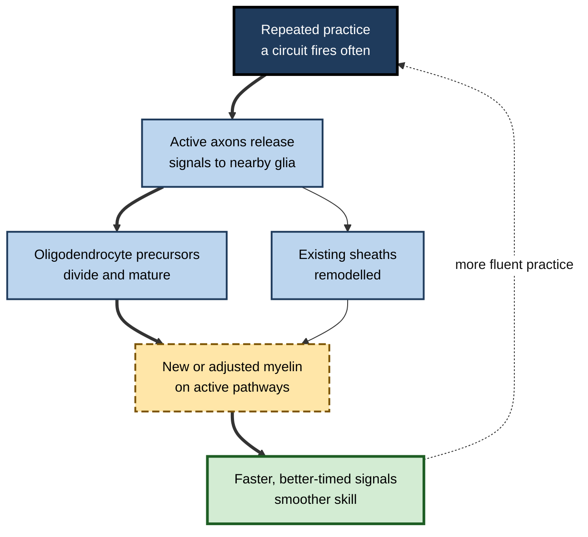
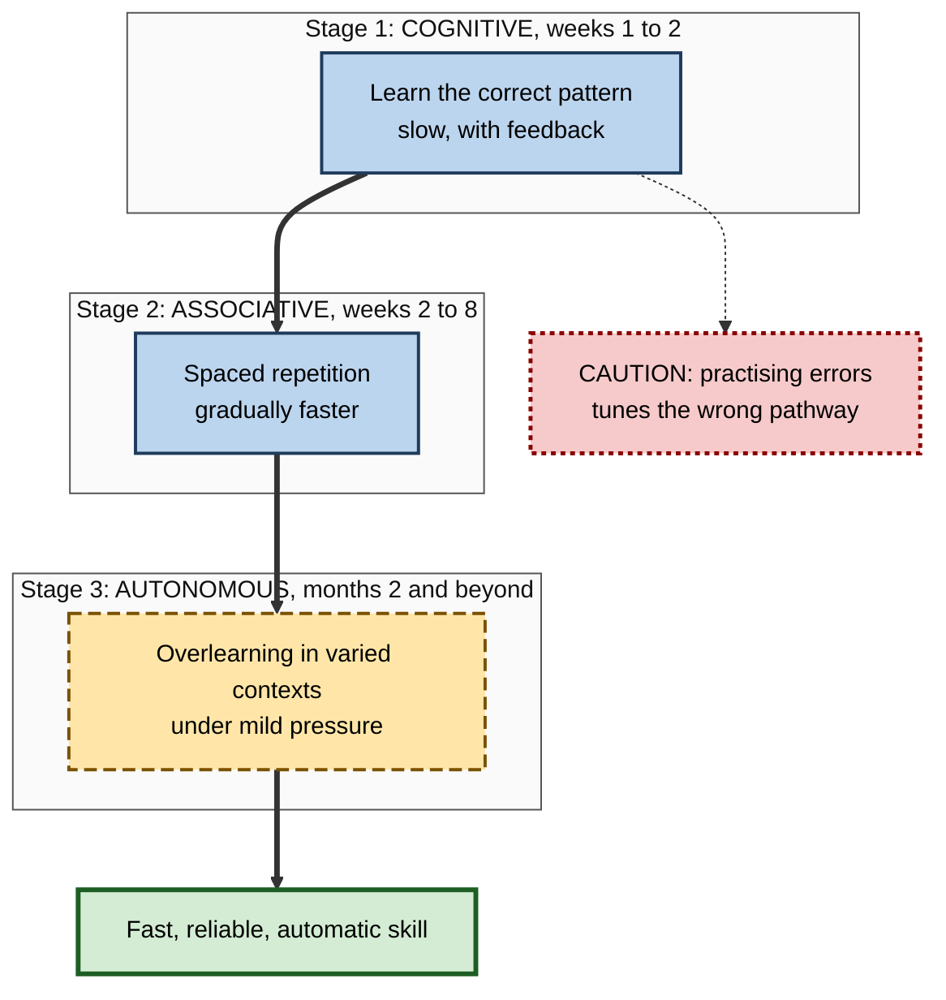

# J.7. Myelin, Repetition, and Skill Learning

> **In one sentence:** Myelin is the fatty insulation wrapped around nerve fibres that speeds and times their signals, and research since the 2010s shows it keeps adapting to practice in adulthood, adding a slow "tuning" layer to skill learning on top of synaptic change.
>
> **Why it matters:** Skills become fast, smooth and automatic through repetition over weeks and months. Myelin plasticity is one reason why — and understanding it, including its limits and the hype around it, helps you plan realistic practice schedules and avoid overselling "myelin-building" methods.
>
> **Level span:** Novice → Expert · **Reading time:** ~17 min · **Builds on:** neuroplasticity basics; structural versus functional plasticity

---

## The Learning Ladder

| Level | Badge | After this level you can... |
|---|---|---|
| 1 | NOVICE | Explain what myelin is and why repeated practice makes skills faster and smoother. |
| 2 | FOUNDATIONS | Describe oligodendrocytes, nodes of Ranvier, conduction speed and the stages of skill learning. |
| 3 | PRACTITIONER | Plan repetition and practice schedules that support durable, automatic skill. |
| 4 | ADVANCED | Summarise the animal and human evidence for activity-dependent myelination, including 2025 findings on learning phases. |
| 5 | EXPERT / PRO | Apply the science to long-term capability building and evaluate myelin-based claims critically. |

---

## Level 1 · Novice — The Big Picture

Nerve cells send signals along long, thin fibres called **axons**. Many axons are wrapped in **myelin**, a fatty, whitish coating rather like the plastic insulation around an electrical cable. Myelin lets signals jump quickly along the fibre instead of crawling, and it helps signals from different parts of the brain arrive at the right moment.

For a long time, myelin was thought to be laid down in childhood and adolescence and then left alone. Research over the last two decades shows something more interesting: **myelin keeps adjusting in adults according to how circuits are used.** Practising a skill can change myelin on the pathways involved.

An analogy: imagine a busy country road that gradually becomes a well-surfaced highway because so many cars use it. Traffic flows faster and more predictably. Repetition over weeks and months does something similar for the nerve pathways behind a skill.

You have already experienced this when:

- a skill such as driving a manual car, playing chords on a guitar, or touch-typing went from slow and effortful to fast and automatic over months;
- you could still ride a bicycle after years without practice;
- a skill felt "rusty" after a long break, then came back much faster than it took to learn originally.

The beginner's key idea: **fast, smooth, automatic skill is built by many repetitions spread over a long time; the brain physically tunes the pathways you use, and myelin is part of that tuning.**

---

## Level 2 · Foundations — Core Concepts

### What myelin does

| Feature | Plain meaning | Why it matters for skill |
|---|---|---|
| **Insulation** | Myelin wraps axons in many layers of membrane. | Prevents signal leakage. |
| **Saltatory conduction** | Signals jump between small gaps called **nodes of Ranvier**. | Greatly increases conduction speed compared with unmyelinated fibres. |
| **Timing** | Thickness, length of sheaths and node spacing set signal speed. | Allows signals from different regions to arrive in sync. |
| **Metabolic support** | Myelin-forming cells supply energy to axons. | Keeps long-distance pathways healthy. |

### Who makes myelin

In the brain and spinal cord, myelin is made by **oligodendrocytes**, a type of glial (support) cell. Each oligodendrocyte can wrap segments of many different axons. The adult brain keeps a reserve of **oligodendrocyte precursor cells (OPCs)**, which can divide and mature into new myelinating cells throughout life.

**Figure J.7-1 — How practice can change myelin.**

*How to read it:* activity in a practised circuit signals to glia; new myelinating cells and remodelled sheaths adjust signal timing; the dotted arrow shows the feedback between fluency and further practice.

### Stages of skill learning

Psychologists Paul Fitts and Michael Posner (1967) described three stages that still frame skill research:

| Stage | Experience | Brain picture (simplified) |
|---|---|---|
| **Cognitive** | Slow, effortful, many errors; you talk yourself through it. | Heavy prefrontal and attentional involvement; rapid synaptic change. |
| **Associative** | Fewer errors; movements and steps start linking together. | Shift toward motor and sensory circuits; consolidation. |
| **Autonomous** | Fast, accurate, little conscious effort; you can do something else at the same time. | Efficient, specialised circuits; slow structural tuning including myelin. |

### Key terms

| Term | Plain meaning |
|---|---|
| **Axon** | The long output fibre of a neuron. |
| **Myelin** | Fatty insulation around axons that speeds and times signals. |
| **Oligodendrocyte** | The brain cell that makes myelin. |
| **Oligodendrocyte precursor cell (OPC)** | A reserve cell that can become a new oligodendrocyte. |
| **Node of Ranvier** | A small gap between myelin segments where the signal is regenerated. |
| **White matter** | Brain tissue dominated by myelinated axons, which look pale. |
| **Automaticity** | Performing a skill with little conscious attention. |

---

## Level 3 · Practitioner — Putting It to Work

### Practice principles that fit myelin and skill science

1. **Expect a long horizon.** Myelin remodelling unfolds over days to weeks after practice, and automaticity takes many weeks to months.
2. **Repeat the exact pattern you want.** Pathways that are used are the ones that get tuned. Practise correct technique from the start.
3. **Space your practice.** Studies in animals suggest that some myelin changes continue in the weeks *after* a learning burst, so consistent, spaced sessions with rest between them suit the biology.
4. **Keep sessions focused and moderately short.** Quality of repetition matters more than duration; tired, sloppy repetitions tune the wrong pattern.
5. **Do not stop at "good enough".** The move from associative to autonomous requires many extra repetitions after you can already do the task correctly.
6. **Maintain.** Long-unused skills fade but are relearned faster, consistent with surviving structural traces.

**Figure J.7-2 — From effortful to automatic: a repetition plan.**

*How to read it:* each subgraph is a stage with a rough timeframe; the thick path leads to automatic skill; the dotted caution shows why correct technique matters early.

### Worked example — a backend engineer learning keyboard-driven editing

| | Before | After |
|---|---|---|
| **Approach** | Tries a new editor's keyboard shortcuts for a day, gets frustrated, returns to the mouse. | Learns five commands a week, uses them deliberately for 15 minutes each morning, adds five more weekly. |
| **Technique** | Mixed: sometimes shortcuts, often mouse. | Disables mouse fallback for the target commands. |
| **Week 2** | Abandoned. | Slower than before; frustration expected. |
| **Month 3** | No change. | Navigation is automatic and faster than the old method; attention freed for the code itself. |

### Common mistakes

- **Quitting in the slow phase.** Performance often dips when switching technique; the payoff comes later.
- **Mindless repetition.** Repetition without attention or feedback can automate errors.
- **Cramming practice.** Long, infrequent sessions suit the biology less well than shorter, regular ones.
- **Expecting speed before accuracy.** Speed should follow correct patterns, not replace them.

---

## Level 4 · Advanced — Mechanisms, Models & Evidence

### Key animal evidence

| Finding | What was shown |
|---|---|
| **Activity drives myelination** | Erin Gibson, Michelle Monje and colleagues (2014) used light to stimulate neurons in the mouse motor cortex and found increased OPC proliferation, new oligodendrocytes and thicker myelin in the stimulated circuit, along with improved motor function. |
| **New myelin is needed for new skills** | Ian McKenzie, William Richardson and colleagues (2014) blocked the production of new oligodendrocytes in adult mice. The mice could still run on a normal wheel but failed to learn a complex wheel with irregular rungs. |
| **Early involvement** | Follow-up work showed new oligodendrocytes are generated within hours of starting complex motor learning and are required early, not only for long-term retention. |
| **Learning phases** | A 2025 study of forelimb reach learning in mice found that during the learning phase, existing myelin sheaths are partly **retracted**, nodes of Ranvier lengthen, and new oligodendrocyte formation is temporarily suppressed; in the two weeks after learning, OPC differentiation, oligodendrocyte generation and sheath remodelling increase. Modelling suggested that retraction slows conduction during learning and new sheaths speed it afterwards. |
| **Beyond motor skills** | Studies in mice have linked oligodendrocyte generation to fear memory consolidation, spatial memory and working-memory training outcomes. |

The emerging picture is that myelin plasticity is **phase-dependent**: an early period of loosening and remodelling during learning, followed by consolidation in the days and weeks afterwards.

### Human evidence

- **Juggling:** Jan Scholz, Heidi Johansen-Berg and colleagues (2009) found changes in a diffusion MRI white matter measure in a region underlying visual-motor areas after six weeks of juggling training.
- **Musicians:** Sara Bengtsson and colleagues (2005) found that hours of childhood piano practice correlated with white matter structure in professional pianists.
- **Development:** myelination of association pathways, especially those connecting the prefrontal cortex, continues into the third decade of life, in line with the slow maturation of planning and self-regulation.

**Caution:** diffusion MRI does not measure myelin directly. Its common measures are also affected by axon diameter, fibre crossing, packing density and other factors. Human myelin plasticity is therefore **inferred**, not directly observed, and newer myelin-sensitive MRI methods are still being validated.

### Where myelin fits among learning mechanisms

| Mechanism | Speed | Role in skill |
|---|---|---|
| Synaptic plasticity | Seconds to hours | Selects and strengthens the right connections. |
| Spine turnover | Hours to weeks | Adds and prunes connection sites. |
| Myelin plasticity | Days to weeks | Tunes speed and timing of pathways that are already being used. |
| Network reorganisation | Weeks to months | Shifts work from effortful to efficient circuits. |

Myelin is best seen as a **complement to synaptic learning, not a replacement**. It optimises timing in circuits that synaptic plasticity has already selected.

### Open questions

- How large is myelin plasticity in adult humans, and for which kinds of learning?
- Is the phase-dependent pattern (loosen, then rebuild) general across skills and species?
- How does ageing, which reduces OPC responsiveness, affect late-life skill learning?
- Could myelin-promoting treatments help in disease, such as multiple sclerosis, without disrupting normal timing?

---

## Level 5 · Expert / Pro — Professional Mastery

### Applying the science to capability building

| Principle | Programme design choice |
|---|---|
| Slow structural tuning | Plan skill programmes over months, with defined practice cadences. |
| Phase-dependent consolidation | Alternate practice bursts with lighter consolidation periods rather than continuous cramming. |
| Correct pattern first | Invest in expert demonstration and early feedback before speed. |
| Overlearning for automaticity | Continue practice beyond first success, especially for safety-critical skills. |
| Use it or lose it | Schedule refreshers for rarely used but critical skills (incident response, emergency procedures). |

### Evaluating myelin claims

Popular books and training programmes sometimes present myelin as **the** secret of talent: "every repetition wraps another layer of myelin". This overstates the evidence:

- Myelin plasticity is real but **one mechanism among several**.
- Most evidence comes from **mice**; human evidence relies on **indirect imaging**.
- Recent work shows learning can even involve **temporary myelin retraction**, so "more wraps" is too simple a story.
- No consumer product or supplement has been shown to build myelin for skill learning in healthy adults.

Use "myelin" to explain why skills take time and repetition — not to sell a method.

### Professional scenario

**Role:** Head of operations training for an airline's ground-handling teams.
**Situation:** New staff pass initial certification but make errors in rare procedures (such as de-icing in unusual conditions) months later.
**What the pro does:** Recognises that skills practised once to pass a test never reached automaticity. Introduces a quarterly cycle: brief simulator refreshers for rare procedures, with a correct-pattern demonstration, spaced repetitions over two weeks, and a consolidation gap before a scored check. Retires the idea of "certified once, competent forever". Error rates in rare procedures are tracked as the core metric.

### AI-era perspective

AI can take over many cognitive and procedural tasks. Automatic, embodied and fast-response skills (live presenting, negotiation, hands-on technical work, rapid incident triage) still depend on long, repeated practice in the person. Organisations that rely on AI for routine work should deliberately preserve repetition for the skills that need to be automatic in humans.

---

## Myths vs. Evidence

| Myth | What the evidence shows |
|---|---|
| "Myelin is the single secret of talent." | Myelin plasticity is one of several mechanisms; synaptic and network changes are essential. |
| "Every repetition adds another layer of myelin." | Myelin changes are phase-dependent and can include retraction during learning; the "layer per rep" idea is not supported. |
| "Myelination finishes in childhood." | Myelination continues into adulthood, and adult myelin remains plastic. |
| "Practice makes perfect." | Practice makes permanent; repeating errors tunes the wrong pathway. |
| "Supplements build myelin and speed learning." | No good evidence in healthy adults. |
| "MRI shows exactly how much myelin training adds." | Common diffusion measures are indirect and influenced by many factors besides myelin. |

## Practitioner Toolkit

**Automaticity plan template**

| Skill | Correct-pattern source | Practice cadence | Speed target | Overlearning period | Maintenance refresher |
|---|---|---|---|---|---|
| | | | | | |

**Repetition quality checklist**

- [ ] I know what correct technique looks like.
- [ ] My early repetitions are slow and accurate.
- [ ] Sessions are short enough to stay focused.
- [ ] I practise on most days, with rest days built in.
- [ ] I keep practising after first success.
- [ ] I schedule refreshers for rarely used critical skills.

## Self-Check

1. **[NOVICE]** What is myelin, and what does it do?
2. **[NOVICE]** Why does a practised skill feel faster and smoother?
3. **[FOUNDATIONS]** Which cells make myelin in the brain, and what are OPCs?
4. **[FOUNDATIONS]** Name the three Fitts and Posner stages.
5. **[PRACTITIONER]** Why should early practice be slow and accurate?
6. **[ADVANCED]** What did the 2014 McKenzie study show?
7. **[ADVANCED]** Describe the phase-dependent myelin pattern reported in 2025.
8. **[ADVANCED]** Why is human myelin plasticity described as inferred?
9. **[EXPERT / PRO]** How would you respond to a training vendor claiming each repetition adds a layer of myelin?

### Answer Key

1. Fatty insulation around axons that speeds signals and tunes their timing.
2. Repetition strengthens and tunes the pathways involved, including synaptic changes and myelin adjustments, so signals flow faster and more reliably.
3. Oligodendrocytes; OPCs are oligodendrocyte precursor cells that can become new myelinating cells in adults.
4. Cognitive, associative, autonomous.
5. Repetition tunes whatever pathway is used; practising errors automates errors.
6. Adult mice unable to make new oligodendrocytes failed to learn a complex motor task, showing new myelin is needed for some new skills.
7. During learning, sheaths partly retract and new oligodendrocyte formation pauses; in the following two weeks, new oligodendrocytes and sheath remodelling increase.
8. Human evidence comes from diffusion MRI and correlations, which do not measure myelin directly.
9. Explain that myelin plasticity is real but phase-dependent and one mechanism among several; ask for evidence of real-world skill outcomes instead.

## Key Takeaways

- **Myelin** insulates axons, speeds signals and **tunes timing**.
- Adult myelin is **plastic**: active circuits recruit new oligodendrocytes and remodel sheaths.
- In mice, **new myelin is required** for learning some complex motor skills.
- Recent work shows myelin change is **phase-dependent** — remodelling during learning, building afterwards.
- Human evidence is **indirect**; avoid "layer per repetition" hype.
- Practical rule: **correct pattern first, spaced repetition, overlearning, maintenance**.

## Glossary

| Term | Meaning |
|---|---|
| Automaticity | Performing a skill with little conscious attention. |
| Axon | The output fibre of a neuron. |
| Diffusion MRI | Imaging that infers white matter structure from water movement. |
| Myelin | Fatty insulation around axons. |
| Node of Ranvier | A gap between myelin segments where signals are regenerated. |
| Oligodendrocyte | The central nervous system cell that makes myelin. |
| Oligodendrocyte precursor cell (OPC) | A reserve cell able to become a new oligodendrocyte. |
| Overlearning | Continuing practice after first success to make a skill robust. |
| Saltatory conduction | Signal jumping between nodes along a myelinated axon. |
| White matter | Brain tissue dominated by myelinated axons. |
