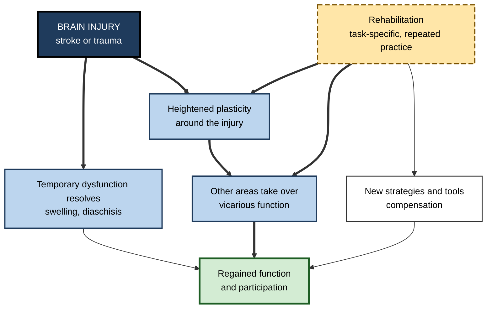
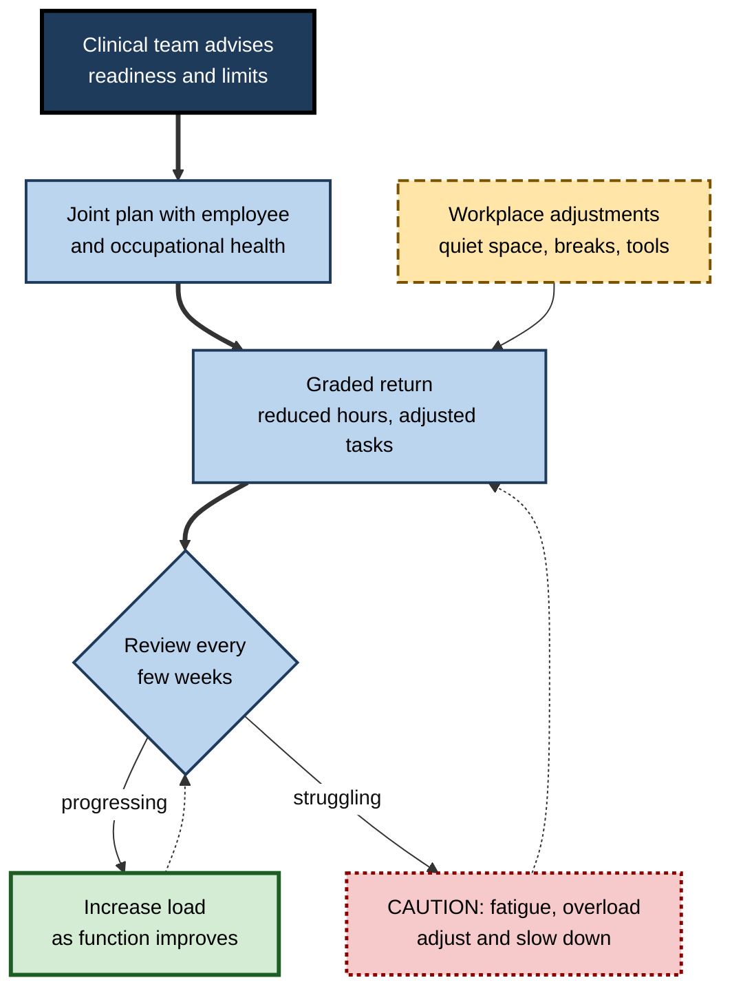

# J.8. Neuroplasticity After Brain Injury

> **In one sentence:** After a stroke or other brain injury, the brain uses plasticity to reorganise surviving circuits, and rehabilitation works by giving that reorganisation the right kind, amount and timing of practice.
>
> **Why it matters:** Brain-injury recovery is the most demanding real-world test of plasticity science. Its lessons — dose, specificity, timing, motivation and the difference between true recovery and workarounds — apply to all learning, and help colleagues, managers and families support someone returning to work after injury.
>
> **Level span:** Novice → Expert · **Reading time:** ~19 min · **Builds on:** what neuroplasticity is; experience-dependent plasticity; critical periods
>
> **Important:** This note is educational, not medical advice. It explains general science and does not replace assessment or treatment by qualified clinicians. Anyone with a brain injury, or caring for someone who has one, should follow the guidance of their own medical and rehabilitation team.

---

## The Learning Ladder

| Level | Badge | After this level you can... |
|---|---|---|
| 1 | NOVICE | Explain in plain words how the brain can recover some function after injury. |
| 2 | FOUNDATIONS | Describe the main recovery mechanisms and the difference between recovery and compensation. |
| 3 | PRACTITIONER | Understand the core principles of rehabilitation and how to support a colleague's return to work. |
| 4 | ADVANCED | Interpret evidence on timing, dose, the proportional recovery debate and neuromodulation such as paired vagus nerve stimulation. |
| 5 | EXPERT / PRO | Apply rehabilitation lessons to workplace policy, technology and learning design, with ethical care. |

---

## Level 1 · Novice — The Big Picture

When part of the brain is damaged — by a stroke (a blocked or burst blood vessel), a head injury, an infection or surgery — the neurons in that area may die. Dead neurons do not come back. Yet many people regain abilities they lost: walking, speaking, using a hand, managing their work. How?

The answer is **neuroplasticity**. Surviving parts of the brain reorganise. Nearby areas take on extra work, connections are strengthened or rerouted, and the person learns new ways to do things. It is a bit like a city after a bridge collapses: traffic is rerouted over other bridges, some side streets become main roads, and new habits of travel develop. The city works again — not identically, but well.

You may have already seen this when:

- a relative who had a stroke gradually regained speech over months of therapy;
- a sports player recovered from a concussion with a step-by-step return to activity;
- someone with an arm weakness improved through daily, repetitive exercises.

Recovery is **not automatic and not unlimited**. It depends on the size and location of the injury, age, general health, the timing and intensity of rehabilitation, and the person's motivation and support.

The beginner's key idea: **the injured brain can partly rewire itself, and the right practice, started at the right time and repeated a lot, helps it do so.**

---

## Level 2 · Foundations — Core Concepts

### What happens after an injury

Recovery after stroke unfolds in overlapping phases:

| Phase | Typical timing | What is happening |
|---|---|---|
| **Hyperacute and acute** | Hours to days | Emergency treatment; swelling and disrupted blood flow; nearby tissue may be stunned but alive. |
| **Early subacute** | Days to about 3 months | Swelling resolves; "spontaneous" biological recovery; heightened plasticity around the injury. Most natural recovery occurs here. |
| **Late subacute** | About 3 to 6 months | Recovery continues more slowly. |
| **Chronic** | After about 6 months | Spontaneous recovery largely plateaus, but training can still improve function. |

### Main mechanisms of recovery

1. **Resolution of temporary dysfunction.** Areas connected to the damaged region can go quiet after injury, a phenomenon called **diaschisis**. As this resolves, some function returns.
2. **Peri-injury reorganisation.** Tissue surrounding the damage enters a period of heightened plasticity in which growth-promoting signals rise and inhibition falls, allowing new connections.
3. **Vicarious function.** Other areas, in the same or opposite hemisphere, take over some of the lost functions.
4. **Behavioral compensation.** The person learns new strategies or uses tools to achieve the same goals in different ways.

**Figure J.8-1 — Recovery mechanisms and how rehabilitation interacts with them.**

*How to read it:* the injury triggers natural recovery processes; rehabilitation (long-dash box) feeds the plasticity-based routes and also teaches compensation.

### Recovery versus compensation

Rehabilitation researchers Mindy Levin, Jeffrey Kleim and Steven Wolf (2009) argued for careful terms:

| Term | Meaning | Example |
|---|---|---|
| **Recovery** | Restoring the original way of performing a movement or function. | Reaching with normal joint coordination again. |
| **Compensation** | Achieving the goal by a different method. | Reaching by leaning the trunk forward instead of extending the arm; using the other hand. |

Both have value. Compensation can restore independence quickly, but heavy early reliance on it may limit true recovery, a problem known as **learned non-use**.

### Key terms

| Term | Plain meaning |
|---|---|
| **Stroke** | Brain injury caused by a blocked or burst blood vessel. |
| **Traumatic brain injury (TBI)** | Brain injury caused by an external force. |
| **Diaschisis** | Loss of function in brain regions connected to, but distant from, the damaged area. |
| **Aphasia** | Language impairment after brain injury. |
| **Hemiparesis** | Weakness on one side of the body. |
| **Learned non-use** | Avoiding a weak limb, which leads to further loss of its function. |
| **Task-specific training** | Practising the actual everyday tasks the person wants to regain. |

---

## Level 3 · Practitioner — Putting It to Work

*Reminder: this section explains general principles for understanding and supporting rehabilitation; it is not a treatment plan. Rehabilitation decisions belong to the person and their clinical team.*

### Core principles of rehabilitation

1. **Task-specific practice.** People improve most at the tasks they actually practise. Training targets real goals, such as dressing, typing or speaking in meetings.
2. **High repetition.** Animal studies of recovery use hundreds of repetitions per session; observational studies have found that typical human therapy sessions include far fewer. Increasing practice dose is a major focus of modern rehabilitation research.
3. **Progressive challenge.** Tasks should be hard enough to require effort but achievable.
4. **Salience and motivation.** Goals that matter to the person drive engagement and plasticity.
5. **Avoiding learned non-use.** Approaches such as **constraint-induced movement therapy** restrict the stronger limb for part of the day to force use of the weaker one, for people with some residual movement.
6. **Feedback.** Clear information on performance helps refine movement or language.

**Figure J.8-2 — Supporting a colleague's return to work after brain injury.**

*How to read it:* the thick path is a graded return guided by clinicians; dotted loops show regular review in either direction.

### Worked example — a project manager returning after a mild stroke

| | Unsupportive approach | Supportive, evidence-informed approach |
|---|---|---|
| **Return** | Full workload from day one. | Phased hours over eight weeks, agreed with occupational health and the clinical team. |
| **Tasks** | Same as before, including back-to-back meetings. | Prioritised tasks, scheduled breaks, written agendas to reduce working-memory load. |
| **Practice** | None; "they're fine now". | Time protected for therapy appointments and home practice. |
| **Tools** | None. | Note-taking tools, captioned calls, reminders. |
| **Outcome** | Fatigue, errors, sick leave again. | Gradual return to full role; plan adjusted twice. |

### Common mistakes

- **Assuming recovery ends at a fixed date.** Spontaneous recovery slows, but training can still help in the chronic phase.
- **Ignoring fatigue.** Post-stroke and post-TBI fatigue is common and often invisible.
- **Doing everything for the person.** Well-meant help can reinforce learned non-use.
- **Expecting a straight line.** Recovery has plateaus and setbacks.

---

## Level 4 · Advanced — Mechanisms, Models & Evidence

### A sensitive period after stroke

Animal studies show a window of heightened plasticity in the weeks after a stroke. The **Critical Period After Stroke Study (CPASS)**, a phase II randomised trial published in 2021, tested this in humans. Seventy-two participants received an extra 20 hours of intensive upper-limb therapy starting at different times. Therapy started at **60–90 days** after stroke produced the largest benefit; starting within the first 30 days gave smaller benefit; starting at six months or later gave no significant benefit over usual care. It was the first prospective evidence of a sensitive period for motor recovery in adult humans; as a phase II study, it needs confirmation.

### Too early and too much can backfire

The large **AVERT** trial (2015) found that very early, high-dose mobilisation (getting people out of bed within 24 hours, frequently) led to *less* favourable outcomes at three months than usual care. Timing and dose interact: the very early period may be a time of vulnerability as well as plasticity.

### The proportional recovery debate

In 2008, researchers reported that many stroke patients recover about **70% of their maximum possible improvement** in arm function in the first months — the **proportional recovery rule** — with a subgroup of "non-fitters" who recover much less. The rule became influential. From 2019, several analyses argued that much of the apparent regularity can arise from **statistical artefacts** (mathematical coupling between initial score and change, and ceiling effects). The current view is that recovery is broadly predictable from early impairment and from integrity of the corticospinal tract, but the precise "70% rule" is **contested** and should not be used to set individual expectations.

### Neuromodulation paired with therapy

| Approach | Status (as of 2025–2026) |
|---|---|
| **Vagus nerve stimulation paired with rehabilitation** | A pivotal randomised trial found that 47% of participants with chronic arm weakness had a clinically meaningful response with active stimulation paired to exercises, versus 24% with sham. The approach received United States regulatory approval in 2021 for chronic ischaemic stroke. Reviews in 2025 call it a promising adjunct, while noting the need for broader populations and standardised protocols. |
| **Non-invasive brain stimulation (rTMS, tDCS)** | Mixed results; some benefit in specific groups, inconsistent across trials. |
| **Brain–computer interfaces and robotics** | Growing evidence for robotics and BCI-assisted training as ways to increase practice dose; effects depend on total task-specific practice. |

The rationale for paired stimulation is the same three-factor logic seen in healthy learning: a precisely timed burst of neuromodulators (acetylcholine and noradrenaline) during practice signals "this matters" and enhances plasticity in the circuits being used.

### The role of the other hemisphere

An older **interhemispheric competition** model held that the undamaged hemisphere suppresses the damaged one, so dampening it should help. Evidence now suggests the picture depends on injury severity: in people with large injuries, the undamaged hemisphere may provide useful support. This **bimodal balance–recovery** view helps explain inconsistent stimulation results and argues for individualised approaches.

### Language recovery

Aphasia rehabilitation shows similar dose effects. A large randomised trial in chronic aphasia (2017) found that intensive speech and language therapy — at least ten hours a week for three weeks — improved everyday verbal communication compared with deferred therapy. Language recovery can involve surviving left-hemisphere areas and, to a variable degree, right-hemisphere regions.

### Traumatic brain injury

TBI often causes diffuse injury to long-range white matter pathways, producing problems with attention, processing speed, memory and executive function. Plasticity principles apply, but recovery is more varied; cognitive rehabilitation, graded return to activity and management of fatigue and mood are central.

---

## Level 5 · Expert / Pro — Professional Mastery

### Lessons from rehabilitation for all learning

| Rehabilitation lesson | General learning implication |
|---|---|
| Dose matters, and real-world doses are often too low. | Most workplace training is underdosed; plan for many more practice repetitions. |
| Timing interacts with biology. | Learning works best when the learner is ready; overload can backfire. |
| Task-specific practice wins. | Train the actual job tasks. |
| Compensation versus recovery. | Decide when a tool or workaround is acceptable and when the underlying capability must be built. |
| Neuromodulatory gating. | Meaning, reward and attention determine how much practice changes the brain. |

### Workplace policy and inclusion

- **Graded return-to-work plans**, informed by clinicians and occupational health, are standard good practice.
- **Reasonable adjustments** — flexible hours, rest breaks, quiet spaces, assistive technology — are required by disability law in many countries.
- **Invisible symptoms** such as fatigue, slowed processing and reduced multitasking are common; managers should not equate "looks fine" with "is fine".
- **Confidentiality** is essential: medical details belong to the person.

### Technology and AI

Rehabilitation technology — wearable sensors that count real-world arm use, home-based exergames, tele-rehabilitation and AI-guided practice — aims to raise practice dose outside the clinic. Evidence is promising but uneven; the most important ingredient remains **task-specific, high-repetition, motivating practice**, however it is delivered.

### Professional scenario

**Role:** HR business partner in a technology company.
**Situation:** A senior engineer is returning to work three months after a stroke. They have mild hand weakness, tire easily and find fast-paced meetings overwhelming.
**What the pro does:** Coordinates with occupational health and the engineer to agree a phased schedule respecting clinical advice. Arranges voice-to-text tools and an ergonomic keyboard, protects time for ongoing outpatient therapy, sets meeting norms (agendas, recordings, written decisions) and schedules check-ins every two weeks. Educates the manager about invisible fatigue and avoids sharing medical details with the team. Treats the plan as adjustable and documents adjustments.

### Ethical limits

- Avoid "inspiration" narratives that imply anyone who tries hard enough will fully recover; outcomes vary for reasons beyond effort.
- Be wary of commercial "brain recovery" products and clinics making unsupported claims.
- Respect autonomy: rehabilitation goals should be the person's goals.

---

## Myths vs. Evidence

| Myth | What the evidence shows |
|---|---|
| "Dead brain cells grow back after a stroke." | Lost neurons are not replaced in meaningful numbers; recovery comes mainly from reorganising surviving circuits. |
| "After six months, no further improvement is possible." | Spontaneous recovery slows, but training can still improve function in the chronic phase. |
| "Earlier and more intense therapy is always better." | Very early, high-dose mobilisation was harmful in a large trial; one phase II trial found the 60–90 day window most responsive. |
| "Everyone recovers 70% of what they lost." | The proportional recovery rule is contested and partly a statistical artefact; individual outcomes vary. |
| "Brain stimulation alone can restore function." | Stimulation works, if at all, as an adjunct paired with task-specific practice. |
| "If someone looks fine, they are fine." | Fatigue, slowed processing and attention problems are common and often invisible. |

## Practitioner Toolkit

**Manager's return-to-work checklist** (to be used alongside clinical and occupational health advice)

- [ ] A written, phased plan agreed with the employee and occupational health.
- [ ] Clear priorities; reduced multitasking and context switching.
- [ ] Scheduled breaks and a quiet workspace option.
- [ ] Assistive tools set up before day one.
- [ ] Time protected for therapy and home practice.
- [ ] Regular check-ins with permission to slow down.
- [ ] Medical information kept confidential.

**Questions to bring to a clinical team** (for patients and families)

1. What are the main goals for the next four weeks?
2. How much practice is recommended each day, and which tasks?
3. What signs of fatigue or overload should we watch for?
4. What should we do ourselves, and what should the person do alone?

## Self-Check

1. **[NOVICE]** If dead neurons do not return, how can someone recover after a stroke?
2. **[NOVICE]** Name three factors that affect how much someone recovers.
3. **[FOUNDATIONS]** What is diaschisis?
4. **[FOUNDATIONS]** What is the difference between recovery and compensation?
5. **[PRACTITIONER]** What is learned non-use, and how does constraint-induced therapy address it?
6. **[ADVANCED]** What did the CPASS trial find about timing?
7. **[ADVANCED]** Why is the proportional recovery rule contested?
8. **[ADVANCED]** How does paired vagus nerve stimulation work, and what did the pivotal trial find?
9. **[EXPERT / PRO]** Name three workplace adjustments that support a return to work after brain injury.
10. **[EXPERT / PRO]** What lesson from rehabilitation applies most directly to corporate training?

### Answer Key

1. Surviving brain areas reorganise, connections strengthen or reroute, other areas take over functions, and the person learns compensatory strategies.
2. Injury size and location, age, health, timing and intensity of rehabilitation, motivation and support.
3. Loss of function in connected brain regions distant from the injury, which can resolve over time.
4. Recovery restores the original way of performing; compensation achieves the goal by a different method.
5. Avoiding the weaker limb, which leads to further loss; constraint-induced therapy restricts the stronger limb to force practice with the weaker one.
6. Extra intensive therapy starting at 60–90 days produced the largest gains; within 30 days gave less; at six months or later gave no significant benefit.
7. Re-analyses suggest its regularity is partly a statistical artefact of mathematical coupling and ceiling effects.
8. Stimulation timed to movements releases neuromodulators that enhance plasticity; 47% versus 24% of participants had clinically meaningful responses with active versus sham stimulation.
9. Phased hours, rest breaks, quiet workspace, assistive technology, meeting agendas and recordings, protected therapy time.
10. Dose and task-specific practice: most training provides far too few repetitions of the real task.

## Key Takeaways

- Recovery after brain injury comes mainly from **reorganising surviving circuits**, not replacing lost neurons.
- Mechanisms include **resolution of diaschisis, peri-injury plasticity, vicarious function and compensation**.
- Rehabilitation depends on **task-specific, high-repetition, meaningful, progressive practice**.
- **Timing matters**: very early, high-dose activity can harm; a sensitive period around 60–90 days was found in one phase II trial.
- The **70% proportional recovery rule is contested**.
- **Paired neuromodulation** (such as vagus nerve stimulation) is a promising adjunct, not a substitute for practice.
- This note is **educational, not medical advice**; follow the clinical team.

## Glossary

| Term | Meaning |
|---|---|
| Aphasia | Language impairment after brain injury. |
| Compensation | Achieving a goal by a different method after injury. |
| Constraint-induced movement therapy | Restricting the stronger limb to force use of the weaker one. |
| Corticospinal tract | The main pathway from motor cortex to the spinal cord. |
| Diaschisis | Temporary loss of function in regions connected to an injury. |
| Hemiparesis | Weakness on one side of the body. |
| Learned non-use | Avoidance of an impaired limb that worsens its function. |
| Proportional recovery rule | A contested claim that patients regain about 70% of lost arm function early on. |
| Recovery | Restoration of the original way of performing a function. |
| Stroke | Brain injury from a blocked or burst blood vessel. |
| Traumatic brain injury | Brain injury caused by external force. |
| Vagus nerve stimulation | Electrical stimulation of the vagus nerve, used paired with rehabilitation to enhance plasticity. |
