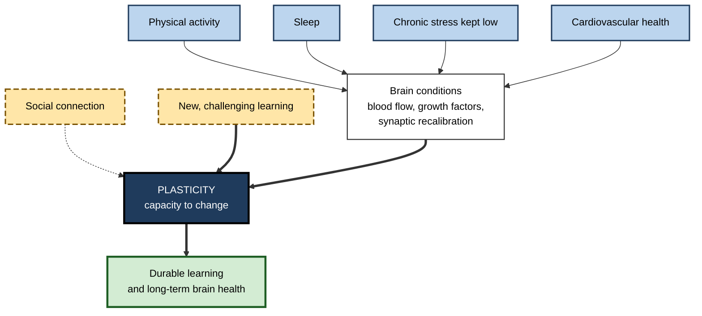
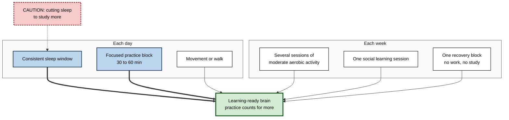

# J.9. Lifestyle Factors That Enhance Plasticity

> **In one sentence:** Physical activity, sleep, managing chronic stress, social connection, challenging new learning and broad cardiovascular health create the conditions in which the brain can change and stay healthy — but the evidence for each is more modest and nuanced than popular "brain hack" claims suggest.
>
> **Why it matters:** Professionals often try to learn more while sleeping less, moving less and living under chronic pressure. Understanding which lifestyle factors genuinely support plasticity — and by how much — helps you protect your capacity to learn throughout a long career, and helps organisations avoid wellness programmes built on hype.
>
> **Level span:** Novice → Expert · **Reading time:** ~18 min · **Builds on:** what neuroplasticity is; experience-dependent plasticity
>
> **Note:** This is general educational information about research findings, not personal health advice. Anyone with health conditions should consult a qualified professional before changing exercise, diet or sleep routines.

---

## The Learning Ladder

| Level | Badge | After this level you can... |
|---|---|---|
| 1 | NOVICE | Name the main everyday habits that support a learning-ready brain. |
| 2 | FOUNDATIONS | Explain how exercise, sleep, stress, social life and new learning each relate to plasticity. |
| 3 | PRACTITIONER | Build a realistic weekly routine that supports intensive learning periods. |
| 4 | ADVANCED | Weigh the evidence — including null trials, BDNF caveats and multidomain studies — for each factor. |
| 5 | EXPERT / PRO | Design evidence-based workplace wellbeing and learning policies and reject unsupported products. |

---

## Level 1 · Novice — The Big Picture

Think of the brain as a garden. Learning is the planting: new skills and knowledge take root through practice. But the soil, water and sunlight decide how well anything grows. For the brain, the "soil conditions" include **moving your body, sleeping well, keeping chronic stress in check, staying socially connected, and regularly learning genuinely new things**.

None of these is a magic switch. You cannot jog your way into knowing accounting. But if you sleep four hours a night, never move, and live under constant pressure, the same study time produces less durable learning.

You have already experienced this when:

- you studied late into the night before an exam and could barely recall it two days later;
- a walk helped you think more clearly about a problem;
- a stressful month at work left you forgetful and slow to pick up new tools;
- learning something completely new, like a dance or an instrument, left you feeling mentally sharper.

The beginner's key idea: **healthy habits do not replace practice, but they make practice count for more and help keep the brain healthy over a lifetime.**

---

## Level 2 · Foundations — Core Concepts

### The main factors

| Factor | Main link to plasticity | Strength of evidence for learning and cognition |
|---|---|---|
| **Physical activity** | Increases blood flow, growth factors such as BDNF, and in animals new neurons in the hippocampus. | Moderate: consistent small benefits in adults, especially older adults; effects on brain structure mixed. |
| **Sleep** | Consolidates memories and recalibrates synapses. | Strong for memory consolidation; strong evidence that sleep loss impairs learning. |
| **Chronic stress management** | Chronic stress hormones impair prefrontal and hippocampal plasticity. | Strong in animals; consistent associations in humans. |
| **Social connection** | Linked to cognitive engagement, mood and lower dementia risk. | Moderate, mostly observational. |
| **Challenging new learning** | Directly drives experience-dependent plasticity. | Moderate to strong for trained skills; weak for broad transfer. |
| **Cardiovascular health** | Blood pressure, blood sugar and cholesterol affect brain blood supply and long-term brain health. | Strong for long-term brain health and dementia risk. |
| **Diet** | Supports vascular and metabolic health. | Mixed: observational benefits, but key trials have been null. |

### BDNF in brief

**Brain-derived neurotrophic factor (BDNF)** is a protein that supports neuron survival, growth and synaptic plasticity. Exercise raises BDNF in the blood, and in animals in the hippocampus. It is often called "fertiliser for the brain". The caveat: blood BDNF levels in humans are an **indirect proxy**; much of circulating BDNF comes from platelets and other sources, and it is unclear how closely it reflects what happens in the brain.

**Figure J.9-1 — How lifestyle factors connect to learning.**

*How to read it:* most lifestyle factors improve the brain's conditions (solid arrows); new learning directly drives plasticity (thick arrow); social connection has a looser, mostly observational link (dotted arrow).

### Key terms

| Term | Plain meaning |
|---|---|
| **BDNF** | A growth factor that supports neuron survival and plasticity. |
| **Aerobic exercise** | Sustained activity that raises heart rate, such as brisk walking, cycling or swimming. |
| **Sleep consolidation** | Stabilisation and reorganisation of memories during sleep. |
| **Cognitive reserve** | The brain's resilience to damage built through education, complex work and engagement. |
| **Multidomain intervention** | A programme that combines exercise, diet, cognitive training, social activity and health monitoring. |
| **Modifiable risk factor** | A factor that can be changed to reduce disease risk. |

---

## Level 3 · Practitioner — Putting It to Work

### A realistic routine for an intensive learning period

1. **Protect sleep first.** Aim for consistent sleep and wake times and enough sleep to wake feeling rested; most adults need roughly seven to nine hours. Avoid sacrificing sleep to study — it undermines consolidation.
2. **Move most days.** Regular moderate aerobic activity, such as brisk walking, combined with some strength work, is a reasonable foundation consistent with public-health guidelines.
3. **Use short movement breaks.** A brief walk can refresh attention between study blocks. Benefits are modest but cheap.
4. **Manage chronic stress.** Identify the main ongoing stressors you can change; build recovery time into the week.
5. **Learn with others.** Study groups, mentoring and teaching others combine social connection with active learning.
6. **Seek genuine novelty.** Pick learning that stretches you, not only material you already know.
7. **Keep basics in check.** Regular health checks for blood pressure, blood sugar, hearing and vision support long-term brain health.

**Figure J.9-2 — A weekly rhythm for learning-ready habits.**

*How to read it:* sleep and focused practice (thick arrows) are the core; other habits support them; the caution box marks the most common self-defeating trade-off.

### Worked example — a consultant studying for a professional certification

| | Before | After |
|---|---|---|
| **Sleep** | Five to six hours on weeknights; studies until 1 a.m. | Seven to eight hours; study ends an hour before bed. |
| **Movement** | Sedentary; skips the gym "to save time". | 30-minute brisk walk most days, sometimes while reviewing flashcards aloud. |
| **Stress** | Constant overload; studies in fragments between calls. | Two protected study blocks per day; one evening a week off. |
| **Social** | Studies alone. | Weekly study group explaining topics to each other. |
| **Outcome** | Retains little; feels exhausted. | Higher practice-test scores with fewer total study hours. |

### Common mistakes

- **Treating habits as substitutes for practice.** No lifestyle factor teaches content.
- **Sacrificing sleep for study time.** It trades durable learning for short-term coverage.
- **All-or-nothing thinking.** Modest, consistent changes beat extreme, short-lived regimes.
- **Buying supplements instead of building habits.** Supplement evidence for healthy adults is weak.

---

## Level 4 · Advanced — Mechanisms, Models & Evidence

### Exercise

- **Animal evidence:** running increases hippocampal neurogenesis, BDNF, synaptic plasticity and learning in rodents — a robust, repeated finding.
- **Human structural evidence:** a well-known one-year trial in older adults (Kirk Erickson and colleagues, 2011) found that walking increased anterior hippocampal volume by about 2%, while a stretching control group showed a decline. Later meta-analyses are mixed; a 2025 meta-analysis in older adults at high risk with existing hippocampal shrinkage found no significant effect of exercise on hippocampal volume.
- **Human cognitive evidence:** meta-analyses generally report small positive effects of aerobic and combined exercise on cognition in older adults, including episodic memory, with heterogeneity across studies. Evidence in younger healthy adults is weaker.
- **BDNF:** a 2025 umbrella meta-analysis found that exercise interventions raise peripheral BDNF across clinical and healthy groups, but the link between blood BDNF and learning outcomes remains indirect.

### Sleep

Sleep supports plasticity in at least two complementary ways:

1. **Systems consolidation:** during deep sleep, the hippocampus replays recent experiences, coordinated with cortical sleep spindles and slow oscillations, helping integrate memories into long-term networks.
2. **Synaptic homeostasis:** the **synaptic homeostasis hypothesis** (Giulio Tononi and Chiara Cirelli) proposes that waking learning causes net synaptic strengthening, and sleep downscales synapses overall, improving signal-to-noise and restoring capacity for new learning. A 2024 study in mice provided causal evidence linking synaptic potentiation in the prefrontal cortex to sleep need. The hypothesis is influential but still debated; some synapses strengthen during sleep.

Sleep deprivation reliably impairs attention and the encoding of new memories, and sleep after learning supports retention.

### Chronic stress

Chronic stress elevates glucocorticoids and alters neuromodulators, leading in animals to shrinkage of dendrites in the prefrontal cortex and hippocampus and growth in the amygdala. This shifts the brain from flexible, reflective learning toward habitual, threat-focused responding. Acute, manageable challenge is a different matter and can sharpen learning. For lifestyle purposes, the practical point is that chronic stress reduction is part of the "soil" for learning.

### Mindfulness and meditation

Early, small imaging studies suggested meditation changes brain structure. A larger 2022 analysis of two randomised trials of an eight-week mindfulness programme found no detectable structural brain changes compared with control groups. Mindfulness can help some people with stress and wellbeing, but claims that it "rewires the brain" in weeks are not well supported.

### Diet and supplements

| Item | Evidence summary |
|---|---|
| **Mediterranean-style and MIND diets** | Associated with better cognitive ageing in observational studies; a 2023 randomised trial of the MIND diet found no significant cognitive benefit over a control diet (both groups had mild calorie restriction). |
| **Omega-3 supplements** | Trials in healthy adults have largely not shown cognitive benefits. |
| **Ginkgo and "nootropic" supplements** | Large trials have not supported cognitive benefit for healthy adults. |
| **Caffeine** | Improves alertness and attention short-term; not a plasticity enhancer as such. |
| **Alcohol** | Heavy drinking harms the brain; recent research does not support a protective "moderate drinking" effect for the brain. |

### Multidomain and population evidence

- **FINGER (Finland, 2015):** a two-year multidomain programme (diet, exercise, cognitive training, vascular monitoring) improved cognitive performance in at-risk older adults compared with general health advice.
- **US POINTER (2025):** a two-year trial in the United States found that a structured, supported multidomain lifestyle programme improved global cognition modestly more than a self-guided version; both groups improved.
- **Lancet Commission (2024):** identified 14 modifiable risk factors across the lifespan — including less education, hearing loss, high LDL cholesterol, depression, traumatic brain injury, physical inactivity, diabetes, smoking, hypertension, obesity, excess alcohol, social isolation, air pollution and untreated vision loss — and estimated that nearly half of dementia cases could in principle be prevented or delayed by addressing them.

The pattern across this evidence: **combinations of moderate, sustained changes** have more support than any single "hack".

---

## Level 5 · Expert / Pro — Professional Mastery

### Evidence-based workplace policy

| Policy | Rationale |
|---|---|
| Avoid chronic out-of-hours work and late-night deadlines | Protects sleep, which underpins consolidation and judgement. |
| Encourage walking meetings and movement breaks | Low cost, modest cognitive and wellbeing benefits. |
| Schedule learning in normal working hours | Avoids forcing learning into sleep or recovery time. |
| Address workload and control, not only resilience training | Chronic stress is driven largely by job design. |
| Support hearing and vision checks and adjustments | Sensory loss is a modifiable dementia risk factor and affects learning. |
| Foster peer learning communities | Combines social connection with active learning. |

### Evaluating wellness products

1. Is the claim about **learning, cognition or brain structure**, and was that actually measured?
2. Is the evidence from **randomised trials in humans** similar to your population?
3. Does it beat **simple habits** (sleep, walking, social learning)?
4. Is the effect size **meaningful** in daily life?

### Professional scenario

**Role:** Head of people analytics at a 10,000-employee bank.
**Situation:** Leadership wants to boost learning outcomes and considers offering a premium "brain performance" supplement and app to all staff.
**What the pro does:** Reviews evidence: supplement trials in healthy adults are mostly null; app claims of broad cognitive gains are weak. Proposes instead: limiting late-evening meetings, a policy against deadline-driven all-nighters, sponsored walking challenges, protected learning hours, and peer study circles. Designs a pilot with two business units and measures certification pass rates, self-reported sleep and attrition. Reports results honestly, including any null findings.

### Ethical limits

- Avoid moralising health: many people cannot easily change sleep, exercise or stress because of caregiving, disability, shift work or income.
- Do not make wellbeing data a performance metric.
- Do not market lifestyle changes as cures or guarantees.

---

## Myths vs. Evidence

| Myth | What the evidence shows |
|---|---|
| "Exercise makes you smarter." | Exercise has small to modest cognitive benefits, mainly in older adults, and supports brain health; it does not replace learning. |
| "You can catch up on sleep later without cost to learning." | Sleep after learning supports consolidation; sleep loss impairs encoding and retention. |
| "Brain supplements boost plasticity." | Trials in healthy adults are mostly null. |
| "An eight-week meditation course rewires brain structure." | A large randomised analysis found no structural brain changes from such a course. |
| "Blood BDNF levels show how well you are learning." | Peripheral BDNF is an indirect proxy with uncertain links to brain plasticity. |
| "One healthy habit is enough." | Multidomain combinations of moderate changes have the best support. |

## Practitioner Toolkit

**Learning-ready habits checklist**

- [ ] I sleep enough, on a consistent schedule, during intensive learning.
- [ ] I move most days, including some aerobic activity.
- [ ] I take short movement breaks between long study blocks.
- [ ] I have at least one weekly recovery block.
- [ ] I learn with others at least once a week.
- [ ] I keep up with basic health checks, including hearing and vision.
- [ ] I am sceptical of supplements and "brain hacks".

**Weekly habit tracker**

| Day | Sleep (hours) | Movement (minutes) | Practice block done? | Social learning? | Stress (1–5) |
|---|---|---|---|---|---|
| | | | | | |

## Self-Check

1. **[NOVICE]** Name four lifestyle factors that support a learning-ready brain.
2. **[NOVICE]** Why is cutting sleep to study usually a bad trade?
3. **[FOUNDATIONS]** What is BDNF, and why is blood BDNF an imperfect measure?
4. **[FOUNDATIONS]** What is a multidomain intervention?
5. **[PRACTITIONER]** Describe a realistic daily rhythm for an intensive learning period.
6. **[ADVANCED]** What did the 2011 walking trial show, and how have later meta-analyses complicated it?
7. **[ADVANCED]** Describe two ways sleep supports plasticity.
8. **[ADVANCED]** What did the 2023 MIND diet trial find?
9. **[EXPERT / PRO]** How would you evaluate a "brain performance" supplement for company-wide use?
10. **[EXPERT / PRO]** Why should workplace policy address workload rather than only offering resilience training?

### Answer Key

1. Physical activity, sleep, chronic stress management, social connection, challenging new learning, cardiovascular health.
2. Sleep consolidates learning and restores capacity to encode; losing it reduces what is retained.
3. A growth factor supporting neuron survival and plasticity; blood levels come partly from other sources and only indirectly reflect brain activity.
4. A programme combining several lifestyle components such as exercise, diet, cognitive training and health monitoring.
5. Consistent sleep, one or two focused practice blocks, a walk or movement, and study ending before bedtime.
6. Walking increased anterior hippocampal volume by about 2% in older adults; later meta-analyses are mixed, with some finding no significant effect in high-risk groups.
7. Hippocampal replay supports systems consolidation; synaptic downscaling restores capacity and signal-to-noise.
8. No significant cognitive benefit compared with a control diet when both included mild calorie restriction.
9. Check for randomised human trials, measured cognitive outcomes, meaningful effect sizes and comparison with simple habits; most supplements fail these tests.
10. Chronic stress is driven largely by job design; individual coping cannot offset structural overload.

## Key Takeaways

- Lifestyle factors create **conditions** for plasticity; they do not replace **practice**.
- **Sleep** has the strongest direct link to learning and consolidation.
- **Exercise** gives small to modest cognitive benefits, robust in animals, mixed for human brain structure.
- **Chronic stress** undermines plasticity; reduce its sources, not just its symptoms.
- **Diet and supplement** evidence is weaker than marketing suggests; key trials are null.
- **Multidomain** programmes and addressing modifiable risk factors have the best population-level support.
- Workplaces shape these factors through **workload, scheduling and culture**.

## Glossary

| Term | Meaning |
|---|---|
| Aerobic exercise | Sustained activity that raises heart rate. |
| BDNF | Brain-derived neurotrophic factor, a protein supporting plasticity. |
| Cognitive reserve | Resilience to brain damage built through education and engagement. |
| FINGER | A Finnish multidomain trial that improved cognition in at-risk older adults. |
| Modifiable risk factor | A changeable factor that affects disease risk. |
| Multidomain intervention | A combined lifestyle programme. |
| Sleep spindle | A burst of brain activity during sleep linked to memory consolidation. |
| Synaptic homeostasis hypothesis | The idea that sleep downscales synapses strengthened during waking. |
| Systems consolidation | Gradual reorganisation of memories from hippocampus-dependent to cortical networks. |
| US POINTER | A 2025 United States trial of structured versus self-guided lifestyle programmes. |
